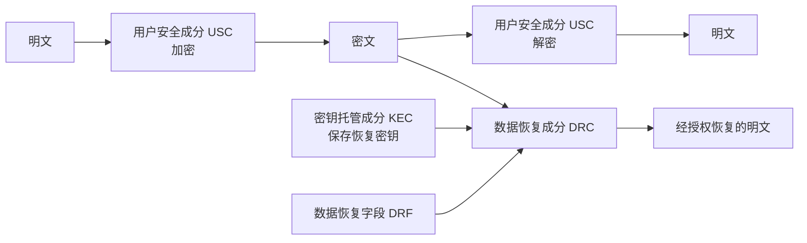

# 9.2 密钥管理（二）

> 本笔记依据“现代密码学第九讲：密钥管理（二）”整理，重点说明 Shamir $(t,n)$ 门限秘密共享、主动与可验证秘密共享、多秘密共享以及密钥托管体制。课件中的多项式曲线、重构过程和托管组件图均已转写为 LaTeX、Mermaid 与文字说明。

## 主要内容

- 秘密共享的参数选取、秘密分割与秘密恢复
- Shamir $(t,n)$ 门限方案及完整数值例题
- 主动秘密共享与份额周期更新
- 可验证秘密共享及其抵御的主动攻击
- 同时、多阶段和任意顺序的多秘密共享
- 密钥托管的目的、用途、历史与组成

---

## 一、秘密共享

### 1. 基本模型

> **秘密共享把秘密 $S$ 分割为 $n$ 个子共享，并分别秘密交给 $n$ 个成员；达到门限的成员可以恢复 $S$，不足门限的成员不能恢复秘密。**

秘密共享方案包含三个算法：

1. 参数选取：  
   根据安全策略确定成员数 $n$ 与门限值 $t$。
2. 秘密分割：  
   将秘密 $S$ 分成 $n$ 个子共享 $s_1,s_2,\ldots,s_n$，分别秘密交给成员。
3. 秘密恢复：  
   输入至少 $t$ 个有效子共享，输出秘密 $S$。

### 2. Shamir 门限方案

> **Shamir 门限方案**由 Shamir 于 1979 年基于有限域上的拉格朗日插值提出。一个次数不超过 $t-1$ 的多项式可由任意 $t$ 个不同点唯一确定，因此任意 $t$ 份共享能够恢复秘密。

**参数选取与秘密分割**：

设秘密为 $S$，共有 $n$ 个成员，要求至少 $t$ 人联合恢复。选取足够大的素数 $p$，并随机选择 $t-1$ 个系数 $c_1,\ldots,c_{t-1}\in\mathbb{Z}_p$，构造：

$$
f(x)\equiv S+c_1x+c_2x^2+\cdots+c_{t-1}x^{t-1}\pmod p.
$$

选取 $n$ 个互不相同且小于 $p$ 的非零整数 $x_1,\ldots,x_n$，计算：

$$
y_i\equiv f(x_i)\pmod p,\qquad s_i=(x_i,y_i).
$$

随后销毁多项式及随机系数，把 $s_i$ 分别安全交给第 $i$ 个成员。

**秘密恢复**：

任取 $t$ 个共享 $(x_k,y_k)$，用拉格朗日插值得到：

$$
f(x)\equiv\sum_{k=1}^{t}y_k\prod_{\substack{j=1\\j\ne k}}^{t}\frac{x-x_j}{x_k-x_j}\pmod p.
$$

秘密是常数项：

$$
S=f(0)\pmod p.
$$

式中的除法在有限域中表示乘以模 $p$ 逆元，而不是普通实数除法。

```mermaid
flowchart LR
  S[秘密 S] --> F[随机构造 t-1 次多项式<br/>f(0)=S]
  F --> P1[共享 s1=(x1,y1)]
  F --> P2[共享 s2=(x2,y2)]
  F --> PN[共享 sn=(xn,yn)]
  P1 --> R[任取至少 t 份]
  P2 --> R
  R --> L[拉格朗日插值]
  L --> O[恢复 S=f(0)]
```

### 3. Shamir 方案例题

**例**：设

$$
S=120114070608,\quad n=5,\quad t=3,\quad p=1234567890133.
$$

随机选择两个系数，得到：

$$
f(x)=120114070608+1206749628665x+482943028839x^2\pmod p.
$$

令 $x_i=1,2,3,4,5$。课件给出的五份共享为：

| 成员 | $x_i$ | $y_i=f(x_i)\bmod p$ |
|---:|---:|---:|
| 1 | 1 | 575238837979 |
| 2 | 2 | 761681772895 |
| 3 | 3 | 679442875356 |
| 4 | 4 | 328522145362 |
| 5 | 5 | 943487473046 |

取第 1、3、5 份进行重构：

$$
\begin{aligned}
f(x)\equiv{}&575238837979\frac{(x-3)(x-5)}{(1-3)(1-5)}\\
&+679442875356\frac{(x-1)(x-5)}{(3-1)(3-5)}\\
&+943487473046\frac{(x-1)(x-3)}{(5-1)(5-3)}\pmod p.
\end{aligned}
$$

化简得到原多项式：

$$
f(x)\equiv482943028839x^2+1206749628665x+120114070608\pmod p.
$$

于是 $f(0)=120114070608=S$。

### 4. 主动秘密共享

长期保存同一组共享会给攻击者足够时间逐个攻破参与者。主动秘密共享通过周期性更新子秘密，使攻击者必须在同一周期内控制达到门限的成员才可能恢复原秘密。

更新时，可构造满足 $g(0)=0$ 的随机 $t-1$ 次多项式，并令：

$$
f'(x)=f(x)+g(x).
$$

因为 $g(0)=0$，所以 $f'(0)=f(0)=S$，秘密不变；各参与者把旧份额 $f(x_i)$ 替换为 $f'(x_i)$ 后，跨周期收集的旧、新份额不能直接组合。

课件例中：

$$
f(x)=x^2-4x+5,\qquad g(x)=x^2-2x,\qquad g(0)=0.
$$

对 $x=3$ 的 Carol，$g(3)=3$，原份额 $f(3)=2$ 更新为 $f'(3)=5$，随后删除旧份额；其他参与者执行同样的本地更新。

### 5. 可验证秘密共享

> **可验证秘密共享（VSS）**使参与者能够验证收到或提交的共享是否一致，从而抵御主动欺骗。

VSS 面向两类攻击：

1. 恶意分发者向不同参与者分配不正确或不一致的子秘密。
2. 恶意参与者在秘密恢复阶段提交伪造共享，以骗取其他成员的份额或破坏恢复。

### 6. 多秘密共享

分发者 $D$ 在参与者集合 $\{P_1,P_2,\ldots,P_n\}$ 中同时共享多个秘密 $\{S_1,S_2,\ldots,S_k\}$，并使每个参与者只需保留一份共享。其安全要求是：已恢复的秘密不得泄露尚未恢复秘密的任何信息。

课件按恢复方式列出三类方案：

| 类型 | 英文与缩写 | 恢复方式 |
|---|---|---|
| 同时多秘密共享 | Simultaneous Multi-secret Sharing Scheme，SMSS | 多个秘密同时恢复 |
| 预定顺序多阶段共享 | Multi-stage Secret Sharing Scheme Recovering Secrets with a Prescribed Order，MSSSPO | 按预定顺序逐阶段恢复 |
| 任意顺序多阶段共享 | Multi-stage Secret Sharing Scheme Recovering Secrets in Any Order，MSSSAO | 可按任意顺序恢复 |

---

## 二、密钥托管

### 1. 目的、用途与起源

> **密钥托管提供一条受控的备用解密途径，使获得授权的恢复方能在规定条件下恢复数据，同时也可在用户密钥丢失或损坏时帮助用户恢复密钥。**

课件提出密钥托管的目的，是在密码技术使用与依法恢复之间建立受控机制，避免绝对不可跟踪的匿名性。其历史背景是美国政府于 1993 年提出 Clipper 计划，并于 1994 年公布采用具有托管功能的托管加密标准 EES（Escrowed Encryption Standard）。

### 2. 体制组成

密钥托管密码体制由三个成分组成：



### 3. 用户安全成分 USC

USC（User Security Component）的作用是提供正常的数据加解密能力并支持密钥托管。它可用于通信数据和存储数据的托管；其加密算法可以是保密的、专用的，也可以采用公开算法。

### 4. 密钥托管成分 KEC

KEC（Key Escrow Component）保存全部数据恢复密钥，并向 DRC 提供恢复所需的数据与服务。托管代理机构是可信第三方，需在密钥托管中心注册；其职责包括操作 KEC、协调多个托管代理，或充当 USC 与 DRC 的联系点。

### 5. 数据恢复成分 DRC

DRC（Data Recovery Component）由 KEC 支持，利用密文以及 DRF（Data Recovery Field，数据恢复字段）中的信息，通过规定的算法、协议和设备恢复明文。DRC 只能在指定且已授权的数据恢复任务中使用。

---

## 本章小结

| 主题 | 核心结论 |
|---|---|
| Shamir 门限方案 | 以 $f(0)=S$ 的 $t-1$ 次多项式分割秘密，任意 $t$ 个点可插值恢复 |
| 份额安全 | 分割后应销毁多项式和随机系数，份额必须分别安全传输与保存 |
| 主动秘密共享 | 以常数项为零的随机多项式周期更新份额，秘密保持不变 |
| 可验证秘密共享 | 检测恶意分发者或参与者提交的不一致、伪造份额 |
| 多秘密共享 | 可按同时、预定顺序或任意顺序恢复多个秘密，且已恢复秘密不应泄露其余秘密 |
| 密钥托管 | USC 负责正常加解密，KEC 保存恢复密钥，DRC 在授权条件下恢复数据 |

上一节：[[现代密码学/笔记/9.1 密钥管理（一）|9.1 密钥管理（一）]]；下一章：[[现代密码学/笔记/10.1 身份鉴别与访问控制协议|10.1 身份鉴别与访问控制协议]]。
