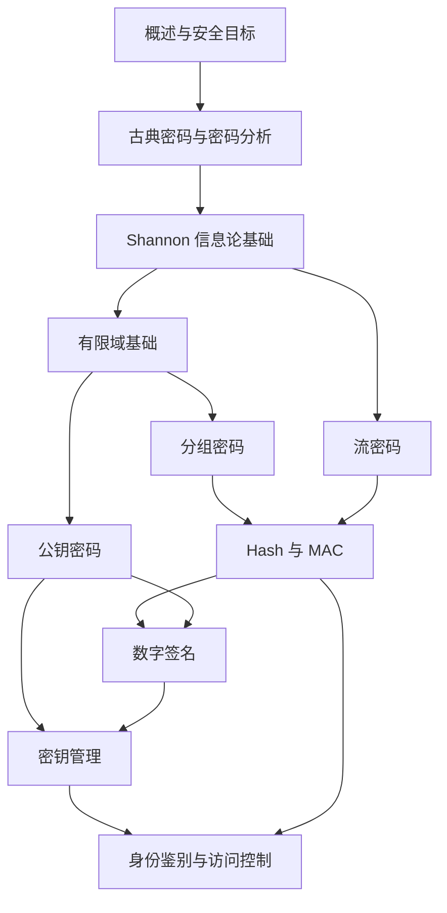

# 现代密码学课程笔记

> [!abstract] 学习主线
> 从密码学目标、古典密码和 Shannon 理论出发，依次掌握分组密码、流密码、杂凑与 MAC、公钥密码、数字签名、密钥管理，以及身份鉴别和访问控制协议。

---

## 一、章节导航

| 章节 | 笔记 | 核心问题 |
|---|---|---|
| 第 1 章 | [[现代密码学/笔记/1.1 现代密码学概述]] | 密码学解决什么问题，经历了怎样的发展 |
| 第 2 章 | [[现代密码学/笔记/2.1 古典密码体制]] | 代换与置换如何构造古典密码 |
| 第 2 章 | [[现代密码学/笔记/2.2 密码分析]] | 如何利用统计规律和密钥空间分析古典密码 |
| 第 3 章 | [[现代密码学/笔记/3.1 密码学基础——Shannon 理论]] | 如何用信息论刻画保密性、冗余度与唯一解距离 |
| 第 4 章 | [[现代密码学/笔记/4.1 有限域基础]] | 分组密码所需的有限域运算如何定义与计算 |
| 第 4 章 | [[现代密码学/笔记/4.2 分组密码（一）]] | 分组密码的设计原则和基本结构是什么 |
| 第 4 章 | [[现代密码学/笔记/4.3 分组密码（二）]] | DES 等典型分组密码如何工作 |
| 第 4 章 | [[现代密码学/笔记/4.4 分组密码（三）]] | AES 与分组密码工作模式如何实现安全加密 |
| 第 5 章 | [[现代密码学/笔记/5.1 流密码（一）]] | 密钥流、移位寄存器与伪随机序列如何构造 |
| 第 5 章 | [[现代密码学/笔记/5.2 流密码（二）]] | 现代流密码方案与安全分析有哪些要点 |
| 第 6 章 | [[现代密码学/笔记/6.1 Hash 函数和 MAC（一）]] | 杂凑函数的性质、结构与攻击是什么 |
| 第 6 章 | [[现代密码学/笔记/6.2 Hash 函数和 MAC（二）]] | MAC 如何提供消息完整性与来源认证 |
| 第 7 章 | [[现代密码学/笔记/7.1 公钥密码学（一）]] | 公钥密码的数学基础和设计思想是什么 |
| 第 7 章 | [[现代密码学/笔记/7.2 公钥密码学（二）]] | RSA 密码体制如何构造、实现与分析 |
| 第 7 章 | [[现代密码学/笔记/7.3 公钥密码学（三）]] | ElGamal 等离散对数体制如何工作 |
| 第 7 章 | [[现代密码学/笔记/7.4 公钥密码学（四）]] | 椭圆曲线密码体制如何以点运算实现公钥加密 |
| 第 8 章 | [[现代密码学/笔记/8.1 数字签名]] | 如何实现可公开验证、不可伪造和不可否认的签名 |
| 第 9 章 | [[现代密码学/笔记/9.1 密钥管理（一）]] | 密钥如何生成、分配、协商并贯穿生命周期管理 |
| 第 9 章 | [[现代密码学/笔记/9.2 密钥管理（二）]] | 秘密共享与密钥托管如何实现受控恢复 |
| 第 10 章 | [[现代密码学/笔记/10.1 身份鉴别与访问控制协议]] | 如何认证实体并依据策略控制资源访问 |

---

## 二、知识结构

---

## 三、建议学习顺序

1. 先读[[现代密码学/笔记/1.1 现代密码学概述|现代密码学概述]]，建立保密性、完整性、认证性和不可否认性等目标。
2. 通过[[现代密码学/笔记/2.1 古典密码体制|古典密码体制]]与[[现代密码学/笔记/2.2 密码分析|密码分析]]理解算法公开、密钥保密和统计攻击的基本思想。
3. 学习[[现代密码学/笔记/3.1 密码学基础——Shannon 理论|Shannon 理论]]，掌握完善保密性、熵、冗余度与唯一解距离。
4. 先掌握[[现代密码学/笔记/4.1 有限域基础|有限域基础]]，再依次学习三节分组密码，串联 DES、AES、设计原则与工作模式。
5. 学习两节流密码，对比“分组变换”与“密钥流异或”两种对称加密路径。
6. 学习两节 Hash 与 MAC，理解单向杂凑、碰撞安全和带密钥认证的差异。
7. 依次完成四节公钥密码，为 RSA、离散对数和椭圆曲线签名及密钥协商打好基础。
8. 学习[[现代密码学/笔记/8.1 数字签名|数字签名]]和两节密钥管理，把公钥算法落实到签名、分配、协商、秘密共享与托管。
9. 最后阅读[[现代密码学/笔记/10.1 身份鉴别与访问控制协议|身份鉴别与访问控制协议]]，把密码原语组合为口令、挑战—应答、零知识、OAuth 和零信任系统。

---

## 四、课件覆盖说明

- 笔记依据 `现代密码学/课件` 中 20 份 PDF 原课件及其 PaddleOCR-VL 转写结果整理。
- 第 4 章“分组密码（二）”有两份内容相同的 OCR Markdown 副本，整理时只按一份来源处理，避免重复。
- 第 6 章“Hash 函数和 MAC（二）”没有 Paddle OCR 转写文件，笔记直接依据 PDF 文本提取和逐页渲染核查整理。
- 所有课件图片均按页面语境核查；流程、结构与协议图改用 Mermaid，表格改用原生管道表格，公式改用 LaTeX，其余图像信息改为可检索文字。
- 最终章节笔记不依赖外部图片、在线图床或 Paddle OCR 的图片链接，可离线阅读和全文检索。

### 整理统计

| 项目 | 数量 | 说明 |
|---|---:|---|
| 原始 PDF 课件 | 20 | 第 1—10 章全部课件文件 |
| PDF 总页数 | 1134 | 按原始 PDF 页面统计 |
| 章节笔记 | 20 | 一个原始 PDF 对应一篇章节笔记 |
| 课程总索引 | 1 | 即本页 |

---

## 五、复习抓手

> [!tip] 四条贯穿课程的线索
> 1. **安全目标**：保密性、完整性、认证性、不可否认性分别需要不同原语，不能相互替代。
> 2. **困难问题**：分解、离散对数和椭圆曲线离散对数为公钥加密、签名与协商提供计算安全基础。
> 3. **组合方式**：分组/流密码保护内容，Hash/MAC 保护完整性和共享密钥认证，签名提供公开验证，协议再组合这些原语。
> 4. **密钥与身份**：算法安全最终落到密钥生命周期、公钥真实性、实体身份和访问策略的正确管理。
