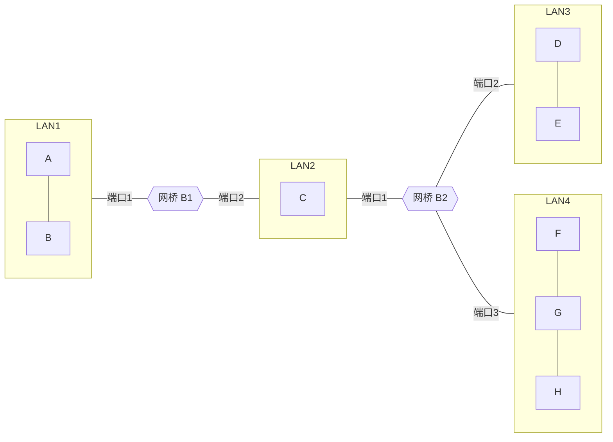

# 2010—2011 学年第一学期计算机网络期末试卷（A 卷）

> 本文由《计算机网络》期末考试原题转换而成，依据原 PDF、PaddleOCR 转写或原始 HTML 页面整理。原题题干、参考答案、协议字段、公式和计算过程均尽量保留，OCR 疑似错误不作无依据改写。

> [!tip] 真题导航
> 下一份：[[2012 年计算机网络期中试卷]]

## 主要内容

- 计算机网络体系结构与性能指标
- 物理层、编码与差错检测
- 数据链路层、滑动窗口与局域网
- 网络层、IP、路由与地址划分
- 传输层、应用层、无线网络与网络安全

---

## 一、转写说明

| 项目 | 内容 |
|---|---|
| 课程 | 计算机网络 |
| 资料类型 | 期末考试真题 |
| 整理日期 | 2026-08-12 |
| 转写原则 | 保留原题及原答案；不擅自修正知识性内容 |

> [!warning] OCR 与答案说明
> 文中可能保留原卷或 OCR 的拼写、符号与答案问题。无答案处不自行补写；图片均已转为 Mermaid、原生表格或文字描述，最终笔记不包含图片。

---

## 二、原题与参考答案
卷）

| 考试科目 | 计算机网络 | 姓名 |  |
|---|---|---|---|
| 考试专业/班级 | 09 数字媒体技术 1-3 班 | 学号 |  |
| 考试形式 | 开卷 | 考试时间 | 120 分钟 |
| 考试注意事项 | 一、学生参加考试须带学生证，未带学生证者不允许参加考试。学生必须按照监考教师指定座位就坐。二、书本、参考资料、书包等与考试无关的东西一律放到监考教师指定的位置。三、学生不得另行携带、使用稿纸，要遵守《北京邮电大学世纪学院考场规则》，有考场违纪或作弊行为者，按相应规定严肃处理。四、学生不允许携带手机进入考场。 |  |  |

注意：所有答案一律写在答题纸上，写在试卷上无效。

### 一、填空题：（共15分，每空1分）

1、OSI七层参考模型中，从最底层到最高层依次是：物理层、（）、（）、会话层、表示层和应用层。

2、计算机网络依据规模分类有（）、（）、个人区域网等。

3、IPv4 地址有（ ），位，IPv6 地址有（ ），位，网-卡物理地址有（ ），位。

4、局域网中常用的传输介质有（）、（）、等。

5、常用的传输层协议有 TCP 协议和（）。

6、FTP 服务器默认工作的端口是（）。

7、电子邮件系统发送电子邮件时采用的协议是（）。

### 二、判断题（共5分，每题1分）

1、使用透明网桥联接局域网，所有的网桥都参与数据帧的转发。（

2、ADSL 不需要像 MODEM 那样把数字信号调制成模拟信号，而是直接在本地回路传输数字信号，因此通信速度比 MODEM 更快。（

3、常用的UTPS电缆中有四对双绞线，快速以太网只使用了其中的两对。

( )

4、RIP 是因特网上域间路由选择协议的一种。（

5、WWW是TCP/IP协议栈中的一个应用层协议。（

### 三、单项选择题（共15分，每题1.5分）

1、在因特网标准的制定第四个阶段中，哪个阶段的不是RFC文档（

A. 因特网草案 B. 建议标准 C. 草案标准 D. 因特网标准

2、在下列传输介质中，哪一种错误率最低？

A. 同轴电缆 B. 光纤 C. 微波 D. 双绞线

3、采用高速卫星链路通信时造成总时延较大的最可能的因素是？（

A. 发送时延 B. 传播时延 C. 处理时延 D. 排队时延

4、若调制速率为400波特，采用16相相位调整，且则其位传输率为（）

A. 6400b/s B. 3200b/s C. 1600b/s D. 800b/s

5、为了检测出 d 个比特错，需要使用汉明距离为（）的编码.

A. d B.  $d+1$ C.  $d+2$ D.  $2d+1$.

6、解析IP地址得到MAC地址的协议时？

A. ICMP B. ARP C. DNS D. DHCP

7、IP路由器属于哪一层的互联设备？

A. 物理层 B. 链路层 C. 网络层 D. 传输层

8、以下哪个不可能是某台主机分配到的IP地址？

A. 59.64.12.4 B. 5.45.3.5 C. 225.31.5.2 D. 202.78.2.6

9、使用命令 ping www.baidu.com 测试到百度网站的连通性，使用了下列哪个协议？

A. ICMP B. HTTP C. TCP D. DHCP

10、在ICANN划分的顶级通用域名中，表示国际组织的是？

A. .com B. .int C. .gov D. .edu

### 四、简答与计算题（共65分）

### 1. （10分）

在计算机网络课程的学习中，我们更常采用的是综合了OSI和TCP/IP优点的五层协议体系结构，请画出这五层协议体系结构的参考模型，并简要说明各层协议的功能、数据在各层间的传递过程以及实体、服务、接口三个概念的含义。

### 2. （10分）

简述数据链路层需要解决的三个基本问题。

3. （10分）

简述集线器、网桥、交换机、路由器的区别。

### 4. (7分.)

零比特填充法是在数据链路层实现透明传输的一种做法，比如我们设定0111110 作为帧起始与结束标志，那么就需要进行零比特填充来保证传输的内容比特串不会出现6个0的情况，请回答下面两问。

（1）如果想发送比特串 0101 1111 1011 1110，填充之后应该变成怎样的比特串？

（2）如果接收到一个比特串0010 1011 1110 1101 01，请问发送

方真实想发送的比特串是什么？

### 5. （8分）

收发两端之间的传输距离为 1000km，信号在媒体上的传播速率为  $2 \times 10^{8} m/s$，试计算以下两种情况时延和传播时延。

（1）数据长度为  $10^{6}$ bit，数据发送速率为 50 kb/s

（2）数据长度为  $10^{3}$ bit，数据发送速率为  $100 Mbit/s$

从以上计算结果可得到什么结论？

### 6. （10分）

一台路由器的路由表如下表所示：

对于下面的每一个地址，请回答，如果到达的数据报目标地址为该 IP 地址，那么路由器将执行什么处理？

(1) 135.46.63.10 (2) 135.46.57.14

（3）135.46.52.2

(4)192.53.40.7

| 目的网络地址 | 子网掩码 | 下一跳 |
|---|---|---|
| 135.46.56.0 | 255.255.252.0 | 接口1 |
| 135.46.60.0 | 255.255.252.0 | 接口2 |
| 192.53.40.0 | 255.255.254.0 | 路由器2 |
| 默认 | ... | 路由器3 |

(5) 192.53.56.7

### 7. （10分）

下图拓扑结构中网桥为透明网桥，网桥B1有2个端口，分别为LAN1和LAN2，网桥B2有三个端口，分别为LAN2、LAN3和LAN4，主机的次序如下：

(1). A 发送一个帧给 C

(2) E 发送一个帧给 A

(3) D 发送一个帧给 E.

（4）H 发送一个帧给 B

（5）C 发送一个帧给 H

假设开始时每个网桥站表均为空且表项均不超时，请写出这一过程中网桥所进行的处理以及网桥站表的变化

> [!note] 原图转写：双网桥连接四个局域网
> LAN1 上有主机 A、B，网桥 B1 的端口 1 连接 LAN1、端口 2 连接 LAN2；LAN2 上有主机 C，并连接网桥 B2 的端口 1；B2 的端口 2 连接含主机 D、E 的 LAN3，端口 3 连接含主机 F、G、H 的 LAN4。

| 发送的帧 | 网桥B1站表 | 网桥B2站表 | 网桥B1的处理（转发？丢弃？登记？） | 网桥B2的处理（转发？丢弃？登记？） |  |
|---|---|---|---|---|---|
| 站 | 端口 | 站 | 端口 |  |  |
| A->C |  |  |  |  |  |
| E->A |  |  |  |  |  |
| D->E |  |  |  |  |  |
| H->B |  |  |  |  |  |
| C->H |  |  |  |  |  |

| 发送的帧 |  |
|---|---|
| 站 |  |
| A->C |  |
| E->A |  |
| D->E |  |
| H->B |  |
| C->H |  |

---

## 本章小结

| 层次或主题 | 常见考点 |
|---|---|
| 体系结构与物理层 | 分层模型、时延、带宽、编码与信道容量 |
| 数据链路层 | 检错纠错、滑动窗口、MAC、网桥与交换机 |
| 网络层 | IPv4、子网、路由、分片与 ICMP |
| 传输与应用层 | TCP/UDP、拥塞控制、DNS、HTTP 与可靠传输 |
| 无线与安全 | 隐藏站、RTS/CTS、加密认证与攻击分析 |

> [!tip] 真题导航
> 下一份：[[2012 年计算机网络期中试卷]]
