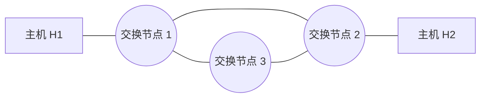

# 2012 年计算机网络期中试卷

> 本文由《计算机网络》期中考试原题转换而成，依据原 PDF、PaddleOCR 转写或原始 HTML 页面整理。原题题干、参考答案、协议字段、公式和计算过程均尽量保留，OCR 疑似错误不作无依据改写。

> [!tip] 真题导航
> 上一份：[[2010—2011 学年第一学期计算机网络期末试卷（A 卷）]]；下一份：[[2013—2014 学年第二学期计算机网络期中试卷]]

## 主要内容

- 计算机网络体系结构与性能指标
- 物理层、编码与差错检测
- 数据链路层、滑动窗口与局域网
- 网络层、IP、路由与地址划分
- 传输层、应用层、无线网络与网络安全

---

## 一、转写说明

| 项目 | 内容 |
|---|---|
| 课程 | 计算机网络 |
| 资料类型 | 期中考试真题 |
| 整理日期 | 2026-08-12 |
| 转写原则 | 保留原题及原答案；不擅自修正知识性内容 |

> [!warning] OCR 与答案说明
> 文中可能保留原卷或 OCR 的拼写、符号与答案问题。无答案处不自行补写；图片均已转为 Mermaid、原生表格或文字描述，最终笔记不包含图片。

---

## 二、原题与参考答案
### 2012 计算机网络期中考试

学号：___ 姓名：___

1、（10分）分析计算

（1）已知从信道上收到下列数据位序列：110101111110011111101101111000101

HDLC 使用比特填充法成帧，帧定界符为 011111110，在帧的内容中若出现连续的 5 个 1，则立即插入 1 个 0，则应该去掉加入的 0，完整的帧中的内容为：

1101 1011 1110 0101 1000 1011 1111 0110

D B E 5 8 B F 6

（2）一个PPP帧的数据部分用十六进制表示为：7D5EFE277D5D7D5E。请问真正的数据是什么？用十六进制表示。

7E FE 27 7D 7D 65 7E

2、（5分）在下图所示的采用“存储-转发”方式分组的交换网络中，所有链路的数据传输速度为100mbps，分组大小为1000B，其中分组头大小20B，若主机H1向主机H2发送一个大小为980000B的文件，则在不考虑分组拆装时间和传播延迟的情况下，从H1发送到H2接收完为止，需要的时间至少是（）

> [!note] 原图转写：存储—转发分组交换网络
> 两台端系统分别位于网络左右两端，中间有三个分组交换节点。左右端系统之间的最短路径经过上方两个交换节点，共包含三条串行链路；第三个交换节点位于下方，并分别与上方两个交换节点相连，构成三角形交换核心。

答：80.16ms. (1002 个  $t_{f}$)

3、（3分）

若某通信链路的数据传输速率为2400bps，采用4相位调制，则该链路波特率是(

答案：1200

4、（5分）计算并分析过程。

数据链路层采用选择重传协议（SR）传输数据，发送方已发送了0~3号数据帧，现已收到1号帧的确认，而0、2号帧依次超时，则此时需要重传的帧数是（）。

答案：2 帧

5、请写出采用调制解调器（MODEM）拨号上网时，什么因素限制了调制解调器的带宽？为什么拨号上网的上行和下载速度不相同？

上行时受到模拟转变数字信号的信噪比影响，根据香农公式，会受到限制，而下行不受这个限制。

6、请按照带宽从大到小排列下列传输介质：粗缆、双绞线、光纤？并写出双绞线的两根电缆互相拆除线道主要目的是什么？

双绞线、细缆、粗缆、光缆

防止干扰。

7、假设你为卫星站的一个 1Mbps 点到点链路设计一个滑动窗口协议，卫星在  $3 \times 10^{4} km$ 的高度绕地球旋转。假设每帧携带 1KB 数据，在下述情况下，最少需要多少比特作序号？假设光速为  $3 \times 10^{8} m/s$；假设不使用捎带确认，确认帧很短。（a）RWS = 1 （b）RWS = SWS

链路的单程延迟是 100ms，带宽×往返延迟大约是 125 分组/s×0.2s 或者 25 个分组。SWS 应该这么大。

(a) 如果 RWS = 1，必须的序号空间是 26，因此需要 5 比特。

(b) 如果 RWS = SWS，序号空间必须覆盖 SWS 两倍，或者到 50，因此需要 6 比特。

8、卫星信道的数据率为 1Mbps。取卫星信道的单程传播时延为 0.25 秒。每一个数据帧长度都是 2000bit。忽略误码率、确认帧长和处理时间。忽略帧首部长度对信道利用率的影响。试计算下列情况下的信道利用率？

（1）停等协议 （2）GO BACK N 协议，Ws=127 （3）GO BACK N 协议，Ws=255

利用率  $U = W/(1 + 2a)$，(1) U = 1/251 (2) 127/251 (3) U = 1

9、对于下列两种情况，画出 SWS = RWS = 4 帧的滑动窗口算法的时间线图。假设接收方在未收到期望的帧时发送一个重复确认帧。例如，当它希望看到 FRAME[2]却收到 FRAME[3]时，它发送 DUPACK[2]。当接收方收到一系列帧时也发送一个累积的确认。例如，当它在收到 FRAME[3]，FRAME[4]和 FRAME[5]之后又收到丢失的 FRAME[2]，它发送 ACK[5]。使用的超时间隔大约为 2xRTT。

a) 帧2丢失，超时之后重传（如通常一样）。

b) 帧 2 丢失，在收到第一个 DUPACK 或超时之后重传。这种方法减少处理时间吗？注意为了快速重传，某些端到端的协议（如 TCP 的变种）使用类似的方法。

见后面图。

### 10. 分析并计算

（1）分析 T1 的复用原理，并详解 T1 的速率？

（2）在 50kHz 的线路上使用 T1 线路需要多大的信噪比？

（1）T1 的速率  $1.544 \times 10^{6}$;

（2）利用香农公式，得93分贝。

> [!note] 原图转写：滑动窗口重传时序
> 发送方连续发送 FRAME[1]、FRAME[2]、FRAME[3] 等帧，其中一个帧或确认丢失（原图以叉号标出）。接收方返回 ACK 与重复 ACK；发送方依据超时或重复确认重传，从时序图可比较超时重传与快速重传对完成时间（RTT 数）的影响。

> [!note] 原图转写：滑动窗口重传时序
> 发送方连续发送 FRAME[1]、FRAME[2]、FRAME[3] 等帧，其中一个帧或确认丢失（原图以叉号标出）。接收方返回 ACK 与重复 ACK；发送方依据超时或重复确认重传，从时序图可比较超时重传与快速重传对完成时间（RTT 数）的影响。

---

## 本章小结

| 层次或主题 | 常见考点 |
|---|---|
| 体系结构与物理层 | 分层模型、时延、带宽、编码与信道容量 |
| 数据链路层 | 检错纠错、滑动窗口、MAC、网桥与交换机 |
| 网络层 | IPv4、子网、路由、分片与 ICMP |
| 传输与应用层 | TCP/UDP、拥塞控制、DNS、HTTP 与可靠传输 |
| 无线与安全 | 隐藏站、RTS/CTS、加密认证与攻击分析 |

> [!tip] 真题导航
> 上一份：[[2010—2011 学年第一学期计算机网络期末试卷（A 卷）]]；下一份：[[2013—2014 学年第二学期计算机网络期中试卷]]
