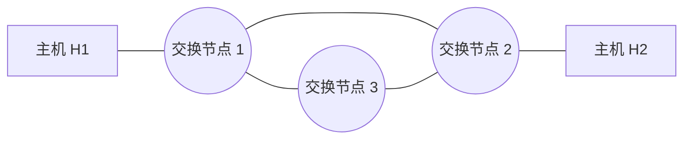

# 2014 年计算机网络期中试卷

> 本文由《计算机网络》期中考试原题转换而成，依据原 PDF、PaddleOCR 转写或原始 HTML 页面整理。原题题干、参考答案、协议字段、公式和计算过程均尽量保留，OCR 疑似错误不作无依据改写。

> [!tip] 真题导航
> 上一份：[[2013—2014 学年第二学期计算机网络期中试卷]]；下一份：[[2015 年计算机网络期中试卷]]

## 主要内容

- 计算机网络体系结构与性能指标
- 物理层、编码与差错检测
- 数据链路层、滑动窗口与局域网
- 网络层、IP、路由与地址划分
- 传输层、应用层、无线网络与网络安全

---

## 一、转写说明

| 项目 | 内容 |
|---|---|
| 课程 | 计算机网络 |
| 资料类型 | 期中考试真题 |
| 整理日期 | 2026-08-12 |
| 转写原则 | 保留原题及原答案；不擅自修正知识性内容 |

> [!warning] OCR 与答案说明
> 文中可能保留原卷或 OCR 的拼写、符号与答案问题。无答案处不自行补写；图片均已转为 Mermaid、原生表格或文字描述，最终笔记不包含图片。

---

## 二、原题与参考答案
学号：___ 姓名：___

### 1、（20分）分析计算

（1）已知从信道上收到下列数据位序列：0111 1110 1101 1011 1110 0010 1100 0101 1111 0101 1001 1111 1001 1111 1001 1111 1001 1111 1100 1111 1100，其中包含完整的 HDLC 帧，请以十六进制数字写出帧的内容（不包含帧首尾标志）。（2分）

DB E5 8B F6

7B EF

（2）已知数据位流为 1101 0110，采用 CRC 校验， $G(x)=x3+1$，请计算出校验位（要求写出计算过程）。（2分）

1101 0110（1分） 111（1分）

（3）若使用海明码传输 8 位的报文，并且能够纠正单个比特的错误，海明码中使用奇校验，计算发送 11100011 时的校验位，写出发送的比特流（要求写出计算过程）。（3 分）

0001（1分）

001001111001（2分）

（4）一个 PPP 帧的数据部分用十六进制表示为：7D 5E FE 27 7D 5D 7D 5D 65 7D 5E。请问真正的数据是什么？用十六进制表示。

7E FE 27 7D 7D 65 7E

2、（5分）在下图所示的采用“存储-转发”方式分组的交换网络中，所有链路的数据传输速度为100mbps，分组大小为1000B，其中分组头大小20B，若主机H1向主机H2发送一个大小为980000B的文件，则在不考虑分组拆装时间和传播延迟的情况下，从H1发送到H2接收完为止，需要的时间至少是多少？

> [!note] 原图转写：存储—转发分组交换网络
> 两台端系统分别位于网络左右两端，中间有三个分组交换节点。左右端系统之间的最短路径经过上方两个交换节点，共包含三条串行链路；第三个交换节点位于下方，并分别与上方两个交换节点相连，构成三角形交换核心。

答：80.16ms. (1002 个  $t_{f}$)

3、（8分）计算并分析过程。

（1）数据链路层采用 Go Back N 协议，发送方已经发送了编号为 0-6 的帧，当定时器超时的时候，发送方只收到应答序号为 0、1 和 5 的确认帧，则发送方需要重发的帧数是多少？重发的帧编号是多少？

(2) 数据在SR连接性协议(SR)传输发送方式发送的已收到信号的确认，而0、2与协议头同时到达的地址

5、（5分）请写出采用调制解调器（MODEM）拨号上网时，什么因素限制了调制解调器的带宽？简述ADSL的工作原理？

> [!note] 图片判断
> 该图为扫描过程中产生的装饰性对话框/标记，不增加新的网络知识信息，故未保留。

上行时受到模拟转变数字信号的信噪比影响，根据香农公式，会受到限制，而下行不受这个限制。

6、（9分）请按照带宽从大到小排列下列传输介质：粗缆、细缆、双绞线、光纤？并写出双绞线的两根电缆互相拆绕道主要目的是什么？为什么相同类型的设备如计算机需要使用交叉线（反线）互联？

> [!note] 图片判断
> 该图为扫描过程中产生的装饰性对话框/标记，不增加新的网络知识信息，故未保留。

双绞线、细缆、粗缆、光缆

防止干扰。

> [!note] 图片判断
> 该图为扫描过程中产生的装饰性对话框/标记，不增加新的网络知识信息，故未保留。

7、（20分）两台计算机的数据链路层采取滑动窗口机制，用64 kbps的卫星信道传输长度为256字节的数据帧，信道传播时延为270ms。应答帧长度和帧头开销忽略不计。回答下列问题：

1）使用停等协议的信道利用率；

2）使用发送窗口为7的 Go-Back-N 协议的信道利用率；

3）为使信道利用率达到 100%，使用 Go-Back-N 协议时发送窗口大小至少是多少？

4）为使信道利用率达到最高，使用 Go-Back-N 协议时序号至少为多少位？使用选择重传协议时序号至少为多少位？

树上习题。

8、（10分）对于下列两种情况，画出  $SWS = RWS = 4$ 帧的滑动窗口算法的时间线图。假设接收方在未收到期望的帧时发送一个重复确认帧。例如，当它希望看到 FRAME[2]却收到 FRAME[3]时，它发送 DUPACK[2]。当接收方收到一系列帧时也发送一个累积的确认。例如，当它在收到 FRAME[3]，FRAME[4]和 FRAME[5]之后又收到丢失的 FRAME[2]，它发送 ACK[5]。使用的超时间隔大约为 2xRTT。

a) 帧2丢失，超时之后重传（如通常一样）。

b) 帧 2 丢失，在收到第一个 DUPACK 或超时之后重传。这种方法减少处理时间吗？注意为了快速重传，某些端到端的协议（如 TCP 的变种）使用类似的方法。

见后面图。

### 9、（20分）分析并计算

（1）分析 T1 的复用原理，并详解 T1 的速率？

（2）在 50kHz 的线路上使用 T1 线路需要多大的信噪比？

（1）T1 的速率  $1.544 \times 10^{6}$;

（2）利用香农公式，得93分贝。

10、（3分）下列哪项不属于网络体系结构必须规范的内容，并说明原因。C

A. 分层 B. 对等层通信协议 C. 上下层之间的接口 D. 下层对上层提供的服务

> [!note] 原图转写：滑动窗口重传时序
> 发送方连续发送 FRAME[1]、FRAME[2]、FRAME[3] 等帧，其中一个帧或确认丢失（原图以叉号标出）。接收方返回 ACK 与重复 ACK；发送方依据超时或重复确认重传，从时序图可比较超时重传与快速重传对完成时间（RTT 数）的影响。

> [!note] 原图转写：滑动窗口重传时序
> 发送方连续发送 FRAME[1]、FRAME[2]、FRAME[3] 等帧，其中一个帧或确认丢失（原图以叉号标出）。接收方返回 ACK 与重复 ACK；发送方依据超时或重复确认重传，从时序图可比较超时重传与快速重传对完成时间（RTT 数）的影响。

---

## 本章小结

| 层次或主题 | 常见考点 |
|---|---|
| 体系结构与物理层 | 分层模型、时延、带宽、编码与信道容量 |
| 数据链路层 | 检错纠错、滑动窗口、MAC、网桥与交换机 |
| 网络层 | IPv4、子网、路由、分片与 ICMP |
| 传输与应用层 | TCP/UDP、拥塞控制、DNS、HTTP 与可靠传输 |
| 无线与安全 | 隐藏站、RTS/CTS、加密认证与攻击分析 |

> [!tip] 真题导航
> 上一份：[[2013—2014 学年第二学期计算机网络期中试卷]]；下一份：[[2015 年计算机网络期中试卷]]
