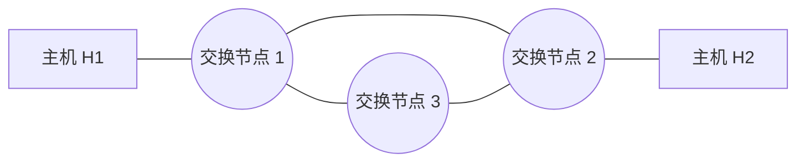

# 2015 年计算机网络期中试卷

> 本文由《计算机网络》期中考试原题转换而成，依据原 PDF、PaddleOCR 转写或原始 HTML 页面整理。原题题干、参考答案、协议字段、公式和计算过程均尽量保留，OCR 疑似错误不作无依据改写。

> [!tip] 真题导航
> 上一份：[[2014 年计算机网络期中试卷]]；下一份：[[2016 年计算机网络期中试卷]]

## 主要内容

- 计算机网络体系结构与性能指标
- 物理层、编码与差错检测
- 数据链路层、滑动窗口与局域网
- 网络层、IP、路由与地址划分
- 传输层、应用层、无线网络与网络安全

---

## 一、转写说明

| 项目 | 内容 |
|---|---|
| 课程 | 计算机网络 |
| 资料类型 | 期中考试真题 |
| 整理日期 | 2026-08-12 |
| 转写原则 | 保留原题及原答案；不擅自修正知识性内容 |

> [!warning] OCR 与答案说明
> 文中可能保留原卷或 OCR 的拼写、符号与答案问题。无答案处不自行补写；图片均已转为 Mermaid、原生表格或文字描述，最终笔记不包含图片。

---

## 二、原题与参考答案
学号：___ 姓名：___

### 1、（15分）分析计算

（1）已知从信道上收到下列数据位序列：0111 1110 1101 1011 1110 0010 1100 0101 1111 0101 1001 1111 1001 1111 1001 1110 1111 1110 1111 1100，其中包含完整的 HDLC 帧，请以十六进制数字写出帧的内容（不包含帧首尾标志）。（3分）

DB E5 8B F6

7B EF

（2）已知数据位流为 101110，采用 CRC 校验， $G(x)=x3+1$，请计算出发送的位流（要求写出计算过程）。（3分）

101110011

（3）若使用海明码传输 8 位的报文，并且能够纠正单个比特的错误，海明码中使用奇校验，计算发送 11100011 时的校验位，写出发送的比特流（要求写出计算过程）。（3分）

0001（1分）

0010 1101 0011（5分）

（4）用户欲发送的数据部分用十六进制表示为 7E FE 27 7D 65 7E，则在信道上使用 PPP 协议的首位字节填充帧方式发送，则完整的发送帧是什么？用十六进制表示。（3分）

7E 7D 5E FE 27 7D 5D 7D 5D 65 7D 5E 7E

（5）PPP 协议使用同步传输技术传输比特串 01101111111100。试问经过零比特填充后变成怎样的比特串？若接收端接收到的 PPP 帧数据部分是 00011110111110110，问删除发送端加入的零比特后变成怎样的比特串？（3 分）

解答：原始比特串：01101111 1111 00

零比特填充后：011011110 11110 00

000111011110 11110110=>

00011101111

2、（5分）在下图所示的采用“存储-转发”方式分组的交换网络中，所有链路的数据传输速度为100mbps，分组大小为1000B，其中分组头大小20B，若主机H1向主机H2发送一个大小为980000B的文件，则在不考虑分组拆装时间和传播延迟的情况下，从H1发送到H2接收完为止，需要的时间至少是多少？

> [!note] 原图转写：存储—转发分组交换网络
> 两台端系统分别位于网络左右两端，中间有三个分组交换节点。左右端系统之间的最短路径经过上方两个交换节点，共包含三条串行链路；第三个交换节点位于下方，并分别与上方两个交换节点相连，构成三角形交换核心。

答：80.16ms. (1002 个  $t_{f}$)

3、（10分）计算并分析过程。

（1）数据链路层采用 Go Back N 协议，发送方已经发送了编号为 0-8 的帧，当计时器超时，若发送方已收到应答序号为 0、1 和 6 的确认帧，则发送方需要重发的帧数是多少个？

2) 数据处理协议（SR）发送方已收到已收到确认，而0、2号协议在处理时的数是

2个

5、（10分）

（1）为什么调制解调器通常的上行和下行速率不一致？那个速率高？

（2）为什么普通的电话线无法传送计算机网络数据，而采用了ADSL电话线就可以传送？

(1) 上行时受到模拟转变数字信号的信噪比影响，根据香农公式，会受到限制，而下行不受这个限制。

(2) ADSL 使用的电缆扩展了普通电话使用的带宽到 3400 以上

6、（5分）请按照带宽从大到小排列下列传输介质：粗缆、细缆、双绞线、光纤？并写出双绞线的两根电缆互相拆绕道主要目的是什么？为什么相同类型的设备如计算机需要使用交叉线（反线）互联？

双绞线、细缆、粗缆、光缆

防止干扰。

7、（15分）两台计算机的数据链路层协议实体采取滑动窗口机制，利用128kbps的卫星信道传输长度为1024字节的数据帧，信道单向传播时延为270ms。应答帧长度和帧头开销忽略不计。回答下列问题：

（1）计算使用停等协议的信道利用率；

（2）计算使用发送窗口为7的Go-Back-N协议的信道利用率；

(3) 为使信道利用率达到 100%，使用 Go-Back-N 协议时发送窗口至少是多少？帧头中的序号字段至少为多少比特？

一帧的发送时间为：1024*8/128000=64ms

窗口边界：

1+往返传播时延）/帧发送时间

即窗口边界  $1+270 \times 2/64 = 9.4375$，向上取整为 10。

1）1/9.4375=10.6%；2分

2）7/9.4375=74.2%；2分

3）10：2分

序号比特数至少为4。1分

8、（10分）在数据链路层中，两台主机利用停等协议实现可靠的数据传输。其中，数据帧中使用了1比特的序号位。为了节约网络带宽，如果取消数据帧中的序号位，是否仍可以保证可靠的通信？请阐述原因。

不能。会产生诸如重复帧问题。

9、（10分）分析并计算

（1）阐述并比较 FDM、TDM 和 CDMA 的复用原理。

（2）对于一个带宽为 3kHz，信噪比为 30dB 的 802.3 以太网信道，请计算该信道的最大数据传输率 C？

(2)  $C_{1}=W*log_{2}(1+S/N)=3000*log_{2}(1+1000)=3000*log_{2}1001 \approx 30000bps$

 $C_{2}=2H=6000Baud$，则由于802.3的以太网信道使用了曼彻斯特编码，所以速率=3000bps，则 $C=30000bps$。

10、（5分）

（1）分别写出 OSI 网络体系结构和 TCP/IP 体系结构，并简写出每层的功能；

（2）请写出计算机网络层次化设计方法的设计原则；

（3）下列哪项不属于网络体系结构必须规范的内容，并说明原因。C

A. 分层 B. 对等层通信协议 C. 上下层之间的接口 D. 下层对上层提供的服务

11、（5分）长度为100字节的应用层数据交给运输层传送，需加上20字节的TCP首部，再交给网络层，需加上20字节的IP首部，最后交给数据链路层的以太网传送，需加上首部和尾部共18字节。试求数据的传输效率。数据的传输效率是指发送的应用层数据除以所发送的总数据（即应用数据加上各种首部和尾部的额外开销）。若应用层数据长度为1000字节，这数据的传输效率是多少？针对上述情况，请给出方案以提高信道的利用率？

100/（100+20+20+18）=100/158=63.3%

1000/（1000+20+20+18）=1000/1058=94.5%

增加发送的字节，或使用滑动窗口技术。

---

## 本章小结

| 层次或主题 | 常见考点 |
|---|---|
| 体系结构与物理层 | 分层模型、时延、带宽、编码与信道容量 |
| 数据链路层 | 检错纠错、滑动窗口、MAC、网桥与交换机 |
| 网络层 | IPv4、子网、路由、分片与 ICMP |
| 传输与应用层 | TCP/UDP、拥塞控制、DNS、HTTP 与可靠传输 |
| 无线与安全 | 隐藏站、RTS/CTS、加密认证与攻击分析 |

> [!tip] 真题导航
> 上一份：[[2014 年计算机网络期中试卷]]；下一份：[[2016 年计算机网络期中试卷]]
