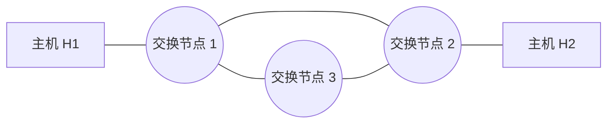
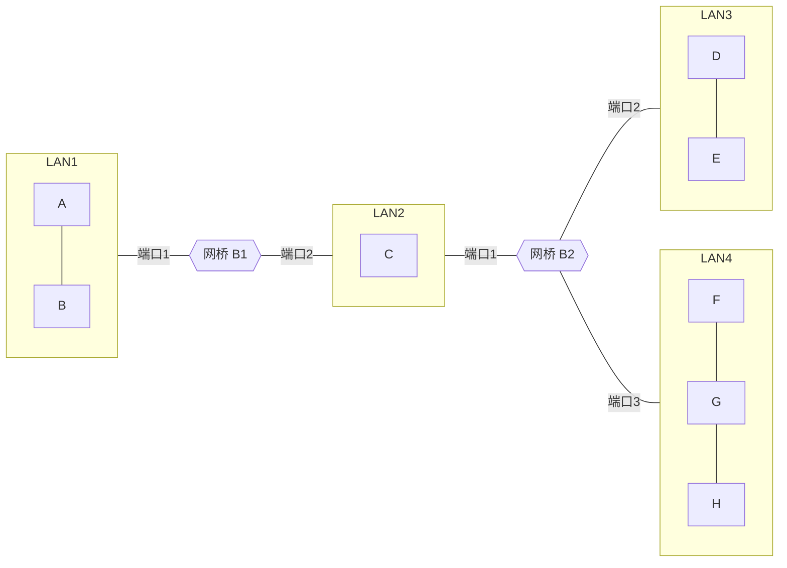

# 2018 年计算机网络期中试卷

> 本文由《计算机网络》期中考试原题转换而成，依据原 PDF、PaddleOCR 转写或原始 HTML 页面整理。原题题干、参考答案、协议字段、公式和计算过程均尽量保留，OCR 疑似错误不作无依据改写。

> [!tip] 真题导航
> 上一份：[[2017 年计算机网络期中试卷]]；下一份：[[2019 年计算机网络期中试卷]]

## 主要内容

- 计算机网络体系结构与性能指标
- 物理层、编码与差错检测
- 数据链路层、滑动窗口与局域网
- 网络层、IP、路由与地址划分
- 传输层、应用层、无线网络与网络安全

---

## 一、转写说明

| 项目 | 内容 |
|---|---|
| 课程 | 计算机网络 |
| 资料类型 | 期中考试真题 |
| 整理日期 | 2026-08-12 |
| 转写原则 | 保留原题及原答案；不擅自修正知识性内容 |

> [!warning] OCR 与答案说明
> 文中可能保留原卷或 OCR 的拼写、符号与答案问题。无答案处不自行补写；图片均已转为 Mermaid、原生表格或文字描述，最终笔记不包含图片。

---

## 二、原题与参考答案
### 2018 计算机网络期中考试

学号：___ 姓名：___

一、（20分）回答下列有关校验、纠错及成帧的问题。

1. 采用 CRC 校验，生成多项式  $G(x)=x^{3}+1$，如果接收方收到的比特流为 101010011，该比特流中校验位为多少比特？判断传输过程中是否发生差错（要求写出计算过程）。

（3位；是发生错误）2分1001|1010100113分

 $$\begin{aligned}&1001\\ &\\ &\begin{aligned}\\ &1110\\&1001\\ &\end{aligned}\\ &\\ &\begin{aligned}\\ &1110\\&1001\\ &\end{aligned}\\ &\\ &\begin{aligned}\\ &1111\\&1001\\ &\end{aligned}\\ &\\ &\begin{aligned}\\ &1101\\&1001\\ &\end{aligned}\\ &\\ &\begin{aligned}\\ &100\\&100\\ &\end{aligned}\\ \end{aligned}$$

2. 采用比特填充法成帧，接收端收到下列比特串：

0111 1110 0111 1110 0111 0101 1101 0101 0101

1101 1111 0011 1011 1111 0011 1111 0111 0100

（1）在上述比特串中标出帧标志；

（2）用16进制格式写出帧内容。

3. 若使用海明码传输 8 位的报文，并且能够纠正单个比特的错误，海明码中使用奇校验，计算发送 1110 0011 时的校验位，写出发送的比特流（要求写出计算过程）。（3 分）

0001（1分）

0010 1101 0011（5分）

4. 采用字符填充法发送下列信息: A B C ESC ESC FLAG D, 其中帧标志和转义字符分别为 FLAG 和 ESC, 写出填充后包含帧标志的信息。

### FLAG A B C ESC ESC ESC ESC ESC ESC FLAG D FLAG （3分）

5. 链路层提高差错检错能力的一种方法是把数据分成 n 行 k 列的数据矩阵传输，每行和列各加一个奇偶校验位，矩阵右下角的校验位对列进行校验。若发送的数据为 255 个 16 进制数，即行数为 255，列数为 8；校验后的数据矩阵为 256 行 9 列。计算校验位的比特数。这种校验方法是否可以检查 3 和 4 比特差错？请说明理由。

不一定。

### 二、计算并分析协议过程（10分）

1. 在下图所示的采用“存储-转发”方式分组的交换网络中，所有链路的数据传输速度为100mbps，分组大小为1000B，其中分组头大小20B，若主机H1向主机H2发送一个大小为980000B的文件，则在不考虑分组拆装时间和传播延迟的情况下，从H1发送到H2接收完为止，需要的时间至少是多少？

> [!note] 原图转写：存储—转发分组交换网络
> 两台端系统分别位于网络左右两端，中间有三个分组交换节点。左右端系统之间的最短路径经过上方两个交换节点，共包含三条串行链路；第三个交换节点位于下方，并分别与上方两个交换节点相连，构成三角形交换核心。

答：80.16ms. (1002 个 t_f)

2. 数据链路层采用 Go Back N 协议，发送方已经发送了编号为 0-8 的帧，当计时器超时，若发送方已收到应答序号为 0、1 和 6 的确认帧，则发送方需要重发的帧数是多少个？2 个

### 三、（10分）

1. 设源主机与目的主机之间为 h 跳链路，待传输的报文总长度为 L 比特。若采用电路交换方式传送，电路建立时间为 s 秒；若采用分组方式传送，每个分组长度为 p 比特（p≤L）。假设数据

速率为 b 比特/秒，传播时延为每跳 t 秒。

1）计算分组交换和电路交换的时延；

2）分析分组交换的时延比电路交换小的条件是什么？

答：1)电路交换的时延  $s + L/b + ht$

分组交换的时延  $L/b + ht + (h-1)p/b$

2) L/b + ht + (h-1)p/b  [!note] 原图转写：双网桥连接四个局域网
> LAN1 上有主机 A、B，网桥 B1 的端口 1 连接 LAN1、端口 2 连接 LAN2；LAN2 上有主机 C，并连接网桥 B2 的端口 1；B2 的端口 2 连接含主机 D、E 的 LAN3，端口 3 连接含主机 F、G、H 的 LAN4。

答：网桥 B1 的站表都是：

| 目的地 | LAN 号 |
|---|---|
| A | LAN1 |
| F | LAN2 |

网桥 B2 站表都是：

| 目的地 | LAN 号 |
|---|---|
| A | LAN2 |
| F | LAN4 |

### 九、共享协议（10分）

1. 以太网帧必须在 64 字节以上，这样做的理由是：当电缆的另一端发生冲突的时候，传送方仍然还在发送过程中。快速以太网也有同样的 64 字节最小帧的限制，但它是以快 10 倍的速度发送数据。它维持同样的最小帧长度限制的手段是什么？

0

2. 共享信道协议中，评价一个协议优劣的两个主要指标是什么？

轻负载情况下的时延和 $\underline{\text{重负载情况下的吞吐量}}$。

---

## 本章小结

| 层次或主题 | 常见考点 |
|---|---|
| 体系结构与物理层 | 分层模型、时延、带宽、编码与信道容量 |
| 数据链路层 | 检错纠错、滑动窗口、MAC、网桥与交换机 |
| 网络层 | IPv4、子网、路由、分片与 ICMP |
| 传输与应用层 | TCP/UDP、拥塞控制、DNS、HTTP 与可靠传输 |
| 无线与安全 | 隐藏站、RTS/CTS、加密认证与攻击分析 |

> [!tip] 真题导航
> 上一份：[[2017 年计算机网络期中试卷]]；下一份：[[2019 年计算机网络期中试卷]]
