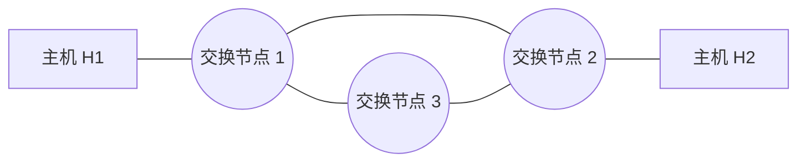
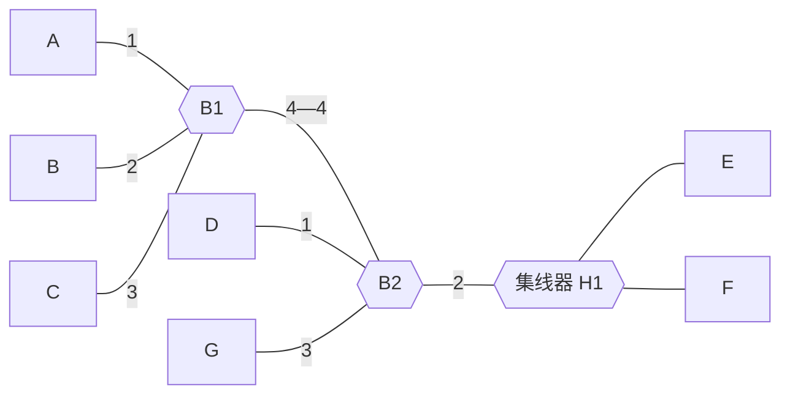

# 2019 年计算机网络期中试卷

> 本文由《计算机网络》期中考试原题转换而成，依据原 PDF、PaddleOCR 转写或原始 HTML 页面整理。原题题干、参考答案、协议字段、公式和计算过程均尽量保留，OCR 疑似错误不作无依据改写。

> [!tip] 真题导航
> 上一份：[[2018 年计算机网络期中试卷]]；下一份：[[2019—2020 学年计算机网络试卷]]

## 主要内容

- 计算机网络体系结构与性能指标
- 物理层、编码与差错检测
- 数据链路层、滑动窗口与局域网
- 网络层、IP、路由与地址划分
- 传输层、应用层、无线网络与网络安全

---

## 一、转写说明

| 项目 | 内容 |
|---|---|
| 课程 | 计算机网络 |
| 资料类型 | 期中考试真题 |
| 整理日期 | 2026-08-12 |
| 转写原则 | 保留原题及原答案；不擅自修正知识性内容 |

> [!warning] OCR 与答案说明
> 文中可能保留原卷或 OCR 的拼写、符号与答案问题。无答案处不自行补写；图片均已转为 Mermaid、原生表格或文字描述，最终笔记不包含图片。

---

## 二、原题与参考答案
1、（20分）分析计算

（1）采用比特填充法成帧，在接收端收到比特串 11 0111 1110 0111 1110 0111 0101 1101 0101 0101 0101 1111 0001 0101 1111 0000 1000 0000 0110 0001 1111 1011，用十六进制格式写出帧内容。（4分）

帧内容：0111 0101 1101 0101 0101 0101 1111 0001 0101 1111 0000 1000 0000 0110 00

去填充：0111 0101 1101 0101 0101 0101 1111 0010 1011 1110 0010

0000 0001 1000

十六进制：75 D5 55 F2 BE 20 18

（2）使用 CRC 校验码传送比特流 101011110，生成多项式为  $X^{3}+1$，计算校验位。（3分）001

（3）若使用海明码传输 8 位的报文，并且能够纠正单个比特的错误，海明码中使用偶校验，计算发送 1110 0011 时的校验位，写出发送的比特流（要求写出计算过程）。（6分）

1110

1111 1100 0011

（4）采用字符填充法发送的十六进制信息为41421043107E44。若转义字符ESC取值0x10、Flag取值为0x7E，用十六进制写出发送的信息。（4分）

7E 41 42 10 10 43 10 10 10 7E 44 7E

（5）两台计算机使用调制器利用电话线通信，不适合的成帧方法有哪些？说明原因。（3分）

调制解调器接收和传送数据的单位是字节而不是位（3分）

2、（45分）计算并分析过程。

（1）在下图所示的采用“存储-转发”方式分组的交换网络中，所有链路的数据传输速度为 100mbps，分组大小为 1000B，其中分组头大小 20B，若主机 H1 向主机 H2 发送一个大小为 980000B 的文件，则在不考虑分组拆装时间和传播延迟的情况下，从 H1 发送到 H2 接收完为止，需要的时间至少是多少？（5 分）

> [!note] 原图转写：存储—转发分组交换网络
> 两台端系统分别位于网络左右两端，中间有三个分组交换节点。左右端系统之间的最短路径经过上方两个交换节点，共包含三条串行链路；第三个交换节点位于下方，并分别与上方两个交换节点相连，构成三角形交换核心。

1000 分组

80ms

最后分组经过两跳 0.16ms

答：80.16ms. (1002 个 t)

（2）数据链路层采用 GBN 协议，发送方已经发送了编号为 0-7 的帧，当计时器超时时，若发送方只收到对 0,1,5 号帧的确认，则发送方需要重发的帧数是多少？（5 分）

2（6，7号）

（3）连接在以太网交换机上的计算机，若工作在半双工方式。发送数据帧时，使用的协议是什么？（5分）

CSMA/CD

（4）使用 VLAN 交换机可构建逻辑上相互隔离的多个网络，广播和组播报文也会被隔离吗？说明原因？（5分）

可以隔离。

（5）为什么调制解调器通常的上行和下行速率不一致？那个速率高？（5分）

下行更高

（6）无线局域网 WLAN 的协议标准是什么？什么是虚拟载波监听技术？（5 分）

802.11

（7）简要解释 WLAN 中的 TXOP 机制。（5分）

TXOP 即 transmission opportunity，传统的信道分配方式是站点每次发送一帧，低速站点会拉低信道吞吐量，使用 TXOP 时，每个站点获取等长的发送时间。

（8）某无线 LAN 有 10 个站点，其中 5 个站点的数据率为 6Mbps，2 个站点的数据率为 18Mbps，另外 3 个站点的数据率为 54Mbps。如果 10 个站点同时发送数据，在下列情况下，每个站点的平均数据率分别是多少？（5分）

(a)不使用 TXOP （2分） (b)使用 TXOP （3分）

a) 54/(3+6+45)=1Mbps

b) 5个站点的数据率为6Mbps: 0.6Mbps，2个站点的数据率18Mbps: 1.8Mbps，3个站点的数据率54Mbps: 5.4Mbps.

（9）请按照带宽从大到小排列下列传输介质：粗缆、细缆、双绞线、光纤？并写出双绞线的两根电缆互相拆除绕道主要目的是什么？为什么相同类型的设备如计算机需要使用交叉线（反线）互联？（5分）

光缆、粗缆、细缆、双绞线（3分）

防止干扰。（2分）

3、（10分）假设一个通信信道的数据速率为2048kbps，站间的单程传播时延为1024毫秒。若要在信道上采用捎带确认方式发送多个1024字节的数据包，假定传输不出错。

（1）试计算对于停等协议、7比特序号的Go-Back-N协议时信道利用率最高分别为多少？

(2)

（2）采用选择重传协议，发送多个1024~2048字节的数据包信道利用率达到100%时，序号比特数至少为多少位？（5分）

Tp=1024ms, Tt=1024*8/2048=4ms

 $$a=2+2\left(T p/T t\right)=514$$

1/514=0.1946% 127/514=24.7082%

W=514 时，比特数至少 11，W=258 时，比特数至少 10，为了使信道利用率总是 100%，序号比特数至少为 11。

4、（4分）在数据链路层中，两台主机利用停等协议实现可靠的数据传输。其中，数据帧中使用了1比特的序号位。为了节约网络带宽，如果取消数据帧中的序号位，是否仍可以保证可靠的通信？请阐述原因。

不能。会产生诸如重复帧问题。

5、（15分）分析并计算

（1）一个使用 OSI 体系结构的主机中，某个应用产生了一个 M 字节的报文，如果实现封装的各层增加的首部（可能包括尾部）都是 H 字节，设信道带宽为 B，有效带宽是多少？（5 分）

 $$\frac{M}{M+NH}\times B\quad N=6$$

（2）请写出计算机网络层次化设计方法的设计原则；给出 TCP/IP 体系结构。（5分）

下层对上层提供的服务透明等等。（2分）

应用层传输层网络接口层（3分）

应用层，传输层，网络层，网络接口层（3分）

（3）下列哪项不属于网络体系结构必须规范的内容，并说明原因。C（5分）

A. 分层 B. 对等层通信协议 C. 上下层之间的接口 D. 下层对上层提供的服务

6、（6分）回答下列关于网桥的问题。

如右图所示，使用网桥 B1、B2 和一台集线器 H1 接 7 台主机 A、B、C、D、E、F 和 G 构成一个局域网，设 B1 和 B2 的初始站表是空的。

> [!note] 原图转写：网桥、集线器与七台主机
> 主机 A、B、C 分别连接网桥 B1 的端口 1、2、3；B1 端口 4 与 B2 端口 4 相连。B2 端口 1 连接主机 D，端口 2 连接集线器 H1（H1 再连接主机 E、F），端口 3 连接主机 G。

若数据帧的发送顺序如下。

① F 向 D 发送数据帧 1;

② A 向 D 发送数据帧 2;

③ A 向 F 发送数据帧 3。

填写下表，给出数据帧需转发的网桥及其端口。

| 帧编号 | B1的所有 | B2的所有 |
|---|---|---|
|  | 转发送端口 | 转发送端口 |
| 数据帧1 | 1、2、3 | 1、3、4 |
| 数据帧2 | 2、3、4 | 1、2、3 |
| 数据帧3 | 4 | 2 |

---

## 本章小结

| 层次或主题 | 常见考点 |
|---|---|
| 体系结构与物理层 | 分层模型、时延、带宽、编码与信道容量 |
| 数据链路层 | 检错纠错、滑动窗口、MAC、网桥与交换机 |
| 网络层 | IPv4、子网、路由、分片与 ICMP |
| 传输与应用层 | TCP/UDP、拥塞控制、DNS、HTTP 与可靠传输 |
| 无线与安全 | 隐藏站、RTS/CTS、加密认证与攻击分析 |

> [!tip] 真题导航
> 上一份：[[2018 年计算机网络期中试卷]]；下一份：[[2019—2020 学年计算机网络试卷]]
