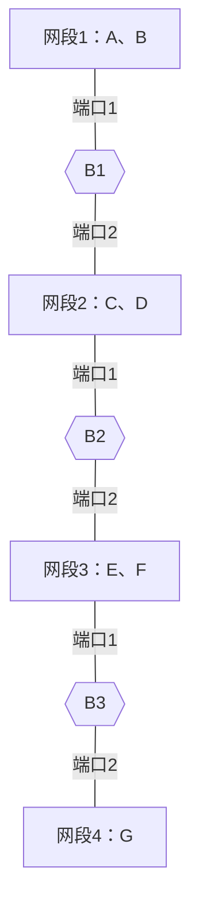

# 2019—2020 学年计算机网络试卷

> 本文由《计算机网络》试卷原题转换而成，依据原 PDF、PaddleOCR 转写或原始 HTML 页面整理。原题题干、参考答案、协议字段、公式和计算过程均尽量保留，OCR 疑似错误不作无依据改写。

> [!tip] 真题导航
> 上一份：[[2019 年计算机网络期中试卷]]；下一份：[[2020 年计算机网络期末考试样题（含参考答案）]]

## 主要内容

- 计算机网络体系结构与性能指标
- 物理层、编码与差错检测
- 数据链路层、滑动窗口与局域网
- 网络层、IP、路由与地址划分
- 传输层、应用层、无线网络与网络安全

---

## 一、转写说明

| 项目 | 内容 |
|---|---|
| 课程 | 计算机网络 |
| 资料类型 | 试卷真题 |
| 整理日期 | 2026-08-12 |
| 转写原则 | 保留原题及原答案；不擅自修正知识性内容 |

> [!warning] OCR 与答案说明
> 文中可能保留原卷或 OCR 的拼写、符号与答案问题。无答案处不自行补写；图片均已转为 Mermaid、原生表格或文字描述，最终笔记不包含图片。

---

## 二、原题与参考答案
④ 5层混合模型与其功能.

2

② protocol 5: Sending window: 7012  $\Rightarrow$ RecV Ack  $\Rightarrow$ timeout. 重发哪几帧？

protocol 6: Sending window: 7012, 窗口大小固定，则接收窗口的序号可能有哪几种情况？

接收

③ ADSL用户线的传输介质？

复用技术？

ADSL用户到端局DL层采用的协议？其向上层提供的服务？成帧技术？

④ 4kHz，无噪声信道，要求达到56kHz，至少的信号级数？

b)  $8 \, \text{KHz}$,  $\text{SNR}_{dB} = 30 \, \text{dB}$，实际速率为理论最大值的50%，求实际速率？

⑤简述电路交换与分组交换的原理.

⑥源到目的有3段链路，每段长1 km，带宽2 Mbps.

源要发一个800B的包给目的节点.  $V_{prop}=2\times10^{8}m/s$ 求传输总时间.

a) 电路交换，testablish = trelease = 100μs.

b) 分组交换，每个分组 160 B data + 10 B header.

⑥画出0101100的Manchester编码和不归零NR5码.

b) 若 Data Rate = 1 Mbps，两种编码的波特率？

C) 与NRE相比，Manchester的优缺点.

⑦ HPLC, 1110 1111 100

a)  $G(x) = x^{4} + x + 1$，计算CRC check sum.

b) Ignore address & control field, 以十六进制写出其构成的帧.

⑧，卫星，1Mbps， $t_{prop}=270ms$，PKT-LEN=1000B，不出错一直采用携带确认，求信道利用率.

a>W_{T}=1

b)  $W_{T}=31$

c)  $W_{T}=72$

(4) Selective repeat，若 $U=100\%$，则发送窗口至少为多大？几位序号？

⑨ 100 Base-T 使用 HUB 连接，转发时延  $1.5 \mu s$， $V_{prop} = 200 m/s$，不考虑前导码开销，则该网络两台计算机理论最短距离？

2) 举例说明什么是隐蔽站问题，802.11 (CSMA/CA) 如何解决？

⑩ B1～B3: 网桥，初始转发表为空，

frame 1 C→D

frame 2  $G \rightarrow C$

frame 3  $F \rightarrow D$

> [!note] 原图转写：三级网桥连接四段总线
> 第一段有主机 A、B，并通过网桥 B1 接入第二段；第二段有主机 C、D，并通过网桥 B2 接入第三段；第三段有主机 E、F，并通过网桥 B3 接入第四段；第四段有主机 G。各网桥分别以端口 1、2 连接相邻网段。

(2) 写出处理方式

> [!note] 原图转写：网桥处理过程表
> 原图要求针对给定帧序列分别填写 B1、B2、B3 的处理方式；手写表仅保留了 `frame 1` 等行标，具体内容未完整填写。

> [!note] 原图转写：网桥转发表
> 原图要求填写 B1、B2、B3 的站点—端口映射，手写表为空白或内容无法可靠辨认，故不猜测具体表项。

---

## 本章小结

| 层次或主题 | 常见考点 |
|---|---|
| 体系结构与物理层 | 分层模型、时延、带宽、编码与信道容量 |
| 数据链路层 | 检错纠错、滑动窗口、MAC、网桥与交换机 |
| 网络层 | IPv4、子网、路由、分片与 ICMP |
| 传输与应用层 | TCP/UDP、拥塞控制、DNS、HTTP 与可靠传输 |
| 无线与安全 | 隐藏站、RTS/CTS、加密认证与攻击分析 |

> [!tip] 真题导航
> 上一份：[[2019 年计算机网络期中试卷]]；下一份：[[2020 年计算机网络期末考试样题（含参考答案）]]
