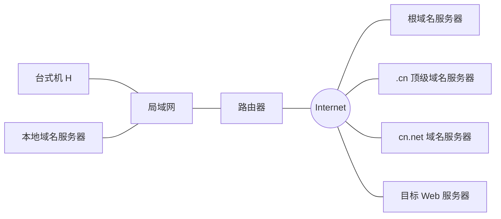

# 2022—2023 学年第二学期计算机网络期中试卷（A 卷）

> 本文由《计算机网络》期中考试原题转换而成，依据原 PDF、PaddleOCR 转写或原始 HTML 页面整理。原题题干、参考答案、协议字段、公式和计算过程均尽量保留，OCR 疑似错误不作无依据改写。

> [!tip] 真题导航
> 上一份：[[2020 年计算机网络期末考试样题（含参考答案）]]；下一份：[[计算机网络期末考试样题参考答案]]

## 主要内容

- 计算机网络体系结构与性能指标
- 物理层、编码与差错检测
- 数据链路层、滑动窗口与局域网
- 网络层、IP、路由与地址划分
- 传输层、应用层、无线网络与网络安全

---

## 一、转写说明

| 项目 | 内容 |
|---|---|
| 课程 | 计算机网络 |
| 资料类型 | 期中考试真题 |
| 整理日期 | 2026-08-12 |
| 转写原则 | 保留原题及原答案；不擅自修正知识性内容 |

> [!warning] OCR 与答案说明
> 文中可能保留原卷或 OCR 的拼写、符号与答案问题。无答案处不自行补写；图片均已转为 Mermaid、原生表格或文字描述，最终笔记不包含图片。

---

## 二、原题与参考答案
| 考试注意事项 | 一、学生参加考试须带学生证或学院证明，未带者不准进入考场。学生必须按照监考教师指定座位就坐。 |  |  |  |  |
|---|---|---|---|---|---|
| 二、书本、参考资料、书包等物品一律放到考场指定位置。 |  |  |  |  |  |
| 三、学生不得另行携带、使用稿纸，要遵守《北京邮电大学考场规则》，有考场违纪或作弊行为者，按相应规定严肃处理。 |  |  |  |  |  |
| 四、学生必须将答题内容做在试题答卷上，做在草稿纸上一律无效。 |  |  |  |  |  |
| 考试课程 | 计算机网络 | 考试时间 | 2023年4月22日 |  |  |
| 题号 | 一 | 二 | 三 | 四 | 五 |
| 满分 | 10 | 10 | 12 | 12 | 12 |
| 得分 |  |  |  |  |  |
| 阅卷教师 |  |  |  |  |  |

| 考试注意事项 |  |  |  |  |  |
|---|---|---|---|---|---|
| 二、书本、参考资料、书包等物品一律放到考场指定位置。 |  |  |  |  |  |
| 三、学生不得另行携带、使用稿纸，要遵守《北京邮电大学考场规则》，有考场违纪或作弊行为者，按相应规定严肃处理。 |  |  |  |  |  |
| 四、学生必须将答题内容做在试题答卷上，做在草稿纸上一律无效。 |  |  |  |  |  |
| 考试课程 |  |  |  |  |  |
| 题号 | 六 | 七 | 八 | 九 | 十 |
| 满分 | 12 | 12 | 10 | 10 |  |
| 得分 |  |  |  |  |  |
| 阅卷教师 |  |  |  |  |  |

| 考试注意事项 |  |
|---|---|
| 二、书本、参考资料、书包等物品一律放到考场指定位置。 |  |
| 三、学生不得另行携带、使用稿纸，要遵守《北京邮电大学考场规则》，有考场违纪或作弊行为者，按相应规定严肃处理。 |  |
| 四、学生必须将答题内容做在试题答卷上，做在草稿纸上一律无效。 |  |
| 考试课程 |  |
| 题号 | 总分 |
| 满分 |  |
| 得分 |  |
| 阅卷教师 |  |

1、网络协议的三要素是什么？各有什么含义？协议与服务有何关系和区别？

答：协议是通信实体（如网络应用程序）之间通信所必须遵守的规则。协议定义了在两个或多个通信实体之间交换的报文格式和次序，以及在报文传输和/或接收或其他事件方面所采取的动作。

网络协议的组成三要素：

（1）语法：数据与控制信息的结构或格式（共2分，要素和含义各1分）

（2）语义：需要发出何种控制信息，完成何种动作以及做出何种响应（共2分，要素和含义各1分）

（3）同步：事件实现顺序的详细说明（共2分，要素和含义各1分）

协议是控制两个对等实体（Peer Entity）进行通信的规则的集合。在协议的控制下，两个对等实体间的通信使得本层能够向上一层提供服务。要实现本层协议，还需要使用下层所提供的服务。（2分）

协议是“水平的”，即协议是控制对等实体之间通信的规则。服务是“垂直的”，即服务是由下层向上层通过层间接口提供的。（2分）

2、某网络的源主机到目的主机中间要经过两个节点交换机，即一共经过3段链路，每段链路长2000公里，带宽均为2Mbps，信号在链路上的传播速度为光速的2/3。源主机要发送一个长度为 $10^{7}$比特的报文给目的主机，忽略节点上的排队时延和处理时延。

(a). 如果采用报文交换，即整个报文不分段，问从源主机把报文传送到第一个节点交换机需要多少时间？从源主机把报文传送到目的主机需要多少时间？

(b). 如果采用分组交换，报文被划分成1000个等长的分组（忽略分组首部），并连续发送。问从源主机把第一个分组传送到第一个节点交换机需要多少时间？从源主机把第一个分组传送到目的主机需要多少时间？从源主机把1000个分组传送到目的主机需要多少时间？

答：

(a) 从源主机把报文传送到第一个节点交换机： $10^{7}/(2 \times 10^{6}) + 2 \times 10^{6}/(2 \times 10^{8}) = 5.01$ s

(2分) 从源主机把报文传送到目的主机： $3 \times 5.01 = 15.03$ s (2分)

（b）每个分组长度为： $10^{7}/1000=10^{4}$

从源主机把第一个分组传送到第一个节点交换机：

 $$10^{4}/(2*10^{6})+2*10^{6}/(2*10^{8})=0.015s\quad(2\  分 )$$从源主机把第一个分组传送到目的主机：$ 3 \times 0.015 = 0.045s $（2分）

从源主机把1000个分组传送到目的主机： $10^{7}/(2 \times 10^{6}) + 2 \times 10^{4}/(2 \times 10^{6}) + 3 \times 2 \times 10^{6}/(2 \times 10^{8}) = 5.04 \, s$（2分）

3. 假设下图所示网络中的本地域名服务器只提供递归查询服务，其他域名服务器均只提供迭代查询服务；局域网内各主机之间的往返时间(RTT)为5ms，局域网内主机访问Internet上各服务器的往返时间(RTT)均为15ms，Internet中各主机互相访问的往返时间(RTT)均为10ms，忽略TCP连接等其他各种时延。若主机H通过超链接

http://www.abc.com.cn/index.html 请求浏览纯文本Web网页index.html，不考虑本地有缓存，则从点击超链接开始到浏览器接收到index.html页面为止，

(a)所需时间最短的情况下，通信流程的顺序是什么？需要最短时间为多少？

(b)所需时间最长的情况下，通信流程的顺序是什么？需要最长时间为多少？

(c) 若 Internet 上各域名服务器都改为采用递归查询服务，则从点击超链接开始到浏览器接收到 index.html 页面为止的最短和最长时间分别为多少？

> [!note] 原图转写：DNS 查询环境
> 台式机 H 与本地域名服务器位于同一局域网，并经路由器访问 Internet。Internet 中包含根域名服务器、`.cn` 顶级域名服务器、`cn.net` 域名服务器和 `www.sina.com.cn` 等目标服务器，题目据此分析递归或迭代查询的时延。

答案：(a)(b)(c)三问各4分。分值划分如下：

(a)最短时间情况：本地域名服务器存在域名与IP地址的映射

通信流程：主机 H 向本地域名服务器递归查询获得  $\underline{\text{www.abc.com.cn}}$ 服务器的 IP 地址，然后主机 H 向  $\underline{\text{www.abc.com.cn}}$ 服务器请求 index.html 纯文本网页文件。(2分，部分答对给1分)

最短时间：DNS 递归查询 1 次 5ms+纯文本网页文件传输 15ms=20ms (2分，部分答对给1分)

以下情况也可按照这种情况给分：如果学生把“不考虑本地有缓存”理解为本地域名服务器没有缓存。则最短时间考虑为顶级域名服务器存在域名与IP地址的映射的情况。此时通信流程为：主机H向本地域名服务器递归查询，然后本地域名服务器迭代查询根域名服务器获得获得www.abc.com.cn服务器的IP地址，然后主机H向www.abc.com.cn服务器请求index.html纯文本网页文件。（2分，部分答对给1分）最短时间：DNS递归查询1次5ms+DNS迭代查询1次15ms+纯文本网页文件传输15ms=35ms（2分，部分答对给1分）

(b) 最长时间情况：本地域名服务器不存在映射，需要迭代查询各级域名服务器 4 次，通信流程：主机 H 向本地域名服务器发起查询，然后本地域名服务器迭代查询根域名服务器、.com 顶级域名服务器、.com.cn 权威域名服务器、abc.com.cn 权威域名服务器获得 www.abc.com.cn 服务器的 IP 地址，然后主机 H 向 www.abc.com.cn 服务器请求 index.html 纯文本网页文件。(2 分，部分答对给 1 分)

最长时间：DNS 递归查询 1 次 5ms+DNS 迭代查询 4 次  $\times$ 15ms+纯文本网页文件传输 15ms=80ms (2 分，部分答对给 1 分)

(c) Internet服务器都改为递归查询时，最短时间情况仍然是本地域名服务器有映射，最短时间还是DNS递归查询1次5ms+纯文本网页文件传输15ms=20ms，（2分，部分答对给1分）

最长时间则变成

DNS 递归查询 1 次 5ms（0.5 分）

+本地域名服务器递归查询根域名服务器 15ms（0.5分）

+根域名服务器递归查询.com 顶级域名服务器 10ms（0.5 分）

+com 顶级域名服务器递归查询.com.cn 权威域名服务器 10ms（0.5 分）

+com.cn权威域名服务器递归查询 abc.com.cn 权威域名服务器 10ms（0.5 分）

+纯文本网页文件传输 15ms（0.5 分）

=65ms（2分，部分答对时，5ms、15ms、10ms的计算各占0.5分，如只给出了1个正确的5ms则只得0.5分）

以下情况也可按照这种情况给分：如果学生把“不考虑本地有缓存”理解为本地域名服务器没有缓存。则最短时间考虑为顶级域名服务器存在域名与IP地址的映射的情况。此时通信流程为：主机H向本地域名服务器递归查询，然后本地域名服务器递归查询根域名服务器获得获得www.abc.com.cn服务器的IP地址，然后主机H向www.abc.com.cn服务器请求index.html纯文本网页文件。（2分，部分答对给1分）最短时间：DNS递归查询1次5ms+本地域名服务器递归查询根域名服务器15ms+纯文本网页文件传输15ms=35ms

最长时间是DNS递归查询1次5ms

+本地域名服务器递归查询根域名服务器15ms

+根域名服务器递归查询.com 顶级域名服务器 10ms

+com 顶级域名服务器递归查询.com.cn 权威域名服务器 10ms

+com.cn 权威域名服务器递归查询 abc.com.cn 权威域名服务器 10ms

+纯文本网页文件传输 15ms

=65ms（2分，部分答对时，5ms、15ms、10ms的计算各占0.5分，如只给出了1个正确的5ms则只得0.5分）

4. 假定用户在浏览器地址栏输入:  $\underline{\text{www.abc.com/example.html}}$，该网页包含文本文件 example.html 和一个图形 image.gif，用户主机到该 Web 服务器的往返时延 (RTT) 为 20ms，Web 服务器对文件的发送时延均为 15ms，用户主机与服务器之间最多只能建立 1 个 TCP 连接。忽略 TCP 连接消息和网页请求消息的发送时延及 TCP 关闭连接时延等。

(a)非持久连接 HTTP 协议中，从发起 TCP 连接到收到网页所有文件的总时延为多少？

(b) 持久连接 HTTP 协议中，从发起 TCP 连接到收到网页所有文件的总时延为多少？

(c) 如果在用户访问该 Web 服务器时使用了一个具有条件 GET 功能的代理服务器，采用持久连接的 HTTP 协议，代理服务器缓存中只有 example.html 的文本文件部分（该部分服务器未进行更新），而没有图形 image.gif（该文件为服务器最近更新内容）。代理服务器到其他主机的往返时延（RTT）及对文件的发送时延都与 Web 服务器相同。忽略非文件传输消息的发送时延。则从发起 TCP 连接到收到该网页所有文件的总时延为多少？

答案：(a)(b)(c)三问各4分。分值划分如下：

(a) 非持久连接 HTTP 协议中，该段总时延为

TCP 连接往返时延 20ms（0.5 分）

+example.html 请求传输往返时延 20ms（0.5 分）

+example.html 发送时延 15ms（0.5 分）

+ TCP 连接往返时延 20ms（0.5 分）

+image.gif 请求传输往返时延 20ms（0.5 分）

+image.gif 发送时延 15ms（0.5 分）

=55ms\times2=110ms （最后结果1分）

(b)持久连接 HTTP 协议中，该段总时延为

TCP 连接往返时延 20ms（1 分）

+example.html 请求传输往返时延 20ms（0.5 分）

+example.html 发送时延 15ms（0.5 分）

+image.gif 请求传输往返时延 20ms （0.5 分）

+image.gif 发送时延 15ms（0.5 分）

=20+20+15+20+15=90ms （最后结果1分）

(c) 使用持久连接、条件 GET 的情况下，该段总时延为：

用户主机到代理服务器的 TCP 连接往返时延 20ms

+代理服务器到Web服务器的TCP连接往返时延20ms（2个TCP连接1分，部分答对

给 0.5 分）

+用户到代理 example.html 请求传输往返时延 20ms

+用户到代理 example.html 发送时延 15ms

代理到服务器 example.html 条件 GET 请求传输往返时延 20ms（HTML 文件请求+发送

时延共1分，部分答对给0.5分）

+用户到代理 image.gif 请求传输往返时延 20ms

+用户到代理 image.gif 发送时延 15ms

+代理到服务器 image.gif 请求传输往返时延 20ms

代理到服务器 image.gif 发送时延 15ms（GIF 文件请求+发送时延共 1 分，部分答对给 0.5 分）

=20+20+20+15+20+15+20+20+15=165ms （最后结果1分）

5. 同学小 A 打算从自己的邮箱 aaa@bupt.edu.cn 向另一个同学小 B 的邮箱 bbb@163.com 发送一封电子邮件。这一通信过程中，会包含小 A 的用户客户端（UAA）、小 A 的邮箱服务器（SA） + 小 B 的邮箱服务器（SB） + 小 B 的用户客户端（UAB）。

(a)假设小A和小B都采用浏览器收发邮件，请描述小A发送电子邮件到小B看到电子邮件的过程包含几次通信，分别采用什么应用层协议？

(b) 假设小 A 和小 B 都采用 Outlook 邮件客户端软件作为自己的用户客户端 (UAA 和 UAB)，Outlook 默认通过 110 端口接收邮件。请描述小 A 发送电子邮件到小 B 看到电子邮件的过程包含几次通信，分别采用什么应用层协议？

(c)邮件客户端接收邮件的常见协议包括 POP3 和 IMAP，试比较两者在收件箱、发件箱、创建文件夹、草稿、垃圾文件夹、广告邮件等功能上的差异，并阐述采用浏览器接收的 Webmail 更接近于 POP3 还是 IMAP?

答案：(a)(b)(c)三问各4分。分值划分如下：

(a)3 次通信（1分):

UAA-SA（Webmail/HTTP协议）（1分）、SA-SB（SMTP协议）（1分）、SB-UAB（Webmail/HTTP协议）（1分）

(b)3 次通信（1分):

UAA-SA（SMTP协议）（1分）、SA-SB（SMTP协议）（1分）、SB-UAB（POP3协议）（1分）

(c) POP3 和 IMAP 协议的区别：

在收件箱操作方面，POP3仅限客户端内进行操作，而IMAP客户端与邮箱更新同步。（0.5分）

在发件箱操作方面，POP3仅限客户端内进行操作，而IMAP客户端与邮箱更新同步。（0.5分）

在创建文件夹操作方面，POP3仅限客户端内进行操作，而IMAP客户端与邮箱更新同步：（0.5分）

在草稿操作方面，POP3仅限客户端内进行操作，而IMAP客户端与邮箱更新同步。（0.5分）

在垃圾文件夹操作方面，POP3不支持接收误入垃圾文件夹的邮件，而IMAP支持移入；(0.5分)

在广告邮件操作方面，POP3 不支持接收误入广告邮件夹的邮件，而 IMAP 支持移入：（0.5 分）

Webmail 使用 HTTP 协议，是连接到服务器上 online 在线操作，更接近于 IMAP（1 分）。

6、1）传输差错和包丢失是网络通信中的主要问题，简要解释在传输层如何解决这两个问题。

2）举例说明可靠的报文流服务与可靠的字节流服务的不同点。哪个协议提供可靠的字节流服务？

3）什么是伪报头？它有什么作用？

1）传输差错的解决方法是：使用校验和检查差错，使用重传纠正差错（两点各1分，共2分）

包丢失的解决方法是：定时器超时重传，并且用序号来判断重复包

（两点各1分，共2分）

2）可靠的报文流将上层的一个报文进行封装，可以保留报文的边界（1分）；提供可靠字节流服务的协议数据包中的数据是若干字节，跟报文无关，不能保留报文的边界（1分）。

例如，当发送方先后发送两个1024字节的报文时，经过提供可靠的报文流服务的网络，接收方收到的仍然是两个1024字节的报文；而经过提供可靠的字节流服务的网络，接收方收到的是长度为2048个字节的数据，无法这个一个2048字节的报文，还是2个1024字节的报文。（1分，举例不一定和答案一样，合理即给分）

TCP提供可靠的字节流服务（2分）

3）伪报头参与校验（1分），但不传输（1分）

作用：加强对于IP地址的校验（1分）

7、一个卫星信道的数据率是1Mbps，地面到卫星的单程传播时延为270毫秒。若要从地面向卫星传输多个2000字节长的数据包，假定传输不出错，且ACK包长度和数据包头开销忽略不计，请计算

1）采用停等协议的最大的信道利用率

2）采用5位序号的Go-back-N协议的最大信道利用率

3）采用5位序号的选择重传协议的最大信道利用率

4）对于选择重传协议，要达到最大信道利用率，发送窗口至少为多大？此时应该使用几位序号？

每小题3分

如果后面计算有误，则算出 a = 270 / (2000 * 8/1M) ≈ 17 （1分）

 $$算出 \quad1+2a=35\quad(2 分 )$$

1）停等协议的信道利用率 = 1/35 ≈ 2.9%

2）5位序号的GBN：31/35 $\approx$88.6%

3）5位序号的选择重传：16/35 ≈ 45.7%

4）发送窗口至少为35， $\log_{2}70 \approx 7$位

8、设主机上某个TCP连接的拥塞窗口初始阀值为8KB，报文段最大长度为1KB。该连接上，在拥塞窗口首次达到10KB时、收到了三次重复的ACK，后续没有拥塞，请在下表中填出从连接建立开始，前10轮发送窗口的值（假定对端主机通知的接收窗口

值一直是12KB）。（每空1分）

| 第1轮 | 第2轮 | 第3轮 | 第4轮 | 第5轮 |
|---|---|---|---|---|
| 1 | 2 | 4 | 8 | 9 |
| 第6轮 | 第7轮 | 第8轮 | 第9轮 | 第10轮 |
| 10 | 5 | 6 | 7 | 8KB |

9、协议分析题

使用 Wireshark 在某主机上捕获到一些连续的 TCP 报文段，按先后顺序排列如下：

| 序号 | TCP 报文段的前 20 字节 |  |  |  |  |
|---|---|---|---|---|---|
| 1 | c8 | e4 | 00 | 19 | 5f |
| 2 | 00 | 19 | c8 | e4 | 03 |
| 3 | c8 | e4 | 00 | 19 | 5f |
| 4 | 00 | 19 | c8 | e4 | 03 |
| 5 | c8 | e4 | 00 | 19 | 5f |
| 6 | 00 | 19 | c8 | e4 | 03 |
| ... | ... |  |  |  |  |

| 序号 |  |  |  |  |  |
|---|---|---|---|---|---|
| 1 | 3a | f3 | eb | 00 | 00 |
| 2 | 45 | af | 87 | 5f | 3a |
| 3 | 3a | f3 | ec | 03 | 45 |
| 4 | 45 | af | 88 | 5f | 3a |
| 5 | 3a | f3 | ec | 03 | 45 |
| 6 | 45 | af | ca | 5f | 3a |
| ... |  |  |  |  |  |

| 序号 |  |  |  |  |  |
|---|---|---|---|---|---|
| 1 | 00 | 80 | 02 | fa | f0 |
| 2 | f3 | ec | 80 | 12 | 72 |
| 3 | af | 88 | 50 | 10 | 02 |
| 4 | f3 | ec | 50 | 18 | 00 |
| 5 | af | ca | 50 | 18 | 02 |
| 6 | f4 | 02 | 50 | 10 | 00 |
| ... |  |  |  |  |  |

| 序号 |  |  |  |  |  |
|---|---|---|---|---|---|
| 1 | c2 | 97 | 00 | 00 |  |
| 2 | 10 | 00 | 10 | 98 | bf |
| 3 | 05 | 49 | 79 | 00 | 00 |
| 4 | e5 | 37 | e8 | 00 | 00 |
| 5 | 05 | 9e | 23 | 00 | 00 |
| 6 | e5 | 4a | 41 | 00 | 00 |
| ... |  |  |  |  |  |

1-3 题每空 1 分，4-6 题每空 2 分

1) 本主机（客户机）的端口号（十进制）是（0xc8e4 = 51428）服务器的端口号（十进制）是（25）

2）连接响应（SYN/ACK）报文段的序号是（）

3）这些报文段里传输的应用层协议是（SMTP）

4）TCP 连接建立后，发送第一个数据报文段的是服务器端还是客户端？

(服务器)端

5）头部有扩展选项的报文段的序号是（）和2

6）4号报文段中包含的数据有（0x0345afca-0x0345af88=66）字节

---

## 本章小结

| 层次或主题 | 常见考点 |
|---|---|
| 体系结构与物理层 | 分层模型、时延、带宽、编码与信道容量 |
| 数据链路层 | 检错纠错、滑动窗口、MAC、网桥与交换机 |
| 网络层 | IPv4、子网、路由、分片与 ICMP |
| 传输与应用层 | TCP/UDP、拥塞控制、DNS、HTTP 与可靠传输 |
| 无线与安全 | 隐藏站、RTS/CTS、加密认证与攻击分析 |

> [!tip] 真题导航
> 上一份：[[2020 年计算机网络期末考试样题（含参考答案）]]；下一份：[[计算机网络期末考试样题参考答案]]
