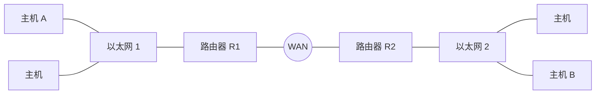

# 计算机网络期末考试样题参考答案

> 本文由《计算机网络》期末样题原题转换而成，依据原 PDF、PaddleOCR 转写或原始 HTML 页面整理。原题题干、参考答案、协议字段、公式和计算过程均尽量保留，OCR 疑似错误不作无依据改写。

> [!tip] 真题导航
> 上一份：[[2022—2023 学年第二学期计算机网络期中试卷（A 卷）]]；下一份：[[2024—2025 学年第一学期计算机网络期末试卷]]

## 主要内容

- 计算机网络体系结构与性能指标
- 物理层、编码与差错检测
- 数据链路层、滑动窗口与局域网
- 网络层、IP、路由与地址划分
- 传输层、应用层、无线网络与网络安全

---

## 一、转写说明

| 项目 | 内容 |
|---|---|
| 课程 | 计算机网络 |
| 资料类型 | 期末样题真题 |
| 整理日期 | 2026-08-12 |
| 转写原则 | 保留原题及原答案；不擅自修正知识性内容 |

> [!warning] OCR 与答案说明
> 文中可能保留原卷或 OCR 的拼写、符号与答案问题。无答案处不自行补写；图片均已转为 Mermaid、原生表格或文字描述，最终笔记不包含图片。

---

## 二、原题与参考答案
### 一．单项选择题（共15分，每题1分）

1. （ B ）下列关于 ADSL 描述哪个是错误的?

A. 实现了全双工通信，在两个方向上的传输速率可以不同

B. 使用基带传输方案，不需要像 MODEM 那样对数据进行调制，

所以 ADSL 一般比 MODEM 提供更高的通信速率

C. ADSL 通信与普通电话机的语音通信使用完全相同的传输介质

D. ADSL 仅仅是一个物理层标准

2. （A）在有传输误码的数据信道上传输数据，下列哪种方法不能正确地实现链路层的成帧处理？

A. 字符计数法 B. 字节填充法

C. 比特填充法 D. 物理层编码违例法

3. （D）如果用户计算机通过电话网接入因特网，则用户端必须具有：

A. NAT 网关 B. 以太网交换机 C. 集线器 D. 调制解调器

4. （C）链路层协议采用选择重传滑动窗口协议，其中数据帧编号采用8比特，发送窗口的最大值是：

A. 256 B. 255 C. 128 D. 127

5. （C）以下哪个是正确的以太网地址？

A. 59.64.123.87 B. e0-2b-37

C. 00-30-2c-45-bc-2d D. 8000::126:376e:89bc:5c2e

6. （C）IP 路由器属于哪一层的互连设备?

A. 物理层          B. 链路层          C. 网络层          D. 传输层

7. （C）下列哪种指标不是用来衡量网络服务质量(QoS)的主要指标?

A. 分组延迟时间 B. 到达抖动时间

C. 分组生存时间 D. 分组传输带宽

8. （ B ）某同学在校园网访问因特网，从该同学打开计算机电源到使用命令 ftp 202.38.70.25 连通文件服务器的过程中，哪个协议没有使用到?

A. IP B. ICMP C. ARP D. DHCP

9. （A）某主机的 IP 地址为 10.83.77.15，子网掩码为 255.255.252.0，当这台主机在子网内发送广播数据报时，IP 数据报中的源地址为

A. 10.83.77.15 B. 255.255.255.255

C. 10.83.79.255 D. 10.83.76.0

10. （C）某校分给数学教研室的IP地址块为172.209.211.160/27，分配给外语教研室的地址块为172.209.211.192/26，分配给物理教研室的地址块为172.209.211.128/27。这三个地址块经过聚合后的地址块为：

A. 172.209.211.0/25 B. 172.209.211.0/26

C. 172.209.211.128/25 D. 172.209.211.128/26

11. （C）关于 TCP/IP 协议特点的描述中，错误的是

A. IP 提供尽力而为的服务，无法保证数据可靠到达

B. TCP 是面向连接的传输协议

C. UDP 是可靠的传输协议

D. TCP/IP 协议可以运行于多种操作系统

12. （D）在 TCP/IP 网络中，转发路由器对 IP 数据报进行分片的目的是：

A. 提高路由器的转发效率

B. 降低网络拥塞的可能性

C. 使得目的主机对数据报的处理更简单高效

D. 保证数据报不超过物理网络能传输的最大报文长度

13. （C）下图主机 A 发送一个 IP 数据报给主机 B，通信过程中以太网 1 上出现的以太网帧中承载一个 IP 数据报，该以太网帧中的目的地址和 IP 包头中的目的地址分别是：

A. B 的 MAC 地址，B 的 IP 地址

B. B 的 MAC 地址，R1 的 IP 地址

C. R1 的 MAC 地址，B 的 IP 地址

D. R1 的 MAC 地址，R1 的 IP 地址

> [!note] 原图转写：两个以太网经 WAN 互连
> 左侧以太网 1 包含主机 A、另一台主机和路由器 R1；R1 通过 WAN 连接路由器 R2；右侧以太网 2 包含 R2、另一台主机和主机 B。

14. （ B ）使用命令 ping 202.13.125.32 探测连通性，使用了下列哪个协议？

A. HTTP B. ICMP C. UDP D. TCP

15. （C）当路由器接收到一个 1500 字节的 IP 数据报时，需要将其转发到 MTU 为 980 的子网，分片后产生两个 IP 数据报，长度分别是：

A. 750,750 B. 980,520 C. 980,540 D. 976,544

### 二．判断题（共15分，每题1分）

判断下面的每项陈述是否正确，正确的答 T，错误的答 F。

1. （ T ）双绞线是由两根相互绝缘的铜线组成，这两根铜线以螺旋状的形式绞在一起，而不是两根平行的线，目的是为了减弱电磁干扰。

2. （ F ）快速以太网在物理层使用了曼彻斯特编码方式便于接收者提取同步时钟并识别媒体上的数据。

3. （F）以太网交换机可以采用“存储-转发”的交换方式，也可以采用“直通式(cut-through)”交换方式。后者技术更先进，可以提高网络的吞吐量。

4. （T）VLAN 交换机可以构建逻辑上相互独立的多个网络，可做到这些逻辑上独立的网络间通信量的隔离，即使是广播信息也无法在两个逻辑网络之间穿透，而且不需要改造网络中所有主机的以太网卡和相关软件。

5. （F）不考虑主机和路由器的软硬件故障，一个分组不可能被递交到错误的目的地。

6. （F）目前常用的以太网交换机使用了 CSMA/CD 协议，实现链路层交换。

7. （ T ）当网络的拓扑发生变化时，相对链路状态路由算法，距离矢量路由算法需要更长时间才能使路由表收敛到稳定状态。

8. （F）在路由器检测到网络接近拥塞状态但尚未发生拥塞时，路由器随机丢弃部分数据包，这样会引起数据源端传输层的重传，反而使拥塞状况进一步恶化。因此，路由器应当尽可能的将数据报投递到目的端，完成网络层“尽力交付(best-effort delivery)”的承诺。

9. （ T ）IPv6 与 IPv4 相比不仅解决了解决 IPv4 地址耗尽问题，而且对协议报头进行简化，以便路由器快速处理分组。尽管如此，IPv6 的基本报头仍比 IPv4 基本报头更大。

10. （ F ）私网路由器利用 SNA 技术，可以实现私网内多台主机共享同一个因特网 IP 地址访问因特网上的服务器的目的。

11. （ T ）常用的有线传输介质有光纤、双绞线、同轴电缆，如果按照带宽的从低到高的顺序进行排序，则顺序为双绞线、同轴电缆、光纤。

12. （ T ）在大规模网络中，采用层次化的分级路由的主要目的是缩短路由表的长度、节省内存并加快查表速度，但对某个具体的主机来说可能会未选用从源到目的地的最佳路由。

13. （ T ）某局域网所有计算机和路由器都拥有固定的因特网 IP 地址。该局域网上的某台计算机正在使用 TCP 协议通过该局域网上的一台路由器访问因特网上某服务器，这时，该路由器崩溃并重新启动，由于 TCP 的自动重传机制提供了可靠的传输服务，所以，能够维持原有的通信能够继续进行。

14. （T）TCP 提供端到端传输服务，在接收方不能保证发送方应用层消息的消息边界，但 UDP 可以。

15. （ F ）局域网最常用的传输介质是 5 类双绞线，3 类双绞线的带宽极限为 64kbps，所以不适用于高速率数据通信。

### 三．填空题（共20分，每题2分）

1. 使用海明码传输 64 位的数据报文，则需 $\underline{7}$个检查位才能确保接收方可以检测并纠正单位错误。

2. 数据链路协议几乎总是将 CRC 放在尾部而不是头部，简单分析其主要原因是 $\underline{\text{发送方：便于硬件电路边发送边累加计算 CRC 校验和，最后追加到尾部；接收方：便于硬件电路边接收边累加计算 CRC 校验和，最后与尾部校验和比较}}$。

3. 利用地球同步卫星在一个1Mbps上的信道上发送1000位的帧，该信道离开地球的传输延迟为270ms。确认信息总是被捎带在数据帧上，忽略帧头帧尾的控制信息。使用停等协议可获得的最大信道利用率是 $\underline{\text{(18%或1/542)}}$。

4. 共享信道协议中，评价一个协议优劣的两个主要指标是( $\underline{\text{低负载情况下的时延和高负载情况下的吞吐量}}$)。

5. 以太网协议中二进制指数退避算法的主要目的是( $\underline{\text{避免冲突后的重传帧再次引起冲突、导致无序竞争的问题}}$)。

6. 在设计网络时，网络层向传输层提供的两种服务类型是(数据报和虚电路)。

7. IP 地址块 192.168.15.136/29 的子网掩码可写为( $\underline{\text{255.255.255.248}}$)。

8. 从源主机向目的主机发送一个 IP 数据报，途经多台路由器，目的主机接收到的 IP 数据报与源主机发送的数据报在报头的( $\underline{\text{TTL 和 CHECKSUM}}$)域上不同。

9. 决定 TCP 发送窗口大小的因素是 $\underline{\text{(拥塞窗口和接收窗口的较小值)}}$。

10. TCP 解决“半开连接(Half-open)”问题采取的策略是(设置定时器定时探测)。

### 四. 简答及计算题(共40分)

1. (6分)在数据链路层中，两台主机利用停等协议实现可靠的数据传输。其中，数据帧中使用了1比特的序号位。为了节约网络带宽，如果取消数据帧中的序号位，是否仍可以保证可靠的通信？请阐述原因。

答：不能保证可靠的通信。

例如 A 向 B 发送一帧，等 B 回送 ACK；

B 收到并向 A 发送 ACK，但 ACK 丢失；

A向B重发上一帧：

B收下后无法区分这是新的一帧还是原先帧的重传，因而协议出现错误。

2. (6分)以太网交换机中的转发表的每个表项包括哪些内容?交换机在什么时机向转发表中增加一项?在什么时机删除一项?

答：（1）每个表项主要包括：目的 MAC 地址，端口号，时间戳

(2) 当收到一个 MAC 帧，如果源地址不在转发表中时，增加一项：MAC 地址为源地址，端口号为接收该帧的端口，时间戳为当前时间；如果源地址已在转发表中时，更新时间戳；

(3) 定时扫描转发表每一项的时间戳，超时则删除该项。

3. (5分)简述链路状态路由协议的基本工作过程。

答：主要包括以下5个步骤：

(1) 发现邻居，学习邻居的地址；

(2) 测量到邻居的费用（开销 cost）;

(3) 构造链路状态数据包 LSP;

(4) 扩散链路状态数据包 LSP 到网络中所有路由器：

(5) 使用 Dijkstra 算法计算路由

4. (6分)在 10Mbps 的网络上，一台主机通过令牌桶进行流量整形。令牌的到达速率为 2Mbps。初始时，令牌桶被填充到 6Mbits 的容量，计算该主机发送 40Mbits 数据需要多长时间?

答：（1）突发时间为 s=6/(10-2)=0.75s，共发送 7.5M bits

(2)剩余的40-7.5=32.5M bits 按2M bps 发送，需32.5/2=16.25s

(3) 共需要 0.75+16.25=17s

5. (5分)一台路由器的 CIDR 表现:

| 地址 | 下一跳 |
|---|---|
| 135.46.56.0/22 | 接口 0 |
| 135.46.60.0/22 | 接口 1 |
| 192.53.40.0/23 | 路由器 1 |
| 默认 | 路由器 2 |

对于下面的每一个地址，请回答，如果到达的数据报目标地址为该 IP 地址，那么路由器将执行什么处理？

(a)135.46.63.10 (b)135.46.57.14 (c)135.46.52

(d)192.53.40.7 (e)192.53.56.7

答：(a)135.46.63.10 下一跳=接口1

(b) 135.46.57.14 下一跳=接口0

(c) 135.46.52.2 下一跳=路由器2

(d) 192.53.40.7 下一跳=路由器1

(e)192.53.56.7 下一跳=路由器2

路由器将相关数据报转发到下一跳的接口或路由器。

6. (6分)在 TCP 协议实现中，为了避免可能出现的性能退化问题，采取了 Nagle 算法和 Clark 算法，简述这两个算法分别解决了什么问题。

算法和 Clark 算法，简述这两个算法分别解决了什么问题。

答：（1）Nagle 算法用来解决发送端 TCP 上层应用程序每次向 TCP 协议实体传递较小数据量（比如：1字节或几个字节）而引起的报头字节数占整个报文字节数的比例太大而导致的传输效率低下问题；发送端应积累数据直到已发送的数据得到确认（ACK）或者数据积累到足够大（1/2 发送缓冲区或者凑足了一个 MSS）

(2) Clark 算法解决因为接收端通告小窗口（比如：1 字节或几个字节）而造成的 TCP 传输效率低下的问题：一个通告报文仅能导致少量的有效数据传输，有效数据字节数与报头字节数的比例太低。接收端不在接收缓冲区稍有空闲时就立刻通知发送端新的接收窗口，应在接收缓冲区的空闲部分达到 1/2 或者足够一个 MSS 后才通知发送端。

7. (6分)在一条往返时间为 5ms 的无拥塞线路上使用慢启动算法。接收窗口为24K字节，最大数据段长度为1K字节。请分析需要多长时间才发送满窗口的数据？

答：突发发送 1K，5ms 后收到应答，拥塞窗口变为 2K；

突发发送2K，10ms后收到应答，拥塞窗口变为4K，

突发发送4K，15ms后收到应答，拥塞窗口变为8K；

突发发送 8K，20ms 后收到应答，拥塞窗口变为 16K；

突发发送 16K，25ms 后收到应答，拥塞窗口达 32K，此时可发送满窗口 24K 的数据。

因此需要 25 ms 才能发送满窗口数据。

### 五. 协议分析题(共10分,前8题每题1分,第9题2分)

本地主机 A 的一个应用程序使用 TCP 协议与同一局域网内的另一台主机 B 通信。用 Sniffer 工具捕获本机 A 以太网发送和接收的所有通信流量，目前已经得到 8 个 IP 数据报。下表以 16 进制格式逐字节列出了这些 IP 数据报的全部内容，其中，编号 2,3,6 为收到的 IP 数据报，其余为发出的 IP 数据报。假定所有数据报的 IP 和 TCP 校验和均是正确的。

1. A 和 B 的 IP 地址以点分十进制表示分别是(192.168.0.21, 192.168.0.192)。

2. TCP 连接两端 A 和 B 上的 TCP 端口号以 16 进制表示分别是 $\underline{\text{(0664, 31ba)}}$。

3. B 发出的 IP 数据报有相同的 TTL 字段值，TTL 值等于 $\underline{\text{(64 或 0x40)}}$。

4. A 发送的 5 个 IP 包中累计 IP 报头和 TCP 报头一共有( $\underline{208}$)字节。

5. 表中编号为 $\underline{\text{(1,3,4)}}$的 IP 数据报实现了 TCP 连接建立过程中的三次握手。

6. 根据三次握手报文提供的信息，连接建立后如果 B 发数据给 A，那么首字节的编号以 16 进制表示是( $\underline{\text{5b9ff71d}}$)。

7. A 上的应用程序已经请求 TCP 发送的应用层数据总计为  $(16+32=48)$ 字节。

8. 如果 8 号 IP 数据报之后，B 正确收到了 A 已发出的所有 IP 数据报，B 发给 A 的 TCP 报文段中 ACK 号以 16 进制表示应当为( $\underline{\text{2268b9c1}}$)。

9. 在8号IP数据报之后，A上应用程序请求TCP发送新的65495字节应用层数据，那么，按TCP协议，在A未能得到B的任何回馈报文之前，TCP最多可以把这些应用层数据的(1428)字节发送到网络中。

解析：因为7号包和8号包的 TCP 序列号字段都是2268b9a1，8号包是7号包超时之后的重传包，8号包前面的数据部分是7号包数据的重传。根据TCP的拥塞控制算法，超时重传之后，拥塞窗口减为1个MSS，本题为1460字节。另外，收到的6号包中Window字段0x2000，即8192字节，ACK字段是2268b9a1，接收窗口的限定是要求发送方自2268b9a1序号开始最多发送8192字节。实际TCP发送窗口取拥塞窗口和接收窗口的最小值，所以发送窗口限定为自2268b9a1序号开始min(1460,8192)=1460字节。8号包已发送32字节数据，TCP未能得到B的任何回馈报文之前最多可以在下次超时重传的时候发送1460字节（含未得到证实的32字节），所以最多可以把新来的65495字节应用层数据中的1460-32= $\underline{1428}$字节发送到网络中。

| 编号 | IP 包的全部内容 |
|---|---|
| 1 | 45 00 00 30 82 fc 40 00 80 06 f5 a5 c0 a8 00 15 c0 a8 00 c0 06 64 31 ba 22 68 b9 90 00 00 00 00 70 02 ff ff ec e2 00 00 02 04 05 b4 01 01 04 02 |
| 2 | 45 00 00 2f 00 07 40 00 40 01 24 42 c0 a8 00 65 da 20 7b 57 08 00 69 5a 36 6f 00 07 73 48 5b 49 37 5c 04 00 08 09 0a 0b 0c 0d 0e 0f 10 11 12 |
| 3 | 45 00 00 30 00 00 40 00 40 06 b8 a2 c0 a8 00 c0 c0 a8 00 15 31 ba 06 64 5b 9f f7 1c 22 68 b9 91 70 12 20 00 83 45 00 00 02 04 05 b4 01 01 04 02 |
| 4 | 45 00 00 28 82 fd 40 00 80 06 f5 ac c0 a8 00 15 c0 a8 00 c0 06 64 31 ba 22 68 b9 91 5b 9f f7 1d 50 10 ff ff c6 d9 00 00 |
| 5 | 45 00 00 38 82 fe 40 00 80 06 f5 9b c0 a8 00 15 c0 a8 00 c0 06 64 31 ba 22 68 b9 91 5b 9f f7 1d 50 18 ff ff bc b7 00 00 f8 9f e3 e3 2c 12 c2 89 24 34 6a 13 55 b7 65 59 |
| 6 | 45 00 00 28 3f 28 40 00 40 06 79 82 c0 a8 00 c0 c0 a8 00 15 31 ba 06 64 5b 9f f7 1d 22 68 b9 a1 50 10 20 00 af f9 00 00 |
| 7 | 45 00 00 38 83 0b 40 00 80 06 f5 8e c0 a8 00 15 c0 a8 00 c0 06 64 31 ba 22 68 b9 a1 5b 9f f7 1d 50 18 ff ff bc a7 00 00 f8 9f e3 e3 2c 12 c2 89 24 34 6a 13 55 b7 65 59 |
| 8 | 45 00 00 48 83 3e 00 00 80 06 35 4c c0 a8 00 15 c0 a8 00 c0 06 64 31 ba 22 68 b9 a1 5b 9f f7 1d 50 18 ff ff b2 8d 00 00 f8 9f e3 e3 2c 12 c2 89 24 34 6a 13 55 b7 65 59 dd 47 2c 3a b1 0c 9a f1 75 1b 4f 75 62 df 03 19 |

### 附录1：IP报头格式

> [!note] 原图转写：IPv4 首部格式
> IPv4 首部按 32 bit 分行：第 1 行为 Version、IHL、Type of Service、Total Length；第 2 行为 Identification、DF/MF 标志、Fragment Offset；第 3 行为 TTL、Protocol、Header Checksum；随后为 Source Address、Destination Address，以及可选的 Options。

Protocol 域为 1,6,17,89 分别对应 ICMP,TCP,UDP,OSPF 协议。

附录2：TCP报头格式

> [!note] 原图转写：TCP 首部格式
> TCP 首部按 32 bit 分行：源端口、目的端口；序号；确认号；首部长度、保留位、URG/ACK/PSH/RST/SYN/FIN 标志与窗口大小；校验和、紧急指针；可选项；最后是可选数据。

本题中 Window size 域描述窗口时使用的计量单位为 1 字节，MSS 值为 1460。

---

## 本章小结

| 层次或主题 | 常见考点 |
|---|---|
| 体系结构与物理层 | 分层模型、时延、带宽、编码与信道容量 |
| 数据链路层 | 检错纠错、滑动窗口、MAC、网桥与交换机 |
| 网络层 | IPv4、子网、路由、分片与 ICMP |
| 传输与应用层 | TCP/UDP、拥塞控制、DNS、HTTP 与可靠传输 |
| 无线与安全 | 隐藏站、RTS/CTS、加密认证与攻击分析 |

> [!tip] 真题导航
> 上一份：[[2022—2023 学年第二学期计算机网络期中试卷（A 卷）]]；下一份：[[2024—2025 学年第一学期计算机网络期末试卷]]
