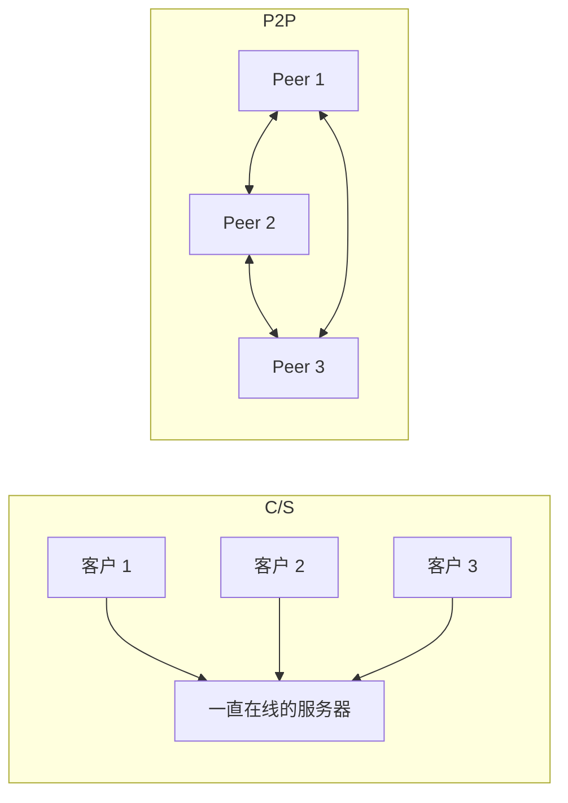
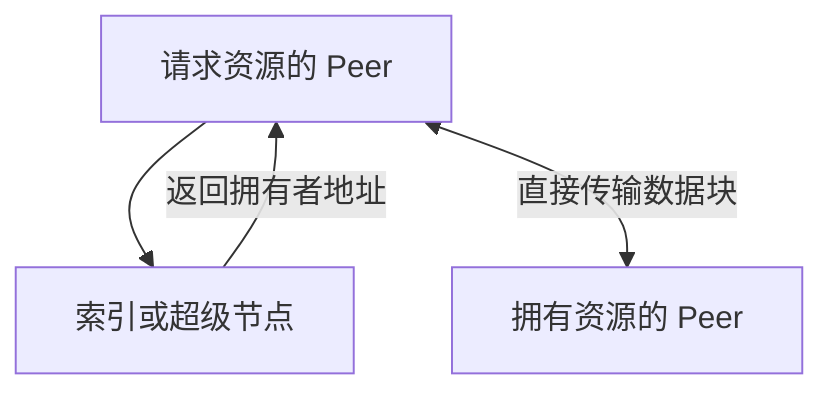
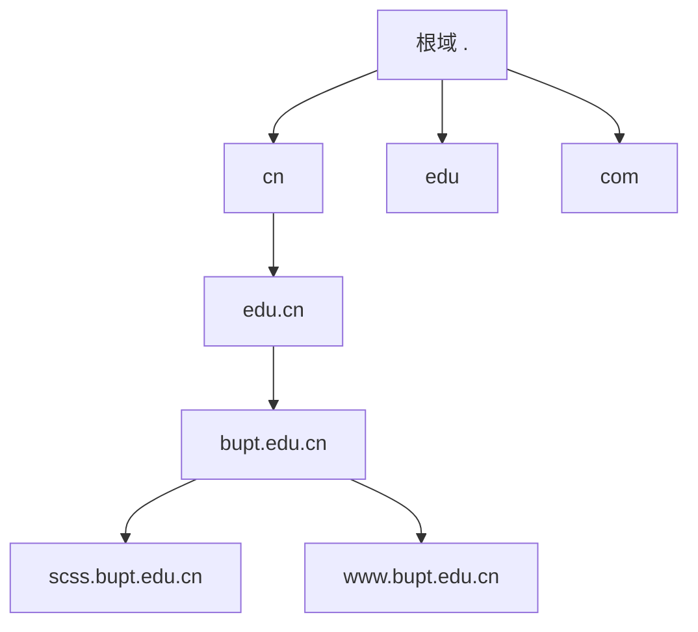
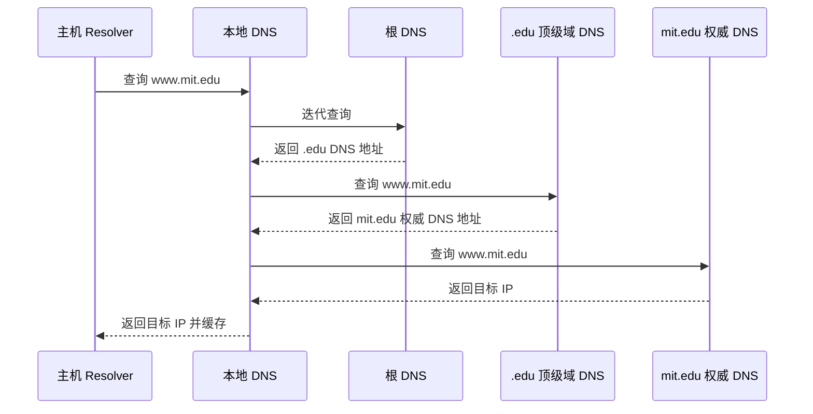
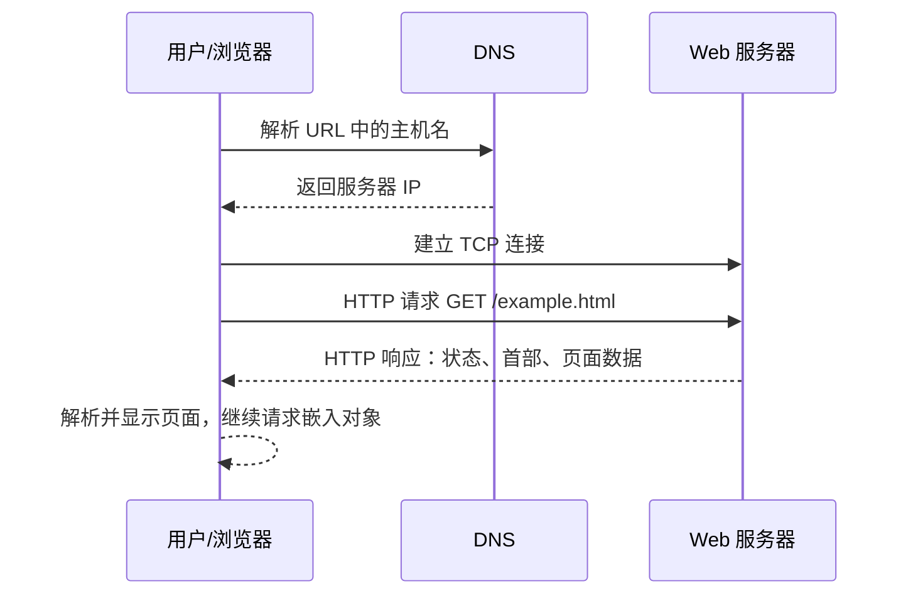
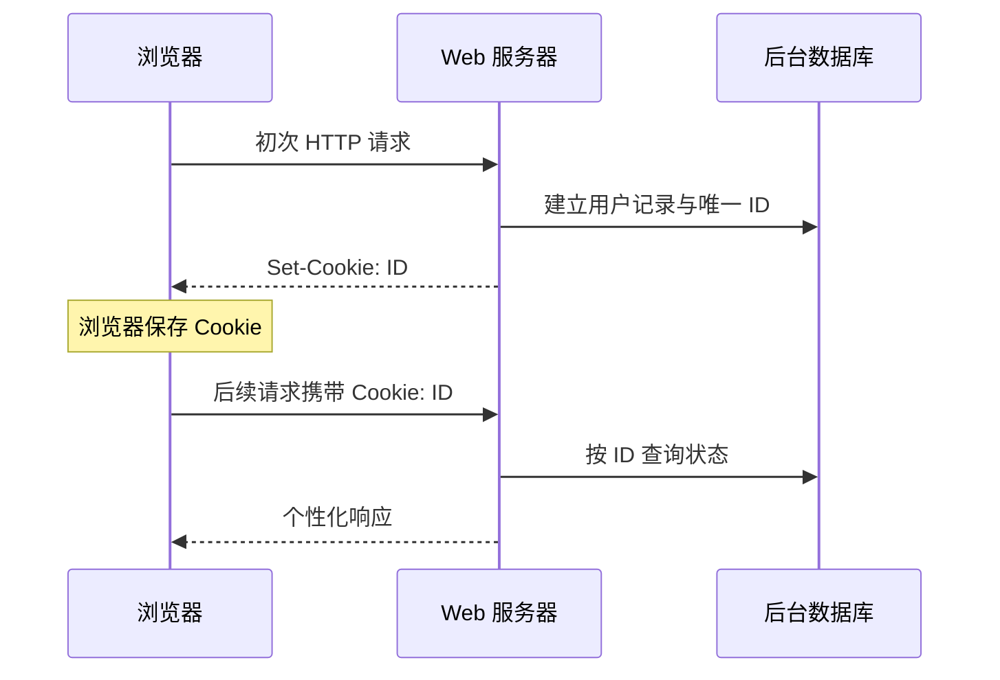
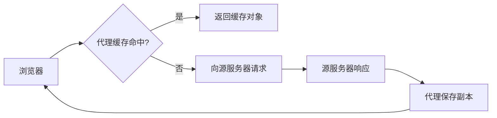
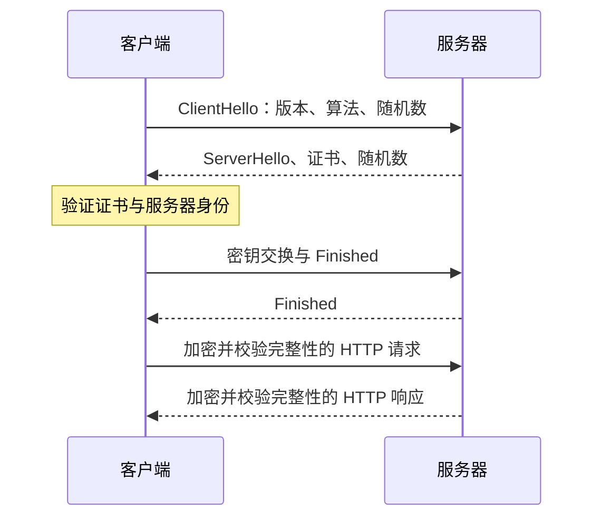
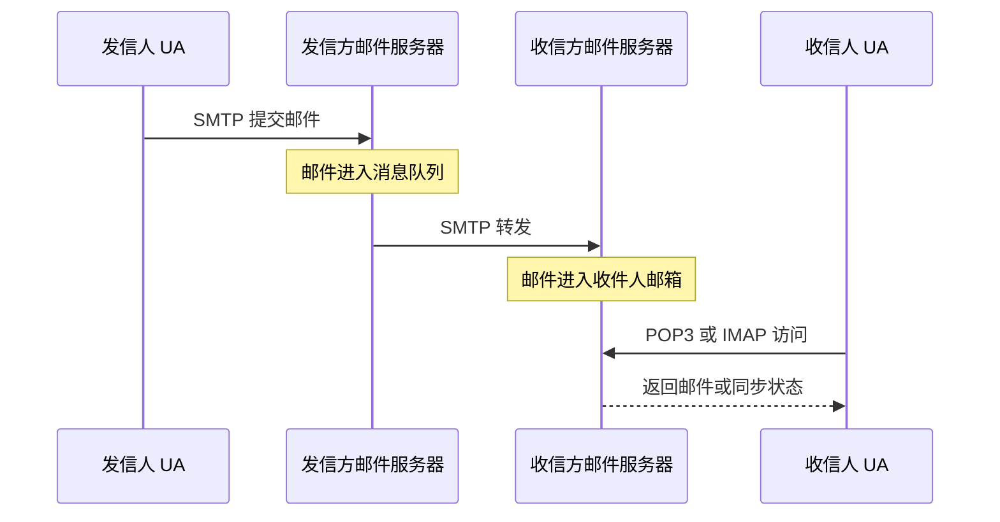
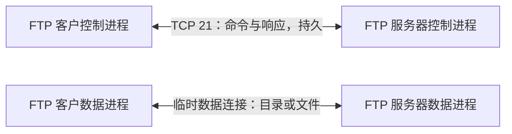

# 2.1 应用层

> 应用层直接支撑用户可见的网络应用，并通过 Socket 使用传输层服务。本章以 DNS、WWW/HTTP、Email、FTP 和 Telnet 为主线，梳理应用体系结构、消息语法与时序，以及传统明文协议的安全局限。

## 主要内容

- C/S、P2P 与混合体系结构
- 进程、Socket、端口和传输服务选择
- DNS 名字空间、查询、资源记录和消息格式
- WWW、URL、HTTP、Cookie、代理缓存与 HTTPS
- Email、SMTP、POP3、IMAP 与 MIME
- FTP 双连接和 Telnet/NVT
- 应用层攻击与 SSL/TLS

---

## 一、网络应用基础

### 1. 应用层协议规定什么

> 应用层协议定义通信进程所交换消息的**类型、语法、语义和时序**。

| 要素 | 含义 | 示例 |
|---|---|---|
| 消息类型 | 请求、应答或通知等 | HTTP 请求与响应 |
| 语法 | 字段、顺序、长度和编码 | 请求行、首部、空行、消息体 |
| 语义 | 每个字段的含义 | `Host` 指定目标虚拟主机 |
| 时序 | 谁先发、消息先后和状态迁移 | SMTP 先 `MAIL FROM` 后 `RCPT TO` |

应用层协议面向具体应用，因此协议种类多、差异大。编写网络应用通常只需修改端系统中的应用进程，不需要修改路由器等网络核心设备。

课件列出的代表性发展节点如下：

| 时间 | 应用 | 代表人物或来源 | 协议 |
|---|---|---|---|
| 1969 | 远程登录、BBS | 早期 ARPANET 用户 | Telnet |
| 1971 | Email | Ray Tomlinson | SMTP、POP3 |
| 1971 | 文件传输 | RFC 114 | FTP |
| 1989 | WWW | Tim Berners-Lee | HTTP |
| 1995 | 电子商务 | Amazon | HTTP |
| 1995 | IP 电话 | VocalTec | SIP、RTP |
| 1999 | P2P 文件共享 | Napster | 早期私有协议 |

### 2. 三种应用体系结构

| 体系结构 | 组织方式 | 优点 | 局限 |
|---|---|---|---|
| C/S | 长期在线服务器为多个客户提供服务 | 集中管理、地址稳定 | 服务器成本和瓶颈明显 |
| P2P | 对等方直接通信，必要时兼任客户与服务器 | 可扩展、成本低 | 节点动态、管理和安全困难 |
| 混合 | 索引、注册由服务器完成，数据由对等方交换 | 兼顾发现与扩展 | 仍依赖中心服务 |



C/S 服务器地址公开且较稳定，可组成服务器集群；客户临时上线、地址可能变化，客户之间一般不直接通信。P2P 中对等方直接交换资源，常见于文件共享、流媒体、网格计算与分布式存储。

### 3. P2P 文件共享与资源查找

BitTorrent 把文件切成数据块，课件示例块长为 256 KB，并用每块 20 字节 SHA-1 摘要校验。元信息包含 Tracker 地址、文件名、总长度、块长和各块摘要。

| 查找方式 | 过程 | 示例 |
|---|---|---|
| 集中式索引 | Peer 向索引服务器登记和查询，数据仍在 Peer 间传输 | Napster |
| 洪泛查询 | 查询被转发给相邻 Peer，逐层扩散 | Gnutella |
| 分层叠加网 | 超级节点维护局部索引，普通 Peer 连接超级节点 | KaZaA 等 |



即时通信可采用混合模式：用户注册、好友列表和在线状态由中心服务器维护，用户间聊天或通话尽可能使用 P2P。

### 4. 进程、Socket 与地址

> 进程是主机内程序的一次执行。不同主机上的进程通过交换消息通信，Socket 是应用进程访问传输层的 API。


单个进程端点由 IP 地址和端口号标识；一条传输层通信关系由四元组唯一标识：

$$（源IP，源端口，目的IP，目的端口）$$

| 服务     | 常见端口       |
| ------ | ---------- |
| HTTP   | TCP 80     |
| HTTPS  | TCP 443    |
| SMTP   | TCP 25     |
| DNS    | UDP/TCP 53 |
| FTP 控制 | TCP 21     |
| Telnet | TCP 23     |

### 5. 应用对传输服务的需求

应用主要从可靠性、时延、吞吐量和安全性四方面选择传输服务。

| 特性 | TCP | UDP |
|---|---|---|
| 连接 | 面向连接 | 无连接 |
| 可靠、有序 | 提供 | 不提供 |
| 流量控制 | 提供 | 不提供 |
| 拥塞控制 | 提供 | 不提供 |
| 实时性、最低吞吐量 | 不保证 | 不保证 |
| 安全性 | 本身不保证 | 本身不保证 |
| 典型取舍 | 文件、网页、邮件等不能容忍错误的应用 | 实时音视频、DNS 等重视低开销或可自行恢复的应用 |

---

## 二、DNS 域名系统

### 1. 功能与基本参数

> DNS 是层次化、分布式的名字数据库及其查询协议，主要完成域名到 IP 地址的解析，是其他因特网应用的支撑协议。

- 采用 C/S 模型，客户端称为 Resolver，服务器称为名字服务器。
- 通常使用 UDP 53；区域传送或响应过大等场景可使用 TCP 53。
- 域名便于记忆且可在 IP 改变时保持稳定；IP 地址适合路由和机器处理。

### 2. 层次化名字空间与区域

域名由点分隔的标签组成，从具体主机向根书写，例如 `scss.bupt.edu.cn`。单标签最长 63 个字符，完整域名最长 255 个字符。



**域**是名字空间中的子树；**区域**是从管理角度划定并由权威服务器负责的数据范围。区域可能等于一个域，也可能把部分子域委派出去。

### 3. DNS 服务器类型

| 服务器 | 作用 |
|---|---|
| 根服务器 | 知道各顶级域服务器的地址，给出下一步转介 |
| 顶级域服务器 | 管理相应顶级域下注册的二级域 |
| 权威服务器 | 保存所管区域内的权威资源记录 |
| 本地 DNS 服务器 | 接收主机 Resolver 请求，使用缓存或代理向外查询 |

传统表述中根服务器有 13 个逻辑根标识 `a`～`m`；每个逻辑根可由多个实际实例提供服务。

### 4. 迭代与递归查询



迭代查询中，每台服务器返回自己知道的最佳下一跳，由查询方继续询问；递归查询中，被询问服务器代替请求方完成后续查询，会增加服务器状态与负载。当前因特网通常是主机对本地 DNS 递归，本地 DNS 对外迭代。

缓存把响应及其 TTL 保存一段时间，减少时延和上游负载；主、备用服务器和区域复制提高可用性。

### 5. 资源记录

资源记录通式为：

```text
(name, TTL, class, type, value)
```

| 类型 | `name` | `value` | 用途 |
|---|---|---|---|
| A | 主机域名 | IPv4 地址 | 域名到 IPv4 |
| AAAA | 主机域名 | IPv6 地址 | 域名到 IPv6 |
| NS | 域名 | 权威服务器域名 | 指定区域权威服务器 |
| CNAME | 别名 | 规范名 | 建立域名别名 |
| MX | 域名 | 邮件服务器域名及优先级 | 邮件路由 |

示例：

```text
ns.buptnet.edu.cn 86400 IN A     202.112.10.37
bupt.edu.cn        86400 IN NS    ns.buptnet.edu.cn
www.bupt.edu.cn    86400 IN CNAME vn46.bupt.edu.cn
bupt.edu.cn        86400 IN MX    5 mxbiz1.qq.com
```

### 6. DNS 消息

请求和响应使用相同总体格式。12 字节首部后依次是问题、回答、权威和附加段。

| 首部字段 | 长度或作用 |
|---|---|
| ID | 16 bit；请求和对应响应相同 |
| Flags | 请求/响应、递归期望、递归可用、权威回答等标志 |
| QDCOUNT | 问题数 |
| ANCOUNT | 回答记录数 |
| NSCOUNT | 权威记录数 |
| ARCOUNT | 附加记录数 |

### 7. 安全问题

DNS 可能遭受伪冒、缓存毒化、拒绝服务、重放等攻击。DNSSEC 用公钥密码和数字签名为 DNS 数据提供来源认证和完整性保护，但不以隐藏查询内容为目标。

---

## 三、WWW 与 HTTP

### 1. WWW、URL 与网页类型

WWW 是基于因特网的分布式超媒体信息服务，不是另一张独立网络。URL 标识资源，HTTP 传输资源，HTML 描述页面与超链接。

URL 一般形式：

```text
scheme://host:port/path
```

例如，当 `scheme=http`、`host=www.abc.com`、`port=8080`、`path=/example/example.html` 时，各部分按上述格式组合成完整 URL。HTTP 默认端口 80；路径未给出时服务器常按配置返回默认主页。

| 页面类型 | 生成位置 | 特点 |
|---|---|---|
| 静态页面 | 服务器已有文件 | 不同用户、时间通常得到相同内容 |
| 动态页面 | 服务器收到请求后执行程序生成 | 可结合参数、用户和数据库 |
| 活跃页面 | 客户端收到程序后在本地生成或改变内容 | 课件以 Java Applet 为例 |

### 2. HTTP 操作过程



HTTP 采用 C/S 模型并使用 TCP。HTTP 是无状态协议：服务器不因协议本身而自动保存前一次请求的会话状态。

### 3. 非持久与持久连接

| 连接方式  | 特点                    | 版本关联           |
| ----- | --------------------- | -------------- |
| 非持久连接 | 每个对象新建一个 TCP 连接，响应后关闭 | HTTP/1.0 的典型方式 |
| 持久连接  | 一个 TCP 连接传输多个对象       | HTTP/1.1 默认思想  |
| 流水线   | 连续发送多个请求，不等待前一个响应结束   | 提高持久连接效率       |

忽略 DNS 和排队时延，非持久 HTTP 取一个对象的响应时间近似为：

$$T\approx 2\mathrm{RTT}+T_{\text{transmit}}$$

其中一个 RTT 用于建立 TCP，另一个 RTT 用于请求到达并收到响应首字节，文件发送另计。

### 4. HTTP 消息

请求示例：

```http
GET /somedir/page.html HTTP/1.1
Host: www.abc.edu.cn
User-Agent: Mozilla/4.0
Accept-Language: zh-cn
Connection: Keep-Alive

```

响应示例：

```http
HTTP/1.1 200 OK
Date: Thu, 03 Mar 2011 06:28:24 GMT
Server: Microsoft-IIS/6.0
Content-Length: 1819
Content-Type: text/html; charset=gb2312
Connection: Keep-Alive

网页数据
```

| 方法 | 作用 |
|---|---|
| GET | 获取指定资源 |
| HEAD | 只获取响应首部 |
| POST | 向资源提交数据或触发处理 |
| PUT | 将表示形式存放到指定 URI |
| DELETE | 删除指定资源 |
| TRACE | 要求服务器回送请求，用于诊断 |

| 状态码                            | 含义              |
| ------------------------------ | --------------- |
| 200 OK                         | 请求成功，响应体含资源     |
| 204 No Content                 | 成功但无需返回消息体      |
| 301 Moved Permanently          | 资源永久迁移          |
| 304 Not Modified               | 条件请求命中缓存，资源未修改  |
| 400 Bad Request                | 请求语法或内容有误       |
| 403 Forbidden                  | 服务器理解请求但拒绝访问    |
| 404 Not Found                  | 找不到资源           |
| 500 Internal Server Error      | 服务器内部错误         |
| 503 Service Unavailable        | 服务器暂时过载或维护      |
| 505 HTTP Version Not Supported | 不支持请求中的 HTTP 版本 |

### 5. Cookie

Cookie 通过协议外的客户存储和服务器数据库弥补 HTTP 无状态性。



Cookie 可用于登录、购物车、个性化推荐和 Webmail 会话；也可能形成跨请求追踪和隐私风险，浏览器可限制其使用。

### 6. 代理缓存与条件 GET

代理服务器既接收客户请求，又作为客户访问源服务器。缓存命中时直接响应；未命中时转发请求并保存响应，可缩短访问时间、减轻链路和源服务器负载。



过期对象可使用条件 GET：请求携带 `If-Modified-Since`；未修改时服务器返回 `304 Not Modified`，已修改则返回 `200 OK` 和新数据。

### 7. HTTPS

HTTP 明文传输，缺少机密性、完整性与对端身份认证。HTTPS 在 HTTP 与 TCP 之间使用 TLS（课件沿用 SSL 表述），建立加密和认证的安全通道。

**HTTP 隧道**是把另一协议的数据封装在 HTTP 交互中透明转发的方法。经代理建立隧道后，代理只转发封装内容而不解释其中的 TLS 应用数据。



---

## 四、电子邮件

### 1. 系统组成与传输过程

Email 是异步的一对一或一对多通信。系统包括用户代理 UA、邮件服务器、SMTP 发送协议，以及 POP3/IMAP 访问协议。



邮件地址为 `用户名@邮件服务器域名`。邮件服务器作为 SMTP 客户发送邮件，作为 SMTP 服务器接收邮件；邮箱保存收件，消息队列暂存待发邮件。

### 2. 邮件格式

RFC 5322 邮件由消息头、空行和消息体组成。例如：

```text
Date: Tue, 8 Mar 2024 13:15:53 +0800
From: "Alice" <alice@example.com>
To: "Bob" <bob@example.net>
Subject: Test
Message-ID: <202403081315536592346@example.com>

This is test message...
```

| 类别 | 常见字段 | 含义 |
|---|---|---|
| 发信人 | `From`、`Sender`、`Reply-To` | 作者、实际发送者、回信地址 |
| 收信人 | `To`、`Cc`、`Bcc` | 主送、抄送、密送 |
| 描述 | `Date`、`Subject`、`Message-ID` | 时间、主题、唯一标识 |
| 跟踪 | `Received`、`Return-Path` | 经由的邮件服务器和回邮路径 |

### 3. SMTP

> SMTP 是邮件发送和服务器间转发协议，采用 TCP 25、C/S 和 ASCII 命令/响应，属于推送服务。

```text
S: 220 Example Email System
C: EHLO mail.example.com
S: 250 mx.example.com
C: MAIL FROM:<alice@example.com>
S: 250 Ok
C: RCPT TO:<bob@example.net>
S: 250 Ok
C: DATA
S: 354 End data with <CR><LF>.<CR><LF>
C: 邮件头、空行、正文
C: .
S: 250 Ok: queued
C: QUIT
S: 221 Bye
```

SMTP 使用持久连接，以只含一个点的行 `<CRLF>.<CRLF>` 结束邮件数据。传统 SMTP 只直接支持 7 位 ASCII，需要 MIME 承载非 ASCII 或二进制内容。

### 4. POP3、IMAP 与 Webmail

| 协议      | 端口         | 特点                              |
| ------- | ---------- | ------------------------------- |
| POP3    | TCP 110    | 认证、列出、下载、删除；模型较简单，服务器通常只有 inbox |
| IMAP    | TCP 143    | 邮件保留在服务器，可管理文件夹、标记和部分读取，并同步状态   |
| Webmail | HTTP/HTTPS | 浏览器作为用户界面，服务器端管理邮件              |

POP3 典型命令有 `USER`、`PASS`、`STAT`、`LIST`、`RETR`、`DELE`、`QUIT`；响应以 `+OK` 或 `-ERR` 开始。

### 5. MIME

MIME 不取代 SMTP，而是在邮件中增加媒体类型和传输编码字段，使非 ASCII 文本、图像、音频、视频和附件可以通过邮件系统传送。

| 字段 | 作用 |
|---|---|
| `MIME-Version` | MIME 版本 |
| `Content-ID` | 内容唯一标识 |
| `Content-Type` | 媒体类型与子类型 |
| `Content-Transfer-Encoding` | 传输编码 |
| `Content-Description` | 内容描述 |

| 编码 | 适用内容 | 原理 |
|---|---|---|
| 7-bit ASCII | 原生英文文本 | 不转换 |
| Quoted-Printable | 大部分是 ASCII、夹杂少量 8 位字符的文本 | 非安全字节写作 `=HH` |
| Base64 | 二进制附件 | 每 24 bit 分成四组 6 bit，映射为 ASCII；末尾用 `=` 补齐 |

常用 `Content-Type` 包括 `text/plain`、`text/richtext`、`image/gif`、`image/jpeg`、`audio/basic`、`video/mpeg`、`application/octet-stream`、`message/rfc5322`，以及 `multipart/mixed`、`multipart/alternative`、`multipart/parallel` 和 `multipart/digest`。其中 `multipart` 用边界字符串分隔多个消息体部分。

### 6. 邮件安全

传统 SMTP、POP3 缺少强制身份认证，凭据和邮件可能明文传输，也可能伪造发信人。课件给出基于 SSL 的 SMTP 端口 465 和 POP3 端口 995；实际部署还常使用 STARTTLS 或其他提交端口。安全通道只能保护传输，发信人域认证还需 SPF、DKIM、DMARC 等机制配合。

---

## 五、FTP

### 1. 双连接模型

FTP 使用 TCP 和 C/S 模型。控制连接先连接服务器 21 端口，在整个会话中保持；每次列目录、上传或下载时另建临时数据连接，完成后关闭。



FTP 服务器维护当前目录、登录状态等会话状态。主动模式传统上由服务器端口 20 主动连接客户；被动模式由客户连接服务器公布的临时端口，更适应 NAT 和防火墙。

### 2. 命令与状态码

| 命令 | 功能 |
|---|---|
| `USER`、`PASS` | 用户认证 |
| `LIST` | 获取目录和文件列表 |
| `RETR filename` | 下载文件 |
| `STOR filename` | 上传文件 |
| `DELE filename` | 删除文件 |
| `QUIT` | 结束会话 |

| 状态码 | 含义 |
|---|---|
| 331 | 用户名有效，需要密码 |
| 125 | 数据连接已打开，开始传输 |
| 150 | 文件状态正常，即将打开数据连接 |
| 250 | 请求的文件操作完成 |
| 221 | 关闭控制连接 |

---

## 六、Telnet 与 NVT

### 1. 基本特性

Telnet 是远程登录和终端仿真协议，采用 C/S、TCP 23、双向 8 位字符通信。它在异构终端和主机之间引入网络虚拟终端 NVT 作为统一中间格式。


NVT 数据字符使用 ASCII；命令由特殊控制字符引导。

| 控制字符 | 十进制 | 含义 |
|---|---:|---|
| IAC | 255 | 后续字节按命令解释 |
| DONT | 254 | 要求对端不采用某选项 |
| DO | 253 | 要求对端采用某选项 |
| WONT | 252 | 拒绝采用某选项 |
| WILL | 251 | 同意采用某选项 |

### 2. 选项协商

双方可协商 Echo、终端类型、窗口大小以及按字符还是按行发送等能力。`WILL/WONT` 表示本端是否愿意执行，`DO/DONT` 表示要求对端执行或停止执行。

Telnet 客户也可连接其他文本协议端口来观察 SMTP、POP3 等交互，但 Telnet 本身和这些传统协议都可能明文传输。

### 3. SSH 替代

Telnet 缺少机密性和可靠的服务器认证，用户名、口令和操作内容容易被窃听。SSH 基于 TCP 22，提供身份认证、加密和完整性保护，是远程管理的常用替代。

---

## 七、应用层安全

| 威胁 | 含义 |
|---|---|
| Sniffing | 捕获网络中传输的数据 |
| Spyware/Keylogger | 驻留终端并收集操作或凭据 |
| Phishing | 伪造邮件和网站诱骗用户提交敏感信息 |
| DoS | 消耗资源，使服务不可用 |
| Virus | 可感染并传播的恶意程序 |
| Trojan | 伪装在合法程序中，触发后执行恶意行为，通常不自我复制 |

SSL/TLS 位于应用协议与 TCP 之间，为基于 TCP 的应用提供机密性、完整性和身份认证。它不能修复应用本身的授权、输入验证或社会工程问题。

---

## 本章小结

| 协议     | 体系      | 传输层/端口         | 核心用途       |
| ------ | ------- | -------------- | ---------- |
| DNS    | C/S、分布式 | UDP/TCP 53     | 域名解析       |
| HTTP   | C/S     | TCP 80         | Web 请求与响应  |
| HTTPS  | C/S     | TCP 443 上的 TLS | 安全 Web     |
| SMTP   | C/S     | TCP 25         | 邮件发送与转发    |
| POP3   | C/S     | TCP 110        | 下载邮件       |
| IMAP   | C/S     | TCP 143        | 服务器端邮件同步管理 |
| FTP    | C/S     | TCP 21 加数据连接   | 文件传输       |
| Telnet | C/S     | TCP 23         | 明文远程终端     |
| SSH    | C/S     | TCP 22         | 安全远程登录     |

---

## 图片转写审计

下表按 OCR Markdown 中图片出现顺序连续编号。74 个外链图片均结合原图、上下文和 PDF 对应页面核查；最终笔记不保留图片。

| 图号  | 原图信息                        | 转写位置与方式                 |
| --- | --------------------------- | ----------------------- |
| 1   | 两端网络应用经网络软件和物理设施通信          | 应用进程通信与 Socket 流程图      |
| 2   | 端系统实现应用而核心只转发               | 应用程序无需修改网络核心的文字说明       |
| 3   | 发送时应用数据加应用首部                | 协议语法和封装文字说明             |
| 4   | 接收时去除应用首部                   | 协议语法和封装文字说明             |
| 5   | 客户到服务器集中通信                  | C/S Mermaid             |
| 6   | 对等方直接通信                     | P2P Mermaid             |
| 7   | Peer 间交换文件块                 | P2P 文件分块文字说明            |
| 8   | 集中索引式混合 P2P                 | P2P 查找流程图               |
| 9   | 洪泛查询拓扑                      | 查找方式表                   |
| 10  | 超级节点分层叠加网                   | 查找方式表与流程图               |
| 11  | 客户请求、服务器响应                  | C/S 通信文字说明              |
| 12  | 客户端计算机图标                    | 装饰性设备图，不增加独立知识          |
| 13  | 服务器机柜图标                     | 装饰性设备图，不增加独立知识          |
| 14  | 两端协议栈以 Socket 连接            | Socket Mermaid          |
| 15  | 同机多进程与端口号                   | 四元组和端口说明                |
| 16  | IP 选主机、端口选进程                | 进程地址文字说明                |
| 17  | 应用协议到 TCP/UDP/IP 的协议栈       | 传输服务选择表                 |
| 18  | 本机访问网站                      | HTTP/DNS 综合流程引入         |
| 19  | 仅用于页面过渡的箭头                  | 装饰图，不增加知识信息             |
| 20  | 浏览器先 DNS 解析再连接 Web 服务器      | HTTP 操作时序图              |
| 21  | DNS 反向树和通用/国家域              | DNS 名字空间 Mermaid        |
| 22  | 根到组织域的子树                    | 域、区域和委派文字说明             |
| 23  | 全球根服务器分布图                   | 13 个逻辑根及多实例文字说明         |
| 24  | 根、TLD 和权威服务器层次              | DNS 服务器类型表              |
| 25  | 迭代查询编号路径                    | DNS 迭代查询时序图             |
| 26  | 具体域名的多级迭代示例                 | DNS 迭代查询时序图             |
| 27  | 递归查询编号路径                    | 递归查询文字说明                |
| 28  | URL 各字段分解                   | URL 原生代码格式              |
| 29  | 网页由多个服务器对象组成                | WWW 分布式对象文字说明           |
| 30  | HTTP 请求和响应                  | HTTP 操作时序图              |
| 31  | 动态网页由服务器程序生成                | 网页类型表                   |
| 32  | 客户计算机图标                     | 装饰性设备图，不增加独立知识          |
| 33  | 服务器程序生成文档                   | 网页类型表                   |
| 34  | 静态文档响应                      | 网页类型表                   |
| 35  | 活跃网页程序下发后在客户执行              | 网页类型表                   |
| 36  | 多客户访问 Apache Web 服务器        | HTTP C/S 文字说明           |
| 37  | HTTP 请求、响应与 TCP 连接          | HTTP 操作时序图              |
| 38  | 非持久连接依次取 HTML 和图像           | 非持久连接说明                 |
| 39  | 客户计算机图标                     | 装饰性设备图，不增加独立知识          |
| 40  | Web 服务器图标                   | 装饰性设备图，不增加独立知识          |
| 41  | 两个 RTT 加文件传输时间              | HTTP 响应时间公式             |
| 42  | 多对象分别建立连接                   | 非持久连接说明                 |
| 43  | 持久非流水线请求与传输交替               | 持久连接表                   |
| 44  | 流水线连续请求后连续响应                | 持久连接表                   |
| 45  | HTTP 请求消息字段布局               | HTTP 请求代码块              |
| 46  | HTTP 响应消息字段布局               | HTTP 响应代码块              |
| 47  | Cookie 初访、回访与数据库            | Cookie 时序图              |
| 48  | 客户、代理和源服务器                  | 代理缓存流程图                 |
| 49  | 条件 GET 的 304 与 200 分支       | 条件 GET 文字说明             |
| 50  | TLS 握手消息与密钥材料               | HTTPS 时序图               |
| 51  | SMTP 与 POP3/IMAP 组成         | 邮件传输时序图                 |
| 52  | 邮件服务器、邮箱和消息队列               | 邮件系统组成说明                |
| 53  | 多邮件服务器转发                    | 邮件系统组成说明                |
| 54  | 发信 UA 经两邮件服务器到收信 UA         | 邮件传输时序图                 |
| 55  | 信封、首部和正文层次                  | 邮件格式代码块                 |
| 56  | SMTP 发送与 POP3/IMAP 收取       | 邮件协议表                   |
| 57  | Webmail 以 HTTP 访问、服务器间 SMTP | Webmail 说明              |
| 58  | 学校标识                        | 装饰图，不增加知识信息             |
| 59  | 邮箱登录页面截图                    | 完整转写为 Webmail 登录、认证场景说明 |
| 60  | MIME 首部和 Base64 数据          | MIME 字段与编码表             |
| 61  | 带可执行附件的邮件客户端截图              | 文字描述附件及恶意附件风险           |
| 62  | FTP 客户、服务器及两端文件系统           | FTP 双连接模型               |
| 63  | FTP 控制连接与数据连接               | FTP 双连接 Mermaid         |
| 64  | 主动/被动 FTP 连接组合              | 主动、被动模式文字说明             |
| 65  | LIST 命令的控制与数据时序             | FTP 命令、状态码表             |
| 66  | Telnet 远程终端示意               | Telnet/NVT 流程图          |
| 67  | 终端、Telnet 客户、服务器和远端系统       | Telnet/NVT 流程图          |
| 68  | 方向箭头                        | 装饰图，不增加知识信息             |
| 69  | 反向方向箭头                      | 装饰图，不增加知识信息             |
| 70  | 双向 NVT 数据与命令                | Telnet/NVT 流程图          |
| 71  | NVT 数据字符首位为 0               | NVT 8 位格式文字说明           |
| 72  | NVT 命令字符首位为 1               | NVT 控制字符表               |
| 73  | Telnet 连接 SMTP 服务器终端截图      | 以 SMTP 命令代码块转写其交互意义     |
| 74  | Telnet 连接 POP3 服务器终端截图      | 以 POP3 命令和响应文字转写        |
