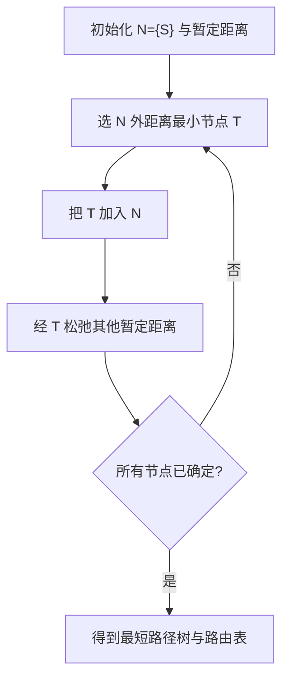
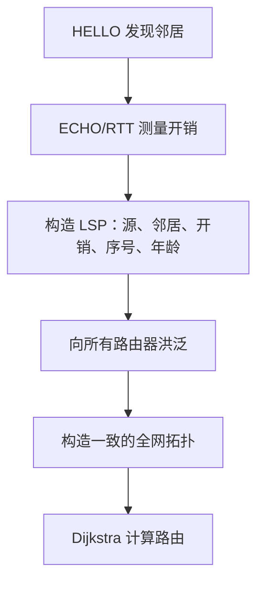
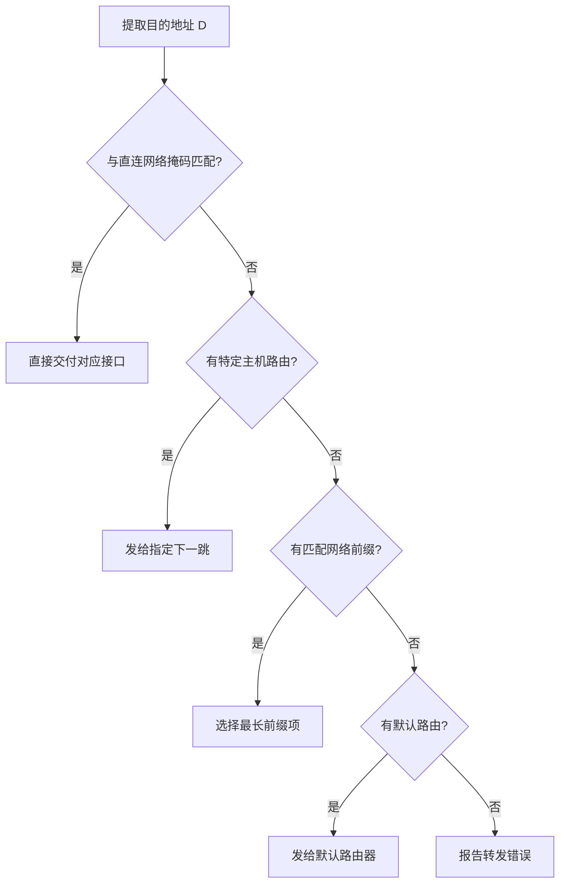
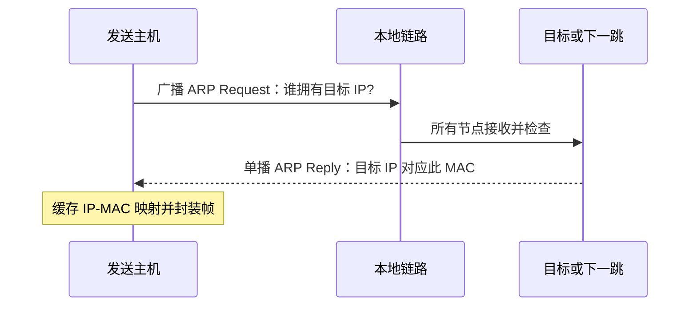
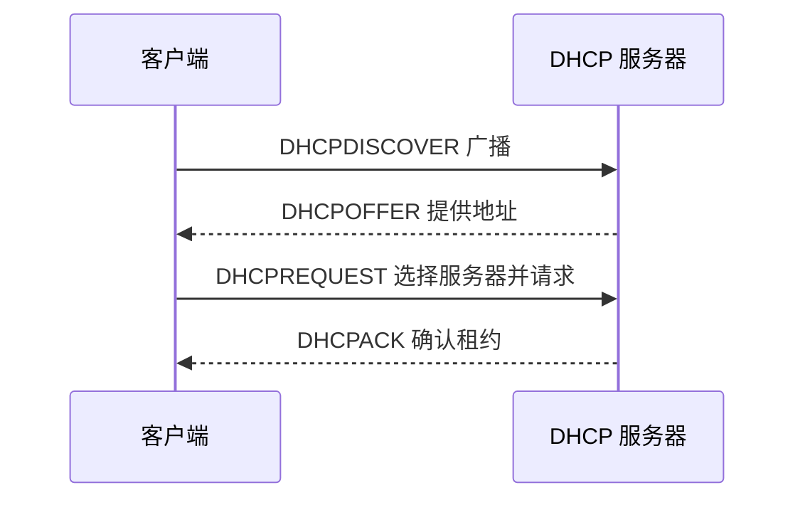
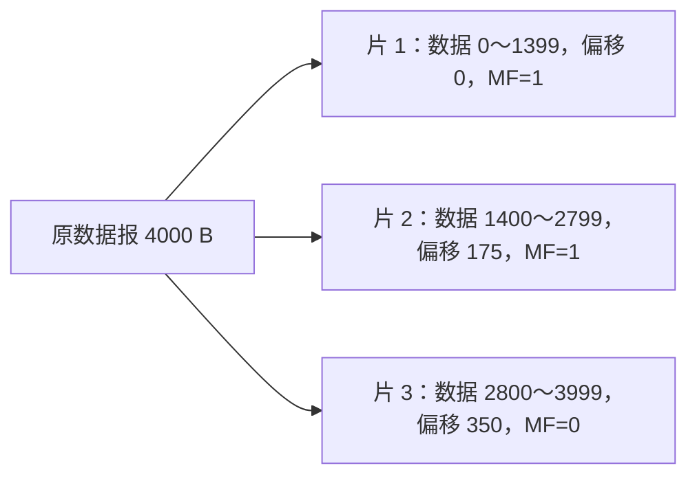
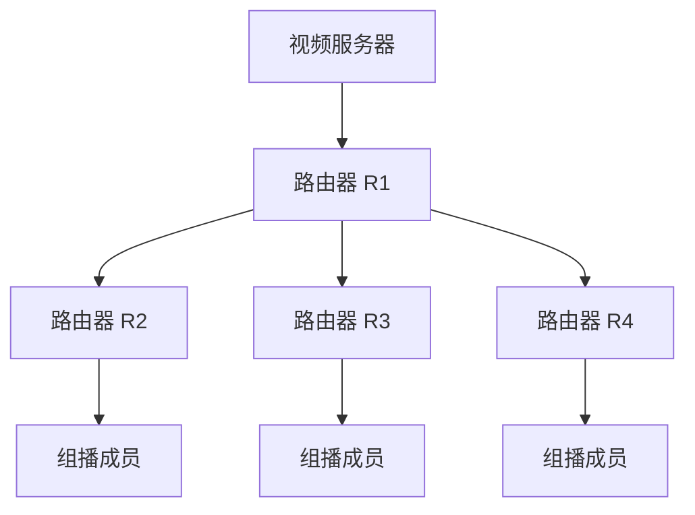
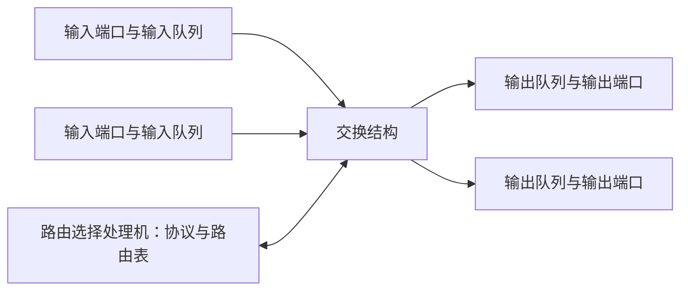
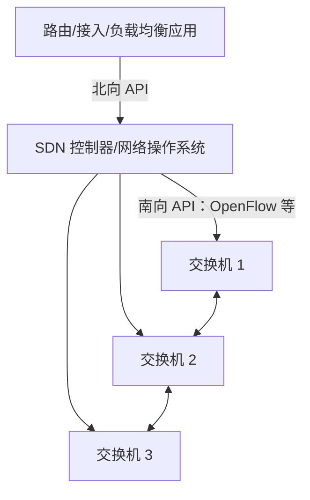
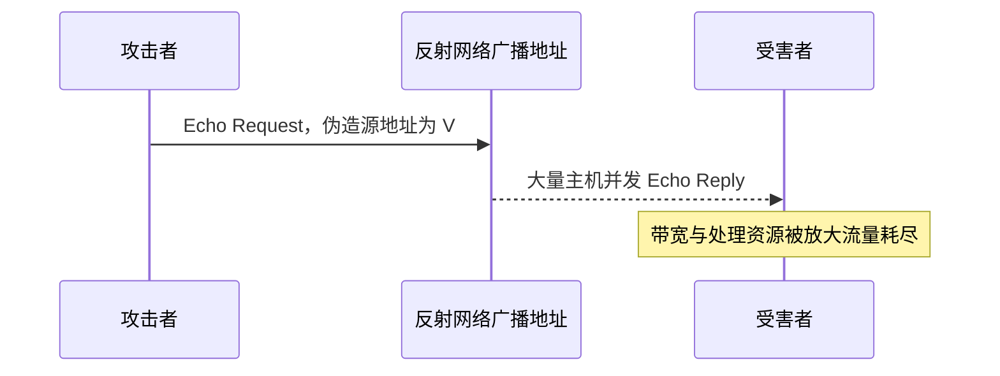

# 4.1 网络层

> 本笔记依据第四章 OCR 文稿与原 PDF 整理，贯通网络互连、选路与转发、IPv4、ICMP、路由协议、组播、路由器、IPv6、SDN 和 IPSec。课件的 131 幅图片均逐一核查，信息已由 Mermaid、管道表格、LaTeX 或完整文字说明接替。

## 主要内容

- 网络层功能、网络互连、虚电路与数据报
- 静态与动态路由算法
- IPv4 地址、子网、CIDR、NAT、DHCP 与 ARP
- IP 首部、分片、ICMP 与因特网路由协议
- 组播、移动 IP、路由器队列和调度
- IPv6、SDN、OpenFlow 与网络层安全

---

## 一、网络层概述

### 1. 功能与端到端过程

> 网络层实现主机到主机的逻辑通信，屏蔽异构底层网络，向运输层提供统一服务。

主要功能包括：依据目的 IP 选择下一跳；为主机和路由器接口编址；跨不同网络转发；当包长超过输出网络 MTU 时分片并在目的端重装。

### 2. 不同层次的互连设备

| 层次 | 设备 | 转发对象 | 地址依据 |
|---|---|---|---|
| 物理层 | 中继器、集线器 | 比特流 | 无地址 |
| 数据链路层 | 网桥、交换机 | 帧 | MAC 地址 |
| 网络层 | 路由器 | IP 包 | IP 地址 |
| 运输层及以上 | 网关 | 高层数据 | 端口或协议特定标识 |

中继器、网桥和交换机主要扩大同一网络范围；路由器在不同网络间存储转发；网关可连接不同体系结构或协议。所有底层网络统一使用 IP 后，构成虚拟互连网络。

### 3. 虚电路与数据报

> 虚电路在传输前建立逻辑连接，数据经历建立、传输、拆除三阶段；输入接口与输入 VCI 唯一标识一条虚电路，路由器将其映射为输出接口与输出 VCI。

| 特点 | 数据报网络 | 虚电路网络 |
|---|---|---|
| 预先连接 | 不需要 | 需要 |
| 包内地址 | 完整目的地址 | 较短 VCI |
| 资源 | 动态分配 | 可预先分配 |
| 选路 | 每包独立 | 建连时完成 |
| 可靠性与顺序 | 不保证 | 同一虚电路上较易保证 |
| 路径 | 同一流可能不同 | 同一连接沿同一路径 |
| 故障影响 | 主要影响当前包 | 经过故障点的连接需重建 |
| QoS/拥塞控制 | 较难 | 较易 |

因特网采用无连接数据报：路由器简单、成本低、运行灵活；需要可靠性的应用由端系统运输层负责。

---

## 二、路由选择基础

### 1. 选路与转发

> 路由选择根据目的地址确定下一跳或输出接口；转发则把包从输入接口移动到选定输出接口。路由表由路由算法产生，转发表由路由表导出。

理想算法应正确完整、计算简单、自适应、稳定、公平且尽量优化，但不存在绝对最佳算法。图模型中路由器是节点，链路是边，权值可以是跳数、距离、时延或其他开销；最短路由指总开销最小。

### 2. 静态路由、洪泛和随机走动

静态路由表预先设定，不随当前拓扑和负载自动变化。洪泛把包复制到除入接口外的所有接口；可用跳数、序号或生成树限制重复，可靠且可找到最短时延路径，但负载大。随机走动按概率选择输出接口，控制简单但时延和到达性不确定。

### 3. Dijkstra 最短路径

算法维护已确定最短路的集合 $N$：

1. 初始 $N=\{S\}$，源到邻居为边权，其他为 $\infty$。
2. 在 $N$ 外选暂定距离最小节点 $T$ 加入 $N$。
3. 用经过 $T$ 的路径松弛其余节点距离。
4. 重复直到所有节点加入。

课件例图从 A 出发的直接开销为 $AB=2$、$AC=5$、$AD=1$，随后按最小暂定距离依次扩展，形成以 A 为根的最短路径树。强调：边数最少不等于权值和最小。

---

## 三、动态路由算法

### 1. 距离矢量 DVR

> 每台路由器已知到邻居的距离，周期性地只与邻居交换“目的地—距离”，并按 Bellman-Ford 思想更新。

$$
D_x(y)=\min_{v\in N(x)}\{c(x,v)+D_v(y)\}
$$

课件例中 A 到邻居 $B,C,D$ 的开销分别为 2、4、3。结合邻居距离向量，更新结果为：到 B 经 B 距离 2；到 C 经 C 距离 4；到 D 经 D 距离 3；到 E 经 C 距离 5；到 F 经 D 距离 6。

DVR 只知距离不知完整路径，坏消息传播慢，可能出现计数到无穷和路由环。可通过限制直径（RIP 把 16 视为不可达）、路径矢量（BGP）或让节点掌握拓扑（OSPF）缓解。

### 2. 链路状态 LSR

> 每台路由器发现邻居、测量链路开销、构造 LSP、向全网洪泛，并在本地用 Dijkstra 计算最短路。

LSP 用大序号区分新旧，用年龄字段使过期包消亡；课件示例年龄初值可取 60，每秒减 1。LSR 的好处是信息一致、坏消息传播快、LSP 长度主要与邻居数有关，适合大型网络；代价是每个路由器需存全网状态并反复计算最短路。

---

## 四、IPv4 地址与子网

### 1. 地址与分类编址

> IPv4 地址是分配给网络接口的 32 位全球标识，由网络号和主机号组成；多接口设备拥有多个地址。

| 类别  | 首位模式 | 默认前缀 | 网络数/主机数要点                      |
| --- | ---- | ---: | ------------------------------ |
| A   | 0    |   /8 | 约 $2^7-1$ 个网络，每网 $2^{24}-2$ 主机 |
| B   | 10   |  /16 | $2^{14}$ 个网络，每网 $2^{16}-2$ 主机  |
| C   | 110  |  /24 | $2^{21}$ 个网络，每网 $2^8-2$ 主机     |
| D   | 1110 |   组播 | 224.0.0.0～239.255.255.255      |
| E   | 1111 |   保留 | 试验/未来用途                        |

减 2 是因为主机号全 0 表示网络地址、全 1 表示本网广播地址。特殊地址还包括 0.0.0.0、有限广播 255.255.255.255 和 127/8 环回。

### 2. 子网与掩码

从主机号高位借位作为子网号：

$$
\text{IP}=\{\text{网络号},\text{子网号},\text{主机号}\}
$$

掩码中网络/子网位为 1，主机位为 0；网络地址为

$$
\text{Network Address}=\text{IP Address}\mathbin{\mathrm{AND}}\text{Subnet Mask}
$$

**例 1**：$141.14.72.24$ 与 $255.255.192.0$。第三字节 $72=01001000_2$，$192=11000000_2$，按位与得 $01000000_2=64$，所以网络地址为 $141.14.64.0$。

**例 2**：掩码改为 $255.255.224.0$，$72\ \mathrm{AND}\ 224=64$，网络地址仍为 $141.14.64.0$，但前缀从 /18 变为 /19，地址块大小不同。

### 3. 转发与最长前缀匹配

课件 $R_1$ 例中，目的 $128.30.33.138$ 与 /25 掩码相与得到 $128.30.33.128$，匹配子网 2，故从接口 1 直接转发，而不是匹配更粗的其他网络项。

### 4. VLSM、超网与 CIDR

VLSM 允许各子网使用不同掩码。超网把 $2^n$ 个连续 C 类地址块合并，起始第三字节必须能被块数整除。CIDR 取消类别，以 $a.b.c.d/x$ 表示前缀，地址块含 $2^{32-x}$ 个地址。

路由聚合把连续小前缀汇总为短前缀，缩小路由表。若多个表项匹配，应选前缀最长、范围最具体者。

**例**：目的 $206.0.71.129$ 同时匹配 $206.0.68.0/22$ 和 $206.0.71.128/25$，选择 /25。

| 前缀 | 掩码 | 每块地址数 |
|---:|---|---:|
| /16 | 255.255.0.0 | 65536 |
| /18 | 255.255.192.0 | 16384 |
| /20 | 255.255.240.0 | 4096 |
| /22 | 255.255.252.0 | 1024 |
| /24 | 255.255.255.0 | 256 |
| /25 | 255.255.255.128 | 128 |
| /26 | 255.255.255.192 | 64 |
| /27 | 255.255.255.224 | 32 |
| /28 | 255.255.255.240 | 16 |
| /29 | 255.255.255.248 | 8 |
| /30 | 255.255.255.252 | 4 |

---

## 五、地址解析、NAT 与 DHCP

### 1. ARP 与 RARP

> ARP 在同一链路上把已知 IPv4 地址解析为 MAC 地址；ARP 请求以广播发送，持有目标 IP 的节点以单播应答，结果进入 ARP 缓存。若目的 IP 不在本网，主机解析的是下一跳默认网关的 MAC，而非远端主机 MAC。

RARP 用 MAC 反查 IP，功能已基本由 BOOTP/DHCP 取代。课件协议栈图将 ARP/RARP 放在 IP 与底层链路技术之间，强调其地址解析作用。

### 2. 私有地址与 NAT

私有地址为 10/8、172.16/12、192.168/16。NAT 路由器将私有地址转换为全局地址；NAPT 还用端口区分多台内部主机。

| 方向 | 转换前 | 转换后 |
|---|---|---|
| 出站源 | 172.18.3.1:2000 | 200.24.5.8:1400 |
| 出站源 | 172.18.3.2:2000 | 200.24.5.8:1401 |
| 入站目的 | 200.24.5.8:1400 | 172.18.3.1:2000 |
| 入站目的 | 200.24.5.8:1401 | 172.18.3.2:2000 |

NAT 的问题：一个全局地址对应大量接口，需保存连接状态，把无连接网络变成状态相关服务；网络层读取运输层端口违反严格分层；非 TCP/UDP 数据难以按端口转换。

### 3. DHCP

DHCP 是应用层 C/S 协议，使用 UDP 67/68，可分配 IP、掩码、默认路由和 DNS 地址。

---

## 六、IPv4 包、分片与 ICMP

### 1. IPv4 首部

| 字段     |     长度 | 作用                                 |
| ------ | -----: | ---------------------------------- |
| 版本     |    4 位 | IPv4 值为 4                          |
| 首部长度   |    4 位 | 单位 4 B，最小 20 B                     |
| 服务类型   |    8 位 | QoS/区分服务                           |
| 总长度    |   16 位 | 首部加数据，最大 65535 B                   |
| 标识     |   16 位 | 同一原数据报各片相同                         |
| 标志     |    3 位 | 含 DF、MF                            |
| 片偏移    |   13 位 | 单位 8 B                             |
| TTL    |    8 位 | 每经路由器减 1，防环路                       |
| 协议     |    8 位 | ICMP=1、IGMP=2、TCP=6、UDP=17、OSPF=89 |
| 首部校验和  |   16 位 | 仅校验首部，路由器须重算                       |
| 源/目的地址 | 各 32 位 | 端点接口地址                             |
| 选项与填充  | 0～40 B | 源路由、记录路由、时间戳等                      |

### 2. 分片与重装

> 当 IP 数据报大于输出网络 MTU 时可分片。各片标识相同；DF=1 禁止分片；MF=1 表示后面还有片；片偏移以 8 B 为单位。重装只在目的主机进行。

若片 2 还需通过更小 MTU，可继续分为 1400～2199（偏移 175）与 2200～2799（偏移 275），原始标识不变。非末片数据长度必须是 8 B 的整数倍。

### 3. ICMP、PING 与 Tracert

> IP 本身不处理差错，ICMP 作为网络层补充进行报告和控制；ICMP 报文封装在 IP 数据部分，协议字段为 1。它只报告，不保证纠正。

| 类型 | 典型消息 |
|---|---|
| 差错报告 | 目的不可达、TTL 超时、参数错误 |
| 控制 | 重定向；源抑制已弃用 |
| 查询 | Echo 请求/应答、时间戳请求/应答 |

PING 直接使用 Echo 请求/应答测试连通性和 RTT，不经过 TCP/UDP。课件 Windows 示例向 121.194.0.203 发 4 个 32 B 请求，全部收到，时延 1～2 ms、平均 1 ms、TTL 54。

Tracert 依次发送 TTL=1、2、3… 的包；每一跳在 TTL 归零时返回 ICMP Time Exceeded，目的端最后响应，从而列出路径和每跳时延。

---

## 七、因特网路由协议

### 1. 分层路由与自治系统

因特网规模要求分层。自治系统 AS 是同一管理机构控制、内部使用统一协议的网络与路由器集合。IGP 在 AS 内运行，如 RIP、OSPF；EGP 在 AS 间运行，主流为 BGP-4，二者相互独立。

### 2. RIP

> RIP 基于距离矢量，距离为跳数，周期性向邻居通告；最大有效距离 15，16 表示不可达。

RIP 通告包含命令、版本以及多个路由项；路由项给出地址族、目的网络、掩码、下一跳和距离。新链路是“好消息”会快速传播；链路中断可能使相邻路由器互相误信，距离 2、3、4… 增长，形成计数到无穷。

### 3. OSPF 与 BGP

| 协议    | 范围   | 算法   | 信息            | 关键特点                  |
| ----- | ---- | ---- | ------------- | --------------------- |
| RIP   | AS 内 | 距离矢量 | 目的与跳数         | 简单，适合小网络              |
| OSPF  | AS 内 | 链路状态 | 全网拓扑          | Dijkstra、区域与骨干 Area 0 |
| BGP-4 | AS 间 | 路径矢量 | 可达前缀和 AS_PATH | 关注策略与可达性，经 TCP 179    |

OSPF 消息包括 Hello、链路状态更新 LSU、链路状态确认 LSA、链路状态请求 LSR。BGP 携带完整 AS 路径以防环路，不以绝对最短为唯一目标。

---

## 八、IP 组播与移动 IP

### 1. 组播

多次单播会沿共同链路发送重复数据；网络层组播由源只发一次，路由器在分叉处复制。D 类组播地址范围 224.0.0.0～239.255.255.255，只能作为目的地址。

IGMP 在 LAN 内让路由器获知成员，消息包括成员报告、成员查询和离组，封装于 IP，协议号 2。组播树可为所有源共享，也可按源构造特定树。

网络层组播部署成本、路由器状态、组管理时延、可靠性与认证均存在局限。应用层组播则由终端组成叠加网络并复制转发，部署容易但路径可能绕行。

### 2. 移动 IP

移动节点离开归属网络仍使用原 IP。归属代理截获发往移动节点的包，封装后通过隧道送到外来代理/转交地址，外来代理解封并交付；移动节点回复可直接发往相关节点，形成三角路由。

---

## 九、路由器与队列

### 1. 结构与路由表

路由器有多个输入/输出接口，以存储转发方式处理 IP 包。控制/选路处理机运行协议并建立路由表，数据路径依据转发表快速转发。

路由表项含目的地址、掩码、下一跳和接口。查找优先考虑直达网络、特定主机、非直达网络，最后是默认路由，并始终遵循最长前缀匹配。

### 2. 排队、丢弃与调度

输入或输出速率不足会导致队列溢出，这是 IP 丢包的重要原因。

| 调度 | 规则 | 特点 |
|---|---|---|
| FIFO | 按到达顺序 | 公平但不支持 QoS |
| 优先级 PQ | 高优先队列空后才服务低优先 | 支持 QoS，低优先可能饥饿 |
| 加权公平 WFQ | 按权值轮流服务各队列 | 兼顾 QoS 与公平 |

---

## 十、IPv6

### 1. 目标、地址与首部

IPv4 面临地址耗尽、路由表膨胀以及多媒体、安全和移动支持不足。IPv6 使用 128 位地址、固定 40 B 基本首部和 7 个主要字段，取消首部校验和及基本首部中的分片字段，路由器处理更快。

IPv6 用冒分十六进制。前导 0 可省略，连续全 0 段可用一次双冒号压缩。例如：

$$
\text{FDEC:BA98:0074:3210:000F:BBFF:0000:FFFF}
$$

可写为

$$
\text{FDEC:BA98:74:3210:F:BBFF:0:FFFF}
$$

| 字段 | 作用 |
|---|---|
| 版本 | 值为 6 |
| 业务类别 | 区分类别或优先级 |
| 流标签 | 标识同一业务流 |
| 有效载荷长度 | 扩展首部加数据长度 |
| 下一个首部 | 扩展首部或上层协议 |
| 跳数限制 | 对应 IPv4 TTL |
| 源/目的地址 | 各 128 位 |

扩展首部包括逐跳选项、目的选项、路由、分片、认证和加密净荷。

### 2. 与 IPv4 互通

| 方案 | 场景 | 方法 |
|---|---|---|
| 双栈 | 过渡初期 | 节点同时运行 IPv4/IPv6 |
| 隧道 | IPv6 通信跨越 IPv4 区域 | 把 IPv6 包封装在 IPv4 包中 |
| 首部翻译 | 两类主机直接互通 | 在边界转换首部语义 |

---

## 十一、SDN 与 OpenFlow

### 1. 数据层面和控制层面

传统路由器中控制软件和转发硬件紧耦合，各设备分布式计算，配置管理复杂且难以全局优化。SDN 将二者分离：逻辑集中控制器以软件计算全局策略，通用交换机按流表执行。

SDN 是体系结构，不等于 OpenFlow，也不强制使用 OpenFlow。其优点包括更高带宽利用率、更稳定运行、更简化管理和更低运维成本。

### 2. OpenFlow 流表

每台交换机有一个或多个流表，每个流表项包括匹配字段、计数器和动作。匹配可跨入端口、以太网、VLAN、IP、TCP/UDP；动作包括转发、丢弃、复制和重写首部。

| 示例匹配 | 动作 |
|---|---|
| 源 10.3.*.*，目的 10.2.*.* | 沿 $S_3\to S_1\to S_2$ 转发 |
| 入端口 3，目的 10.1.*.* | 从端口 2 转发 |
| 入端口 4，目的 10.1.*.* | 从端口 1 转发，实现不同路径负载均衡 |

---

## 十二、网络层安全与 IPSec

### 1. IP/ICMP 攻击

IP 无连接且不认证源地址，攻击者可伪造地址骗取信任或放大流量。典型攻击包括超长 ICMP 导致旧实现崩溃、PING Flooding 高速耗尽带宽，以及 Smurf：把受害者地址伪造成源地址向反射网络广播地址发 Echo 请求，大量主机把 Echo Reply 返回受害者。

### 2. IPSec

> IPSec 在网络层为 IP 上的任意协议提供访问控制、数据源认证、无连接完整性、抗重放和保密性，并支持密钥管理。

AH 鉴别源点并保护完整性，但不加密；ESP 可提供加密，并可结合认证。主机实施可提供端到端、细粒度保护；安全网关实施适合网到网或远程接入。

| 模式 | 保护范围 | 典型应用 |
|---|---|---|
| 传输模式 | 原 IP 包的数据部分 | 主机到主机，开销较小 |
| 隧道模式 | 整个原 IP 包，外加新 IP 首部 | 网关到网关、网关到主机 |

---

## 十三、课件勘误

整理时采用课件更正：统一“邻居节点”；特殊地址图的本网广播、网络地址和他网广播顺序修正；NAT 示例网络改为 172.18.3.0/24；分片示例数值 2272 改为 2312；路由更新例改为 A 误信 B 到网络 1 的通告；洪泛接口补全；“随机早期丢弃检测”改为“随机早期检测”；IPv6 图名改为“IPv6 包结构”，字段“优先级”改为 8 位业务类别。被 OCR 明显破坏的数值不作为新推导依据。

---

## 十四、图片审计

> [!important] 逐图核查结论
> OCR 文稿共 131 个图片引用，以下编号严格按出现顺序连续列出。可可靠重建的拓扑、协议流程、包结构和体系结构均已原生重构；截图、复杂数值图以文字和表格转写；箭头、封面等装饰图注明不增加知识。

| 编号 | 核查结果 |
|---:|---|
| 001 | 章节标题字样，装饰图 |
| 002 | 访问北邮主页的跨路由路径，已纳入端到端过程 |
| 003 | 绿色箭头，装饰图 |
| 004 | 网络层互连、分组、编址、路由、分片及相邻协议关系，已文字化 |
| 005 | 中继器只工作在物理层，已入设备表 |
| 006 | 网桥/交换机工作至链路层，已入设备表 |
| 007 | 路由器工作至网络层，已入设备表 |
| 008 | 网关处理更高层协议，已入设备表 |
| 009 | 物理互联与虚拟 IP 互联网对比，已文字化 |
| 010 | IP 包经多个网络与路由器逐跳交付，已重构流程 |
| 011 | 源主机封装并查路由表，已重构流程 |
| 012 | Windows route print 截图，已说明路由表字段 |
| 013 | 路由器处理首部并查表转发，已重构 |
| 014 | 目的主机验址、去首部并上交，已重构 |
| 015 | 运输层看到的统一网络与实际拓扑，已文字化 |
| 016 | 路由器图模型拓扑，已纳入选路定义 |
| 017 | 电路交换、虚电路与数据报分类，已文字化 |
| 018 | VCI 在交换节点局部改写，已重构 |
| 019 | 输入端口/VCI 到输出端口/VCI 映射，已说明 |
| 020 | 虚电路跨 WAN 逐跳映射，已重构 |
| 021 | 虚电路网络和 VCI 标注，已说明 |
| 022 | 数据报网络中的包丢失，已纳入不可靠服务 |
| 023 | 同一源目的包可走不同路径，已文字化 |
| 024 | 带权拓扑中的最短路径，已纳入 Dijkstra |
| 025 | 洪泛接口选择示意，已文字化 |
| 026 | 静态路由示例拓扑，已纳入算法说明 |
| 027 | 各链路权值总览，已文字化 |
| 028 | Dijkstra 初始最短路径树，已入步骤 |
| 029 | Dijkstra 迭代拓扑，已入步骤 |
| 030 | 集合 N 初始节点和暂定距离，已重构流程 |
| 031 | Dijkstra 加入新节点后的拓扑，已入步骤 |
| 032 | 暂定最短路径树继续扩展，已入步骤 |
| 033 | Dijkstra 后续迭代拓扑，已入步骤 |
| 034 | 最终最短路径树，已文字化 |
| 035 | 绿色箭头，装饰图 |
| 036 | 洪泛从源向各接口复制，已文字化 |
| 037 | 数字节点洪泛传播，已文字化 |
| 038 | 多源/多色包洪泛及重复，已说明 |
| 039 | 全网接口上的重复包状态，已说明 |
| 040 | A～F 路由拓扑字母标识，已用于算法例 |
| 041 | DVR 距离逐轮传播表，已说明好消息传播 |
| 042 | DVR 带权拓扑，已用于 Bellman-Ford 公式 |
| 043 | 各节点 LSP 表与全网拓扑，已入 LSR |
| 044 | IP、ARP/RARP、ICMP/IGMP、RIP/OSPF/BGP 协议关系，已文字化 |
| 045 | A 类地址位结构，已入分类表 |
| 046 | B 类地址位结构，已入分类表 |
| 047 | C 类地址位结构，已入分类表 |
| 048 | 32 位二进制到点分十进制 128.11.3.31，已说明 |
| 049 | 路由器多接口各有不同网络 IP，已说明 |
| 050 | 全零、广播、网络与环回等特殊地址，已入正文 |
| 051 | 绿色箭头，装饰图 |
| 052 | 145.13.0.0 两级地址网络，已说明 |
| 053 | 145.13.0.0 划分三个子网，已说明 |
| 054 | 网络号/子网号/主机号与掩码，已公式化 |
| 055 | IP 与掩码按位与，已公式化 |
| 056 | 141.14.72.24 第三字节二进制，已用于例题 |
| 057 | 255.255.192.0 掩码位结构，已用于例题 |
| 058 | 按位与得 141.14.64.0，已保留结果 |
| 059 | 网络地址 141.14.64.0，已保留 |
| 060 | 255.255.224.0 替代掩码，已讨论差异 |
| 061 | R1 三子网与路由表，已纳入转发例 |
| 062 | H1 判断目的是否同网，已纳入流程 |
| 063 | 目的与 /25 掩码相与过程，已保留 |
| 064 | 第一路由项不匹配，已说明 |
| 065 | 第二路由项匹配并从接口 1 转发，已说明 |
| 066 | VLSM 以 /26 与 /27 满足 62/30 主机需求，已文字化 |
| 067 | 四个 C 类网合并超网，已说明 |
| 068 | 子网与超网掩码借位方向，已文字化 |
| 069 | 不同大小 CIDR 地址块，已说明 |
| 070 | 128.192.111.192/28 再分两个 /29，已说明 |
| 071 | ISP 对组织地址块层次聚合，已说明 |
| 072 | 私网经 NAT 使用公网地址，已说明 |
| 073 | NAT 出入方向地址转换，已重建表格 |
| 074 | DHCP 发现、提供、请求、确认，已重构时序 |
| 075 | IPv4 首部布局，已重建字段表 |
| 076 | 协议字段与上层/控制协议关系，已入协议号表 |
| 077 | IPv4 首部反码校验和例，已说明算法 |
| 078 | 标识、DF、MF、片偏移位布局，已入表 |
| 079 | 4000 B 数据报多级分片，已重构 |
| 080 | Windows PING 输出截图，数值已保留 |
| 081 | TTL 递增与 ICMP 超时构成 Tracert，已文字化 |
| 082 | 两个 AS 分别用 IGP、经 BGP-4 互联，已说明 |
| 083 | A～F 选路拓扑，已用于协议说明 |
| 084 | 绿色箭头，装饰图 |
| 085 | RIP 消息首部与路由项，已文字化 |
| 086 | RIP 示例网络拓扑，已说明 |
| 087 | RIP 通告的三条网络项，已说明 |
| 088 | Net1 新接入拓扑，已说明好消息传播 |
| 089 | Net1 断开图，已说明坏消息传播 |
| 090 | 路由器 A、B 与 Net2/Net3 拓扑，已文字化 |
| 091 | Net1 断开标记，已文字化 |
| 092 | A、B 互告旧路由形成环路，已说明 |
| 093 | OSPF Area 0、区域边界与 AS 边界，已文字化 |
| 094 | 视频服务器向 90 个用户多次单播，已说明开销 |
| 095 | 路由器复制的一次组播，已重构 |
| 096 | 骨干 ISP 组播树，已文字化 |
| 097 | IGMP 请求/报告及组播路由更新，已说明 |
| 098 | 组 1 与组 2 不同组播树，已文字化 |
| 099 | 单组源特定树分支，已说明 |
| 100 | 两个组在共享拓扑中的不同树，已说明 |
| 101 | 灰色箭头，装饰图 |
| 102 | 广播中心沿树复制的共享路径，已说明 |
| 103 | 网络拓扑含路由器与成员，已说明 |
| 104 | IP 组播树从源覆盖接收者，已文字化 |
| 105 | 应用层成员自行复制的叠加边，已说明 |
| 106 | 应用层组播叠加网开销，已文字化 |
| 107 | 移动 IP 四步转交，已重构 |
| 108 | 路由器输入/交换/输出/选路结构，已重构 |
| 109 | 各接口独立输入输出队列，已说明 |
| 110 | FIFO 满则丢弃并按到达处理，已入表 |
| 111 | 优先级队列，已入表 |
| 112 | 权重 3:2:1 的 WFQ，已入表 |
| 113 | R1 直达、远程、主机与默认路由，已说明 |
| 114 | IPv6 128 位十六进制表示，已说明 |
| 115 | IPv6 地址压缩，已保留示例 |
| 116 | IPv4 首部字段在 IPv6 中删除/替换，已说明 |
| 117 | IPv4/IPv6 与相邻协议关系，已文字化 |
| 118 | IPv6 穿越 IPv4 的隧道封装，已说明 |
| 119 | IPv6 到 IPv4 首部翻译，已说明 |
| 120 | 传统分布式控制与转发表，已说明 |
| 121 | 远程控制器下发转发表，已重构 |
| 122 | SDN、OpenFlow、控制/数据层面关系，已说明 |
| 123 | OpenFlow 交换机含多个流表，已说明 |
| 124 | 流表匹配字段、计数器、动作，已入正文 |
| 125 | OpenFlow 简单转发拓扑，已保留路径 |
| 126 | OpenFlow 负载均衡拓扑，已保留规则 |
| 127 | 应用—控制器—交换机 SDN 架构，已重构 |
| 128 | SDN 状态管理与北/南向 API，已说明 |
| 129 | Smurf 反射放大攻击，已重构时序 |
| 130 | IPSec 网关间保护数据的协议栈，已说明 |
| 131 | IPSec 网关间加密隧道，已重构 |

---

## 本章小结

| 主题 | 核心结论 |
|---|---|
| 网络层 | 主机到主机交付，负责编址、选路、转发与分片 |
| 服务 | 数据报尽力而为；虚电路先连接并用 VCI 转发 |
| 选路 | Dijkstra、DVR 与 LSR 在信息量、收敛和规模上权衡 |
| IPv4 | 掩码按位与，CIDR 聚合，最长前缀匹配 |
| 辅助协议 | ARP 解地址，DHCP 配参数，ICMP 报错，IGMP 管组播 |
| 路由协议 | RIP、OSPF、BGP 对应距离矢量、链路状态和路径矢量 |
| 路由器 | 控制面生成表，数据面转发，队列溢出导致丢包 |
| 演进与安全 | IPv6、SDN 与 IPSec 分别解决地址/首部、控制和安全问题 |

## 课后思考

1. 对给定 IP、掩码和路由表执行最长前缀匹配。
2. 比较 DVR 与 LSR 的交换对象、内容、时机、收敛和开销。
3. 给定 MTU 与原数据报长度，计算各片长度、MF 与片偏移。
4. 解释 ARP、DHCP、ICMP、IGMP、RIP、OSPF、BGP 的作用范围。
5. 比较 IPv6 双栈、隧道、翻译及 IPSec 两种模式。
6. 为 OpenFlow 简单转发和负载均衡写匹配—动作规则。

