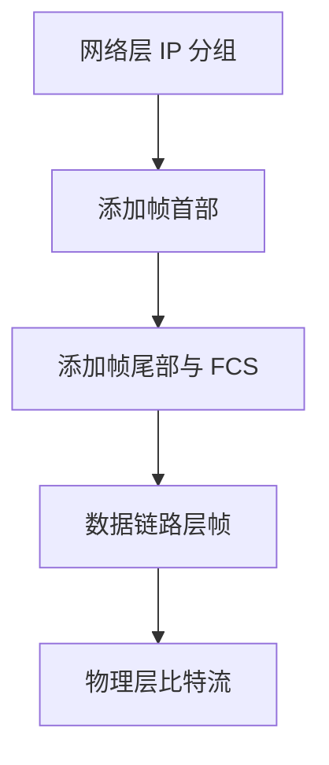
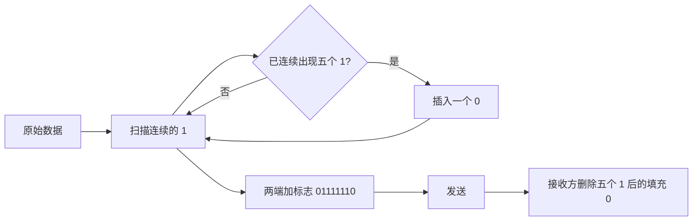
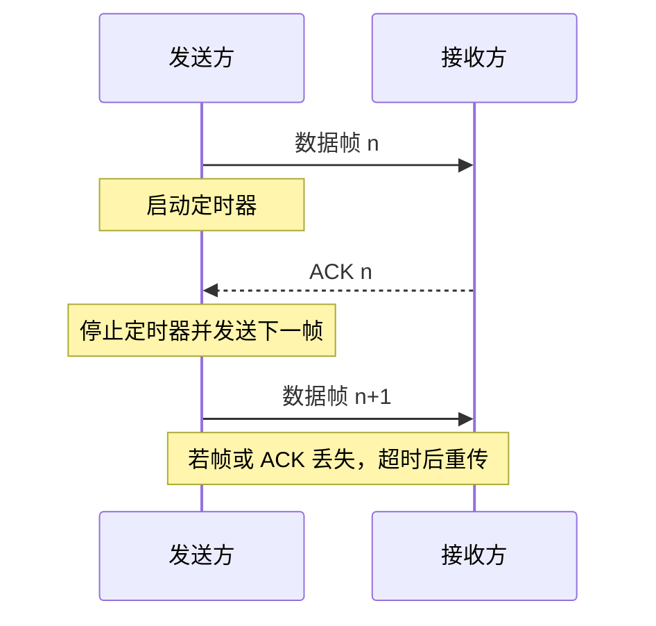
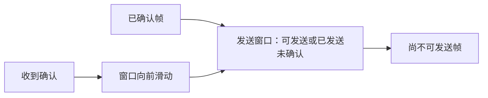
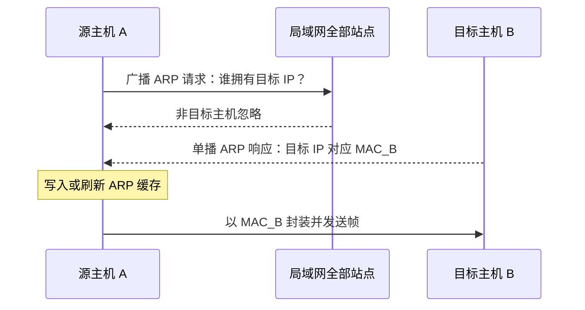
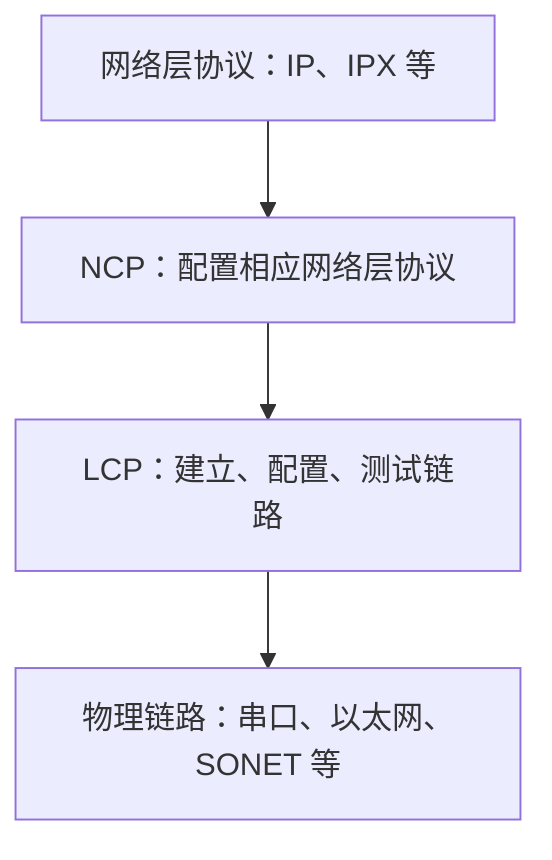
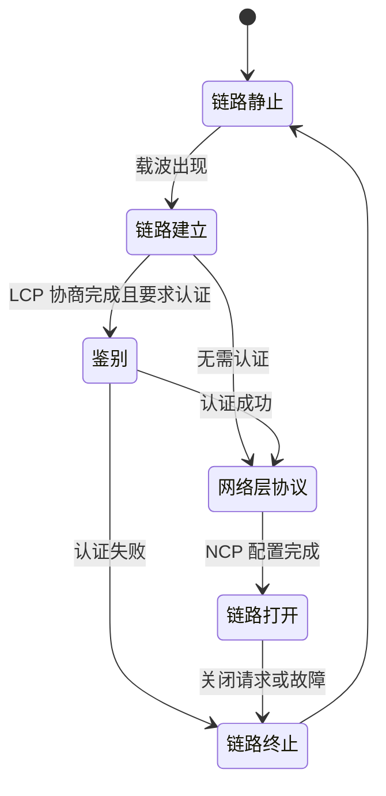
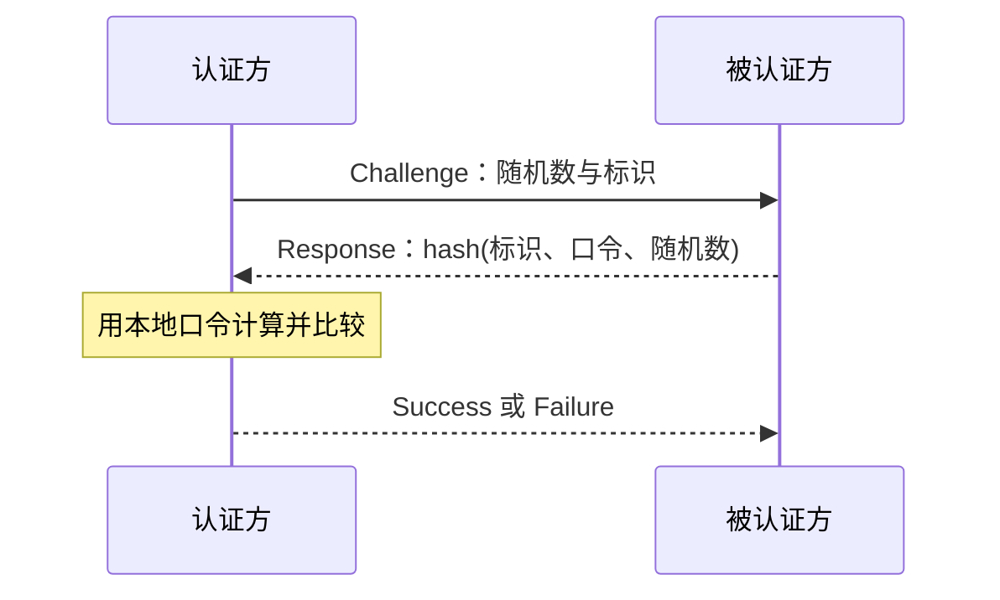

# 5.1 数据链路层

> 本章讨论如何把不可靠的物理链路组织成可用的数据链路，使相邻主机或路由器能够按帧传输。重点是成帧、透明传输、差错控制、链路寻址、ARP，以及 HDLC、PPP 等协议实例。

## 主要内容

- 数据链路层的功能、信道类型和服务
- 成帧与透明传输
- 奇偶校验、CRC、ARQ 与纠错码
- MAC 地址、ARP 与跨子网传输
- HDLC 与 PPP
- PAP、CHAP 与 ARP 欺骗

---

## 一、数据链路层的作用

### 1. 逐跳传输

端到端通信实际由多段相邻节点间的传输组成。网络层确定主机到主机的路径，数据链路层负责每一段链路上的帧传输；不同链路可以采用不同的数据链路层协议。

> **链路**是中间没有交换节点的点到点物理线路段；**数据链路**是链路加上控制数据传输的协议；**帧**是数据链路层的协议数据单元。

### 2. 为什么需要数据链路层

1. 差错控制：  
   噪声会造成比特翻转、增加或删除，需要检测并在必要时恢复数据。
2. 流量控制：  
   防止发送方过快而淹没接收方。
3. 成帧与同步：  
   在连续比特流中识别一帧的开始和结束。
4. 透明传输：  
   不限制上层数据中可以出现的字符或比特组合。
5. 链路管理与寻址：  
   建立、维护、释放链路，并标识链路两端的网络接口。
6. 访问控制：  
   在广播链路上决定谁能发送，详见 [[6.1 局域网]]。

### 3. 信道类型与服务

| 维度 | 类型 | 特点 |
|---|---|---|
| 信道 | 点到点信道 | 两台设备独占，一对一通信 |
| 信道 | 广播信道 | 多台设备共享，需要解决信道竞争 |
| 服务 | 无确认的无连接服务 | 不建立连接、不确认，适合低误码率 LAN |
| 服务 | 有确认的无连接服务 | 每帧独立确认，适合较不可靠的 WLAN |
| 服务 | 面向连接服务 | 先建立连接，再可靠传输，常用于 WAN |

数据链路层协议通常由网卡实现。网卡既执行链路层协议，也承担相应物理层收发功能。

---

## 二、封装成帧与透明传输

### 1. 帧的基本结构

发送方在网络层分组前后加入帧首部和帧尾部。首尾部完成定界、寻址、控制和检错；帧的数据部分通常不能超过链路规定的最大传输单元 MTU。

| 帧首部 | 数据部分 | 帧尾部 |
|---|---|---|
| 定界、地址、控制 | 上层分组，长度受 MTU 限制 | 帧定界、FCS 等 |

### 2. 四种成帧方法

| 方法       | 原理               | 透明传输措施                  | 主要问题或特点       |
| -------- | ---------------- | ----------------------- | ------------- |
| 字符计数法    | 长度字段给出帧的总字节数     | 无额外措施                   | 长度字段出错后难以恢复同步 |
| 字符填充法    | 固定字符标识帧首与帧尾      | 数据中出现控制字符时，在前面插入 `DLE`  | 依赖字符集         |
| 零比特填充法   | 首尾均用 `01111110`  | 数据中连续出现五个 `1` 后插入一个 `0` | 面向比特，不依赖字符集   |
| 物理层编码违例法 | 用正常数据不会出现的冗余码元定界 | 无需填充                    | 要求物理编码存在未使用码元 |

**字符填充示例**：BISYNC 使用 `SOH=0x01` 作为帧首、`EOT=0x04` 作为帧尾，数据中出现 `SOH`、`EOT` 或 `DLE=0x10` 时，以 `DLE` 转义。

**零比特填充过程**：

例如原数据 `0110111111111111111110010` 经填充后为 `011011111011111011111010010`，再在两端加标志字段。

---

## 三、差错检测与纠正

### 1. 基本概念

> 误码率 BER 是一定时间内错误比特数与传输比特总数之比：
> $$mathrm{BER}=\frac{N_{\text{error}}}{N_{\text{total}}}$$

| 差错 | 含义 |
|---|---|
| 单比特差错 | 只有一个比特发生错误 |
| 突发差错 | 两个或更多比特在一段连续范围内发生错误 |
| 检错 | 判断接收数据是否可能出错 |
| 纠错 | 定位错误并恢复正确数据，或通过重传恢复 |

### 2. 奇偶校验

奇校验使数据与校验位中 `1` 的总数为奇数；偶校验使其为偶数。单个奇偶校验位能检测**奇数个**比特错误，不能保证发现偶数个比特错误，也不能定位错误。

### 3. 循环冗余校验

> CRC 把比特串视为二进制多项式，发送方与接收方约定生成多项式 $G(x)$，用模二除法得到余数作为帧检验序列 FCS。

若数据 $M$ 长 $k$ 位，$G(x)$ 的最高次数为 $r$，则：

1. 在 $M$ 后补 $r$ 个 `0`，得到 $M\cdot 2^r$。
2. 用模二除法计算 $(M\cdot 2^r)\bmod G$，得到 $r$ 位余数 $R$。
3. 发送码字 $T=M\cdot 2^r+R$。
4. 接收方计算 $T\bmod G$；余数为 `0` 时通过校验，否则判为差错。

**例：CRC 计算**

- 数据：`101001`
- $G(x)=x^3+x^2+1$，对应除数 `1101`
- 补零后的被除数：`101001000`
- 模二除法余数：`001`
- 实际发送：`101001001`

| 标准 | 生成多项式或用途 |
|---|---|
| CRC-16 | $x^{16}+x^{15}+x^2+1$ |
| CRC-CCITT | $x^{16}+x^{12}+x^5+1$，HDLC 使用 |
| CRC-32 | $x^{32}+x^{26}+x^{23}+x^{16}+x^{12}+x^{11}+x^{10}+x^8+x^7+x^5+x^4+x^2+x+1$，LAN 使用 |

CRC 是检错机制，不等于“绝对无错”，也不直接纠正差错。

### 4. ARQ 与滑动窗口

ARQ 通过确认、定时器与重传恢复数据。最简单的停止等待 ARQ 每发一帧就等待确认；发送方超时未收到有效确认时重发。

滑动窗口允许多个未确认帧同时在途，以提高链路利用率。发送窗口限定可发送但尚未确认的序号范围，接收窗口限定可接收序号范围；累计确认、回退 $N$ 帧和选择重传是常见实现思想。

纠错码则用更长冗余直接定位错误，例如海明码可纠正单比特错误。

---

## 四、链路寻址与 ARP

### 1. MAC 地址

> 物理地址又称硬件地址或 MAC 地址，一个网络接口对应一个地址。常见 LAN MAC 地址长 48 位，以十六进制表示。

| 位段 | 含义 |
|---|---|
| 前 24 位 | 厂商标识 OUI |
| 后 24 位 | 厂商分配的接口编号 |

例如 `F0-DE-F1-3C-A7-0F` 的前半部分标识厂商。48 个连续的 `1` 是广播 MAC 地址 `FF-FF-FF-FF-FF-FF`。

### 2. ARP 地址解析

ARP 把同一局域网内目标 IPv4 地址解析为 MAC 地址。每个站点维护有老化时间的 ARP 缓存。

课件图还把解析方向并列表示为“DNS：域名到 IP”“ARP/RARP：IP 与 MAC”。其中 ARP 完成 IPv4 到 MAC 的解析；历史上的 RARP 用 MAC 请求 IP，后来主要由 BOOTP、DHCP 等机制取代。

### 3. 跨子网传输

IP 源地址和目的地址端到端保持不变，链路层源、目的 MAC 地址则在每一跳重新封装。当目标不在本子网时，源主机解析的是**默认网关**的 MAC 地址，而不是远端主机的 MAC 地址。

| 传输位置 | 源 IP | 源 MAC | 目的 IP | 目的 MAC |
|---|---|---|---|---|
| 同一 LAN 的主机 1 到主机 2 | IP1 | E1 | IP2 | E2 |
| LAN1 上主机 1 到远端主机 4 | IP1 | E1 | IP4 | E3（网关） |
| LAN2 上路由器到主机 4 | IP1 | E4（路由器接口） | IP4 | E6 |

---

## 五、HDLC

> HDLC（高级数据链路控制）是面向比特、支持全双工、提供面向连接服务的数据链路层协议。

主要特点：

- 用 `01111110` 定界，并以零比特填充实现透明传输。
- 以 FCS 检错，以 ARQ 和窗口机制进行差错与流量控制。
- 应用于广域网协议族，例如 X.25 的 LAPB、ISDN 的 LAPD、帧中继的 LAPF；也影响 PPP 和 IEEE 802 LLC。

典型 HDLC 帧由标志、地址、控制、信息和 FCS 构成。控制字段区分信息帧、监控帧与无编号帧，并携带发送序号 $N(S)$、接收序号 $N(R)$ 或链路管理功能。

| 字段 | 作用 |
|---|---|
| Flag | `01111110`，帧定界 |
| Address | 标识次站或链路端点 |
| Control | 帧类型、序号、P/F 位 |
| Information | 上层数据，可选 |
| FCS | CRC 检错 |

---

## 六、PPP

### 1. 功能与体系

PPP（Point-to-Point Protocol）常用于用户到 ISP 的点到点链路。它简单、面向连接，支持多种网络层协议和多种物理链路，并支持链路建立、参数协商、认证和帧头压缩协商。

PPP 不提供差错恢复、流量控制和帧序号，只检错并丢弃错误帧；可靠恢复交给上层协议。它也不支持点到多点链路。PPPoE 是在以太网上承载 PPP。

### 2. 帧格式与透明传输

| Flag | Address | Control | Protocol | Information | FCS | Flag |
|---|---|---|---|---|---|---|
| `7E` | `FF` | `03` | 2 字节 | 最长约 1500 字节 | CRC-16 | `7E` |

- `Protocol` 指明信息字段承载 LCP、NCP、IP 等哪一种协议。
- PPP 面向字符，使用 `0x7D` 转义。
- `0x7E` 转为 `0x7D 0x5E`，`0x7D` 转为 `0x7D 0x5D`；协商要求时，控制字符前也加 `0x7D`。

### 3. 工作阶段

### 4. PAP 与 CHAP

| 协议 | 握手 | 凭据传输 | 认证控制 | 安全性 |
|---|---|---|---|---|
| PAP | 两次握手 | 用户名和密码明文传输 | 用户端发起 | 较低，可被窃听和重放 |
| CHAP | 三次握手 | 发送随机挑战，回应单向散列结果 | 认证端可周期性挑战 | 不直接传密码，抗重放更强 |

---

## 七、安全隐患

### 1. ARP 欺骗

ARP 本身缺少消息来源认证。攻击者可以发送伪造 ARP 响应，把网关 IP 与攻击者 MAC 绑定，从而实施中间人监听、篡改或拒绝服务。

常见缓解措施包括静态 ARP、交换机动态 ARP 检测、DHCP Snooping 绑定、端口安全，以及端到端加密；加密不能阻止欺骗本身，但可降低窃听和篡改影响。

---

## 本章小结

| 主题 | 核心结论 |
|---|---|
| 数据链路 | 负责相邻节点之间按帧传输 |
| 成帧 | 首尾定界；填充保证透明传输 |
| 差错控制 | 奇偶校验简单；CRC 检错能力强；ARQ 通过重传恢复 |
| 寻址 | MAC 地址逐跳使用；ARP 完成 IPv4 到 MAC 的解析 |
| HDLC | 面向比特，零比特填充，支持 ARQ 与窗口机制 |
| PPP | 点到点、多协议、LCP/NCP、只检错不恢复 |
| 安全 | ARP 无认证，可能遭受缓存投毒和中间人攻击 |

---

## 图片转写审计

下表按 OCR Markdown 中图片出现顺序连续编号。42 个外链图片均结合原图、上下文和 PDF 对应页面核查；最终笔记不保留图片。

| 图号 | 原图信息 | 转写位置与方式 |
|---|---|---|
| 1 | 访问网站的端到端路径 | “逐跳传输”流程图 |
| 2 | 多个网络与路由器逐跳构成因特网 | “逐跳传输”文字与流程图 |
| 3 | TCP/IP 协议栈 | 作用分工文字说明 |
| 4 | 两端经多跳链路通信 | “逐跳传输”流程图 |
| 5 | 广播总线与接口 | 信道类型表 |
| 6 | 从协议层次观察分组流动 | 逐跳封装说明 |
| 7 | 只从链路层观察帧流动 | 逐跳封装说明 |
| 8 | 路由器内帧与分组处理 | “帧的基本结构”流程 |
| 9 | 端到端路径中的链路分段 | 链路定义与流程图 |
| 10 | 主机总线、网卡控制器和物理接口 | 网卡实现文字说明 |
| 11 | 装饰性菱形 | 判定为装饰图，不含知识信息 |
| 12 | 节点 A、B 间无线链路与帧 | 帧与数据链路定义 |
| 13 | 数字管道中连续帧 | 帧是链路层 PDU 的文字说明 |
| 14 | IP 包封装为首部、数据、尾部 | 帧结构表与封装流程图 |
| 15 | 字符计数法的正常帧序列 | 成帧方法表 |
| 16 | 长度字段出错后失去同步 | 字符计数法缺点文字说明 |
| 17 | SOH 与 EOT 定界 | 字符填充示例 |
| 18 | DLE 字符填充前后对比 | 字符填充示例与规则 |
| 19 | 曼彻斯特编码波形 | 编码违例法文字说明 |
| 20 | 单比特与突发差错示意 | 差错类型表 |
| 21 | 原始数据及奇校验位 | 奇偶校验说明 |
| 22 | 一个比特错误 | 奇偶校验检错能力说明 |
| 23 | 三个比特错误 | 奇偶校验检错能力说明 |
| 24 | 两个比特错误未改变奇偶性 | 奇偶校验局限说明 |
| 25 | 偶校验示例 | 奇偶校验说明 |
| 26 | CRC 模二长除法 | CRC 步骤与计算例题 |
| 27 | 48 位 MAC 地址及厂商 OUI | MAC 地址位段表 |
| 28 | 域名、IP、MAC 的解析关系 | ARP 功能与 DNS 区分的文字说明 |
| 29 | 装饰性菱形 | 判定为装饰图，不含知识信息 |
| 30 | `arp -a` 缓存截图 | ARP 缓存字段文字说明 |
| 31 | 广播请求与单播响应 | ARP 时序图 |
| 32 | 两个 LAN 经路由器连接 | 跨子网传输流程图 |
| 33 | 跨子网各接口地址与帧字段 | 跨子网地址变化表 |
| 34 | 拨号主机、调制解调器和 ISP 路由器 | PPP 使用场景文字说明 |
| 35 | PPP 的 LCP、NCP 与物理层 | PPP 分层流程图 |
| 36 | PPP 帧字段和字节数 | PPP 原生管道表格 |
| 37 | PPP 链路状态迁移 | PPP 状态图 |
| 38 | PAP 被认证端路由器及主机名、口令 | PAP/CHAP 对比表中的明文凭据说明 |
| 39 | PAP 认证端路由器及两次握手结果 | PAP/CHAP 对比表中的两次握手说明 |
| 40 | CHAP 被认证端路由器及共享口令 | CHAP 时序图中的挑战响应计算 |
| 41 | CHAP 认证端路由器及三次握手结果 | CHAP 原生时序图 |
| 42 | 伪造 ARP 响应实施中间人攻击 | ARP 欺骗流程图与缓解措施 |
