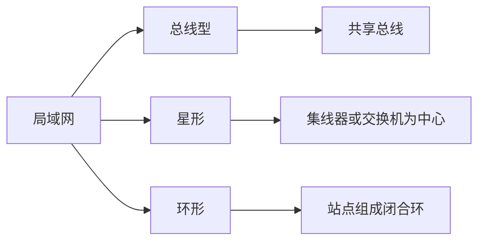
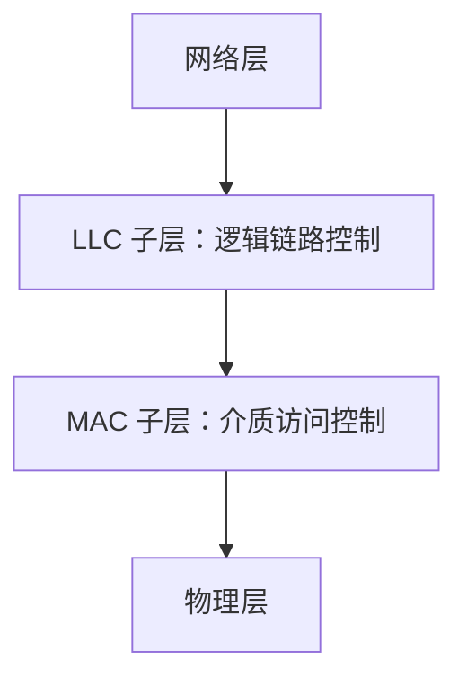
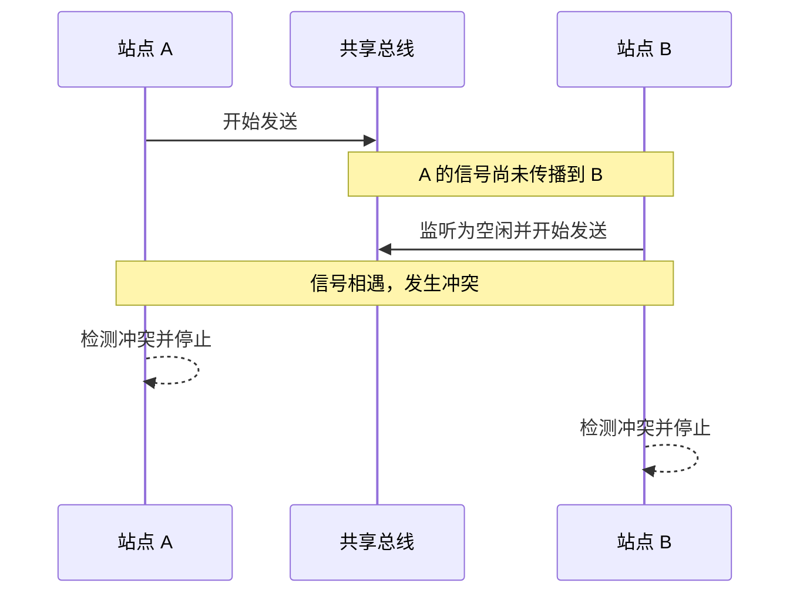
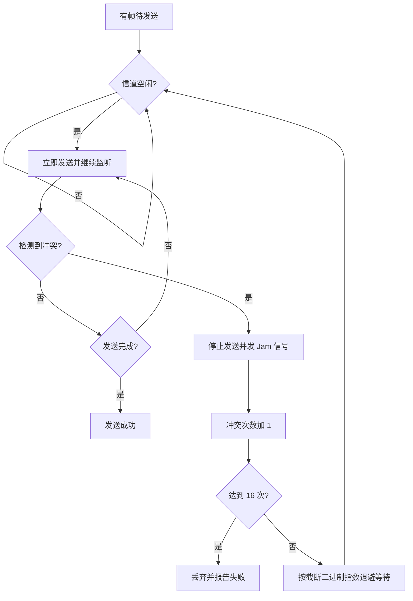
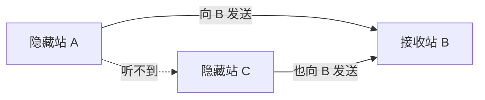
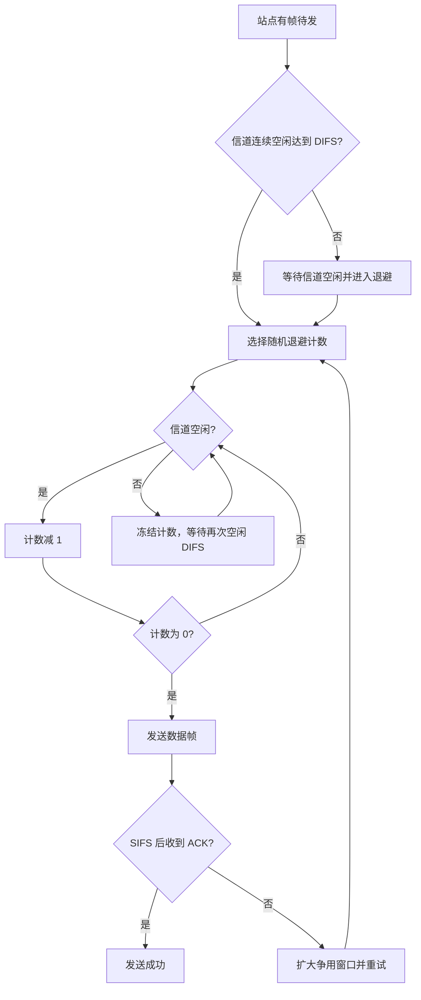
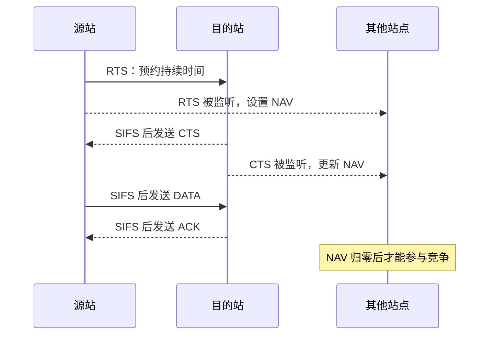
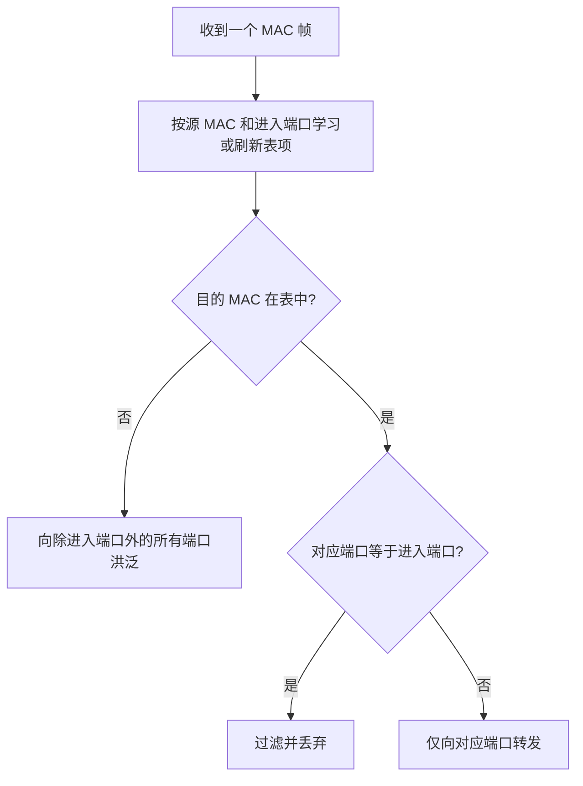
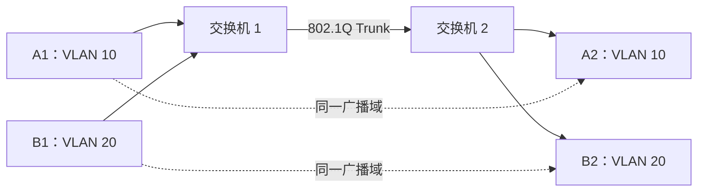
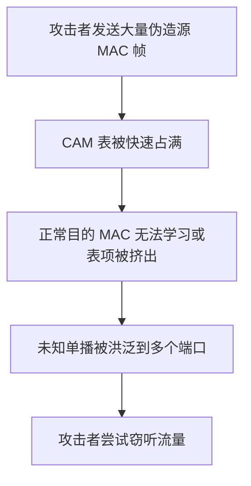

# 6.1 局域网

> 本章从 IEEE 802 体系出发，讨论共享广播介质如何实现接入控制，并延伸到交换式以太网、无线局域网与 VLAN。重点是 MAC、CSMA/CD、CSMA/CA、交换机自学习和广播域隔离。

## 主要内容

- IEEE 802 局域网参考模型
- 介质访问控制与局域网拓扑
- ALOHA、CSMA/CD 与以太网
- WLAN、隐蔽站、暴露站与 CSMA/CA
- 中继器、集线器、网桥和交换机
- VLAN 与 MAC 地址洪泛攻击

---

## 一、局域网概述

### 1. 特点与技术要素

局域网 LAN 覆盖范围有限、传输速率高、误码率较低，通常由单一组织建设和管理。其关键技术要素是：

1. 网络拓扑：  
   总线、星形、环形等节点与链路组织形式。
2. 传输介质：  
   双绞线、同轴电缆、光纤或无线电波。
3. 介质访问控制：  
   决定多个站点如何共享广播信道。

### 2. IEEE 802 参考模型

IEEE 802 把 OSI 数据链路层细分为逻辑链路控制 LLC 和介质访问控制 MAC；MAC 下接物理层。

| 层次 | 主要功能 |
|---|---|
| LLC | 向网络层提供统一接口、复用协议、可选的流量和差错控制 |
| MAC | 组装与拆卸 MAC 帧、物理寻址、介质访问控制、FCS 检错 |
| PHY | 编码、同步、比特收发和传输介质接口 |

典型 LLC 帧包含 `DSAP`、`SSAP`、控制字段和上层数据；MAC 帧再在外部添加 MAC 控制、目的地址、源地址和 FCS。因此 LLC 对不同底层 IEEE 802 网络保持相对透明。

| LLC 服务 | 特点 | 典型用途 |
|---|---|---|
| LLC1 | 无确认、无连接 | 广播、组播、周期采集 |
| LLC2 | 面向连接，只支持单播 | 长文件传输 |
| LLC3 | 有确认、无连接 | 可靠性和实时性要求较高的告警 |
| LLC4 | 高速传送 | 城域网 |

### 3. 信道共享方法

| 分配方式 | 方法 | 特点 |
|---|---|---|
| 静态分配 | FDM、WDM、TDM、CDM | 固定分配资源，难适应站点数和通信量变化 |
| 随机接入 | ALOHA、CSMA、CSMA/CD | 站点平等竞争，可能冲突 |
| 受控接入 | 预约、轮询、令牌 | 按控制规则获得发送权 |

---

## 二、以太网与 CSMA/CD

### 1. ALOHA 与载波监听

- 纯 ALOHA：站点有帧即发送，冲突后等待随机时间重发。
- 时隙 ALOHA：把时间分成一帧长的时隙，只允许在时隙起点发送，减少冲突区间。
- CSMA：发送前先监听载波。1-坚持 CSMA 在信道空闲时立即发送；信道忙时持续监听，空闲后立即发送。

### 2. 冲突为何仍会发生

信号传播存在时延。站点 B 在站点 A 的信号到达之前可能仍监听到“空闲”，于是也开始发送，两帧在介质中相遇并冲突。

### 3. 争用期与最短帧长

设网络最大单程传播时延为 $\tau$，发送站最多经过 $2\tau$ 才能确认是否发生冲突，因此争用期为：

$$T_{\text{slot}}=2\tau$$

传统 10 Mb/s 以太网争用期为 $51.2\,\mu s$，其间可发送 $512$ bit，即 64 字节。若帧更短，发送方可能在远端冲突返回前就结束发送，因而不能检测冲突，所以有效 MAC 帧最短为 64 字节。

### 4. 截断二进制指数退避

第 $n$ 次冲突后，令 $k=\min(n,10)$，从 $[0,2^k-1]$ 均匀选择整数 $r$，退避：

$$T_{\text{backoff}}=r\times 2\tau$$

重传 16 次仍失败时丢弃该帧并向高层报告。

### 5. CSMA/CD 操作流程

> **口诀**：发前先听，空闲即发送；边发边听，冲突时退避。

### 6. 以太网帧

以太网常见两种帧标准是 DIX Ethernet II 和 IEEE 802.3，DIX Ethernet II 使用更广。

| 前导码 | 目的地址 | 源地址 | 类型或长度 | 数据 | FCS |
|---|---|---|---|---|---|
| 8 字节 | 6 字节 | 6 字节 | 2 字节 | 46～1500 字节 | 4 字节 |

帧长 64～1518 字节通常不含前导码。帧长度不是整数字节、FCS 出错、数据长度不在 46～1500 字节或总长度不在 64～1518 字节时，接收方丢弃帧；以太网链路层不负责重传。

帧间最小间隔 IFG 为 $9.6\,\mu s$，相当于 96 bit 的发送时间，用于让设备恢复接收准备。

### 7. 以太网标准与命名

名称如 `10Base5` 由速率、信号方式和介质或距离标识组成：`10` 表示 10 Mb/s，`Base` 表示基带，`5` 表示每段约 500 m；`T`、`F`、`X` 分别常指双绞线、光纤和相应高速编码系列。

| 速率 | 标准示例 | 介质 |
|---|---|---|
| 10 Mb/s | 10Base5、10Base2 | 粗同轴、细同轴 |
| 10 Mb/s | 10Base-T、10Base-F | 双绞线、光纤 |
| 100 Mb/s | 100Base-T、100Base-F | 双绞线、光纤 |
| 1 Gb/s | 1000Base-T、1000Base-X | 双绞线、屏蔽双绞线或光纤 |
| 10 Gb/s 及以上 | IEEE 802.3ae、802.3bs 等 | 主要使用光纤，也有铜缆实现 |

---

## 三、无线局域网与 CSMA/CA

### 1. WLAN 组成

| 类型 | 特点 |
|---|---|
| 基础设施模式 | 站点通过接入点 AP 接入基本服务集 BSS，AP 可连到分布系统 DS |
| 自组网 Ad hoc | 没有固定 AP，平等移动站点组成临时网络 |

无线网络适合移动站点、临时组网、灾害或跨公共区域不便布线的场景。

### 2. 隐蔽站与暴露站

隐蔽站问题中，A 与 C 彼此听不到，却都能到达 B，二者可能同时向 B 发送并在 B 处冲突。

暴露站问题中，C 听到相邻 B 正在向 A 发送，便不敢向 D 发送；但两组通信本可同时进行，造成信道利用率下降。

### 3. 为什么不用 CSMA/CD

无线发送信号远强于同机接收信号，边发边检冲突的硬件代价高；而且站点覆盖范围不同，不能保证彼此可听见。因此 802.11 采用冲突避免 CSMA/CA，而不是冲突检测。

### 4. 协调功能与帧间间隔

| 机制 | 是否必须 | 作用 |
|---|---|---|
| DCF | 必须 | 分布式竞争接入，采用 CSMA/CA |
| PCF | 可选 | AP 点协调，提供无争用服务 |

SIFS 最短，用于 ACK、CTS 等高优先级响应；PIFS 供点协调功能；DIFS 供普通数据争用。较短 IFS 的帧先获得信道。

### 5. 基本 CSMA/CA 流程

### 6. 虚拟载波监听与 RTS/CTS

数据帧、RTS 和 CTS 的持续时间字段可通知其他站点本次交换还要占用信道多久。其他站点据此设置网络分配向量 NAV，在 NAV 未归零前不发送，这称为虚拟载波监听。

RTS/CTS 有助于缓解隐蔽站冲突，但会增加短帧交换开销，因此通常可选。

---

## 四、局域网扩展与交换

### 1. 不同层次的扩展设备

| 设备 | 工作层次 | 转发依据 | 冲突域影响 | 广播域影响 |
|---|---|---|---|---|
| 中继器 | 物理层 | 比特 | 不分隔 | 不分隔 |
| 集线器 Hub | 物理层 | 复制到其他端口 | 不分隔，形成更大冲突域 | 不分隔 |
| 网桥 Bridge | 数据链路层 | 目的 MAC | 每端口分隔冲突域 | 默认不分隔 |
| 交换机 Switch | 数据链路层 | 目的 MAC/CAM 表 | 每端口一个冲突域 | 默认不分隔 |
| 路由器 | 网络层 | 目的 IP | 分隔 | 分隔 |

网桥和交换机过滤通信量、扩大物理范围、提高可靠性，并能互连不同物理层、不同 MAC 子层或不同速率的 LAN。交换机本质上是多端口网桥，端口通常全双工，主机可独占链路，因此不再使用 CSMA/CD，但仍使用以太网帧格式。

### 2. 交换机自学习与转发

交换表项通常含 MAC 地址、端口和老化时间。以源地址学习、以目的地址转发使交换机能够即插即用。

### 3. 总线以太网与星形以太网

| 形态 | 工作方式 |
|---|---|
| 总线以太网 | 共享无源总线，半双工，使用 CSMA/CD |
| 交换式星形以太网 | 以交换机为中心，每链路独占、全双工，无冲突，不使用 CSMA/CD |

---

## 五、虚拟局域网 VLAN

> VLAN 是由若干局域网网段组成、与物理位置无关的逻辑组。IEEE 802.1Q 用标签标明帧所属 VLAN；VLAN 是局域网提供的逻辑隔离服务，不是一种新的物理局域网。

同一 VLAN 的站点即使分布在不同交换机上，也属于同一逻辑广播域；连接在同一交换机但属于不同 VLAN 的站点不能直接接收彼此的二层广播。VLAN 可限制广播范围并抑制广播风暴。

802.1Q 在以太网帧中插入 4 字节标签：

| 字段 | 长度 | 含义 |
|---|---|---|
| TPID | 16 bit | 标签协议标识，常为 `0x8100` |
| PCP | 3 bit | 用户优先级 |
| DEI/原 CFI | 1 bit | 丢弃资格或规范格式指示 |
| VID | 12 bit | VLAN 标识，可表示最多 4096 个编号空间 |

加标签后帧最大长度由 1518 字节增至 1522 字节。

---

## 六、安全隐患：MAC 地址洪泛

交换机将 MAC 到端口的映射保存在 CAM 中。攻击者伪造大量不同源 MAC 的帧，可能填满 CAM 表，使交换机对未知单播进行洪泛；攻击者借此监听原本不应到达其端口的流量。

缓解措施包括交换机端口安全、限制每端口可学习 MAC 数量、静态绑定、802.1X 接入认证、异常流量监测和加密传输。

---

## 本章小结

| 主题 | 核心结论 |
|---|---|
| IEEE 802 | 链路层细分为 LLC 与 MAC |
| 共享介质 | 随机接入会冲突，受控接入按规则分配发送权 |
| CSMA/CD | 发送前监听、发送中检测、冲突后指数退避 |
| 以太网 | 最短 64 字节，数据 46～1500 字节，FCS 检错不重传 |
| CSMA/CA | 依靠退避、ACK、NAV 和可选 RTS/CTS 避免冲突 |
| 交换机 | 从源 MAC 自学习，按目的 MAC 转发、过滤或洪泛 |
| VLAN | 在二层建立逻辑广播域，802.1Q 标签为 4 字节 |

---

## 图片转写审计

下表按 OCR Markdown 中图片出现顺序连续编号。38 个外链图片均结合原图、上下文和 PDF 对应页面核查；最终笔记不保留图片。

| 图号 | 原图信息 | 转写位置与方式 |
|---|---|---|
| 1 | 校徽 | 装饰图，不增加知识信息 |
| 2 | 课程标题横幅 | 装饰图，不增加知识信息 |
| 3 | 分层交换机连接多个集线器 | 局域网拓扑与扩展设备表 |
| 4 | 交换机、集线器和服务器的层次拓扑 | 扩展设备表与拓扑流程图 |
| 5 | OSI 与 IEEE 802 层次对应 | IEEE 802 分层流程图 |
| 6 | IEEE 802 协议族中 LLC、MAC、PHY | IEEE 802 文字说明 |
| 7 | LLC 对底层局域网透明 | LLC 统一接口说明 |
| 8 | LLC 帧嵌入 MAC 帧 | LLC、MAC 字段文字说明 |
| 9 | 高层 PDU 到 LLC、MAC、物理封装 | 分层封装文字说明 |
| 10 | HDLC、LLC、MAC 帧字段对照 | LLC 与 MAC 字段表 |
| 11 | 总线、星形、双绞线拓扑 | 局域网拓扑 Mermaid |
| 12 | 集线器星形结构 | 扩展设备表 |
| 13 | 令牌环结构 | 局域网拓扑 Mermaid |
| 14 | 环形接口连接 | 拓扑文字说明 |
| 15 | 总线广播中仅目的站接收 | 广播介质说明 |
| 16 | A、B 传播时延导致冲突 | 冲突时序图与争用期公式 |
| 17 | CSMA/CD 流程图 | 原生 Mermaid 操作流程 |
| 18 | DIX 与 802.3 帧格式 | 以太网帧原生表格 |
| 19 | `10Base5` 命名拆解 | 以太网命名文字说明 |
| 20 | 基础设施 WLAN 的 BSS、ESS、AP、DS | WLAN 组成表 |
| 21 | Ad hoc 多跳自组网 | WLAN 组成表 |
| 22 | A 与 C 互为隐藏站 | 隐蔽站 Mermaid |
| 23 | B 发送导致 C 暴露 | 暴露站 Mermaid |
| 24 | DCF 与 PCF 的层次 | 协调功能表 |
| 25 | DIFS、SIFS、ACK、NAV 时间关系 | CSMA/CA 流程与文字说明 |
| 26 | DATA 与 ACK 的时序 | CSMA/CA 基本流程 |
| 27 | 源站发送 RTS 的覆盖范围 | RTS/CTS 时序图 |
| 28 | 目的站发送 CTS 的覆盖范围 | RTS/CTS 时序图 |
| 29 | RTS、CTS、DATA、ACK 与 NAV | RTS/CTS 时序图 |
| 30 | 多级集线器形成一个冲突域 | 扩展设备表 |
| 31 | 网桥、站表、缓存与端口 | 交换机学习转发流程 |
| 32 | 网桥分隔三个冲突域 | 冲突域影响表 |
| 33 | 两台交换机互联 | 交换式星形网络说明 |
| 34 | 交换矩阵内部结构 | 交换机并行交换文字说明 |
| 35 | 交换机连接服务器、路由器和三个冲突域 | 冲突域与广播域说明 |
| 36 | A 发 B、B 回 A 的自学习步骤 | 自学习与转发 Mermaid |
| 37 | 多交换机上的三个 VLAN | VLAN Mermaid 与广播隔离说明 |
| 38 | 802.1Q 标签字段 | VLAN 标签原生表格 |

