# 7.1 物理层

> 本章依据第七章课件整理，讨论物理层的接口规范、数据通信基础、传输介质、调制与编码、复用、互连设备及安全隐患。课件中的结构图、信号图和过程图均已转换为 Mermaid、原生表格、公式或文字说明，以形成可检索的 Obsidian 知识笔记。

## 主要内容

- 物理层的位置、功能与接口特性
- 数据通信系统模型和基本概念
- Nyquist 公式与 Shannon 公式
- 有线、无线传输介质的特点
- 调制、线路编码与脉冲编码调制
- FDM、WDM、TDM 与 STDM 复用技术
- 中继器、集线器及物理层安全隐患
- 一次 Web 请求所贯穿的五层协议过程

---

## 一、物理层概述

### 1. 位置与基本功能

> **物理层**位于网络体系结构的最底层，负责在传输介质上实现真正的比特传输，并向数据链路层提供服务。

发送端把二进制数据编码或调制为适合介质传播的信号；接收端从介质接收信号并恢复为二进制数据。物理层还承担比特同步、比特率控制、电路交换和复用等功能。

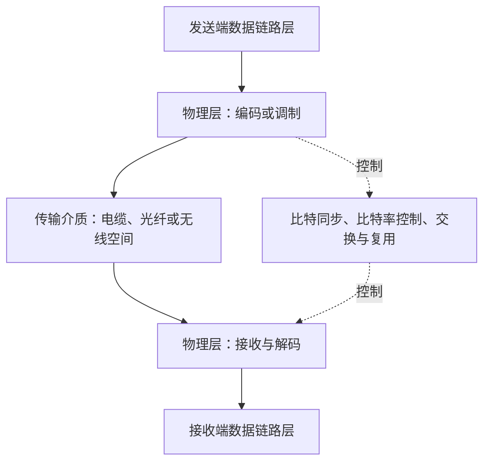

### 2. 物理接口的四类特性

| 接口特性 | 规定内容 |
|---|---|
| 机械特性 | 接线器的形状、尺寸、引线数目和排列等 |
| 电气特性 | 接口电缆各条线上的电压范围 |
| 功能特性 | 某条线上出现某一电平时所表示的含义 |
| 规程特性 | 各种可能事件出现的顺序 |

### 3. 协议示例：IEEE 802.3 10Base-T

| 项目 | 规范 |
|---|---|
| 数据率 | $10\ \mathrm{Mbit/s}$ |
| 传输介质 | 双绞线 |
| 物理拓扑 | 星形 |
| 机械特性 | RJ-45 接口，8 个触点 |
| 编码 | Manchester 编码 |
| 电平 | $+2.5\ \mathrm{V}$ 与 $-2.5\ \mathrm{V}$ |
| 功能特性 | 1、2 针所在的一对线发送；3、6 针所在的一对线接收 |
| 通信方式 | 全双工 |

课件所示 RJ-45 母座和水晶头分别是设备端插座与线缆端插头，图示仅用于说明机械结构，不增加上述规范之外的知识信息。

---

## 二、数据通信基础

### 1. 数据通信系统模型

数据通信系统可以从两种等价视角理解：上层视角强调“输入文字—数字比特流—模拟信号—数字比特流—显示文字”；功能视角强调源系统、传输系统和目的系统。


在公用电话网示例中，发送端计算机输出数字比特流，经调制解调器变为模拟信号进入电话网；接收端调制解调器再将模拟信号恢复为数字比特流。

### 2. 信息、数据、信号与码元

> **信息**是人类知识的表征，通信的目的就是传输信息；信息的载体可以是数字、文字、语音、图形或图像。

> **数据**是承载信息的实体，在计算机系统中以二进制形式处理。

> **信号**是数据的电平或电磁波形式表示，可在传输介质上传播。

> **码元**是承载离散信息的基本信号单位；单位时间传输的码元数称为**波特率**，单位为 Baud。

一个码元不一定只表示一位。若一个码元具有 $L$ 种可区分状态，则每个码元最多承载 $\log_2L$ bit，因此：

$$
R_b=R_B\log_2L
$$

其中，$R_b$ 为比特率，$R_B$ 为波特率。

### 3. 模拟信号与数字信号

| 类型 | 特征 | 文字化波形描述 |
|---|---|---|
| 模拟信号 | 幅度随时间连续变化 | 波形是一条连续曲线，任意相邻时刻之间都可取中间值 |
| 数字信号 | 只取离散电平值 | 波形在若干固定电平之间跳变，常表示为矩形脉冲 |

### 4. 信道

> **信道**是信号的通道。狭义信道是两个设备之间的传输介质，即物理链路；广义信道是信号传输的整条路径，其中可能经过多个设备。本课程通常采用狭义含义。

模拟信道以连续电磁波传输数据；数字信道以离散数字脉冲传输数据。数字数据与数字信号、模拟信号之间可经编码、调制、解调和译码相互转换。


### 5. 模拟通信与数字通信

| 通信方式 | 信道中传输的信号 | 典型应用 | 特点 |
|---|---|---|---|
| 模拟通信 | 模拟信号 | 有线电视 | 信道利用率较高，但传输质量较差 |
| 数字通信 | 数字信号 | 因特网 | 衰减影响较易处理、抗干扰性强，但信道利用率相对较低 |

> 信道中传输的是模拟信号，并不意味着原始数据一定是模拟数据；数字数据可经调制形成模拟信号，模拟数据也可经编码形成数字信号。

### 6. 带宽与数据率

> **带宽**是信道允许通过的电磁波频率范围，即最高频率与最低频率之差，单位为 Hz。

$$
B=f_{\max}-f_{\min}
$$

> **数据率**是信道的最大数据传输速率，单位为 bit/s。数据率与信道带宽相关，但两者单位和物理意义不同。

课件频谱示例中，信道允许通过 $1000\ \mathrm{Hz}$ 到 $5000\ \mathrm{Hz}$ 的频率成分，故带宽为：

$$
B=5000-1000=4000\ \mathrm{Hz}
$$

### 7. 最大数据率（信道容量）

> **Nyquist 公式**适用于理想无噪声信道。当信道带宽为 $B$、信号具有 $L$ 个离散电平时，最大数据率为：

$$
C=2B\log_2L
$$

> **Shannon 公式**适用于有噪声信道。当平均信号功率为 $S$、平均噪声功率为 $N$ 时，信道容量上限为：

$$
C=B\log_2\left(1+\frac{S}{N}\right)
$$

信噪比常以分贝表示：

$$
\mathrm{SNR}_{\mathrm{dB}}=10\lg\left(\frac{S}{N}\right)
$$

| 公式 | 信道条件 | 主要限制因素 |
|---|---|---|
| Nyquist | 无噪声、带宽受限 | 带宽 $B$ 与信号级数 $L$ |
| Shannon | 有噪声、带宽受限 | 带宽 $B$ 与信噪比 $S/N$ |

---

## 三、传输介质

### 1. 分类与电磁频谱

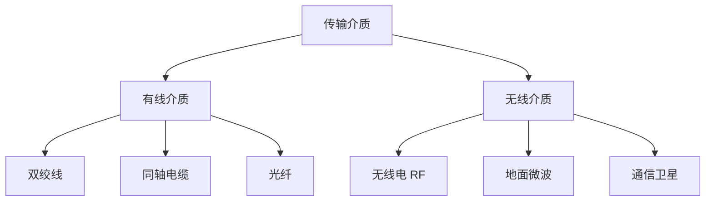

电磁频谱按频率由低到高依次覆盖无线电、微波、红外线、可见光、紫外线、X 射线和 $\gamma$ 射线。网络传输主要使用无线电、微波和光纤中的光波；频率越高，波长越短。课件还将无线电频段细分为 LF、MF、HF、VHF、UHF、SHF、EHF、THF，并标示海事无线电、调幅广播、业余无线电、移动无线电、电视、卫星、地面微波和光纤的大致使用区间。

### 2. 双绞线

双绞线由两根彼此绝缘的铜线相互缠绕构成，可传输模拟信号和数字信号，主要用于固定电话用户线和计算机网线。相互绞合能够减弱外界电磁干扰和线对之间的串扰。

| 类型 | 屏蔽结构 | 特点 |
|---|---|---|
| UTP | 无金属屏蔽，仅有绝缘层和塑料外皮 | 成本低、使用广泛 |
| STP | 双绞线外增加金属屏蔽层 | 抗电磁干扰能力更强 |

课件比较的 UTP3 与 UTP5 都采用不同绞距的线对；更紧密、合理的绞合有助于改善高频传输性能。

### 3. 同轴电缆

同轴电缆从内到外由内导体、绝缘层、外导体屏蔽层和塑料护套组成；内外导体共轴，屏蔽结构可减小外界干扰。

| 特性阻抗 | 主要信号类型 | 典型用途 |
|---|---|---|
| $50\ \Omega$ | 数字信号 | 计算机联网 |
| $75\ \Omega$ | 模拟信号 | 有线电视 |

### 4. 光纤

光纤由高折射率纤芯和低折射率包层构成。光线满足全反射条件后在纤芯与包层边界反复反射，沿纤芯向前传播。

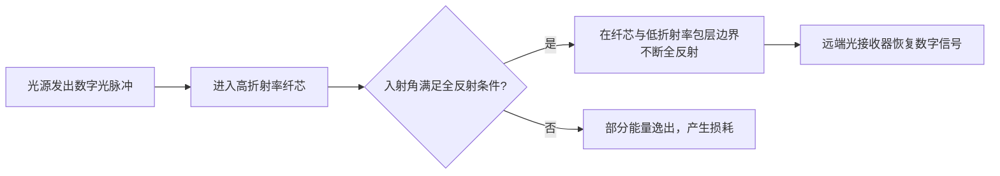

光纤具有高带宽、抗电磁干扰、低衰减、传输距离长和重量轻等优点，主要用于传输数字信号。

### 5. 无线电与 ISM 频段

无线电能够全方向传播并可穿透建筑物，适合计算机和手机终端；其不足是抗干扰能力较差、时延可能较长。基站覆盖区内，终端可通过基站接入；相邻小区通过频率规划复用频谱。

> **ISM 频段**即 Industrial、Scientific、Medical 频段，使用时不必单独申请频率许可，广泛用于 WLAN 和蓝牙。

课件列出的典型 ISM 频段为：

| 频率范围 | 带宽 |
|---|---|
| $902$～$928\ \mathrm{MHz}$ | $26\ \mathrm{MHz}$ |
| $2.400$～$2.4835\ \mathrm{GHz}$ | $83.5\ \mathrm{MHz}$ |
| $5.735$～$5.860\ \mathrm{GHz}$ | $125\ \mathrm{MHz}$ |

### 6. 地面微波与通信卫星

| 介质 | 传播方式 | 优点 | 局限 |
|---|---|---|---|
| 地面微波 | 视距直线传播，远距离链路使用中继器接力 | 适合跨区域无线传输 | 不能穿透建筑物，易受天气影响 |
| 通信卫星 | 地面站上行至卫星，再由卫星中继下行 | 支持广播，传输成本与地面距离关系较小 | 传播路径长、时延大 |

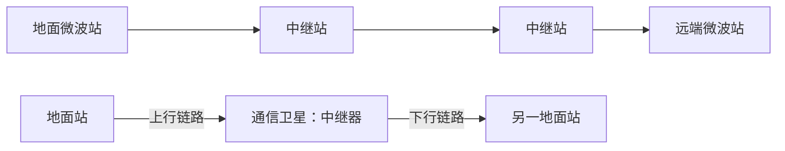

---

## 四、调制与编码技术

### 1. 数据与信号的四种组合

| 原始数据 | 传输信号 | 转换方法 | 典型设备或技术 |
|---|---|---|---|
| 模拟数据 | 模拟信号 | 直接传输或模拟调制 | 电话 |
| 数字数据 | 模拟信号 | 数字调制 | 调制解调器 |
| 模拟数据 | 数字信号 | 采样、量化、编码 | 编解码器、PCM |
| 数字数据 | 数字信号 | 线路编码 | 数字收发器 |

### 2. 模拟信号的三个参数

正弦载波可表示为：

$$
s(t)=A\sin(2\pi ft+\varphi)
$$

其中，$A$ 是振幅，$f$ 是频率，$\varphi$ 是初相位。课件示例为 $A=5$、$f=2\ \mathrm{Hz}$、$\varphi=\pi/2$，即：

$$
s(t)=5\sin\left(2\pi\cdot2t+\frac{\pi}{2}\right)
$$

### 3. 基本数字调制

给定数字序列 `0 1 0 0 1 1 1 0 0`，三种基本调制在每个码元区间改变载波的不同参数：

| 调制方法 | 受数字数据控制的载波参数 | 图中波形含义 |
|---|---|---|
| ASK（幅移键控） | 振幅 | 某一比特对应有载波，另一比特对应无载波或较小振幅 |
| FSK（频移键控） | 频率 | 两种比特分别使用高、低两种频率 |
| PSK（相移键控） | 相位 | 载波频率和振幅不变，在码元边界按比特改变相位 |

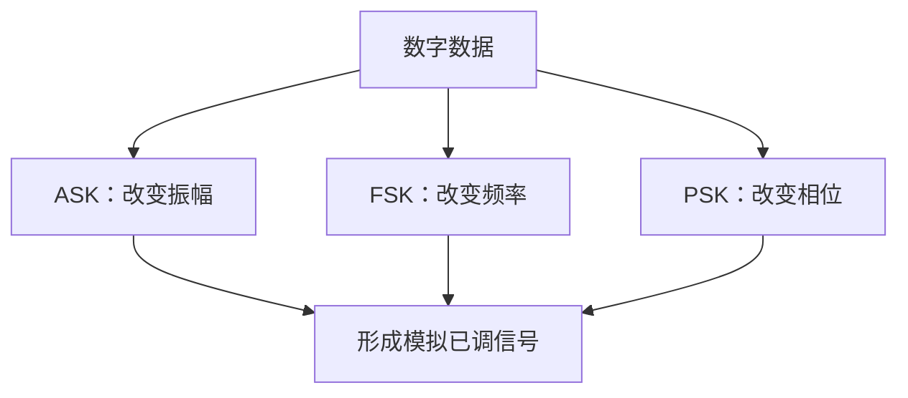

### 4. 正交振幅调制 QAM

> **QAM**把幅度调制与相位调制结合起来，以星座图中的一个点表示一个码元，从而让一个码元携带多位数据。

| 调制方式 | 幅度级数 | 相位数 | 星座点数 | 每码元比特数 |
|---|---:|---:|---:|---:|
| 4-QAM | 1 | 4 | 4 | 2 |
| 8-QAM | 2 | 4 | 8 | 3 |

4-QAM 星座点位于四个象限，映射为 `00`、`01`、`10`、`11`；8-QAM 在横纵轴方向上使用两种幅度与四种相位组合，映射为 `000`～`111`。星座点越多，每个码元承载的比特越多，但对噪声和判决精度的要求也更高。

### 5. 数字数据的线路编码

课件对同一序列 `0 1 0 0 1 1 0 0 0 1 1` 给出了四类波形：

| 编码 | 判定规则 | 同步特性 |
|---|---|---|
| NRZ-L | 比特值由码元期间的绝对电平表示 | 连续相同比特时无跳变，不利于时钟恢复 |
| NRZI | 课件波形以码元边界是否反相表示比特 | 连续特定比特仍可能缺少跳变 |
| Manchester | 每个码元中点必有一次跳变，跳变方向表示比特 | 自带时钟，但所需带宽较高 |
| Differential Manchester | 每个码元中点必跳变，码元起始处是否跳变表示比特 | 自带时钟，利用相对变化降低极性反接影响 |

> 不同教材对 Manchester 和 NRZI 的 `0`、`1` 极性约定可能相反；识别时必须先采用题目或协议给定的约定。课件图的核心在于绝对电平、反相与中点跳变三种判定方式。

### 6. 脉冲编码调制 PCM

> **PCM**将模拟信号转换为数字信号，主要经过采样、量化和二进制编码三个步骤。


课件示例依次取得近似样值 `3.2、3.9、2.8、3.4、1.2、4.2`，量化为 `3、4、3、3、1、4`，再分别编码为 `011、100、011、011、001、100`，输出比特串：

```text
011100011011001100
```

PCM 接收端执行相反过程：线路译码得到二进制数据，转换为量化样值，再通过重构滤波近似恢复模拟波形。量化会引入量化误差，恢复波形通常只是原信号的近似。

---

## 五、复用技术

### 1. 复用的概念

> **复用**使多路信号共享一条高容量物理信道。发送端复用器把多路输入合并，接收端分用器再恢复各路输出。

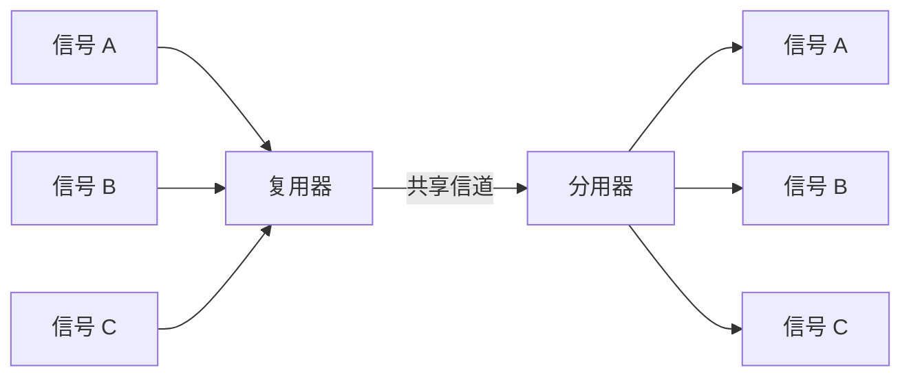

不复用时，三对通信端点需要三条独立信道；使用复用后，多路信号仅在接入段保持独立，在中间共享一条高带宽链路。

### 2. 频分复用 FDM

> **FDM**按不同频率范围划分子信道，主要用于模拟信号复用；各路信号同时传输，但占用互不重叠的频带。

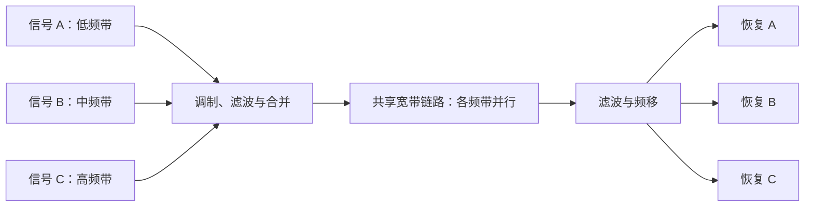

课件频谱示意中，三个原始信号都占用 $0$～$4$ 的基带，调制后分别搬移至 $20$～$24$、$24$～$28$、$28$～$32$ 的频带；分用端再用滤波器分离并还原。

### 3. 波分复用 WDM

> **WDM**按不同光波波长划分子信道，可视为光纤系统中的频分复用。

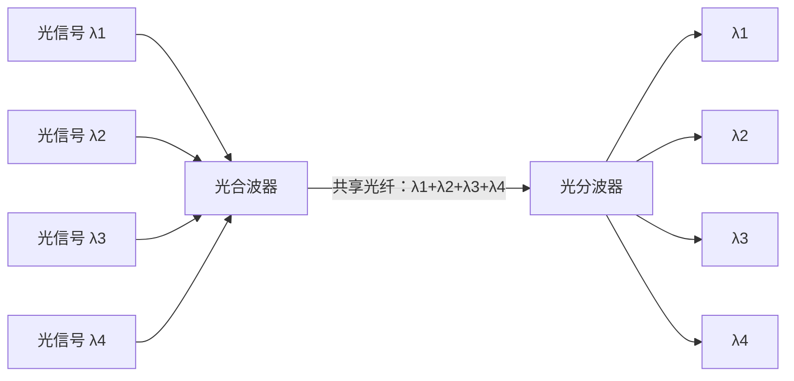

各光信号在单独光纤上具有不同中心波长，经合波后共同在长途光纤上传输，接收端用滤光器分离。

### 4. 同步时分复用 TDM

> **TDM**按时间片划分子信道，主要用于数字信号复用。所有用户在不同时间占用同一频带；同步 TDM 为每个用户预留固定时隙。

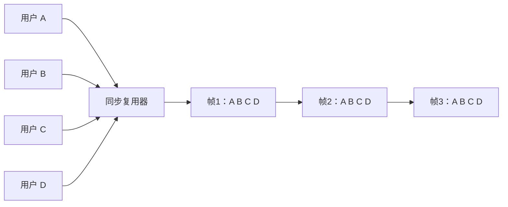

用户 A 在每个 TDM 帧中的位置固定；即使某用户暂时没有数据，其时隙仍会保留，因此突发性计算机数据容易造成信道资源浪费。

### 5. E1 帧

E1 是同步时分复用在电话骨干网数字话音传输中的示例。

| 项目 | 数值或用途 |
|---|---|
| 话音路数 | 30 路 |
| 每路采样率 | $8000$ 次每秒 |
| 每个样值 | $8$ bit |
| 单路 PCM 数据率 | $64\ \mathrm{kbit/s}$ |
| 每帧时隙数 | 32 个，编号 ch0～ch31 |
| ch0 | 帧同步 |
| ch16 | 信令 |
| 其余 30 个时隙 | 承载 30 路话音 |
| 帧周期 | $125\ \mu\mathrm{s}$ |
| E1 总数据率 | $32\times64\ \mathrm{kbit/s}=2.048\ \mathrm{Mbit/s}$ |

### 6. 统计时分复用 STDM

> **STDM**根据用户是否实际有数据动态分配时隙，不为空闲用户预留固定时隙，从而改善突发数据场景下的链路利用率。

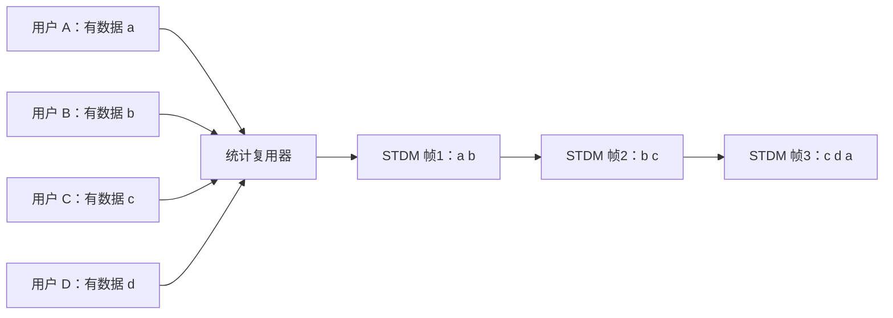

| 对比项 | 同步 TDM | 统计 TDM |
|---|---|---|
| 时隙分配 | 每个用户固定位置 | 按实际需求动态分配 |
| 空闲用户 | 仍占用预留时隙 | 不占用时隙 |
| 帧内识别 | 由固定位置识别用户 | 通常需携带地址或标识信息 |
| 适用数据 | 连续、稳定数据 | 突发性数据 |

---

## 六、物理层互连设备

### 1. 设备与分层

| 工作层次 | 互连设备 | 识别或处理对象 |
|---|---|---|
| 应用层及以上 | 网关 | 端口号、应用协议等 |
| 网络层 | 路由器 | IPv4 或 IPv6 地址 |
| 数据链路层 | 网桥、交换机 | MAC 地址 |
| 物理层 | Hub、中继器 | 接线器、接插板与信号 |

### 2. 中继器

> **中继器（Repeater）**连接两个 LAN 网段，对衰减、失真的信号进行判决和再生，使信号能够继续传输更远；它不理解帧或地址，也不分割冲突域。


传统以太网遵循 **5-4-3 原则**：一个冲突域内最多串联 5 个网段、4 个中继器，其中最多 3 个网段连接主机。被中继器连接的所有网段仍属于同一个冲突域。

### 3. 集线器

> **集线器（Hub）**是多端口中继器，把多台主机连接成共享式 LAN。它从一个端口收到信号后，将放大再生的信号转发到所有其他端口。

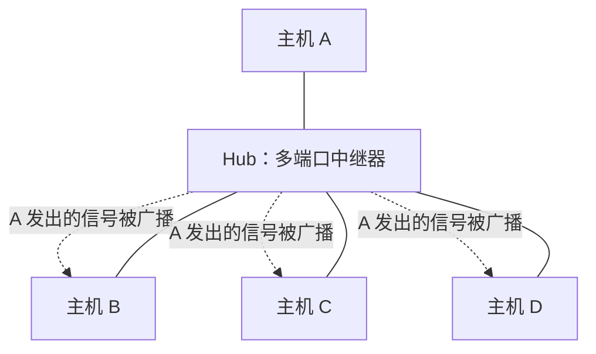

| 属性 | Hub 网络 |
|---|---|
| 物理拓扑 | 星形 |
| 逻辑拓扑 | 总线形 |
| 转发方式 | 广播到除入端口外的所有端口 |
| 信道性质 | 多主机共享 |
| 冲突域 | 所有端口属于同一冲突域 |

---

## 七、物理层安全隐患

### 1. 数据截获途径

课件列出的物理层截获途径包括：

1. 从中继器截获：  
   中继器对信号进行透明再生，攻击者接入同一物理段即可观察传播信号。
2. 从网卡截获：  
   网卡处于适当接收模式时，可能接收并分析经过共享介质的帧。
3. 从交换机截获：  
   攻击者可能在交换设备、镜像端口或物理链路处获取流量。
4. 从电力系统捕获按键产生的电磁脉冲：  
   设备操作产生的电磁侧信道可能泄露输入活动。
5. 利用光线反射捕获键盘输入：  
   按键动作可能通过屏幕、眼镜或环境物体的光学反射形成可观测侧信道。

这些方式共同说明：即使上层协议正确，物理接入控制、设备防拆、防电磁泄漏和环境隔离仍是安全边界的一部分。

---

## 八、一次 Web 请求的综合过程

### 1. 场景与拓扑

示例为笔记本电脑访问 `www.baidu.com`，贯穿应用层、传输层、网络层、数据链路层和物理层；课件明确说明不考虑私有地址转换 NAT。学生所在网络为 `123.34.56.0/24`，ISP 网络示例为 `114.255.40.0/21`，百度网络示例为 `110.242.64.0/20`，Web 服务器示例地址为 `110.242.68.3`。


### 2. DHCP：获取上网参数

笔记本首先需要取得 IP 地址、子网掩码、默认路由器地址和 DNS 服务器地址，因此使用 DHCP：

1. DHCP 客户端生成 DHCP 请求。
2. 请求依次封装为 UDP 数据报、IP 包和以太网帧。
3. 以太网帧在 LAN 上广播，目的 MAC 地址为 `FF-FF-FF-FF-FF-FF`。
4. DHCP 服务器收到帧后依次解封，取得 DHCP 请求。
5. DHCP 服务器返回包含上网参数的 DHCP ACK，并封装为帧，经 LAN 交换机转发给笔记本。
6. 客户端解封 DHCP ACK，获得 IP 地址、子网掩码、路由器 IP 地址和 DNS 服务器 IP 地址。

### 3. ARP：获得路由器接口 MAC 地址

发送 HTTP 请求之前，客户端需先通过 DNS 获知 `www.baidu.com` 的 IP 地址。DNS 请求依次封装为 UDP 数据报、IP 包和以太网帧；由于帧必须先发送给默认路由器，客户端还需知道路由器接口的 MAC 地址：

1. 客户端广播 ARP 请求。
2. 路由器收到 ARP 请求后发送 ARP 应答。
3. ARP 应答携带路由器接口网卡的 MAC 地址。
4. 客户端据此构造并发送承载 DNS 请求的以太网帧。

### 4. DNS：解析服务器地址

路由器根据由 OSPF、RIP 或 BGP 等选路协议形成的路由表，将包含 DNS 请求的 IP 包转发到 ISP 网络的 DNS 服务器。DNS 服务器解封请求并返回 `www.baidu.com` 对应的 IP 地址，响应沿网络返回客户端。

### 5. TCP：建立可靠连接

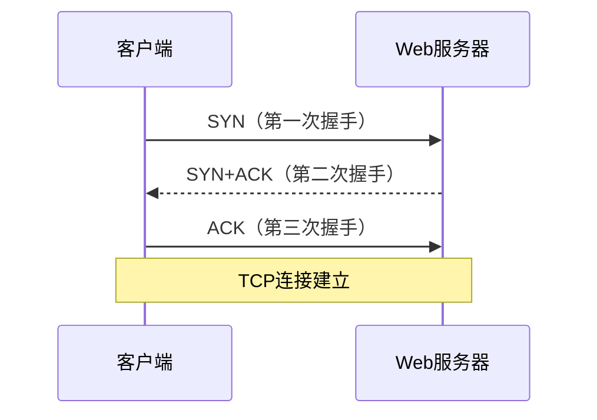

### 6. HTTP 请求与应答

TCP 连接建立后，浏览器在连接上发送 HTTP 请求。承载 HTTP 请求的 IP 包经路由器选路转发到 Web 服务器；Web 服务器返回包含网页数据的 HTTP 应答，承载应答的 IP 包再经网络转发到浏览器，最终显示网页。

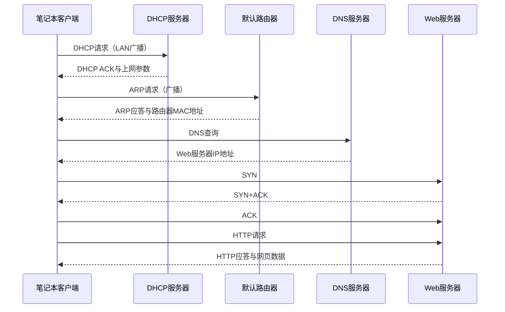

在每一步中，应用层消息都要沿协议栈向下封装，经物理层转换为信号发送；接收端再沿协议栈向上解封。物理层提供比特传输基础，但 DHCP、ARP、DNS、TCP 和 HTTP 分别在不同层完成参数配置、地址解析、名称解析、可靠传输和 Web 交互。

---

## 九、课件图片覆盖审计

### 1. 图片 1～12

| 编号 | 原图内容 | 转写方式 |
|---:|---|---|
| 1 | 物理层位置、服务和内部功能 | 重构为“物理层位置与基本功能”Mermaid，并补充文字 |
| 2 | 10Base-T 双绞线外观 | 装饰性实物图；知识信息写入协议表格 |
| 3 | RJ-45 母座 | 文字说明设备端插座、8 个触点及机械特性 |
| 4 | RJ-45 水晶头 | 文字说明线缆端插头及收发针脚 |
| 5 | 数据通信系统模型 | 重构为源点—发送器—传输系统—接收器—终点 Mermaid |
| 6 | 模拟信号曲线 | 转为模拟信号连续变化的文字化波形描述 |
| 7 | 数字信号阶梯波 | 转为离散电平跳变的文字化波形描述 |
| 8 | 数字数据经编码、调制和传输的信道模型 | 重构为编解码与调制解调 Mermaid |
| 9 | $1000$～$5000\ \mathrm{Hz}$ 频谱和带宽 | 转为 LaTeX 算式及带宽定义 |
| 10 | 有线与无线传输介质示意 | 重构为传输介质分类 Mermaid |
| 11 | 电磁波频谱及应用区间 | 完整文字描述频段顺序和典型应用 |
| 12 | UTP 与 STP 截面结构 | 重构为原生对比表格 |

### 2. 图片 13～24

| 编号 | 原图内容 | 转写方式 |
|---:|---|---|
| 13 | UTP3 与 UTP5 绞合外观 | 文字说明绞距与高频性能关系 |
| 14 | 同轴电缆分层截面 | 文字说明内导体、绝缘层、屏蔽层和护套 |
| 15 | 光纤纤芯、包层与全反射 | 重构为全反射条件流程 Mermaid |
| 16 | 基站与终端覆盖 | 文字说明基站覆盖和终端接入 |
| 17 | 相邻蜂窝频率复用 | 文字说明小区与频率规划；未猜测原图未标明的复用参数 |
| 18 | ISM 三段频谱 | 重建为三个频段及带宽的原生表格 |
| 19 | 地面微波中继接力 | 重构为地面站—中继站链路 Mermaid |
| 20 | 卫星在两地面站之间中继 | 重构为上行、卫星中继和下行 Mermaid |
| 21 | 模拟信号承载模拟数据与数字数据 | 转为四种数据—信号组合表 |
| 22 | 正弦波的振幅、频率和相位 | 转为正弦信号 LaTeX 公式及参数示例 |
| 23 | 4-QAM 星座图 | 转为星座点映射文字和 QAM 原生表格 |
| 24 | 8-QAM 星座图 | 转为两级幅度、四相位和 3 bit 每码元的表格与说明 |

### 3. 图片 25～36

| 编号 | 原图内容 | 转写方式 |
|---:|---|---|
| 25 | 数字信号承载模拟数据与数字数据 | 转为编解码器、数字收发器及四种组合表 |
| 26 | NRZ-L、NRZI、Manchester、差分 Manchester 波形 | 转为编码规则表并保留源比特序列 |
| 27 | PCM 采样、量化和输出比特 | 转为样值、量化值与完整 PCM 比特串 |
| 28 | PCM 编码与解码双向流程 | 重构为采样—量化—编码—线路编码 Mermaid，并说明逆过程 |
| 29 | 不复用与复用的链路数量对比 | 重构为复用器—共享信道—分用器 Mermaid |
| 30 | FDM 频移、合并、滤波与恢复 | 重构为 FDM Mermaid，并记录三段频带范围 |
| 31 | WDM 合波、共享光纤与分波 | 重构为四波长 WDM Mermaid |
| 32 | 同步 TDM 帧与固定用户位置 | 重构为固定 `A B C D` 时隙 Mermaid |
| 33 | E1 的 30 路话音、PCM 与 32 时隙帧 | 重建为 E1 参数原生表格 |
| 34 | 同步 TDM 因空闲时隙造成浪费 | 文字说明突发流量下的四帧时隙浪费 |
| 35 | STDM 动态组帧 | 重构为按需形成三个 STDM 帧的 Mermaid |
| 36 | 中继器对受干扰信号整形再生 | 重构为中继器再生流程 Mermaid |

### 4. 图片 37～48

| 编号 | 原图内容 | 转写方式 |
|---:|---|---|
| 37 | 中继器连接两个 LAN 网段 | 融入中继器 Mermaid 与定义 |
| 38 | 中继器连接范围为一个冲突域 | 文字记录不分割冲突域和 5-4-3 原则 |
| 39 | Hub 实物外观 | 装饰性设备照片；功能转写为文字 |
| 40 | Hub 星形连接主机且只有一个冲突域 | 重构为 Hub 星形 Mermaid |
| 41 | Hub 内部广播路径 | 在 Mermaid 中标出从入端口向其他端口广播 |
| 42 | Web 请求完整网络拓扑 | 重构为客户端、交换机、路由器、DNS 与 Web 服务器拓扑 Mermaid |
| 43 | DHCP 请求封装和 LAN 广播 | 转为 DHCP 六步流程文字，保留各层封装与广播 MAC 地址 |
| 44 | DHCP ACK 返回并携带网络参数 | 转为 DHCP 返回流程及参数清单 |
| 45 | ARP 请求与应答 | 转为 ARP 四步过程及综合时序 Mermaid |
| 46 | DNS 请求经路由器转发到 DNS 服务器 | 转为 DNS 过程和 OSPF、RIP、BGP 路由说明 |
| 47 | TCP 三次握手 | 重构为 TCP `sequenceDiagram` |
| 48 | HTTP 请求、应答与网页返回 | 重构为综合 `sequenceDiagram` 并补充逐层封装说明 |

> [!success] 图片转写结论
> OCR Markdown 中的 48 个图片引用已逐一对照课件 PDF 核查：18 幅结构或过程图重构为 Mermaid，其余转为 Obsidian 原生表格、LaTeX、代码块或完整文字说明。最终笔记不保留任何图片、图片路径或外部图床引用。

---

## 本章小结

| 主题 | 核心结论 |
|---|---|
| 物理层 | 在介质上传输比特，规定机械、电气、功能和规程特性 |
| 数据通信 | 信息由数据承载，数据经信号传播；码元速率与比特率不是同一概念 |
| 信道容量 | 无噪声信道参考 Nyquist 公式，有噪声信道参考 Shannon 公式 |
| 传输介质 | 双绞线、同轴电缆、光纤、无线电、微波和卫星各有适用场景 |
| 调制编码 | ASK、FSK、PSK 和 QAM 生成模拟信号；线路编码和 PCM 生成数字信号 |
| 复用 | FDM 按频率、WDM 按波长、TDM 按时间、STDM 按实际需求共享信道 |
| 互连设备 | 中继器与 Hub 只处理信号，不能分割冲突域 |
| 安全 | 物理接入、电磁与光学侧信道都可能造成数据泄漏 |
| 综合过程 | Web 访问依次涉及 DHCP、ARP、DNS、TCP 和 HTTP，并由物理层完成每一跳的信号传输 |

课件引用的图示资料来源包括 Tanenbaum《Computer Networks》第 4 版、谢希仁《计算机网络》第 5 版、Kurose 与 Ross《Computer Networking: A Top-Down Approach》第 7 版，以及 Forouzan《Data Communications and Networking》第 4 版。
