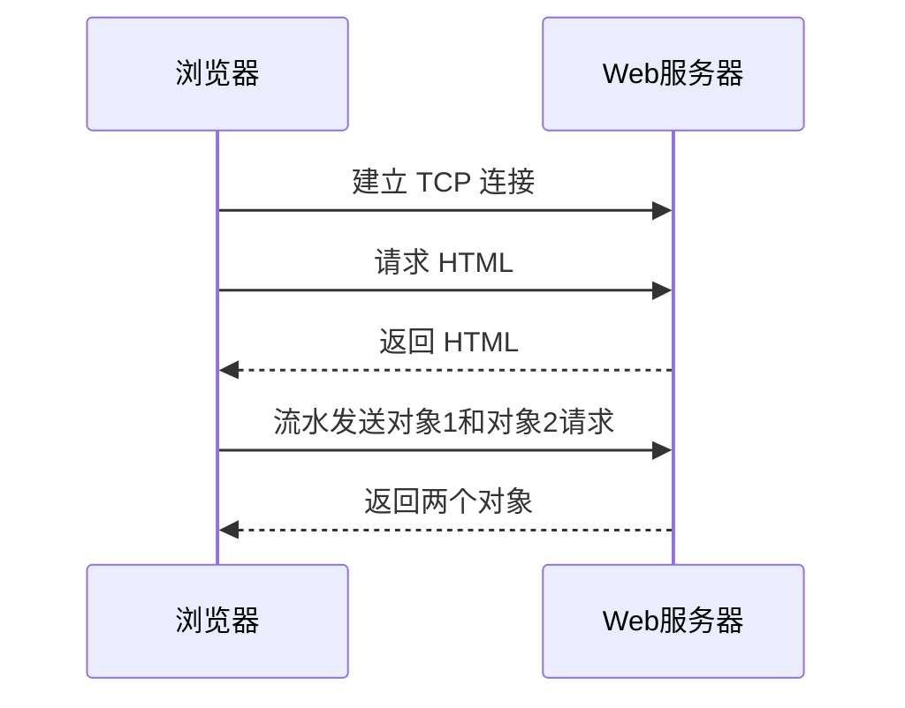
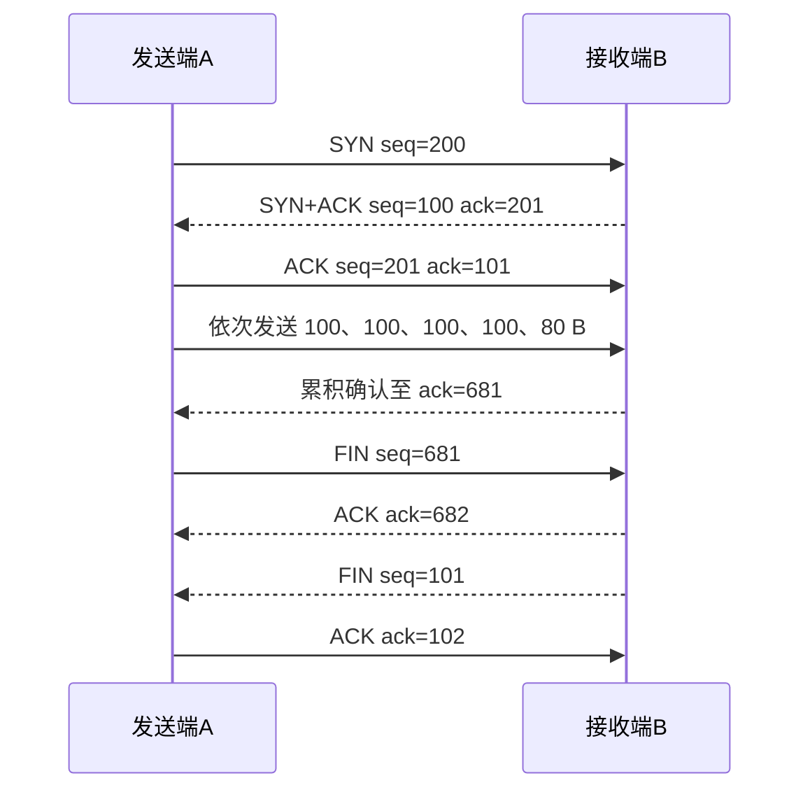
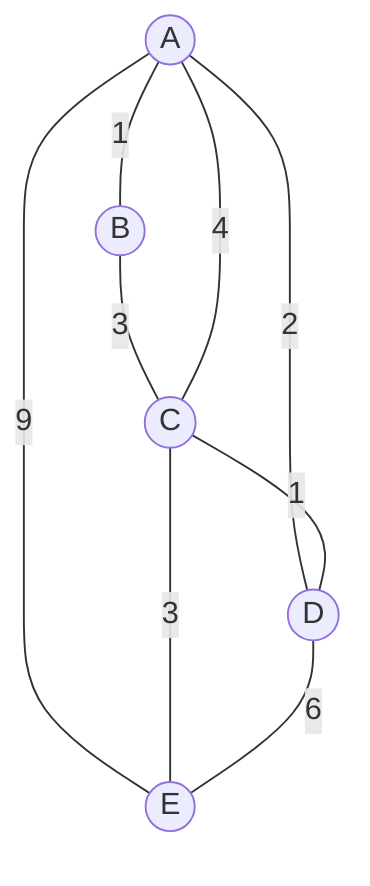

# 计算机网络复习与作业讲解

> 本笔记整理两份课程总结与作业讲解，覆盖第 1～7 章的重点、计算题和协议分析题。公式、时序图、拓扑图及截图信息均已转为 Obsidian 原生文本、管道表格、LaTeX 或 Mermaid，不依赖原 PDF 页面即可复习。

## 主要内容

- 交换方式、网络时延、吞吐量、封装效率与体系结构
- DNS、HTTP、FTP、MIME 与文件分发
- 可靠传输、UDP/TCP、滑动窗口与拥塞控制
- 路由算法、IP 编址、最长前缀匹配、分片与聚合
- 差错检测、ARP、PPP、以太网交换与无线介质访问
- 物理层编码、调制、复用及信道容量

---

## 一、第 1 章：概述

### 1. 三种交换方式

| 比较项 | 电路交换 | 报文交换 | 分组交换 |
|---|---|---|---|
| 资源分配 | 建链时预分配并独占 | 按报文动态占用 | 按分组动态占用 |
| 路径 | 通信期间沿固定通道 | 每个报文可独立选路 | 每个分组可独立选路 |
| 存储转发 | 通常不逐节点存完整报文 | 节点收完整报文再转发 | 小分组可形成流水线 |
| 服务质量 | 易提供稳定带宽和时延 | 难保证 | 通常尽力而为 |
| 适用场景 | 持续、大流量、实时通信 | 非实时完整报文 | 突发计算机数据 |

### 2. 交换时延计算

报文长 12 Mb，三段 100 Mbps 链路，每段传播时延 0.5 ms：

| 方式 | 计算 | 总时延 |
|---|---|---:|
| 电路交换 | 建立与释放各 1 ms，加一次发送和三次传播 | 123.5 ms |
| 报文交换 | 三段都要发送整个报文 | 361.5 ms |
| 4 分组流水传输 | 源端发送四个 3 Mb 分组，最后一个分组再过两个中间节点 | 181.5 ms |

分组减小中间节点等待完整报文的时间，但会增加首部、编号、重组和控制开销。

### 3. 发送时延与传播时延

$$
d_{trans}=\frac{L}{R},\qquad d_{prop}=\frac{D}{v}
$$

500 km 链路、传播速度 $2\times10^8$ m/s 时，传播时延始终为 2.5 ms。5 Mb 数据经 500 Kbps 链路发送需 10 s；500 bit 数据经 10 Mbps 链路发送仅需 50 μs。传播时延由距离和传播速度决定，发送时延由数据量和带宽决定。

### 4. 话音数据与计算机数据

- 话音连续产生、速率相对稳定，并要求低时延和低抖动，适合有资源保障的电路交换。
- 计算机数据突发性强，峰值与平均速率相差较大，采用分组交换可共享链路并提高利用率。

### 5. OSI、TCP/IP 与五层模型

| OSI | TCP/IP | 五层教学模型 |
|---|---|---|
| 应用、表示、会话 | 应用 | 应用 |
| 运输 | 运输 | 运输 |
| 网络 | 网际 | 网络 |
| 数据链路、物理 | 网络接口 | 数据链路、物理 |

TCP/IP 将会话管理、格式转换、压缩和加密等功能交给应用层。五层模型保留 TCP/IP 的实用高层结构，又将底层拆成数据链路层和物理层以便分析协议与设备。

### 6. 分层的基本关系

- **实体**：某层中收发信息的硬件或软件进程。
- **协议**：对等层实体通信所遵循的规则。
- **服务**：下层通过接口向上层提供的能力。

更换以太网为 Wi-Fi 时，上层 IP、TCP、HTTP 通常无需修改，体现了分层的抽象、模块独立、可替换和互操作优势。

### 7. 封装效率例题

3600 B 应用数据加 40 B 应用首部、20 B 运输首部后为 3660 B。网络层每个分组最多承载 1480 B，因此形成三个分组，其链路帧大小为 1518 B、1518 B、738 B。

$$
\eta=\frac{3600}{1518+1518+738}=95.39\%
$$

1 Mbps 链路上的发送时延约 30.192 ms，有效带宽约 0.9539 Mbps。若应用数据仅 60 B，总帧长为 158 B，效率降至约 37.97%。

### 8. 端到端吞吐量

路径带宽依次为 3、1、2、8 Mbps 时，吞吐量由瓶颈决定，为 1 Mbps。4 MiB 文件理想传输时间约为 33.55 s。把 1 Mbps 链路升级为 4 Mbps 后，吞吐量变为 2 Mbps，新瓶颈是第三段；实际时间还会受传播、首部、处理、排队、TCP、丢包与重传影响。

---

## 二、第 2 章：应用层

### 1. C/S 与 P2P 文件分发

服务器以 $u$ B/s 发送 $F$ B 文件给 $N$ 个客户端：

$$
T_{CS}=\frac{NF}{u}
$$

若 P2P 节点必须完整接收后才能继续上传，且每个发送者速率均为 $u$，每轮节点数近似翻倍：

$$
T_{P2P}=\log_2(N+1)\frac{F}{u}
$$

### 2. DNS 与网页访问时延

- 迭代解析：本机到本地 DNS 的 40 ms，加本地 DNS 分别访问根、顶级和权威服务器的三个 50 ms，共 190 ms；TCP 建连和 HTTP 请求再需 80 ms，总计 270 ms。
- 递归解析：40+50+60+60=210 ms；再加网页访问 80 ms，总计 290 ms。

### 3. 域名与 IP 的映射

完整域名和公网 IP 在各自命名空间中应唯一，但二者不必一一对应：一个域名可对应服务器集群的多个 IP；一个 IP 也可通过虚拟主机承载多个域名。

### 4. HTTP 连接方式

RTT 为 50 ms，基础 HTML 引用两个很小对象且忽略发送时延：

| 方式 | RTT 数 | 总时间 |
|---|---:|---:|
| 非持久 HTTP | 每个资源分别建连和请求，共 6 RTT | 300 ms |
| 持久、非流水线 | 一次建连，依次请求三个资源，共 4 RTT | 200 ms |
| 持久、流水线 | 一次建连，两个对象并发请求，共 3 RTT | 150 ms |

### 5. FTP 双连接

控制连接通常使用 TCP 21 并贯穿整个会话；主动模式的数据连接服务器端使用 TCP 20，每次文件或目录传输结束后关闭。控制与数据分离可避免命令被大文件阻塞，并支持传输期间查询状态或中断操作。

### 6. Base64 与分行开销

4500 B 二进制数据经 Base64 变为 6000 个字符。每行最多 76 字符，需 79 行，每行增加 CR 和 LF 共 2 B：

$$
6000+79\times2=6158\ \text{B}
$$

---

## 三、第 3 章：运输层

### 1. 重复分组与累积确认

停止等待中，接收方收到重复分组也必须重新发送确认，否则原确认丢失后发送方会无限超时重传。GBN 使用累积确认；即使 ACK 2 丢失，只要更高序号的累积 ACK 在超时前到达，发送方不必重传分组 2。

### 2. TCP 窗口与链路利用率

1 Gbit/s 链路、单程传播时延 20 ms、窗口 65535 B：发送一个窗口约需 0.524 ms，利用率约为 1.29%，最大吞吐量约 12.9 Mbit/s。若利用率要达到 10%，发送窗口至少约 555556 B。

### 3. TCP 序号计算

连续两个报文段序号分别为 120 和 160，则第一段携带 40 B，收到后确认号为 160。若收到第二段后的确认号为 250，则第二段携带 90 B；若第一段丢失而第二段先到，累积确认仍为 120。

### 4. 从建立到释放的序号变化

发送端初始序号 200、接收端初始序号 100，接收窗口 100 B，发送 480 B 数据时可按 100、100、100、100、80 B 分段。SYN 和 FIN 各消耗一个序号，纯 ACK 不消耗序号。

### 5. 拥塞窗口变化

阈值初始为 16，窗口达到 20 时超时，随后在窗口达到 8 时收到三个重复 ACK。第 1～15 轮拥塞窗口依次为：

| 轮次 | 1 | 2 | 3 | 4 | 5 | 6 | 7 | 8 | 9 | 10 | 11 | 12 | 13 | 14 | 15 |
|---|---:|---:|---:|---:|---:|---:|---:|---:|---:|---:|---:|---:|---:|---:|---:|
| `cwnd` | 1 | 2 | 4 | 8 | 16 | 17 | 18 | 19 | 20 | 1 | 2 | 4 | 8 | 4 | 5 |

超时后新阈值为 10、窗口回到 1；三个重复 ACK 后阈值为 4，进入快速恢复后继续拥塞避免。

### 6. UDP 首部解析

十六进制首部 `1A2B0035002CB53E`：源端口 6699，目的端口 53，总长度 44 B，数据 36 B；目的端口表明它是客户发往 DNS 服务器的数据报；`B53E` 为 UDP 校验和。

### 7. GBN 发送窗口状态

3 bit 序号、窗口为 5，接收方下一个期望序号为 6 时，发送窗口可能是：

`[1,2,3,4,5]`、`[2,3,4,5,6]`、`[3,4,5,6,7]`、`[4,5,6,7,0]`、`[5,6,7,0,1]`、`[6,7,0,1,2]`。

网络中可能仍滞留 ACK 2～ACK 6，分别累计确认到分组 1～5。

### 8. ARQ 信道利用率

2 Mbps 链路、单程传播 5 ms、帧长 2000 bit，发送时延为 1 ms，$a=5$。忽略确认帧发送时间时：

| 协议 | 最大窗口 | 利用率 |
|---|---:|---:|
| 停止等待 | 1 | $1/11=9.09\%$ |
| 4 bit GBN | 15 | 达到 100% |
| 4 bit SR | 8 | $8/11=72.73\%$ |

若采用同长度数据包捎带确认，分母变为 $2+2a=12$，三者分别为 8.33%、100%、66.67%。

### 9. 非持久 HTTP 上的 TCP 报文段

客户端请求 150 B，服务器返回 1800 B，MSS 为 1000 B。客户端最少发送 4 段，服务器最少发送 5 段：

| 次序 | 方向 | 标志 | `seq` | `ack` | 说明 |
|---:|---|---|---:|---:|---|
| 1 | H→S | SYN | 200 | 0 | 建连请求 |
| 2 | S→H | SYN+ACK | 500 | 201 | 建连响应 |
| 3 | H→S | ACK | 201 | 501 | 捎带 150 B 请求 |
| 4 | S→H | ACK | 501 | 351 | 1000 B HTML |
| 5 | S→H | ACK | 1501 | 351 | 800 B HTML |
| 6 | H→S | ACK+FIN | 351 | 2301 | 确认数据并请求关闭 |
| 7 | S→H | ACK | 2301 | 352 | 确认 FIN |
| 8 | S→H | ACK+FIN | 2301 | 352 | 服务器关闭 |
| 9 | H→S | ACK | 352 | 2302 | 最终确认 |

### 10. 流量控制窗口

- 初始发送窗口 0～2047，已发送 0～1023，可用 1024～2047。
- 未收到 ACK 前继续发送到 2047 后，可用窗口为 0。
- 收到 `ACK=2048,rwnd=512` 后，窗口为 2048～2559；发送 512 B 后再次用满。
- 收到 `ACK=2560,rwnd=1024` 后，窗口为 2560～3583；剩余数据仅 512 B，因此 2560～3071 已用，3072～3583 可用。

---

## 四、第 4 章：网络层

### 1. 距离向量更新

B 到邻居 A、D、E 的代价为 4、5、6。把各邻居通告距离加上到该邻居的代价并逐目的取最小值：

| 目的 | 距离 | 下一跳 |
|---|---:|---|
| A | 4 | A |
| B | 0 | 本地 |
| C | 9 | E |
| D | 5 | D |
| E | 6 | E |
| F | 7 | D |

### 2. 链路状态数据库与最短路

从 B 出发的最短路为：A 经 A、距离 1；C 经 C、距离 3；D 经 A、距离 3；E 经 C、距离 6。

### 3. IP 编址计算

| 问题 | 结果 |
|---|---|
| 掩码 `255.255.254.0` | 9 位主机号，共 512 地址，可分配 510 个 |
| `192.168.10.0/17` 划 6 个等大子网 | 借 3 位得到 `/20`，掩码 `255.255.240.0` |
| `100.25.32.0/20` 全部分为 5 个子网 | 最小子网为 `/24`，可分配 254 地址 |
| 十六进制 `C2.0F.14.8A` | `194.15.20.138` |

### 4. VLSM 分配

`114.23.5.0/24` 为 64、30、50 台主机分配：

| 子网 | 网络地址 | 前缀 | 广播地址 |
|---|---|---:|---|
| A | `114.23.5.0` | `/25` | `114.23.5.127` |
| B | `114.23.5.128` | `/27` | `114.23.5.159` |
| C | `114.23.5.192` | `/26` | `114.23.5.255` |

### 5. IPv6 与 IPsec AH

- 源地址：`2401:0DB8:1234:5678:0000:0000:00AB:CDEF`，最短写为 `2401:db8:1234:5678::ab:cdef`。
- 目的地址：`::FFFF:C0A8:0164`，其中后 32 位对应 IPv4 `192.168.1.100`。
- 原有效载荷长度 `0x0064=100` B，插入 24 B AH 后为 124 B，即 `0x007C`。

### 6. 最长前缀匹配

| 目的地址 | 下一跳 | 原因 |
|---|---|---|
| `10.6.200.45` | 接口 e1 | 同时匹配多项，`10.6.200.0/24` 最长 |
| `10.6.90.10` | R0 | 仅匹配 `10.4.0.0/14` |
| `10.9.12.5` | R2 | 匹配 `10.8.0.0/13` |
| `172.16.47.200` | R3 | 匹配 `172.16.32.0/20` |
| `172.16.48.1` | R4 | 使用默认路由 |

### 7. IPv4 分片

总长度 3984 B、首部 20 B、MTU 1300 B。数据为 3964 B，每个非末片最多承载 1280 B，形成四片：

| 分片 | 数据长度 | 总长度 | 片偏移 | MF |
|---:|---:|---:|---:|---:|
| 1 | 1280 | 1300 | 0 | 1 |
| 2 | 1280 | 1300 | 160 | 1 |
| 3 | 1280 | 1300 | 320 | 1 |
| 4 | 124 | 144 | 480 | 0 |

### 8. CIDR 聚合

`172.20.80.0/22`、`172.20.84.0/22`、`172.20.88.0/22`、`172.20.92.0/22` 的第三字节共同前缀为 4 bit，因此可精确聚合为 `172.20.80.0/20`，覆盖 80～95，不引入额外地址块。

---

## 五、第 5 章：数据链路层

### 1. 字节填充与比特填充

字节填充遇到帧界定符或转义字符时插入转义字节；比特填充在连续五个 `1` 后插入 `0`。接收端执行相反操作恢复原数据。

### 2. IP 与 MAC、ARP

主机向异网段 Web 服务器发包时，以太网目的 MAC 是默认网关而不是服务器 MAC；IP 目的地址始终是服务器。主机若未知网关 MAC，先通过 ARP 广播查询，路由器逐跳转发时会重新封装链路层首部。

### 3. CRC

数据 `110010`，生成多项式 $G(x)=x^3+x+1$，即 `1011`。在数据后补 3 个 0 做模 2 除，余数为 `101`，发送比特串为 `110010101`。

### 4. PPP

- PPP 使用面向字节的帧，首尾标志为 `0x7E`，转义字节为 `0x7D`。
- PPP 提供差错检测但不提供纠错、重传、序号和流量控制。
- LCP 用于建立、配置、维护和终止链路；NCP 为不同网络层协议配置参数。

---

## 六、第 6 章：局域网

### 1. CSMA/CD 最短帧与重传等待

总线长 2 km、100 Mbit/s、传播速率 200000 km/s，单程传播时延 10 μs，争用期 $2\tau=20$ μs，最短帧长为：

$$
100\times10^6\times20\times10^{-6}=2000\text{ bit}=250\text{ B}
$$

若站点选择退避系数 30，等待 $30\times2\tau=600$ μs 后监听；若空闲，再用 20 μs 发送最短帧，因此从碰撞到发送完毕至少约 620 μs。

### 2. 隐藏站、暴露站与 RTS/CTS

A 与 C 彼此听不到，却都能向 B 发送，形成隐藏站；B 向 A 发送时，C 误以为自己不能向 D 发送，形成暴露站。RTS/CTS 通过预约信道降低隐藏站碰撞，但会增加控制开销，且不能彻底消除所有碰撞。

### 3. 交换机自学习

两个交换机初始表为空，依次发生 A→B、B→A、E→A、C→E：

| 动作 | S1 学习 | S1 转发 | S2 学习 | S2 转发 |
|---|---|---|---|---|
| A→B | `(A,1)` | 未知目的，向 2、3 泛洪 | `(A,1)` | 未知目的，向 2、3 泛洪 |
| B→A | `(B,1)` | 已知 A 在端口 1，过滤 | 无新项 | 不收到该帧 |
| E→A | `(E,2)` | 已知 A 在端口 1 | `(E,2)` | 已知 A 在端口 1 |
| C→E | `(C,3)` | 已知 E 在端口 2 | `(C,1)` | 已知 E 在端口 2 |

### 4. 报文抓包分析

课件抓包得到：客户端 MAC `18-c0-4d-82-6f-1a`，IP `192.168.0.105`，TCP 源端口 `64292`；默认网关 MAC `3c-84-6a-9d-21-b8`；帧 1 为 UDP、帧 3 为 TCP。DNS 请求与响应均使用 UDP 53，帧 1 为查询、帧 2 为响应；Web 服务器 IP 为 `110.242.68.66`。

TCP 建连为帧 3 SYN、帧 4 SYN+ACK、帧 5 ACK；释放为帧 11 FIN+ACK、帧 12 ACK、帧 13 FIN+ACK、帧 14 ACK，由服务器先发 FIN。帧 9 是帧 8 的 TCP 重传；应用数据长度为 $682-20-20=642$ B，IP 标志/片偏移为 `0x4000`，表示 DF=1、MF=0、偏移为 0，未分片。

---

## 七、第 7 章：物理层

### 1. 复习重点

- 数据、信号、码元、波特率与比特率。
- 双绞线、同轴电缆、光纤、无线电和卫星。
- 奈奎斯特与香农容量公式。
- ASK、FSK、PSK、QAM，NRZ 与曼彻斯特编码。
- PCM、FDM、WDM、TDM，中继器与集线器。

### 2. 信道容量例题

带宽 3 kHz、16QAM 时，每码元承载 $\log_2 16=4$ bit。奈奎斯特公式：

$$
C=2B\log_2M=2\times3000\times4=24\text{ kbit/s}
$$

若信噪比为 20 dB，则 $S/N=10^{20/10}=100$。香农公式：

$$
C=B\log_2(1+S/N)=3000\log_2(101)\approx19.97\text{ kbit/s}
$$

实际最大数据率受奈奎斯特上限与香农上限中较小者约束，因此约为 19.97 kbit/s。

---

## 页面与图示审计

| 来源 | 页数 | 图示承接 |
|---|---:|---|
| 1～3 章总结及作业讲解 | 34 | 交换链路、HTTP连接、停止等待、TCP报文时序、拥塞窗口、滑动窗口均已转为表格、Mermaid或文字 |
| 第 4～7 章作业讲解 | 27 | 路由拓扑、IPv6/AH、ARP、CRC、隐藏站、交换机学习、抓包截图均已转为表格、Mermaid或文字 |

两份 PDF 共 **61/61 页**已逐页核查；封面、校徽和背景属于装饰，不增加新的知识信息。最终笔记不存在图片语法、HTML 表格、Dataview 或外部图片链接。

---

## 本章小结

| 题型 | 通用解题方法 |
|---|---|
| 时延与吞吐量 | 区分发送、传播、处理和排队时延，找出路径瓶颈 |
| 封装与分片 | 自上而下累计首部，按 MTU 和 8 B 偏移单位切分 |
| 可靠传输 | 明确窗口边界、累积 ACK、序号空间与超时条件 |
| TCP | SYN/FIN 占序号，纯 ACK 不占序号，确认号指向下一个期望字节 |
| 路由与编址 | DV 逐邻居加代价，LS 求最短路，转发使用最长前缀匹配 |
| 链路与局域网 | 掌握差错检测、ARP、交换机自学习、CSMA/CD 与 RTS/CTS |
| 物理层 | 分清码元速率与比特率，并同时检查奈奎斯特和香农上限 |
