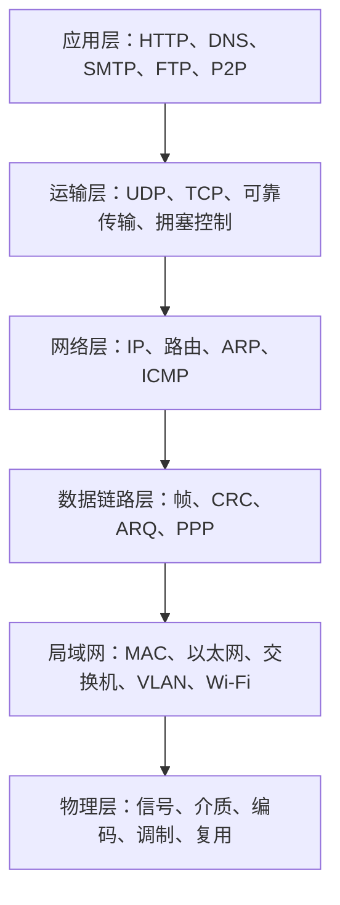

# 计算机网络课程笔记

> 本课程笔记依据第 1～7 章 PDF、PaddleOCR-VL 转换 Markdown 及两份总结与作业讲解课件整理。所有图示信息均已转换为 Obsidian 原生 Mermaid、Markdown 管道表格、LaTeX、代码块或文字描述，笔记不包含图片或外部图床依赖。

## 主要内容

- 网络组成、交换方式、性能指标与分层体系结构
- 应用层协议及分布式应用体系结构
- 运输层可靠传输、流量控制和拥塞控制
- 网络层编址、转发、路由和控制协议
- 数据链路层成帧、差错检测、可靠传输和点到点协议
- 局域网介质访问、以太网、交换机、VLAN 与无线网络
- 物理层信号、介质、编码、调制、复用和信道容量

---

## 一、章节导航

| 章节 | 笔记 | 核心问题 |
|---|---|---|
| 第 1 章 | [[1.1 计算机网络概述\|计算机网络概述]] | 网络由什么组成，交换、时延和分层如何工作 |
| 第 2 章 | [[计算机网络/笔记/2.1 应用层\|应用层]] | 网络应用如何通过 DNS、Web、邮件、FTP 和 P2P 提供服务 |
| 第 3 章 | [[计算机网络/笔记/3.1 运输层\|运输层]] | 进程如何可靠通信并进行流量与拥塞控制 |
| 第 4 章 | [[计算机网络/笔记/4.1 网络层\|网络层]] | 分组如何编址、转发、选路和报告控制信息 |
| 第 5 章 | [[计算机网络/笔记/5.1 数据链路层\|数据链路层]] | 相邻节点如何成帧、检错和可靠传输 |
| 第 6 章 | [[计算机网络/笔记/6.1 局域网\|局域网]] | 多个节点如何共享介质、交换以太网帧和划分 VLAN |
| 第 7 章 | [[计算机网络/笔记/7.1 物理层\|物理层]] | 比特如何变成信号并通过各种介质传输 |

综合练习入口：[[计算机网络/笔记/计算机网络复习与作业讲解|计算机网络复习与作业讲解]]。

---

## 二、协议栈知识结构

发送端由上向下逐层封装，接收端由下向上逐层解封装；中间设备根据其工作层次处理相应首部，物理层最终负责每一跳的信号传输。

---

## 三、学习主线

1. [[1.1 计算机网络概述|计算机网络概述]]：先掌握网络边缘、网络核心、交换方式、时延和协议分层。
2. [[计算机网络/笔记/2.1 应用层|应用层]]：从用户可见的网络应用理解进程通信和应用协议。
3. [[计算机网络/笔记/3.1 运输层|运输层]]：学习端到端复用、可靠传输、TCP 状态和拥塞控制。
4. [[计算机网络/笔记/4.1 网络层|网络层]]：掌握 IP 编址、路由表、最长前缀匹配和路由协议。
5. [[计算机网络/笔记/5.1 数据链路层|数据链路层]]与[[计算机网络/笔记/6.1 局域网|局域网]]：理解单跳传输、共享介质和交换式以太网。
6. [[计算机网络/笔记/7.1 物理层|物理层]]：最后回到底层信号、编码、介质和信道容量。
7. 使用[[计算机网络/笔记/计算机网络复习与作业讲解|复习与作业讲解]]串联跨层计算和协议分析。

---

## 四、课件与图示覆盖

| 章节 | PDF 页数 | OCR 图片引用 | Mermaid |
|---|---:|---:|---:|
| 第 1 章 | 131 | 142 | 22 |
| 第 2 章 | 147 | 74 | 12 |
| 第 3 章 | 116 | 70 | 14 |
| 第 4 章 | 218 | 131 | 13 |
| 第 5 章 | 59 | 42 | 11 |
| 第 6 章 | 66 | 38 | 11 |
| 第 7 章 | 57 | 48 | 18 |
| **章节合计** | **794** | **545** | **101** |

两份总结与作业讲解另有 61 页，并在独立笔记中使用 4 个 Mermaid 重构关键时序与拓扑。本总索引另含 1 个协议栈结构图。

- 每篇章节笔记末尾均有连续图片编号审计，覆盖 OCR Markdown 的全部图片引用。
- 原 OCR 中的 HTML 表格全部改为 Obsidian 原生 Markdown 管道表格。
- 不能可靠重构的照片、复杂截图和装饰图均已文字说明，没有保留图片或猜测缺失语义。
- 最终笔记不含图片语法、外部图片 URL、HTML 表格、Dataview 或其他插件专用语法。

---

## 五、跨层复习抓手

| 问题 | 应联想到的层次与概念 |
|---|---|
| 浏览网页经历什么 | DNS、TCP、HTTP、IP、ARP、以太网、物理信号 |
| 数据为何分片或分段 | MSS、运输报文段、IP MTU、链路帧 |
| 为什么会丢包或变慢 | 误码、碰撞、排队、拥塞、超时与重传 |
| 地址各自标识什么 | 域名、端口、IP 地址、MAC 地址 |
| 如何提高可靠性 | 检错码、序号、确认、定时器、滑动窗口、重传 |
| 如何提高效率 | 流水线、复用、缓存、窗口、交换、路由聚合 |

---

## 本章小结

| 学习维度 | 核心内容 |
|---|---|
| 分层 | 每层通过接口使用下层服务，并向上层隐藏实现细节 |
| 封装 | 各层添加控制信息，接收端按相反顺序解析 |
| 编址 | 域名、端口、IP 和 MAC 分别服务于不同范围的定位 |
| 转发 | 交换机按 MAC，路由器按 IP 前缀选择输出方向 |
| 可靠性 | 差错检测、确认、重传、窗口和拥塞控制共同作用 |
| 性能 | 带宽、时延、吞吐量、利用率和协议开销需要综合计算 |
