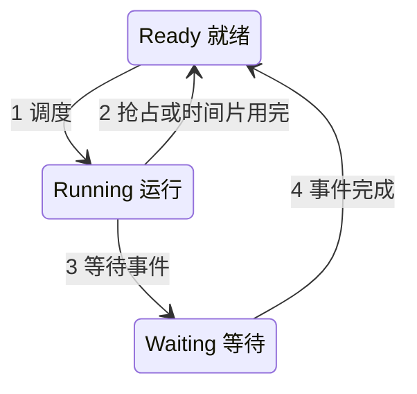
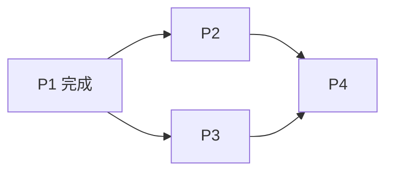
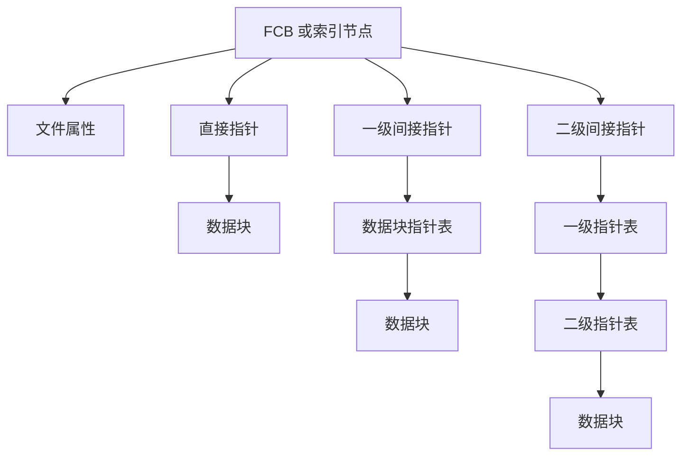
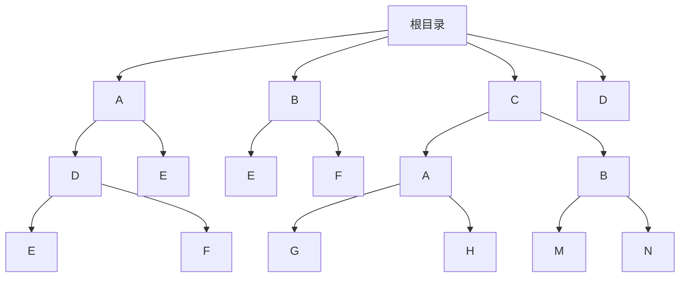

# 操作系统真题合订

> 本文件汇总《操作系统》课程 `真题整理` 文件夹中的全部历年试卷、模拟题与复习资料题目，按笔记章节（第 1～8 章、第 12 章）归类，每一章内再按题型（选择题、填空题、判断题、名词解释、简答题、计算题、综合题）排列。题干均保留原卷完整描述；原卷或整理文件附有答案的，使用折叠 Callout 收纳，答案内容忠实保留，未核验的以原文呈现。

## 主要内容

- 按章节组织：第 1 章操作系统引论 / 第 2 章进程的描述与控制 / 第 3 章处理机调度与死锁 / 第 4 章进程同步 / 第 5 章存储器管理 / 第 6 章虚拟存储器 / 第 7 章输入输出系统 / 第 8 章文件管理 / 第 12 章保护和安全  
- 每章内按题型排列：选择题、填空题、判断题、名词解释、简答题、计算题、综合题  
- 每题标注来源试卷（可点击跳转至对应真题文件）  
- 答案统一使用 `> [!answer]-` 折叠 Callout，默认隐藏

> [!note] 题目归类说明
> 部分综合性题目可能同时涉及多个章节，此处按其主要知识点归入对应章节；同一道题在多份试卷中重复出现时，合并为一个条目并标注多份来源。第 9、10、11 章不在本课程考题范围内（依据 [[操作系统/笔记/考题范围|考题范围]]）。

---
## 一、第 1 章 操作系统引论

### 1. 选择题

**1.**（来源：[[2016—2017 学年第一学期操作系统原理期末试卷（A 卷）]]）  
Which one is not the main task of an operating system? __  
A. Process management　B. Language translation　C. File management　D. Memory management

**2.**（来源：[[2016—2017 学年第一学期操作系统原理期末试卷（A 卷）]]）  
Which of the following system has strict time constraint? _____  
A. Batch system　B. Time-sharing system　C. Real-time system　D. Interactive system

**3.**（来源：[[某某年期中试题]]）  
实时操作系统必须在（　）处理来自外部的事件。  
A. 一个机器周期　B. 被控制对象规定时间　C. 周转时间　D. 时间片

**4.**（来源：[[某某年期中试题]]）  
提高单机资源利用率的关键技术是（　）。  
A. 脱机技术　B. 虚拟技术　C. 交换技术　D. 多道程序设计技术

**5.**（来源：[[某某年期中试题]]）  
单处理机系统中可并行的是（　）。  
Ⅰ. 进程与进程　Ⅱ. 处理机与设备　Ⅲ. 处理机与通道　Ⅳ. 设备与设备  
A. Ⅰ、Ⅱ、Ⅲ　B. Ⅰ、Ⅱ、Ⅳ　C. Ⅰ、Ⅲ、Ⅳ　D. Ⅱ、Ⅲ、Ⅳ

**6.**（来源：[[2016年秋季操作系统原理期末复习题]]）  
在操作系统的分类中，属于不同分类方法的有（　）。  
A. 多道批处理操作系统　B. 分布式操作系统　C. 分时操作系统　D. 实时操作系统

> [!answer]- 原资料标记
> A 为红字，D 被黄色高亮，标记互相矛盾。

> [!warning] 标注答案待核验
> 原资料声明不公开标准答案；红字/黄色高亮仅为可辨标记，存在单选题多处同时标色等矛盾，不视为标准答案。

**7.**（来源：[[2016年秋季操作系统原理期末复习题]]）  
中断是指（　）。  
A. 操作者要求计算机停止　B. 操作系统停止了计算机运行　C. CPU 对系统中发生的异步事件的响应　D. 操作系统停止了某个进程的运行

> [!answer]- 原资料标记
> C。

**8.**（来源：[[2016年秋季操作系统原理期末复习题]]）  
引入多道程序操作系统的主要目的是（　）。  
A. 使不同程序都可以使用各种资源　B. 提高 CPU 和其他设备的利用率　C. 操作更方便　D. 使串行程序执行时间缩短

> [!answer]- 原资料标记
> B。

**9.**（来源：[[2016年秋季操作系统原理期末复习题]]）  
计算机内存中按（　）编址。  
A. 位　B. 块　C. 字　D. 字节

> [!answer]- 原资料标记
> D。

**10.**（来源：[[2016年秋季操作系统原理期末复习题]]）  
计算机数据总线宽度一般对应计算机的（　）。  
A. 位　B. 块　C. 字长　D. 字节

> [!answer]- 原资料标记
> C。

**11.**（来源：[[2016年秋季操作系统原理期末复习题]]）  
CPU 在什么时候扫描是否有中断发生？  
A. 开中断语句执行时　B. 每条程序执行结束后　C. 一个进程执行完毕时　D. 每个机器指令周期的最后时刻

> [!answer]- 原资料标记
> A。

**12.**（来源：[[2016年秋季操作系统原理期末复习题]]）  
计算机系统用（　）电路判断中断优先级，以确定响应哪个中断。  
A. 中断扫描　B. 中断屏蔽　C. 中断逻辑　D. 中断寄存器

> [!answer]- 原资料标记
> C。

**13.**（来源：[[2016年秋季操作系统原理期末复习题]]）  
操作系统具有哪些基本功能？  
A. 资源管理　B. 病毒查杀　C. 人机接口　D. 网络连接

> [!answer]- 原资料标记
> A、C。

**14.**（来源：[[2016年秋季操作系统原理期末复习题]]）  
下面哪些软件属于操作系统？  
A. Android　B. Windows XP　C. DOS　D. Linux

> [!answer]- 原资料标记
> 原资料仅高亮题干，未见可靠答案标记。

**15.**（来源：[[2016年秋季操作系统原理期末复习题]]）  
多道程序操作系统具有哪些特性？  
A. 随机性　B. 并行性　C. 可扩充性　D. 共享性

> [!answer]- 原资料标记
> B、D。

**16.**（来源：[[2016年秋季操作系统原理期末复习题]]）  
根据执行程序的性质不同，处理器可分为哪些状态？  
A. 管态　B. 目态　C. 阻塞态　D. 执行态

> [!answer]- 原资料标记
> 原资料高亮全部选项，无法判断其标记含义。

**17.**（来源：[[2017—2018 学年第一学期操作系统期中试卷（版本一）]]、[[2017—2018 学年第一学期操作系统期中试卷（版本二）]]）  
以下陈述中，正确的是 $\underline{A}$.

I. Android 是一种广泛应用于智能手机和平板电脑的操作系统；

II. Unix 操作系统的一些发行版本可以支持大型主机和服务器；

III. Windows 和 Linux 操作系统属于开源操作系统；

IV. 在 Windows 操作系统中，通过任务管理器可以查看系统内并非执行的进程信息，如 CPU 占用率、进程内线程数目、内存占用情况等。

A. I, II and IV　B. II and III　C. III and IV　D. II, III and IV

> [!answer]- 原卷答案
>
> A。

**18.**（来源：[[2017—2018 学年第一学期操作系统期中试卷（版本一）]]）  
下列选项中，操作系统提供给应用程序的接口是  
A. 系统调用　B. 中断　C. 库函数　D. 原语

**19.**（来源：[[2017—2018 学年第一学期操作系统期中试卷（版本一）]]）  
下列选项中，在用户态执行的是  
A. 命令解释程序　B. 缺页处理程序　C. 进程调度程序　D. 时钟中断处理程序

> [!answer]- 原卷答案
> A。

**20.**（来源：[[2017—2018 学年第一学期操作系统期中试卷（版本一）]]）  
若一个用户进程通过 read 系统调用读取一个磁盘文件中的数据，则关于此过程的叙述中，正确的是 $\underline{A}$.  
I. 若该文件不在内存，则该进程进入睡眠等待状态  
II. 请求 read 系统调用会导致 CPU 从用户态切换到核心态  
III. Read 系统调用的参数应包含文件的名称  
A. 仅 I、II　B. 仅 I、III　C. 仅 II、III　D. I、II、III

> [!answer]- 原卷答案
> A。

**21.**（来源：[[2017—2018 学年第一学期操作系统期中试卷（版本一）]]）  
下列选项中，能导致用户进程从用户态切换到内核态的操作是_____。  
A. 整数除零　B. 仅 I、II　C. 仅 II、III　D. I、II、III

> [!warning] 疑点说明
> 本题原卷 OCR 转写不完整：选项 B、C、D 所引用的陈述 I、II、III 未在题干中完整保留，正确答案亦未标记。

**22.**（来源：[[2017—2018 学年第一学期操作系统期中试卷（版本一）]]）  
计算机开机后，操作系统最终被加载到_____。  
A. BIOS　B. ROM　C. EPROM　D. RAM

**23.**（来源：[[2017—2018 学年第一学期操作系统期中试卷（版本一）]]）  
下列指令中，不能在用户态下执行的是  
A. trap　B. 跳转　C. 后栈指令　D. 关中断

> [!answer]- 原卷答案
> D。

**24.**（来源：[[2019—2020 学年第一学期操作系统期中试卷（版本一）]]、[[2019—2020 学年第一学期操作系统期中试卷（版本三）]]）  
Which handling procedures of the following situations will not switch into monitor mode?

A. procedure calls　B. system calls　C. interrupts　D. traps

**25.**（来源：[[2019—2020 学年第一学期操作系统期中试卷（版本二）]]）  
1. Contents of interrupt vector are $\underline{C}$. B

A. begin address of sub-programs

B. begin addresses of interrupt handling programs

C. the address of begin addresses of interrupt handling programs

D. begin address of handling programs

> [!answer]- 原卷答案
> C。

> [!warning] 疑点说明
> 原卷标注答案为 C，但题干末尾残留手写／OCR 标记 "B"；选项 C 文字 "the address of begin addresses of interrupt handling programs" 疑为 OCR 误识别，此处原样保留。

**26.**（来源：[[2020 年操作系统期末模拟试题]]）  
In the following comments, _____ are correct.

(1) Android is a widely used embedded operating system devoted to smart phones and tablet computers.

(2) Microsoft Windows Phone lists Top 1 in terms of the market share among the operating systems dedicated to smart phones.

(3) Unix has some distribution versions supporting server or mainframe computers.

(4) Linux is a type of open source operating systems.

(5) Windows XP is the operating system with the layered structure.

A. (1) and (2)    B. (2) and (3)    C. (3) and (4)    D. (4) and (5)

**27.**（来源：[[2020 年操作系统期末模拟试题]]）  
In the booting procedure, when a PC computer is powered up, the chunk of codes that the CPU will at first execute is _____.

A. OS kernel B. bootstrap in BIOS C. boot block on disk D. system programs

**28.**（来源：[[2020—2021 学年第一学期操作系统期中试卷（版本一）]]）  
（8）Which handling procedures of the following situations will not switch into monitor mode? _____

A. traps B. interrupts C. procedure calls D. system calls

> [!answer]- 原卷答案
> C。

**29.**（来源：[[2020—2021 学年第一学期操作系统期中试卷（版本二）]]）  
1. 以下陈述中，正确的是Ⅱ,Ⅳ

I. Mach 操作系统是由苹果公司开发的、具有微内核架构的操作系统；

II. Unix 是一类分时多用户多任务操作系统，它的一些发行版本可以支持服务器和大型主机系统；

III. Windows 桌面操作系统的发行版本有 Windows XP, Windows 7, Windows 9, and Windows 10;

IV. 作为开源操作系统，Linux 具有多种发行版本，可以支持嵌入式设备、个人电脑、服务器、大型主机系统；

> [!answer]- 原卷答案
> 正确的是Ⅱ,Ⅳ。

**30.**（来源：[[2020—2021 学年第一学期操作系统期中试卷（版本二）]]、[[2020—2021 学年第一学期操作系统期中试卷（版本三）]]、[[2020—2021 学年第一学期操作系统期中试卷（版本四）]]）  
2. When we power up or reset a PC computer, the booting procedure starts, and the CPU will sequentially executes several chunks of codes, including

I. boot block on disk II. bootstrap in BIOS III. OS kernel

IV. application programs V. system programs

The correct order of code execution is $\underline{D}$.

A. I, II, III, IV, V B. I, II, III, V, IV

C. II, I, III, IV, V

D. II, I, III, V, IV

> [!answer]- 原卷答案
>
> D。

**31.**（来源：[[2020—2021 学年第一学期操作系统期中试卷（版本二）]]）  
3. 下列选项中，在用户态执行的是 $\underline{D}$.

A. 时钟中断处理程序 B. 操作系统初始化程序

C. 进程调度程序 D. 编译和链接程序

> [!answer]- 原卷答案
> D。

**32.**（来源：[[2020—2021 学年第一学期操作系统期中试卷（版本二）]]）  
4. In which condition, switching from the user mode to the kernel mode will not occur? $\underline{D}$

A. 整数除零导致的 trap B. 硬件 interrupt

C. read 系统调用 D. 子程序/函数调用，如 sin()函数调用

> [!answer]- 原卷答案
> D。

**33.**（来源：[[2020—2021 学年第一学期操作系统期中试卷（版本二）]]）  
28. 下列选项中，能导致用户进程从用户态切换到内核态的操作是（b）

Ⅰ. 整数除零 Ⅱ. $\sin()$ 函数调用 Ⅲ. read 系统调用

A. 仅 I、II B. 仅 I、III C. 仅 II、III D. I、II、III

> [!answer]- 原卷答案
> b。

**34.**（来源：[[2020—2021 学年第一学期操作系统期中试卷（版本二）]]）  
29. 计算机开机后，操作系统最终被加载到 $\underline{\text{（d）}}$

A. BIOS B. ROM C. EPROM D. RAM

> [!answer]- 原卷答案
> d。

**35.**（来源：[[2020—2021 学年第一学期操作系统期中试卷（版本二）]]）  
25. 下列指令中，不能在用户态下执行的是 $\underline{d}$

A. trap B. 跳转 C. 后栈指令 D. 关中断

> [!answer]- 原卷答案
> d。

**36.**（来源：[[2020—2021 学年第一学期操作系统期中试卷（版本二）]]、[[2020—2021 学年第一学期操作系统期中试卷（版本三）]]、[[2020—2021 学年第一学期操作系统期中试卷（版本四）]]）  
24. 执行系统调用的过程包括如下主要操作：

①返回用户态 ②执行陷入(trap)指令

③传递系统调用参数 ④执行相应的服务程序

正确的执行顺序是 C

A. $\textcircled{2}\rightarrow\textcircled{3}\rightarrow\textcircled{1}\rightarrow\textcircled{4}$ B. $\textcircled{2}\rightarrow\textcircled{4}\rightarrow\textcircled{3}\rightarrow\textcircled{1}$ C. $\textcircled{3}\rightarrow\textcircled{2}\rightarrow\textcircled{4}\rightarrow\textcircled{1}$ D. $\textcircled{3}\rightarrow\textcircled{4}\rightarrow\textcircled{2}\rightarrow\textcircled{1}$

> [!answer]- 原卷答案
>
> C。

**37.**（来源：[[2020—2021 学年第一学期操作系统期中试卷（版本二）]]）  
【18:2】

23. 下列关于多任务操作系统的叙述中，正确的是 C

Ⅰ. 具有并发和并行的特点

II. 需要实现对共享资源的保护

III. 需要运行在多 CPU 的硬件平台上

A. 仅 I B. 仅 II C. 仅 I、II D. I、II、III

> [!answer]- 原卷答案
> C。

**38.**（来源：[[2020—2021 学年第一学期操作系统期中试卷（版本二）]]）  
25. 下列关于系统调用的叙述中，正确的是 $\underline{I, II, IV}$

I. 在执行系统调用服务程序的过程中，CPU处于内核态

II. 操作系统通过系统调用避免用户程序直接访问外设

III. 不同的操作系统为应用程序提供了统一的系统调研接口

IV. 系统调用是操作系统内核为应用程序提供服务的接口

> [!answer]- 原卷答案
> 正确的是 I, II, IV。

**39.**（来源：[[2020—2021 学年第一学期操作系统期中试卷（版本三）]]、[[2020—2021 学年第一学期操作系统期中试卷（版本四）]]）  
以下陈述中，正确的是____

I. Mach 操作系统是由苹果公司开发的、具有微内核架构的操作系统；

II. Unix 是一类分时多用户多任务操作系统，它的一些发行版本可以支持服务器和大型主机系统；

III. Windows 桌面操作系统的发行版本有 Windows XP, Windows 7, Windows 9, and Windows 10;

IV. 作为开源操作系统，Linux 具有多种发行版本，可以支持嵌入式设备、个人电脑、服务器、大型主机系统；

> [!answer]- 原卷答案
> Ⅱ、Ⅳ。

**40.**（来源：[[2020—2021 学年第一学期操作系统期中试卷（版本三）]]、[[2020—2021 学年第一学期操作系统期中试卷（版本四）]]）  
下列选项中，在用户态执行的是____.

A. 时钟中断处理程序　B. 操作系统初始化程序

C. 进程调度程序　D. 编译和链接程序

> [!answer]- 原卷答案
> D。

**41.**（来源：[[2020—2021 学年第一学期操作系统期中试卷（版本三）]]、[[2020—2021 学年第一学期操作系统期中试卷（版本四）]]）  
In which condition, switching from the user mode to the kernel mode will not occur? ____

A. 整数除零导致的 trap　B. 硬件 interrupt

C. read 系统调用　D. 子程序/函数调用，如 sin()函数调用

> [!answer]- 原卷答案
> D。

**42.**（来源：[[2020—2021 学年第一学期操作系统期中试卷（版本三）]]、[[2020—2021 学年第一学期操作系统期中试卷（版本四）]]）  
下列选项中，能导致用户进程从用户态切换到内核态的操作是（　　）

Ⅰ. 整数除零　Ⅱ.  $\sin()$ 函数调用　Ⅲ. read 系统调用

A. 仅 I、II　B. 仅 I、III　C. 仅 II、III　D. I、II、III

> [!answer]- 原卷答案
> B。

**43.**（来源：[[2020—2021 学年第一学期操作系统期中试卷（版本三）]]、[[2020—2021 学年第一学期操作系统期中试卷（版本四）]]）  
计算机开机后，操作系统最终被加载到____

A. BIOS　B. ROM　C. EPROM　D. RAM

> [!answer]- 原卷答案
> D。

**44.**（来源：[[2020—2021 学年第一学期操作系统期中试卷（版本三）]]、[[2020—2021 学年第一学期操作系统期中试卷（版本四）]]）  
下列指令中，不能在用户态下执行的是____

A. trap　B. 跳转　C. 后栈指令　D. 关中断

> [!answer]- 原卷答案
> D。

**45.**（来源：[[2020—2021 学年第一学期操作系统期中试卷（版本三）]]、[[2020—2021 学年第一学期操作系统期中试卷（版本四）]]）  
下列关于多任务操作系统的叙述中，正确的是____

Ⅰ. 具有并发和并行的特点

II. 需要实现对共享资源的保护

III. 需要运行在多 CPU 的硬件平台上

A. 仅 I　B. 仅 II　C. 仅 I、II　D. I、II、III

> [!answer]- 原卷答案
> C。

**46.**（来源：[[2020—2021 学年第一学期操作系统期中试卷（版本三）]]、[[2020—2021 学年第一学期操作系统期中试卷（版本四）]]）  
下列关于系统调用的叙述中，正确的是____

I. 在执行系统调用服务程序的过程中，CPU处于内核态

II. 操作系统通过系统调用避免用户程序直接访问外设

III. 不同的操作系统为应用程序提供了统一的系统调用接口

IV. 系统调用是操作系统内核为应用程序提供服务的接口

> [!answer]- 原卷答案
> I、II、IV。

**47.**（来源：[[2021—2022 学年第一学期操作系统期中试卷]]）  
Contents of interrupt vector are ____.

A. begin address of sub-programs

B. begin addresses of interrupt handling programs

C. the address of begin addresses of interrupt handling programs

D. begin address of handling programs

**48.**（来源：[[2022—2023 学年第一学期操作系统期中试卷（版本二）]]）  
Which of the following statement is correct? ___

A. More instructions can be executed in user mode than in kernel mode

B. We can switch from user mode to kernel mode through software interrupt traps

C. The dual mode can prevent the process from entering the loop state

D. Privileged instructions refer to the instructions that can be used by user mode processes

> [!answer]- 原卷标注
> B

**49.**（来源：[[2022—2023 学年第一学期操作系统期中试卷（版本二）]]）  
Which of the following system has the strict time constraint? ___

A. distributed system B. time-sharing system

C. real time system D. interactive system

> [!answer]- 原卷标注
> C

**50.**（来源：[[2022—2023 学年第一学期操作系统期中试卷（版本二）]]）  
Modern operating systems are _____ driven. If there are no processes to execute, no I/O devices to service, and no users to whom to respond, an operating system will sit quietly, waiting for something to happen.

A. user B. interrupt C. device D. hardware

> [!answer]- 原卷标注
> B

**51.**（来源：[[2022—2023 学年第一学期操作系统期中试卷（版本二）]]）  
The interrupt mechanism is used by operating system to handle the following events except ___.

A. I/O completion B. dividing by zero

C. virtual memory paging    D. calling a procedure

> [!answer]- 原卷标注
> D

**52.**（来源：[[2022—2023 学年第一学期操作系统期中试卷（版本二）]]）  
Which handling procedures of the following situations will not switch into kernel mode?____

A. procedure calls B. system calls C. interrupts D. traps

> [!answer]- 原卷标注
> A

---

**53.**（来源：[[2025—2026 学年第二学期操作系统原理期末试题（软件学院）]]）  
To access the services of operating system（为访问操作系统服务）, the interface is provided by the ( ).  
A. System calls　B. API　C. Library　D. Assembly instructions

**54.**（来源：[[os23-24]]）  
OS 的不确定性是指（　）。  
A. 程序的运行次序不确定  
B. 程序多次运行的时间不确定  
C. 程序的运行结果不确定  
D. A、B 和 C

> [!answer]- 原卷答案
> D。

### 2. 填空题

**1.**（来源：[[2016—2017 学年第一学期操作系统原理期末试卷（A 卷）]]）  
A time-shared computer system uses _____ scheduling scheme and multiprogramming to provide each user with a small portion of CPU time.

**2.**（来源：[[2016—2017 学年第一学期操作系统原理期末试卷（A 卷）]]）  
To prevent users from performing illegal I/O, we define all I/O instruction to be _____ instructions, which can be executed only in monitor mode.

**3.**（来源：[[2016—2017 学年第一学期操作系统原理期末试卷（A 卷）]]）  
Considering OS interfaces, an application program can utilize_____ to acquire services provided by OS.

**4.**（来源：[[2016—2017 学年第一学期操作系统原理期末试卷（A 卷）]]）  
If a system can deal with 3 real-time processes, 5 interactive processes and 2 batch processes in 400ms, then the throughput of this system is_____.

**5.**（来源：[[某某年期中试题]]）  
在计算机系统上配置操作系统的目标是〔扫描缺失〕、〔扫描缺失〕、可扩充性、开放性。

> [!warning] 源文件残缺
> 该题出自残缺扫描版试卷，两个空缺内容无法可靠恢复，原文以〔扫描缺失〕标明，不作猜测补写。

**6.**（来源：[[2017-2018操作系统期末]]）  
为了避免延迟造成严重后果，实时操作系统的主要目标有\_\_\_\_、\_\_\_\_。

> [!answer]- 原卷答案
> 截止时间的保证、可预测性。

**7.**（来源：[[2017—2018 学年第一学期操作系统期中试卷（版本一）]]、[[2017—2018 学年第一学期操作系统期中试卷（版本二）]]）  
When a computer is powered on, the procedure of starting the computer by loading the OS kernel is known as \_\_\_\_ the system.

> [!answer]- 原卷答案
>
> booting。
>
> booting

**8.**（来源：[[2017—2018 学年第一学期操作系统期中试卷（版本一）]]）  
The operating systems that allow users to use computers in interactive manners are called the \_\_\_\_ operating systems.

> [!answer]- 原卷答案
> time-sharing（原卷 OCR 写作 “time-spared time-sharing”，疑为 “time-sharing”）。

> [!warning] 疑点说明
> 原卷 OCR 存在 “time-spared” 拼写问题，疑为 “time-sharing”。

**9.**（来源：[[2017—2018 学年第一学期操作系统期中试卷（版本一）]]、[[2017—2018 学年第一学期操作系统期中试卷（版本二）]]）  
A software-generated interrupt caused either by an error or by specific requests from user programs that an operating-system service be performed is called a \_\_\_\_.

> [!answer]- 原卷答案
>
> trap。
>
> trap

**10.**（来源：[[2017—2018 学年第一学期操作系统期中试卷（版本一）]]）  
To protect the OS and all other programs and their data from any malfunctioning program, hardware protection is needed. Two separate modes of CPU operations, that is the \_\_\_\_ mode and the user mode, are provided.

> [!answer]- 原卷答案
> kernel（内核态）。

**11.**（来源：[[2017—2018 学年第一学期操作系统期中试卷（版本一）]]、[[2017—2018 学年第一学期操作系统期中试卷（版本二）]]）  
\_\_\_\_ are computers and/or software systems that react to external events in limited time intervals before the events become obsolete.

> [!answer]- 原卷答案
>
> Real-time system（实时系统）。
>
> Real-time system

**12.**（来源：[[2017—2018 学年第一学期操作系统期中试卷（版本二）]]）  
The operating systems that allow users to use computers in interactive manners are called the $\underline{\text{time-sharing}}$ $\underline{\text{operating systems}}$.

> [!answer]- 原卷答案
> time-sharing operating systems

**13.**（来源：[[2017—2018 学年第一学期操作系统期中试卷（版本二）]]、[[2020—2021 学年第一学期操作系统期中试卷（版本二）]]）  
7. To protect the OS and all other programs and their data from any malfunctioning program, hardware protection is needed. Two separate modes of CPU operations, that is the $\underline{\text{kernel/supervised/privileged/monitored}}$ mode and the user mode,

are provided.

> [!answer]- 原卷答案
>
> kernel/supervised/privileged/monitored
>
> kernel/supervised/privileged/monitored。

**14.**（来源：[[2019—2020 学年第一学期操作系统期中试卷（版本一）]]、[[2019—2020 学年第一学期操作系统期中试卷（版本三）]]、[[2020—2021 学年第一学期操作系统期中试卷（版本一）]]）  
Modern operating system is driven by ___.

> [!answer]- 原卷答案
>
> interrupt
>
> interrupt。

**15.**（来源：[[2019—2020 学年第一学期操作系统期中试卷（版本一）]]、[[2019—2020 学年第一学期操作系统期中试卷（版本三）]]）  
If an attempt is made to execute a privileged instruction in user mode, the hardware does not execute the instruction but rather treats it as illegal and traps it to the ___

> [!answer]- 原卷答案
>
> operating system

**16.**（来源：[[2019—2020 学年第一学期操作系统期中试卷（版本一）]]、[[2019—2020 学年第一学期操作系统期中试卷（版本三）]]、[[2020—2021 学年第一学期操作系统期中试卷（版本一）]]）  
Considering OS interfaces, an application program can utilize_____ to acquire services provided by the OS.

> [!answer]- 原卷答案
>
> system calls
>
> system calls。

**17.**（来源：[[2019—2020 学年第一学期操作系统期中试卷（版本一）]]、[[2019—2020 学年第一学期操作系统期中试卷（版本三）]]）  
Three general methods used to pass parameters to the operating system are ___, memory block, and stack.

> [!answer]- 原卷答案
>
> registers

**18.**（来源：[[2019—2020 学年第一学期操作系统期中试卷（版本一）]]、[[2019—2020 学年第一学期操作系统期中试卷（版本三）]]、[[2020—2021 学年第一学期操作系统期中试卷（版本一）]]）  
In When CPU executes the instructions of operating systems, it is said that CPU is in _____mode.

> [!answer]- 原卷答案
>
> kernel / system / supervisor / privileged
>
> kernel / system / supervisor / privileged。

**19.**（来源：[[2019—2020 学年第一学期操作系统期中试卷（版本二）]]）  
Programming interface provided by operating system is $\underline{\text{system call}}$.

> [!answer]- 原卷答案
> system call

**20.**（来源：[[2019—2020 学年第一学期操作系统期中试卷（版本二）]]）  
Two execution modes in operating systems are user mode and $\underline{\text{kernel}}$ mode.

> [!answer]- 原卷答案
> kernel

**21.**（来源：[[2019—2020 学年第一学期操作系统期中试卷（版本二）]]）  
An interrupt is a signal generated by a preherial device(e.g., an I/O device). $\underline{\text{PCB}}$ $\underline{\text{Intemuz}}$ vector contains the addresses of all the service routines for interrupts.

> [!answer]- 原卷答案
> PCB、Intemuz（原文如此）

> [!warning] 疑点说明
> 该题 OCR 转写存在明显错误：$\underline{\text{PCB}}$ $\underline{\text{Intemuz}}$ 疑为 "interrupt" 或 "interrupt vector" 的误识别（原题应为"中断向量"相关填空），此处原样保留，未作修正。

---

**22.**（来源：[[2020-2021期末]]）  
在单处理机系统中，假设在 1 秒的时间间隔内宏观上有四道程序在同时运行，但微观上程序分时交替执行，这种特性称为________（并行性或并发性）。

> [!answer]- 原卷答案
> 并行性或并发性

**23.**（来源：[[2020—2021 学年第一学期操作系统期中试卷（版本一）]]）  
（2）A ___ is a software-generated interrupt caused either by an error or by a specific request from a user program that an operating system service be performed.

> [!answer]- 原卷答案
> trap。

**24.**（来源：[[2020—2021 学年第一学期操作系统期中试卷（版本一）]]）  
（4）The instruction that can only be executed by Operating System is called ___ instruction.

> [!answer]- 原卷答案
> privilege。

**25.**（来源：[[2020—2021 学年第一学期操作系统期中试卷（版本二）]]）  
1. The operating systems that allow users to use computers in interactive manners are called the $\underline{\text{time-sharing}}$ operating systems.

> [!answer]- 原卷答案
> time-sharing。

**26.**（来源：[[2020—2021 学年第一学期操作系统期中试卷（版本二）]]）  
2. A software-generated interrupt caused either by an error or by specific requests from user programs that an operating-system service be performed is called a $\underline{\text{trap}}$ .

> [!answer]- 原卷答案
> trap。

**27.**（来源：[[2020—2021 学年第一学期操作系统期中试卷（版本二）]]）  
3. When a computer is powered on, the procedure of starting the computer by loading the OS kernel is known as $\underline{\text{booting}}$ the system.

> [!answer]- 原卷答案
> booting。

**28.**（来源：[[2020—2021 学年第一学期操作系统期中试卷（版本二）]]）  
4. $\underline{\text{Real-time}}$ systems are computers and/or software systems that react to external events in limited time intervals before the events become obsolete.

> [!answer]- 原卷答案
> Real-time。

**29.**（来源：[[2020—2021 学年第一学期操作系统期中试卷（版本二）]]）  
5. The programming interface provided by operating systems system are called $\underline{\text{system calls}}$, used by the system or application programs to acquire services provided by OS.

> [!answer]- 原卷答案
> system calls。

**30.**（来源：[[2020—2021 学年第一学期操作系统期中试卷（版本二）]]）  
10. Degree of $\underline{\text{multiprogramming}}$ is defined as the number of process in ( main ) memory

> [!answer]- 原卷答案
> multiprogramming。

**31.**（来源：[[2020—2021 学年第一学期操作系统期中试卷（版本三）]]、[[2020—2021 学年第一学期操作系统期中试卷（版本四）]]）  
The operating systems that allow users to use computers in interactive manners are called the ____ operating systems.

> [!answer]- 原卷答案
> time-sharing

**32.**（来源：[[2020—2021 学年第一学期操作系统期中试卷（版本三）]]、[[2020—2021 学年第一学期操作系统期中试卷（版本四）]]）  
A software-generated interrupt caused either by an error or by specific requests from user programs that an operating-system service be performed is called a ____ .

> [!answer]- 原卷答案
> trap

**33.**（来源：[[2020—2021 学年第一学期操作系统期中试卷（版本三）]]、[[2020—2021 学年第一学期操作系统期中试卷（版本四）]]）  
When a computer is powered on, the procedure of starting the computer by loading the OS kernel is known as ____ the system.

> [!answer]- 原卷答案
> booting

**34.**（来源：[[2020—2021 学年第一学期操作系统期中试卷（版本三）]]、[[2020—2021 学年第一学期操作系统期中试卷（版本四）]]）  
____ systems are computers and/or software systems that react to external events in limited time intervals before the events become obsolete.

> [!answer]- 原卷答案
> Real-time

**35.**（来源：[[2020—2021 学年第一学期操作系统期中试卷（版本三）]]、[[2020—2021 学年第一学期操作系统期中试卷（版本四）]]）  
The programming interface provided by operating systems system are called ____ , used by the system or application programs to acquire services provided by OS.

> [!answer]- 原卷答案
> system calls

**36.**（来源：[[2020—2021 学年第一学期操作系统期中试卷（版本三）]]、[[2020—2021 学年第一学期操作系统期中试卷（版本四）]]）  
To protect the OS and all other programs and their data from any malfunctioning program, hardware protection is needed. Two separate modes of CPU operations, that is the ____ mode and the user mode, are provided.

> [!answer]- 原卷答案
> kernel/supervised/privileged/monitored

### 3. 判断题

**1.**（来源：[[某某年期中试题]]）  
计算机系统中判断是否有中断发生，是在由用户态转入核心态时。（　）

**2.**（来源：[[2016年秋季操作系统原理期末复习题]]）  
计算机系统中，信息在主存中的最小单位是字节。

> [!answer]- 原资料标记
> 错误。

> [!warning] 判断答案未核验
> 原表仅转写 PDF 的红字标记，其中个别结论可能与常见教材表述冲突。以下来自该资料的判断题答案均同此说明。

**3.**（来源：[[2016年秋季操作系统原理期末复习题]]）  
从缓存到外存，容量越来越大，访问数据速度越来越快。

> [!answer]- 原资料标记
> 错误。

**4.**（来源：[[2020-2021期末]]）  
在单任务操作系统中，进程运行多次得到的结果相同。（　）

**5.**（来源：[[2025—2026 学年第二学期操作系统原理期末试题（软件学院）]]）  
网络连接故障会由操作系统处理。

**6.**（来源：[[2025—2026 学年第二学期操作系统原理期末试题（软件学院）]]）  
多道程序程度（degree）是指内存中的进程数。

**7.**（来源：[[os23-24]]）  
操作系统的所有程序都必须常驻内存。

> [!answer]- 原卷答案
> 错。

**8.**（来源：[[os23-24]]）  
每当中断处理完成后，都将返回被中断进程被中断处继续执行。

> [!answer]- 原卷答案
> 对。

### 5. 简答题

**1.**（来源：[[2016年秋季操作系统原理期末复习题]]）  
现代操作系统的主要特点。

> [!answer]- 原资料答案
> 1. 微内核结构
> 2. 多线程机制
> 3. 对称多处理器机制（SMP）
> 4. 分布式操作系统
> 5. 面向对象技术

**2.**（来源：[[OS-2020期中含答案]]）  
作为操作系统的基础特征之一，比较并发和并行概念间的差异，并分别针对单处理机系统和多处理机系统解释多道程序环境下的执行情况。

> [!answer]- 原资料答案
> 1. 并行性：两个或多个事件在同一时刻发生。（1 分）
> 2. 并发性：两个或多个事件在同一时间间隔内发生。（1 分）
> 3. 单处理机系统：多道程序环境下，宏观上多个程序同时运行；微观上每一时刻只有一道程序执行。（2 分）
> 4. 多处理机系统：多道程序环境下，程序的并发和并行都有可能。（2 分）

> [!warning] 疑点说明
> 来源表述疑点：原 PDF 在单处理机“微观上”之后写作“不能并发”，与前文概念可能矛盾；这里保留其可辨识的事实描述，不替来源静默修正。

**3.**（来源：[[OS-2020期中含答案]]）  
请简述采用微内核的基本功能。

> [!answer]- 原资料答案
> 所谓微内核技术，是指精心设计的、能实现现代 OS 核心功能的小型内核。它比一般 OS 程序更小、更精炼，不仅运行在核心态，而且开机后常驻内存，不会因内存紧张而被换出内存。
>
> 微内核的基本功能包括：
>
> 1. 进程管理
> 2. 存储器管理
> 3. 进程通信管理
> 4. I/O 设备管理
>
> 每项 1.5 分。

**4.**（来源：[[操作系统重点知识点总结]]）  
什么是操作系统：

> [!answer]- 答案
> 操作系统是配置在计算机硬件上带第一层软件，是对硬件系统的首次扩充。

> [!warning] 疑点说明
> 原卷中"带第一层软件"疑为"的第一层软件"（OCR 错别字），按原卷保留。

**5.**（来源：[[操作系统重点知识点总结]]）  
操作系统的作用：

> [!answer]- 答案
> OS作为用户与计算机硬件系统之间带接口、OS作为计算机系统资源带管理者、OS实现啦对计算机资源带抽象

> [!warning] 疑点说明
> 原卷中"带接口""带管理者""啦"疑为"的接口""的管理者""了"（OCR 错别字），按原卷保留。

**6.**（来源：[[操作系统重点知识点总结]]）  
操作系统的目标（原卷为要点式记录）

> [!answer]- 答案
> 有效性、方便性、可扩充性、开放性

**7.**（来源：[[操作系统重点知识点总结]]）  
操作系统基本特征（原卷为要点式记录）

> [!answer]- 答案
> （并发性 共享性 虚拟性 异步性）其中最重要的特征是并发性

**8.**（来源：[[操作系统重点知识点总结]]）  
操作系统的主要功能（原卷为要点式记录）

> [!answer]- 答案
> 处理机管理存储器管理设备管理文件管理用户接口

---

### 7. 综合题

**1.**（来源：[[某某年期中试题]]）  
一个多道批处理系统中仅有 $P1$ 和 $P2$ 两个作业，$P2$ 比 $P1$ 晚 10 ms 到达，其计算和 I/O 操作顺序如下：  
- $P1$：计算 60 ms，I/O 80 ms，计算 20 ms。  
- $P2$：计算 120 ms，I/O 20 ms，计算 30 ms。

不考虑调度和切换时间，计算完成两个作业需要的最少时间，并给出相应图示说明。

> [!warning] 源文件残缺
> 该题出自残缺扫描版试卷，源文件未保留可辨识答案。

---

## 二、第 2 章 进程的描述与控制

### 1. 选择题

**1.**（来源：[[某某年期中试题]]）  
进程的基本状态中，（　）可以由其他两种基本状态转变而来。  
A. 新建状态　B. 就绪状态　C. 阻塞状态　D. 执行状态

**2.**（来源：[[2016年秋季操作系统原理期末复习题]]）  
关于进程概念，下面说法不对的是（　）。  
A. 进程是程序的一次执行　B. 进程是动态的　C. 一个程序对应一个进程　D. 进程有生命周期

> [!answer]- 原资料标记
> C。

**3.**（来源：[[2016年秋季操作系统原理期末复习题]]）  
进程间接通信中，端口代表（　）。  
A. 进程　B. 计算机中的不同网卡　C. 服务器　D. 计算机终端在网络中的位置

> [!answer]- 原资料标记
> A。

**4.**（来源：[[2016年秋季操作系统原理期末复习题]]）  
在任务管理器中结束一个进程，实际是（　）。  
A. 修改进程状态　B. 撤销进程控制块　C. 修改进程优先级　D. 进程控制块进入阻塞队列

> [!answer]- 原资料标记
> B。

**5.**（来源：[[2016年秋季操作系统原理期末复习题]]）  
进程的基本状态有哪些？  
A. 运行态　B. 阻塞态　C. 就绪态　D. 完成态

> [!answer]- 原资料标记
> A、B、C。

**6.**（来源：[[2017-2018操作系统期末]]）  
进程和程序的本质区别是（　）。  
A. 存储在内存和外存　B. 顺序和非顺序执行机器指令　C. 分时使用和独占使用计算机资源　D. 动态和静态特征

> [!answer]- 原卷答案
> D。

**7.**（来源：[[2017-2018操作系统期末]]）  
下列进程状态的转换中，不正确的是（　）。  
A. 就绪到运行　B. 运行到就绪　C. 就绪到阻塞　D. 阻塞到就绪

> [!answer]- 原卷答案
> C。

**8.**（来源：[[2017—2018 学年第一学期操作系统期中试卷（版本一）]]）  
Among the following comments:  
I. In a system, the state of a process can migrate from $\underline{\text{waiting}}$ to running.  
II. PCB contains the $\underline{\text{process state}}$, the program counter, $\underline{\text{CPU registers}}$ and $\underline{\text{user data}}$.  
III. In a system with the operating system supporting $\underline{\text{kernel-level}}$ threads, the thread is the basic unit for CPU scheduling, and the process is the basic unit for resources allocation.  
IV. For several threads created by one process, they can share the files opened in the process.  
A. I and II　B. III and IV　C. I and IV　D. II and III

**9.**（来源：[[2017—2018 学年第一学期操作系统期中试卷（版本一）]]）  
下列选项中，导致创建新进程的操作是  
I. 用户成功登陆  
II. 设备分配  
III. 启动程序执行  
A. 仅 I, II　B. 仅 II, III　C. 仅 I, III　D. 仅 I, II, III

> [!answer]- 原卷答案
> C。

**10.**（来源：[[2017—2018 学年第一学期操作系统期中试卷（版本一）]]）  
在支持多线程的系统中，进程 P 创建的若干个线程不能共享的是  
A. 进程 P 的代码段　B. 进程 P 中打开的文件　C. 进程 P 的全局变量　D. 进程 P 中某线程的栈指针

> [!answer]- 原卷答案
> D。

**11.**（来源：[[2017—2018 学年第一学期操作系统期中试卷（版本一）]]）  
下列关于进程和线程的叙述中，正确的是_____。  
A. 不管系统是否支持线程，进程都是系统资源分配的基本单位  
B. 线程是资源分配的基本单位，进程是调度的基本单位  
C. 系统级线程和用户级线程的切换都需要内核的支持  
D. 同一进程中的各个线程拥有各自不一的地址空间

**12.**（来源：[[2017—2018 学年第一学期操作系统期中试卷（版本一）]]）  
下列选项中会导致进程从执行态变为就绪态的事件是 $\underline{D}$.  
A. 执行 P(或 wait)操作　B. 申请内存失败　C. 启动 I/O 设备　D. 被高优先级进程抢占

> [!answer]- 原卷答案
> D。

**13.**（来源：[[2017—2018 学年第一学期操作系统期中试卷（版本二）]]）  
Among the following comments, only $\underline{B}$ are correct.

I. In a system, the state of a process can migrate from waiting to running.

II. PCB contains the process state, the program counter, CPU registers and user data.

III. In a system with the operating system supporting kernel-level threads, the thread is the basic unit for CPU scheduling, and the process is the basic unit for resource allocation.

IV. For several threads created by one process, they can share the files opened in the process.

A. I and II　B. III and IV　C. I and IV　D. II and III

> [!answer]- 原卷答案
> B。

**14.**（来源：[[2019—2020 学年第一学期操作系统期中试卷（版本一）]]、[[2019—2020 学年第一学期操作系统期中试卷（版本三）]]）  
$\underline{\text{is not included}}$ in the context of process?

A. PCB　B. code　C. kernel stack　D. interrupt vector

> [!answer]- 原卷答案
>
> D。
>
> D

**15.**（来源：[[2019—2020 学年第一学期操作系统期中试卷（版本一）]]、[[2019—2020 学年第一学期操作系统期中试卷（版本三）]]）  
Among the following migrations, ___ is impossible?

A. running $\rightarrow$ ready　B. running $\rightarrow$ waiting

C. ready $\rightarrow$ running　D. waiting $\rightarrow$ running

> [!answer]- 原卷答案
>
> D。
>
> D

**16.**（来源：[[2019—2020 学年第一学期操作系统期中试卷（版本一）]]、[[2019—2020 学年第一学期操作系统期中试卷（版本三）]]）  
When does a process migrate from waiting state to ready state? ___

A. the process is waiting for an event　B. process is selected by scheduler

C. event that the process is waiting for occurs　D. time slice is used up

> [!answer]- 原卷答案
>
> C。
>
> C

**17.**（来源：[[2019—2020 学年第一学期操作系统期中试卷（版本一）]]、[[2019—2020 学年第一学期操作系统期中试卷（版本三）]]）  
In the following comments on processes and threads, only ___ are correct.

① As the result of I/O completion, a process switches from the waiting state to the ready state, and the CPU scheduling may take place.

② In a system with the operating system supporting kernel-level threads, the process is the basic unit for resources allocation, while the thread is the basic unit for CPU scheduling.

③ For several threads created by one process, one thread's stack and registers can be shared by the others.

④ The round robin algorithm will never result in process starvation.

⑤ PCB contains the process state, the program counter, CPU registers, and user data.

A. ①②③　B. ①②④　C. ②③⑤　D. ②④⑤

> [!answer]- 原卷答案
>
> B。
>
> B

**18.**（来源：[[2019—2020 学年第一学期操作系统期中试卷（版本二）]]）  
In a(n) $\underline{A}$ temporary queue, the sender must always block until the recipient receives the message.

A. zero capacity　B. variable capacity

C. bounded capacity　D. unbounded capacity

> [!answer]- 原卷答案
> A。

**19.**（来源：[[2019—2020 学年第一学期操作系统期中试卷（版本二）]]）  
(C) Which of the following migrations is impossible?

A. running $\rightarrow$ ready

B. running $\rightarrow$ waiting

C. waiting $\rightarrow$ running

D. running $\rightarrow$ terminate

> [!answer]- 原卷答案
> C。

**20.**（来源：[[2019—2020 学年第一学期操作系统期中试卷（版本二）]]）  
Both Linux and Solaris 10 use the $\underline{D}$ method for the correspondence between user threads and kernel threads.

A. One-to-One　B. Many-to-One

C. One-to-Many　D. May-to-Many

> [!answer]- 原卷答案
> D。

> [!warning] 疑点说明
> 选项 D 文字 "May-to-Many" 疑为 "Many-to-Many" 的 OCR 误识别，此处原样保留。

**21.**（来源：[[2020 年操作系统期末模拟试题]]）  
Among the following comments, only ___ are correct.

(1) The cache is a type of non-volatile storage device; it will not lose its contents in the case of system failure.

(2) In a system with the operating system supporting kernel-level threads, the thread is the basic unit for CPU scheduling, and the process is the basic unit for resources allocation.

(3) PCB contains the process state, the program counter, CPU registers, and user data.

(4) For several threads created by one process, they can share the files opened in the process.

(5) The round robin algorithm could result in starvation.

A. (1) and (2) B. (3) and (4) C. (4) and (5) D. (2) and (4) E. (2) and (5)

**22.**（来源：[[2020-2021期末]]）  
进程通信是指进程之间的信息交换。以下属于通信机制的是（　）。

- A. 进程互斥  
- B. 进程同步  
- C. 信号量机制  
- D. 管道

> [!answer]- 手写参考答案（待核验）
> B（原卷手写标记，不作为标准答案，待核验）。

**23.**（来源：[[2020-2021期末]]）  
对于程序段：

```text
S1: a = x + 2
S2: b = y + 3
S3: c = a + b
S4: d = a + c
```

下列说法正确的是（　）。

- A. S1 和 S2 不能并发执行  
- B. S1 和 S3 之间存在前驱关系  
- C. S2 和 S4 可以并发执行  
- D. S4 是 S3 的前驱

> [!answer]- 手写参考答案（待核验）
> B（原卷手写标记，不作为标准答案，待核验）。

**24.**（来源：[[2020—2021 学年第一学期操作系统期中试卷（版本一）]]）  
（1）___ is not included in the context of process?

A. code B. PCB C. interrupt vector D. kernel stack

> [!answer]- 原卷答案
> C。

**25.**（来源：[[2020—2021 学年第一学期操作系统期中试卷（版本一）]]）  
（2）Among the following migrations, _____ is impossible?

A. running $\rightarrow$ready B. running $\rightarrow$waiting

C. waiting $\rightarrow$running D. running $\rightarrow$terminate

> [!answer]- 原卷答案
> C。

**26.**（来源：[[2020—2021 学年第一学期操作系统期中试卷（版本一）]]）  
（3）When does a process migrate from waiting state to ready state?_____

A. time slice is used up

B. process is selected by scheduler

C. event that the process is waiting for occurs D. the process is waiting for an event

> [!answer]- 原卷答案
> C。

**27.**（来源：[[2020—2021 学年第一学期操作系统期中试卷（版本一）]]）  
（10）In the following comments on processes and threads, only ___ are correct.

① When a process switches from the waiting state to the ready state, as the result of I/O completion, the CPU scheduling may take place.

② In a system with the operating system supporting kernel-level threads, the process is the basic unit for resources allocation, while the thread is the basic unit for CPU scheduling.

③ For several threads created by one process, one of them's stack and register can be shared by the others.

④ The round robin algorithm will not result in process starvation.

⑤ UNIX is the operating system of micro-kernel structure.

⑥ PCB contains the process state, the program counter, CPU registers, and user data.

A. ①②③ B. ①②④ C. ①③⑤ D. ②④⑥

> [!answer]- 原卷答案
> B。

**28.**（来源：[[2020—2021 学年第一学期操作系统期中试卷（版本二）]]）  
5. 下列关于进程和线程的叙述中，正确的是 ___ A ___

A. 不管系统是否支持线程，进程都是系统资源分配的基本单位

B. 协程是一种内核级线程

C. 不同进程内的线程间的上下文切换成本低于不同进程间的切换成本

D. 同一进程中的各个线程拥有各自不一的地址空间，共享分配给进程的文件

> [!answer]- 原卷答案
> A。

**29.**（来源：[[2020—2021 学年第一学期操作系统期中试卷（版本二）]]）  
26. 1个进程的读磁盘操作完成后，操作系统对该进程必做的是 a

A. 修改进程的状态为就绪态

B. 降低进程的优先级

C. 为进程分配用户内存空间

D. 增加进程的时间片大小

> [!answer]- 原卷答案
> a。

**30.**（来源：[[2020—2021 学年第一学期操作系统期中试卷（版本二）]]）  
【15:1】

25. 下列选项中会导致进程从执行态变为就绪态的事件是（d）

A. 执行 P(wait) 操作 B. 申请内存失败

C. 启动 I/O 设备 D. 被高优先级进程抢占

> [!answer]- 原卷答案
> d。

**31.**（来源：[[2020—2021 学年第一学期操作系统期中试卷（版本二）]]）  
25. 属于同一进程的两个线程 thread1 和 thread2 并发执行，共享初值为 0 的全局变量 x。thread1 和 thread2 实现对全局变量 x 加 1 的机器级代码描述如下

| thread1 |  |  | thread2 |  |  |  
|---|---|---|---|---|---|  
| mov | R1, x | // (x)→ R1 | mov | R2, x | // (x)→ R2 |  
| inc | R1 | // (R1)+1→ R1 | inc | R2 | // (R2)+1→ R2 |  
| mov | x, R1 | // R1→(x) | mov | x, R2 | // R2→(x) |

在所有可能的指令执行序列中，使 x 的值为 2 的序列个数是 $\underline{B}$

A. 1 B. 2 C. 3 D. 4

> [!answer]- 原卷答案
> B。

**32.**（来源：[[2020—2021 学年第一学期操作系统期中试卷（版本二）]]）  
【19:3】

23. 下列关于线程的描述中，错误的是 $\underline{B}$

A. 内核级线程的调度由操作系统完成

B. 操作系统为每个用户级线程建立一个线程控制块

C. 用户级线程间的切换比内核级线程间的切换效率高

D. 用户级线程可以在不支持内核级线程的操作系统上实现

> [!answer]- 原卷答案
> B。

**33.**（来源：[[2020—2021 学年第一学期操作系统期中试卷（版本二）]]）  
24. 下列选项中，可将进程唤醒的事件是 $\underline{C}$

I. I/O 结束 II. 某进程退出临界区 III.当前进程的时间片用完

A. 仅 I B. 仅 II C. 仅 I 和 II D. I, II, III

> [!answer]- 原卷答案
> C。

**34.**（来源：[[2020—2021 学年第一学期操作系统期中试卷（版本三）]]、[[2020—2021 学年第一学期操作系统期中试卷（版本四）]]）  
下列关于进程和线程的叙述中，正确的是 ____

A. 不管系统是否支持线程，进程都是系统资源分配的基本单位

B. 协程是一种内核级线程

C. 不同进程内的线程间的上下文切换成本低于不同进程间的切换成本

D. 同一进程中的各个线程拥有各自不一的地址空间，共享分配给进程的文件

> [!answer]- 原卷答案
> A。

**35.**（来源：[[2020—2021 学年第一学期操作系统期中试卷（版本三）]]、[[2020—2021 学年第一学期操作系统期中试卷（版本四）]]）  
1 个进程的读磁盘操作完成后，操作系统对该进程必做的是 ____

A. 修改进程的状态为就绪态　B. 降低进程的优先级

C. 为进程分配用户内存空间　D. 增加进程的时间片大小

> [!answer]- 原卷答案
> A。

**36.**（来源：[[2020—2021 学年第一学期操作系统期中试卷（版本三）]]、[[2020—2021 学年第一学期操作系统期中试卷（版本四）]]）  
下列选项中会导致进程从执行态变为就绪态的事件是（　　）

A. 执行 P(wait) 操作　B. 申请内存失败

C. 启动 I/O 设备　D. 被高优先级进程抢占

> [!answer]- 原卷答案
> D。

**37.**（来源：[[2020—2021 学年第一学期操作系统期中试卷（版本三）]]、[[2020—2021 学年第一学期操作系统期中试卷（版本四）]]）  
下列关于线程的描述中，错误的是 ____

A. 内核级线程的调度由操作系统完成

B. 操作系统为每个用户级线程建立一个线程控制块

C. 用户级线程间的切换比内核级线程间的切换效率高

D. 用户级线程可以在不支持内核级线程的操作系统上实现

> [!answer]- 原卷答案
> B。

**38.**（来源：[[2020—2021 学年第一学期操作系统期中试卷（版本三）]]、[[2020—2021 学年第一学期操作系统期中试卷（版本四）]]）  
下列选项中，可将进程唤醒的事件是 ____

I. I/O 结束　II. 某进程退出临界区　III.当前进程的时间片用完

A. 仅 I　B. 仅 II　C. 仅 I 和 II　D. I, II, III

> [!answer]- 原卷答案
> C。

**39.**（来源：[[2021—2022 学年第一学期操作系统期中试卷]]）  
Which of the following migrations is impossible for process-scheduling?

A. running  $\rightarrow$ ready　B. running  $\rightarrow$ waiting

C. waiting  $\rightarrow$ running　D. running  $\rightarrow$ terminate

**40.**（来源：[[2021—2022 学年第一学期操作系统期中试卷]]）  
Both Linux and Solaris 10 use the ____ method for the correspondence between user threads and kernel threads.

A. One-to-One

B. Many-to-One

C. One-to-Many

D. Many-to-Many

**41.**（来源：[[2022—2023 学年第一学期操作系统期中试卷（版本二）]]）  
___ is not included in the context of process?

A.PCB B.code C.kernel stack D.interrupt vector

> [!answer]- 原卷标注
> D

**42.**（来源：[[2022—2023 学年第一学期操作系统期中试卷（版本二）]]）  
When does a process migrate from running state to ready state? __

A. the process invokes a system call.

B. the process is selected by scheduler.

C. its time slice is used up.

D. event that the process is waiting for occurs.

> [!answer]- 原卷标注
> C

**43.**（来源：[[2022—2023 学年第一学期操作系统期中试卷（版本二）]]）  
Among the following migrations, ___ is impossible?

A. ready→running B. ready→waiting

C. running→ready D. running→waiting

> [!answer]- 原卷标注
> B

**44.**（来源：[[2022—2023 学年第一学期操作系统期中试卷（版本二）]]）  
In the following comments on processes and threads, only ___ is correct.

① As the result of I/O completion, a process switches from the waiting state to the ready state, and the CPU scheduling may take place.

② In a system with the operating system supporting kernel-level threads, the process is the basic unit for resources allocation, while the thread is the basic unit for CPU scheduling.

③ For several threads created by one process, one thread's stack and registers can be shared by the others.

④ The round robin algorithm will never result in process starvation.

A. ①②③ B. ①②④ C. ①③④ D. ②③④

> [!answer]- 原卷标注
> B

**45.**（来源：[[os23-24]]）  
一个进程释放一种资源，将有可能导致一个或几个进程（　）。  
A. 由阻塞变就绪  
B. 由就绪变运行  
C. 由阻塞变运行  
D. 由运行变就绪

> [!answer]- 原卷答案
> A。

**46.**（来源：[[os23-24]]）  
下列选项中，会导致进程从执行态变为就绪态的事件是（　）。  
A. 执行 P（wait）操作  
B. 申请内存失败  
C. 启动 I/O 设备  
D. 被高优先级进程抢占

> [!answer]- 原卷答案
> D。

**47.**（来源：[[os23-24]]）  
与 E-mail 类似的进程间数据通信机制是（　）。  
A. 信号量  
B. 管道  
C. 共享存储区  
D. 消息传递

> [!answer]- 原卷答案
> D。

### 2. 填空题

**1.**（来源：[[2016—2017 学年第一学期操作系统原理期末试卷（A 卷）]]）  
In operating systems, ___ is the basic unit of resource-allocation for programs executing in computer systems.

**2.**（来源：[[某某年期中试题]]）  
进程的执行并不是“一气呵成”，而是走走停停的，这种特征称为进程的〔扫描缺失〕。

> [!warning] 源文件残缺
> 该题出自残缺扫描版试卷，空缺内容无法可靠恢复，原文以〔扫描缺失〕标明，不作猜测补写。

**3.**（来源：[[某某年期中试题]]）  
用户为阻止进程继续执行，应利用（〔扫描缺失〕）原语；若进程正在执行，应转变为（〔扫描缺失〕）状态。以后若用户要恢复其运行，应利用（〔扫描缺失〕）原语，此时进程应转变为（〔扫描缺失〕）状态。

> [!warning] 源文件残缺
> 该题出自残缺扫描版试卷，多处空缺无法可靠恢复，原文以〔扫描缺失〕标明，不作猜测补写。

**4.**（来源：[[2017-2018操作系统期末]]）  
在引入了程序间的并发功能后，由于它们共享系统资源，并发执行程序带来了间断性、\_\_\_\_和\_\_\_\_新特征。

> [!answer]- 原卷答案
> 失去封闭性、不可再现性。

**5.**（来源：[[2017-2018操作系统期末]]）  
操作系统需要把大量的数据从网卡传递给应用程序，在网卡进程和应用程序进程之间，采用的进程通信方式是：\_\_\_\_。

> [!answer]- 原卷答案
> 共享存储器系统。

**6.**（来源：[[2017—2018 学年第一学期操作系统期中试卷（版本一）]]）  
The data structure in \_\_\_\_ used by OS to describe and \_\_\_\_ processes is called \_\_\_\_.

> [!answer]- 原卷答案
> kernel space；manage；PCB。

**7.**（来源：[[2017—2018 学年第一学期操作系统期中试卷（版本一）]]）  
There are two common models of process communications, i.e. message-passing and \_\_\_\_（共享内存）.

> [!answer]- 原卷答案
> shared memory（memory-shared）。

**8.**（来源：[[2017—2018 学年第一学期操作系统期中试卷（版本二）]]）  
The data structure in kernel space used by OS to describe and manage processes is called $\underline{\text{PCB/process control block}}$____.

> [!answer]- 原卷答案
> PCB/process control block

**9.**（来源：[[2017—2018 学年第一学期操作系统期中试卷（版本二）]]）  
There are two common models of process communications, i.e. message-passing and $\underline{\text{memory-shared/sharing communications}}$.

> [!answer]- 原卷答案
> memory-shared/sharing communications

**10.**（来源：[[2019—2020 学年第一学期操作系统期中试卷（版本一）]]、[[2019—2020 学年第一学期操作系统期中试卷（版本三）]]、[[2020—2021 学年第一学期操作系统期中试卷（版本一）]]）  
Programs loaded into and executing in memory refers to_____. It needs certain resources, including CPU, memory, files, and I/O devices to accomplish its task.

> [!answer]- 原卷答案
>
> process
>
> process。

**11.**（来源：[[2019—2020 学年第一学期操作系统期中试卷（版本一）]]、[[2019—2020 学年第一学期操作系统期中试卷（版本三）]]）  
Two communication methods between processes are ___and message passing.

> [!answer]- 原卷答案
>
> shared memory

**12.**（来源：[[2019—2020 学年第一学期操作系统期中试卷（版本二）]]）  
The five basic states of processes are new, ready, running, waiting and $\underline{\text{terminated}}$.

> [!answer]- 原卷答案
> terminated

**13.**（来源：[[2019—2020 学年第一学期操作系统期中试卷（版本二）]]）  
Each process is represented in the operating system by a PCB. In Unix, a process can be created with the function call $\underline{\text{fork}}$()

> [!answer]- 原卷答案
> fork

**14.**（来源：[[2019—2020 学年第一学期操作系统期中试卷（版本二）]]）  
Cooperating processes require an $\underline{\text{communication}}$ mechanism that will allow them to exchange data and information.

> [!answer]- 原卷答案
> communication

---

**15.**（来源：[[2020-2021期末]]）  
线程的实现方式有两种：一种是内核支持线程，另一种在用户空间实现；无需内核支持的线程称为________。

**16.**（来源：[[2020—2021 学年第一学期操作系统期中试卷（版本一）]]）  
（6）The most 3 basic states of processes that resident in memory are ready, running, and ___.

> [!answer]- 原卷答案
> waiting。

**17.**（来源：[[2020—2021 学年第一学期操作系统期中试卷（版本一）]]）  
（8）Two communication methods between processes are shared memory and ___.

> [!answer]- 原卷答案
> message passing。

**18.**（来源：[[2020—2021 学年第一学期操作系统期中试卷（版本二）]]）  
8. The data structure in kernel space used by OS to describe and $\underline{\text{manage threads}}$ is called $\underline{\text{TCB/thread control block}}$ .

> [!answer]- 原卷答案
> TCB/thread control block。

**19.**（来源：[[2020—2021 学年第一学期操作系统期中试卷（版本二）]]）  
11. There are two common models of process communications, i.e. message-passing and $\underline{\text{memory shared/sharing}}$ communications.

> [!answer]- 原卷答案
> memory shared/sharing。

**20.**（来源：[[2020—2021 学年第一学期操作系统期中试卷（版本三）]]、[[2020—2021 学年第一学期操作系统期中试卷（版本四）]]）  
The data structure in kernel space used by OS to describe and manage threads is called ____ .

> [!answer]- 原卷答案
> TCB/thread control block

**21.**（来源：[[2020—2021 学年第一学期操作系统期中试卷（版本三）]]、[[2020—2021 学年第一学期操作系统期中试卷（版本四）]]）  
There are two common models of process communications, i.e. message-passing and ____ communications.

> [!answer]- 原卷答案
> memory shared/sharing

**22.**（来源：[[os23-24]]）  
某个正在运行的进程，当所分配的时间片用完后，其将被挂在（　）。

> [!answer]- 原卷答案
> 就绪队列。

**23.**（来源：[[os23-24]]）  
在引入线程的操作系统中，独立调度和分派的基本单位是（　），资源分配的单位是进程。

> [!answer]- 原卷答案
> 线程。

### 3. 判断题

**1.**（来源：[[某某年期中试题]]）  
进程和线程都是可独立调度和分派的基本单位。（　）

**2.**（来源：[[某某年期中试题]]）  
进程之间的通信，即管道、消息队列、共享内存、信号量等机制，必须借助于操作系统内核功能。（　）

**3.**（来源：[[2016年秋季操作系统原理期末复习题]]）  
线程仅能由操作系统创建。

> [!answer]- 原资料标记
> 错误。

**4.**（来源：[[2016年秋季操作系统原理期末复习题]]）  
一个进程被挂起后，将不再参与对 CPU 的竞争。

> [!answer]- 原资料标记
> 正确。

**5.**（来源：[[2016年秋季操作系统原理期末复习题]]）  
磁盘中的各种可执行文件就是进程。

> [!answer]- 原资料标记
> 错误。

**6.**（来源：[[2017-2018操作系统期末]]）  
操作系统中，处于就绪状态的进程缺少处理器资源。

> [!answer]- 原卷答案
> √。

**7.**（来源：[[2020-2021期末]]）  
引入挂起原语 Suspend 后，进程可以由活动就绪状态转为活动阻塞状态。（　）

**8.**（来源：[[2025—2026 学年第二学期操作系统原理期末试题（软件学院）]]）  
假设一个阻塞态进程正在等待 I/O，I/O 完成后将会转移到运行态。

### 5. 简答题

**1.**（来源：[[2016—2017 学年第一学期操作系统原理期末试卷（A 卷）]]）  
In a multiprogramming system, consider the following diagram of process state transitions,



1) Is it possible that the transition 2 of a process can cause the transition 1 for a process? If yes, give an example; If not, why? (3 points)  
2) Is it possible that the transition 4 of a process can cause the transition 1 for a process? If yes, give an example; If not, why? (3 points)

> [!note] 原题图片说明
> 原题含进程三状态转换图，此处以 Mermaid 状态图转写；后续小问均以图中编号 1～4 为准。

---

**2.**（来源：[[2016年秋季操作系统原理期末复习题]]）  
进程及其与程序的区别。

> [!answer]- 原资料答案
> 进程是具有一定独立功能的程序在一组特定数据集上的一次运行活动。
>
> 1. 进程是动态的，程序是静态的。
> 2. 进程有自己的生命周期，具有建立、运行、停止、结束等阶段和状态。
> 3. 进程除与程序相关外，还与数据相关。
> 4. 一个进程可以包含多个程序。
> 5. 一个程序可以对应多个进程；程序每执行一次就是一个进程。

**3.**（来源：[[2016年秋季操作系统原理期末复习题]]）  
多线程机制下进程的作用。

> [!answer]- 原资料答案
> 进程概念仍然存在。线程是进程内部的调度实体，进程的主要功能是完成对资源的控制。

**4.**（来源：[[2016年秋季操作系统原理期末复习题]]）  
多线程是否一定更高效？

> [!answer]- 原资料答案
> 不是。只有当任务使用相同资源，或需要通过共享文件通信时，多线程机制才较容易发挥高效优势。

**5.**（来源：[[2017-2018操作系统期末]]）  
与进程、内核支持线程相比，用户级线程的主要优点有哪些？请写出 3 种优点。

> [!answer]- 原卷答案
> 1. 线程切换不需要转换到内核空间。（2 分）
> 2. 调度算法可以是进程专用的。（2 分）
> 3. 用户级线程的实现与 OS 平台无关。（3 分）

**6.**（来源：[[2022—2023 学年第一学期操作系统期中试卷（版本一）]]）  
Define the states of a process and draw the complete state transition diagram for an operating system.

---

**7.**（来源：[[2025—2026 学年第二学期操作系统原理期末试题（软件学院）]]）  
（习题 4.9）解释：使用多用户级线程的多线程解决方案，在多处理器系统上的性能是否优于单处理器系统？

**8.**（来源：[[OS-2020期中含答案]]）  
请给出进程和程序的主要差别和共同点，并说明进程为什么能适应并发行为。

> [!answer]- 原资料答案
> 1. 进程是具有一定独立功能的程序关于某个数据集合的一次可并发执行的运行活动。
> 2. 进程是程序的一次执行，属于动态；程序属于静态。
> 3. 进程的存在是暂时的，程序的存在是永久的。
> 4. 进程由程序、数据和 PCB（进程控制块，Process Control Block）组成，是程序及其数据在处理机上顺序执行时所发生的活动。
> 5. 一个程序可以对应多个进程，一个进程可以包含多个程序。（以上 4 分）
> 6. 进程是程序在一个数据集合上运行的过程，是系统进行资源分配和调度的独立单位，因此能适应并发行为。（2 分）

**9.**（来源：[[OS-2020期中含答案]]）  
进程通信的主要方式是什么？它们适用于哪些不同场合？

> [!answer]- 原资料答案
> 1. 共享存储器系统（Shared-Memory System）：
>    - 基于共享数据结构的通信，如生产者—消费者问题中的有界缓冲区，属于低级通信方式。
>    - 基于共享存储区的通信，在存储器中划出一块共享存储区，进程通过读写其中的数据通信；适合传输大量数据，属于高级通信。（2 分）
> 2. 管道（Pipe）通信：
>    - 用于连接一个读进程和一个写进程，以共享文件方式实现通信，适用于传送大量数据。（2 分）
> 3. 消息传递系统（Message Passing System）：
>    - 实现大量数据的传递，隐藏实现细节，简化程序编制复杂性，使用最广泛。（2 分）

**10.**（来源：[[OS-2020期中含答案]]）  
与进程相比，线程的主要差别包括以下 6 个方面，每项 1 分。

> [!answer]- 原资料答案
> 1. 调度：
>    传统操作系统把进程作为拥有资源以及独立调度、分派的基本单位；引入线程后，线程成为调度和分派的基本单位，进程成为资源拥有的基本单位。同一进程内的线程切换不会引起进程切换；从一个进程的线程切换到另一个进程的线程时，会引起进程切换。
> 2. 并发性：
>    引入线程后，不仅进程之间可并发执行，多个线程之间也可并发执行，使 OS 具有更好的并发性。
> 3. 拥有资源：
>    进程是拥有资源的独立单位；线程通常不拥有系统资源，仅保留少量必不可少的资源，但可以访问所属进程的资源。
> 4. 独立性：
>    同一进程中不同线程之间的独立性，远低于不同进程之间的独立性。
> 5. 系统开销：
>    创建、撤销和切换进程的系统开销远高于线程。同一进程内线程共享地址空间，同步和通信的实现更容易。
> 6. 支持多处理机系统：
>    传统单线程进程只能运行在一个处理机上；多线程进程可以把同一进程的多个线程分配到多个处理机上。

**11.**（来源：[[操作系统重点知识点总结]]）  
进程的三种基本状态（原卷为要点式记录）

> [!answer]- 答案
> 就绪---（进程调度）---执行---（I/O请求）---阻塞---（I/O完成）--就绪 执行---（时间片用完）---就绪（P38页）

**12.**（来源：[[操作系统重点知识点总结]]）  
进程的特征（原卷为要点式记录）

> [!answer]- 答案
> 动态性并发性独立性异步性

**13.**（来源：[[操作系统重点知识点总结]]）  
批处理系统带特征（原卷为要点式记录）

> [!answer]- 答案
> 脱机多道成批处理

**14.**（来源：[[操作系统重点知识点总结]]）  
分时系统带特征（原卷为要点式记录）

> [!answer]- 答案
> 多路性独立性及时性交互性

---

### 7. 综合题

**1.**（来源：[[2016年秋季操作系统原理期末复习题]]）  
进程基本状态转换（画图题）。

> [!answer]- 原图
> ```mermaid
> flowchart LR
>   READY[就绪状态] -->|分到 CPU| RUNNING[运行状态]
>   RUNNING -->|时间片到| READY
>   RUNNING -->|等待事件发生| BLOCKED[阻塞状态]
>   BLOCKED -->|所等待事件发生| READY
> ```
>
> 原图还给出英文三状态模型：`Ready` 经调度进入 `Running`；`Running` 因时间片用完返回 `Ready`，因等待事件进入 `Blocked`；事件发生后 `Blocked` 返回 `Ready`。

**2.**（来源：[[2016年秋季操作系统原理期末复习题]]）  
作业到线程的层次关系（画图题）。

> [!answer]- 原图
> 原图表示：一个作业可包含多个进程，每个进程又可包含一个或多个线程。示例中作业 1 含进程 1、进程 2、进程 3；进程 1 含 2 个线程，进程 2 含 3 个线程，进程 3 含 1 个线程。
>
> ```mermaid
> flowchart TD
>   J[作业 1] --> P1[进程 1]
>   J --> P2[进程 2]
>   J --> P3[进程 3]
>   P1 --> T11[线程 1]
>   P1 --> T12[线程 2]
>   P2 --> T21[线程 1]
>   P2 --> T22[线程 2]
>   P2 --> T23[线程 3]
>   P3 --> T31[线程 1]
> ```

## 三、第 3 章 处理机调度与死锁

### 1. 选择题

**1.**（来源：[[2016—2017 学年第一学期操作系统原理期末试卷（A 卷）]]）  
A starvation-free job-scheduling policy guarantees that no job waits indefinitely for service. Which of the following job-scheduling policies is starvation free? _____  
A. Round Robin　B. Priority　C. Shortest Job First　D. None of the above

**2.**（来源：[[2016—2017 学年第一学期操作系统原理期末试卷（A 卷）]]）  
The Banker Algorithm is used for_____.  
A. Deadlock avoidance　B. Deadlock prevention　C. Deadlock detection　D. Deadlock recovery

**3.**（来源：[[某某年期中试题]]）  
假设 4 个作业到达系统的时刻和运行时间如下：

| 作业 | 到达时刻 $t$ | 运行时间 |  
|---|---:|---:|  
| J1 | 0 | 3 |  
| J2 | 1 | 3 |  
| J3 | 1 | 2 |  
| J4 | 3 | 1 |

系统在 $t=2$ 时开始作业调度。若分别采用先来先服务和短作业优先调度算法，则选中的作业分别是（　）。  
A. J2、J3　B. J1、J4　C. J2、J4　D. J1、J3

**4.**（来源：[[2016年秋季操作系统原理期末复习题]]）  
一个作业的进程处于阻塞状态，这时该作业处于（　）。  
A. 提交状态　B. 后备状态　C. 运行状态　D. 完成状态

> [!answer]- 原资料标记
> C。

**5.**（来源：[[2016年秋季操作系统原理期末复习题]]）  
通常通过破坏哪些条件预防死锁？  
A. 资源独占　B. 不可抢夺　C. 部分分配　D. 循环等待

> [!answer]- 原资料标记
> A、D。

**6.**（来源：[[2017-2018操作系统期末]]）  
作业有三种状态，下面不是作业状态的是（　）。  
A. 后备状态　B. 阻塞状态　C. 运行状态　D. 完成状态

> [!answer]- 原卷答案
> B。

**7.**（来源：[[2017-2018操作系统期末]]）  
在高响应比优先调度算法中，作业等待时间是 6 秒，要求服务时间是 6 秒，则该作业的优先级是（　）。  
A. 1　B. 2　C. 3　D. 4

> [!answer]- 原卷答案
> B。

**8.**（来源：[[2017—2018 学年第一学期操作系统期中试卷（版本一）]]）  
Which of the following is true about process's execute time, turnaround time, waiting time and response time \_\_\_\_.  
A. turnaround time = response time + execute time  
B. response time …

> [!warning] 疑点说明
> 本题原卷 OCR 转写仅保留选项 A 与选项 B 开头 “response time”，其余选项及正确答案未可靠识别。

**9.**（来源：[[2017—2018 学年第一学期操作系统期中试卷（版本一）]]）  
下列选项中，满足短任务优先且不会发生饥饿现象的调度算法是  
A. 先来先服务　B. 高响应比优先　C. 时间片轮转法　D. 非抢占式短任务优先

> [!answer]- 原卷答案
> B。

**10.**（来源：[[2017—2018 学年第一学期操作系统期中试卷（版本一）]]）  
若某单处理器多进程系统中有多个就绪态进程，则下列关于处理机（CPU）调度的叙述中错误的是_____。  
A. 在进程结束时能进行处理机调度  
B. 创建新进程后能进行处理机调度  
C. 在进程处于临界区时不能进行处理机调度  
D. 在系统调用完成并返回用户态时能进行处理机调度

**11.**（来源：[[2017—2018 学年第一学期操作系统期中试卷（版本一）]]）  
下列调度中，不可能导致饥饿现象的是  
A. 时间片轮转　B. 静态优先级调度　C. 非抢占式作业优先　D. 抢占式短作业优先

**12.**（来源：[[2017—2018 学年第一学期操作系统期中试卷（版本二）]]）  
Which of the following is true about process's execution time, turnaround time, waiting time and response time $\underline{D}$ .

A. turnaround time = response time + execution time turnaround time = waiting time + execution time + IO time

B. response time

> [!note] 图像转写：单缓冲数据通路
> 原图给出的顺序为“外设 → 系统缓冲区 → 用户工作区 → 进程处理”，对应耗时依次为 100、5、90（时间单位沿用原题）。


A. 200　B. 295　C. 300　D. 390

> [!answer]- 原卷答案
> 读入并分析2个数据块的最短时间是C.300。
>
> 以磁盘读操作为例（读入 2 个 block），读入并处理第 1 个数据块的流程为：
>
> Step1. 从外设磁盘将 1 个 block 读入内存中的系统缓冲区（磁盘—>磁盘控制器输入缓冲区—>内存中的系统缓冲区），100ms；
>
> Step2. 从系统缓冲区将 block 读入用户缓冲区，5ms；
>
> Step3. 在用户缓冲区中，对 block 进行处理，90ms。
>
> 系统缓冲区、用户缓冲区只能容纳1个block，前一个block离开缓冲区后后一个block才能进入缓冲区。只有当第1个block从系统缓冲区进入用户缓冲区后，缓冲区内无数据，后一个block才能开始从外设读入系统缓冲区。
>
> 第一个数据块依次经历 100 ms 读入和 5 ms 传送；系统缓冲区腾空后第二块才开始读入。第二块再经历 100 ms 读入、5 ms 传送和 90 ms 分析，原卷合计为 $(100+5)+(100+5+90)=300\text{ ms}$。
>
> 处理2个block所需时间： $(100+5)+(100+5+90)=300\mathrm{ms}$

> [!warning] 疑点说明
> 该题原卷 OCR 将两道题合并于同一题号下：前半部分为"进程执行时间、周转时间、等待时间和响应时间"的概念选择题（B 选项及之后文字被截断），后半部分为"单缓冲数据通路"计算题（求读入并分析 2 个数据块的最短时间，答案为 C.300，属第 7 章输入输出系统范畴）。此处原样保留，未作拆分。

**13.**（来源：[[2019—2020 学年第一学期操作系统期中试卷（版本一）]]、[[2019—2020 学年第一学期操作系统期中试卷（版本三）]]、[[2022—2023 学年第一学期操作系统期中试卷（版本二）]]）  
___ is the interval from the time of submission of a process to the time of completion.

A. Waiting time　B. Turnaround time　C. Response time　D. Throughput

> [!answer]- 原卷答案
>
> B。
>
> B

**14.**（来源：[[2019—2020 学年第一学期操作系统期中试卷（版本一）]]、[[2019—2020 学年第一学期操作系统期中试卷（版本三）]]、[[2020—2021 学年第一学期操作系统期中试卷（版本一）]]）  
A starvation-free scheduling policy guarantees that no process waits indefinitely for service. Which of the following scheduling policies is starvation free? ___

A. Round Robin　B. Priority

C. Shortest Job First　D. None of the above

> [!answer]- 原卷答案
>
> A。
>
> A

**15.**（来源：[[2019—2020 学年第一学期操作系统期中试卷（版本一）]]、[[2019—2020 学年第一学期操作系统期中试卷（版本三）]]、[[2020—2021 学年第一学期操作系统期中试卷（版本一）]]、[[2022—2023 学年第一学期操作系统期中试卷（版本二）]]）  
A deadlock situation can arise if the four necessary conditions hold simultaneously in a system. Which one of the following is not the necessary conditions?

A. mutual exclusion　B. hold and wait　C. preemption　D. circular wait

> [!answer]- 原卷答案
>
> C。
>
> C

**16.**（来源：[[2019—2020 学年第一学期操作系统期中试卷（版本二）]]、[[2021—2022 学年第一学期操作系统期中试卷]]）  
Deadlock avoidance is implemented by $\underline{C}$.

A. providing sufficient resources

B. controlling proper sequence of processes progress

C. destroying one of the 4 necessary and sufficient conditions

D. preventing system enter into unsafe state

> [!answer]- 原卷答案
>
> C。

**17.**（来源：[[2019—2020 学年第一学期操作系统期中试卷（版本二）]]）  
Deadlock is mainly caused by $\underline{A}$ and wrong sequence of processes progress.

A. improper resource allocation　B. using mutexes for critical sections

C. improper job scheduling　D. improper process scheduling

> [!answer]- 原卷答案
> A。

**18.**（来源：[[2019—2020 学年第一学期操作系统期中试卷（版本二）]]）  
$\underline{D}$ is the number of processes that are completed per time unit.

A. CPU utilization　B. Response time

C. Turnaround time　D. Throughput

> [!answer]- 原卷答案
> D。

**19.**（来源：[[2020 年操作系统期末模拟试题]]）  
A major problem for the ___ scheduling algorithm is starvation.

A. Multilevel feedback queue B. FCFS C. RR D. Priority

**20.**（来源：[[2020-2021期末]]）  
下述计算机中的（　）资源不会引起死锁。

- A. 不可抢占性  
- B. 可抢占性  
- C. 可消耗性  
- D. 不可消耗性

**21.**（来源：[[2020-2021期末]]）  
在进程调度机制中，应具有三个基本功能：排队器、分派器和（　）。

- A. 上下文切换器  
- B. 程序计数器 PC  
- C. 进程控制块 PCB  
- D. 重定位寄存器

> [!answer]- 手写参考答案（待核验）
> B（原卷手写标记，不作为标准答案，待核验）。

**22.**（来源：[[2020-2021期末]]）  
一作业 9 点到达系统，估计运行时间为 2 小时；若 11 点开始执行，则按高响应比优先调度算法计算的优先级是（　）。

- A. 2  
- B. 3  
- C. 4  
- D. 1

> [!answer]- 手写参考答案（待核验）
> B（原卷手写标记，不作为标准答案，待核验）。

**23.**（来源：[[2020—2021 学年第一学期操作系统期中试卷（版本一）]]）  
（5）___ is the interval from the time of submission of a process to the time of completion.

A. Turnaround time

B. Response time

C. Throughput

D. Waiting time

> [!answer]- 原卷答案
> D。

**24.**（来源：[[2020—2021 学年第一学期操作系统期中试卷（版本二）]]）  
6. Which of the following is true about process's execution time, turnaround time, waiting time and response time $\underline{\text{D}}$ .

A. turnaround time = response time + execution time

B. response time

> [!note] 图像转写：单缓冲数据通路
> 原图给出的顺序为“外设 → 系统缓冲区 → 用户工作区 → 进程处理”，对应耗时依次为 100、5、90（时间单位沿用原题）。


A. 200 B. 295 C. 300 D. 390

> [!answer]- 原卷答案
> D。

> [!warning] 疑点说明
> 本题原卷/OCR 内容明显残缺：题干 “B. response time” 之后混入了另一道“单缓冲数据通路”计算题的图像转写与选项（A. 200　B. 295　C. 300　D. 390），选项 C、D 及后半部分题干缺失。仅保留可识别部分，未作改动。

**25.**（来源：[[2020—2021 学年第一学期操作系统期中试卷（版本二）]]）  
【14:3】

23. 下列调度中，$\underline{\text{不可能导致饥饿现象}}$的是 $\underline{a}$

A. 时间片轮转 B. 静态优先级调度

C. 非抢占式作业优先 D. 抢占式短作业优先

> [!answer]- 原卷答案
> a。

**26.**（来源：[[2020—2021 学年第一学期操作系统期中试卷（版本二）]]）  
【16:2】

24. 某单 CPU 系统中有输入和输出设备各 1 台，现有 3 个并发执行的作业，每个作业的输入、计算和输出时间均分别为 2 ms、3 ms 和 4 ms，且都按输入、计算和输出的顺序执行，则执行完 3 个作业需要的时间最少是 $\underline{B}$

A. 15 ms B. 17 ms C. 22 ms D. 27 ms

> [!answer]- 原卷答案
> B。

**27.**（来源：[[2020—2021 学年第一学期操作系统期中试卷（版本二）]]）  
25. 系统中有 3 个不同的临界资源 R1、R2 和 R3，被 4 个进程 p1、p2、p3 及 p4 共享。各进程对资源的需求为：p1 申请 R1 和 R2，p2 申请 R2 和 R3，p3 申请 R1 和 R3，p4 申请 R2。若系统出现死锁，则处于死锁状态的进程数至少是 $\underline{C}$

A. 1 B. 2 C. 3 D. 4

> [!answer]- 原卷答案
> C。

**28.**（来源：[[2020—2021 学年第一学期操作系统期中试卷（版本二）]]）  
【17:2】

23. 假设4个作业到达系统的时刻和运行时间如下表所示

| 作业 | 到达时刻 t | 运行时间 |  
|---|---|---|  
| J1 | 0 | 3 |  
| J2 | 1 | 3 |  
| J3 | 1 | 2 |  
| J4 | 3 | 1 |

系统在 t=2 时开始作业调度。若分别采用先来先服务和短作业优先调度算法，则选中的作业分别是 $\underline{D}$

A. J2、J3 B. J1、J4 C. J2、J4 D. J1、J3

> [!answer]- 原卷答案
> D。

**29.**（来源：[[2020—2021 学年第一学期操作系统期中试卷（版本三）]]、[[2020—2021 学年第一学期操作系统期中试卷（版本四）]]）  
Which of the following is true about process's execution time, turnaround time, waiting time and response time ____ .

A. turnaround time = response time + execution time

B. response time

> [!warning] 疑点说明
> 原卷此题干在 OCR 中与另一道“单缓冲数据通路”选择题（含 Mermaid 图与选项 A. 200　B. 295　C. 300　D. 390）混排，本题 C、D 选项缺失，无法完整还原；该单缓冲题已按疑点拆出并归入第 7 章。

> [!answer]- 原卷答案
> D。

**30.**（来源：[[2020—2021 学年第一学期操作系统期中试卷（版本三）]]、[[2020—2021 学年第一学期操作系统期中试卷（版本四）]]）  
下列调度中，不可能导致饥饿现象的是 ____

A. 时间片轮转　B. 静态优先级调度　C. 非抢占式作业优先　D. 抢占式短作业优先

> [!answer]- 原卷答案
> A。

**31.**（来源：[[2020—2021 学年第一学期操作系统期中试卷（版本三）]]、[[2020—2021 学年第一学期操作系统期中试卷（版本四）]]）  
某单 CPU 系统中有输入和输出设备各 1 台，现有 3 个并发执行的作业，每个作业的输入、计算和输出时间均分别为 2 ms、3 ms 和 4 ms，且都按输入、计算和输出的顺序执行，则执行完 3 个作业需要的时间最少是 ____

A. 15 ms　B. 17 ms　C. 22 ms　D. 27 ms

> [!answer]- 原卷答案
> B。

**32.**（来源：[[2020—2021 学年第一学期操作系统期中试卷（版本三）]]、[[2020—2021 学年第一学期操作系统期中试卷（版本四）]]）  
系统中有 3 个不同的临界资源 R1、R2 和 R3，被 4 个进程 p1、p2、p3 及 p4 共享。各进程对资源的需求为：p1 申请 R1 和 R2，p2 申请 R2 和 R3，p3 申请 R1 和 R3，p4 申请 R2。若系统出现死锁，则处于死锁状态的进程数至少是 ____

A. 1　B. 2　C. 3　D. 4

> [!answer]- 原卷答案
> C。

**33.**（来源：[[2020—2021 学年第一学期操作系统期中试卷（版本三）]]、[[2020—2021 学年第一学期操作系统期中试卷（版本四）]]）  
假设4个作业到达系统的时刻和运行时间如下表所示

| 作业 | 到达时刻 t | 运行时间 |  
|---|---|---|  
| J1 | 0 | 3 |  
| J2 | 1 | 3 |  
| J3 | 1 | 2 |  
| J4 | 3 | 1 |

系统在 t=2 时开始作业调度。若分别采用先来先服务和短作业优先调度算法，则选中的作业分别是 ____

A. J2、J3　B. J1、J4　C. J2、J4　D. J1、J3

> [!answer]- 原卷答案
> D。

**34.**（来源：[[2021—2022 学年第一学期操作系统期中试卷]]）  
If the time quantum for Round-Robin scheduling is set to be very large (approaching infinity), then it becomes equivalent to ____.

A. FCFS

B. SJF

C. priority scheduling

D. multilevel queue scheduling

**35.**（来源：[[2021—2022 学年第一学期操作系统期中试卷]]）  
_____ requires that the operating system be given in advance additional information concerning which resources a process will request and use during its lifetime. With this additional knowledge, it can decide for each request whether or not the process should wait.

A. Deadlock avoidance　B. Deadlock prevention

∴ Deadlock detection　D. Recovery from Deadlock

**36.**（来源：[[2021—2022 学年第一学期操作系统期中试卷]]）  
The definition of ____ is the number of processes that are completed per time unit.

A. CPU utilization

B. response time

C. turnaround time

D. throughput

**37.**（来源：[[2022—2023 学年第一学期操作系统期中试卷（版本二）]]）  
If a system can deal with 4 interactive processes, 5 real-time processes, 6 batch processes in 250 ms, then the throughput of this system is ___.

A. 10/s B. 15/s C. 30/s D. 60/s

> [!answer]- 原卷标注
> D

**38.**（来源：[[2022—2023 学年第一学期操作系统期中试卷（版本二）]]）  
_____ is the amount of time a process spent waiting in the ready queue.

A. Throughput B. Response time C. Waiting time D. Turnaround time

> [!answer]- 原卷标注
> C

**39.**（来源：[[2022—2023 学年第一学期操作系统期中试卷（版本二）]]）  
A starvation-free scheduling policy guarantees that no process waits indefinitely for service. Which of the following scheduling policies is starvation free? _____

A. Shortest Job First B. Priority C. Round Robin D. None of the above

> [!answer]- 原卷标注
> C

**40.**（来源：[[2025—2026 学年第二学期操作系统原理期末试题（软件学院）]]）  
以下是死锁条件的 ( )。  
A. 互斥　B. no preemption　C. hold and wait　D. 以上都是

**41.**（来源：[[2025—2026 学年第二学期操作系统原理期末试题（软件学院）]]）  
One disadvantage of the priority scheduling algorithm is that ( ).  
A. it schedules in a very complex manner　B. its scheduling takes up a lot of time　C. it can lead to some low-priority process waiting indefinitely for the CPU　D. none of the mentioned

**42.**（来源：[[os23-24]]）  
进程调度机制应具有三个基本功能：排队器、分派器和（　）。  
A. 上下文切换器  
B. 程序计数器 PC  
C. 进程控制块 PCB  
D. 重定位寄存器

> [!answer]- 原卷答案
> A。

**43.**（来源：[[os23-24]]）  
下列关于银行家算法的叙述中，正确的是（　）。  
A. 银行家算法可以预防死锁  
B. 当系统处于安全状态时，系统中一定无死锁进程  
C. 当系统处于不安全状态时，系统中一定会出现死锁进程  
D. 银行家算法破坏了死锁必要条件中的“请求和保持”条件

> [!answer]- 原卷答案
> B。

### 2. 填空题

**1.**（来源：[[2016—2017 学年第一学期操作系统原理期末试卷（A 卷）]]）  
With respect to deadlocks, a system is _____ if the system can allocate resources to each process (up to its maximum) in some order and still avoid a deadlock.

**2.**（来源：[[某某年期中试题]]）  
死锁的 4 个必要条件中，无法破坏的是（〔扫描缺失〕）。

> [!warning] 源文件残缺
> 该题出自残缺扫描版试卷，空缺内容无法可靠恢复，原文以〔扫描缺失〕标明，不作猜测补写。

**3.**（来源：[[2017-2018操作系统期末]]）  
进程在运行的过程中可能会发生死锁，产生死锁的必要条件有四种：\_\_\_\_、\_\_\_\_、\_\_\_\_、\_\_\_\_。

> [!answer]- 原卷答案
> 不可抢占条件、互斥条件、请求和保持条件、循环等待条件。

**4.**（来源：[[2017-2018操作系统期末]]）  
时间片大小对系统性能影响很大，一个较为可取的时间片大小是\_\_\_\_，使大多数交互式进程能够在一个时间片内完成。

> [!answer]- 原卷答案
> 略大于一次典型的交互所需要的时间。

**5.**（来源：[[2017-2018操作系统期末]]）  
进程调度算法中采用了优先级调度算法，其中，“优先级”的类型有\_\_\_\_和\_\_\_\_两种。

> [!answer]- 原卷答案
> 静态、动态。

**6.**（来源：[[2017—2018 学年第一学期操作系统期中试卷（版本一）]]）  
The CPU scheduler selects one among the \_\_\_\_ that are ready to execute and allocates the CPU to it.

> [!answer]- 原卷答案
> processes（源文另见单独一行 “process”）。

**7.**（来源：[[2017—2018 学年第一学期操作系统期中试卷（版本一）]]）  
The scheduling criteria include CPU utilization, throughput, turnaround time, waiting time, and response time.（原卷句末附注“响应时间使用”）

> [!warning] 疑点说明
> 原卷为填写调度准则的填空题，但 OCR 未清晰标出填空位置与答案；题干已列出 CPU utilization、throughput、turnaround time、waiting time、response time 等准则，句末附注“响应时间使用”含义不明。

**8.**（来源：[[2017—2018 学年第一学期操作系统期中试卷（版本二）]]、[[2020—2021 学年第一学期操作系统期中试卷（版本二）]]）  
The $\underline{\text{short-term/process}}$ scheduler selects one among the processes that are ready to execute and allocates the CPU to it.

> [!answer]- 原卷答案
>
> short-term/process
>
> CPU /short-term/process。

**9.**（来源：[[2017—2018 学年第一学期操作系统期中试卷（版本二）]]）  
The scheduling criteria include $\underline{\text{CPU utilization}}$ , throughput, turnaround time, waiting time, and response time.

> [!answer]- 原卷答案
> CPU utilization

**10.**（来源：[[2019—2020 学年第一学期操作系统期中试卷（版本二）]]）  
There are 4 processes $P_{1}$, $P_{2}$, $P_{3}$ and $P_{4}$, their CPU-burst time are 2, 6,5 and 3 minutes. Assume they arrive at the same time, running on the same processor in single programming method; running sequence $\underline{\text{P_{1},P_{4}}}$, $\underline{\text{P_{3},P_{2}}}$ will have the least average turnaround time.

> [!answer]- 原卷答案
> $P_{1},P_{4}$、$P_{3},P_{2}$

**11.**（来源：[[2019—2020 学年第一学期操作系统期中试卷（版本二）]]）  
The necessary and sufficient conditions for deadlock are mutual exclusion, hold and wait, no preemption and $\underline{\text{circul wait}}$ (循环等待)

> [!answer]- 原卷答案
> circul wait（循环等待）

**12.**（来源：[[2020-2021期末]]）  
当 OS 采用优先级调度算法和抢占方式时，如果高优先级进程（或线程）被低优先级进程（或线程）延迟或阻塞，可能产生________现象。

**13.**（来源：[[2020—2021 学年第一学期操作系统期中试卷（版本二）]]、[[2020—2021 学年第一学期操作系统期中试卷（版本三）]]、[[2020—2021 学年第一学期操作系统期中试卷（版本四）]]、[[2020—2021 学年第一学期操作系统期中试卷（版本四）]]）  
Considering the scheduling criteria for interactive systems. The ____ is defined as the time from the submission of a request until the first response is produced, i.e. the time it takes to start responding, not the time it takes to output the response.

> [!answer]- 原卷答案
>
> response time。
>
> response time

**14.**（来源：[[2020—2021 学年第一学期操作系统期中试卷（版本三）]]、[[2020—2021 学年第一学期操作系统期中试卷（版本四）]]）  
The ____ scheduler selects one among the processes that are ready to execute and allocates the CPU to it.

> [!answer]- 原卷答案
> CPU /short-term/process

### 3. 判断题

**1.**（来源：[[某某年期中试题]]）  
在理想条件下（作业长度已知且同时到达），短作业优先调度算法（非抢占式）具有最短的作业平均周转时间。（　）

**2.**（来源：[[2016年秋季操作系统原理期末复习题]]）  
银行家算法用于检测当前系统中是否有死锁发生。

> [!answer]- 原资料标记
> 正确。

**3.**（来源：[[2016年秋季操作系统原理期末复习题]]）  
当作业全部信息已由操作系统存放到磁盘的某些盘区中等待运行时，称该作业处于提交状态。

> [!answer]- 原资料标记
> 错误。

**4.**（来源：[[2017-2018操作系统期末]]）  
进程在运行过程中可能发生死锁；产生死锁的必要条件有四种，只需破坏其中一种必要条件，就可以预防死锁。

> [!answer]- 原卷答案
> √。

**5.**（来源：[[2017-2018操作系统期末]]）  
在含有硬实时任务（HRT）的实时系统中，广泛采用抢占式进程调度机制。

> [!answer]- 原卷答案
> √。

**6.**（来源：[[2025—2026 学年第二学期操作系统原理期末试题（软件学院）]]）  
有 3 个进程共享 4 份资源，每个进程最多使用 2 份资源，这种情况下可能产生死锁。

**7.**（来源：[[2025—2026 学年第二学期操作系统原理期末试题（软件学院）]]）  
FCFS 算法优先将 CPU 分配给先请求的进程。

**8.**（来源：[[os23-24]]）  
如果系统在进程运行前，一次性分配其在整个运行过程所需的全部资源，则可以预防死锁发生。

> [!answer]- 原卷答案
> 对。

### 4. 名词解释

**1.**（来源：[[2016—2017 学年第一学期操作系统原理期末试卷（A 卷）]]）  
Explain the following term: deadlock (3 points)（原题 3.1 第 1) 问）

**2.**（来源：[[OS-2020期中含答案]]）  
在死锁避免方法中，什么是安全状态？

> [!answer]- 原资料定义
> 若系统能按某种顺序 $\langle P_1,P_2,\ldots,P_n\rangle$ 为各进程分配其所需资源，直至最大需求，使每个进程都能顺序完成，则该序列为安全序列，系统处于安全状态。若不存在这样的安全序列，则系统处于不安全状态。

### 5. 简答题

**1.**（来源：[[2016年秋季操作系统原理期末复习题]]）  
死锁的必要条件。

> [!answer]- 原资料答案
> 原资料定义：一组竞争系统资源或相互通信的进程，它们之间相互“永远阻塞”的状态称为死锁。
>
> 原资料列出的条件为：
> 1. 资源互斥使用
> 2. 资源不可抢占
> 3. 资源分次分配机制
> 4. 循环请求等待状态（原资料称“一个充分条件”）

> [!warning] 来源表述待核验
> 原资料写作“三个必要条件、一个充分条件”，与常见教材把四项均列为死锁必要条件的表述可能不一致。

**2.**（来源：[[2017-2018操作系统期末]]）  
请写出可以解决进程“优先级倒置”现象的 2 种方法。

> [!answer]- 原卷答案
> 1. 假如进程在进入临界区后，所占用的处理机不允许被抢占。（3 分）
> 2. 采用动态优先级继承策略。（4 分）

**3.**（来源：[[2019—2020 学年第一学期操作系统期中试卷（版本二）]]）  
(5 points) Please explain the principles of the multiple feedback queue scheduling algorithm.

> [!answer]- 原卷答案
> 多级反馈队列调度算法规则：
>
> ①按照大的优先级分为多组等待队列，不同组队列的优先级具有绝对差距。将不同的进程分类（如系统、用户等）装载入不同的队列等待CPU资源。
>
> ②允许进程在不同的队列间转换，从异议变进程的优先级。
>
> ①每个

> [!warning] 疑点说明
> 原卷手写答案存在 OCR 错误且末尾被截断（"从异议变进程的优先级""①每个"疑为误识别／不完整），另附有删除线的多级反馈队列草图，无法可靠确认全部参数，此处原样保留文字部分。

**4.**（来源：[[2019—2020 学年第一学期操作系统期中试卷（版本二）]]）  
(5 points) Describe the priority inversion problem in the realtime system with an example.

> [!answer]- 原卷答案（手写，待核验）
> 在实时系统中，会出现用户过多而导致响应时间过长。
>
> 新进程 priority 分配不均会引起战死现象。
>
> 嵌入式系统、对

> [!warning] 疑点说明
> 原卷手写答案存在 OCR 错误且不完整（末尾"嵌入式系统、对"疑为截断），此处原样保留。

**5.**（来源：[[2021—2022 学年第一学期操作系统期中试卷]]）  
(5 points) Please explain the principles of the multiple feedback queue scheduling algorithm.

**6.**（来源：[[2021—2022 学年第一学期操作系统期中试卷]]）  
(5 points) Describe the priority inversion problem in the realtime system with an example.

**7.**（来源：[[2022—2023 学年第一学期操作系统期中试卷（版本一）]]）  
Explain the priority inversion in real time system and give a solution to this problem.

**8.**（来源：[[2022—2023 学年第一学期操作系统期中试卷（版本一）]]）  
A deadlocked state is an unsafe state, and an unsafe state may lead to a deadlock state. Explain the reason why an unsafe state usually will not lead to a deadlock.

**9.**（来源：[[2022—2023 学年第一学期操作系统期末试卷（A 卷）]]）  
(15 points) In a concurrent system, process $P_{1}$, $P_{2}$, $P_{3}$, $P_{4}$and$P_{5}$exclusively use five types of critical resources$R_{1}$, $R_{2}$, $R_{3}$, $R_{4}$and$R_{5}$, and each type of resource has only one instance.

Consider the following snapshot of the system, which describes the holding and waiting-for relationships among these processes and resources. For examples,  $P_{2}$ is now waiting for  $R_{1}$ that is already allocated to  $P_{1}$, and so on.

| holding |  | waiting-for |  |  
|---|---|---|---|  
| $P_{1}$ | $R_{1}$ | $P_{2}$ | $R_{1}$ |  
| $P_{2}$ | $R_{2}$ | $P_{1}, P_{5}$ | $R_{2}$ |  
| $P_{2}$ | $R_{3}$ | $P_{3}$ | $R_{3}$ |  
| $P_{3}$ | $R_{4}$ | $P_{2}, P_{4}$ | $R_{4}$ |  
| $P_{4}$ | $R_{5}$ | $P_{2}$ | $R_{5}$ |

Answer the following questions.

(1) Which processes are in deadlock, and why?

(2) In order to handle the deadlock at lowest cost, which process should be selected as a victim process to be terminated or rollback, and why?

**10.**（来源：[[2025—2026 学年第二学期操作系统原理期末试题（软件学院）]]）  
（习题 3.8）简述短期、中期、长期调度的区别。

**11.**（来源：[[2025—2026 学年第二学期操作系统原理期末试题（软件学院）]]）  
（习题 6.4）说明多级队列中采用不同时间片大小的优点。

**12.**（来源：[[OS-2020期中含答案]]）  
优先级调度算法改进了 FCFS 和 SJF 的什么问题？高响应比优先调度算法有哪些优势？

> [!answer]- 原资料答案
> - FCFS 有利于长作业，不利于短作业。
> - SJF 有利于短作业，不利于长作业，且完全未考虑作业的紧迫程度。
> - 为照顾紧迫性作业，使之进入系统后获得优先处理，引入最高优先级优先调度算法。（3 分）
> - 高响应比优先调度算法中，长作业的优先级可随等待时间增加而提高；等待足够久时，其优先级可升到很高，从而获得处理机。（3 分）

**13.**（来源：[[OS-2020期中含答案]]）  
实时调度算法分类（原卷为要点式记录）。

> [!answer]- 原资料答案
> 按调度方式可分为两大类：
>
> 1. 非抢占调度算法：非抢占式 RR、非抢占式优先。（2 分）
> 2. 抢占调度算法：基于时钟中断的抢占式优先权、立即抢占的优先权调度。（2 分）
>
> 分类本身 2 分。

**14.**（来源：[[操作系统重点知识点总结]]）  
什么是死锁？产生死锁的必要条件有哪些？处理死锁的方法？

> [!answer]- 答案
> 所谓死锁是指多个进程在运行过程中因争夺资源而造成带一种僵局，当进程处于这种僵持状态时，若无外力作用，他们都将无法再向前推进。必要条件：互斥条件 请求和保持条件不剥夺条件 环路等待条件处理方法：预防死锁 避免死锁 检验死锁 解除死锁

### 6. 计算题

**1.**（来源：[[2016—2017 学年第一学期操作系统原理期末试卷（A 卷）]]）  
Considering a real-time system, in which there are 4 real-time processes P1, P2, P3 and P4, that are aimed to react to 4 critical environmental events e1, e2, e3 and e4 in time respectively. The arrival time of each event ei, the length of the CPU burst time of each process Pi, and the deadline for each event ei are given below. Here, the deadline for ei is defined as the absolute time point before which the process Pi must be completed. The priority for each event ei (also for Pi) is also given, and a smaller priority number implies a higher priority.

| Events | Process | Arrival Time | Burst Time | Priorities | Deadline |  
|---|---|---|---|---|---|  
| e1 | P1 | 0.00 | 4.00 | 3 | 7.00 |  
| e2 | P2 | 3.00 | 2.00 | 1 | 5.50 |  
| e3 | P3 | 4.00 | 2.00 | 4 | 12.01 |  
| e4 | P4 | 6.00 | 4.00 | 2 | 11.00 |

(1) Suppose that priority-based preemptive scheduling is employed, (6 points)  
a) Draw a Gantt chart illustrating the execution of these processes  
b) What are the average waiting time and the average turnaround time  
c) Which event will be treated with in time, that is the process reacting to this event will be completed before its deadline?

(2) Suppose that FCFS scheduling is employed, (6 points)  
a) Draw a Gantt chart illustrating the execution of these processes  
b) What are the average waiting time and the average turnaround time  
c) Which event will be treated with in time?

**2.**（来源：[[2016—2017 学年第一学期操作系统原理期末试卷（A 卷）]]）  
Considering a system with five processes P0 through P4 and three resource types A, B and C. Resource types A has 4 instances, B has 3 instances and C has 6 instances. Suppose that, at time T0, we have the following resource-allocation state,

|  | Allocation |  |  | Request |  |  | Available |  |  
|---|---|---|---|---|---|---|---|---|  
|  | A | B | C | A | B | C | A | B |  
| P0 | 1 | 0 | 0 | 2 | 3 | 2 | 1 | 1 |  
| P1 | 2 | 1 | 1 | 1 | 0 | 2 |  |  |  
| P2 | 0 | 1 | 1 | 1 | 0 | 3 |  |  |

| P3 | 0 0 2 | 4 2 0 |  |  
|---|---|---|---|  
| P4 | 0 0 0 | 1 0 6 |  |

Answer following questions by means of the deadlock-detection algorithm  
(1) [子问题]  
(2) If P0 requests one additional instance of type B; what is the Request Matrix? Is there a deadlock in the system? And why? (6 points)

> [!warning] 原卷 OCR 疑点
> 该题原卷标号与小题内容存在 OCR 残缺（"(1) [子问题]" 处原卷无法可靠辨识，第 (2) 问完整保留）；Available 表部分数值残缺，保留原样供核验。

**3.**（来源：[[某某年期中试题]]）  
系统中有 5 个进程 $P0$～$P4$ 和 4 种资源 $A,B,C,D$，资源状态如下：

| 进程 | 已分配资源 | 尚需资源 | 当前可用资源 |  
|---|---|---|---|  
| P0 | $(1,1,1,0)$ | $(0,3,3,1)$ | $(0,3,2,2)$ |  
| P1 | $(0,2,3,1)$ | $(0,3,4,2)$ |  |  
| P2 | $(0,2,1,2)$ | $(1,0,3,4)$ |  |  
| P3 | $(0,3,1,0)$ | $(0,3,2,0)$ |  |  
| P4 | $(1,0,2,1)$ | $(0,4,2,3)$ |  |

判断该状态是否安全。若安全，给出相应安全序列（优先选择进程号小的进程）；若不安全，说明原因，并给出详细计算过程。

> [!warning] 答案损坏
> 该题出自残缺扫描版试卷，表格下方原有作答或计算痕迹已被扫描损坏为大面积黑块，无法可靠转写。

---

**4.**（来源：[[2017-2018操作系统期末]]）  
若系统中有两种资源 $A$、$B$，Allocation 为已分配资源数，Need 为需求资源数，Available 为空闲资源，资源状态如下：

| 进程 | Allocation $(A,B)$ | Need $(A,B)$ | Available $(A,B)$ |  
|---|---|---|---|  
| P0 | $(6,3)$ | $(6,2)$ | $(5,5)$ |  
| P1 | $(5,8)$ | $(3,7)$ |  |  
| P2 | $(18,3)$ | $(6,6)$ |  |  
| P3 | $(9,3)$ | $(4,5)$ |  |  
| P4 | $(8,7)$ | $(8,8)$ |  |  
| P5 | $(9,8)$ | $(7,6)$ |  |

采用银行家算法判断该状态是否安全，要求写出计算步骤并给出确定答案。

> [!answer]- 原卷答案
> | 顺序 | 进程 | Allocation $(A,B)$ | Need $(A,B)$ | 进程完成后的 Available $(A,B)$ |
> |---|---|---|---|---|
> | 1 | P3 | $(9,3)$ | $(4,5)$ | $(14,8)$ |
> | 2 | P4 | $(8,7)$ | $(8,8)$ | $(22,15)$ |
> | 3 | P5 | $(9,8)$ | $(7,6)$ | $(31,23)$ |
> | 4 | P0 | $(6,3)$ | $(6,2)$ | $(37,26)$ |
> | 5 | P1 | $(5,8)$ | $(3,7)$ | $(42,34)$ |
> | 6 | P2 | $(18,3)$ | $(6,6)$ | $(60,37)$ |
>
> 原卷结论：安全序列为 $\langle P3,P4,P5,P0,P1,P2\rangle$，系统处于安全状态。

**5.**（来源：[[2017—2018 学年第一学期操作系统期中试卷（版本二）]]）  
四、（30 points）在 1 个在双 CPU 系统中（不支持超线程 HT），3 个并发进程的执行序列（CPU burst, I/O burst）如下：

$$\mathrm{P}_{1:}\mathrm{c o m p u t i n g,80m s}\to\mathrm{I/O o p e r a t i o n,100m s}\to\mathrm{c o m p u t i n g,40m s}$$

$$\mathrm{P}_{2}\colon\mathrm{c o m p u t i n g},\mathrm{180m s}\to\mathrm{I/O~o p e r a t i o n},\mathrm{70m s}\to\mathrm{c o m p u t i n g},\mathrm{20m s}$$

$$\mathrm{P}_{3:}\mathrm{c o m p u t i n g,130m s}\rightarrow\mathrm{I/O o p e r a t i o n,50m s}\rightarrow\mathrm{c o m p u t i n g,50m s}$$

$P_{1}$、$P_{2}$ 的 I/O 操作均为打印机输出操作，且只有 1 台打印机：$P_{3}$ 的 I/O 操作为磁盘访问操作；3 个进程的 CPU burst 可以任意分配到 2 个 CPU 上执行。

若不考虑调度和切换时间，合理地安排这 3 个进程的执行步骤，使得系统总吞吐量（throughput）最大。

要求：

1. 利用甘特图描述这 3 个进程在 2 个 CPU 上执行轨迹；

2. 计算系统最大吞吐量和 3 个进程的平均周转时间

> [!answer]- 原卷答案
> 原卷标注：关键点：
>
> 1）P_{1}、P_{2} 的 I/O 操作使用同一台打印机，必须串行执行；P_{1} 的 I/O 操作与 P_{1}、P_{2} 的 I/O 操作可并行执行；
>
> 2）2 个 CPU，3 个并发进程。其中的 2 个进程可在 2 个 CPU 上并行执行，另 1 个进程只能等待。
>
> 图像转写：三进程并行执行轨迹
>
> | 时间区间 | 执行对象 |
> |---|---|
> | 0～220 ms | 进程 1 完成 |
> | 0～270 ms | 进程 2 完成 |
> | 0～310 ms | 进程 3 完成 |
>
> 吞吐率 = 3 个进程/310ms
>
> 平均周转时间= $(220+270+310)/3\ ms=800/3\ ms=266.67\ ms$

**6.**（来源：[[2019—2020 学年第一学期操作系统期中试卷（版本一）]]、[[2019—2020 学年第一学期操作系统期中试卷（版本三）]]）  
(10 points) In a computer system with only one processor, one input device and one printer. Processes A and B enter the system sequentially at time 0, and A is scheduled by the CPU scheduler at first. The execution tracks of A and B are as follows:

A: CPU burst lasting 20ms, then I/O burst of 100ms on the input device, and then CPU burst lasting 50ms, exiting.

B: CPU burst lasting 40ms, then I/O burst of 70ms on the printer, and then CPU burst lasting 30ms, exiting.

(a) Suppose that preemptive SJF scheduling algorithm (SRTF) is employed, draw the Gantt chart to describe the resource usage of A and B on the CPU, the input device and the printer.

(b) Calculate the waiting time and turnaround time for process A and B respectively.

(1)

> [!answer]- 原卷答案
>
> (1)（a）甘特图（图像转写）：图中分别绘制进程 A、B 在 CPU、输入设备和打印机上的占用区间，时间轴关键刻度为 0、20、60、120、130、160、200；精确区间以相邻题干与答案为准。
>
> (2) for process A: waiting time: 30ms turnaround time: 200 ms
>
> for process B: waiting time: 20ms turnaround time: 160 ms
> [!note] 图像转写：CPU／输入设备／打印机时序
> 图中分别绘制进程 A、B 在 CPU、输入设备和打印机上的占用区间，时间轴关键刻度为 0、20、60、120、130、160、200；精确区间以相邻题干与答案为准。
>
> (2) for process A: waiting time: 30ms turnaround time: 200 ms
>
> for process B: waiting time: 20ms turnaround time: 160 ms

**7.**（来源：[[2019—2020 学年第一学期操作系统期中试卷（版本一）]]）  
5. (20 points) Consider the following set of processes, their arrival time, CPU burst time, and priority numbers are as following.

The length of the CPU burst given in milliseconds, and larger priority numbers imply higher priority.

| Process | Arrival Time | Burst Time | Priority number |  
|---|---|---|---|  
| P1 | 0 | 5 | 1 |  
| P2 | 1 | 3 | 3 |  
| P3 | 2 | 3 | 7 |  
| P4 | 4 | 6 | 5 |

(1). Suppose that priority-based preemptive scheduling is employed,

(a) Draw a Gantt chart illustrating the execution of these processes;

(b) Calculate the average waiting time.

(c) Calculate the average turnaround time.

(2). Suppose that priority-based non-preemptive scheduling is employed,

(a) Draw a Gantt chart illustrating the execution of these processes;

(b) Calculate the average waiting time.

(c) Calculate the average turnaround time.

> [!answer]- 原卷答案
> (1) preemptive priority scheduling algorithms.
>
> (a) 甘特图（图像转写）：
>
> | 时间区间 | 执行对象 |
> |---|---|
> | 0～1 | P1 |
> | 1～2 | P2 |
> | 2～5 | P3 |
> | 5～11 | P4 |
> | 11～13 | P2 |
> | 13～17 | P1 |
>
> (b) the average waiting time: $(12+9+0+1)/4=5.5$
>
> (c) the average turnaround time: $(17+12+3+7)/4=9.75$
>
> (2) non-preemptive priority scheduling algorithms:
>
> (a) 甘特图（图像转写）：
>
> | 时间区间 | 执行对象 |
> |---|---|
> | 0～5 | P1 |
> | 5～8 | P3 |
> | 8～14 | P4 |
> | 14～17 | P2 |
>
> (b) the average waiting time: $(0+13+3+4)/4=5$
>
> (c) the average turnaround time: $(5+16+6+10)/4=9.25$

**8.**（来源：[[2019—2020 学年第一学期操作系统期中试卷（版本二）]]）  
四、(20 points) Given processes as following:

| process | Arrival time | priority | CPU burst time |  
|---|---|---|---|  
| P1 | 0 | 3-2 | 6-2:4-1:3 |  
| P2 | 2 | 1 | 3-1=2-2:0 |  
| P3 | 3 | 0 | 1-1=0 |  
| P4 | 5 | 4 | 4-4=0 |  
| P5 | 7 | 2 | 4-4=0 |

1) Suppose the priority-based $\underline{\text{preemptive}}$ scheduling is employed (assume that low numbers represent $\underline{\text{high priority}}$).

Draw a Gantt chart illustrating the execution of these processes.

Draw a Gantt chart illustration on these processes. Calculate the average waiting time and the average turnaround time.

2) Suppose the non preemptive SJF scheduling is employed.

Draw a Gantt chart illustrating the execution of these processes.

Calculate the average waiting time and the average turnaround time.

Draw a Gantt chart illustrating the execution of these processes.

Calculate the average waiting time and the average turnaround time.

> [!answer]- 原卷答案
> (1) 甘特图（图像转写）：
>
> | 时间区间 | 执行对象 |
> |---|---|
> | 0～2 | P1 |
> | 2～3 | P2 |
> | 3～4 | P3 |
> | 4～6 | P2 |
> | 6～7 | P1 |
> | 7～11 | P5 |
> | 11～14 | P1 |
> | 14～18 | P4 |
>
> 平均解时间 $=(14+6+4+18+11-6-3+4-4-0-2-3-5-7)/5=4$ 3.6
>
> 平均周转时间 $=(14+6+4+18+11-0-2-3-5-7)/5=$ 7.2
>
> (2) 甘特图（图像转写）：
>
> | 时间区间 | 执行对象 |
> |---|---|
> | 0～6 | P1 |
> | 6～7 | P3 |
> | 7～10 | P2 |
> | 10～14 | P4 |
> | 14～18 | P5 |
>
> 平均等待时间 $=16+7+10+14+18-0-2-3-5-7-18$/5=4.0
>
> 平均周转时间 $=16+7+10+14+18-0-2-3-5-7$/5=7.6
>
> (3) 甘特图（图像转写）：
>
> | 时间区间 | 执行对象 |
> |---|---|
> | 0～6 | P1 |
> | 6～9 | P2 |
> | 9～10 | P3 |
> | 10～14 | P4 |
> | 14～18 | P5 |
>
> 平均等待时间 $=16+9+10+14+18-0-2-3-5-7-18$/5=4.4
>
> 平均周转时间 $= (6+9+10+14+18-60-2-3-5-7)/5=8.0$
>
> 原卷标注：+14

> [!warning] 疑点说明
> 该题题干表中 "CPU burst time" 列（如 "6-2:4-1:3"）以及答案中的计算式（"平均解时间"、算式内 "-60" 疑为 "-0"、"=4 3.6" 等）存在明显 OCR 转写错误或原卷删改痕迹，此处全部原样保留，未作修正。

**9.**（来源：[[2019—2020 学年第一学期操作系统期中试卷（版本三）]]）  
(20 points) Consider the following set of processes, their arrival time, CPU burst time, and priority numbers are as following.

The length of the CPU burst given in milliseconds, and larger priority numbers imply higher priority.

| Process | Arrival Time | Burst Time | Priority number |  
|---|---|---|---|  
| P1 | 0 | 5 | 1 |  
| P2 | 1 | 3 | 3 |  
| P3 | 2 | 3 | 7 |  
| P4 | 4 | 6 | 5 |

(1). Suppose that priority-based preemptive scheduling is employed,

(a) Draw a Gantt chart illustrating the execution of these processes;

(b) Calculate the average waiting time.

(c) Calculate the average turnaround time.

(2). Suppose that priority-based non-preemptive scheduling is employed,

(a) Draw a Gantt chart illustrating the execution of these processes;

(b) Calculate the average waiting time.

(c) Calculate the average turnaround time.

> [!answer]- 原卷答案
> (1) preemptive priority scheduling algorithms.
>
> (a)
>
> > [!note] 图像转写：抢占式优先级调度
> >
> > | 时间区间 | 执行对象 |
> > |---|---|
> > | 0～1 | P1 |
> > | 1～2 | P2 |
> > | 2～5 | P3 |
> > | 5～11 | P4 |
> > | 11～13 | P2 |
> > | 13～17 | P1 |
>
> > [!note] 图像转写：抢占式优先级调度结果
> >
> > | 时间区间 | 执行对象 |
> > |---|---|
> > | 0～1 | P1 |
> > | 1～2 | P2 |
> > | 2～5 | P3 |
> > | 5～11 | P4 |
> > | 11～13 | P2 |
> > | 13～17 | P1 |
>
> (b) the average waiting time:  $(12+9+0+1)/4=5.5$
>
> (c) the average turnaround time:  $(17+12+3+7)/4=9.75$
>
> (2) non-preemptive priority scheduling algorithms:
>
> (a)
>
> > [!note] 图像转写：非抢占式优先级调度
> >
> > | 时间区间 | 执行对象 |
> > |---|---|
> > | 0～5 | P1 |
> > | 5～8 | P3 |
> > | 8～14 | P4 |
> > | 14～17 | P2 |
>
> > [!note] 图像转写：非抢占式优先级调度结果
> >
> > | 时间区间 | 执行对象 |
> > |---|---|
> > | 0～5 | P1 |
> > | 5～8 | P3 |
> > | 8～14 | P4 |
> > | 14～17 | P2 |
>
> (b) the average waiting time:  $(0+13+3+4)/4=5$
>
> (c) the average turnaround time:  $(5+16+6+10)/4=9.25$

**10.**（来源：[[2019—2020 学年第一学期操作系统期中试卷（版本三）]]）  
(18 points) For the system described in the table below

| process | Current allocation |  |  | Maximum needs |  |  | outstanding requests |  |  | Available |  |  |  
|---|---|---|---|---|---|---|---|---|---|---|---|---|  
| $R_{1}$ | $R_{2}$ | $R_{3}$ | $R_{1}$ | $R_{2}$ | $R_{3}$ | $R_{1}$ | $R_{2}$ | $R_{3}$ | $R_{1}$ | $R_{2}$ | $R_{3}$ |  |  
| $P_{1}$ | 2 | 0 | 0 | 2 | 0 | 1 | 0 | 0 | 1 | 0 | 2 | 0 |  
| $P_{2}$ | 1 | 2 | 0 | 2 | 5 | 2 | 0 | 0 | 1 |  |  |  |  
| $P_{3}$ | 0 | 1 | 1 | 1 | 4 | 2 | 0 | 0 | 0 |  |  |  |  
| $P_{4}$ | 0 | 0 | 1 | 2 | 0 | 1 | 1 | 0 | 0 |  |  |  |

(1) How many instances are there for each type of resources?

(2) Draw the resource-allocation graph

> [!note] 图像转写：资源分配图
> 图中进程结点为 P1～P4，资源类型为 R1～R3；蓝色边表示当前请求／分配关系，红色边强调形成环路的关系。由于原图部分箭头端点与方向无法在 OCR 中可靠区分，具体边以题目给出的 Allocation、Max／Need 与 Available 表为准，不据图猜补。

(3) Is the system in a safe or unsafe state? Specify your judging procedure.

(4) Is the system deadlocked? Specify your judging procedure.

> [!answer]- 原卷答案
> (1) Total resources in the system are (R1, R2, R3) = (3, 5, 2),
>
> (3) System is in an unsafe state
>
> Need=
>
> |  | needs |  |  |
> |---|---|---|---|
> | $R_1$ | $R_2$ | $R_3$ |  |
> | $P_1$ | 0 | 0 | 1 |
> | $P_2$ | 1 | 3 | 2 |
> | $P_3$ | 1 | 3 | 1 |
> | $P_4$ | 2 | 0 | 0 |
>
> Resources available=(0, 2, 0) can not satisfy the requirements need from any processes, so there exists no safe sequence of processes, so system is in an unsafe state.
>
> (4) System is not deadlocked.
>
> According to deadlock detection algorithm,
>
> Work=(0,2,0) finish[i]=false for i=1,2,3,4
>
> ① 初始化 work finish
>
> Because request3=(0,0,0)&lt;need3 and request3&lt;work
>
> So, finish[3]=true, work=(0,3,1)
>
> Because request1=(0,0,1)&lt;=need3 and request1&lt;work
>
> So, finish[1]=true, work=(2,3,1)
>
> ②判断 request，需&lt;need 新 work
>
> ③回收已分配，更新 finish，work
>
> Because request2=(0,0,1)&lt;need2 and request2&lt;work So, finish[2]=true, work=(3,5,1)
>
> Because request4=(1,0,0)&lt;need4 and request4&lt;work So, finish[4]=true, work=(3,5,2)
>
> Finish[i]=true for all i, so the system is not deadlock.
>
> ④说明所有finish为true，即
>
> 不犯错误

**11.**（来源：[[2020 年操作系统期末模拟试题]]）  
As shown below, OS takes a two-level feedback-queue scheme to allocate CPU for concurrent processes. A process entering the system is at first put in queue 0.

In queue 0, the preemptive priority scheduling algorithm is used, and assuming a small priority number has higher priority. If a process is dispatched onto the CPU, it will be given a CPU time slice of 10 milliseconds. If it does not finish within this time, it is moved to the tail of queue 1, while running, if it is preempted, it will reenter the tail of queue 0 again.

In queue 1, FCFS scheduling algorithm is used. Processes in queue 1 are permitted to run only when there is no process in queue 0. When a process  $P_{i}$ in queue 1 is running on CPU and a new process  $P_{j}$ enters the system,  $P_{j}$ will preempt the CPU occupied by  $P_{i}$.

> [!note] 图像转写：多级反馈队列
> 图中第 0 级队列采用 10 个时间单位的时间片；未完成的进程下降到第 1 级队列，第 1 级按 FCFS 继续调度。

Consider the processes $P_0, P_1, P_2, P_3$. For $0 \leq i \leq 3$, the arrival time, the length of the CPU burst time, and the priority of each $P_i$ are given as below.

| Process | Arrival time | Burst Time | Priority |  
|---|---|---|---|  
| $P_{0}$ | 0 | 7 | 10 |  
| $P_{1}$ | 4 | 20 | 8 |  
| $P_{2}$ | 8 | 3 | 6 |  
| $P_{3}$ | 15 | 15 | 4 |

For the snapshot shown above, suppose that two-level feedback-queue scheduling is employed.

(1) Draw the Gantt chart that illustrates the execution of these processes.

(2) What are the turnaround times for the four processes?

> [!answer]- 参考答案
> (1) (8 points) the Gantt chart that illustrates the execution of these processes
>
> > [!note] 图像转写：四进程执行轨迹
> > 图中可辨识的执行区间为：P0 在 0～4 与 35～38；P1 在 4～8、11～15、25～35 与 43～45；P2 在 8～11；P3 在 15～25 与 38～43。
>
> > [!note] 图像转写：四进程执行甘特图
> >
> > | 时间区间 | 执行对象 |
> > |---|---|
> > | 0～4 | P0 |
> > | 4～8 | P1 |
> > | 8～11 | P2 |
> > | 11～15 | P1 |
> > | 15～25 | P3 |
> > | 25～35 | P1 |
> > | 35～38 | P0 |
> > | 38～43 | P3 |
> > | 43～45 | P1 |
>
> (2) (4 points) the turnaround times for the four processes
>
> P0: 38ms P1: 41ms P2: 3ms P3: 28ms

**12.**（来源：[[2020 年操作系统期末模拟试题]]）  
Consider a system with four processes  $P_1$ through  $P_4$ and four resource types A, B, C and D. the system snapshot at time  $T_0$ is shown as following table.

|  | Allocation |  |  |  | Request |  |  |  | Available |  |  |  |  
|---|---|---|---|---|---|---|---|---|---|---|---|---|  
|  | A | B | C | D | A | B | C | D | A | B | C | D |  
| $P_{1}$ | 0 | 0 | 1 | 0 | 2 | 0 | 0 | 1 | 2 | 1 | 0 | 0 |  
| $P_{2}$ | 2 | 0 | 0 | 1 | 1 | 0 | 1 | 0 |  |  |  |  |  
| $P_{3}$ | 0 | 1 | 2 | 0 | 2 | 1 | 0 | 0 |  |  |  |  |  
| $P_{4}$ | 0 | 0 | 0 | 0 | 0 | 0 | 3 | 0 |  |  |  |  |

Answer the following questions on the basis of the deadlock-detecting algorithm.

(1) What are the total numbers of the instances for the type A, B, C and D, respectively?

(2) Is the system in a deadlock state, and why?

(3) If  $P_{2}$'s request vector is changed into  $(2, 1, 0, 1)$, is there a deadlock in the system? And if the system is deadlocked, indicate the process/processes involved in deadlock.

> [!answer]- 参考答案
> (1) (2 points) (A, B, C, D)=(4, 2, 3, 1)
>
> (2) （1+4 points）无死锁，可以按照  $P_{3}$、 $P_{2}$、 $P_{1}$、 $P_{4}$ 的顺序依次执行完
>
> 只回答有无死锁，没有给出正确原因（即进程执行顺序）扣分。如果出现安全序列，概念错误，扣1分
>
> (3)(2+4 points) 当的  $P_{2}$ 的请求向量变为(2,1,0,1)时，只能首先执行  $P_{3}$，之后空闲可用资源向量变为(2,2,2,0)，无法满足 $P_{1}$、 $P_{2}$、 $P_{4}$的资源需求，因此这
>
> 没有正确指出哪些进程处于死锁，扣分。

> [!warning] 疑点说明
> 原卷参考答案 (3) 部分在 OCR 转写中被截断（“……因此这”后缺少内容，且“没有正确指出哪些进程处于死锁，扣分。”应为评分说明）。

**13.**（来源：[[2020-2021期末]]）  
采用三级多级反馈调度。进程信息如下：

| 进程 | 到达时间 | 服务时间 |  
|---|---:|---:|  
| A | 0 | 4 |  
| B | 1 | 5 |  
| C | 3 | 7 |  
| D | 7 | 2 |

分别描述时间片长度 $P=1$ 和 $P=2^i$ 时各时间片的执行情况，并计算每个进程的结束时间、周转时间和带权周转时间。（10 分）

原卷说明：执行第 $i$ 级队列时，如果有新进程进入更高优先级队列，则当前执行进程放回第 $i$ 级队列末尾，CPU 执行优先级更高的进程。

**14.**（来源：[[2020-2021期末]]）  
实时系统中有两个周期性任务：

| 任务 | 周期 | 执行时间 | 截止时刻序列 |  
|---|---:|---:|---|  
| A | 10 ms | 5 ms | $A_1,A_2,A_3,\ldots$，对应 $10,20,30,\ldots$ ms |  
| B | 25 ms | 15 ms | $B_1,B_2,B_3,\ldots$，对应 $25,50,75,\ldots$ ms |

采用最低松弛度优先 LLF 的抢占调度策略进行调度，要求写出至少 3 个周期的分析过程，并说明调度情况。（5 分）

**15.**（来源：[[2020-2021期末]]）  
系统有 4 类资源 $A,B,C,D$ 和 5 个进程 $P0$～$P4$，$T_0$ 时刻状态如下：

| 进程 | Allocation | Need | Available |  
|---|---|---|---|  
| P0 | $(1,2,3,4)$ | $(0,0,1,2)$ | $(1,2,2,3)$ |  
| P1 | $(1,0,0,0)$ | $(1,7,5,0)$ |  |  
| P2 | $(0,2,1,0)$ | $(2,3,5,6)$ |  |  
| P3 | $(0,2,1,0)$ | $(0,6,5,8)$ |  |  
| P4 | $(1,0,1,1)$ | $(0,6,5,7)$ |  |

系统采用银行家算法实施死锁避免，回答：

1. 系统中 4 类资源总量分别是多少？  
2. $T_0$ 状态是否安全？为什么？  
3. 在 $T_0$ 基础上，若 $P2$ 请求 `Request(1,1,0,1)`，系统能否分配？说明理由。  
4. 在 $T_0$ 基础上，若 $P1$ 请求 `Request(1,1,2,0)`，系统能否分配？说明理由。（本题共 10 分）

**16.**（来源：[[2020—2021 学年第一学期操作系统期中试卷（版本一）]]）  
（3）(8 points) A computer system has one CPU, one input processor and one printer. Processes A and B enter the system sequentially, and A is scheduled by the CPU scheduler at first. The execution tracks of A and B are as follows:

A: CPU burst lasting 20ms, then I/O burst of 100ms on the input processor, and then CPU burst lasting 40ms, exiting.

B: CPU burst lasting 40ms, then I/O burst of 70ms on the printer, and then CPU burst lasting 50ms, exiting. Answer the following questions:

(a) Suppose that FCFS scheduling algorithm is employed, draw the Gantt chart to describe the resource usage of A and B on the CPU, the input processor and the printer.

(b) Calculate the waiting time and turnaround time for process A and B respectively.

> [!answer]- 原卷答案
> （1）图像转写：CPU／输入设备／打印机时序
> 图中给出 A、B 两进程在 CPU、输入设备和打印机上的占用轨迹，右端完成时刻为 210 ms；各等待时间与周转时间保留在相邻答案中。
>
> （2）for process A: waiting time: 0ms turnaround time: 160 ms
>
> for process B: waiting time: 50ms turnaround time: 210 ms

**17.**（来源：[[2020—2021 学年第一学期操作系统期中试卷（版本一）]]）  
4. (20 points) Consider the following set of processes, their arrival time, CPU burst time, and priority numbers are as following.

The length of the CPU burst given in milliseconds, and larger priority numbers imply higher priority.

| $\underline{\text{Process}}$ | $\underline{\text{Arrival Time}}$ | $\underline{\text{Burst Time}}$ | $\underline{\text{Priority number}}$ |  
|---|---|---|---|  
| P1 | 0 | 5 | 1 |  
| P2 | 1 | 3 | 3 |  
| P3 | 2 | 3 | 7 |  
| P4 | 4 | 6 | 5 |

(1). Suppose that priority-based preemptive scheduling is employed,

(a) Draw a Gantt chart illustrating the execution of these processes;

(b) Calculate the average waiting time.

(c) Calculate the average turnaround time.

(2). Suppose that priority-based non-preemptive scheduling is employed,

(a) Draw a Gantt chart illustrating the execution of these processes;

(b) Calculate the average waiting time.

(c) Calculate the average turnaround time.

> [!answer]- 原卷答案
> 4. (20 points) (1) preemptive priority scheduling algorithms. (a) 图像转写：抢占式优先级调度
>
> | 时间区间 | 执行对象 |
> |---|---|
> | 0～1 | P1 |
> | 1～2 | P2 |
> | 2～5 | P3 |
> | 5～11 | P4 |
> | 11～13 | P2 |
> | 13～17 | P1 |
>
> 图像转写：抢占式优先级调度结果
>
> | 时间区间 | 执行对象 |
> |---|---|
> | 0～1 | P1 |
> | 1～2 | P2 |
> | 2～5 | P3 |
> | 5～11 | P4 |
> | 11～13 | P2 |
> | 13～17 | P1 |
>
> (b) the average waiting time: $(12+9+0+1)/4=5.5$
>
> (c) the average turnaround time: $(17+12+3+7)/4=9.75$
>
> (2) non-preemptive priority scheduling algorithms:
>
> (a) 图像转写：非抢占式优先级调度
>
> | 时间区间 | 执行对象 |
> |---|---|
> | 0～5 | P1 |
> | 5～8 | P3 |
> | 8～14 | P4 |
> | 14～17 | P2 |
>
> | $p_{1}$ | $p_{3}$ | $p_{4}$ | $p_{2}$ |
> |---|---|---|---|
> | 0 | 5 | 8 | 14 |
>
> (b) the average waiting time: $(0+13+3+4)/4=5$
>
> (c) the average turnaround time: $(5+16+6+10)/4=9.25$

**18.**（来源：[[2020—2021 学年第一学期操作系统期中试卷（版本二）]]、[[2020—2021 学年第一学期操作系统期中试卷（版本三）]]）  
三、(19 points) A real-time system is aimed to react to 4 critical environmental events, which are treated with by real-time processes $P_{1}$, $P_{2}$, $P_{3}$ and $P_{4}$ respectively.

Consider the following set of real-time processes, with the length of the CPU-burst time given in milliseconds. The arrival times of the events (i.e. the starting times of the processes) and the deadlines for the events are given below. The priority for each event is also defined. （假设进程的优先数越小，其优先级越高；deadline 到达时，如果进程执行没有结束，应继续执行，不会被强行终止）

| Events | Process | Arrival Time | Burst Time | Priority number | Deadline |  
|---|---|---|---|---|---|  
| e1 | P1 | 0.0 | 3 | 2 | 5 |  
| e2 | P2 | 2.00 | 3 | 3 | 9 |  
| e3 | P3 | 4.0000 | 2 | 1 | 7 |  
| e4 | P4 | 5.0000 | 2 | 4 | 11 |

Suppose that priority-based preemptive scheduling is employed.

a) give the Gantt charts illustrating the execution of these processes

b) give the turnaround time and the waiting time of each process

c) give the average turnaround time and the average waiting time

d) which event will be treated with in time, and which not?

> [!answer]- 原卷答案
>
> 答案：
>
> (1)
>
> | (a) | P1 | P2 | P3 | P4 |
> |---|---|---|---|---|
> | 0 | 3 | 6 | 8 | 10 |
>
> (b)
>
> |  | P1 | P2 | P3 | P4 |
> |---|---|---|---|---|
> | turnaround time | 3 | 4 | 4 | 5 |
> | waiting time | 0 | 1 | 2 | 3 |
>
> (c) average turnaround time = $(3+4+4+5)/4 = 4$
>
> average waiting time = $(0+1+2+3)/4 = 1.5$
>
> (d)
>
> deadline 作为 Pi 必须完成的绝对时间点，则
>
> | e1 | e2 | e3 | e4 |
> |---|---|---|---|
> | 及时 | 及时 | 非及时 | 及时 |
>
> (2) 进程的优先数越小，其优先级越高，即 P3 > P1 > P2 > P4
>
> | P1 | P2 | P3 | P2 | P4 |
> |---|---|---|---|---|
> | 0 | 3 | 4 | 6 | 8 |
>
> |  | P1 | P2 | P3 | P4 |
> |---|---|---|---|---|
> | turnaround time | 3 | 6 | 2 | 5 |
> | waiting time | 0 | 3 | 0 | 3 |
>
> average turnaround time = 4
>
> average waiting time =1.5
>
> | e1 | e2 | e3 | e4 |
> |---|---|---|---|
> | 及时 | 及时 | 及时 | 及时 |

**19.**（来源：[[2021—2022 学年第一学期操作系统期中试卷]]）  
三、(20 points) Here is a table of processes and their associated arrival and running times.

| process | Arrival time | CPU burst time |  
|---|---|---|  
| P1 | 0 | 2 |  
| P2 | 1 | 6 |  
| P3 | 3 | 5 |  
| P4 | 5 | 4 |  
| P5 | 6 | 3 |

Show the scheduling order for these processes under 3 policies: First Come First Serve (FCFS), Shortest-Remaining-Time-First (SRTF), Round-Robin (RR) with timeslice quantum = 2, by filling in the Gantt chart with ID of the process currently running in each time quantum.

Assume that context switch overhead is 0 and that new RR processes are added to the head of the queue and new FCFS processes are added to the tail of the queue.

1) Draw a Gantt chart illustrating the execution of these processes with different scheduling algorithms.

2) Calculate the average wai⊕ and the average turnaround time different scheduling algorithms.

**20.**（来源：[[2021—2022 学年第一学期操作系统期中试卷]]）  
五.（20 points）(1) Consider the following snapshot of a system, answer the following questions according to the Banker's algorithm.

|  | Allocation |  |  |  | Max |  |  |  | Available |  |  |  |  
|---|---|---|---|---|---|---|---|---|---|---|---|---|  
| A | B | C | D | A | B | C | D | A | B | C | D |  |  
| P0 | 0 | 0 | 2 | 2 | 0 | 0 | 4 | 2 | 1 | 1 | 2 | 0 |  
| P1 | 2 | 0 | 0 | 0 | 2 | 5 | 5 | 0 |  |  |  |  |  
| P2 | 1 | 0 | 3 | 3 | 5 | 6 | 5 | 5 |  |  |  |  |  
| P3 | 2 | 3 | 4 | 3 | 4 | 3 | 4 | 5 |  |  |  |  |  
| P4 | 0 | 4 | 3 | 2 | 0 | 5 | 4 | 2 |  |  |  |  |

Calculate matrix NEED. Is the system in safe state? Why?

(2) If a request from process P2 arrives for resources (1, 0, 0, 0), can the requested be granted immediately? If yes, then show the sequence of successful process executions in tabular form; if no, then you do not need to show any further details.

**21.**（来源：[[2022—2023 学年第一学期操作系统期中试卷（版本一）]]）  
(26 points) Consider the following set of processes, with the length of the CPU burst given in milliseconds:

| Process | Priority | Burst Time |  
|---|---|---|  
| P1 | 3 | 10 |  
| P2 | 1 | 2 |  
| P3 | 3 | 1 |  
| P4 | 4 | 3 |  
| P5 | 2 | 5 |

The processes are assumed to have arrived in the order P1,P2,P3,P4,P5 at time 0.

(1) Draw Gantt charts that illustrate the execution of these processes using the following scheduling algorithms: FCFS, preemptive priority (a smaller priority number implies a higher priority).

(2) What is the turnaround time of each process for each of the scheduling algorithms in part (1)?

(3) What is the waiting time of each process for each of the scheduling algorithms in part (1)?

**22.**（来源：[[2022—2023 学年第一学期操作系统期中试卷（版本一）]]）  
(20 points) Consider the following snapshot of a system, answer the following questions according to the Banker's algorithm.

|  | Allocation |  |  |  | Max |  |  |  | Available |  |  |  |  
|---|---|---|---|---|---|---|---|---|---|---|---|---|  
|  | A | B | C | D | A | B | C | D | A | B | C | D |  
| P0 | 0 | 0 | 1 | 2 | 0 | 0 | 1 | 2 | 2 | 2 | 0 | 0 |  
| P1 | 1 | 0 | 0 | 0 | 1 | 7 | 5 | 0 |  |  |  |  |  
| P2 | 1 | 3 | 5 | 4 | 2 | 3 | 5 | 6 |  |  |  |  |  
| P3 | 0 | 6 | 3 | 2 | 0 | 6 | 5 | 2 |  |  |  |  |  
| P4 | 0 | 0 | 1 | 4 | 0 | 6 | 5 | 6 |  |  |  |  |

(1) Calculate matrix NEED.

(2) Is the system in safe state? Why?

**23.**（来源：[[2022—2023 学年第一学期操作系统期中试卷（版本二）]]）  
(20 points) In a computer system with only one CPU, one input device and one printer. Processes A and B enter the system sequentially at time 0 and time 10, and B has a higher priority. The execution tracks of A and B are as follows:

A: CPU burst lasting 15ms, then I/O burst of 20ms on the input device, and then CPU burst lasting 40ms, then I/O burst of 30ms on the printer, and then CPU burst lasting 20ms, exiting.

B: CPU burst lasting 20ms, then I/O burst of 70ms on the printer, and then CPU burst lasting 30ms, exiting.

(a) Suppose that preemptive priority scheduling algorithm is employed, draw the Gantt chart to describe the resource usage of A and B on the CPU, the input device and the printer.

(b) Calculate the waiting time and turnaround time for process A and B respectively.

> [!answer]- 手写参考答案（待核验）
> (a)
> > [!note] 图像转写：手写标注 1
> > 该处图像是原卷上的手写答案、勾画或批改痕迹；可辨识的答案文字已由相邻 OCR 正文保留，图像本身未提供可可靠恢复的独立结构信息。
>
> (b)
> > [!note] 图像转写：A、B 两进程资源占用时序
> > 图中分别按 CPU、输入设备和打印机三条时间轴标出 A、B 的运行区间；可辨识关键时刻包括 0、10、30、35、55、95、100、130、140、150。具体等待时间和周转时间以相邻答案为准。
>
> > [!note] 图像转写：手写标注 3
> > 该处图像是原卷上的手写答案、勾画或批改痕迹；可辨识的答案文字已由相邻 OCR 正文保留，图像本身未提供可可靠恢复的独立结构信息。

**24.**（来源：[[2022—2023 学年第一学期操作系统期中试卷（版本二）]]）  
(20 points) Consider the following set of processes, their arrival time, CPU burst time, and priority numbers are as following. The length of the CPU burst given in milliseconds, and larger priority numbers imply higher priority.

| Process | Arrival Time | CPU Burst Time | Priority number |  
|---|---|---|---|  
| P1 | 8 | 10 | 1 |  
| P2 | 9 | 10 | 3 |  
| P3 | 10 | 7 | 7 |  
| P4 | 11 | 5 | 5 |

(1) Suppose that preemptive SJF scheduling algorithm is employed,

(a) Draw a Gantt chart illustrating the execution of these processes;

(b) Calculate the average waiting time.

(2) Suppose that priority-based non-preemptive scheduling is employed,

(a) Draw a Gantt chart illustrating the execution of these processes;

(b) Calculate the average turnaround time.

> [!answer]- 手写参考答案（待核验）
> (1)
> > [!note] 图像转写：抢占式优先级调度
> > | 时间区间 | 执行对象 |
> > |---|---|
> > | 0～8 | 空闲 |
> > | 8～10 | P1 |
> > | 10～11 | P3 |
> > | 11～16 | P4 |
> > | 16～22 | P3 |
> > | 22～30 | P1 |
> > | 30～40 | P2 |
> >
> > Waiting time: T=12, T2=21, T3=5, T4=0;
> >
> > avg.  $(12+21+5+0)/4=9.5$
>
> (2)
> > [!note] 图像转写：作业调度
> > | 时间区间 | 执行对象 |
> > |---|---|
> > | 0～8 | 空闲 |
> > | 8～18 | 作业 1 |
> > | 18～25 | 作业 3 |
> > | 25～30 | 作业 4 |
> > | 30～40 | 作业 2 |
> >
> > average turnaround time:  $(10+31+15+19)/4=18.75$ ms

> [!warning] 疑点说明
> 题干 (1) 为 preemptive SJF，但原卷答案转写标注为"图像转写：抢占式优先级调度"，二者不完全对应；原卷答案中 "T=12" 疑为 "T1=12" 的 OCR 误读。上述数值均按原卷转写原样保留，未作修改。

**25.**（来源：[[2022—2023 学年第一学期操作系统期中试卷（版本二）]]）  
(20 points) Consider a system with 3 resources types (A, B, and C) and 5 processes (P1, P2, P3, P4, and P5). Resource type A has 17 instances, B has 5 instances and C has 20 instances. The snapshot at time T0 is showed in the following table.

| Process | Max requirement |  |  | Allocation |  |  | Available |  |  |  
|---|---|---|---|---|---|---|---|---|---|  
| A | B | C | A | B | C | A | B | C |  |  
| P1 | 5 | 5 | 9 | 2 | 1 | 2 | 2 | 3 | 3 |  
| P2 | 5 | 3 | 6 | 4 | 0 | 2 |  |  |  |  
| P3 | 4 | 0 | 11 | 4 | 0 | 5 |  |  |  |  
| P4 | 4 | 2 | 5 | 2 | 0 | 4 |  |  |  |  
| P5 | 4 | 2 | 4 | 3 | 1 | 4 |  |  |  |

Assume the system uses Banker's algorithm to avoid deadlock.

(1) Calculate matrix NEED.

(2) Is the state at T0 safe? If yes, give the safety process sequence.

(3) At time T0, can the request for resources (0, 3, 4) by P2 be granted? Why?

(4) Then based on (3), can the request for resources (2, 0, 1) by P4 be granted? Why?

(5) Then, based on (4), can the request for resources (0, 2, 0) by P1 be granted? Why?

> [!answer]- 原卷答案
> (1) Calculate matrix NEED.
>
> |  | A | B | C |
> |---|---|---|---|
> | P1 | 3 | 4 | 7 |
> | P2 | 1 | 3 | 4 |
> | P3 | 0 | 0 | 6 |
> | P4 | 2 | 2 | 1 |
> | P5 | 1 | 1 | 0 |
>
> > [!note] 图像转写：手写标注 6
> > 该处图像是原卷上的手写答案、勾画或批改痕迹；可辨识的答案文字已由相邻 OCR 正文保留，图像本身未提供可可靠恢复的独立结构信息。
>
> (2) Is the state at T0 safe? If yes, give the safety process sequence.
>
> The system at time T0 is safe,
>
> because there is a safe sequence existing (P4, P5, P1, P2, P3).
>
> | CESS | WORK |  |  |
> |---|---|---|---|
> |  | 2 | 3 | 3 |
> | P4 | 4 | 3 | 7 |
> | P5 | 7 | 4 | 11 |
> | P1 | 9 | 5 | 13 |
> | P2 | 13 | 5 | 15 |
> | P3 | 17 | 5 | 20 |
>
> > [!note] 图像转写：手写标注 7
> > 该处图像是原卷上的手写答案、勾画或批改痕迹；可辨识的答案文字已由相邻 OCR 正文保留，图像本身未提供可可靠恢复的独立结构信息。
>
> (3) At time T0, can the request for resources (0, 3, 4) by P2 be granted? Why?
>
> This request can not be granted,
>
> because the resources available are not enough.
>
> Request2=(0, 3, 4), available=(2, 3, 3)
>
> > [!note] 图像转写：手写标注 8
> > 该处图像是原卷上的手写答案、勾画或批改痕迹；可辨识的答案文字已由相邻 OCR 正文保留，图像本身未提供可可靠恢复的独立结构信息。
>
> (4) Then based on (3), can the request for resources (2, 0, 1) by P4 be granted? Why?
>
> This request can be granted,
>
> because after allocation, resources available are  $(0, 3, 2)$, there still exists a safe sequence  $(P4, P5, P1, P2, P3)$.
>
> Request4=(2, 0, 1) < need4=(2, 2, 1), available=(2, 3, 3)
>
> | Process | Need |  |  | Allocation |  |  | Available |  |  |
> |---|---|---|---|---|---|---|---|---|---|
> | A | B | C | A | B | C | A | B | C |  |
> | P1 | 3 | 4 | 7 | 2 | 1 | 2 | 0 | 3 | 2 |
> | P2 | 1 | 3 | 4 | 4 | 0 | 2 |  |  |  |
> | P3 | 0 | 0 | 6 | 4 | 0 | 5 |  |  |  |
> | P4 | 0 | 2 | 0 | 4 | 0 | 5 |  |  |  |
> | P5 | 1 | 1 | 0 | 3 | 1 | 4 |  |  |  |
>
> (5) Then, based on (4), can the request for resources (0, 2, 0) by P1 be granted? Why?
>
> This request cannot be granted,
>
> because after (4), the resources left are (0, 3, 2),
>
> Request1=(0, 2, 0) < need1=(3, 4, 7), available=(0, 3, 2)
>
> If granted, then after allocation:
>
> | Process | Need |  |  | Allocation |  |  | Available |  |  |
> |---|---|---|---|---|---|---|---|---|---|
> | A | B | C | A | B | C | A | B | C |  |
> | P1 | 3 | 2 | 7 | 2 | 3 | 2 | 0 | 1 | 2 |
> | P2 | 1 | 3 | 4 | 4 | 0 | 2 |  |  |  |
> | P3 | 0 | 0 | 6 | 4 | 0 | 5 |  |  |  |
> | P4 | 0 | 2 | 0 | 4 | 0 | 5 |  |  |  |
> | P5 | 1 | 1 | 0 | 3 | 1 | 4 |  |  |  |
>
> Any process's need cannot be satisfied. this state is unsafe.

**26.**（来源：[[2022—2023 学年第一学期操作系统期末试卷（A 卷）]]）  
| Process | Burst Time | Priority |  
|---|---|---|  
| P1 | 7 | 2 |  
| P2 | 10 | 1 |  
| P3 | 3 | 3 |  
| P4 | 5 | 4 |  
| P5 | 2 | 4 |  
| P6 | 6 | 2 |

The processes are assumed to have arrived in the order P1, P2, P3, P4, P5, P6, all at time 0. The execution of these processes using the following scheduling algorithms: nonpreemptive priority (a smaller priority number implies a higher priority).

(1) Draw a Gantt chart illustrating the execution of these processes;

(2) What is the turnaround time of each process for the scheduling algorithms?

(3) What is the waiting time of each process for the scheduling algorithms?

**27.**（来源：[[2022—2023 学年第一学期操作系统期末试卷（B 卷）]]）  
(15 points) Suppose that there are 4 processes in a computer system, they are assumed to have arrived in order 1,2,3,4 at time 0 and the estimated Burst time of each process are shown in the following table. The scheduling algorithm uses round-robin Scheduling algorithm (quantum=2).

| Process | Burst Time |  
|---|---|  
| 1 | 8 |  
| 2 | 4 |  
| 3 | 9 |  
| 4 | 5 |

(1) Draw Gantt charts that illustrate the execution of these processes.

(2) Calculate the turnaround time of each process.

(3) Calculate the average turnaround time.

---

**28.**（来源：[[OS-2020期中含答案]]）  
在单 CPU、多道程序环境下，有 4 道作业：

| 作业号 | 到达时间（小时） | 执行时间（分钟） |  
|---|---|---|  
| 1 | 2.0 | 18 |  
| 2 | 3.2 | 17 |  
| 3 | 3.3 | 25 |  
| 4 | 3.4 | 4 |

要求计算 FCFS 和 SJF 的平均周转时间、平均带权周转时间与调度顺序。

> [!answer]- 手写参考答案（待核验）
> 以下结果来自 PDF 末页的手写表格，已按“手写参考答案”转写；不作为标准答案背书。
>
> **FCFS：调度顺序 $1\rightarrow2\rightarrow3\rightarrow4$。**
>
> | 作业 | 到达时刻（分钟） | 执行时间 | 完成时刻 | 周转时间 | 带权周转时间 |
> |---|---|---:|---:|---:|---:|
> | 1 | 120 | 18 | 138 | 18 | 1 |
> | 2 | 192 | 17 | 209 | 17 | 1 |
> | 3 | 198 | 25 | 234 | 36 | $36/25\approx1.44$ |
> | 4 | 204 | 4 | 238 | 34 | $34/4=8.5$ |
>
> - 平均周转时间：$26.25$ 分钟。
> - 平均带权周转时间：手写结果记为约 $3$。
>
> **SJF：调度顺序 $1\rightarrow2\rightarrow4\rightarrow3$。**
>
> | 作业 | 到达时刻（分钟） | 执行时间 | 完成时刻 | 周转时间 | 带权周转时间 |
> |---|---|---:|---:|---:|---:|
> | 1 | 120 | 18 | 138 | 18 | 1 |
> | 2 | 192 | 17 | 209 | 17 | 1 |
> | 3 | 198 | 25 | 238 | 40 | $40/25=1.6$ |
> | 4 | 204 | 4 | 213 | 9 | $9/4=2.25$ |
>
> - 平均周转时间：$21$ 分钟。
> - 平均带权周转时间：手写结果记为 $1.46$。
>
> 原资料说明：周转时间有单位；表中按分钟计算，若按小时则相关数值除以 60。带权周转时间是两个时间的比值，因此无量纲，按分钟或小时计算应得到相同结果。

**29.**（来源：[[os23-24]]）  
五个任务 $P1$、$P2$、$P3$、$P4$、$P5$ 几乎同时到达，预期运行时间分别为 14、6、2、8、8 个时间单位。分别采用以下调度算法，画出 Gantt 图，并计算平均周转时间和平均带权周转时间；进程切换开销忽略不计，结果保留 2 位小数。

**（1）先来先服务**

**（2）时间片轮转**

> [!answer]- 原卷答案
> **（1）先来先服务**
>
> 调度顺序按 $P1,P2,P3,P4,P5$：
>
> | 时间区间 | 执行任务 |
> |---|---|
> | $0\sim14$ | P1 |
> | $14\sim20$ | P2 |
> | $20\sim22$ | P3 |
> | $22\sim30$ | P4 |
> | $30\sim38$ | P5 |
>
> **（2）时间片轮转**
>
> 时间片为 2 个时间单位。原手绘图转写如下：
>
> | 时间区间 | 执行任务 |
> |---|---|
> | $0\sim2$ | P1 |
> | $2\sim4$ | P2 |
> | $4\sim6$ | P3 |
> | $6\sim8$ | P4 |
> | $8\sim10$ | P5 |
> | $10\sim12$ | P1 |
> | $12\sim14$ | P2 |
> | $14\sim16$ | P4 |
> | $16\sim18$ | P5 |
> | $18\sim20$ | P1 |
> | $20\sim22$ | P2 |
> | $22\sim24$ | P4 |
> | $24\sim26$ | P5 |
> | $26\sim28$ | P1 |
> | $28\sim30$ | P4 |
> | $30\sim32$ | P5 |
> | $32\sim34$ | P1 |
> | $34\sim36$ | P1 |
> | $36\sim38$ | P1 |
>
> 原资料汇总表：
>
> | 算法 | 时间类型 | P1 | P2 | P3 | P4 | P5 | 原表“平均” |
> |---|---|---|---:|---:|---:|---:|---:|
> | FCFS | 运行时间 | 14 | 6 | 2 | 8 | 8 |  |
> | FCFS | 周转时间 | 14 | 20 | 22 | 30 | 38 | 27.5 |
> | FCFS | 带权周转时间 | 1 | 3.33 | 11 | 3.75 | 4.75 | 5.7075 |
> | RR | 周转时间 | 38 | 22 | 6 | 30 | 32 | 22.5 |
> | RR | 带权周转时间 | 2.71 | 3.67 | 3 | 3.75 | 4 | 3.605 |

> [!warning] 疑点说明
> 原表算术疑点：分项周转时间与原表“平均”不一致：FCFS 的五项周转时间平均值不是 27.5，RR 的五项周转时间平均值也不是 22.5。这里忠实保留原表，不把其数值视为已核验结论。

**30.**（来源：[[os23-24]]）  
系统有 5 个进程 $P0$～$P4$ 和 4 种资源 $A,B,C,D$：

| 进程 | 已分配资源 | 尚需资源 | 当前可用资源 |  
|---|---|---|---|  
| P0 | $(1,0,4,1)$ | $(0,2,0,1)$ | $(0,4,2,4)$ |  
| P1 | $(0,3,2,1)$ | $(1,5,4,1)$ |  |  
| P2 | $(0,2,1,2)$ | $(1,2,2,2)$ |  |  
| P3 | $(1,1,1,1)$ | $(0,5,4,2)$ |  |  
| P4 | $(0,1,1,3)$ | $(0,5,3,2)$ |  |

**（1）初始状态安全性**

若多个进程同时满足条件，优先选择进程号较大的进程。

**（2）P1 请求资源**

$P1$ 请求 `Request1(0,1,0,1)`。

> [!answer]- 原卷答案
> **（1）初始状态安全性**
>
> | 进程 | Work | Need | Allocation | Work + Allocation | Finish |
> |---|---|---|---|---|---|
> | P0 | $(0,4,2,4)$ | $(0,2,0,1)$ | $(1,0,4,1)$ | $(1,4,6,5)$ | true |
> | P2 | $(1,4,6,5)$ | $(1,2,2,2)$ | $(0,2,1,2)$ | $(1,6,7,7)$ | true |
> | P4 | $(1,6,7,7)$ | $(0,5,3,2)$ | $(0,1,1,3)$ | $(1,7,8,10)$ | true |
> | P3 | $(1,7,8,10)$ | $(0,5,4,2)$ | $(1,1,1,1)$ | $(2,8,9,11)$ | true |
> | P1 | $(2,8,9,11)$ | $(1,5,4,1)$ | $(0,3,2,1)$ | $(2,11,11,12)$ | true |
>
> **原资料结论：安全序列为 $langle P0,P2,P4,P3,P1\rangle$，系统安全。**
>
> **（2）P1 请求资源**
>
> 原资料按银行家算法检查：
>
> 1. $Request_1(0,1,0,1)\le Need_1(1,5,4,1)$。
> 2. $Request_1(0,1,0,1)\le Available(0,4,2,4)$。
> 3. 试分配后：
>    - $Available=(0,3,2,3)$
>    - $Allocation_1=(0,4,2,2)$
>    - $Need_1=(1,4,4,0)$
>
> 安全性检查：
>
> | 进程 | Work | Need | Allocation | Work + Allocation | Finish |
> |---|---|---|---|---|---|
> | P0 | $(0,3,2,3)$ | $(0,2,0,1)$ | $(1,0,4,1)$ | $(1,3,6,4)$ | true |
> | P2 | $(1,3,6,4)$ | $(1,2,2,2)$ | $(0,2,1,2)$ | $(1,5,7,6)$ | true |
> | P4 | $(1,5,7,6)$ | $(0,5,3,2)$ | $(0,1,1,3)$ | $(1,6,8,9)$ | true |
> | P3 | $(1,6,8,9)$ | $(0,5,4,2)$ | $(1,1,1,1)$ | $(2,7,9,10)$ | true |
> | P1 | $(2,7,9,10)$ | $(1,4,4,0)$ | $(0,4,2,2)$ | $(2,11,11,12)$ | true |
>
> **原资料结论：仍可得到安全序列 $langle P0,P2,P4,P3,P1\rangle$，可以立即把资源分配给 P1。**

**31.**（来源：[[操作系统重点知识点总结]]）  
原资料标注：调度算法（FCFS／SPF、高优先权、时间片轮转）。

有5个进程P1、P2、P3、P4、P5，它们的创建时刻、运行时间和优先数见下表。规定进程的优先数越小其优先级越高。试描述在采用下述调度算法时，各进程的运行过程，并计算平均周转时间（假设忽略进程的调度时间，时间单位为ms）。

1.先来先服务算法。

2.剥夺式优先级调度算法。（此问可去掉。增加非剥夺式）

| 进程 | 创建时刻 | 运行时间 | 优先数 |  
|---|---|---|---|  
| P1 | 0 | 3 | 3 |  
| P2 | 2 | 6 | 5 |  
| P3 | 4 | 4 | 1 |  
| P4 | 6 | 5 | 2 |  
| P5 | 8 | 2 | 4 |

> [!answer]- 答案
> 1.先来先服务调度算法：程序的运行过程如下图：
>
> > [!note] 图像转写：FCFS 调度甘特图
>
> | 时间区间（ms） | 执行进程 |
> |---|---|
> | 0～3 | P1 |
> | 3～9 | P2 |
> | 9～13 | P3 |
> | 13～18 | P4 |
> | 18～20 | P5 |
>
> 可知：每个进程的周转时间为：T1=3ms； T2=9-2=7ms； T3=13-4=9ms； T4=18-6=12ms； T5=20-8=12ms。
>
> 系统平均周转时间为： $T = (3 + 7 + 9 + 12 + 12) / 5 = 8.6 \, \text{ms}$
>
> 2.剥夺式优先级调度算法：程序的运行过程如下图：
>
> > [!note] 图像转写：剥夺式优先级调度甘特图
>
> | 时间区间（ms） | 执行进程 |
> |---|---|
> | 0～3 | P1 |
> | 3～4 | P2 |
> | 4～8 | P3 |
> | 8～13 | P4 |
> | 13～15 | P5 |
> | 15～20 | P2 |
>
> 可知：每个进程的周转时间为：T1=3-0=3ms； T2=20-2=18ms； T3=8-4=4ms； T4=13-6=7ms； T5=15-8=7ms
>
> 系统平均周转时间为： $T = (3 + 18 + 4 + 7 + 7) / 5 = 7.8 \, \text{ms}$

**32.**（来源：[[操作系统重点知识点总结]]）  
在银行家算法中，T时刻的状态如下表，试问：

1.T时刻是否安全？

2.若P2提出请求（1，2，2，2）后，系统能否分配资源？要求：写出判断的过程。

| 进程 | Allocation | Need | Available |  
|---|---|---|---|  
| P0 | 0032 | 0012 | 1622 |  
| P1 | 1000 | 1750 |  |  
| P2 | 1354 | 2356 |  |  
| P3 | 0332 | 0652 |  |  
| P4 | 0014 | 0656 |  |

> [!answer]- 答案
> （1）利用安全性算法对上面的状态进行分析：
>
> |  | work | Need | Allocation | Work+ Allocation | finish |
> |---|---|---|---|---|---|
> | P0 | 1 6 2 2 | 0 0 1 2 | 0 0 3 2 | 1 6 5 4 | T |
> | P3 | 1 6 5 4 | 06 5 2 | 0 3 3 2 | 1 9 8 6 | T |
> | P1 | 1 9 8 6 | 1 7 5 0 | 1 0 0 0 | 2 9 8 6 | T |
> | P2 | 2 9 8 6 | 2 3 5 6 | 1 3 5 4 | 3 12 13 10 | T |
> | P4 | 3 12 13 | 0 6 5 6 | 0 0 1 4 | 3 12 14 14 | T |
> |  | 10 |  |  |  |
>
> 找到一个安全序列 $\{P0,P3,P1,P2,P4\}$，所以T时刻系统是安全的。
>
> 2. $P_{2}$ 发出请求向量Request(1,2,2,2)后，系统按银行家算法进行检查：
>
> ①Request $(1,2,2,2) \leq Need(2,3,5,6)$
>
> ②Request(1,2,2,2) ≤Available(1,6,2,2)
>
> ③系统进行资源的试分配，并修改相应变量的值
>
> $$\mathrm{A v a i l a b l e}=(0,4,0,0)\quad\mathrm{A l l o c a t i o n}=(2,5,7,6)\quad\mathrm{N e e d}=(1,1,3,4)$$
>
> ④进行安全性检查：此时对所有进程Need ≤ Available=(0,4,0,0)都不成立，系统进入不安全状态。
>
> 系统不能将资源分配给P2。

---

### 7. 综合题

**1.**（来源：[[2016年秋季操作系统原理期末复习题]]）  
系统有三类资源 $M1,M2,M3$，资源总数分别为 10、5、8。四个进程已分配资源和尚需资源如下：

| 进程 | 已分配 $M1$ | 已分配 $M2$ | 已分配 $M3$ | 尚需 $M1$ | 尚需 $M2$ | 尚需 $M3$ |  
|---|---:|---:|---:|---:|---:|---:|  
| P1 | 2 | 1 | 0 | 2 | 4 | 1 |  
| P2 | 3 | 0 | 2 | 1 | 2 | 3 |  
| P3 | 1 | 0 | 2 | 3 | 1 | 2 |  
| P4 | 1 | 2 | 2 | 4 | 1 | 5 |

要求按银行家算法判断能否安全分配并说明过程。

> [!note] 来源未给答案
> 源 PDF 未提供计算答案。

**2.**（来源：[[2017—2018 学年第一学期操作系统期中试卷（版本一）]]）  
在 1 个双 CPU 系统中（不支持超线程 HT），3 个并发进程的执行序列（CPU burst, I/O burst）如下：  
P1: computing, 80ms → I/O operation, 100ms → computing, 40ms  
P2: computing, 180ms → I/O operation, 70ms → computing, 20ms  
P3: computing, 130ms → I/O operation, 50ms → computing, 50ms

假设：在这 3 个进程中，P1、P2 的 I/O 操作均为打印机输出操作，且只有 1 台打印机；P3 的 I/O 操作为磁盘访问操作；3 个进程的 CPU burst 可以任意分配到 2 个 CPU 上执行。  
若不考虑调度和切换时间，合理地安排这 3 个进程的执行步骤，使得系统总吞吐量（throughput）最大。  
要求：  
1. 利用甘特图描述这 3 个进程在 2 个 CPU 上执行轨迹；  
2. 计算系统最大吞吐量和 3 个进程的平均周转时间。

> [!answer]- 原卷答案
> (1) 如图作加工 0 操作中，打印机与制造操作可以并行进行（原卷手绘图给出三项作业完成时刻，共用时 310ms）：
>
> | 时间区间 | 执行对象 |
> |---|---|
> | 0～220 | 进程 1 完成 |
> | 0～270 | 进程 2 完成 |
> | 0～310 | 进程 3 完成 |
>
> BP 为等腰三角形，共用时 310ms。
>
> (2) 最大吞吐量 = 3/310（进管/ms）
>
> 平均周转时间 = (220 + 270 + 310)/3 ≈ 266.67 (ms)

> [!warning] 疑点说明
> 原卷手绘调度图与转写文字存在 OCR 问题（如 “加工0操作”“进管/ms” 疑为 “进程/ms”），已尽量保留原卷表述。

**3.**（来源：[[2019—2020 学年第一学期操作系统期中试卷（版本一）]]）  
7. (18 points) For the system described in the table below

| process | Current allocation |  |  | Maximum needs |  |  | outstanding requests |  |  | Available |  |  |  
|---|---|---|---|---|---|---|---|---|---|---|---|---|  
| $R_{1}$ | $R_{2}$ | $R_{3}$ | $R_{1}$ | $R_{2}$ | $R_{3}$ | $R_{1}$ | $R_{2}$ | $R_{3}$ | $R_{1}$ | $R_{2}$ | $R_{3}$ |  |  
| $P_{1}$ | 2 | 0 | 0 | 2 | 0 | 1 | 0 | 0 | 1 | 0 | 2 | 0 |  
| $P_{2}$ | 1 | 2 | 0 | 2 | 5 | 2 | 0 | 0 | 1 |  |  |  |  
| $P_{3}$ | 0 | 1 | 1 | 1 | 4 | 2 | 0 | 0 | 0 |  |  |  |  
| $P_{4}$ | 0 | 0 | 1 | 2 | 0 | 1 | 1 | 0 | 0 |  |  |  |

(1) How many instances are there for each type of resources?

(2) Draw the resource-allocation graph

(3) Is the system in a safe or unsafe state? Specify your judging procedure.

(4) Is the system deadlocked? Specify your judging procedure.

> [!answer]- 原卷答案
> (1) Total resources in the system are (R1, R2, R3) = (3, 5, 2),
>
> (2) 资源分配图（图像转写）：图中进程结点为 P1～P4，资源类型为 R1～R3；蓝色边表示当前请求／分配关系，红色边强调形成环路的关系。由于原图部分箭头端点与方向无法在 OCR 中可靠区分，具体边以题目给出的 Allocation、Max／Need 与 Available 表为准，不据图猜补。
>
> (3) System is in an unsafe state
>
> Need=
>
> |  | needs |  |  |
> |---|---|---|---|
> | $R_1$ | $R_2$ | $R_3$ |  |
> | $P_1$ | 0 | 0 | 1 |
> | $P_2$ | 1 | 3 | 2 |
> | $P_3$ | 1 | 3 | 1 |
> | $P_4$ | 2 | 0 | 0 |
>
> Resources available=(0, 2, 0) can not satisfy the requirements need from any processes, so there exists no safe sequence of processes, so system is in an unsafe state.
>
> (4) System is not deadlocked.
>
> According to deadlock detection algorithm,
>
> Work=(0,2,0) finish[i]=false for i=1,2,3,4
>
> Because request3=(0,0,0)<need3 and request3<work So, finish[3]=true, work=(0,3,1)
>
> Because request1=(0,0,1)<=need3 and request1<work So, finish[1]=true, work=(2,3,1)
>
> Because request2=(0,0,1)<need2 and request2<work So, finish[2]=true, work=(3,5,1)
>
> Because request4=(1,0,0)<need4 and request4<work So, finish[4]=true, work=(3,5,2)
>
> Finish[i]=true for all i, so the system is not deadlock.

> [!warning] 疑点说明
> 死锁检测算法中 "request1=(0,0,1)<=need3" 疑为笔误（应为 need1），"request2=(0,0,1)<need2" 中 request2 疑与表格数据（0,0,1）不符，此处原样保留。

---

**4.**（来源：[[2020—2021 学年第一学期操作系统期中试卷（版本一）]]）  
6. (20 points) For the system described in the table below

| process | Current allocation |  |  | Maximum needs |  |  | outstanding requests |  |  | Available |  |  |  
|---|---|---|---|---|---|---|---|---|---|---|---|---|  
| $R_{1}$ | $R_{2}$ | $R_{3}$ | $R_{1}$ | $R_{2}$ | $R_{3}$ | $R_{1}$ | $R_{2}$ | $R_{3}$ | $R_{1}$ | $R_{2}$ | $R_{3}$ |  |  
| $P_{1}$ | 2 | 0 | 0 | 2 | 0 | 1 | 0 | 0 | 1 | 0 | 2 | 0 |  
| $P_{2}$ | 1 | 2 | 0 | 2 | 5 | 2 | 0 | 0 | 1 |  |  |  |  
| $P_{3}$ | 0 | 1 | 1 | 1 | 4 | 2 | 0 | 0 | 0 |  |  |  |  
| $P_{4}$ | 0 | 0 | 1 | 2 | 0 | 1 | 1 | 0 | 0 |  |  |  |

(1) How many instances are there for each type of resources?

(2) Draw the resource-allocation graph

(3) Is the system in a safe or unsafe state? Specify your judging procedure.

(4) Is the system deadlocked? Specify your judging procedure.

> [!answer]- 原卷答案
> (1) Total resources in the system are (R1, R2, R3) = (3, 5, 2),
>
> (2) 图像转写：非抢占式优先级调度结果
>
> | 时间区间 | 执行对象 |
> |---|---|
> | 0～5 | P1 |
> | 5～8 | P3 |
> | 8～14 | P4 |
> | 14～17 | P2 |
>
> (3) System is in an unsafe state
>
> Need=
>
> |  | needs |  |  |
> |---|---|---|---|
> | $R_{{1}}$ | $R_{{2}}$ | $R_{{3}}$ |  |
> | $P_{{1}}$ | 0 | 0 | 1 |
> | $P_{{2}}$ | 1 | 3 | 2 |
> | $P_{{3}}$ | 1 | 3 | 1 |
> | $P_{{4}}$ | 2 | 0 | 0 |
>
> Resources available=(0, 2, 0) can not satisfy the requirements need from any processes, so there exists no safe sequence of processes, so system is in an unsafe state.
>
> (4) System is not deadlocked.
>
> According to deadlock detection algorithm,
>
> Work=(0,2,0) finish[i]=false for i=1,2,3,4
>
> Because request3=(0,0,0)&lt;need3 and request3&lt;work So, finish[3]=true, work=(0,3,1)
>
> Because request1=(0,0,1)&lt;=need3 and request1&lt;work So, finish[1]=true, work=(2,3,1)
>
> Because request2=(0,0,1)&lt;need2 and request2&lt;work So, finish[2]=true, work=(3,5,1)
>
> Because request4=(1,0,0)&lt;need4 and request4&lt;work So, finish[4]=true, work=(3,5,2)
>
> Finish[i]=true for all i, so the system is not deadlock.

> [!warning] 疑点说明
> 原卷答案第(2)小题的转写内容标注为“图像转写：非抢占式优先级调度结果”，与本大题要求绘制的“资源分配图（resource-allocation graph）”不匹配，疑为从第 4 题答案误复制，按原样保留，未作更正。

## 四、第 4 章 进程同步

### 1. 选择题

**1.**（来源：[[2016—2017 学年第一学期操作系统原理期末试卷（A 卷）]]）  
In operating systems, the semaphore stands for instances of resource, it is an integer variable relevant to a queue, its value can only be changed by operation WAIT and SIGNAL. If a semaphore S is initialized to 5, now it's value is 2, how many processes is or are waiting in the queue relevant to S?  
A. 3　B. 2　C. 1　D. 0

**2.**（来源：[[2016年秋季操作系统原理期末复习题]]）  
进程中对互斥变量进行操作的代码段称为（　）。  
A. 内存共享　B. 并行性　C. 同步　D. 临界段

> [!answer]- 原资料标记
> D。

**3.**（来源：[[2016年秋季操作系统原理期末复习题]]）  
一个信号量被定义为一个（　）。  
A. 字符　B. 整数　C. 任意型变量　D. 整型变量

> [!answer]- 原资料标记
> D。

**4.**（来源：[[2016年秋季操作系统原理期末复习题]]）  
用信号量机制控制打印机共享。若系统有 2 台打印机，信号量初值应为（　）。  
A. 0　B. 1　C. 2　D. -2

> [!answer]- 原资料标记
> 原资料仅高亮题干，未见可靠答案标记。

**5.**（来源：[[2016年秋季操作系统原理期末复习题]]）  
用信号量机制控制打印机共享。如果有进程释放了一台打印机，信号量值应该（　）。  
A. 不变　B. 加一　C. 减一　D. 归零

> [!answer]- 原资料标记
> 原资料高亮题干与全部选项，未见可靠单项标记。

**6.**（来源：[[2017-2018操作系统期末]]）  
进程同步机制应遵循规则，下面说法不准确的是（　）。  
A. 同步机制应遵循忙则等待　B. 同步机制应遵循无限等待　C. 同步机制应遵循让权等待　D. 同步机制应遵循空闲让进

> [!answer]- 原卷答案
> B。

**7.**（来源：[[2017—2018 学年第一学期操作系统期中试卷（版本一）]]）  
设与某资源相关联的信号量初值为 3，当前值为 1。若 M 表示该资源的可用个数，N 表示等待资源的进程数，则 M, N 分别是  
A. 0,1　B. 1,0　C. 1,2　D. 2,0

> [!answer]- 原卷答案
> B。

**8.**（来源：[[2019—2020 学年第一学期操作系统期中试卷（版本一）]]、[[2019—2020 学年第一学期操作系统期中试卷（版本三）]]）  
In multiprogramming system, in order to guarantee the integrality of shared variable, processes should enter their critical section mutual exclusively. Critical section refers to ___.

A. a buffer

B. a data segment

C. a code segment

D. synchronous mechanism

> [!answer]- 原卷答案
>
> C。
>
> C

**9.**（来源：[[2019—2020 学年第一学期操作系统期中试卷（版本一）]]、[[2019—2020 学年第一学期操作系统期中试卷（版本三）]]、[[2020—2021 学年第一学期操作系统期中试卷（版本一）]]、[[2022—2023 学年第一学期操作系统期中试卷（版本二）]]）  
In operating systems, the semaphore stands for instances of resource, it is a integer variable relevant to a queue, its value can only be changed by operation wait() and signal(). If a semaphore S is initialized to 5, now it's value is 2, how many processes is or are waiting in the queue relevant to S.

A.3　B.2　C.1　D.0

> [!answer]- 原卷答案
>
> D。
>
> D

**10.**（来源：[[2019—2020 学年第一学期操作系统期中试卷（版本二）]]）  
In multiprogramming system, in order to guarantee the integrality of shared variable, processes should enter their critical section mutual exclusively. Critical section refers to ___.

A. a buffer

B. a data segment

C. synchronous mechanism

D. a code segment

> [!note] 原卷说明
> 原卷中该题在选择题第 3、4 题位置重复出现两次，题干实质相同，此处合并为一个条目。

**11.**（来源：[[2019—2020 学年第一学期操作系统期中试卷（版本二）]]）  
In the following, $\underline{D}$ is not one of the conditions which should be satisfied for a good solution to critical section problem.

A. mutual exclusion　B. progress

C. bounded waiting　D. fairness

> [!answer]- 原卷答案
> D。

**12.**（来源：[[2020 年操作系统期末模拟试题]]）  
In the following, ___ is not one of the conditions which should be satisfied for a good solution to critical section problem.

A. mutual exclusion    B. fairness    C. bounded waiting    D. progress

**13.**（来源：[[2020—2021 学年第一学期操作系统期中试卷（版本一）]]）  
（6）In multiprogramming system, in order to guarantee the integrality of shared variable, processes should enter their critical section mutual exclusively. Critical section refers to _____.

A. a buffer B. a data segment C. synchronous mechanism D. a code segment

> [!answer]- 原卷答案
> D。

**14.**（来源：[[2020—2021 学年第一学期操作系统期中试卷（版本三）]]、[[2020—2021 学年第一学期操作系统期中试卷（版本四）]]）  
属于同一进程的两个线程 thread1 和 thread2 并发执行，共享初值为 0 的全局变量 x。thread1 和 thread2 实现对全局变量 x 加 1 的机器级代码描述如下

| thread1 |  |  | thread2 |  |  |  
|---|---|---|---|---|---|  
| mov | R1, x | // (x)→ R1 | mov | R2, x | // (x)→ R2 |  
| inc | R1 | // (R1)+1→ R1 | inc | R2 | // (R2)+1→ R2 |  
| mov | x, R1 | // R1→(x) | mov | x, R2 | // R2→(x) |

在所有可能的指令执行序列中，使 x 的值为 2 的序列个数是 ____

A. 1　B. 2　C. 3　D. 4

> [!answer]- 原卷答案
> B。

**15.**（来源：[[2021—2022 学年第一学期操作系统期中试卷]]）  
In multiprogramming system, in order to guarantee the integrity of shared variable, processes should enter their critical section mutual  $\underline{\text{vely. Critical section}}$ refers to _____.

A. a buffer　B. a data segment

C. synchronous mechanism　D. a code segment

> [!warning] 疑点说明
> 原卷该句存在 OCR 拼写问题：`mutual $\underline{\text{vely. Critical section}}$` 疑为 `mutually. Critical section`（即"进程应以互斥方式进入临界区。临界区是指……"），按原卷保留。

**16.**（来源：[[2021—2022 学年第一学期操作系统期中试卷]]）  
In the following, ____ is not one of the conditions which should be satisfied for a good solution to critical section problem.

A. mutual exclusion

B. progress

C. bounded waiting

D. fairness

**17.**（来源：[[2021—2022 学年第一学期操作系统期中试卷]]）  
In a(n) ____ temporary queue, the sender must always block until the recipient receives the message.

A. zero capacity

B. variable capacity

C. bounded capacity　D. unbounded capacity

**18.**（来源：[[2022—2023 学年第一学期操作系统期中试卷（版本二）]]）  
In multiprogramming system, in order to guarantee the integrality of shared variable, processes should enter their critical section mutual exclusively. Critical section refers to _____.

A. synchronous mechanism B. a data segment

C. a code segment D. a buffer

**19.**（来源：[[2025—2026 学年第二学期操作系统原理期末试题（软件学院）]]）  
Mutual exclusion implies that ( ).  
A. if a process is executing in its critical section, no other process may execute in its critical section　B. other processes must execute in their critical sections　C. all system resources must be blocked until it finishes　D. none of the mentioned

### 2. 填空题

**1.**（来源：[[2016—2017 学年第一学期操作系统原理期末试卷（A 卷）]]）  
_____ is a high level language construct for process synchronization, and is characterized by shared variables and a set of programmer-defined operations on the shared variables.

**2.**（来源：[[某某年期中试题]]）  
在利用信号量实现进程互斥时，应将临界区置于〔扫描缺失〕和〔扫描缺失〕之间。

> [!warning] 源文件残缺
> 该题出自残缺扫描版试卷，空缺内容无法可靠恢复，原文以〔扫描缺失〕标明，不作猜测补写。

**3.**（来源：[[2017-2018操作系统期末]]）  
1965 年，荷兰学者 Dijkstra 提出的\_\_\_\_机制是一种卓有成效的进程同步工具。

> [!answer]- 原卷答案
> 信号量。

**4.**（来源：[[2017-2018操作系统期末]]）  
目前信号量的类型有整型信号量、\_\_\_\_和\_\_\_\_三种。

> [!answer]- 原卷答案
> AND 型信号量、信号量集。

**5.**（来源：[[2017—2018 学年第一学期操作系统期中试卷（版本一）]]）  
For n concurrent processes that mutual exclusively use some resources, the code segmentations, in which the processes access the resources, are called \_\_\_\_.

> [!answer]- 原卷答案
> critical section。

**6.**（来源：[[2017—2018 学年第一学期操作系统期中试卷（版本二）]]、[[2020—2021 学年第一学期操作系统期中试卷（版本二）]]）  
For n concurrent processes that mutual exclusively use some resources, the code segmentations, in which the processes access the resources, are called $\underline{\text{critical}}$ $\underline{\text{sections}}$.

> [!answer]- 原卷答案
>
> critical sections
>
> critical sections。

**7.**（来源：[[2019—2020 学年第一学期操作系统期中试卷（版本一）]]、[[2019—2020 学年第一学期操作系统期中试卷（版本三）]]、[[2020—2021 学年第一学期操作系统期中试卷（版本一）]]）  
Operations on semaphores are initialization, wait(), and ____.

> [!answer]- 原卷答案
>
> signal()
>
> signal()。

**8.**（来源：[[2019—2020 学年第一学期操作系统期中试卷（版本一）]]、[[2019—2020 学年第一学期操作系统期中试卷（版本三）]]）  
3 conditions that a good solution for critical section problems should satisfy are ___, Progress, and bounded waiting.

> [!answer]- 原卷答案
>
> Mutual Exclusion

**9.**（来源：[[2019—2020 学年第一学期操作系统期中试卷（版本二）]]）  
The value of a semaphore specifies some meaning, if it is greater than or equal to zero, the value stands for the number of communication accessible for process

**10.**（来源：[[2019—2020 学年第一学期操作系统期中试卷（版本二）]]）  
It requires an associated $\underline{\text{monitor}}$ $\underline{\text{process}}$ $\underline{\text{inklist}}$ for semaphore implementation with no busy waiting.

> [!answer]- 原卷答案
> monitor、process、inklist（原文如此）

> [!warning] 疑点说明
> 该题 OCR 转写疑有误：$\underline{\text{inklist}}$ 疑为 "waiting list/queue" 一类的误识别，此处原样保留。

**11.**（来源：[[2020-2021期末]]）  
为解决大量同步操作分散在各个进程中给系统管理带来的困难，以及同步操作使用不当导致的系统死锁，操作系统中采用了一种新的进程同步工具：________。

**12.**（来源：[[2020-2021期末]]）  
设两个优先级相同的进程 $P_1$、$P_2$ 如下，信号量 $S_1$、$S_2$ 初值均为 0。$P_1$、$P_2$ 并发运行后，$y=$________。

```text
进程 P1                 进程 P2
y = 2                   x = 10
V(S2)                   P(S2)
P(S1)                   z = x - y
y = z + x               V(S1)
```

**13.**（来源：[[2020—2021 学年第一学期操作系统期中试卷（版本一）]]）  
（10）3 conditions that a good solution for critical section problems should satisfy are Mutual Exclusion, Progress , and ___.

> [!answer]- 原卷答案
> bounded waiting。

**14.**（来源：[[2020—2021 学年第一学期操作系统期中试卷（版本三）]]、[[2020—2021 学年第一学期操作系统期中试卷（版本四）]]）  
For n concurrent processes that mutual exclusively use some resources, the code segmentations, in which the processes access the resources, are called ____ .

> [!answer]- 原卷答案
> critical sections

**15.**（来源：[[os23-24]]）  
进程同步机制遵循的规则有：空闲让进、（　）、有限等待、让权等待。

> [!answer]- 原卷答案
> 忙则等待。

**16.**（来源：[[os23-24]]）  
若记录型信号量 $S$ 的初值为 17，当前值为 $-17$，则表示有（　）个等待进程。

> [!answer]- 原卷答案
> 17。

### 3. 判断题

**1.**（来源：[[某某年期中试题]]）  
对临界资源，应采用互斥访问方式来实现共享。（　）

**2.**（来源：[[2017-2018操作系统期末]]）  
“临界资源”和“临界区”是同一个概念。

> [!answer]- 原卷答案
> ×。

**3.**（来源：[[2017-2018操作系统期末]]）  
Test-and-Set 指令是一种“测试”和“关锁”指令，允许分开进行操作。

> [!answer]- 原卷答案
> ×。

### 5. 简答题

**1.**（来源：[[2016年秋季操作系统原理期末复习题]]）  
信号量的三个要素及使用方法。

> [!answer]- 原资料答案
> 原资料把三个要素写作：整型变量（数字灯）、`wait` 操作（申请资源按钮）、`signal` 操作（释放资源按钮）。
>
> 1. 整型变量：称为信号量，其值表示当前可用资源数。值大于 0 表示有资源可供进程使用；值为 0 表示最后一个资源刚被取得；值小于 0 表示无可用资源且有进程等待，其绝对值表示等待进程数。
> 2. `wait` 操作：进程申请资源时先对信号量执行“减 1”。若结果大于等于 0，则取得资源继续执行；若结果小于 0，则没有立即可用资源，进程按“阻塞等待”方式进入阻塞态，并把控制块连接到该资源的等待队列，等待资源可用时被唤醒。
> 3. `signal` 操作：进程退出资源使用时对信号量执行“加 1”。若执行前的信号量值小于等于 0，表示有进程等待，需要通过操作系统唤醒等待队列中的一个进程；若值大于 0，表示没有进程等待，释放资源的进程可继续向前执行。

**2.**（来源：[[2017—2018 学年第一学期操作系统期中试卷（版本一）]]）  
在标准的 Reader-Writer 同步互斥问题中，采用：  
1）内核空间中的写互斥二元信号量 wrt；  
2）用户空间中的读者计数变量 readcount；  
3）内核空间中控制对 readcount 进行互斥访问的二元互斥信号量 mutex，  
实现读者-写者、写者-写者间对共享数据的互斥访问。

是否可以将 readcount 和 mutex 整合为 1 个定义在内核空间中、同时具有计数和同步/互斥双重功能的多元计数信号量（counting semaphore）readcount，从而只采用 2 个信号量：  
1）二元信号量 wrt；  
2）多元计数信号量 readcount，  
实现 Reader-Writer 同步互斥问题，为什么？(2+3 points)

> [!answer]- 原卷标注
> 答：不能，因为对任对计数信号量进行判断时，不能利用“==”来判断是否相等，因此依然需要一个 mutex 控制 headcount。

> [!warning] 疑点说明
> 原卷 OCR 在本处存在拼写/转写问题（如题干中的 “readcount_집행물량”、答案中的 “headcount” 疑为 “readcount”），已尽量按可辨识内容整理，未作知识性改写。

**3.**（来源：[[2017—2018 学年第一学期操作系统期中试卷（版本二）]]）  
2.（5 points）在标准的 Reader-Writer 同步互斥问题中，采用：

1）内核空间中的写互斥二元信号量 wrt:

2）用户空间中的读者计数变量 readcount;

3）内核空间中控制对 readcount 进行互斥访问的二元互斥信号量 mutex

，实现读者-写者、写者-写者间对共享数据的互斥访问。

是否可以将 readcount 和 mutex 整合为 1 个定义在内核空间中、同时具有计数和同步/互斥双重功能的多元计数信号量 (counting semaphore) readcount_semaphore，从而只采用 2 个信号量

1）二元信号量 wrt

2）多元计数信号量 readcount_집행하며,

实现 Reader-Writer 同步互斥问题，为什么？(3+2 points)

> [!answer]- 原卷答案
> (2 points)不能用 readcount_집행방험 替代 readcount 和 mutex。
>
> (3 points)因为在原方案中，用户空间中的 readcount 具有计数功能，reader 进程根据其业务逻辑，需要执行判断 readcount=1。
>
> 内核空间的多元信号量 readcount_semaphore 虽然也具有计数功能，但 reader 进程无法对信号量 readcount_semaphore 执行判断 readcount_semaphore=1。

> [!warning] 疑点说明
> 题干与答案中出现的 "readcount_집행하며"、"readcount_집행방험" 为 OCR 误识别出的非中文/非英文符号串，此处原样保留。

**4.**（来源：[[2019—2020 学年第一学期操作系统期中试卷（版本二）]]）  
2. (5 points) Some atomic machine instructions support mutual exclusion effectively. Define a procedure to $\underline{\text{make exclusion}}$ with $\underline{\text{instruction SWAP}}$ for two boolean variables.

> [!answer]- 原卷答案（手写，待核验）
> Snaphole lock = false;
>
> bolean
>
> do1 boolean key = TRUE;
>
> while (Swap_block_key)
>
> while (Swap(&lock, &key));
>
> //临界区；
>
> $$l o o c k=F a l s e$$
>
> { while (1);

> [!warning] 疑点说明
> 原卷手写答案 OCR 转写严重混乱（"Snaphole""bolean""do1""Swap_block_key"、$l o o c k=F a l s e$ 等疑为误识别），此处原样保留。

**5.**（来源：[[2019—2020 学年第一学期操作系统期中试卷（版本二）]]）  
4. (5 points) Explain the implementation of conditional variables with "signal and continue"(P.B Hanson Semantics).

> [!answer]- 原卷答案
> 条件变量，其中 signal 的方法是将当前一个接近的进程唤醒。

**6.**（来源：[[2020—2021 学年第一学期操作系统期中试卷（版本一）]]）  
（1）(6 points) Please list the three classic problems of process synchronization described in the text book.

> [!answer]- 原卷答案
> The Bounded-Buffer producer-consumer problem
>
> The Readers-Writers Problem
>
> The Dining-Philosophers Problem

**7.**（来源：[[2021—2022 学年第一学期操作系统期中试卷]]）  
(5 points) Some atomic machine instructions support mutual exclusion effectively. Define a procedure to make exclusion with instruction compare and swap for two boolean variables.

**8.**（来源：[[2021—2022 学年第一学期操作系统期中试卷]]）  
(5 points) Explain the implementation of conditional variables with "signal and continue" (Per Brinch Hansen).

**9.**（来源：[[2022—2023 学年第一学期操作系统期中试卷（版本一）]]）  
Explain the (Hoare) Signal and Wait semantics for the monitor implementations.

**10.**（来源：[[OS-2020期中含答案]]）  
进程同步和互斥机制中，如何设置信号量初值？

> [!answer]- 原资料答案
> - 进程同步：信号量初值根据问题需求定义。（3 分）
> - 互斥：信号量初值为 1。（3 分）

### 6. 计算题

**1.**（来源：[[2019—2020 学年第一学期操作系统期中试卷（版本一）]]）  
3. (12 points) In a system with 2 processors, there are 10 concurrent processes sharing a type of resource based on a semaphore $S$, if each time,

(a) only one process is permitted to enter its critical section to use the resource, or

(b) at most 3 processes are allowed to enter their critical sections to use the resource,

then answer the following questions.

(1) in these two cases, what are the initial, maximum, and minimum values for the semaphore S respectively?

| Case | initial value | maximum value | minimum value |  
|---|---|---|---|  
| (a) |  |  |  |  
| (b) |  |  |  |

(2) what are the maximum, and minimum numbers of processes in ready, running, and waiting state?

| number of processes | ready | running | waiting |  
|---|---|---|---|  
| maximum |  |  |  |  
| minimum |  |  |  |

> [!answer]- 原卷答案
> (1)
>
> | Case | initial value | maximum value | minimum value |
> |---|---|---|---|
> | (a) | 1 | 1 | -9 |
> | (b) | 3 | 3 | -7 |
>
> (2)
>
> | number of processes | ready | running | waiting |
> |---|---|---|---|
> | maximum | 8 | 2 | 10 |
> | minimum | 0 | 0 | 0 |

**2.**（来源：[[2019—2020 学年第一学期操作系统期中试卷（版本三）]]）  
(12 points) In a system with 2 processors, there are 10 concurrent processes sharing a type of resource based on a semaphore S, if each time,

(a) only one process is permitted to enter its critical section to use the resource, or

(b) at most 3 processes are allowed to enter their critical sections to use the resource,

then answer the following questions.

(1) in these two cases, what are the initial, maximum, and minimum values for the semaphore S respectively?

(2) what are the maximum, and minimum numbers of processes in ready, running, and waiting state?

> [!answer]- 原卷答案
> (1)
>
> | Case | initial value | maximum value | minimum value |
> |---|---|---|---|
> | (a) | 1 | 1 | -9 |
> | (b) | 3 | 3 | -7 |
>
> (2)
>
> | number of processes | ready | running | waiting |
> |---|---|---|---|
> | maximum | 8 | 2 | 10 |
> | minimum | 0 | 0 | 0 |

**3.**（来源：[[2020—2021 学年第一学期操作系统期中试卷（版本一）]]）  
（2）(6 points) There are 10 processes sharing a type of resource based on a semaphore S, if each time,

(a) only one process is permitted to enter its critical section to use the resource, or

(b) at most 3 processes are allowed to enter their critical sections to use the resource.

Then in these two cases, what are the initial, maximum, and minimum values for the semaphore S respectively?

Answer:

|  | initial value | maximum value | minimum value |  
|---|---|---|---|  
| (a) |  |  |  |  
| (b) |  |  |  |

> [!answer]- 原卷答案
> (a) initial value: 1, maximum value: 1, minimum value: -9
>
> (b) initial value: 3, maximum value: 3, minimum value: -7

**4.**（来源：[[2022—2023 学年第一学期操作系统期中试卷（版本二）]]）  
(9 points) In a system with 8 processors, there are 10 concurrent processes sharing a type of resource based on a semaphore S, if at most 5 processes are allowed to enter their critical sections to use the resource, then answer the following questions.

(1) what are the maximum, and minimum numbers of processes in ready, running, and waiting state?

(2) what are the initial, maximum, and minimum values for the semaphore S respectively?

> [!answer]- 原卷答案
> (1)
> | number of processes | ready | running | waiting |
> |---|---|---|---|
> | maximum | 2 | 8 | /0 |
> | minimum | 0 | 0 | 0 |
>
> (2)
> | initial value | maximum value | minimum value |
> |---|---|---|
> | 5 | 5 | -5 |

### 7. 综合题

**1.**（来源：[[2016—2017 学年第一学期操作系统原理期末试卷（A 卷）]]）  
Here is a plate that can contain 3 fruits. The father puts apples and the mother puts oranges into the plate. The daughter takes apples and the son takes oranges from the plate to eat. The father, mother, daughter and son are permitted only to operate on the plate in a mutually exclusive mode, and only one apple or one orange can be put into or taken from the plate each time. Please design four semaphore-based processes for the father, mother, daughter and son to correctly operate on the plate.

Requirements:  
1) Define the semaphores used to synchronize the processes, describe simply the role of each semaphore, and give their initial values. (4 points)  
2) Illustrate the structures of processes for the father, mother, daughter and son. (12 points)

**2.**（来源：[[某某年期中试题]]）  
有 4 个进程 $P1$、$P2$、$P3$、$P4$。要求：  
1. $P1$ 必须在 $P2$、$P3$ 开始前完成。  
2. $P2$、$P3$ 必须在 $P4$ 开始前完成。  
3. $P2$ 和 $P3$ 不能并发执行。

画出 4 个进程的前驱图，并写出相应的同步互斥算法。



> [!warning] 缺页
> 该题出自残缺扫描版试卷，题目的作答页应在第 5 页，但源 PDF 未包含该页，因此无法转写原卷算法。

---

**3.**（来源：[[2016年秋季操作系统原理期末复习题]]）  
原题给出接收/打印字符的伪代码，要求补全 `[1]`～`[6]`，并说明缓冲区大小变为 10 时如何修改：

```text
Program producer-consumer
Int B
Semaphore [1], [2]      // 初始字符数为 0，缓冲区空间为 1

Producer() {
  while (true) {
    receive(C)
    [3]                  // 申请缓冲区空间
    B := C
    [4]                  // 释放一个字符资源
  }
}

consumer() {
  while (true) {
    [5]                  // 申请字符
    Print(B)
    [6]                  // 释放一个空间资源
  }
}

main() {
  Parbegin(Producer(), Consumer())
}
```

> [!note] 来源未给答案
> PDF 保留的是待填写编号，没有提供 `[1]`～`[6]` 的确定答案。

**4.**（来源：[[2016年秋季操作系统原理期末复习题]]）  
以下为生产者—消费者程序，要求补全 `(1)`～`(6)` 的说明文字：

```text
Program producer-consumer
Int B
Semaphore Sp = 0, Se = 1     // (1)

Producer() {
  while (true) {
    receive(C)
    Wait(Se)                 // (2)
    B := C
    Signal(Sp)               // (3)
  }
}

consumer() {
  while (true) {
    Wait(Sp)                 // (4)
    Print(B)
    Signal(Se)               // (5)
  }
}

main() {
  Parbegin(Producer(), Consumer())  // (6)
}
```

> [!note] 来源未给答案
> 源 PDF 未给出这些说明的标准答案。

**5.**（来源：[[2016年秋季操作系统原理期末复习题]]）  
三个进程 $R$、$W1$、$W2$ 共享单缓冲器 $B$。$R$ 读入一个数存入 $B$；奇数由 $W1$ 取出打印，偶数由 $W2$ 取出打印；禁止重复打印和从空缓冲器取数。要求补全 `(1)`～`(6)`，并说明信号量 $S$、$SO$、$SE$ 的作用。

```text
begin
  B: integer
  S, SO, SE: (1)
  S := (2); SO := 0; SE := 0
  cobegin
    PROCESS R
      x: integer
      begin
      L1: 从输入设备读一个数
          x := 读入的数
          (3)
          B := x
          if B 为奇数 then Signal(SO)
          else (4)
          goto L1
      end

    PROCESS W1
      y: integer
      begin
      L2: Wait(SO)
          y := B
          (5)
          打印 y
          goto L2
      end

    PROCESS W2
      z: integer
      begin
      L3: (6)
          z := B
          Signal(S)
          打印 z
          goto L3
      end
  coend
end
```

> [!note] 来源未给答案
> 源 PDF 的第 10 页为空白答题页，未给出答案。

**6.**（来源：[[2017-2018操作系统期末]]）  
$p$ 和 $q$ 为同一个程序的两个进程，共享资源 $m$。采用信号量写出两个进程互斥访问临界资源 $m$ 的临界区语句；访问函数用 `access(m)` 表示。

> [!answer]- 原卷答案
> ```text
> semaphore s = 1
>
> p() {
>   wait(s)
>   access(m)
>   signal(s)
> }
>
> q() {
>   wait(s)
>   access(m)
>   signal(s)
> }
> ```
>
> 算法说明：信号量 $s$ 初值为 1，表示临界资源当前可用。进程进入临界区前执行 `wait(s)`；离开时执行 `signal(s)`。任一时刻最多只有一个进程能通过 `wait(s)`，因此实现对 $m$ 的互斥访问。

**7.**（来源：[[2017—2018 学年第一学期操作系统期中试卷（版本一）]]）  
考虑扩展的生产者-消费者问题。假设有限缓冲区容量为 M，存在四类并发进程：生产者进程 {Producer}，消费者进程 {consumer}，后续进程 {P₃} 和 {P₄}，每类进程均有多个。4 类进程的工作流程为：  
1. 生产者进程每次向空缓冲区单元写入 1 个数据项；  
2. 消费者进程每次从满缓冲单元取出 1 个数据项。如果此时缓冲区中的数据项总数大于 0 且为 3 的倍数，则通知 1 个第三类进程 P₃ 开始工作；如果缓冲区中的数据项总数大于 0 且为 5 的倍数，则通知 1 个第四类进程 P₄ 开始工作；  
3. 第三类进程 P₃ 收到来自消费者进程的通知信息后，开始工作；  
4. 第四类进程 P₄ 收到来自消费者进程的通知信息后，开始工作；  
在生产者、消费者访问缓冲区时，允许 1 个生产者、1 个消费者同时进入临界段中访问缓冲区，但不允许多个生产者、多个消费者同时进入缓冲区访问。  
用信号量 wait、signal 机制实现 1) 生产者-消费者之间互斥地访问缓冲区，2) 消费者进程与第三类、第四类进程间的同步。  
要求：定义正确的信号量和变量，给出其初值，并解释其含义和作用；描述四类进程的工作流程。

> [!answer]- 原卷答案
> 当 `Semaphore mutex` 产生 `mutex`，则生产者、消费者，用于访问缓冲区控制。
>
> `Semaphore empty = x;` 判断缓冲区状态是否为空
>
> `semaphore full = 0;` 判断缓冲区状态是否为满
>
> `int count = 0` 对数据进行了计数
>
> binary Semaphore $mutex_3=1$、$mutex_4=1$：用于控制进程 P3、P4 访问缓冲区
>
> binary Semaphore $mutex\_count=1$：用来判断 count 的值是否等于 1
>
> int count：即表示数据数目，用于控制 producer consumer is in count.
>
> 解：
>
> producer：
> ```
> while (TRUE) {
>   向缓冲区写数据;
> }
> ```
>
> consumer：
> ```
> while (TRUE) {
>   Wait(full);
>   wait(mutex);
>   读缓冲区的数据;
>   (2);
>   signal(empty);
>   Wait(mutex—count);
>   count++;
>   if (count > 0 && count % 3 == 0)
>     Signal(mutex3);
>   else if (count > 0 && count % 5 == 0)
>     signal(mutex_4);
>   signal(mutex_count);
> }
> ```
>
> P₃：
> ```
> do {
>   wait(mutex3);
>   收到信息，P3 进行工作;
>   signal(mutex3);
> } While (TRUE);
> ```
>
> P₄：
> ```
> do {
>   wait(mutex4);
>   收到信息，P4 进行工作;
>   signal(mutex4);
> } While (TRUE);
> ```

> [!warning] 疑点说明
> 原卷答案部分为手写转写，存在较多 OCR/语法问题（如 “Walt” 应为 “Wait”、变量名混用 “mutex3/mutex_4”、伪代码括号/编号缺失等），已尽量按可辨识内容整理，未作知识性补写。

**8.**（来源：[[2017—2018 学年第一学期操作系统期中试卷（版本二）]]）  
五、（29 points）考虑扩展的生产者-消费者问题。假设有限缓冲区容量为 M，存在四类并发进程：生产者进程{Producer}，消费者进程{consumer}，后续进程{P₃}和{P₄}，每类进程均有多个。

4 类进程的工作流程为：

1. 生产者进程每次向空缓冲区单元写入 1 个数据项；

2. 消费者进程每次从满缓冲单元取出 1 个数据项。

如果此时缓冲区中的数据项总数大于 0 且为 3 的倍数，则通知 1 个第三类进程 $P_{3}$ 开始工作；如果缓冲区中的数据项总数大于 0 且为 5 的倍数，则通知 1 个第四类进程 $P_{4}$ 开始工作；

3. 第三类进程 $P_{3}$ 收到来自消费者进程的通知信息后，开始工作；

4. 第四类进程 $P_{4}$ 收到来自消费者进程的通知信息后，开始工作；

在生产者、消费者访问缓冲区时，允许1个生产者、1个消费者同时进入临界段中访问缓冲区，但不允许多个生产者、多个消费者同时进入缓冲区访问。

用信号量 wait、signal 机制实现 1）生产者-消费者之间互斥地访问缓冲区，2)消费者进程与第三类、第四类进程间的同步。

要求：

1）定义正确的信号量和变量，给出其初值，并解释其含义和作用；

2）描述四类进程的工作流程

> [!answer]- 原卷答案
> Semaphore empty=M, full=0;
>
> /*empty: buffer 中空缓冲单元数目；full: buffer 中满缓冲单元数目
>
> Binary semaphore mutex1=1, mutex2=1, sync1=0, sync2=0;
>
> /* mutex1: 生产者之间互斥，保证每次只有 1 个生产者进入缓冲区；
>
> mutex2: 消费者之间互斥，保证每次只有 1 个消费者进入缓冲区；
>
> mutex: 用于生产者、消费者对变量 DataItemNumber 进行加 1、减 1 操作的互斥。
>
> sync1：消费者与 $P_{3}$间的同步信号，通知 $P_{3}$开始工作；
>
> sync2：消费者与 $P_{4}$ 间的同步信号，通知 $P_{4}$ 开始工作；
>
> 原卷代码标注：`int DataItemNumber=0`
>
> */用于统计缓冲区中数据项数目，用于消费者判断"数据项总数大于0且为3的倍数"、"数据项总数大于0且为5的倍数"。
>
> 评分：
>
> 1. 信号量定义、赋初值、说明部分占9分；
>
> 2. 二元信号量定义无 binary，扣 1 分；
>
> 3. 没有说明各个信号量的含义，扣1-3分；
>
> 4. 信号量没有赋初值，扣1-3分；
>
> 5. 缺少信号量，酌情扣分；
>
> 6. 4 类进程的业务流程共 20 分=6+8+3+3 分。
>
> 每类进程应正确描述其业务流程，酌情给分；
>
> 7. 为防止死锁，生产者的流程中，需要先执行 wait(empty)，再执行 wait(mutex1)；消费者流程中，需要先执行 wait(full)，再执行 wait(mutex2)。如果顺序不对，扣 1 分。
>
> 生产者：(6分)
>
> 生产数据项：
> wait(empty);
> wait(mutex1);
> 放入数据项；
> wait(mutex);
> DataItemNumber++;
> signal(mutex); /*缺少对 DataItemNumber 的互斥操作，扣1分；
> signal(full); /*也可以先对 mutex1、后对 full 执行 signal 操作
> signal(mutex1)
>
> 消费者：（8分）
>
> wait(full);
> wait(mutex2);
> 取出数据项；
> wait(mutex);
> DataItemNumber--;
> if (DataItemNumber>0) and (DataItemNumber mod3=0)
>     then signal(sync1);    /*通知 $P_{3}$ 开始工作
>
> if (DataItemNumber>0) and (DataItemNumber mod5=0)
>
> then signal(sync2); /*通知 P4 开始工作
>
> /*缺少对 DataItemNumber 的操作，扣 1 分；
>
> $^{*}$缺少与 $P_{3}$、$P_{4}$开始工作间的同步，扣1分
>
> signal(empty);
>
> /*也可以先对 mutex2、后对 empty 执行 signal 操作
>
> signal(mutex2)
>
> 进程 $P_{3}$: (3分)
>
> wait(sync1);
>
> 工作：
>
> signal(sync1)
>
> 进程 $P_{4}$: (3分)
>
> wait(sync2);
>
> 工作：
>
> signal(sync2)

**9.**（来源：[[2019—2020 学年第一学期操作系统期中试卷（版本一）]]）  
6. (20 points) There is a plate that can hold only one apple or can hold three oranges. Father put an apple once a time into the plate; mother put an orange once a time into the plate. If there is already one or two oranges on the plate, the mother can put another orange into the plate.

Son takes an apple from the plate and eats. Daughter takes an orange from the plate once a time and eats.

The processes for the father, mother, son, and daughter are shown as followings.

In order to synchronize these processes, please design semaphores and complete these processes by using wait() and signal() operations on semaphores.

(1) Define semaphores needed and initialize them.

(2) Write appropriate code segmentation for each place marked by number from (1) to (8).

| Father: while(true)\{ Put an apple into the plate; | Son: while(true)\{ Take the apple from the plate; eats the apple;\} |  
|---|---|  
| Mother: while(true)\{ Put an orange into the plate;\} | Daughter: while(true)\{ Take an orange from the plate; eats the orange;\} |

> [!answer]- 原卷答案
> (1)
>
> SEMAPHORES
>
> Splate=1; Used for mutual exclusion use of the plate.
>
> Sapple=0; Used for synchronization between the process father and son.
>
> Sorange=0; Used for synchronization between the process mother and daughter.
>
> MUTEX_OC=1; Used for mutual exclusion operation on variable orange_count.
>
> MUTEX_MD=1; Used for mutual exclusion operation on plate between mother and daughter.
>
> Orange_ROOM=3; Used to record the rooms left for keeping oranges.
>
> VARIABLE
>
> orange_count=0; Used to record the number of oranges kept in the plate.
>
> (2)
>
> | Father:while(true){(1) wait(Splate); Put an apple into the plate;(2) signal(Sapple);} | Son:while(true){(3) wait(Sapple); Take the apple from the plate;(4) signal(Splate); eats the apple;} |
> |---|---|
> | Mother:while(true){5) wait(orange_ROOM); wait(MUTEX_OC); orange_count++; if (orange_count==1) wait(Splate); signal(MUTEX_OC); wait(MUTEX_MD); Put an orange into the plate; signal(MUTEX_MD);(6) signal(Sorange);} | Daughter:while(true){(7) wait(Sorange); wait(MUTEX_MD); Take an orange from the plate; signal(MUTEX_MD);(8) wait(MUTEX_OC); orange_count-; if (orange_count==0) signal(Splate); signal(MUTEX_OC); signal(orange_ROOM); eats the orange;} |

**10.**（来源：[[2019—2020 学年第一学期操作系统期中试卷（版本二）]]）  
五. (20 points) Consider a producer-consumer problem for a $\underline{\text{coke machine}}$ (可乐机) that has 10 slots. The producer is the $\underline{\text{delivery person}}$ and the consumer is the students using the machine. The producer can put one cup of coke each time, and a student can get one cup of coke. At each moment, at most one person can get or put the cups of coke, i.e., these processes access the cups mutual exclusively.

(1) Write a program to synchronize producer processes and consumer processes by using three semaphores.

(2) If the delivery person can at most four cups, and a student can get one or two cups of coke, write a program to synchronize the procedures. (A random function rand() to generate random integer can be used.)

> [!answer]- 原卷答案（手写，待核验）
> 解(n) Semaphores:
>
> M_mute x = 0 11 控制器只能一个人使用
>
> empty = 0 11 控制架子空出的数量
>
> full = 10 11 控制架子满出的数量
>
> வாக்கெண்
>
> where $(a_{1}p - m\omega x)$
>
> Week (mleex)
>
> $f f(10^{-1}(4))34)$
>
> $d_{t+1} = 4$
>
> codow=4
>
> $c_{0}-c-m+4$

> [!warning] 疑点说明
> 原卷手写答案 OCR 转写严重混乱（"M_mute x"、"வாக்கெண்"、"Week (mleex)"、"codow" 等疑为误识别），此处原样保留，未作整理。

---

**11.**（来源：[[2019—2020 学年第一学期操作系统期中试卷（版本三）]]）  
(20 points) There is a plate that can hold only one apple or can hold three oranges. Father put an apple once a time into the plate; mother put an orange once a time into the plate. If there is already one or two oranges on the plate, the mother can put another orange into the plate.

Son takes an apple from the plate and eats. Daughter takes an orange from the plate once a time and eats.

The processes for the father, mother, son, and daughter are shown as followings.

In order to synchronize these processes, please design semaphores and complete these processes by using wait() and signal() operations on semaphores.

(1) Define semaphores needed and initialize them.

(2) Write appropriate code segmentation for each place marked by number from (1) to (8).

> [!answer]- 原卷答案
> (1) Define semaphores needed and initialize them.
>
> ### SEMAPHORES
>
> Splate=1; Used for mutual exclusion use of the plate.
>
> Sapple=0; Used for synchronization between the process father and son.
>
> Sorange=0; Used for synchronization between the process mother and daughter.
>
> MUTEX_OC=1; Used for mutual exclusion operation on variable orange_count.
>
> MUTEX_MD=1; Used for mutual exclusion operation on plate between mother and daughter.
>
> Orange_ROOM=3; Used to record the rooms left for keeping oranges.
>
> VARIABLE
>
> orange_count=0; Used to record the number of oranges kept in the plate.
>
> (2) Write appropriate code segmentation for each place marked by number from (1) to (8).
>
> | Father:while(true){(1) wait(Splate);Put an apple into the plate;(2) signal(Sapple);}} | Son:while(true){(3) wait(Sapple);Take the apple from the plate;(4) signal(Splate);eats the apple;} |
> |---|---|
> | Mother:while(true){5) wait(orange_ROOM);wait(MUTEX_OC);orange_count++;if (orange_count==1) wait(Splate);signal(MUTEX_OC);wait(MUTEX_MD);Put an orange into the plate;signal(MUTEX_MD);(6) signal(Sorange);} | Daughter:while(true){(7) wait(Sorange);wait(MUTEX_MD);Take an orange from the plate;signal(MUTEX_MD);(8) wait(MUTEX_OC);orange_count-.;if (orange_count==0) signal(Splate);signal(MUTEX_OC);signal(orange_ROOM);eats the orange;} |

> [!warning] 疑点说明
> 原卷代码表格存在 OCR 符号问题，如“5) wait(orange_ROOM)”应为“(5) wait(orange_ROOM)”、“orange_count-.”应为“orange_count--”。此处按原样保留，不作修正。

**12.**（来源：[[2020 年操作系统期末模拟试题]]）  
A telecom company took out 100 mobile phones for sales promotion. There is only one salesman in the sales hall, so only one customer can be served at a time, and each customer is limited to buy one. The hall can accommodate 20 customers at the same time. Customer who comes to buy mobile phones will leave if he find the hall is full of customers, otherwise he will enter the hall to wait. When it's a customer's turn to buy, if the mobile phone has been sold out, then the customer leave the hall directly, otherwise, he can buy one and then leave the hall.

Please using semaphore mechanism, write out the processes to simulate the behavior of salesmen and customers.

(1) give out the definitions and initial values of semaphores, and

(2) write out the code structure of the salesman process and the customer process respectively.

> [!answer]- 参考答案
> (1) （3 points） the definitions and initial values of semaphores:
>
> Int count_phone=100; //可销售的手机总数, 初值100
>
> Int count_customer=0; //大厅内的顾客数量, 初值0
>
> Semaphore
>
>   Saler=1; //销售员状态, 初值1, 空闲
>
>   Customer=0; //大厅内的顾客数, 初值0
>
>   Mutex_c=1;//用于对顾客计数的互斥操作
>
>   Mutex_p=1;//用于对手机计数的互斥操作
>
> (2) （12 points） the code structure of the salesman process and the customer process:
>
> Saler(): (4 points)
>
> While(1){
>
>     Wait(customer);
>
>     提供服务;
>
>     Wait(saler);
>
> }
>
> Customer(){ (8 points)
>
>     Wait(mutex_c);
>
>     If (count_c==20) {signal(mutex_c); exit();}
>
>     mutex_c++;
>
>     signal(mutex_c);
>
>     signal(customer);
>
>     wait(saler);
>
>     wait(mutex_p);
>
>     if (count_phone==0){
>
>         signal(mutex_p);
>
>         wait(mutex_c);
>
>         count_c--;
>
>         signal(mutex_c);
>
>         exit();
>
>     }
>
>     购买;
>
>     Count_phone--;
>
>     Signal(mutex_p);
>
>     wait(mutex_c);
>
>     count_c--;
>
>     signal(mutex_c);
>
> }

**13.**（来源：[[2020-2021期末]]）  
设三个进程 $P_1$、$P_2$、$P_3$ 互斥使用一个包含 $N$（$N>0$）个单元的缓冲区：

- $P_1$ 每次用 `produce()` 生成一个正整数，并用 `put()` 送入缓冲区某一空单元。  
- $P_2$ 每次用 `getodd()` 从缓冲区取出一个奇数，并用 `countodd()` 统计奇数个数。  
- $P_3$ 每次用 `geteven()` 从缓冲区取出一个偶数，并用 `counteven()` 统计偶数个数。

要求用信号量机制实现三个进程的同步与互斥，说明所定义信号量的含义，并用伪代码描述。（10 分）

**14.**（来源：[[2020—2021 学年第一学期操作系统期中试卷（版本一）]]）  
5. (20 points) There is a plate that can hold only one apple or three oranges. Father put an apple once a time into the plate; mother put an orange once a time into the plate.

If there is one or two orange on the plate, another two or one oranges are allowed to be put into the plate. Son takes an apple from the plate and eats. Daughter takes an orange from the plate once a time and eats. The processes for the father, mother, son, and daughter are shown as followings.

In order to synchronize these processes, please design semaphores and complete these processes by using wait and signal operations on semaphores.

(1) Define semaphores needed and initialize them.

(2) Write appropriate code segmentation for each process.

> [!answer]- 原卷答案
> SEMAPHORES
>
> Splate=1; Used for mutual exclusion use of the plate.
>
> Sapple=0; Used for synchronization between the process father and son.
>
> Sorange=0; Used for synchronization between the process mother and daughter.
>
> MUTEX=1; Used for mutual exclusion operation on variable orange_count.
>
> Orange_ROOM=3; Used to record the rooms left for keeping oranges.
>
> VARIABLE
>
> orange_count=0; Used to record the number of oranges kept in the plate.
>
> CODE SECTIONS:
>
> | Father:\nwhile(true){\n(1) wait(Splate);\nPut an apple into the plate;\n(2) signal(Sapple);\n} | Son:\nwhile(true){\n(3) wait(Sapple);\nTake the apple from the plate;\n(4) signal(Splate);\neats the apple;\n} |
> |---|---|
> | Mother:\nwhile(true){\n5) wait(orange_ROOM);\nwait(MUTEX);\norange_count++;\nif (orange_count==1) wait(Splate);\nsignal(MUTEX);\nPut an orange into the plate;\n(6) signal(Sorange);\n} | Daughter:\nwhile(true){\n(7) wait(Sorange);\nTake an orange from the plate;\n(8) wait(MUTEX);\norange_count--;\nif (orange_count==0) signal(Splate);\nsignal(MUTEX);\nsignal(orange_ROOM);\neats the orange;\n} |

**15.**（来源：[[2020—2021 学年第一学期操作系统期中试卷（版本二）]]）  
四、（30分）1个笼子可以关押1头狮子或2只羊。如果笼子中已经有1头狮子，则不允许在笼子中关押更多的狮子或羊；如果笼子中已经有一只羊，笼子中可以再关押1只羊，但不允许再向笼子中放入狮子。

猎人甲一次捕获一头狮子，关入笼子；猎人乙一次捕获一只羊，关入笼子；饲养员从笼子中牵出狮子，送到动物园。厨师一次从笼中牵出一只羊，送到餐馆。

用 4 个进程分别描述猎人甲、猎人乙、饲养员、厨师的上述行为，进程结构如下：

猎人甲：___ 饲养员：___

{捕获1头狮子；{ (3)

(1) 从笼中牵出 1 头狮子；将狮子关入笼子；将狮子送往动物园；

(2) (4)

}

猎人乙：

厨师：

{捕获1只羊；

{

(7)

(5)

从笼中牵出1只羊；

将羊关入笼子；

将羊送往厨房；

(6) (8)

}

请用信号量实现猎人甲、猎人乙、饲养员、厨师间的同步与互斥。要求：

（1）给出信号量的定义和初值；

（2）在4个进程的空白(1)到空白(8)处，填入合适的代码和 wait()、signal()操作。

> [!answer]- 原卷答案
> ### 答案 1:
>
> ### 参照“扩展的读写者问题——最多允许 M 个读者同时读”：
>
> 写者 writer = 猎人甲 + 饲养员
>
> （1） writer 的 enter section 工作由猎人甲完成：
>
> (2) writer 的 exit section 工作由饲养员完成;
>
> （3）猎人甲与饲养员间由同步信号量 SLion 进行协调
>
> ✧读者 reader = 猎人乙 + 厨师
>
> （1） reader 的 enter section 工作由猎人乙完成；
>
> （2） reader 的 exit section 工作由厨师完成；
>
> （3）猎人乙与厨师间由同步信号量 SSheep 进行协调
>
> 信号量定义：
>
> ### （1）猎人甲与饲养员
>
> ### Binary semaphore
>
> coop=1；用于控制（作为写者 writer 的）猎人甲与饲养员向笼子中放入、牵出狮子，类似于信号量 wrt。
>
> 初值为1，表示笼子为空，允许猎人甲向笼中放入狮子；
>
> slion=0；用于猎人甲与饲养员间的同步，初值为0表示笼中无狮子，饲养员处于等待态
>
> （2）猎人乙与厨师
>
> 计数变量 sheepcount=0；记录笼中已有的羊的数目，类似于变量 readcount；
>
> Binary semaphore mutex=1; 控制对计数变量 sheepcount 的互斥访问;
>
> Semaphore empty=2；记录笼中还可以容纳的羊的数目；
>
> ssheep=0；用于猎人乙与厨师间的同步，初值为0表示笼中无羊，厨师处于等待态
>
> 答案：
>
> 猎人甲：
>
> {
>     捕获 1 头狮子;
>     判断笼子是否为空
>     wait(coop)    /判断是否可向笼中放入狮子
>     将狮子关入笼子;
>     signal(slion)
> }
> 饲养员: {
>     wait(slion)
>     从笼中牵出1头狮子;
>     将狮子送往动物园;
>     signal(coop)
> }
>
> 猎人乙：
>
> {
>     捕获1只羊；
>     wait(empty);
>     wait(mutex);
>     sheepcount++;
>     if (sheepcount==1) wait(coop);
>     signal(mutex);
>     将羊关入笼子；
>     signal(ssheep)
> }
>
> 厨师：
>
> {
>     wait(ssheep)
>     从笼中牵出1只羊；
>     将羊送往厨房；
>     wait(mutex);
>     sheepount--;
>     if (sheepcount==0) signal(coop);
>     signal(mutex);
>     signal(empty);
> }
>
> binary semaphore mutex=1, //对笼子进行互斥访问
> lion=0, //笼中有狮子，猎人甲-饲养员间同步
> goat=0; //笼中有羊 猎人甲-厨师间同步
> suspend_A=0; //笼中无法放老虎时，挂起猎人甲
> suspend_B=0; //笼中无法放羊时，挂起猎人乙
> int space=2 // 笼中剩余空间
>
> 猎人甲：
>
> {捕获1头狮子；
>
> while (1) {
>     wait(mutex);
>     if space==2 { //判断笼子为空
>         space=0;
>         将狮子关入笼子；
>     }
> }
>
> signal(slion); // 通知饲养员
> signal(mutex);
> }
>
> else { signal(mutex);
> wait(suspend_A);
> }
>
> }
>
> 饲养员: {
>     wait(slion);
>     wait(mutex);
>     从笼中牵出1头狮子;
>     Space=2;
>     signal(suspend_A);
>     signal(suspend_B);
>     signal(mutex);
> }
>
> 猎人乙：
>
> {
>     捕获1只羊;
>     wait(mutex);
>     if (space>0) {
>         space--;
>         将羊关入笼子;
>         signal(goat);
>         signal(mutex);
>     }
>     else {
>         signal(mutex);
>     }
> }
>
> 厨师：
>
> {
>     wait(goat);
>     wait(mutex);
>     从笼中牵出1只羊;
>     space++;
>     signal(suspend_A);
>     signal(suspend_B);
>     signal(mutex);
> }

**16.**（来源：[[2020—2021 学年第一学期操作系统期中试卷（版本三）]]）  
四、（30分）1个笼子可以关押1头狮子或2只羊。如果笼子中已经有1头狮子，则不允许在笼子中关押更多的狮子或羊；如果笼子中已经有一只羊，笼子中可以再关押1只羊，但不允许再向笼子中放入狮子。

猎人甲一次捕获一头狮子，关入笼子；猎人乙一次捕获一只羊，关入笼子；饲养员从笼子中牵出狮子，送到动物园。厨师一次从笼子中牵出一只羊，送到餐馆。

用 4 个进程分别描述猎人甲、猎人乙、饲养员、厨师的上述行为，进程结构如下：

猎人甲：饲养员：

{捕获1头狮子；{ (3)

(1) 从笼中牵出 1 头狮子；将狮子关入笼子；将狮子送往动物园；

(2) (4)

}

猎人乙：

厨师：

{捕获1只羊；

{

(7)

(5)

从笼中牵出1只羊；

将羊关入笼子；

将羊送往厨房；

(6) (8)

}

请用信号量实现猎人甲、猎人乙、饲养员、厨师间的同步与互斥。要求：

（1）给出信号量的定义和初值；

（2）在4个进程的空白(1)到空白(8)处，填入合适的代码和 wait()、signal()操作。

> [!warning] 疑点说明
> 原卷中四个进程的结构框架（猎人甲、猎人乙、饲养员、厨师）在 OCR 中发生串行混排，空白 (1)～(8) 与各进程语句的对应关系无法完全复原，以上按原卷转写保留。

> [!answer]- 参考答案
> 答案 1：
>
> 参照"扩展的读写者问题——最多允许 M 个读者同时读"：
>
> 写者 writer = 猎人甲 + 饲养员
>
> （1）writer 的 enter section 工作由猎人甲完成；
>
> (2) writer 的 exit section 工作由饲养员完成;
>
> （3）猎人甲与饲养员间由同步信号量 SLion 进行协调
>
> ✧读者 reader = 猎人乙 + 厨师
>
> （1）reader 的 enter section 工作由猎人乙完成；
>
> （2）reader 的 exit section 工作由厨师完成；
>
> （3）猎人乙与厨师间由同步信号量 SSheep 进行协调
>
> 信号量定义：
>
> **（1）猎人甲与饲养员**
>
> Binary semaphore
>
> coop=1；用于控制（作为写者 writer 的）猎人甲与饲养员向笼子中放入、牵出狮子，类似于信号量 wrt。
>
> 初值为1，表示笼子为空，允许猎人甲向笼中放入狮子；
>
> slion=0；用于猎人甲与饲养员间的同步，初值为0表示笼中无狮子，饲养员处于等待态
>
> **（2）猎人乙与厨师**
>
> 计数变量 sheepcount=0；记录笼中已有的羊的数目，类似于变量 readcount；
>
> Binary semaphore mutex=1; 控制对计数变量 sheepcount 的互斥访问;
>
> Semaphore empty=2；记录笼中还可以容纳的羊的数目；
>
> ssheep=0；用于猎人乙与厨师间的同步，初值为0表示笼中无羊，厨师处于等待态
>
> 答案：
>
> 猎人甲：
>
> ```
> {
>   捕获1头狮子;
>   判断笼子是否为空
> }
> wait(coop)    /判断是否可向笼中放入狮子
> 将狮子关入笼子;
> signal(slion)
> }
> ```
>
> 饲养员：
>
> ```
> {
>     wait(slion)
>     从笼中牵出1头狮子;
>     将狮子送往动物园;
>     signal(coop)
> }
> ```
>
> 猎人乙：
>
> ```
> {
>     捕获1只羊;
>     wait(empty);
>     wait(mutex);
>     sheepcount++;
>     if (sheepcount==1) wait(coop);
>     signal(mutex);
>     将羊关入笼子;
>     signal(ssheep)
> }
> ```
>
> 厨师：
>
> ```
> {
>     wait(ssheep)
>     从笼中牵出1只羊；
>     将羊送往厨房；
>     wait(mutex);
>     sheepount--;
>     if (sheepcount==0) signal(coop);
>     signal(mutex);
>     signal(empty);
> }
> ```
>
> 另一种实现方案：
>
> ```
> binary semaphore mutex=1, //对笼子进行互斥访问
> lion=0, //笼中有狮子，猎人甲-饲养员间同步
> goat=0; //笼中有羊 猎人甲-厨师间同步
> suspend_A=0; //笼中无法放老虎时，挂起猎人甲
> suspend_B=0; //笼中无法放羊时，挂起猎人乙
> int space=2 // 笼中剩余空间
> ```
>
> 猎人甲：
>
> ```
> {捕获1头狮子；
> while (1) {
>     wait(mutex);
>     if space==2 { //判断笼子为空
>         space=0;
>         将狮子关入笼子；
>     }
> }
> signal(slion); // 通知饲养员
> signal(mutex);
> }
> else { signal(mutex);
> wait(suspend_A);
> }
> }
> ```
>
> 饲养员：
>
> ```
> {
>     wait(slion);
>     wait(mutex);
>     从笼中牵出1头狮子;
>     Space=2;
>     signal(suspend_A);
>     signal(suspend_B);
>     signal(mutex);
> }
> ```
>
> 猎人乙：
>
> ```
> {
>     捕获1只羊;
>     wait(mutex);
>     if (space>0) {
>         space--;
>         将羊关入笼子;
>         signal(goat);
>         signal(mutex);
>     }
>     else {
>         signal(mutex);
>     }
> }
> ```
>
> 厨师：
>
> ```
> {
>     wait(goat);
>     wait(mutex);
>     从笼中牵出1只羊;
>     space++;
>     signal(suspend_A);
>     signal(suspend_B);
>     signal(mutex);
> }
> ```

> [!warning] 疑点说明
> 以上为原卷手写/OCR 答案转写，未作修正。其中存在明显 OCR 拼写问题，如 `sheepount--`（疑为 `sheepcount--`）、`Space=2`（疑为 `space=2`）、`goat=0; //笼中有羊 猎人甲-厨师间同步`（疑为"猎人乙-厨师"）、`suspend_A=0; //笼中无法放老虎时`（疑为"放狮子"），均按原卷保留。

**17.**（来源：[[2021—2022 学年第一学期操作系统期中试卷]]）  
四. (30 points) Bridge Crossing Problem. An old bridge which crosses a river from east to west. Since it is a narrow bridge, cars can only go in one direction at a time and no more than 4 cars are allowed on the bridge.

• Cars arriving at the bridge while the bridge is empty will immediately cross the bridge.

Cars arriving at the bridge while there are cars on the bridge traveling in the

different direction will wait until the bridge becomes empty.

Cars arriving at the bridge while there are less than 4 cars already on the bridge in the same direction will immediately cross the bridge.

(1) Write a program to coordinate the westward and eastward cars to pass through the bridge.

(2) Explain whether deadlock or starvation can occur in your design of the synchronization for the problem.

**18.**（来源：[[2022—2023 学年第一学期操作系统期中试卷（版本一）]]）  
(30 points)In a kindergarten, the teacher distributed the fruits to children. All fruit would be placed on a large plate. The boys liked eating apples and the girls liked oranges. At the beginning, the plate was empty, which can contain 5 apples or oranges altogether. The teacher would put either an apple or two oranges into the plate each time. When she put an apple in the plate, a boy would get and eat it; and when she put two oranges in, a girl would get the two oranges and eat them.

(1) Please design appropriate semaphore-based processes to describe the behaviors of the teacher and boys and girls.

(3) Make modifications for the processes if a girl will get three oranges instead of two each time.

(2) Can deadlock occur in your processes? Describe a scenario of deadlock if it can occur, or explain why deadlock cannot happen.

**19.**（来源：[[2022—2023 学年第一学期操作系统期中试卷（版本二）]]）  
(15 points) Implement the Readers-Writers problem using semaphores.  
Readers: only read the content of the shared data.  
Writers: may update the content of the shared data.  
Writers access the shared data mutually exclusive.  
Readers and writers access the shared data in the order they request, no reader will be kept waiting unless a writer has requested access to the shared data.

> [!answer]- 参考答案
> // 3 points:
> int r_count=0; //当前读者数量
>
> Semaphore
>
> wrt=1; //读者与写者互斥访问 shared data
> rw_queue=1; //读者、写者排队访问 shared data F
> r_mutex=1; //读者互斥访问变量 r_count
>
> // 4 points:
> writer(){
>     wait(rw_queue);
>     wait(wrt);
>     writing the shared data;
>     signal(wrt);
>     signal(rw_queue);
> }
>
> // 8 points:
> reader(){
>     wait(rw_queue);
>     wait(r_mutex);
>     r_count++;
>     if (r_count==1) wait(wrt); // 当前第一个读者申请访问文件 F
>     signal(r_mutex);
>     signal(rw_queue);
>     reading the shared data;
>     wait(r_mutex);
>     r_count--;
>     if (r_count==0) signal(wrt); // 最后一个读者离开，释放文件 F
>     signal(r_mutex);
> }

**20.**（来源：[[2022—2023 学年第一学期操作系统期末试卷（A 卷）]]）  
(15 points) A bicycle factory has three workshops. Workshops 1 and 2 are production workshops, producing  $\underline{\text{bicycle stands}}$(自行车架) and bicycle wheels respectively. Workshop 3 is the assembly workshop, which is responsible for assembling bicycle stands and wheels into the finished bicycles.

Each of bicycle stands and bicycle wheels produced by the production workshops is sent to the assembly workshop. Bicycle stands are placed on the shelf F1 which can store at most 10, bicycle wheels are placed on the shelf F2, which can store at most 20.

The workers in the assembly workshop take one bicycle stand and two bicycle wheels from the shelf each time to assemble a bicycle.

Workers cannot put to or take from the shelves for the bicycle stands or wheels at the same time.

Use the semaphore mechanism to achieve the effective management of the producing process.

(1) give out the definitions and initial values of semaphores, and

(2) write out the code structure of the works respectively.

**21.**（来源：[[2022—2023 学年第一学期操作系统期末试卷（B 卷）]]）  
(15 points) There are two concurrent processes in a system that communicate through mailboxes. Each process receives the email from the other through its own mailbox, processes the email, and sends a new mail to the other's mailbox to answer questions and ask new questions.

When there is mail in the mailbox, the process can pick up the mail, otherwise it will wait; When the other's mailbox is not full, the process can send mail, otherwise it will wait.

The sending and receiving operations on the same mailbox should be mutually exclusive. Suppose that the mailbox of process P1 can store up to m messages, and the mailbox of process P2 can store up to n messages.

Initially, there are a messages (0

> [!warning] 疑点说明
> B 卷原卷转写中本题题干在 "Initially, there are a messages (0" 处中断，后直接接续 FCB／索引节点内容（已另立为第 8 章题目）。题目剩余部分与答案缺失，无法可靠恢复。

---

**22.**（来源：[[OS-2020期中含答案]]）  
假设过河的渡船一次只能载一人，$A$、$B$ 两组人分别从两岸的渡口乘船过河。要求采用信号量分别写出 $A$、$B$ 两个程序的伪代码。

> [!warning] 疑点说明
> 来源完整性说明：PDF 仅给出题干和评分点，没有提供伪代码正文。评分点为：$A$、$B$ 两个程序各 7 分，其中初始化 2 分，P、V 操作 4 分，其他 1 分。

**23.**（来源：[[OS-2020期中含答案]]）  
设两个优先级相同的进程 $P_1$、$P_2$ 如下，共享信号量 $S$ 的初值为 0。

```text
进程 P1                 进程 P2
y = 3                   x = 9
z = x + y               P(S)
V(S)                    y = z + x
```

> [!answer]- 原资料结果
> $x=9$，$y=21$，$z=12$。信号量实现了前趋关系：$P_1$ 执行完后，$P_2$ 才能继续执行 `P(S)` 之后的指令。

> [!warning] 疑点说明
> 来源文字疑点：PDF 的关系描述处重复写成“P1 执行完才能执行 P1 的 P(S) 之后的指令”；结合伪代码结构可见文字存在明显指代疑点，因此此处保留伪代码并说明原文问题。

**24.**（来源：[[2025—2026 学年第二学期操作系统原理期末试题（软件学院）]]）  
3 个进程不停削苹果并吃掉，1 个进程无限提供资源。削并吃一个苹果需要苹果、刀、餐盘三种资源，3 个进程分别各自拥有一种资源，需要另外两种才能吃苹果。提供者每次将两种资源放在桌上，拥有剩余那种材料的进程吃苹果；吃完后发出信号，告知提供者继续放置另外两种资源。要求按一定顺序循环进行，使用信号量和 P/V 操作编写程序。

**25.**（来源：[[os23-24]]）  
某进程有 3 个并发线程 `thread1`、`thread2`、`thread3`。要求添加必要的信号量与 P、V（或 `wait()`、`signal()`）操作，使线程互斥访问临界资源，并最大程度并发执行。

> [!answer]- 参考答案
> 原资料参考答案使用 3 个互斥信号量：
>
> ```c
> typedef struct {
>   float a;
>   float b;
> } cnum;
>
> cnum x, y, z;
> semaphore mutex_y13 = 1;
> semaphore mutex_y23 = 1;
> semaphore mutex_z23 = 1;
>
> cnum add(cnum p, cnum q) {
>   cnum s;
>   s.a = p.a + q.a;
>   s.b = p.b + q.b;
>   return s;
> }
>
> thread1() {
>   cnum w;
>   P(mutex_y13);
>   w = add(x, y);
>   V(mutex_y13);
>   // ……
> }
>
> thread2() {
>   cnum w;
>   P(mutex_y23);
>   P(mutex_z23);
>   w = add(y, z);
>   V(mutex_y23);
>   V(mutex_z23);
>   // ……
> }
>
> thread3() {
>   cnum w;
>   w.a = 1;
>   w.b = 1;
>
>   P(mutex_z23);
>   z = add(z, w);
>   V(mutex_z23);
>
>   P(mutex_y13);
>   P(mutex_y23);
>   y = add(y, w);
>   V(mutex_y13);
>   V(mutex_y23);
>   // ……
> }
> ```
>
> **算法说明：**
>
> - `mutex_y13` 保护 `thread1` 与 `thread3` 对共享变量 $y$ 的冲突访问。
> - `mutex_y23` 保护 `thread2` 与 `thread3` 对 $y$ 的冲突访问。
> - `mutex_z23` 保护 `thread2` 与 `thread3` 对 $z$ 的冲突访问。
> - 三把锁只约束存在共享变量冲突的线程对，避免使用单一全局锁把所有线程完全串行化，因此在满足互斥的同时保留较高并发度。

**26.**（来源：[[操作系统重点知识点总结]]）  
**综合题（12 分）**  
操作系统在键盘管理中引入了键盘缓冲区，键盘缓冲区采用循环队列，键盘输入进程pin负责将用户键入的字符存入缓冲区，键盘输出进程pout负责从缓冲区取出字符。假设循环队列的长度为16，请给出利用信号量机制实现进程pin、pout同步及互斥使用键盘缓冲区的算法。要求：

1.定义所使用的信号量，给出信号量的初值、含义。

2.给出进程pin、pout的算法（用伪代码给出，不必给出循环队列操作代码）。

> [!answer]- 答案
> 参考伪代码：
>
> ```text
> 答：semaphore mutex=1 //互斥使用键盘缓冲区
>     semaphore empty=16 //开始时键盘缓冲区为空的信号量为16
>     semaphore full=0 //开始时键盘缓冲区为满的信号量为0
>     char buffer[16] //键盘缓冲区
>
> pin()
> {while(1)
> {从键盘得到一个输入字符
> wait(empty)
> wait(mutex)
> 将该字符存入buffer
> signal(mutex)
> signal(full)
> }}
>
> pout()
> {while(1)
> {wait(full)
> wait(mutex)
> 从buffer中取出一个字符
> signal(mutex)
> signal(empty)
> }}
> ```

---

## 五、第 5 章 存储器管理

### 1. 选择题

**1.**（来源：[[2016—2017 学年第一学期操作系统原理期末试卷（A 卷）]]）  
With respect to binding of instructions and data to memory addresses, if address binding is done at _____, the hardware MMU is needed.  
A. Coding time　B. Compile time　C. Load time　D. Execution time

**2.**（来源：[[2016—2017 学年第一学期操作系统原理期末试卷（A 卷）]]）  
Considering the following memory management schemes, ___ will maximize memory utilization.  
A. Fixed-sized partitions (MVT)　B. Paging　C. Segmentation

**3.**（来源：[[2016—2017 学年第一学期操作系统原理期末试卷（A 卷）]]）  
Consider a machine in which all memory-reference instructions have only one memory address, and one-level indirect addressing is allowed, if an instruction is assumed to be stored in one frame, then the minimum number of frames per process is ___.  
A. One　B. Two　C. Three　D. Four

**4.**（来源：[[2016年秋季操作系统原理期末复习题]]）  
简单分页系统页面大小为 8 KB。逻辑地址 $A=2280H$，页表为 `[0,5 / 1,4 / 2,1 / 3,0 / …]`，对应物理地址 $A'$ 为（　）。  
A. 0280H　B. D280H　C. 8280H　D. 7280H

> [!answer]- 原资料标记
> B。

**5.**（来源：[[2016年秋季操作系统原理期末复习题]]）  
简单分页系统页面大小为 4 KB。逻辑地址 $A=3580H$，页表为 `[0,5 / 1,6 / 2,1 / 3,0 / …]`，对应物理地址 $A'$ 为（　）。  
A. D580H　B. 0580H　C. 6580H　D. 7580H

> [!answer]- 原资料标记
> A。

**6.**（来源：[[2016年秋季操作系统原理期末复习题]]）  
完成从逻辑地址到物理页架号的映射，速度最快的是（　）。  
A. 页表　B. 反向页表　C. 多级页表　D. 快表

> [!answer]- 原资料标记
> B。

**7.**（来源：[[2016年秋季操作系统原理期末复习题]]）  
下列实存管理技术中，同一进程在连续地址中存储的是（　）。  
A. 可变分区多道管理技术　B. 多重分区管理　C. 简单分页　D. 简单分段

> [!answer]- 原资料标记
> A。

**8.**（来源：[[2016年秋季操作系统原理期末复习题]]）  
最常用的内存存储保护机制有哪些？  
A. 校验码　B. 界地址寄存器　C. 存储键　D. 信号量机制

> [!answer]- 原资料标记
> B、C。

**9.**（来源：[[2016年秋季操作系统原理期末复习题]]）  
关于重定位，哪些描述正确？  
A. 重定位技术有静态重定位和动态重定位两种  
B. 重定位把程序中的相对地址变换为绝对地址  
C. 在程序运行时进行重定位是静态重定位  
D. 对应用软件的重定位由操作系统实现

> [!answer]- 原资料标记
> A、C、D。

**10.**（来源：[[2016年秋季操作系统原理期末复习题]]）  
实存管理技术具备哪些功能？  
A. 主存分配　B. 地址转换和重定位　C. 存储保护和主存共享　D. 存储扩充

> [!answer]- 原资料标记
> A、B、C。

**11.**（来源：[[2017-2018操作系统期末]]）  
在动态可重定位分区分配中，关于“紧凑”的说法，正确的是（　）。  
A. 必须改变程序的地址　B. 可以得到更大的空闲空间　C. 提高操作系统的存取效率　D. 必须改变数据的地址

> [!answer]- 原卷答案
> B。

**12.**（来源：[[2020 年操作系统期末模拟试题]]）  
Which one of the following memory management schemes suffers from external fragmentation?

A. Fixed-sized partition B. Paging C. Segmentation D. Segmentation with paging

**13.**（来源：[[2020 年操作系统期末模拟试题]]）  
Which one of the following memory allocation schemes can be used for allocating memory for kernel data structures? _____

A. paging B. segmentation C. fixed-size partition D. buddy allocation

**14.**（来源：[[2020-2021期末]]）  
为提高搜索空闲分区的速度，大、中型系统会采用基于索引搜索的动态分区分配算法。目前常用的是（　）。

- A. 最坏适应算法  
- B. 伙伴系统  
- C. Clock 置换算法  
- D. 银行家算法

> [!answer]- 手写参考答案（待核验）
> B（原卷手写标记，不作为标准答案，待核验）。

**15.**（来源：[[2020-2021期末]]）  
在内存分配存储管理方式中，需要用到"紧凑"功能的是（　）。

- A. 动态分区分配  
- B. 固定分区分配  
- C. 动态可重定位分区分配  
- D. 分页存储管理

**16.**（来源：[[2020-2021期末]]）  
在段页式管理中，每取一次数据要访问（　）次内存。

- A. 1  
- B. 2  
- C. 3  
- D. 4

**17.**（来源：[[2025—2026 学年第二学期操作系统原理期末试题（软件学院）]]）  
Dynamic loading（动态载入）is ( ).  
A. loading multiple routines dynamically　B. loading a routine only when it is called　C. loading multiple routines randomly　D. none of the mentioned

**18.**（来源：[[os23-24]]）  
在存储管理中，采用覆盖与交换技术的目的是（　）。  
A. 提高 CPU 效率  
B. 物理上扩充主存容量  
C. 减少程序占用的主存空间  
D. 便于代码在主存中共享

> [!answer]- 原卷答案
> C。

### 2. 填空题

**1.**（来源：[[2016—2017 学年第一学期操作系统原理期末试卷（A 卷）]]）  
On a paging system with $2^{32}$ bytes of physical memory, $2^{11}$ 1024-byte pages of logical address space, ___ bits in the physical address specify the frame number.

**2.**（来源：[[2020-2021期末]]）  
在多道程序环境下，采用可重定位装入方式将目标程序装入内存。若地址变换在进程装入时一次完成，以后不再改变，这种重定位方式称为________。

**3.**（来源：[[2020-2021期末]]）  
……是 D74C（十六进制）时，对应的页号为________（十六进制），页内地址（位移量）为________（十六进制）。

> [!warning] 疑点说明
> 原扫描在本题开头被裁切。可辨内容为："……是 D74C（十六进制）时，对应的页号为________（十六进制），页内地址（位移量）为________（十六进制）。"页大小等关键条件无法从源文件可靠恢复。

**4.**（来源：[[2020—2021 学年第一学期操作系统期中试卷（版本三）]]、[[2020—2021 学年第一学期操作系统期中试卷（版本四）]]）  
Degree of ____ is defined as the number of process in ( main ) memory.

> [!answer]- 原卷答案
> multiprogramming

**5.**（来源：[[os23-24]]）  
常用的可变分区分配算法中，（　）算法有利于大作业装入，但会使主存低地址和高地址两端的分区利用不均衡。

> [!answer]- 原卷答案
> 首次适应。

**6.**（来源：[[os23-24]]）  
采用分页存储管理方式进行存储分配时产生的存储碎片，被称为（　）。

> [!answer]- 原卷答案
> 内零头。

### 3. 判断题

**1.**（来源：[[2016年秋季操作系统原理期末复习题]]）  
通过二级页表的地址映射访问主存，存取数据需要两次访问主存。

> [!answer]- 原资料标记
> 错误。

**2.**（来源：[[2016年秋季操作系统原理期末复习题]]）  
段页式技术不会产生任何碎片。

> [!answer]- 原资料标记
> 错误。

**3.**（来源：[[2016年秋季操作系统原理期末复习题]]）  
被汇编、编译或连接装配后的目标程序所限定的地址集合是逻辑地址空间。

> [!answer]- 原资料标记
> 正确。

**4.**（来源：[[2017-2018操作系统期末]]）  
程序开发时由编译链接器对目标代码进行的链接称为静态链接。

> [!answer]- 原卷答案
> √。

**5.**（来源：[[2017-2018操作系统期末]]）  
计算机系统中可执行文件存储空间大小与其形成进程的存储空间大小成正比。

> [!answer]- 原卷答案
> ×。

**6.**（来源：[[2017-2018操作系统期末]]）  
动态链接库文件，例如 Windows 的 DLL 文件，可以被操作系统载入多遍。

> [!answer]- 原卷答案
> ×。

**7.**（来源：[[2017-2018操作系统期末]]）  
应用程序（APP）只能由操作系统加载到系统内存（RAM）中执行。

> [!answer]- 原卷答案
> √。

**8.**（来源：[[2017-2018操作系统期末]]）  
应用程序进程进入 RAM 后，它的指令可以被操作系统修改。

> [!answer]- 原卷答案
> √。

**9.**（来源：[[2017-2018操作系统期末]]）  
分段存储管理中的段地址是二维地址。

> [!answer]- 原卷答案
> √。

**10.**（来源：[[2020-2021期末]]）  
分段在逻辑上相对独立，因而比较容易实现信息保护；越界检查是利用环保护机构完成的。（　）

**11.**（来源：[[2020-2021期末]]）  
最容易形成很多小碎片的可变分区算法是最佳适应算法。（　）

**12.**（来源：[[2020-2021期末]]）  
分段存储管理系统中的逻辑地址是一维地址。（　）

**13.**（来源：[[os23-24]]）  
在段式存储管理系统中，段的大小不受内存空间限制。

> [!answer]- 原卷答案
> 错。

### 5. 简答题

**1.**（来源：[[2025—2026 学年第二学期操作系统原理期末试题（软件学院）]]）  
（习题 8.29）说明对页表进行分页的目的。

### 6. 计算题

**1.**（来源：[[2016—2017 学年第一学期操作系统原理期末试卷（A 卷）]]）  
In a paging system, the page table is stored in main memory, and the active page entries are also held in high-speed associative memory TLB (translation look-aside buffer). If it takes 100 nanoseconds to search the TLB, and 180 nanoseconds to search page table in main memory. What must the TLB hit ratio be to achieve an effective access time (EAT) of 150ns?

---

**2.**（来源：[[2020 年操作系统期末模拟试题]]）  
A system using segmentation with paging has a  $2^{16}$ bytes logical address space with 2 segments per process and a page size of 4096 bytes.

The content of the segment and page tables is specified below (all values in decimal).

Segment Table.

| segment | limit | pointer to page table |  
|---|---|---|  
| 0 | 19580 | pointer to page table for segment 0 |  
| 1 | 32168 | pointer to page table for segment 0 |

| Page Table for segment 0 |  | Page Table for segment 1. |  |  
|---|---|---|---|  
| Frame | Valid/invalid | Frame | Valid/invalid |  
| 12 | 1 | 20 | 1 |  
| 29 | 1 | 25 | 0 |  
| 58 | 0 | 52 | 1 |  
| 10 | 1 | 25 | 1 |  
| 58 | 1 | 9 | 1 |  
|  | 0 | 52 | 0 |  
|  | 0 | 25 | 0 |  
|  | 0 | 20 | 0 |

For the following logical addresses, indicate corresponding physical address, or if they would occur a page fault.

0, 20123

0,12300

1,5000

> [!answer]- 参考答案
> (4 points) 0, 20123 invalid
>
> (5 points) 0, 12300 40976
>
> (4 points) 1,5000 page fault

**3.**（来源：[[2020-2021期末]]）  
段表如下：

| 段号 | 段基址 | 段长 |  
|---|---:|---:|  
| 0 | 300 | 600 |  
| 1 | 1800 | 500 |  
| 2 | 2500 | 300 |  
| 3 | 9800 | 100 |  
| 4 | 7200 | 1200 |  
| 5 | 6200 | 50 |  
| 6 | 5000 | 68 |

1. 计算逻辑地址 $(5,32)$ 对应的物理地址。（5 分）  
2. 判断逻辑地址 $(6,200)$ 对应的物理地址是否越界。（5 分）

**4.**（来源：[[2022—2023 学年第一学期操作系统期末试卷（A 卷）]]）  
(10 points) Consider segmentation with paging system with $2^{36}$bytes of physical memory. The logical address space consists of up to 16 segments. Each segment can be up to$2^{12}$ pages, and page size of 1024 bytes,

(1) how many bits in the logical address specify the segment number?

(2) how many bits in the logical address specify the page number?

(3) how many bits in the logical address specify the offset within a page?

(4) what is the size of a frame?

(5) how many bits in the physical address specify the frame number?

(6) how many bits in the physical address specify the frame offset?

(7) how many entries are in the page table (how long is the page table)?

---

**5.**（来源：[[2025—2026 学年第二学期操作系统原理期末试题（软件学院）]]）  
给定段表：

| 段号 | 基地址 | 长度 |  
|---|---|---|  
| 0 | 210 | 500 |  
| 1 | 2300 | 13 |  
| 2 | 95 | 100 |  
| 3 | 1323 | 580 |  
| 4 | 1950 | 96 |

将下列逻辑地址转换为物理地址：

1. $(0,430)$。  
2. $(1,10)$。  
3. $(2,500)$。  
4. $(3,400)$。  
5. $(4,110)$。

**6.**（来源：[[os23-24]]）  
主存为 256 KB，顶端 10 KB 被 OS 占用。按首次适应法依次执行：

1. 作业 1 分配 30 KB。  
2. 作业 2 分配 30 KB。  
3. 作业 3 分配 40 KB。  
4. 作业 2 回收。  
5. 作业 3 回收。  
6. 作业 4 分配 30 KB。  
7. 作业 5 分配 30 KB。

> [!answer]- 原卷答案
> 将手绘内存图转写为地址区间表：
>
> | 步骤 | 已分配区 | 空闲区 |
> |---|---|---|
> | 初始 | OS：$[0,10)$ | $[10,256)$ |
> | 1 | OS；作业1：$[10,40)$ | $[40,256)$ |
> | 2 | OS；作业1：$[10,40)$；作业2：$[40,70)$ | $[70,256)$ |
> | 3 | OS；作业1：$[10,40)$；作业2：$[40,70)$；作业3：$[70,110)$ | $[110,256)$ |
> | 4 | OS；作业1：$[10,40)$；作业3：$[70,110)$ | $[40,70)$、$[110,256)$ |
> | 5 | OS；作业1：$[10,40)$ | $[40,256)$（相邻空闲区合并） |
> | 6 | OS；作业1：$[10,40)$；作业4：$[40,70)$ | $[70,256)$ |
> | 7 | OS；作业1：$[10,40)$；作业4：$[40,70)$；作业5：$[70,100)$ | $[100,256)$ |

**7.**（来源：[[操作系统重点知识点总结]]）  
.对下图所示的内存分配情况（空白部分表示空闲块）若要申请一块40K的内存，按照最先适应算法、最佳适应算法、最差适应算法分配的首地址分别为什么？能使首地址最大的分配策略是什么？

> [!note] 图像转写：动态分区分配
> 原图中阴影为已分配区，空白为可用空闲区。内存地址范围为 0～512 KB，各空闲区如下。

| 空闲区首地址 | 空闲区大小 |  
|---|---|  
| 100 KB | 80 KB |  
| 190 KB | 90 KB |  
| 330 KB | 60 KB |  
| 410 KB | 102 KB |

> [!answer]- 答案
> 申请 40 KB 时，首次适应算法选择首地址 100 KB，最佳适应算法选择首地址 330 KB，最差适应算法选择首地址 410 KB；能使首地址最大的策略是最差适应算法。

**8.**（来源：[[操作系统重点知识点总结]]）  
1. 某分页系统的用户空间共有32个页面，每页1KB，主存空间为16KB，试问：

1.逻辑地址的有效位是多少？格式如何？物理地址需多少二进制位表示？

2.假定某时刻系统为用户的第0、1、2、3页分别分配的物理块号为2、10、4、7，试将逻辑地址1023（十进制）转换为对应的物理地址？并以逻辑地址1023（十进制）为例画出地址变换过程。

> [!answer]- 答案
> 1）法一：用户空间共有32个页面，故逻辑地址中的页号须用5位来描述。（页号范围：0~31）；每页1KB，故页内地址须用10位描述。（页内地址范围：0~1023）
>
> 所以逻辑地址共有：5+10=15位。
>
> 法二：用户空间大小为32页*1KB/页=32 KB，32 KB=2^{15} B，所以逻辑地址共有15位。
>
> > [!note] 图像转写：物理地址格式
> > 主存空间为 16 KB、页面大小为 1 KB，因此物理地址共 14 位：高 4 位为物理块号，低 10 位为块内地址。
>
> | 位段 | 宽度 | 含义 |
> |---|---|---|
> | 高位 | 4 位 | 物理块号 |
> | 低位 | 10 位 | 块内地址 |
>
> 2.●逻辑地址（1023）D 页号=int(1023/1024)=0
>
> $$页内地址 =1023\%1024=1023, 由页表得 ,P=0 对应的 P^{\prime}=2$$
>
> 其物理地址=1024*2+1023=3071
>
> （注：若求出的页号超过页表长度，则可以直接判断是非法的逻辑地址）
>
> 以逻辑地址1023为例的地址变换过程如图：
>
> > [!note] 图像转写：分页与分段地址转换
> > 分页部分给出的页表映射为：页 0→块 2、页 1→块 10、页 2→块 4、页 3→块 7。逻辑地址 1023 的页号为 0、页内偏移为 1023，经页表得到物理块 2，故物理地址为 $2\times1024+1023=3071$。
>
> | 页号 | 物理块号 |
> |---|---|
> | 0 | 2 |
> | 1 | 10 |
> | 2 | 4 |
> | 3 | 7 |

**9.**（来源：[[操作系统重点知识点总结]]）  
2.在一段式存储管理越界中段表如下，试求出下列逻辑地址对应的物理地址？

> [!note] 图像转写：分页与分段地址转换
> 原图右侧还给出分段转换结构：逻辑地址先以段号检索段表，比较段内地址与段长；未越界时将段基址与段内地址相加得到物理地址。图中可辨识的段表数据如下，具体计算沿用相邻正文。

| 段号 | 基地址 | 段长 |  
|---|---|---|  
| 0 | 210 | 500 |  
| 1 | 2350 | 20 |  
| 2 | 100 | 90 |  
| 3 | 1350 | 590 |  
| 4 | 1900 | 95 |

> [!answer]- 答案
> 逻辑地址（0，430）或写成[0，430]的物理地址=210+430=640
>
> 逻辑地址（1，10）的物理地址=2350+10=2360
>
> 逻辑地址（2，500）的物理地址=100+500=600 ×
>
> 因为500>90，所以属于段内地址越界引起的非法地址访问√
>
> 逻辑地址（3，400）的物理地址=1350+400=1750
>
> 逻辑地址（4，122），因为122>95，所以属于段内地址越界引起的非法地址访问
>
> 逻辑地址（5，132），因为5>4，所以属于段号越界引起的非法地址访问

> [!warning] 疑点说明
> 原卷在"逻辑地址（2，500）的物理地址=100+500=600 ×"处标"×"，随后一行又标"√"（段内地址越界导致非法访问）。"×/√"均为原卷标注，按原样保留；题干"在一段式存储管理越界中"疑为"在一段式存储管理系统中"（OCR 缺字）。

---

## 六、第 6 章 虚拟存储器

### 1. 选择题

**1.**（来源：[[2020-2021期末]]）  
在虚拟存储系统中，若进程在内存中占 4 块（开始时为空），采用 FIFO 页面淘汰算法，访问页号序列为 `1, 2, 3, 4, 1, 2, 5, 1, 2, 3, 4, 5, 6`，将产生（　）次缺页中断。

- A. 10  
- B. 11  
- C. 7  
- D. 12

**2.**（来源：[[2025—2026 学年第二学期操作系统原理期末试题（软件学院）]]）  
With ( ), a requested page and several subsequent pages are read and cached.  
A. write ahead　B. read ahead　C. free-behind　D. add-front

### 2. 填空题

**1.**（来源：[[2017-2018操作系统期末]]）  
请求分页存储管理中“最近最久未用 LRU”页面置换算法为了记录使用时间和最近使用情况，常采用\_\_\_\_和\_\_\_\_实现。

> [!answer]- 原卷答案
> 寄存器、栈。

**2.**（来源：[[2017-2018操作系统期末]]）  
1968 年，科学家 Denning 指出程序在执行时将呈现出\_\_\_\_规律，促进了虚拟存储研究工作的开展。

> [!answer]- 原卷答案
> 局部性。

**3.**（来源：[[2017-2018操作系统期末]]）  
Denning 于 1980 年提出了“$L=S$”准则来调节多道程序的工作集，其中，$L$ 是\_\_\_\_，$S$ 是\_\_\_\_。

> [!answer]- 原卷答案
> 缺页之间的平均时间；平均缺页服务时间。

**4.**（来源：[[2020-2021期末]]）  
在请求分页存储管理系统中，采用移位寄存器记录页面的使用情况：

| 页号 | R7 | R6 | R5 | R4 | R3 | R2 | R1 | R0 |  
|---|---:|---:|---:|---:|---:|---:|---:|---:|  
| 0 | 0 | 0 | 1 | 1 | 0 | 0 | 0 | 0 |  
| 1 | 1 | 0 | 0 | 0 | 0 | 0 | 0 | 0 |  
| 2 | 0 | 1 | 0 | 0 | 0 | 0 | 0 | 0 |  
| 3 | 1 | 0 | 1 | 0 | 0 | 0 | 0 | 0 |  
| 4 | 0 | 0 | 0 | 1 | 1 | 1 | 1 | 1 |  
| 5 | 0 | 0 | 1 | 0 | 0 | 0 | 0 | 0 |  
| 6 | 0 | 0 | 0 | 0 | 1 | 0 | 1 | 1 |

在置换过程中，采用最近最久未使用 LRU 算法时淘汰页号为________的页面；采用最少使用 LFU 算法时淘汰页号为________的页面。

**5.**（来源：[[os23-24]]）  
（　）是指请求分页系统中，页面置换算法设计不当或分配给进程的页面数目太少，导致要访问的页面经常不在内存、频繁从外存调页、内存页面经常被换出的现象。

> [!answer]- 原卷答案
> 抖动。

**6.**（来源：[[os23-24]]）  
虚拟存储器技术从逻辑上扩充了（　）容量。

> [!answer]- 原卷答案
> 内存。

### 3. 判断题

**1.**（来源：[[2017-2018操作系统期末]]）  
在存储器管理中，“分页存储管理”与“请求分页存储管理”中页表的数据项一样。

> [!answer]- 原卷答案
> ×。

**2.**（来源：[[2020-2021期末]]）  
作业执行中发生缺页中断，经操作系统处理后，应让其执行被中断的前一条指令。（　）

**3.**（来源：[[2020-2021期末]]）  
在请求分页存储管理中，随着驻留集（分配的物理块数）增大，缺页率逐渐降低，但不会降为 0。（　）

**4.**（来源：[[2025—2026 学年第二学期操作系统原理期末试题（软件学院）]]）  
对某些页面替换算法，随着分配帧的增加，缺页率可能上升。

### 4. 名词解释

**1.**（来源：[[2016—2017 学年第一学期操作系统原理期末试卷（A 卷）]]）  
Explain the following term: demand paging (3 points)（原题 3.1 第 2) 问）

### 5. 简答题

**1.**（来源：[[2025—2026 学年第二学期操作系统原理期末试题（软件学院）]]）  
（习题 9.32）颠簸（thrashing）产生的原因是什么？系统如何检测颠簸？检测出后如何处理？

### 6. 计算题

**1.**（来源：[[2016—2017 学年第一学期操作系统原理期末试卷（A 卷）]]）  
A cache is a region of faster memory that holds copies of data. Most systems have one or more high-speed data caches in the memory hierarchy. Information (e.g. the instruction or data) is normally kept in main memory. As it is used, it is copied into the cache. When a particular piece of information is needed, we first check whether it is in the cache. If it is, we use the information directly from the cache; if it is not, we use the information from the main memory and put a copy in the cache under the assumption that we will need it again soon.

In a paging system, the main memory is divided into 1024 frames. It is supposed that a cache in the system consists of 4 slots and each slot can hold only one frame. There is also a tag field in each slot to record the number of the frame kept in this slot.

| 缓存槽位 | 标记字段 | 数据字段 |  
|---|---|---|  
| 0 | 页框号 `tag` | 页框数据 `data` |  
| 1 | 页框号 `tag` | 页框数据 `data` |  
| 2 | 页框号 `tag` | 页框数据 `data` |  
| 3 | 页框号 `tag` | 页框数据 `data` |

物理内存页框编号范围为 0～1023。

When a frame is needed to be copied to the cache but there is no free slot to hold it, slot replacement occurs. The system uses the slot replacement algorithm to select a victim frame already in the cache and then replace the victim by this frame.

Assuming that all of 4 slots in the cache are free initially, and CPU references the memory according to the following sequence of memory frame numbers:

1, 0, 2, 1, 7, 6, 7, 0, 1, 2, 0, 4, 5, 1, 5

(1) If FIFO replacement algorithm is used, illustrate the frame number kept in each cache slot successively, and give the cache hit ratio (5 points)  
(2) If LRU replacement algorithm is used, illustrate the frame number kept in each cache slot successively, and give the cache hit ratio. (5 points)

Note:  
1. The scheme of slot replacement between the cache and the main memory is similar to that of page replacement between the main memory and the disk.  
2. The cache hit ratio is defined as the percentage of times that the frames referenced by CPU can be found in the cache.

---

**2.**（来源：[[2020 年操作系统期末模拟试题]]）  
We traced the execution of a process  $P_{1}$ in a demand-paging system, and recorded the following logical address sequence (in decimal values) during a particular period:

0100, 0124, 0212, 0224, 0320, 0404, 0424, 0464, 0212, 0140, 0144, 0212, 0216, 0324, 0356, 0360, 0524, 0528, 0612, 0616, 0620, 0724, 0728, 0620, 0624, 0224, 0228, 0140, 0144, 0150, 0240, 0244, 0248, 0660, 0668.

Answer the following questions:

(1) Assuming the page size is 100 bytes (in decimal values), what is the reference string?

(2) Assuming four frames are allocated to this process and all frames are initially empty. How many page faults would occur for the LRU replacement algorithms?

> [!answer]- 参考答案
> (1) (4 points) the reference string?
>
> 1, 1, 2, 2, 3, 4, 4, 4, 2, 1, 1, 2, 2, 3, 3, 3, 5, 5, 6, 6, 6, 7, 7, 6, 6, 2, 2, 1, 1, 1, 2, 2, 2, 6, 6 or
>
> 1, 2, 3, 4, 2, 1, 2, 3, 5, 6, 7, 6, 2, 1, 2, 6.
>
> ### (2) （12 points）
>
> (10 points)
>
> |  | 1 | 2 | 3 | 4 | 2 | 1 | 2 | 3 | 5 | 6 | 7 | 5 | 2 | 1 | 2 | 6 |
> |---|---|---|---|---|---|---|---|---|---|---|---|---|---|---|---|---|
> | - | 1 | 1 | 1 | 1 |  |  |  |  | 1 | 6 | 6 |  | 6 | 1 |  | 1 |
> | - | - | 2 | 2 | 2 |  |  |  |  | 2 | 2 | 7 |  | 7 | 7 |  | 6 |
> | - | - | - | 3 | 3 |  |  |  |  | 3 | 3 | 3 |  | 2 | 2 |  | 2 |
> | - | - | - | - | 4 |  |  |  |  | 5 | 5 | 5 |  | 5 | 5 |  | 5 |
> |  | F | F | F | F |  |  |  |  | F | F | F |  | F | F |  | F |
>
> (2 points) 10 page faults

**3.**（来源：[[2022—2023 学年第一学期操作系统期末试卷（A 卷）]]）  
(15 points) For improving system performance, when OS loads a program and creates its corresponding process, the first n pages in the process virtual address space, i.e. page 0, 1,...,n-1, are often successively loaded into n frames that are allocated to the process by prepaging. In a demand-paging system, a process is allocated with 4 frames, and then the number of the frames will not be changed. The size of the page/frame is 4KB. The replacement is local replacement (each process selects from only its own set of allocated frames).

When the process is executed, the following logical address sequence (in hexadecimal values) are visited in the first 20us:

0x000 F00, 0x003 6D0, 0x002 2E0, 0x004 2A0, 0x006 6B0, 0x005 4E4,

0x007 204, 0x006 F40, 0x002 140, 0x003 524, 0x004 5F0, 0x003 004,

Answer the following questions:

(1) What is the reference string?

(2) Illustrate the replacement procedure by a figure for LRU replacement algorithms. How many page faults and page replacements would occur for the LRU replacement algorithms?

---

**4.**（来源：[[2025—2026 学年第二学期操作系统原理期末试题（软件学院）]]）  
页面引用串为：`1 2 3 4 2 1 5 6 2 1 2 3 7 6 3 2 1 2 3 6`。

分别在 4 个页框和 6 个页框的条件下，求下列算法的缺页次数：

1. FIFO。  
2. LRU。  
3. Optimal。

**5.**（来源：[[os23-24]]）  
请求页式虚拟存储系统给进程分配 3 个物理块，初始无预装页面，访问串为：

`1, 2, 4, 5, 1, 2, 6, 5, 2, 2`

**（1）OPT**

**（2）LRU**

> [!answer]- 原卷答案
> **（1）OPT**
>
> | 访问页 | 1 | 2 | 4 | 5 | 1 | 2 | 6 | 5 | 2 | 2 |
> |---|---|---:|---:|---:|---:|---:|---:|---:|---:|---:|
> | 页框 1 | 1 | 1 | 1 | 1 | 1 | 1 | 6 | 6 | 6 | 6 |
> | 页框 2 |  | 2 | 2 | 2 | 2 | 2 | 2 | 2 | 2 | 2 |
> | 页框 3 |  |  | 4 | 5 | 5 | 5 | 5 | 5 | 5 | 5 |
> | 缺页 | 是 | 是 | 是 | 是 | 否 | 否 | 是 | 否 | 否 | 否 |
>
> 原资料结论：5 次缺页，缺页率 $5/10\times100\%=50\%$。
>
> **（2）LRU**
>
> | 访问页 | 1 | 2 | 4 | 5 | 1 | 2 | 6 | 5 | 2 | 2 |
> |---|---|---:|---:|---:|---:|---:|---:|---:|---:|---:|
> | 页框 1 | 1 | 1 | 1 | 5 | 5 | 5 | 6 | 6 | 6 | 6 |
> | 页框 2 |  | 2 | 2 | 2 | 1 | 1 | 1 | 5 | 5 | 5 |
> | 页框 3 |  |  | 4 | 4 | 4 | 2 | 2 | 2 | 2 | 2 |
> | 缺页 | 是 | 是 | 是 | 是 | 是 | 是 | 是 | 是 | 否 | 否 |
>
> 原资料写作：“8 次缺页，缺页率 $8/10\times100\%=70\%$”。

> [!warning] 疑点说明
> 原答案算术矛盾：$8/10\times100\%$ 的算术结果并非 70%。本文保留原卷文字，同时用表格完整呈现其 8 次缺页标记，便于重新核验。

**6.**（来源：[[操作系统重点知识点总结]]）  
在一个请求分页中若一个作业的页面访问顺序为：432143543215，当系统分配给该作业的物理块数M分别为3和4（且初始均为空）时，分别采用FIFO置换法和OPT置换法求缺页中断率，并比较得到的结果。（此类题要注意初始时，内存块是否为空？还是预先调入若干页。）

> [!answer]- 答案
> （1）FIFO法(M=3):
>
> > [!note] 图像转写：FIFO 页面置换（$M=3$）
> > 页面引用串为 `4 3 2 1 4 3 5 4 3 2 1 5`，初始页框为空。表中"缺页"按原图标记。
>
> | 引用页 | 4 | 3 | 2 | 1 | 4 | 3 | 5 | 4 | 3 | 2 | 1 | 5 |
> |---|---|---|---|---|---|---|---|---|---|---|---|---|
> | 页框 1 | 4 | 4 | 4 | 1 | 1 | 1 | 5 | 5 | 5 | 5 | 5 | 5 |
> | 页框 2 |  | 3 | 3 | 3 | 4 | 4 | 4 | 4 | 4 | 2 | 2 | 2 |
> | 页框 3 |  |  | 2 | 2 | 2 | 3 | 3 | 3 | 3 | 3 | 1 | 1 |
> | 是否缺页 | 是 | 是 | 是 | 是 | 是 | 是 | 是 | 否 | 否 | 是 | 是 | 否 |
>
> 共缺页中断9次，缺页中断率为： $9/12=75\%$
>
> 注意：若初始时，预先调入4，3，2页，则前3次不缺页。（视具体调入的页号与访问序列而定）
>
> 2.OPT法：(M=3)
>
> > [!note] 图像转写：OPT 页面置换（$M=3$）
> > 页面引用串为 `4 3 2 1 4 3 5 4 3 2 1 5`，初始页框为空。第 10、11 次替换在未来不再访问的页中选择，表格按原图保留其结果。
>
> | 引用页 | 4 | 3 | 2 | 1 | 4 | 3 | 5 | 4 | 3 | 2 | 1 | 5 |
> |---|---|---|---|---|---|---|---|---|---|---|---|---|
> | 页框 1 | 4 | 4 | 4 | 4 | 4 | 4 | 4 | 4 | 4 | 2 | 2 | 2 |
> | 页框 2 |  | 3 | 3 | 3 | 3 | 3 | 3 | 3 | 3 | 3 | 1 | 1 |
> | 页框 3 |  |  | 2 | 1 | 1 | 1 | 5 | 5 | 5 | 5 | 5 | 5 |
> | 是否缺页 | 是 | 是 | 是 | 是 | 否 | 否 | 是 | 否 | 否 | 是 | 是 | 否 |
>
> 共缺页中断7次，缺页中断率为：7/12=58.3%
>
> 3.OPT法：m=3时，缺页中断7次，m=4时，缺页中断6次，可见，增加分配给作业的内存块数，可降低缺页率。
>
> FIFO法：m=3时，缺页中断9次，m=4时，缺页中断10次，可见，增加分配给作业的内存块数，反而提高了缺页率。
>
> FIFO页面淘汰算法会产生异常现象，对特定的访问序列，当分配给进程的物理页面数增加时，缺页次数反而也增加。称为Belady异常。
>
> 注：如何判断一个页是否在内存---根据扩充页表的状态位P。
>
> 可以计算每种算法下调页耗费的时间：次数*每页调入的时间。

---

### 7. 综合题

**1.**（来源：[[2016年秋季操作系统原理期末复习题]]）  
作业分配 3 个页架，访问串为：`7, 0, 1, 2, 0, 3, 0, 4, 2, 3`。采用最近未使用页面调度；页架空闲时初次装入不计入缺页次数。

原图中的 LRU 新旧次序转写如下：

| 访问页 | 7 | 0 | 1 | 2 | 0 | 3 | 0 | 4 | 2 | 3 |  
|---|---:|---:|---:|---:|---:|---:|---:|---:|---:|---:|  
| 最新使用页 | 7 | 0 | 1 | 2 | 0 | 3 | 0 | 4 | 2 | 3 |  
| 次新页 |  | 7 | 0 | 1 | 2 | 0 | 3 | 0 | 4 | 2 |  
| 最老页 |  |  | 7 | 0 | 1 | 2 | 1 | 3 | 0 | 4 |

> [!answer]- 原资料标注
> 有 6 次缺页中断。

## 七、第 7 章 输入输出系统

### 1. 选择题

**1.**（来源：[[2016—2017 学年第一学期操作系统原理期末试卷（A 卷）]]）  
With respect to disk I/O operations, the ___ executes I/O instructions to control the disk controller to access data on disks.  
A. File system　B. Kernel I/O subsystem　C. Application process　D. Driver

**2.**（来源：[[2016—2017 学年第一学期操作系统原理期末试卷（A 卷）]]）  
The following characteristics except _____ are correct for disks.  
A. Secondary storage　B. Read-write devices　C. Random-access devices　D. Character-stream devices

---

**3.**（来源：[[2016年秋季操作系统原理期末复习题]]）  
I/O 系统层次模型中，处于最高层、负责所有设备 I/O 工作共同功能的模块是（　）。  
A. I/O 子系统　B. 设备驱动程序接口　C. 系统服务接口　D. 设备驱动程序

> [!answer]- 原资料标记
> A。

**4.**（来源：[[2016年秋季操作系统原理期末复习题]]）  
下列设备中，（　）为块设备。  
A. 软盘驱动器　B. MODEM　C. 声卡　D. 鼠标

> [!answer]- 原资料标记
> A。

**5.**（来源：[[2016年秋季操作系统原理期末复习题]]）  
硬盘中定位一个数据需要哪些参数？  
A. 类型　B. 磁头号　C. 磁道号　D. 扇区号

> [!answer]- 原资料标记
> 原资料仅高亮题干，未见可靠答案标记。

**6.**（来源：[[2020 年操作系统期末模拟试题]]）  
In the following algorithms, which is a disk-scheduling algorithm? ___

A. CLOCK B. LRU C. SSTF D. SRTF

**7.**（来源：[[2020—2021 学年第一学期操作系统期中试卷（版本三）]]、[[2020—2021 学年第一学期操作系统期中试卷（版本四）]]）  
图像转写：单缓冲数据通路

原图给出的顺序为"外设 → 系统缓冲区 → 用户工作区 → 进程处理"，对应耗时依次为 100、5、90（时间单位沿用原题）。


A. 200　B. 295　C. 300　D. 390

> [!warning] 疑点说明
> 原卷该题与第 3 章"turnaround time"选择题混排，题干语句缺失，仅存上图转写与选项；无对应原卷答案。

**8.**（来源：[[2025—2026 学年第二学期操作系统原理期末试题（软件学院）]]）  
In the ( ) algorithm, the disk head moves from one end to the other, servicing requests along the way. When the head reaches the other end, it immediately returns to the beginning of the disk without servicing any requests on the return trip.  
A. LOOK　B. SCAN　C. C-SCAN　D. C-LOOK

### 2. 填空题

**1.**（来源：[[2019—2020 学年第一学期操作系统期中试卷（版本一）]]、[[2019—2020 学年第一学期操作系统期中试卷（版本三）]]）  
The device  $\underline{\text{controller}}$ is responsible for moving the data between the peripheral devices that it controls and its local buffer storage.

> [!answer]- 原卷答案
>
> controller

**2.**（来源：[[os23-24]]）  
缓存技术的主要目的是提高（　）和速度不匹配的设备之间的并行程度。

> [!answer]- 原卷答案
> CPU。

**3.**（来源：[[os23-24]]）  
虚拟设备通过（　）技术把独占设备变成了能被若干用户共享的设备。

> [!answer]- 原卷答案
> 假脱机。

### 3. 判断题

**1.**（来源：[[2020-2021期末]]）  
在现代 OS 中，I/O 设备与处理机交换数据时大量采用缓冲区；利用内存作为缓冲区时，其结构是一组内存块的链表。（　）

**2.**（来源：[[2025—2026 学年第二学期操作系统原理期末试题（软件学院）]]）  
使用 TLB 的页式存储仍比 DMA 慢。

### 5. 简答题

**1.**（来源：[[操作系统重点知识点总结]]）  
常用I/O控制方式有（原卷为要点式记录）

> [!answer]- 答案
> 程序直接控制方式、中断控制方式、DMA方式、通道方式。

**2.**（来源：[[操作系统重点知识点总结]]）  
为什么要引入缓冲区？

> [!answer]- 答案
> (1)缓和CPU与I/O设备间速度不匹配的矛盾。(2)减少对CPU的中断频率，放宽对CPU中断响应时间的限制。(3)提高CPU和I/O设备之间的并行性

**3.**（来源：[[操作系统重点知识点总结]]）  
SPOOLing系统由哪几部分组成？以打印机为例说明如何利用该技术实现多个进程对打印机的共享？

> [!answer]- 答案
> 组成：输入井和输出井 输入缓冲区和输出缓冲区 输入进程和输出进程
>
> 对所有提出输出请求的用户进程，系统接受它们的请求时，并不真正把打印机分配给它们，而是由输出进程在输出井中为它申请一空闲缓冲区，并将要打印的数据卷入其中，输出进程再为用户进程申请一张空白的用户打印请求表，并将用户的打印请求填入表中，再将该表挂到打印机队列上。
>
> 这时，用户进程觉得它的打印过程已经完成，而不必等待真正的慢速的打印过程的完成。当打印机空闲时，输出进程将从请求队列队首取出一张打印请求表，根据表中的要求将要打印的数据从输出井传到内存输出缓冲区，再由打印机进行输出打印。打印完后，再处理打印队列中的一个打印请求表，实现了对打印机的共享。

### 6. 计算题

**1.**（来源：[[2017—2018 学年第一学期操作系统期中试卷（版本一）]]）  
设系统缓冲区和用户工作区均采用单缓冲区，从外设读入 1 个数据块到系统缓冲区的时间为 100，从系统缓冲区读入 1 个数据块到用户工作区的时间为 5，对用户工作区中的 1 个数据进行分析的时间为 90（如下图所示），进程从外设读入并分析 2 个数据块的最短时间是多少，为什么？


> [!answer]- 原卷标注
> 由图可知，共占用了 295 的时间。
>
> 原卷手绘双缓冲时序图以两个数据块为对象，依次标出外设读入、系统缓冲区到用户工作区的传送以及进程分析阶段；手写线条的部分边界不清，未补画未经确认的精确时间轴。

**2.**（来源：[[2020 年操作系统期末模拟试题]]）  
On a disk drive with 5000 cylinders, numbered from 0 to 4999, the last request served was at cylinder 125, and the head is at cylinder 143. The queue of pending request, in FIFO order, is

86 1470 913 1774 948 1509 1022 1750 130.

Starting from the current head position, what is the total distance (in cylinders) that the disk arm moves to satisfy all the pending requests in the queue, for the following disk scheduling algorithms?

It is required that the procedure of the arm moving to serve the requests should be illustrated by a figure.

(1) SSTF

(2) C-SCAN

(3) SCAN

> [!answer]- 参考答案
> | (1) | (4 points) | 143 | 130 | 86 | 913 | 948 | 1022 | 1470 | 1509 | 1750 | 1774 | (3 points) |
> |---|---|---|---|---|---|---|---|---|---|---|---|---|
> | 1745 | (1 point) |  |  |  |  |  |  |  |  |  |  |  |
> | (2) | (4 points) | 143 | 913 | 948 | 1022 | 1470 | 1509 | 1750 | 1774 | 4999 | 0 | 86 130 |
> | (3 point) |  |  |  |  |  |  |  |  |  |  |  |  |
> | 9985 | (1 point) |  |  |  |  |  |  |  |  |  |  |  |
> | 3 | (4 points) | 143 | 913 | 948 | 1022 | 1470 | 1509 | 1750 | 1774 | 4999 | 130 | 86 |
> | (3 point) |  |  |  |  |  |  |  |  |  |  |  |  |
> | 9769 | (1 point) |  |  |  |  |  |  |  |  |  |  |  |

> [!warning] 疑点说明
> 原卷参考答案以表格形式给出各算法服务顺序与总距离（1745、9985、9769），表格因 OCR 转写排列不规整，此处按原样保留。

**3.**（来源：[[2022—2023 学年第一学期操作系统期末试卷（A 卷）]]）  
(15 points) Suppose that a disk has 200 cylinders, numbered from 0 to 199. The disk is currently serving a request at cylinder 40, and the previous request was at cylinder 20. The queue of pending requests in FIFO order is 139,117,59,173,60,57,20,5,74, Starting from the current head position, what is the scheduling order and the total distance (in cylinders) that the disk arm moves to satisfy all the pending requests, for each of the following disk-scheduling algorithms?

(1) LOOK

(2) SCAN

**4.**（来源：[[2022—2023 学年第一学期操作系统期末试卷（B 卷）]]）  
7. (15 points) Suppose that a disk has 200 cylinders, numbered 0 to 199. The disk is currently serving a request at cylinder 43, and the previous request was at cylinder 25. The queue of pending requests in FIFO order is 115,65,107,158,194,5,193,68,21,Starting from the current head position, what is the scheduling order and the total distance (in cylinders) that the disk arm moves to satisfy all the pending requests, for each of the following disk-scheduling algorithms? The moving trajectory of the disk head should be given.

(1) FCFS

(2) C-LOOK

---

**5.**（来源：[[2025—2026 学年第二学期操作系统期末试题（网络空间安全学院）]]）  
已知磁头刚访问 20 号磁道，现在位于 30 号磁道。给定一组任务序列，分别使用下列算法，求访问序列、每次寻道数和磁头总寻道数：

1. 先来先服务（FCFS）。  
2. 最短寻道时间优先（SSTF）。  
3. 基于扫描的磁盘调度算法。

> [!warning] 疑点说明
> 原页面缺失信息：HTML 页面仅收录了第四题题干，未给出具体任务序列，也未给出其他题目或答案。这里严格保留现有内容，不补造缺失数据。

**6.**（来源：[[操作系统重点知识点总结]]）  
某一磁盘先后有4个进程提出了磁盘访问请求，按申请到达的先后顺序依次为：43，66，26，88。系统中磁头停留在磁道号为68的磁道上，且移动臂正沿磁道号递减的方向移动。求出分别采用FCFS、SSTF和SCAN磁盘调度算法时，磁道的访问顺序及其所需寻道长度（走过多少柱面）。（会描述对应的算法思想）

> [!answer]- 答案
> 1）FCFS磁盘调度算法：
>
> 顺序：43，66，26，88
>
> 寻道长度： $(68 - 43) + (66 - 43) + (66 - 26) + (88 - 26) = 150$
>
> 2.SSTF算法：
>
> 顺序：66，88，43，26
>
> 寻道长度： $(68 - 66) + (88 - 66) + (88 - 43) + (43 - 26) = 86$
>
> 3.SCAN算法：
>
> 顺序：66，43，26，88
>
> 寻道长度： $(68 - 66) + (66 - 43) + (43 - 26) + (88 - 26) = 104$

---

### 7. 综合题

**1.**（来源：[[2016年秋季操作系统原理期末复习题]]）  
读写磁头位于 53 号磁道，请求序列为 `98, 183, 37, 122, 14, 124, 65, 67`，磁头正由外向里移动。（循环扫描磁盘调度，画图题）

> [!answer]- 原资料答案
> 循环扫描顺序为：`65 → 67 → 98 → 122 → 124 → 183 → 14 → 37`
>
> 移动总道数：
> $$
> 12+2+31+24+2+59+169+23=322
> $$

## 八、第 8 章 文件管理

### 1. 选择题

**1.**（来源：[[2016—2017 学年第一学期操作系统原理期末试卷（A 卷）]]）  
The file system itself is generally composed of several different levels. In these levels, the ___ manages metadata and is responsible for protection and security.  
A. Logical file system　B. File-organization module　C. Basic file system　D. I/O control

**2.**（来源：[[2016—2017 学年第一学期操作系统原理期末试卷（A 卷）]]）  
Which allocation scheme would work best for a file system implemented on a device (e.g. a tape drive) that can only be accessed sequentially? ___  
A. Linked allocation　B. Contiguous allocation　C. Index allocation　D. None of them

**3.**（来源：[[2016—2017 学年第一学期操作系统原理期末试卷（A 卷）]]、[[2020 年操作系统期末模拟试题]]）  
The disk free-space list is implemented as a bitmap. If the size of the disk space is 128 blocks, and each block is of 512 bytes, then ___ bytes are needed to store the bitmap.

A.128 B.512 C.16 D.8192

**4.**（来源：[[2016年秋季操作系统原理期末复习题]]）  
不支持记录等结构的文件类型是（　）。  
A. 哈希文件　B. 索引顺序文件　C. 索引文件　D. 顺序文件

> [!answer]- 原资料标记
> D。

**5.**（来源：[[2016年秋季操作系统原理期末复习题]]）  
操作系统中，对目录的设计主要包括哪些内容？  
A. 文件名规则　B. 扇区分配　C. 目录内容　D. 目录结构

> [!answer]- 原资料标记
> C、D。

**6.**（来源：[[2020 年操作系统期末模拟试题]]）  
Which one of the following operations is to be performed not only on directory? _____

A. Search a file B. Rename a file C. Open a file D. Read a record from a file

**7.**（来源：[[2025—2026 学年第二学期操作系统原理期末试题（软件学院）]]）  
An open file table has a ( ) associated with each file.  
A. file content　B. permission　C. open count　D. close count

**8.**（来源：[[os23-24]]）  
逻辑文件是（　）的文件组织形式。  
A. 在外部设备上  
B. 从用户观点出发  
C. 虚拟存储  
D. 目录

> [!answer]- 原卷答案
> B。

### 2. 填空题

**1.**（来源：[[2016—2017 学年第一学期操作系统原理期末试卷（A 卷）]]）  
The file system consists of two distinct parts: a collection of files and a ___, which organizes and provides information about all files in the system.

**2.**（来源：[[2016—2017 学年第一学期操作系统原理期末试卷（A 卷）]]）  
Considering file access methods and file disk space allocation, ___ access is adapted to the files of linked allocation.

### 3. 判断题

**1.**（来源：[[2025—2026 学年第二学期操作系统原理期末试题（软件学院）]]）  
相对路径从根目录开始。

**2.**（来源：[[os23-24]]）  
利用符号链可以实现文件共享。

> [!answer]- 原卷答案
> 对。

### 5. 简答题

**1.**（来源：[[2025—2026 学年第二学期操作系统原理期末试题（软件学院）]]）  
（习题 11.12）分别举出顺序访问（Sequential）和随机访问（Random）文件的应用程序实例。

### 6. 计算题

**1.**（来源：[[2016—2017 学年第一学期操作系统原理期末试卷（A 卷）]]）  
In the file system on a disk with physical block sizes of 512 bytes, a file is made up of 128-byte logical records, and each logical record cannot be separately stored in two different blocks. The disk space of the file is organized on the basis of indexed allocation, and a block address is stored in 4 bytes. Suppose that 2-level index blocks is used to manage the data blocks of the file, answer the following questions:  
1) What is the largest size of the file? (3 points)  
2) Given 2000, the number of a logical record the file, how to find out the physical address of the record 2000 in accordance with the 2-level index blocks (3 points)

**2.**（来源：[[2016—2017 学年第一学期操作系统原理期末试卷（A 卷）]]）  
A file is made up of 128-byte fix-sized logical records and stored on the disk in the unit of the block that is of 1024 bytes. The size of the file is 1024 bytes. Physical I/O operations transfer data on the disk into an OS buffer in main memory, in terms of 1024-byte block. If a process issues read requests to read the file's records in the sequential access manner, what is the percentage of the read requests that will result in I/O operations?

**3.**（来源：[[2022—2023 学年第一学期操作系统期末试卷（A 卷）]]）  
(15 points) A file consists of m records, numbered from 0 to m-1, and each record is 512-byte in size. The operating system uses a bitmap to manage free disk space, and the disk is 1 TB in size. OS takes multi-level indexed allocation to allocate disk blocks on disk for the file; the index block and data block are all 1024 bytes in size. Several sequential records are stored in one block, but a record is not permitted to straddle two blocks.

The file's directory takes an array with 7 entries to record the locations of the blocks for the file, and the entries are already loaded into main memory. The first 4 entries are employed as the direct index, the fifth and sixth entries as the single-level indirect index, and the seventh entry as the double-level indirect index; in an index block, a block number (denoting the on-disk address of the index block or data block) occupies 4 bytes.

Answer the following questions.

(1) Compute the size of the bitmap.

(2) How many records are there in the file with the maximum size that OS can support, and Why?

(3) It is assumed that the file is 800KB in size. To access the record numbered 1200 in the file, how many blocks are needed to read, and why?

Assuming that all the file index and data blocks are not preloaded in memory.

**4.**（来源：[[2022—2023 学年第一学期操作系统期末试卷（B 卷）]]）  
> [!note] 图像转写：FCB／索引节点指针结构
> 原图上部记录文件属性（模式、所有者、时间戳、文件大小或块数等），下部包含直接、一级间接与二级间接索引指针。直接指针指向数据块；一级间接指针先指向一个"数据块指针表"；二级间接指针再多经过一级指针表。原图未给出每个数据块的实际内容。



Answer the following questions.

(1) What is the total size of disk space?

(2) How many bytes are there in the file with the maximum size that the file system can support?

(3) Given a file with the maximum size, if we want to retrieve a file record that may be located in an arbitrary data block of this file, how many disk blocks on average need to be read from the disk?

> [!warning] 疑点说明
> 该题在 B 卷原卷转写中缺失题号与题头（其内容紧接 2.(15 points) 信箱题题干中断处出现），完整题干无法可靠恢复；以下仅保留原转写中可辨识的 FCB 图示、Mermaid 图及小题 (1)—(3)。

**5.**（来源：[[操作系统重点知识点总结]]）  
(a) 索引分配: 存放在某个磁盘上的文件系统, 采用混合索引分配方式 (13 个地址项, 同 UNIX 系统的 i 结点结构), 若每个盘块大小为 512 字节, 磁盘块需用 3 个字节描述, 则:

1. 该文件系统允许文件的最大长度是多少？

2.将文件的字节偏移量5000，15000，150000转换为物理块号和块内偏移量。

3. 假定某文件的 FCB 已在内存，但其它信息均在外存，试分析：为访问该文件中某个位置的内容，最少需要几次启动磁盘？最多需要几次启动磁盘？

> [!answer]- 答案
> 1.析：512/3=170余2，每个盘块最多存放170个盘块地址，所以索引表中表项最多170个。文件限制最大长度（10+170+170^2+170^3）块*512字节=2471040KB
>
> 2.析：5000／512＝9余392，所以字节偏移量5000对应逻辑块号为9（从0开始算的），块内偏移量为392，由于9＜10，故可以直接从文件的FCB的第9个地址项处得到物理盘块号，块内偏移量为392。
>
> 15000／512＝29余152，所以字节偏移量15000对应逻辑块号为29（从0开始算的），块内偏移量为1592，由于10＜＝29＜10+170，而29-10=19，故可以直接从文件的FCB的第10个地址项处得到一次间址块的地址，并从次间址块的第19项（即该块的第57~59这3个字节处）中获得对应得物理盘块号，块内偏移量为152。
>
> （有关150000，略）
>
> 3.析：由于文件的FCB已在内存，为访问文件中的某个位置，最少需要1次启动磁盘（直接地址）；最多需要4次启动磁盘（三次间址）。
>
> 注：若文件所有信息均在外存？则查找FCB操作也要算一次启盘。故最少需要2次启动磁盘（直接地址）；最多需要5次启动磁盘（三次间址）。

> [!warning] 疑点说明
> 原卷对"字节偏移量150000"标注"（有关150000，略）"，未给出计算过程，按原样保留；"块内偏移量为1592"疑为 OCR 误写（后文再次给出"块内偏移量为152"），按原卷保留。

**6.**（来源：[[操作系统重点知识点总结]]）  
(b)某文件系统中，如果磁盘容量为12GB，盘块大小为4KB，采用显式链接分配方式时，问：

1.每个FAT表项需占几个字节（FAT表项的长度取字节的整数倍）？

2.其FAT需占用多少存储空间？

3.如果文件A依次占用3、5、7号三个盘块，画出A中各盘块间的链接情况及FAT的情况。P217页图（超简单必看）

> [!answer]- 答案
> 1.答：盘块数=12G/4KB=3M=3KKB每个FAT表项需占3个字节
>
> 2.答：FAT需占用3B*3M=9MB
>
> 3.原资料仅给出页码指引"P217页图（超简单必看）"，未转写具体图示与答案。

**7.**（来源：[[操作系统重点知识点总结]]）  
某计算机系统采用位示图法（行号、列号和盘块号都从1开始编号）来管理文件存储空间，且0表示盘块空闲。对于32MB的磁盘，每个盘块的大小为1KB，试具体说明如何为某文件分配一个盘块？（回收？）该系统的位示图容量有多大？（注意：行号、列号也可以从0开始）

> [!answer]- 答案
> 答：为某文件分配一个盘块的过程如下：
>
> 1.顺序检索位示图，从中找到一个值为0的二进制位。
>
> 2.设行号i列号j，计算出相应的盘块号b为： $b = n \times (i - 1) + j$
>
> 3.修改位示图，令Map[i, j]=1，并将对应块分配给该文件。位示图容量为：32MB/（1KB*8）=4KB
>
> 注：对具体的盘块号b，要会计算出具体的i和j

### 7. 综合题
**1.**（来源：[[2020 年操作系统期末模拟试题]]）  
Consider a file system on a disk. The size of disk blocks is 512B. The directory is organized into a tree structure, and the root directory resides in memory. Directory files are organized into linked files, and common data files are organized into indexed files.

Each directory entry has one bit to define the entry as a subdirectory or as a file, and two 2-type fields, one holds file name and the other holds a pointer to a disk block. For a directory file, the directory name and its first disk block address are recorded. For a data file, the file name and the disk address where its FCB resides are recorded. The structure of the directory file is shown in Figure 1, and the structure of FCB is shown in Figure 2.

There are 13 pointers in the file's FCB. Each pointer (disk address) requires 2 bytes. The first 10 of these pointers point to direct blocks, i.e. data blocks, the next three pointers point to indirect blocks. The first points to a single indirect block, which is an index block containing the addresses of data blocks. The second points to a double indirect block, which contains the address of index blocks, and the index blocks contain the addresses of data blocks. The last pointer contains the address of a triple indirect block.

| name | address | type |  
|---|---|---|  
| A | Pointer to $1^{{st}}$ block | directory |  
| B | Pointer to $1^{{st}}$ block | directory |  
| C | Pointer to $1^{{st}}$ block | directory |  
| D | Pointer to FCB block | file |

Figure 1 directory file

> [!note] 图像转写：FCB／索引节点指针结构
> 原图上部记录文件属性（模式、所有者、时间戳、文件大小或块数等），下部包含直接、一级间接与二级间接索引指针。直接指针指向数据块；一级间接指针先指向一个"数据块指针表"；二级间接指针再多经过一级指针表。原图未给出每个数据块的实际内容。


Figure 2 FCB structure

> [!note] 图像转写：目录树
> 原图根目录含 A、B、C、D 四个分支；A 下有 D、E，A/D 下有 E、F；B 下有 E、F；C 下有 A、B，C/A 下有 G、H，C/B 下有 M、N。相同字母表示不同路径下的目录项。



Figure 3 directory tree

(1) Calculate the file size that can be accessed directly through FCB.

(2) Calculate the maximum address space accessible through the FCB.

(3) Suppose the directory tree of the file system is shown in Figure 3.

Now, we want to read the contents at 10KB of file M into memory, how many and which disk blocks must be read into memory?

> [!answer]- 参考答案
> (1) (4 points) the file size that can be accessed directly through FCB is: .512B*10
>
> (2) (4 points) the maximum address space accessible through the FCB is:
>
> (10+256+256*256+256*256*256)*512B
>
> (3) （5 points）5 times I/O for 5 disk blocks must be read into memory. They are:
>
> 1 (C) +1 (B) +1 (M的FCB) +1 (index block) +1 (data block)

## 九、第 12 章 保护和安全

### 1. 选择题

**1.**（来源：[[os23-24]]）  
下面来自系统外部的攻击是（　）。  
A. 病毒  
B. 缓冲区溢出  
C. 陷阱门  
D. 逻辑炸弹

> [!answer]- 原卷答案
> A。

### 3. 判断题

**1.**（来源：[[2016年秋季操作系统原理期末复习题]]）  
窃听属于被动攻击。

> [!answer]- 原资料标记
> 正确。

**2.**（来源：[[2020-2021期末]]）  
特洛伊木马属于来自系统外部的攻击类型，而缓冲区溢出则是来自系统内部的攻击。（　）

### 5. 简答题

**1.**（来源：[[2016年秋季操作系统原理期末复习题]]）  
计算机和网络的四项安全要求。

> [!answer]- 原资料答案
> 1. 机密性
> 2. 完整性
> 3. 可用性
> 4. 可靠性


---

## 本章小结

| 项目 | 说明 |  
|---|---|  
| 汇总范围 | 《操作系统》`真题整理` 目录全部 25 份试卷 / 模拟题 / 复习资料中的题目 |  
| 组织方式 | 按章节（第 1～8 章、第 12 章）→ 题型（选择、填空、判断、名词解释、简答、计算、综合）排列 |  
| 题干 | 全部保留原卷完整描述，未以考点名概括替代 |  
| 来源 | 每题独立 wikilink 标注；同一题多来源并列 |  
| 答案 | 使用 `> [!answer]-` 默认折叠；原卷答案、手写答案保持原样并标注性质 |  
| 疑点 | OCR 残缺、数据矛盾、答案冲突均用 `> [!warning]` 标注，未静默修正 |  
| 与总复习区别 | 只汇总题目，不展开知识点讲解、不替用户答题 |

> [!note] 重复题处理说明
> 同一道题在多份试卷中重复出现且题干实质相同时，已合并为一个条目并在来源中并列标注全部试卷；题干表述或选项参数不同的同名题分别保留，以便对照不同年份卷面的差异。
