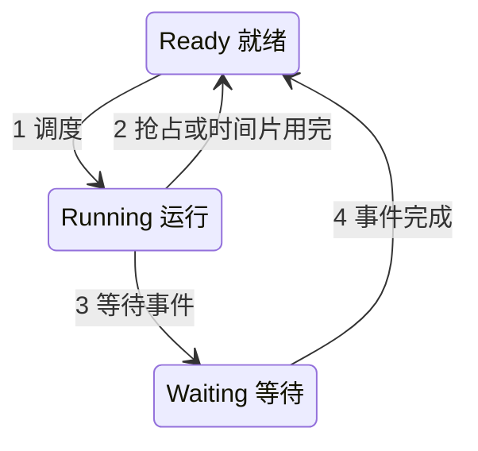
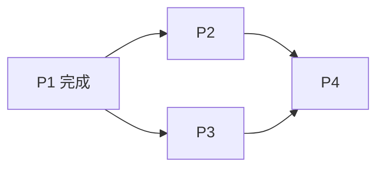
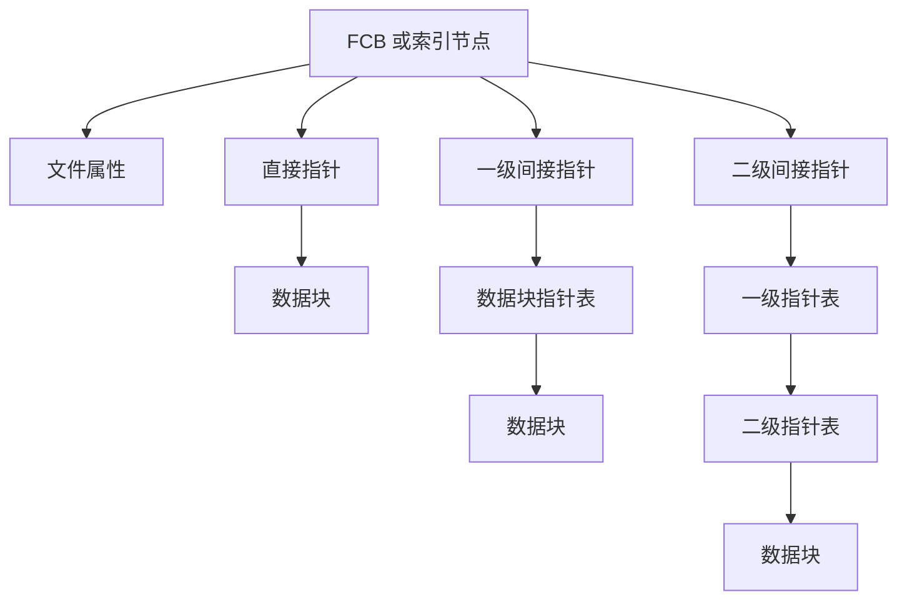
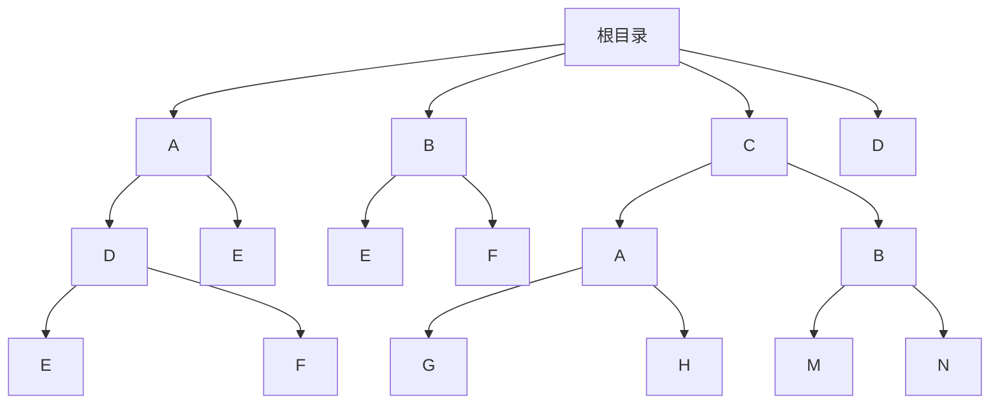

# 操作系统真题合订

> 本文件汇总《操作系统》课程 `真题整理` 文件夹中的全部历年试卷、模拟题与复习资料题目，按笔记章节（第 1～8 章、第 12 章）归类，每一章内再按题型（选择题、填空题、判断题、名词解释、简答题、计算题、综合题）排列。原卷为英文的题目已统一译为中文，题干中的数据、条件、公式与选项内容均完整保留。题干完全一致的重复题合并为一个条目并列全部来源；表述不一致的同名题分别列出。原卷或整理文件附有答案的，使用折叠 Callout 收纳，答案内容忠实保留，未核验的以原文呈现。

## 主要内容

- 按章节组织：第 1 章操作系统引论 / 第 2 章进程的描述与控制 / 第 3 章处理机调度与死锁 / 第 4 章进程同步 / 第 5 章存储器管理 / 第 6 章虚拟存储器 / 第 7 章输入输出系统 / 第 8 章文件管理 / 第 12 章保护和安全  
- 每章内按题型排列：选择题、填空题、判断题、名词解释、简答题、计算题、综合题  
- 每题标注来源试卷（可点击跳转至对应真题文件）  
- 完全一致的重复题合并为一个条目并列全部来源；表述不一致的分列  
- 答案统一使用 `> [!answer]-` 折叠 Callout，默认隐藏

> [!note] 题目归类说明
> 部分综合性题目可能同时涉及多个章节，此处按其主要知识点归入对应章节。同一道题（题干完全一致）在不同试卷中重复出现时，合并为一个条目并列标注全部来源；第 9、10、11 章不在本课程考题范围内（依据 [[操作系统/笔记/考题范围|考题范围]]）。

---

## 一、第 1 章 操作系统引论

### 1. 选择题

> [!note] 版本一 卷面说明
> 原卷第 2 题（选择题，10 分）注明：请将所有答案写在下面的表格中（write all answers in the following table）。

**1.**（来源：[[2016—2017 学年第一学期操作系统原理期末试卷（A 卷）]]）  
下列哪一项不是操作系统的主要任务？__  
A. 进程管理　B. 语言翻译　C. 文件管理　D. 内存管理

**2.**（来源：[[2016—2017 学年第一学期操作系统原理期末试卷（A 卷）]]）  
下列哪种系统具有严格的时间约束？_____  
A. 批处理系统　B. 分时系统　C. 实时系统　D. 交互式系统

**3.**（来源：[[某某年期中试题]]）  
实时操作系统必须在（　）处理来自外部的事件。  
A. 一个机器周期　B. 被控制对象规定时间　C. 周转时间　D. 时间片

**4.**（来源：[[某某年期中试题]]）  
提高单机资源利用率的关键技术是（　）。  
A. 脱机技术　B. 虚拟技术　C. 交换技术　D. 多道程序设计技术

**5.**（来源：[[某某年期中试题]]）  
单处理机系统中可并行的是（　）。  
Ⅰ. 进程与进程　Ⅱ. 处理机与设备　Ⅲ. 处理机与通道　Ⅳ. 设备与设备  
A. Ⅰ、Ⅱ、Ⅲ　B. Ⅰ、Ⅱ、Ⅳ　C. Ⅰ、Ⅲ、Ⅳ　D. Ⅱ、Ⅲ、Ⅳ

---

**6.**（来源：[[2016年秋季操作系统原理期末复习题]]）  
在操作系统的分类中，属于不同分类方法的有（　）。  
A. 多道批处理操作系统　B. 分布式操作系统　C. 分时操作系统　D. 实时操作系统

> [!answer]- 原资料标记
> A 为红字，D 被黄色高亮，标记互相矛盾。

> [!warning] 标注答案待核验
> 原资料声明不公开标准答案；红字/黄色高亮仅为可辨标记，存在单选题多处同时标色等矛盾，不视为标准答案。

**7.**（来源：[[2016年秋季操作系统原理期末复习题]]）  
中断是指（　）。  
A. 操作者要求计算机停止　B. 操作系统停止了计算机运行　C. CPU 对系统中发生的异步事件的响应　D. 操作系统停止了某个进程的运行

> [!answer]- 原资料标记
> C。

**8.**（来源：[[2016年秋季操作系统原理期末复习题]]）  
引入多道程序操作系统的主要目的是（　）。  
A. 使不同程序都可以使用各种资源　B. 提高 CPU 和其他设备的利用率　C. 操作更方便　D. 使串行程序执行时间缩短

> [!answer]- 原资料标记
> B。

**9.**（来源：[[2016年秋季操作系统原理期末复习题]]）  
计算机内存中按（　）编址。  
A. 位　B. 块　C. 字　D. 字节

> [!answer]- 原资料标记
> D。

**10.**（来源：[[2016年秋季操作系统原理期末复习题]]）  
进程中对互斥变量进行操作的代码段称为（　）。  
A. 内存共享　B. 并行性　C. 同步　D. 临界段

> [!answer]- 原资料标记
> D。

**11.**（来源：[[2016年秋季操作系统原理期末复习题]]）  
CPU 在什么时候扫描是否有中断发生？  
A. 开中断语句执行时　B. 每条程序执行结束后　C. 一个进程执行完毕时　D. 每个机器指令周期的最后时刻

> [!answer]- 原资料标记
> A。

**12.**（来源：[[2016年秋季操作系统原理期末复习题]]）  
计算机系统用（　）电路判断中断优先级，以确定响应哪个中断。  
A. 中断扫描　B. 中断屏蔽　C. 中断逻辑　D. 中断寄存器

> [!answer]- 原资料标记
> C。

**13.**（来源：[[2016年秋季操作系统原理期末复习题]]）  
计算机数据总线宽度一般对应计算机的（　）。  
A. 位　B. 块　C. 字长　D. 字节

> [!answer]- 原资料标记
> C。

**14.**（来源：[[2016年秋季操作系统原理期末复习题]]）  
操作系统具有哪些基本功能？  
A. 资源管理　B. 病毒查杀　C. 人机接口　D. 网络连接

> [!answer]- 原资料标记
> A、C。

**15.**（来源：[[2016年秋季操作系统原理期末复习题]]）  
下面哪些软件属于操作系统？  
A. Android　B. Windows XP　C. DOS　D. Linux

> [!answer]- 原资料标记
> 原资料仅高亮题干，未见可靠答案标记。

**16.**（来源：[[2016年秋季操作系统原理期末复习题]]）  
多道程序操作系统具有哪些特性？  
A. 随机性　B. 并行性　C. 可扩充性　D. 共享性

> [!answer]- 原资料标记
> B、D。

**17.**（来源：[[2016年秋季操作系统原理期末复习题]]）  
根据执行程序的性质不同，处理器可分为哪些状态？  
A. 管态　B. 目态　C. 阻塞态　D. 执行态

> [!answer]- 原资料标记
> 原资料高亮全部选项，无法判断其标记含义。

**18.**（来源：[[2017—2018 学年第一学期操作系统期中试卷（版本一）]]、[[2017—2018 学年第一学期操作系统期中试卷（版本二）]]）  
以下陈述中，正确的是 $\underline{A}$。

I. Android 是一种广泛应用于智能手机和平板电脑的操作系统；  
II. Unix 操作系统的一些发行版本可以支持大型主机和服务器；  
III. Windows 和 Linux 操作系统属于开源操作系统；  
IV. 在 Windows 操作系统中，通过任务管理器可以查看系统内并非执行的进程信息，如 CPU 占用率、进程内线程数目、内存占用情况等。

A. I、II 和 IV　B. II 和 III　C. III 和 IV　D. II、III 和 IV

> [!answer]- 原卷答案
>
> A。
> [!warning] 疑点说明
> 选项 IV 中“并非执行”疑为 OCR 误识，应为“正在执行”。

**19.**（来源：[[2017—2018 学年第一学期操作系统期中试卷（版本一）]]）  
（原题号 8 / 23）下列选项中，操作系统提供给应用程序的接口是＿＿。  
A. 系统调用　B. 中断　C. 库函数　D. 原语

（版本一未给出答案。）

**20.**（来源：[[2017—2018 学年第一学期操作系统期中试卷（版本一）]]）  
（原题号 12 / 24）下列选项中，在用户态执行的是＿＿。  
A. 命令解释程序　B. 缺页处理程序　C. 进程调度程序　D. 时钟中断处理程序

（版本一未给出答案。）

**21.**（来源：[[2017—2018 学年第一学期操作系统期中试卷（版本一）]]）  
（原题号 17 / 28）下列选项中，能导致用户进程从用户态切换到内核态的操作是＿＿。  
A. 整数除零　B. 仅 I、II　C. 仅 II、III　D. I、II、III

（版本一未给出答案。）

> [!warning] 疑点说明
> 该题选项 I、II、III 的具体内容在原卷 OCR 中缺失，仅保留可辨识部分，无法恢复完整选项内容。

**22.**（来源：[[2017—2018 学年第一学期操作系统期中试卷（版本一）]]）  
（原题号 18 / 29）计算机开机后，操作系统最终被加载到＿＿。  
A. BIOS　B. ROM　C. EPROM　D. RAM

（版本一未给出答案。）

**23.**（来源：[[2017—2018 学年第一学期操作系统期中试卷（版本一）]]）  
（原题号 20 / 25）下列指令中，不能在用户态下执行的是 $\underline{D}$。  
A. trap　B. 跳转　C. 后栈指令　D. 关中断

> [!answer]- 原卷答案
> D。

**24.**（来源：[[2019—2020 学年第一学期操作系统期中试卷（版本一）]]）  
下列情况的处理过程中，哪一种不会切换到管态（monitor mode）？  
A. 过程调用（procedure calls）　B. 系统调用（system calls）　C. 中断（interrupts）　D. 陷阱（traps）

> [!note] 原卷无答案
> 原卷答案部分该题下划线为空白，未提供答案，此处不补写。

**25.**（来源：[[2019—2020 学年第一学期操作系统期中试卷（版本二）]]）  
中断向量（interrupt vector）的内容是（　）。  
A. 子程序的起始地址（begin address of sub-programs）  
B. 中断处理程序的起始地址（begin addresses of interrupt handling programs）  
C. 中断处理程序起始地址的地址（the address of begin addresses of interrupt handling programs）  
D. 处理程序的起始地址（begin address of handling programs）

> [!answer]- 原卷答案
> 原卷标注：C（其后又附有 B，二者并存）。

> [!warning] 答案待核验
> 原卷标记"C、B"并存，无法确定唯一答案；按常见教材，中断向量内容应为"中断处理程序的起始地址"（选项 B）。此处保留原卷标注供核验。

**26.**（来源：[[2019—2020 学年第一学期操作系统期中试卷（版本三）]]）  
下列哪种处理过程的处理程序不会切换到管态（monitor mode）？  
A. 过程调用　B. 系统调用　C. 中断　D. 陷阱

> [!answer]- 答案
> A. 过程调用

**27.**（来源：[[2020 年操作系统期末模拟试题]]）  
在下列评论中，正确的是_____。  
(1) Android 是一种广泛应用于智能手机和平板电脑的嵌入式操作系统。  
(2) Microsoft Windows Phone 在面向智能手机的操作系统市场份额中排名第一。  
(3) Unix 有一些支持服务器或大型机计算机的发行版本。  
(4) Linux 是一种类型的开源操作系统。  
(5) Windows XP 是采用分层结构的操作系统。  
A. (1) 和 (2)　　B. (2) 和 (3)　　C. (3) 和 (4)　　D. (4) 和 (5)

**28.**（来源：[[2020 年操作系统期末模拟试题]]）  
在启动过程中，当 PC 计算机通电时，CPU 首先执行的代码块是_____。  
A. 操作系统内核　B. BIOS 中的引导程序（bootstrap）　C. 磁盘上的引导块　D. 系统程序

**29.**（来源：[[2020—2021 学年第一学期操作系统期中试卷（版本一）]]）  
(8) 下列情况中的哪些处理过程不会切换到管态（monitor mode）？_____  
A. 陷阱（traps）　B. 中断（interrupts）　C. 过程调用（procedure calls）　D. 系统调用（system calls）

> [!answer]- 原卷答案
> C。

**30.**（来源：[[2020—2021 学年第一学期操作系统期中试卷（版本二）]]）  
1. 以下陈述中，正确的是Ⅱ,Ⅳ  
Ⅰ. Mach 操作系统是由苹果公司开发的、具有微内核架构的操作系统；  
Ⅱ. Unix 是一类分时多用户多任务操作系统，它的一些发行版本可以支持服务器和大型主机系统；  
Ⅲ. Windows 桌面操作系统的发行版本有 Windows XP, Windows 7, Windows 9, and Windows 10；  
Ⅳ. 作为开源操作系统，Linux 具有多种发行版本，可以支持嵌入式设备、个人电脑、服务器、大型主机系统；

> [!answer]- 原卷答案
> Ⅱ、Ⅳ。

**31.**（来源：[[2020—2021 学年第一学期操作系统期中试卷（版本二）]]）  
2. 当我们开机或复位 PC 计算机时，引导（booting）过程开始，CPU 将依次执行几段代码，包括  
Ⅰ. 磁盘上的引导块（boot block）　Ⅱ. BIOS 中的引导程序（bootstrap）　Ⅲ. 操作系统内核（OS kernel）　Ⅳ. 应用程序　Ⅴ. 系统程序  
代码执行的正确顺序是 $\underline{D}$。  
A. Ⅰ, Ⅱ, Ⅲ, Ⅳ, Ⅴ　B. Ⅰ, Ⅱ, Ⅲ, Ⅴ, Ⅳ　C. Ⅱ, Ⅰ, Ⅲ, Ⅳ, Ⅴ　D. Ⅱ, Ⅰ, Ⅲ, Ⅴ, Ⅳ

> [!answer]- 原卷答案
> D。

**32.**（来源：[[2020—2021 学年第一学期操作系统期中试卷（版本二）]]）  
3. 下列选项中，在用户态执行的是 $\underline{D}$。  
A. 时钟中断处理程序　B. 操作系统初始化程序　C. 进程调度程序　D. 编译和链接程序

> [!answer]- 原卷答案
> D。

**33.**（来源：[[2020—2021 学年第一学期操作系统期中试卷（版本二）]]）  
4. 在哪种情况下，从用户态到内核态的切换不会发生？ $\underline{D}$  
A. 整数除零导致的陷阱（trap）　B. 硬件中断（hardware interrupt）　C. read 系统调用　D. 子程序/函数调用，如 sin() 函数调用

> [!answer]- 原卷答案
> D。

**34.**（来源：[[2020—2021 学年第一学期操作系统期中试卷（版本二）]]）  
28. 下列选项中，能导致用户进程从用户态切换到内核态的操作是（b）  
Ⅰ. 整数除零　Ⅱ. sin() 函数调用　Ⅲ. read 系统调用  
A. 仅 Ⅰ、Ⅱ　B. 仅 Ⅰ、Ⅲ　C. 仅 Ⅱ、Ⅲ　D. Ⅰ、Ⅱ、Ⅲ

> [!answer]- 原卷答案
> b（仅 Ⅰ、Ⅲ）。

**35.**（来源：[[2020—2021 学年第一学期操作系统期中试卷（版本二）]]）  
29. 计算机开机后，操作系统最终被加载到 $\underline{\text{（d）}}$  
A. BIOS　B. ROM　C. EPROM　D. RAM

> [!answer]- 原卷答案
> d（RAM）。

**36.**（来源：[[2020—2021 学年第一学期操作系统期中试卷（版本二）]]）  
【14:3】25. 下列指令中，不能在用户态下执行的是 $\underline{d}$  
A. trap　B. 跳转　C. 后栈指令　D. 关中断

> [!answer]- 原卷答案
> d（关中断）。

> [!warning] 疑点说明
> 选项 C“后栈指令”疑为 OCR 误识，原题可能为“压栈指令”一类与栈操作相关的指令，原样保留供核验。

**37.**（来源：[[2020—2021 学年第一学期操作系统期中试卷（版本二）]]）  
【17:2】24. 执行系统调用的过程包括如下主要操作：  
①返回用户态　②执行陷入(trap)指令　③传递系统调用参数　④执行相应的服务程序  
正确的执行顺序是 C  
A. ②→③→①→④　B. ②→④→③→①　C. ③→②→④→①　D. ③→④→②→①

> [!answer]- 原卷答案
> C（③→②→④→①）。

**38.**（来源：[[2020—2021 学年第一学期操作系统期中试卷（版本二）]]）  
【18:2】23. 下列关于多任务操作系统的叙述中，正确的是 C  
Ⅰ. 具有并发和并行的特点　Ⅱ. 需要实现对共享资源的保护　Ⅲ. 需要运行在多 CPU 的硬件平台上  
A. 仅 Ⅰ　B. 仅 Ⅱ　C. 仅 Ⅰ、Ⅱ　D. Ⅰ、Ⅱ、Ⅲ

> [!answer]- 原卷答案
> C（仅 Ⅰ、Ⅱ）。

**39.**（来源：[[2020—2021 学年第一学期操作系统期中试卷（版本二）]]）  
【19:3】25. 下列关于系统调用的叙述中，正确的是 Ⅰ, Ⅱ, Ⅳ  
Ⅰ. 在执行系统调用服务程序的过程中，CPU 处于内核态  
Ⅱ. 操作系统通过系统调用避免用户程序直接访问外设  
Ⅲ. 不同的操作系统为应用程序提供了统一的系统调研接口  
Ⅳ. 系统调用是操作系统内核为应用程序提供服务的接口

> [!answer]- 原卷答案
> Ⅰ、Ⅱ、Ⅳ。

> [!warning] 疑点说明
> 陈述 Ⅲ 中“系统调研接口”疑为 OCR 误识，应为“系统调用接口”；该陈述因“不同的操作系统提供统一接口”并不成立而属错误陈述，保留原卷文字。

**40.**（来源：[[2020—2021 学年第一学期操作系统期中试卷（版本三）]]、[[2020—2021 学年第一学期操作系统期中试卷（版本四）]]）  
以下陈述中，正确的是 ____。

I. Mach 操作系统是由苹果公司开发的、具有微内核架构的操作系统；

II. Unix 是一类分时多用户多任务操作系统，它的一些发行版本可以支持服务器和大型主机系统；

III. Windows 桌面操作系统的发行版本有 Windows XP, Windows 7, Windows 9, and Windows 10;

IV. 作为开源操作系统，Linux 具有多种发行版本，可以支持嵌入式设备、个人电脑、服务器、大型主机系统。

> [!answer]- 原卷答案
>
> Ⅱ、Ⅳ

**41.**（来源：[[2020—2021 学年第一学期操作系统期中试卷（版本三）]]、[[2020—2021 学年第一学期操作系统期中试卷（版本四）]]）  
当我们启动或重置 PC 计算机时，启动过程开始，CPU 将依次执行几段代码，包括

I. 磁盘上的引导块　II. BIOS 中的引导程序　III. OS 内核

IV. 应用程序　V. 系统程序

代码执行的正确顺序是 ____。

A. I, II, III, IV, V　B. I, II, III, V, IV

C. II, I, III, IV, V

D. II, I, III, V, IV

> [!answer]- 原卷答案
>
> D

**42.**（来源：[[2020—2021 学年第一学期操作系统期中试卷（版本三）]]、[[2020—2021 学年第一学期操作系统期中试卷（版本四）]]）  
下列选项中，在用户态执行的是 ____。

A. 时钟中断处理程序　B. 操作系统初始化程序

C. 进程调度程序　D. 编译和链接程序

> [!answer]- 原卷答案
>
> D

**43.**（来源：[[2020—2021 学年第一学期操作系统期中试卷（版本三）]]、[[2020—2021 学年第一学期操作系统期中试卷（版本四）]]）  
在哪种情况下，不会发生从用户态到内核态的切换？____

A. 整数除零导致的 trap　B. 硬件 interrupt

C. read 系统调用　D. 子程序/函数调用，如 sin() 函数调用

> [!answer]- 原卷答案
>
> D

**44.**（来源：[[2020—2021 学年第一学期操作系统期中试卷（版本三）]]、[[2020—2021 学年第一学期操作系统期中试卷（版本四）]]）  
下列选项中，能导致用户进程从用户态切换到内核态的操作是 ____。

Ⅰ. 整数除零　Ⅱ. sin() 函数调用　Ⅲ. read 系统调用

A. 仅 I、II　B. 仅 I、III　C. 仅 II、III　D. I、II、III

> [!answer]- 原卷答案
>
> b（仅 I、III）

**45.**（来源：[[2020—2021 学年第一学期操作系统期中试卷（版本三）]]、[[2020—2021 学年第一学期操作系统期中试卷（版本四）]]）  
计算机开机后，操作系统最终被加载到 ____。

A. BIOS　B. ROM　C. EPROM　D. RAM

> [!answer]- 原卷答案
>
> （d）→ D. RAM

**46.**（来源：[[2020—2021 学年第一学期操作系统期中试卷（版本三）]]、[[2020—2021 学年第一学期操作系统期中试卷（版本四）]]）  
下列指令中，不能在用户态下执行的是 ____。

A. trap　B. 跳转　C. 后栈指令　D. 关中断

> [!answer]- 原卷答案
>
> d → D. 关中断

**47.**（来源：[[2020—2021 学年第一学期操作系统期中试卷（版本三）]]、[[2020—2021 学年第一学期操作系统期中试卷（版本四）]]）  
执行系统调用的过程包括如下主要操作：

①返回用户态　②执行陷入(trap)指令　③传递系统调用参数　④执行相应的服务程序

正确的执行顺序是 ____。

A. ②→③→①→④　B. ②→④→③→①

C. ③→②→④→①　D. ③→④→②→①

> [!answer]- 原卷答案
>
> C

**48.**（来源：[[2020—2021 学年第一学期操作系统期中试卷（版本三）]]、[[2020—2021 学年第一学期操作系统期中试卷（版本四）]]）  
下列关于多任务操作系统的叙述中，正确的是 ____。

Ⅰ. 具有并发和并行的特点

Ⅱ. 需要实现对共享资源的保护

Ⅲ. 需要运行在多 CPU 的硬件平台上

A. 仅 I　B. 仅 II　C. 仅 I、II　D. I、II、III

> [!answer]- 原卷答案
>
> C

**49.**（来源：[[2020—2021 学年第一学期操作系统期中试卷（版本三）]]）  
下列关于系统调用的叙述中，正确的是 ____。

I. 在执行系统调用服务程序的过程中，CPU 处于内核态

II. 操作系统通过系统调用避免用户程序直接访问外设

III. 不同的操作系统为应用程序提供了统一的系统调研接口

IV. 系统调用是操作系统内核为应用程序提供服务的接口

> [!warning] 疑点说明
> 原卷选项 III 中"系统调研接口"疑为"系统调用接口"的 OCR 笔误，按原样保留。

> [!answer]- 原卷答案
> I, II, IV

**50.**（来源：[[2020—2021 学年第一学期操作系统期中试卷（版本四）]]）  
下列关于系统调用的叙述中，正确的是 ____。

I. 在执行系统调用服务程序的过程中，CPU 处于内核态

II. 操作系统通过系统调用避免用户程序直接访问外设

III. 不同的操作系统为应用程序提供了统一的系统调用接口

IV. 系统调用是操作系统内核为应用程序提供服务的接口

> [!answer]- 原卷答案
> I, II, IV

**51.**（来源：[[2021—2022 学年第一学期操作系统期中试卷]]）  
中断向量的内容是 ____。

A. 子程序的起始地址

B. 中断处理程序的起始地址

C. 中断处理程序起始地址的地址

D. 处理程序的起始地址

**52.**（来源：[[2022—2023 学年第一学期操作系统期中试卷（版本二）]]）  
下列哪种说法是正确的？___  
A. 用户模式下可以执行的指令比内核模式下更多  
B. 我们可以通过软件中断陷阱（software interrupt trap）从用户模式切换到内核模式  
C. 双模式（dual mode）可以防止进程进入死循环状态  
D. 特权指令是指可以被用户模式进程使用的指令

> [!answer]- 原卷标注
> B。

**53.**（来源：[[2022—2023 学年第一学期操作系统期中试卷（版本二）]]）  
下列哪种系统具有严格的时间约束？___  
A. 分布式系统　B. 分时系统  
C. 实时系统　D. 交互式系统

> [!answer]- 原卷标注
> C。

**54.**（来源：[[2022—2023 学年第一学期操作系统期中试卷（版本二）]]）  
现代操作系统是_____驱动的。如果没有进程需要执行、没有 I/O 设备需要服务、没有用户需要响应，操作系统将安静地坐在那里，等待某种事情的发生。  
A. 用户　B. 中断　C. 设备　D. 硬件

> [!answer]- 原卷标注
> B。

**55.**（来源：[[2022—2023 学年第一学期操作系统期中试卷（版本二）]]）  
操作系统使用中断机制来处理下列事件，除了 ___。  
A. I/O 完成　B. 除以零  
C. 虚拟内存分页（virtual memory paging）　D. 调用一个过程（calling a procedure）

> [!answer]- 原卷标注
> D。

**56.**（来源：[[2022—2023 学年第一学期操作系统期中试卷（版本二）]]）  
下列哪种情况的处理过程不会切换到内核模式？____  
A. 过程调用（procedure calls）　B. 系统调用（system calls）　C. 中断（interrupts）　D. 陷阱（traps）

> [!answer]- 原卷标注
> A。

---

**57.**（来源：[[os23-24]]）  
OS 的不确定性是指（　）。  
A. 程序的运行次序不确定　B. 程序多次运行的时间不确定　C. 程序的运行结果不确定　D. A、B 和 C

> [!answer]- 原卷答案
> D。

**58.**（来源：[[2025—2026 学年第二学期操作系统原理期末试题（软件学院）]]）  
为访问操作系统服务，所需的接口由（　）提供。  
A. 系统调用　B. 应用程序接口（API）　C. 库　D. 汇编指令

### 2. 填空题

> [!note] 卷面说明
> 两卷“Fill in blanks”均注明：要求填入英文答案，中文答案扣 0.5 分。

> [!note] 原卷说明
> 版本一、版本二原卷第一题（FILL IN BLANKS）均注明须用英文应答，中文答对得一半分。该部分填空题在合订中按知识点分入各章，每题原卷均给出英文答案，此处并列给出中文译名。

> [!note] 原卷作答要求（来源：[[2019—2020 学年第一学期操作系统期中试卷（版本三）]]）
> 填空题要求用英文应答，中文答对得一半分。

> [!note] 版本一 卷面说明
> 原卷第 1 题（填空，10 分）须用英文应答，中文答对得一半分。
>
> 版本二 卷面说明：原卷“一、Fill in blanks（12 分）”注明要求填入英文答案，中文答案扣 0.5 分。

> [!note] 原卷说明
> 原卷本大题为 "Fill in blanks"（12 分），要求填入英文答案，中文答案扣 0.5 分。

**1.**（来源：[[2016—2017 学年第一学期操作系统原理期末试卷（A 卷）]]）  
分时计算机系统采用_____调度方案和多道程序设计，为每个用户提供一小部分 CPU 时间。

**2.**（来源：[[2016—2017 学年第一学期操作系统原理期末试卷（A 卷）]]）  
为了防止用户执行非法 I/O，我们把所有 I/O 指令定义为_____指令，这些指令只能在管态（monitor mode）下执行。

**3.**（来源：[[2016—2017 学年第一学期操作系统原理期末试卷（A 卷）]]）  
从操作系统接口的角度考虑，应用程序可以利用_____来获得操作系统提供的服务。

**4.**（来源：[[2016—2017 学年第一学期操作系统原理期末试卷（A 卷）]]）  
如果一个系统能在 400ms 内处理 3 个实时进程、5 个交互进程和 2 个批处理进程，那么该系统的吞吐量（throughput）是_____。

**5.**（来源：[[某某年期中试题]]）  
在计算机系统上配置操作系统的目标是〔扫描缺失〕、〔扫描缺失〕、可扩充性、开放性。

> [!warning] 源文件残缺
> 原卷两个空缺处为扫描损坏，无法可靠辨识，原文以〔扫描缺失〕标明。

---

**6.**（来源：[[2017-2018操作系统期末]]）  
在引入了程序间的并发功能后，由于它们共享系统资源，并发执行程序带来了间断性、（　）和（　）新特征。

> [!answer]- 原卷答案
> 失去封闭性；不可再现性。

**7.**（来源：[[2017—2018 学年第一学期操作系统期中试卷（版本一）]]、[[2017—2018 学年第一学期操作系统期中试卷（版本二）]]）  
当计算机通电时，通过装入操作系统内核来启动计算机的过程被称为 $\underline{\text{booting}}$（引导）系统。（原卷填空第 1 题）

> [!answer]- 原卷答案
>
> booting（引导）。

**8.**（来源：[[2017—2018 学年第一学期操作系统期中试卷（版本一）]]）  
允许用户以交互方式使用计算机的操作系统被称为 time-spared 分时操作系统（time-spared time-sharing operating systems）。（原卷填空第 2 题）

> [!answer]- 原卷答案
> time-sharing operating systems（分时操作系统）。

> [!warning] 疑点说明
> 版本一该题原文为“time-spared time-sharing operating systems”，其中“time-spared”疑为 OCR 误识，应为“time-sharing”；版本二对应题（填空第 2 题）填写答案为 $\underline{\text{time-sharing}}$ $\underline{\text{operating systems}}$。

**9.**（来源：[[2017—2018 学年第一学期操作系统期中试卷（版本一）]]、[[2017—2018 学年第一学期操作系统期中试卷（版本二）]]）  
由错误或用户程序请求操作系统提供服务所引发的、由软件生成的中断，被称为 $\underline{\text{trap}}$。（原卷填空第 3 题）

> [!answer]- 原卷答案
>
> trap（陷阱/自陷）。

**10.**（来源：[[2017—2018 学年第一学期操作系统期中试卷（版本一）]]）  
为了保护操作系统以及所有其他程序及其数据免受故障程序的影响，需要硬件保护。处理机提供两种不同的运行模式，即 ___kernel___ 模式和用户模式。（原卷填空第 5 题，原卷该题编号写作“S)”）

> [!answer]- 原卷答案
> kernel（内核/核心态模式）。

**11.**（来源：[[2017—2018 学年第一学期操作系统期中试卷（版本一）]]、[[2017—2018 学年第一学期操作系统期中试卷（版本二）]]）  
$\underline{\text{Real-time system}}$ 是能够在事件变得过时之前的有限时间间隔内对外部事件作出反应的计算机和/或软件系统。（原卷填空第 8 题）

> [!answer]- 原卷答案
>
> Real-time system（实时系统）。

**12.**（来源：[[2017—2018 学年第一学期操作系统期中试卷（版本二）]]）  
允许用户以交互方式使用计算机的操作系统被称为 $\underline{\text{time-sharing}}$ $\underline{\text{operating systems}}$（分时操作系统）。（原卷填空第 2 题）

> [!answer]- 原卷答案
> time-sharing operating systems（分时操作系统）。

**13.**（来源：[[2017—2018 学年第一学期操作系统期中试卷（版本二）]]）  
为了保护操作系统以及所有其他程序及其数据免受故障程序的影响，需要硬件保护。处理机提供两种不同的运行模式，即 $\underline{\text{kernel/supervised/privileged/monitored}}$ 模式和用户模式。（原卷填空第 5 题）

> [!answer]- 原卷答案
> kernel / supervised / privileged / monitored（内核/监督/特权/监控模式）。

**14.**（来源：[[2019—2020 学年第一学期操作系统期中试卷（版本一）]]）  
现代操作系统由___驱动。

> [!answer]- 原卷答案
> interrupt（中断）。

**15.**（来源：[[2019—2020 学年第一学期操作系统期中试卷（版本一）]]）  
如果在用户态（user mode）下试图执行一条特权指令（privileged instruction），硬件将不执行该指令，而是将其视为非法指令并陷入（trap）到___。

> [!answer]- 原卷答案
> operating system（操作系统）。

**16.**（来源：[[2019—2020 学年第一学期操作系统期中试卷（版本一）]]、[[2019—2020 学年第一学期操作系统期中试卷（版本三）]]）  
就操作系统接口而言，应用程序可以利用___来获取操作系统提供的服务。

> [!answer]- 原卷答案
>
> system calls（系统调用）。
>
> 系统调用（system calls）

**17.**（来源：[[2019—2020 学年第一学期操作系统期中试卷（版本一）]]）  
向操作系统传递参数的三种通用方法是___、内存块（memory block）和栈（stack）。

> [!answer]- 原卷答案
> registers（寄存器）。

**18.**（来源：[[2019—2020 学年第一学期操作系统期中试卷（版本一）]]）  
当 CPU 执行操作系统的指令时，称 CPU 处于___模式。

> [!answer]- 原卷答案
> kernel / system / supervisor / privileged 模式（内核／系统／管态／特权模式）。

**19.**（来源：[[2019—2020 学年第一学期操作系统期中试卷（版本二）]]）  
操作系统提供的编程接口（programming interface）是___。

> [!answer]- 原卷答案
> system call（系统调用）。

**20.**（来源：[[2019—2020 学年第一学期操作系统期中试卷（版本二）]]）  
操作系统的两种执行模式是用户态（user mode）和___态。

> [!answer]- 原卷答案
> kernel（内核）态。

**21.**（来源：[[2019—2020 学年第一学期操作系统期中试卷（版本二）]]）  
中断是由外围设备（例如 I/O 设备）产生的信号。___ ___向量（vector）包含所有中断服务例程的地址。

> [!answer]- 原卷答案
> 原卷在下划线处标注：PCB、Intemuz。

> [!warning] 疑点说明
> 原卷此句 OCR 疑有损伤："Intemuz" 疑为 "Interrupt" 的误识别；"PCB 向量"的表述与常见教材不符（按常见教材应为"中断向量 interrupt vector"）。无法可靠核验其原意，故原样保留。

---

**22.**（来源：[[2019—2020 学年第一学期操作系统期中试卷（版本三）]]）  
现代操作系统是由________驱动的。

> [!answer]- 答案
> 中断（interrupt）

**23.**（来源：[[2019—2020 学年第一学期操作系统期中试卷（版本三）]]）  
如果在用户态下尝试执行一条特权指令，硬件不会执行该指令，而是将其视为非法指令并陷入________。

> [!answer]- 答案
> 操作系统（operating system）

**24.**（来源：[[2019—2020 学年第一学期操作系统期中试卷（版本三）]]）  
向操作系统传递参数的三种常用方法是________、内存块和栈。

> [!answer]- 答案
> 寄存器（registers）

**25.**（来源：[[2019—2020 学年第一学期操作系统期中试卷（版本三）]]）  
当 CPU 执行操作系统指令时，称 CPU 处于________模式。

> [!answer]- 答案
> 内核／系统／监督／特权（kernel / system / supervisor / privileged）模式

**26.**（来源：[[2020-2021期末]]）  
在单处理机系统中，假设在 1 秒的时间间隔内宏观上有四道程序在同时运行，但微观上程序分时交替执行，这种特性称为________（并行性或并发性）。

---

**27.**（来源：[[2020—2021 学年第一学期操作系统期中试卷（版本一）]]）  
(1) 现代操作系统是由___驱动的。（Modern operating system is driven by ___.）

> [!answer]- 原卷答案
> interrupt（中断）。

**28.**（来源：[[2020—2021 学年第一学期操作系统期中试卷（版本一）]]）  
(2) ___是由错误或由用户程序要求操作系统提供服务而发出的特定请求所引起的一种软件生成的中断。（A ___ is a software-generated interrupt caused either by an error or by a specific request from a user program that an operating system service be performed.）

> [!answer]- 原卷答案
> trap（陷阱/陷入）。

**29.**（来源：[[2020—2021 学年第一学期操作系统期中试卷（版本一）]]）  
(3) 考虑到操作系统接口，应用程序可以利用_____来获得操作系统所提供的服务。（Considering OS interfaces, an application program can utilize _____ to acquire services provided by the OS.）

> [!answer]- 原卷答案
> system calls（系统调用）。

**30.**（来源：[[2020—2021 学年第一学期操作系统期中试卷（版本一）]]）  
(4) 只能由操作系统执行的指令称为___指令。（The instruction that can only be executed by Operating System is called ___ instruction.）

> [!answer]- 原卷答案
> privilege（特权指令）。

**31.**（来源：[[2020—2021 学年第一学期操作系统期中试卷（版本一）]]）  
(7) 当 CPU 执行操作系统指令时，称 CPU 处于___模式。（When CPU executes the instructions of operating systems, it is said that CPU is in ___ mode.）

> [!answer]- 原卷答案
> kernel / system / supervisor / privileged（内核/系统/管态/特权模式）。

**32.**（来源：[[2020—2021 学年第一学期操作系统期中试卷（版本二）]]）  
1. 允许用户以交互方式使用计算机的操作系统称为 $\underline{\text{time-sharing}}$ 操作系统。（The operating systems that allow users to use computers in interactive manners are called the time-sharing operating systems.）

> [!answer]- 原卷答案
> time-sharing（分时）。

**33.**（来源：[[2020—2021 学年第一学期操作系统期中试卷（版本二）]]）  
2. 由错误或用户程序要求操作系统提供服务而发出的特定请求所引起的一种软件生成的中断称为 $\underline{\text{trap}}$。（A software-generated interrupt caused either by an error or by specific requests from user programs that an operating-system service be performed is called a trap.）

> [!answer]- 原卷答案
> trap（陷阱/陷入）。

**34.**（来源：[[2020—2021 学年第一学期操作系统期中试卷（版本二）]]）  
3. 当计算机开机时，通过装入操作系统内核来启动计算机的过程称为 $\underline{\text{booting}}$ 系统。（When a computer is powered on, the procedure of starting the computer by loading the OS kernel is known as booting the system.）

> [!answer]- 原卷答案
> booting（引导）。

**35.**（来源：[[2020—2021 学年第一学期操作系统期中试卷（版本二）]]）  
4. $\underline{\text{Real-time}}$ 系统是这样一类计算机和/或软件系统：在外部事件变得过时之前，于限定的时间间隔内对其作出反应。（Real-time systems are computers and/or software systems that react to external events in limited time intervals before the events become obsolete.）

> [!answer]- 原卷答案
> Real-time（实时）。

**36.**（来源：[[2020—2021 学年第一学期操作系统期中试卷（版本二）]]）  
5. 操作系统提供的编程接口称为 $\underline{\text{system calls}}$，供系统程序或应用程序用来获取操作系统提供的服务。（The programming interface provided by operating systems system are called system calls, used by the system or application programs to acquire services provided by OS.）

> [!answer]- 原卷答案
> system calls（系统调用）。

**37.**（来源：[[2020—2021 学年第一学期操作系统期中试卷（版本二）]]）  
7. 为了保护操作系统以及所有其他程序及其数据不受任何故障程序的影响，需要硬件保护。CPU 提供两种独立的操作模式，即 $\underline{\text{kernel/supervised/privileged/monitored}}$ 模式与用户模式。（To protect the OS and all other programs and their data from any malfunctioning program, hardware protection is needed. Two separate modes of CPU operations, that is the kernel/supervised/privileged/monitored mode and the user mode, are provided.）

> [!answer]- 原卷答案
> kernel/supervised/privileged/monitored（内核/系统/特权/监督模式）。

**38.**（来源：[[2020—2021 学年第一学期操作系统期中试卷（版本二）]]）  
10. $\underline{\text{multiprogramming}}$ 被定义为主存中的进程数。（Degree of multiprogramming is defined as the number of process in (main) memory.）

> [!answer]- 原卷答案
> multiprogramming（多道程序度）。

---

**39.**（来源：[[2020—2021 学年第一学期操作系统期中试卷（版本三）]]、[[2020—2021 学年第一学期操作系统期中试卷（版本四）]]）  
允许用户以交互方式使用计算机的操作系统被称为 ____ 操作系统。

> [!answer]- 原卷答案
>
> time-sharing（分时）

**40.**（来源：[[2020—2021 学年第一学期操作系统期中试卷（版本三）]]、[[2020—2021 学年第一学期操作系统期中试卷（版本四）]]）  
由软件产生的、由错误或用户程序请求操作系统服务的特定请求所引起的中断称为 ____。

> [!answer]- 原卷答案
>
> trap（自陷/陷入）

**41.**（来源：[[2020—2021 学年第一学期操作系统期中试卷（版本三）]]、[[2020—2021 学年第一学期操作系统期中试卷（版本四）]]）  
当计算机通电时，通过加载 OS 内核来启动计算机的过程称为 ____ 系统。

> [!answer]- 原卷答案
>
> booting（引导/启动）

**42.**（来源：[[2020—2021 学年第一学期操作系统期中试卷（版本三）]]、[[2020—2021 学年第一学期操作系统期中试卷（版本四）]]）  
____ 系统是指能够在外部事件过时之前的有限时间间隔内对其做出反应的计算机和/或软件系统。

> [!answer]- 原卷答案
>
> Real-time（实时）

**43.**（来源：[[2020—2021 学年第一学期操作系统期中试卷（版本三）]]、[[2020—2021 学年第一学期操作系统期中试卷（版本四）]]）  
操作系统提供的编程接口称为 ____，供系统或应用程序获取操作系统提供的服务。

> [!answer]- 原卷答案
>
> system calls（系统调用）

**44.**（来源：[[2020—2021 学年第一学期操作系统期中试卷（版本三）]]、[[2020—2021 学年第一学期操作系统期中试卷（版本四）]]）  
为了保护操作系统及所有其他程序及其数据免受任何故障程序的破坏，需要硬件保护。提供两种独立的 CPU 操作模式，即 ____ 模式和用户模式。

> [!answer]- 原卷答案
>
> kernel/supervised/privileged/monitored（内核/管态/特权/监控）

**45.**（来源：[[2020—2021 学年第一学期操作系统期中试卷（版本三）]]、[[2020—2021 学年第一学期操作系统期中试卷（版本四）]]）  
____ 度定义为（主存）中进程的数量。

> [!answer]- 原卷答案
>
> multiprogramming（多道程序）

### 3. 判断题

**1.**（来源：[[某某年期中试题]]）  
计算机系统中判断是否有中断发生，是在由用户态转入核心态时。（　）

> [!warning] 源文件未保留可辨识答案
> 某某年期中试题判断题原卷未保留可辨识答案。

---

**2.**（来源：[[2016年秋季操作系统原理期末复习题]]）  
计算机系统中，信息在主存中的最小单位是字节。（　）

> [!answer]- 原资料标记
> 错误。

**3.**（来源：[[2017-2018操作系统期末]]）  
程序开发时由编译链接器对目标代码进行的链接称为静态链接。（　）

> [!answer]- 原卷作答
> √。

---

**4.**（来源：[[os23-24]]）  
操作系统的所有程序都必须常驻内存。（　）

> [!answer]- 原卷答案
> 错。

**5.**（来源：[[os23-24]]）  
每当中断处理完成后，都将返回被中断进程被中断处继续执行。（　）

> [!answer]- 原卷答案
> 对。

---

**6.**（来源：[[2025—2026 学年第二学期操作系统原理期末试题（软件学院）]]）  
网络连接故障会由操作系统处理。

**7.**（来源：[[2025—2026 学年第二学期操作系统原理期末试题（软件学院）]]）  
多道程序程度（degree）是指内存中的进程数。

### 5. 简答题

**1.**（来源：[[2016年秋季操作系统原理期末复习题]]）  
简述现代操作系统的主要特点。

> [!answer]- 原资料答案
> 1. 微内核结构
> 2. 多线程机制
> 3. 对称多处理器机制（SMP）
> 4. 分布式操作系统
> 5. 面向对象技术

---

**2.**（来源：[[OS-2020期中含答案]]）  
作为操作系统的基础特征之一，比较并发和并行概念间的差异，并分别针对单处理机系统和多处理机系统解释多道程序环境下的执行情况。

> [!answer]- 答案
> 1. 并行性：两个或多个事件在同一时刻发生。（1 分）
> 2. 并发性：两个或多个事件在同一时间间隔内发生。（1 分）
> 3. 单处理机系统：多道程序环境下，宏观上多个程序同时运行；微观上每一时刻只有一道程序执行。（2 分）
> 4. 多处理机系统：多道程序环境下，程序的并发和并行都有可能。（2 分）

> [!warning] 来源表述疑点
> 原 PDF 在单处理机"微观上"之后写作"不能并发"，与前文概念可能矛盾；这里保留其可辨识的事实描述，不替来源静默修正。

**3.**（来源：[[OS-2020期中含答案]]）  
请简述采用微内核的基本功能。

> [!answer]- 答案
> 所谓微内核技术，是指精心设计的、能实现现代 OS 核心功能的小型内核。它比一般 OS 程序更小、更精炼，不仅运行在核心态，而且开机后常驻内存，不会因内存紧张而被换出内存。
>
> 微内核的基本功能包括：
>
> 1. 进程管理
> 2. 存储器管理
> 3. 进程通信管理
> 4. I/O 设备管理
>
> 每项 1.5 分。

---

**4.**（来源：[[操作系统重点知识点总结]]）  
什么是操作系统？

> [!answer]- 参考答案与解析
> 操作系统是配置在计算机硬件上的第一层软件，是对硬件系统的首次扩充。（原资料中“带第一层软件”疑为“的第一层软件”的错别字）

**5.**（来源：[[操作系统重点知识点总结]]）  
操作系统的作用？

> [!answer]- 参考答案与解析
> OS 作为用户与计算机硬件系统之间的接口、OS 作为计算机系统资源的管理者、OS 实现了对计算机资源的抽象。（原资料中“带接口”“带管理者”“带抽象”疑为“的接口”“的管理者”“的抽象”的错别字）

**6.**（来源：[[操作系统重点知识点总结]]）  
操作系统的目标？

> [!answer]- 参考答案与解析
> 有效性、方便性、可扩充性、开放性。

**7.**（来源：[[操作系统重点知识点总结]]）  
操作系统的基本特征有哪些？其中最重要的是什么？

> [!answer]- 参考答案与解析
> 并发性、共享性、虚拟性、异步性。其中最重要的特征是并发性。

**8.**（来源：[[操作系统重点知识点总结]]）  
操作系统的主要功能有哪些？

> [!answer]- 参考答案与解析
> 处理机管理、存储器管理、设备管理、文件管理、用户接口。

---

### 7. 综合题

**1.**（来源：[[某某年期中试题]]）  
（综合应用题，15 分）一个多道批处理系统中仅有 $P1$ 和 $P2$ 两个作业，$P2$ 比 $P1$ 晚 10 ms 到达，其计算和 I/O 操作顺序如下：  
- $P1$：计算 60 ms，I/O 80 ms，计算 20 ms。  
- $P2$：计算 120 ms，I/O 20 ms，计算 30 ms。

不考虑调度和切换时间，计算完成两个作业需要的最少时间，并给出相应图示说明。

---

## 二、第 2 章 进程的描述与控制

### 1. 选择题

**1.**（来源：[[某某年期中试题]]）  
进程的基本状态中，（　）可以由其他两种基本状态转变而来。  
A. 新建状态　B. 就绪状态　C. 阻塞状态　D. 执行状态

---

**2.**（来源：[[2016年秋季操作系统原理期末复习题]]）  
一个作业的进程处于阻塞状态，这时该作业处于（　）。  
A. 提交状态　B. 后备状态　C. 运行状态　D. 完成状态

> [!answer]- 原资料标记
> C。

**3.**（来源：[[2016年秋季操作系统原理期末复习题]]）  
关于进程概念，下面说法不对的是（　）。  
A. 进程是程序的一次执行　B. 进程是动态的　C. 一个程序对应一个进程　D. 进程有生命周期

> [!answer]- 原资料标记
> C。

**4.**（来源：[[2016年秋季操作系统原理期末复习题]]）  
进程间接通信中，端口代表（　）。  
A. 进程　B. 计算机中的不同网卡　C. 服务器　D. 计算机终端在网络中的位置

> [!answer]- 原资料标记
> A。

**5.**（来源：[[2016年秋季操作系统原理期末复习题]]）  
在任务管理器中结束一个进程，实际是（　）。  
A. 修改进程状态　B. 撤销进程控制块　C. 修改进程优先级　D. 进程控制块进入阻塞队列

> [!answer]- 原资料标记
> B。

**6.**（来源：[[2016年秋季操作系统原理期末复习题]]）  
进程的基本状态有哪些？  
A. 运行态　B. 阻塞态　C. 就绪态　D. 完成态

> [!answer]- 原资料标记
> A、B、C。

**7.**（来源：[[2017-2018操作系统期末]]）  
进程和程序的本质区别是（　）。  
A. 存储在内存和外存　B. 顺序和非顺序执行机器指令　C. 分时使用和独占使用计算机资源　D. 动态和静态特征

> [!answer]- 原卷答案
> D。

**8.**（来源：[[2017-2018操作系统期末]]）  
下列进程状态的转换中，不正确的是（　）。  
A. 就绪到运行　B. 运行到就绪　C. 就绪到阻塞　D. 阻塞到就绪

> [!answer]- 原卷答案
> C。

**9.**（来源：[[2017-2018操作系统期末]]）  
作业有三种状态，下面不是作业状态的是（　）。  
A. 后备状态　B. 阻塞状态　C. 运行状态　D. 完成状态

> [!answer]- 原卷答案
> B。

**10.**（来源：[[2017—2018 学年第一学期操作系统期中试卷（版本一）]]）  
下列关于进程与线程的评论中：

I. 在系统中，进程的状态可以从 waiting（等待）迁移到 running（运行）。  
II. PCB 包含 $\underline{\text{process state}}$（进程状态）、程序计数器、$\underline{\text{CPU registers}}$（CPU 寄存器）和 $\underline{\text{user data}}$（用户数据）。  
III. 在操作系统支持 $\underline{\text{kernel-level}}$（内核级）线程的系统中，线程是 CPU 调度的基本单位，进程是资源分配的基本单位。  
IV. 由一个进程创建的多个线程，可以共享该进程中打开的文件。

A. I 和 II　B. III 和 IV　C. I 和 IV　D. II 和 III

（版本一未给出答案。）

> [!note] 图像转写说明
> 原卷在选项 III 之后含手写标注 1（批改痕迹），无可可靠恢复的独立答案信息。

**11.**（来源：[[2017—2018 学年第一学期操作系统期中试卷（版本一）]]）  
（原题号 9 / 24）下列选项中，导致创建新进程的操作是 $\underline{C}$。

I. 用户成功登陆  
II. 设备分配  
III. 启动程序执行

A. 仅 I、II　B. 仅 II、III　C. 仅 I、III　D. 仅 I、II、III

> [!answer]- 原卷答案
> C。

**12.**（来源：[[2017—2018 学年第一学期操作系统期中试卷（版本一）]]）  
（原题号 13 / 25）在支持多线程的系统中，进程 P 创建的若干个线程不能共享的是 $\underline{D}$。  
A. 进程 P 的代码段　B. 进程 P 中打开的文件　C. 进程 P 的全局变量　D. 进程 P 中某线程的栈指针

> [!answer]- 原卷答案
> D。

**13.**（来源：[[2017—2018 学年第一学期操作系统期中试卷（版本一）]]）  
（原题号 16 / 31）下列关于进程和线程的叙述中，正确的是＿＿。  
A. 不管系统是否支持线程，进程都是系统资源分配的基本单位  
B. 线程是资源分配的基本单位，进程是调度的基本单位  
C. 系统级线程和用户级线程的切换都需要内核的支持  
D. 同一进程中的各个线程拥有各自不一的地址空间

（版本一未给出答案。）

**14.**（来源：[[2017—2018 学年第一学期操作系统期中试卷（版本一）]]）  
（原题号 21 / 25）下列选项中，会导致进程从执行态变为就绪态的事件是 $\underline{D}$。  
A. 执行 P（或 wait）操作　B. 申请内存失败　C. 启动 I/O 设备　D. 被高优先级进程抢占

> [!answer]- 原卷答案
> D。

**15.**（来源：[[2017—2018 学年第一学期操作系统期中试卷（版本二）]]）  
下列评论中，只有 $\underline{B}$ 是正确的。

I. 在系统中，进程的状态可以从 waiting（等待）迁移到 running（运行）。  
II. PCB 包含进程状态、程序计数器、CPU 寄存器和用户数据。  
III. 在操作系统支持内核级线程的系统中，线程是 CPU 调度的基本单位，进程是资源分配的基本单位。  
IV. 由一个进程创建的多个线程，可以共享该进程中打开的文件。

A. I 和 II　B. III 和 IV　C. I 和 IV　D. II 和 III

> [!answer]- 原卷答案
> B。

**16.**（来源：[[2019—2020 学年第一学期操作系统期中试卷（版本一）]]）  
下列哪一项不包括在进程的上下文（context）中？  
A. PCB　B. 代码（code）　C. 内核栈（kernel stack）　D. 中断向量（interrupt vector）

> [!answer]- 原卷答案
> D。

**17.**（来源：[[2019—2020 学年第一学期操作系统期中试卷（版本一）]]）  
在下列状态迁移（migrations）中，___是不可能的？  
A. 运行→就绪（running→ready）　B. 运行→等待（running→waiting）　C. 就绪→运行（ready→running）　D. 等待→运行（waiting→running）

> [!answer]- 原卷答案
> D。

**18.**（来源：[[2019—2020 学年第一学期操作系统期中试卷（版本一）]]、[[2019—2020 学年第一学期操作系统期中试卷（版本三）]]）  
进程何时从等待状态迁移到就绪状态？___  
A. 进程正在等待某个事件　B. 进程被调度程序选中　C. 进程所等待的事件发生　D. 时间片用完

> [!answer]- 原卷答案
>
> C。
>
> C. 进程所等待的事件发生

**19.**（来源：[[2019—2020 学年第一学期操作系统期中试卷（版本一）]]）  
下列关于进程与线程的评论中，只有___是正确的。  
① 由于 I/O 完成，进程从等待状态切换到就绪状态，此时可能发生 CPU 调度。  
② 在操作系统支持内核级线程的系统中，进程是资源分配的基本单位，而线程是 CPU 调度的基本单位。  
③ 对于一个进程创建的多个线程，其中一个线程的栈和寄存器可以被其他线程共享。  
④ 时间片轮转算法绝不会导致进程饥饿。  
⑤ PCB 包含进程状态、程序计数器、CPU 寄存器和用户数据。  
A. ①②③　B. ①②④　C. ②③⑤　D. ②④⑤

> [!answer]- 原卷答案
> B。

**20.**（来源：[[2019—2020 学年第一学期操作系统期中试卷（版本二）]]）  
在___临时队列（temporary queue）中，发送者必须一直阻塞，直到接收者收到消息。  
A. 零容量（zero capacity）　B. 可变容量（variable capacity）　C. 有界容量（bounded capacity）　D. 无界容量（unbounded capacity）

> [!answer]- 原卷答案
> A。

**21.**（来源：[[2019—2020 学年第一学期操作系统期中试卷（版本二）]]）  
下列状态迁移中，哪种是不可能的？  
A. 运行→就绪　B. 运行→等待　C. 等待→运行　D. 运行→终止（terminate）

> [!answer]- 原卷答案
> C。

**22.**（来源：[[2019—2020 学年第一学期操作系统期中试卷（版本二）]]）  
Linux 和 Solaris 10 都采用___方法实现用户线程与内核线程之间的对应。  
A. 一对一（One-to-One）　B. 多对一（Many-to-One）　C. 一对多（One-to-Many）　D. 多对多（Many-to-Many）

> [!answer]- 原卷答案
> D。
>
> 原卷选项 D 写作 "May-to-Many"，疑为 "Many-to-Many（多对多）" 的 OCR 拼写错误。

**23.**（来源：[[2019—2020 学年第一学期操作系统期中试卷（版本三）]]）  
________不包括在进程的上下文中？  
A. PCB　B. 代码　C. 内核栈　D. 中断向量

> [!answer]- 答案
> D. 中断向量

**24.**（来源：[[2019—2020 学年第一学期操作系统期中试卷（版本三）]]）  
在下列状态迁移中，________是不可能的？  
A. 运行→就绪　B. 运行→等待　C. 就绪→运行　D. 等待→运行

> [!answer]- 答案
> D. 等待→运行

**25.**（来源：[[2019—2020 学年第一学期操作系统期中试卷（版本三）]]）  
下列关于进程和线程的评论中，只有________是正确的。  
① 作为 I/O 完成的结果，进程从等待状态切换到就绪状态，CPU 调度可能发生。  
② 在支持内核级线程的操作系统系统中，进程是资源分配的基本单位，而线程是 CPU 调度的基本单位。  
③ 对于由一个进程创建的多个线程，一个线程的栈和寄存器可以被其他线程共享。  
④ 时间片轮转算法永远不会导致进程饥饿。  
⑤ PCB 包含进程状态、程序计数器、CPU 寄存器和用户数据。  
A. ①②③　B. ①②④　C. ②③⑤　D. ②④⑤

> [!answer]- 答案
> B. ①②④

**26.**（来源：[[2020 年操作系统期末模拟试题]]）  
在下列评论中，只有_____是正确的。  
(1) 缓存是一种非易失性存储设备；在系统故障时它不会丢失其内容。  
(2) 在支持内核级线程的操作系统系统中，线程是 CPU 调度的基本单位，进程是资源分配的基本单位。  
(3) PCB 包含进程状态、程序计数器、CPU 寄存器和用户数据。  
(4) 对于由一个进程创建的多个线程，它们可以共享进程中打开的文件。  
(5) 时间片轮转算法可能导致饥饿。  
A. (1) 和 (2)　B. (3) 和 (4)　C. (4) 和 (5)　D. (2) 和 (4)　E. (2) 和 (5)

**27.**（来源：[[2020-2021期末]]）  
进程通信是指进程之间的信息交换。以下属于通信机制的是（　）。  
A. 进程互斥　B. 进程同步　C. 信号量机制　D. 管道

> [!answer]- 手写参考答案（待核验）
> B. 管道
>
> 该答案为 2020-2021期末 卷面手写标记，未经核验，不作为标准答案。

**28.**（来源：[[2020-2021期末]]）  
对于程序段：

```text
S1: a = x + 2
S2: b = y + 3
S3: c = a + b
S4: d = a + c
```

下列说法正确的是（　）。  
A. S1 和 S2 不能并发执行　B. S1 和 S3 之间存在前驱关系　C. S2 和 S4 可以并发执行　D. S4 是 S3 的前驱

> [!answer]- 手写参考答案（待核验）
> B. S1 和 S3 之间存在前驱关系
>
> 该答案为 2020-2021期末 卷面手写标记，未经核验，不作为标准答案。

**29.**（来源：[[2020—2021 学年第一学期操作系统期中试卷（版本一）]]）  
(1) 下列哪一项不包含在进程的上下文（context）中？___  
A. 代码（code）　B. PCB　C. 中断向量（interrupt vector）　D. 内核栈（kernel stack）

> [!answer]- 原卷答案
> C（中断向量）。

**30.**（来源：[[2020—2021 学年第一学期操作系统期中试卷（版本一）]]）  
(2) 下列迁移（状态转换）中，哪一个是（不可能的）？_____  
A. 运行→就绪（running→ready）　B. 运行→等待（running→waiting）　C. 等待→运行（waiting→running）　D. 运行→终止（running→terminate）

> [!answer]- 原卷答案
> C（等待→运行是不可能的）。

**31.**（来源：[[2020—2021 学年第一学期操作系统期中试卷（版本一）]]）  
(3) 进程什么时候从等待状态迁移到就绪状态？_____  
A. 时间片用完（time slice is used up）　B. 进程被调度程序选中（process is selected by scheduler）　C. 进程所等待的事件发生（event that the process is waiting for occurs）　D. 进程正在等待一个事件（the process is waiting for an event）

> [!answer]- 原卷答案
> C。

**32.**（来源：[[2020—2021 学年第一学期操作系统期中试卷（版本一）]]）  
(10) 关于进程和线程的下列陈述中，只有___是正确的。  
① 当进程因 I/O 完成而从等待状态切换到就绪状态时，CPU 调度可能发生。  
② 在操作系统支持内核级线程的系统中，进程是资源分配的基本单位，而线程是 CPU 调度的基本单位。  
③ 对于由一个进程创建的多个线程，其中一个线程的栈和寄存器可以被其他线程共享。  
④ 时间片轮转算法不会导致进程饥饿。  
⑤ UNIX 是微内核结构的操作系统。  
⑥ PCB 包含进程状态、程序计数器、CPU 寄存器和用户数据。  
A. ①②③　B. ①②④　C. ①③⑤　D. ②④⑥

> [!answer]- 原卷答案
> B（①②④）。

**33.**（来源：[[2020—2021 学年第一学期操作系统期中试卷（版本二）]]）  
5. 下列关于进程和线程的叙述中，正确的是 ___ A ___  
A. 不管系统是否支持线程，进程都是系统资源分配的基本单位  
B. 协程是一种内核级线程  
C. 不同进程内的线程间的上下文切换成本低于不同进程间的切换成本  
D. 同一进程中的各个线程拥有各自不一的地址空间，共享分配给进程的文件

> [!answer]- 原卷答案
> A。

**34.**（来源：[[2020—2021 学年第一学期操作系统期中试卷（版本二）]]）  
【14:3】26. 1 个进程的读磁盘操作完成后，操作系统对该进程必做的是 a  
A. 修改进程的状态为就绪态　B. 降低进程的优先级　C. 为进程分配用户内存空间　D. 增加进程的时间片大小

> [!answer]- 原卷答案
> a（修改进程的状态为就绪态）。

**35.**（来源：[[2020—2021 学年第一学期操作系统期中试卷（版本二）]]）  
【15:1】25. 下列选项中会导致进程从执行态变为就绪态的事件是（d）  
A. 执行 P(wait) 操作　B. 申请内存失败　C. 启动 I/O 设备　D. 被高优先级进程抢占

> [!answer]- 原卷答案
> d（被高优先级进程抢占）。

**36.**（来源：[[2020—2021 学年第一学期操作系统期中试卷（版本二）]]）  
【18:2】25. 属于同一进程的两个线程 thread1 和 thread2 并发执行，共享初值为 0 的全局变量 x。thread1 和 thread2 实现对全局变量 x 加 1 的机器级代码描述如下：

| thread1 |  | thread2 |  |  
|---|---|---|---|  
| mov | R1, x | // (x)→R1 | mov | R2, x | // (x)→R2 |  
| inc | R1 | // (R1)+1→R1 | inc | R2 | // (R2)+1→R2 |  
| mov | x, R1 | // R1→(x) | mov | x, R2 | // R2→(x) |

在所有可能的指令执行序列中，使 x 的值为 2 的序列个数是 $\underline{B}$  
A. 1　B. 2　C. 3　D. 4

> [!answer]- 原卷答案
> B。

**37.**（来源：[[2020—2021 学年第一学期操作系统期中试卷（版本二）]]）  
【19:3】23. 下列关于线程的描述中，错误的是 $\underline{B}$  
A. 内核级线程的调度由操作系统完成  
B. 操作系统为每个用户级线程建立一个线程控制块  
C. 用户级线程间的切换比内核级线程间的切换效率高  
D. 用户级线程可以在不支持内核级线程的操作系统上实现

> [!answer]- 原卷答案
> B。

**38.**（来源：[[2020—2021 学年第一学期操作系统期中试卷（版本二）]]）  
【19:3】24. 下列选项中，可将进程唤醒的事件是 $\underline{C}$  
Ⅰ. I/O 结束　Ⅱ. 某进程退出临界区　Ⅲ. 当前进程的时间片用完  
A. 仅 Ⅰ　B. 仅 Ⅱ　C. 仅 Ⅰ 和 Ⅱ　D. Ⅰ, Ⅱ, Ⅲ

> [!answer]- 原卷答案
> C（仅 Ⅰ 和 Ⅱ）。

**39.**（来源：[[2020—2021 学年第一学期操作系统期中试卷（版本三）]]、[[2020—2021 学年第一学期操作系统期中试卷（版本四）]]）  
下列关于进程和线程的叙述中，正确的是 ____。

A. 不管系统是否支持线程，进程都是系统资源分配的基本单位

B. 协程是一种内核级线程

C. 不同进程内的线程间的上下文切换成本低于不同进程间的切换成本

D. 同一进程中的各个线程拥有各自不一的地址空间，共享分配给进程的文件

> [!answer]- 原卷答案
>
> A

**40.**（来源：[[2020—2021 学年第一学期操作系统期中试卷（版本三）]]、[[2020—2021 学年第一学期操作系统期中试卷（版本四）]]）  
1 个进程的读磁盘操作完成后，操作系统对该进程必做的是 ____。

A. 修改进程的状态为就绪态　B. 降低进程的优先级

C. 为进程分配用户内存空间　D. 增加进程的时间片大小

> [!answer]- 原卷答案
>
> a → A. 修改进程的状态为就绪态

**41.**（来源：[[2020—2021 学年第一学期操作系统期中试卷（版本三）]]、[[2020—2021 学年第一学期操作系统期中试卷（版本四）]]）  
下列选项中会导致进程从执行态变为就绪态的事件是 ____。

A. 执行 P(wait) 操作　B. 申请内存失败

C. 启动 I/O 设备　D. 被高优先级进程抢占

> [!answer]- 原卷答案
>
> d → D. 被高优先级进程抢占

**42.**（来源：[[2020—2021 学年第一学期操作系统期中试卷（版本三）]]、[[2020—2021 学年第一学期操作系统期中试卷（版本四）]]）  
下列关于线程的描述中，错误的是 ____。

A. 内核级线程的调度由操作系统完成

B. 操作系统为每个用户级线程建立一个线程控制块

C. 用户级线程间的切换比内核级线程间的切换效率高

D. 用户级线程可以在不支持内核级线程的操作系统上实现

> [!answer]- 原卷答案
>
> B

**43.**（来源：[[2020—2021 学年第一学期操作系统期中试卷（版本三）]]、[[2020—2021 学年第一学期操作系统期中试卷（版本四）]]）  
下列选项中，可将进程唤醒的事件是 ____。

I. I/O 结束　II. 某进程退出临界区　III. 当前进程的时间片用完

A. 仅 I　B. 仅 II　C. 仅 I 和 II　D. I, II, III

> [!answer]- 原卷答案
>
> C

**44.**（来源：[[2021—2022 学年第一学期操作系统期中试卷]]）  
在 ____ 临时队列中，发送者必须始终阻塞，直到接收者收到消息。

A. 零容量　B. 可变容量　C. 有界容量　D. 无界容量

**45.**（来源：[[2021—2022 学年第一学期操作系统期中试卷]]）  
对于进程调度，下列哪种迁移是不可能的？____

A. 运行 → 就绪　B. 运行 → 等待　C. 等待 → 运行　D. 运行 → 终止

**46.**（来源：[[2021—2022 学年第一学期操作系统期中试卷]]）  
Linux 和 Solaris 10 都使用 ____ 方法实现用户线程与内核线程之间的对应关系。

A. 一对一　B. 多对一　C. 一对多　D. 多对多

**47.**（来源：[[2022—2023 学年第一学期操作系统期中试卷（版本二）]]）  
___ 不包括在进程的上下文（context）中？  
A. PCB　B. 代码　C. 内核栈（kernel stack）　D. 中断向量（interrupt vector）

> [!answer]- 原卷标注
> D。

**48.**（来源：[[2022—2023 学年第一学期操作系统期中试卷（版本二）]]）  
进程什么时候从运行状态迁移到就绪状态？__  
A. 进程调用一个系统调用。  
B. 进程被调度程序选中。  
C. 它的时间片用完了。  
D. 进程所等待的事件发生了。

> [!answer]- 原卷标注
> C。

**49.**（来源：[[2022—2023 学年第一学期操作系统期中试卷（版本二）]]）  
下列迁移中，___ 是不可能的？  
A. 就绪→运行　B. 就绪→等待  
C. 运行→就绪　D. 运行→等待

> [!answer]- 原卷标注
> B。

**50.**（来源：[[2022—2023 学年第一学期操作系统期中试卷（版本二）]]）  
下列关于进程和线程的评论中，只有 ___ 是正确的。  
① 由于 I/O 完成的结果，进程从等待状态切换到就绪状态，并且可能发生 CPU 调度。  
② 在操作系统支持内核级线程的系统中，进程是资源分配的基本单位，而线程是 CPU 调度的基本单位。  
③ 对于一个进程创建的多个线程，一个线程的栈和寄存器可以被其他线程共享。  
④ 时间片轮转（round robin）算法永远不会导致进程饥饿。  
A. ①②③　B. ①②④　C. ①③④　D. ②③④

> [!answer]- 原卷标注
> B。

**51.**（来源：[[os23-24]]）  
一个进程释放一种资源，将有可能导致一个或几个进程（　）。  
A. 由阻塞变就绪　B. 由就绪变运行　C. 由阻塞变运行　D. 由运行变就绪

> [!answer]- 原卷答案
> A。

**52.**（来源：[[os23-24]]）  
下列选项中，会导致进程从执行态变为就绪态的事件是（　）。  
A. 执行 P（wait）操作　B. 申请内存失败　C. 启动 I/O 设备　D. 被高优先级进程抢占

> [!answer]- 原卷答案
> D。

**53.**（来源：[[os23-24]]）  
与 E-mail 类似的进程间数据通信机制是（　）。  
A. 信号量　B. 管道　C. 共享存储区　D. 消息传递

> [!answer]- 原卷答案
> D。

---

### 2. 填空题

> [!note] 原卷作答要求（来源：[[2019—2020 学年第一学期操作系统期中试卷（版本三）]]）
> 填空题要求用英文应答，中文答对得一半分。

**1.**（来源：[[2016—2017 学年第一学期操作系统原理期末试卷（A 卷）]]）  
在操作系统中，___ 是在计算机系统中执行的程序进行资源分配的基本单位。

**2.**（来源：[[某某年期中试题]]）  
进程的执行并不是“一气呵成”，而是走走停停的，这种特征称为进程的〔扫描缺失〕。

> [!warning] 源文件残缺
> 原卷空缺处为扫描损坏，无法可靠辨识，原文以〔扫描缺失〕标明。

**3.**（来源：[[某某年期中试题]]）  
用户为阻止进程继续执行，应利用（〔扫描缺失〕）原语；若进程正在执行，应转变为（〔扫描缺失〕）状态。以后若用户要恢复其运行，应利用（〔扫描缺失〕）原语，此时进程应转变为（〔扫描缺失〕）状态。

> [!warning] 源文件残缺
> 原卷多处空缺处为扫描损坏，无法可靠辨识，原文以〔扫描缺失〕标明。

---

**4.**（来源：[[2017-2018操作系统期末]]）  
操作系统需要把大量的数据从网卡传递给应用程序，在网卡进程和应用程序进程之间，采用的进程通信方式是：（　）。

> [!answer]- 原卷答案
> 共享存储器系统。

**5.**（来源：[[2017—2018 学年第一学期操作系统期中试卷（版本一）]]）  
操作系统在内核空间（$\underline{\text{kernel space}}$）中用来描述和 $\underline{\text{manage processes}}$（管理进程）的数据结构被称为 $\underline{\text{PCB}}$。（原卷填空第 6 题）

> [!answer]- 原卷答案
> PCB（进程控制块，Process Control Block）。

**6.**（来源：[[2017—2018 学年第一学期操作系统期中试卷（版本一）]]）  
进程通信有两种常见模型，即消息传递（message-passing）和共享存储器（memory-shared / shared memory）。（原卷填空第 9 题，原卷在“memory-shared”后附注“（有共享）”）

> [!answer]- 原卷答案
> 共享存储器（shared memory / memory-shared）。

**7.**（来源：[[2017—2018 学年第一学期操作系统期中试卷（版本二）]]）  
操作系统在内核空间中用来描述和管理进程的数据结构被称为 $\underline{\text{PCB/process control block}}$。（原卷填空第 6 题）

> [!answer]- 原卷答案
> PCB / process control block（进程控制块）。

**8.**（来源：[[2017—2018 学年第一学期操作系统期中试卷（版本二）]]）  
进程通信有两种常见模型，即消息传递（message-passing）和 $\underline{\text{memory-shared/sharing communications}}$。（原卷填空第 9 题）

> [!answer]- 原卷答案
> memory-shared / sharing communications（共享存储器通信）。

---

**9.**（来源：[[2019—2020 学年第一学期操作系统期中试卷（版本一）]]）  
被装入内存并正在内存中执行的程序称为___。它需要某些资源，包括 CPU、内存、文件和 I/O 设备来完成其任务。

> [!answer]- 原卷答案
> process（进程）。

**10.**（来源：[[2019—2020 学年第一学期操作系统期中试卷（版本一）]]）  
进程之间的两种通信方法是___和消息传递（message passing）。

> [!answer]- 原卷答案
> shared memory（共享内存）。

**11.**（来源：[[2019—2020 学年第一学期操作系统期中试卷（版本二）]]）  
进程的五个基本状态是新建（new）、就绪（ready）、运行（running）、等待（waiting）和___。

> [!answer]- 原卷答案
> terminated（终止）。

**12.**（来源：[[2019—2020 学年第一学期操作系统期中试卷（版本二）]]）  
每个进程在操作系统中都由一个 PCB 表示。在 Unix 中，进程可以通过函数调用___()来创建。

> [!answer]- 原卷答案
> fork。

**13.**（来源：[[2019—2020 学年第一学期操作系统期中试卷（版本二）]]）  
协作进程（cooperating processes）需要一种___机制，使它们能够交换数据和信息。

> [!answer]- 原卷答案
> communication（通信）。

---

**14.**（来源：[[2019—2020 学年第一学期操作系统期中试卷（版本三）]]）  
装入内存并在内存中执行的程序称为________。它需要一定的资源，包括 CPU、内存、文件和 I/O 设备，以完成其任务。

> [!answer]- 答案
> 进程（process）

**15.**（来源：[[2019—2020 学年第一学期操作系统期中试卷（版本三）]]）  
进程之间的两种通信方法是________和消息传递。

> [!answer]- 答案
> 共享内存（shared memory）

**16.**（来源：[[2020-2021期末]]）  
线程的实现方式有两种：一种是内核支持线程，另一种在用户空间实现；无需内核支持的线程称为________。

**17.**（来源：[[2020—2021 学年第一学期操作系统期中试卷（版本一）]]）  
(5) 被装入内存并在内存中执行的程序指的是___。它需要某些资源，包括 CPU、内存、文件和 I/O 设备来完成其任务。（Programs loaded into and executing in memory refers to ___. It needs certain resources, including CPU, memory, files, and I/O devices to accomplish its task.）

> [!answer]- 原卷答案
> process（进程）。

**18.**（来源：[[2020—2021 学年第一学期操作系统期中试卷（版本一）]]）  
(6) 常驻内存的进程的最基本的 3 种状态是就绪（ready）、运行（running）和___。（The most 3 basic states of processes that resident in memory are ready, running, and ___.）

> [!answer]- 原卷答案
> waiting（等待/阻塞）。

**19.**（来源：[[2020—2021 学年第一学期操作系统期中试卷（版本一）]]）  
(8) 进程间的两种通信方式是共享内存（shared memory）和___。（Two communication methods between processes are shared memory and ___.）

> [!answer]- 原卷答案
> message passing（消息传递）。

**20.**（来源：[[2020—2021 学年第一学期操作系统期中试卷（版本二）]]）  
8. 操作系统在内核空间中用来描述和 $\underline{\text{manage threads}}$ 线程的数据结构称为 $\underline{\text{TCB/thread control block}}$。（The data structure in kernel space used by OS to describe and manage threads is called TCB/thread control block.）

> [!answer]- 原卷答案
> manage threads（管理线程）；TCB / thread control block（线程控制块）。

**21.**（来源：[[2020—2021 学年第一学期操作系统期中试卷（版本二）]]）  
11. 进程通信有两种常见模型，即消息传递（message-passing）和 $\underline{\text{memory shared/sharing}}$ 通信。（There are two common models of process communications, i.e. message-passing and memory shared/sharing communications.）

> [!answer]- 原卷答案
> memory shared/sharing（共享内存）。

---

**22.**（来源：[[2020—2021 学年第一学期操作系统期中试卷（版本三）]]、[[2020—2021 学年第一学期操作系统期中试卷（版本四）]]）  
操作系统在内核空间中用来描述和管理线程的数据结构称为 ____。

> [!answer]- 原卷答案
>
> TCB / thread control block（线程控制块）

**23.**（来源：[[2020—2021 学年第一学期操作系统期中试卷（版本三）]]、[[2020—2021 学年第一学期操作系统期中试卷（版本四）]]）  
进程通信有两种常见模型，即消息传递和 ____ 通信。

> [!answer]- 原卷答案
>
> memory shared/sharing（共享存储器）

**24.**（来源：[[os23-24]]）  
某个正在运行的进程，当所分配的时间片用完后，其将被挂在（　）。

> [!answer]- 原卷答案
> 就绪队列。

**25.**（来源：[[os23-24]]）  
在引入线程的操作系统中，独立调度和分派的基本单位是（　），资源分配的单位是进程。

> [!answer]- 原卷答案
> 线程。

### 3. 判断题

**1.**（来源：[[某某年期中试题]]）  
进程和线程都是可独立调度和分派的基本单位。（　）

> [!warning] 源文件未保留可辨识答案
> 某某年期中试题判断题原卷未保留可辨识答案。

**2.**（来源：[[某某年期中试题]]）  
进程之间的通信，即管道、消息队列、共享内存、信号量等机制，必须借助于操作系统内核功能。（　）

> [!warning] 源文件未保留可辨识答案
> 某某年期中试题判断题原卷未保留可辨识答案。

---

**3.**（来源：[[2016年秋季操作系统原理期末复习题]]）  
线程仅能由操作系统创建。（　）

> [!answer]- 原资料标记
> 错误。

**4.**（来源：[[2016年秋季操作系统原理期末复习题]]）  
一个进程被挂起后，将不再参与对 CPU 的竞争。（　）

> [!answer]- 原资料标记
> 正确。

**5.**（来源：[[2016年秋季操作系统原理期末复习题]]）  
当作业全部信息已由操作系统存放到磁盘的某些盘区中等待运行时，称该作业处于提交状态。（　）

> [!answer]- 原资料标记
> 错误。

**6.**（来源：[[2016年秋季操作系统原理期末复习题]]）  
磁盘中的各种可执行文件就是进程。（　）

> [!answer]- 原资料标记
> 错误。

**7.**（来源：[[2017-2018操作系统期末]]）  
计算机系统中可执行文件存储空间大小与其形成进程的存储空间大小成正比。（　）

> [!answer]- 原卷作答
> ×。

**8.**（来源：[[2017-2018操作系统期末]]）  
操作系统中，处于就绪状态的进程缺少处理器资源。（　）

> [!answer]- 原卷作答
> √。

**9.**（来源：[[2017-2018操作系统期末]]）  
动态链接库文件，例如 Windows 的 DLL 文件，可以被操作系统载入多遍。（　）

> [!answer]- 原卷作答
> ×。

**10.**（来源：[[2017-2018操作系统期末]]）  
应用程序（APP）只能由操作系统加载到系统内存（RAM）中执行。（　）

> [!answer]- 原卷作答
> √。

**11.**（来源：[[2017-2018操作系统期末]]）  
应用程序进程进入 RAM 后，它的指令可以被操作系统修改。（　）

> [!answer]- 原卷作答
> √。

**12.**（来源：[[2020-2021期末]]）  
在单任务操作系统中，进程运行多次得到的结果相同。（　）

**13.**（来源：[[2020-2021期末]]）  
引入挂起原语 Suspend 后，进程可以由活动就绪状态转为活动阻塞状态。（　）

---

**14.**（来源：[[2025—2026 学年第二学期操作系统原理期末试题（软件学院）]]）  
假设一个阻塞态进程正在等待 I/O，I/O 完成后将会转移到运行态。

### 5. 简答题

**1.**（来源：[[2016—2017 学年第一学期操作系统原理期末试卷（A 卷）]]）  
（3.2，6 分）在一个多道程序设计系统中，考虑下面的进程状态转换图：

> [!note] 图像转写：进程三状态转换



原图用编号 1～4 标示上述四条有向转换；后续小问均以这些编号为准。

1) 一个进程的转换 2 是否可能引起另一个进程的转换 1？如果是，请举例说明；如果不是，请说明原因。（3 分）

2) 一个进程的转换 4 是否可能引起另一个进程的转换 1？如果是，请举例说明；如果不是，请说明原因。（3 分）

---

**2.**（来源：[[2016年秋季操作系统原理期末复习题]]）  
说明进程及其与程序的区别。

> [!answer]- 原资料答案
> 进程是具有一定独立功能的程序在一组特定数据集上的一次运行活动。
>
> 1. 进程是动态的，程序是静态的。
> 2. 进程有自己的生命周期，具有建立、运行、停止、结束等阶段和状态。
> 3. 进程除与程序相关外，还与数据相关。
> 4. 一个进程可以包含多个程序。
> 5. 一个程序可以对应多个进程；程序每执行一次就是一个进程。

**3.**（来源：[[2016年秋季操作系统原理期末复习题]]）  
多线程机制下进程的作用是什么？

> [!answer]- 原资料答案
> 进程概念仍然存在。线程是进程内部的调度实体，进程的主要功能是完成对资源的控制。

**4.**（来源：[[2016年秋季操作系统原理期末复习题]]）  
多线程是否一定更高效？为什么？

> [!answer]- 原资料答案
> 不是。只有当任务使用相同资源，或需要通过共享文件通信时，多线程机制才较容易发挥高效优势。

**5.**（来源：[[2017-2018操作系统期末]]）  
与进程、内核支持线程相比，用户级线程的主要优点有哪些？请写出 3 种优点。

> [!answer]- 原卷答案
> 1. 线程切换不需要转换到内核空间。（2 分）
> 2. 调度算法可以是进程专用的。（2 分）
> 3. 用户级线程的实现与 OS 平台无关。（3 分）

---

**6.**（来源：[[2022—2023 学年第一学期操作系统期中试卷（版本一）]]）（原卷 ESSAY QUESTIONS 部分，全节共 24 分）  
定义进程的状态，并为操作系统画出完整的进程状态转换图。

---

**7.**（来源：[[2025—2026 学年第二学期操作系统原理期末试题（软件学院）]]）  
（习题 4.9）解释：使用多用户级线程的多线程解决方案，在多处理器系统上的性能是否优于单处理器系统？

**8.**（来源：[[OS-2020期中含答案]]）  
请给出进程和程序的主要差别和共同点，并说明进程为什么能适应并发行为。

> [!answer]- 答案
> 1. 进程是具有一定独立功能的程序关于某个数据集合的一次可并发执行的运行活动。
> 2. 进程是程序的一次执行，属于动态；程序属于静态。
> 3. 进程的存在是暂时的，程序的存在是永久的。
> 4. 进程由程序、数据和 PCB（进程控制块，Process Control Block）组成，是程序及其数据在处理机上顺序执行时所发生的活动。
> 5. 一个程序可以对应多个进程，一个进程可以包含多个程序。（以上 4 分）
> 6. 进程是程序在一个数据集合上运行的过程，是系统进行资源分配和调度的独立单位，因此能适应并发行为。（2 分）

**9.**（来源：[[OS-2020期中含答案]]）  
进程通信的主要方式是什么？它们适用于哪些不同场合？

> [!answer]- 答案
> 1. 共享存储器系统（Shared-Memory System）：
>    - 基于共享数据结构的通信，如生产者—消费者问题中的有界缓冲区，属于低级通信方式。
>    - 基于共享存储区的通信，在存储器中划出一块共享存储区，进程通过读写其中的数据通信；适合传输大量数据，属于高级通信。（2 分）
> 2. 管道（Pipe）通信：
>    - 用于连接一个读进程和一个写进程，以共享文件方式实现通信，适用于传送大量数据。（2 分）
> 3. 消息传递系统（Message Passing System）：
>    - 实现大量数据的传递，隐藏实现细节，简化程序编制复杂性，使用最广泛。（2 分）

**10.**（来源：[[OS-2020期中含答案]]）  
与进程相比，线程的主要差别包括以下 6 个方面，每项 1 分。（原卷为要点式记录）

> [!answer]- 答案
> 1. 调度：
>    传统操作系统把进程作为拥有资源以及独立调度、分派的基本单位；引入线程后，线程成为调度和分派的基本单位，进程成为资源拥有的基本单位。同一进程内的线程切换不会引起进程切换；从一个进程的线程切换到另一个进程的线程时，会引起进程切换。
> 2. 并发性：
>    引入线程后，不仅进程之间可并发执行，多个线程之间也可并发执行，使 OS 具有更好的并发性。
> 3. 拥有资源：
>    进程是拥有资源的独立单位；线程通常不拥有系统资源，仅保留少量必不可少的资源，但可以访问所属进程的资源。
> 4. 独立性：
>    同一进程中不同线程之间的独立性，远低于不同进程之间的独立性。
> 5. 系统开销：
>    创建、撤销和切换进程的系统开销远高于线程。同一进程内线程共享地址空间，同步和通信的实现更容易。
> 6. 支持多处理机系统：
>    传统单线程进程只能运行在一个处理机上；多线程进程可以把同一进程的多个线程分配到多个处理机上。

---

**11.**（来源：[[操作系统重点知识点总结]]）  
进程的三种基本状态及其转换？

> [!answer]- 参考答案与解析
> 就绪—（进程调度）—执行—（I/O 请求）—阻塞—（I/O 完成）—就绪；执行—（时间片用完）—就绪。

**12.**（来源：[[操作系统重点知识点总结]]）  
进程的特征有哪些？

> [!answer]- 参考答案与解析
> 动态性、并发性、独立性、异步性。

**13.**（来源：[[操作系统重点知识点总结]]）  
批处理系统的特征是什么？

> [!answer]- 参考答案与解析
> 脱机、多道、成批处理。

**14.**（来源：[[操作系统重点知识点总结]]）  
分时系统的特征是什么？

> [!answer]- 参考答案与解析
> 多路性、独立性、及时性、交互性。

---

### 7. 综合题

**1.**（来源：[[2016年秋季操作系统原理期末复习题]]）  
画出进程基本状态转换图。

> [!answer]- 原资料答案
> ```mermaid
> flowchart LR
>   READY[就绪状态] -->|分到 CPU| RUNNING[运行状态]
>   RUNNING -->|时间片到| READY
>   RUNNING -->|等待事件发生| BLOCKED[阻塞状态]
>   BLOCKED -->|所等待事件发生| READY
> ```
>
> 原图还给出英文三状态模型：`Ready` 经调度进入 `Running`；`Running` 因时间片用完返回 `Ready`，因等待事件进入 `Blocked`；事件发生后 `Blocked` 返回 `Ready`。

**2.**（来源：[[2016年秋季操作系统原理期末复习题]]）  
画出作业到线程的层次关系图。

> [!answer]- 原资料答案
> 一个作业可包含多个进程，每个进程又可包含一个或多个线程。示例中作业 1 含进程 1、进程 2、进程 3；进程 1 含 2 个线程，进程 2 含 3 个线程，进程 3 含 1 个线程。
>
> ```mermaid
> flowchart TD
>   J[作业 1] --> P1[进程 1]
>   J --> P2[进程 2]
>   J --> P3[进程 3]
>   P1 --> T11[线程 1]
>   P1 --> T12[线程 2]
>   P2 --> T21[线程 1]
>   P2 --> T22[线程 2]
>   P2 --> T23[线程 3]
>   P3 --> T31[线程 1]
> ```

---

## 三、第 3 章 处理机调度与死锁

### 1. 选择题

**1.**（来源：[[2016—2017 学年第一学期操作系统原理期末试卷（A 卷）]]）  
无饥饿（starvation-free）的作业调度策略保证没有任何作业无限期地等待服务。下列哪种作业调度策略是无饥饿的？_____  
A. 时间片轮转（Round Robin）　B. 优先级（Priority）　C. 最短作业优先（Shortest Job First）　D. 以上都不是（None of the above）

**2.**（来源：[[2016—2017 学年第一学期操作系统原理期末试卷（A 卷）]]）  
银行家算法（Banker's Algorithm）用于_____。  
A. 死锁避免（deadlock avoidance）　B. 死锁预防（deadlock prevention）　C. 死锁检测（deadlock detection）　D. 死锁恢复（deadlock recovery）

**3.**（来源：[[某某年期中试题]]）  
假设 4 个作业到达系统的时刻和运行时间如下：

| 作业 | 到达时刻 $t$ | 运行时间 |  
|---|---:|---:|  
| J1 | 0 | 3 |  
| J2 | 1 | 3 |  
| J3 | 1 | 2 |  
| J4 | 3 | 1 |

系统在 $t=2$ 时开始作业调度。若分别采用先来先服务和短作业优先调度算法，则选中的作业分别是（　）。  
A. J2、J3　B. J1、J4　C. J2、J4　D. J1、J3

---

**4.**（来源：[[2016年秋季操作系统原理期末复习题]]）  
通常通过破坏哪些条件预防死锁？  
A. 资源独占　B. 不可抢夺　C. 部分分配　D. 循环等待

> [!answer]- 原资料标记
> A、D。

**5.**（来源：[[2017-2018操作系统期末]]）  
在高响应比优先调度算法中，作业等待时间是 6 秒，要求服务时间是 6 秒，则该作业的优先级是（　）。  
A. 1　B. 2　C. 3　D. 4

> [!answer]- 原卷答案
> B。

**6.**（来源：[[2017—2018 学年第一学期操作系统期中试卷（版本一）]]）  
下列关于进程执行时间（execution time）、周转时间（turnaround time）、等待时间（waiting time）和响应时间（response time）的叙述中，正确的是＿＿。

A. 周转时间 = $\underline{\text{response time}}$（响应时间）+ 执行时间  
B. response time（响应时间）……

（版本一选项 B 之后 OCR 内容损坏，仅保留可辨识部分；原卷此处含手写标注 2，另有“(10:5)”批注。）

> [!warning] 疑点说明
> 版本一该题选项残缺：选项 B 后内容无法辨识，缺少选项 C、D；原卷在手写标注 2 与“(10:5)”附近内容模糊，无法可靠恢复。

**7.**（来源：[[2017—2018 学年第一学期操作系统期中试卷（版本一）]]）  
（原题号 11 / 23）下列选项中，满足短任务优先且不会发生饥饿现象的调度算法是 $\underline{B}$。  
A. 先来先服务　B. 高响应比优先　C. 时间片轮转法　D. 非抢占式短任务优先

> [!answer]- 原卷答案
> B。

**8.**（来源：[[2017—2018 学年第一学期操作系统期中试卷（版本一）]]）  
（原题号 15 / 30）若某单处理器多进程系统中有多个就绪态进程，则下列关于处理机（CPU）调度的叙述中错误的是＿＿。  
A. 在进程结束时能进行处理机调度  
B. 创建新进程后能进行处理机调度  
C. 在进程处于临界区时不能进行处理机调度  
D. 在系统调用完成并返回用户态时能进行处理机调度

（版本一未给出答案。）

**9.**（来源：[[2017—2018 学年第一学期操作系统期中试卷（版本一）]]）  
（原题号 19 / 23）下列调度中，不可能导致饥饿现象的是＿＿。  
A. 时间片轮转　B. 静态优先级调度　C. 非抢占式作业优先　D. 抢占式短作业优先

（版本一未给出答案。）

**10.**（来源：[[2017—2018 学年第一学期操作系统期中试卷（版本二）]]）  
下列关于进程执行时间（execution time）、周转时间（turnaround time）、等待时间（waiting time）和响应时间（response time）的叙述中，正确的是 $\underline{D}$。

A. 周转时间 = 响应时间 + 执行时间；周转时间 = 等待时间 + 执行时间 + I/O 时间  
B. response time（响应时间）……

（版本二选项 B 之后误插入另一题（单缓冲区题）的图文，选项 C、D 内容未转写出来。）

> [!answer]- 原卷答案
> D。

> [!warning] 疑点说明
> 版本二该题选项 B 后误插入“单缓冲数据通路”的转写说明与 Mermaid 图（属于本卷简答第 1 题的内容），选项 C、D 缺失；题干所标答案为 $\underline{D}$。

**11.**（来源：[[2019—2020 学年第一学期操作系统期中试卷（版本一）]]）  
___是从进程提交时刻到完成时刻的时间间隔。  
A. 等待时间（Waiting time）　B. 周转时间（Turnaround time）　C. 响应时间（Response time）　D. 吞吐量（Throughput）

> [!answer]- 原卷答案
> B。

**12.**（来源：[[2019—2020 学年第一学期操作系统期中试卷（版本一）]]）  
无饥饿（starvation-free）调度策略保证没有进程会无限期地等待服务。下列调度策略中哪一个是无饥饿的？___  
A. 时间片轮转（Round Robin）　B. 优先级（Priority）　C. 最短作业优先（Shortest Job First）　D. 以上都不是

> [!answer]- 原卷答案
> A。

**13.**（来源：[[2019—2020 学年第一学期操作系统期中试卷（版本一）]]）  
如果四个必要条件在系统中同时成立，就可能产生死锁。下列哪一项不是死锁的必要条件？  
A. 互斥（mutual exclusion）　B. 持有并等待（hold and wait）　C. 抢占（preemption）　D. 循环等待（circular wait）

> [!answer]- 原卷答案
> C。

**14.**（来源：[[2019—2020 学年第一学期操作系统期中试卷（版本二）]]）  
死锁避免是通过___实现的。  
A. 提供足够的资源　B. 控制进程推进的正确顺序　C. 破坏四个必要且充分条件之一　D. 防止系统进入不安全状态

> [!answer]- 原卷答案
> 原卷标注：C。

> [!warning] 答案待核验
> 按常见教材，"防止系统进入不安全状态"（选项 D，即银行家算法）属于死锁避免；"破坏四个必要条件之一"（选项 C）属于死锁预防。原卷标注为 C，此处保留原卷标注供核验。

**15.**（来源：[[2019—2020 学年第一学期操作系统期中试卷（版本二）]]）  
死锁主要是由___和进程推进的错误顺序引起的。  
A. 不适当的资源分配　B. 为临界区使用互斥锁　C. 不适当的作业调度　D. 不适当的进程调度

> [!answer]- 原卷答案
> A。

**16.**（来源：[[2019—2020 学年第一学期操作系统期中试卷（版本二）]]）  
___是每个时间单位内完成的进程数。  
A. CPU 利用率（CPU utilization）　B. 响应时间（Response time）　C. 周转时间（Turnaround time）　D. 吞吐量（Throughput）

> [!answer]- 原卷答案
> D。

**17.**（来源：[[2019—2020 学年第一学期操作系统期中试卷（版本三）]]）  
________是从进程提交时刻到完成时刻的时间间隔。  
A. 等待时间　B. 周转时间　C. 响应时间　D. 吞吐量

> [!answer]- 答案
> B. 周转时间

**18.**（来源：[[2019—2020 学年第一学期操作系统期中试卷（版本三）]]）  
一个无饥饿（starvation-free）的调度策略保证没有进程无限期等待服务。下列哪种调度策略是无饥饿的？________  
A. 时间片轮转（Round Robin）　B. 优先级（Priority）　C. 最短作业优先（Shortest Job First）　D. 以上都不是

> [!answer]- 答案
> A. 时间片轮转（Round Robin）

**19.**（来源：[[2019—2020 学年第一学期操作系统期中试卷（版本三）]]）  
如果四个必要条件在一个系统中同时成立，就可能出现死锁。下列哪一项不是死锁的必要条件？  
A. 互斥（mutual exclusion）　B. 持有并等待（hold and wait）　C. 抢占（preemption）　D. 循环等待（circular wait）

> [!answer]- 答案
> C. 抢占（preemption）

**20.**（来源：[[2020 年操作系统期末模拟试题]]）  
___调度算法的一个主要问题是饥饿。  
A. 多级反馈队列（Multilevel feedback queue）　B. FCFS　C. RR　D. 优先级（Priority）

**21.**（来源：[[2020-2021期末]]）  
下述计算机中的（　）资源不会引起死锁。  
A. 不可抢占性　B. 可抢占性　C. 可消耗性　D. 不可消耗性

**22.**（来源：[[2020-2021期末]]）  
在进程调度机制中，应具有三个基本功能：排队器、分派器和（　）。  
A. 上下文切换器　B. 程序计数器 PC　C. 进程控制块 PCB　D. 重定位寄存器

> [!answer]- 手写参考答案（待核验）
> A. 上下文切换器
>
> 该答案为 2020-2021期末 卷面手写标记，未经核验，不作为标准答案。

**23.**（来源：[[2020-2021期末]]）  
一作业 9 点到达系统，估计运行时间为 2 小时；若 11 点开始执行，则按高响应比优先调度算法计算的优先级是（　）。  
A. 2　B. 3　C. 4　D. 1

> [!answer]- 手写参考答案（待核验）
> B. 3
>
> 该答案为 2020-2021期末 卷面手写标记，未经核验，不作为标准答案。

**24.**（来源：[[2020—2021 学年第一学期操作系统期中试卷（版本一）]]）  
(4) 一个无饥饿（starvation-free）的调度策略保证没有进程无限期地等待服务。下列调度策略中哪一个是无饥饿的？_____  
A. 时间片轮转（Round Robin）　B. 优先级（Priority）　C. 短作业优先（Shortest Job First）　D. 以上都不是（None of the above）

> [!answer]- 原卷答案
> A（时间片轮转）。

**25.**（来源：[[2020—2021 学年第一学期操作系统期中试卷（版本一）]]）  
(5) ___是从进程提交时刻到完成时刻的时间间隔。（___ is the interval from the time of submission of a process to the time of completion.）  
A. 周转时间（Turnaround time）　B. 响应时间（Response time）　C. 吞吐量（Throughput）　D. 等待时间（Waiting time）

> [!answer]- 原卷答案
> D。

> [!warning] 疑点说明
> 题干给出的定义“从提交时刻到完成时刻的时间间隔”与周转时间（A）的定义相符，而原卷答案键写作 D（等待时间），两者不一致，此处保留原卷答案供核验。

**26.**（来源：[[2020—2021 学年第一学期操作系统期中试卷（版本一）]]）  
(9) 如果系统中四个必要条件同时成立，就可能出现死锁。下列哪一项不是（死锁的）必要条件？___  
A. 互斥（mutual exclusion）　B. 持有并等待（hold and wait）　C. 抢占（preemption）　D. 循环等待（circular wait）

> [!answer]- 原卷答案
> C（抢占）。

**27.**（来源：[[2020—2021 学年第一学期操作系统期中试卷（版本二）]]）  
6. 下列关于进程的执行时间（execution time）、周转时间（turnaround time）、等待时间（waiting time）和响应时间（response time）的叙述中，正确的是 $\underline{\text{D}}$。  
A. 周转时间 = 响应时间 + 执行时间（turnaround time = response time + execution time）  
B. 响应时间（response time）［原卷此选项后被另一道“单缓冲数据通路”题的图像转写及其选项打断］

> [!warning] 疑点说明
> 原卷 OCR 将另一道“单缓冲数据通路”计算题的图像转写及其选项（A. 200　B. 295　C. 300　D. 390）混入本题选项 B 之后，本题完整的 B、C、D 选项缺失，仅保留上述 A 项与题干末尾标注的答案 D。

> [!note] 原卷图像转写：单缓冲数据通路
> 原图给出的顺序为“外设 → 系统缓冲区 → 用户工作区 → 进程处理”，对应耗时依次为 100、5、90（时间单位沿用原题）。


A. 200　B. 295　C. 300　D. 390

> [!answer]- 原卷答案
> D。

**28.**（来源：[[2020—2021 学年第一学期操作系统期中试卷（版本二）]]）  
【14:3】23. 下列调度中，$\underline{\text{不可能导致饥饿现象}}$的是 $\underline{a}$  
A. 时间片轮转　B. 静态优先级调度　C. 非抢占式作业优先　D. 抢占式短作业优先

> [!answer]- 原卷答案
> a（时间片轮转）。

**29.**（来源：[[2020—2021 学年第一学期操作系统期中试卷（版本二）]]）  
【16:2】24. 某单 CPU 系统中有输入和输出设备各 1 台，现有 3 个并发执行的作业，每个作业的输入、计算和输出时间均分别为 2 ms、3 ms 和 4 ms，且都按输入、计算和输出的顺序执行，则执行完 3 个作业需要的时间最少是 $\underline{B}$  
A. 15 ms　B. 17 ms　C. 22 ms　D. 27 ms

> [!answer]- 原卷答案
> B。

**30.**（来源：[[2020—2021 学年第一学期操作系统期中试卷（版本二）]]）  
【16:2】25. 系统中有 3 个不同的临界资源 R1、R2 和 R3，被 4 个进程 p1、p2、p3 及 p4 共享。各进程对资源的需求为：p1 申请 R1 和 R2，p2 申请 R2 和 R3，p3 申请 R1 和 R3，p4 申请 R2。若系统出现死锁，则处于死锁状态的进程数至少是 $\underline{C}$  
A. 1　B. 2　C. 3　D. 4

> [!answer]- 原卷答案
> C。

**31.**（来源：[[2020—2021 学年第一学期操作系统期中试卷（版本二）]]）  
【17:2】23. 假设 4 个作业到达系统的时刻和运行时间如下表所示：

| 作业 | 到达时刻 t | 运行时间 |  
|---|---|---|  
| J1 | 0 | 3 |  
| J2 | 1 | 3 |  
| J3 | 1 | 2 |  
| J4 | 3 | 1 |

系统在 t=2 时开始作业调度。若分别采用先来先服务和短作业优先调度算法，则选中的作业分别是 $\underline{D}$  
A. J2、J3　B. J1、J4　C. J2、J4　D. J1、J3

> [!answer]- 原卷答案
> D（J1、J3）。

**32.**（来源：[[2020—2021 学年第一学期操作系统期中试卷（版本三）]]、[[2020—2021 学年第一学期操作系统期中试卷（版本四）]]）  
关于进程的执行时间、周转时间、等待时间和响应时间，下列说法正确的是 ____。

A. turnaround time = response time + execution time

B. response time …

> [!answer]- 原卷答案
> [!warning] 疑点说明
> 原卷该题在 OCR 转写中与下一道"单缓冲数据通路"题发生粘连，选项 B 之后的内容未能可靠辨识；此处仅保留可辨识的题干与选项 A 及选项 B 的开头，未补充选项内容。
>
> D

**33.**（来源：[[2020—2021 学年第一学期操作系统期中试卷（版本三）]]、[[2020—2021 学年第一学期操作系统期中试卷（版本四）]]）  
下列调度中，不可能导致饥饿现象的是 ____。

A. 时间片轮转　B. 静态优先级调度　C. 非抢占式作业优先　D. 抢占式短作业优先

> [!answer]- 原卷答案
>
> a → A. 时间片轮转

**34.**（来源：[[2020—2021 学年第一学期操作系统期中试卷（版本三）]]、[[2020—2021 学年第一学期操作系统期中试卷（版本四）]]）  
某单 CPU 系统中有输入和输出设备各 1 台，现有 3 个并发执行的作业，每个作业的输入、计算和输出时间均分别为 2 ms、3 ms 和 4 ms，且都按输入、计算和输出的顺序执行，则执行完 3 个作业需要的时间最少是 ____。

A. 15 ms　B. 17 ms　C. 22 ms　D. 27 ms

> [!answer]- 原卷答案
>
> B（17 ms）

**35.**（来源：[[2020—2021 学年第一学期操作系统期中试卷（版本三）]]、[[2020—2021 学年第一学期操作系统期中试卷（版本四）]]）  
系统中有 3 个不同的临界资源 R1、R2 和 R3，被 4 个进程 p1、p2、p3 及 p4 共享。各进程对资源的需求为：p1 申请 R1 和 R2，p2 申请 R2 和 R3，p3 申请 R1 和 R3，p4 申请 R2。若系统出现死锁，则处于死锁状态的进程数至少是 ____。

A. 1　B. 2　C. 3　D. 4

> [!answer]- 原卷答案
>
> C（3）

**36.**（来源：[[2020—2021 学年第一学期操作系统期中试卷（版本三）]]、[[2020—2021 学年第一学期操作系统期中试卷（版本四）]]）  
假设 4 个作业到达系统的时刻和运行时间如下表所示。系统在 t=2 时开始作业调度。若分别采用先来先服务和短作业优先调度算法，则选中的作业分别是 ____。

| 作业 | 到达时刻 t | 运行时间 |  
|---|---|---|  
| J1 | 0 | 3 |  
| J2 | 1 | 3 |  
| J3 | 1 | 2 |  
| J4 | 3 | 1 |

A. J2、J3　B. J1、J4　C. J2、J4　D. J1、J3

> [!answer]- 原卷答案
>
> D（J1、J3）

**37.**（来源：[[2021—2022 学年第一学期操作系统期中试卷]]）  
死锁避免是通过 ____ 实现的。

A. 提供足够的资源

B. 控制进程推进的合适顺序

C. 破坏 4 个必要且充分条件之一

D. 防止系统进入不安全状态

**38.**（来源：[[2021—2022 学年第一学期操作系统期中试卷]]）  
如果将时间片轮转调度的时间片设置得非常大（接近无穷大），则它等价于 ____。

A. FCFS　B. SJF　C. 优先级调度　D. 多级队列调度

**39.**（来源：[[2021—2022 学年第一学期操作系统期中试卷]]）  
____ 要求操作系统事先获得关于进程在其生命周期中将要请求和使用哪些资源的额外信息。有了这些额外信息，它就可以决定每个请求是否应该让进程等待。

A. 死锁避免　B. 死锁预防　C. 死锁检测　D. 从死锁中恢复

> [!warning] 疑点说明
> 原卷选项 C 前有"∴"符号，疑为 OCR 引入，不影响选项内容；此处按原选项内容翻译。

**40.**（来源：[[2021—2022 学年第一学期操作系统期中试卷]]）  
____ 的定义是每时间单位完成的进程数。

A. CPU 利用率　B. 响应时间　C. 周转时间　D. 吞吐量

**41.**（来源：[[2022—2023 学年第一学期操作系统期中试卷（版本二）]]）  
如果一个系统能在 250 ms 内处理 4 个交互式进程、5 个实时进程和 6 个批处理进程，那么该系统的吞吐量是 ___。  
A. 10/s　B. 15/s　C. 30/s　D. 60/s

> [!answer]- 原卷标注
> D。

**42.**（来源：[[2022—2023 学年第一学期操作系统期中试卷（版本二）]]）  
_____ 是进程在就绪队列中等待所花费的时间量。  
A. 吞吐量　B. 响应时间　C. 等待时间　D. 周转时间

> [!answer]- 原卷标注
> C。

**43.**（来源：[[2022—2023 学年第一学期操作系统期中试卷（版本二）]]）  
_____ 是从进程提交到完成的时间间隔。  
A. 等待时间　B. 周转时间　C. 响应时间　D. 吞吐量

> [!answer]- 原卷标注
> B。

**44.**（来源：[[2022—2023 学年第一学期操作系统期中试卷（版本二）]]）  
无饥饿（starvation-free）调度策略保证没有进程无限期地等待服务。下列哪种调度策略是无饥饿的？_____  
A. 最短作业优先（Shortest Job First）　B. 优先级（Priority）　C. 时间片轮转（Round Robin）　D. 以上都不是

> [!answer]- 原卷标注
> C。

**45.**（来源：[[2022—2023 学年第一学期操作系统期中试卷（版本二）]]）  
如果四个必要条件在一个系统中同时成立，就可能出现死锁情形。下列哪一项不是死锁的必要条件？___  
A. 互斥（mutual exclusion）　B. 请求并保持（hold and wait）　C. 抢占（preemption）　D. 循环等待（circular wait）

> [!answer]- 原卷标注
> C。

**46.**（来源：[[os23-24]]）  
进程调度机制应具有三个基本功能：排队器、分派器和（　）。  
A. 上下文切换器　B. 程序计数器 PC　C. 进程控制块 PCB　D. 重定位寄存器

> [!answer]- 原卷答案
> A。

**47.**（来源：[[os23-24]]）  
下列关于银行家算法的叙述中，正确的是（　）。  
A. 银行家算法可以预防死锁　B. 当系统处于安全状态时，系统中一定无死锁进程　C. 当系统处于不安全状态时，系统中一定会出现死锁进程　D. 银行家算法破坏了死锁必要条件中的"请求和保持"条件

> [!answer]- 原卷答案
> B。

**48.**（来源：[[2025—2026 学年第二学期操作系统原理期末试题（软件学院）]]）  
以下是死锁条件（　）。  
A. 互斥　B. 不可剥夺（no preemption）　C. 请求并保持（hold and wait）　D. 以上都是

**49.**（来源：[[2025—2026 学年第二学期操作系统原理期末试题（软件学院）]]）  
优先级调度算法的一个缺点是（　）。  
A. 它的调度方式非常复杂　B. 它的调度占用大量时间　C. 它可能导致某些低优先级进程无限期地等待 CPU　D. 以上都不是

### 2. 填空题

**1.**（来源：[[2016—2017 学年第一学期操作系统原理期末试卷（A 卷）]]）  
关于死锁，如果系统能够按某种顺序给每个进程分配资源（直到其最大需求量）而仍然避免死锁，那么该系统是_____的。

**2.**（来源：[[某某年期中试题]]）  
死锁的 4 个必要条件中，无法破坏的是（〔扫描缺失〕）。

> [!warning] 源文件残缺
> 原卷空缺处为扫描损坏，无法可靠辨识，原文以〔扫描缺失〕标明。

---

**3.**（来源：[[2017-2018操作系统期末]]）  
进程在运行的过程中可能会发生死锁，产生死锁的必要条件有四种：（　）。

> [!answer]- 原卷答案
> 不可抢占条件、互斥条件、请求和保持条件、循环等待条件。

**4.**（来源：[[2017-2018操作系统期末]]）  
为了避免延迟造成严重后果，实时操作系统的主要目标有（　）。

> [!answer]- 原卷答案
> 截止时间的保证、可预测性。

**5.**（来源：[[2017-2018操作系统期末]]）  
时间片大小对系统性能影响很大，一个较为可取的时间片大小是（　），使大多数交互式进程能够在一个时间片内完成。

> [!answer]- 原卷答案
> 略大于一次典型的交互所需要的时间。

**6.**（来源：[[2017-2018操作系统期末]]）  
进程调度算法中采用了优先级调度算法，其中，"优先级"的类型有（　）和（　）两种。

> [!answer]- 原卷答案
> 静态；动态。

**7.**（来源：[[2017—2018 学年第一学期操作系统期中试卷（版本一）]]）  
处理机（CPU）调度程序从处于就绪状态、可执行的进程中选取一个进程，并把 CPU 分配给它。（原卷填空第 7 题；原卷在该句下方另有一行“process”）

> [!answer]- 原卷答案
> 原卷该题对应答案为 short-term（短期）/ process（进程）调度程序；版本二对应题（填空第 7 题）填写答案为 $\underline{\text{short-term/process}}$ scheduler。

**8.**（来源：[[2017—2018 学年第一学期操作系统期中试卷（版本一）]]）  
调度准则包括 CPU utilization（CPU 利用率）、throughput（吞吐量）、turnaround time（周转时间）、waiting time（等待时间）和 response time（响应时间）。（原卷填空第 10 题，句末附中文注“响应时间使用”）

> [!answer]- 原卷答案
> CPU utilization（CPU 利用率）。

> [!warning] 疑点说明
> 版本一该题未标出填空下划线，答案据版本二对应题（填空第 10 题，$\underline{\text{CPU utilization}}$）确定；句末“响应时间使用”为原卷手写/批注痕迹，含义不明。

**9.**（来源：[[2017—2018 学年第一学期操作系统期中试卷（版本二）]]）  
$\underline{\text{short-term/process}}$ 调度程序从处于就绪状态、可执行的进程中选取一个进程，并把 CPU 分配给它。（原卷填空第 7 题）

> [!answer]- 原卷答案
> short-term / process（短期/进程调度程序）。

**10.**（来源：[[2017—2018 学年第一学期操作系统期中试卷（版本二）]]）  
调度准则包括 $\underline{\text{CPU utilization}}$（CPU 利用率）、吞吐量、周转时间、等待时间和响应时间。（原卷填空第 10 题）

> [!answer]- 原卷答案
> CPU utilization（CPU 利用率）。

**11.**（来源：[[2019—2020 学年第一学期操作系统期中试卷（版本二）]]）  
有 4 个进程 $P_{1}$、$P_{2}$、$P_{3}$ 和 $P_{4}$，它们的 CPU 突发时间分别为 2、6、5 和 3 分钟。假设它们同时到达，在单道程序设计方式下运行在同一处理器上；按运行顺序___、___将获得最少的平均周转时间。

> [!answer]- 原卷答案
> $P_{1}$、$P_{4}$、$P_{3}$、$P_{2}$。

**12.**（来源：[[2019—2020 学年第一学期操作系统期中试卷（版本二）]]）  
死锁的必要且充分条件是互斥（mutual exclusion）、持有并等待（hold and wait）、不可抢占（no preemption）和___（循环等待）。

> [!answer]- 原卷答案
> circul wait（循环等待）。

> [!warning] 疑点说明
> 原卷拼写为 "circul wait"，疑为 "circular wait（循环等待）" 的拼写错误，按原样保留。

**13.**（来源：[[2020-2021期末]]）  
当 OS 采用优先级调度算法和抢占方式时，如果高优先级进程（或线程）被低优先级进程（或线程）延迟或阻塞，可能产生________现象。

**14.**（来源：[[2020—2021 学年第一学期操作系统期中试卷（版本二）]]）  
9. $\underline{\text{CPU /short-term/process}}$ 调度程序从就绪可执行的进程中选择一个并把 CPU 分配给它。（The CPU/short-term/process scheduler selects one among the processes that are ready to execute and allocates the CPU to it.）

> [!answer]- 原卷答案
> CPU / short-term / process（短程/进程调度程序）。

**15.**（来源：[[2020—2021 学年第一学期操作系统期中试卷（版本二）]]）  
12. 考虑到交互系统的调度准则，$\underline{\text{response time}}$ 被定义为从请求提交到产生第一个响应的时间，即开始作出响应所需的时间，而不是输出响应所需的时间。（Considering the scheduling criteria for interactive systems. The response time is defined as the time from the submission of a request until the first response is produced, i.e. the time it takes to start responding, not the time it takes to output the response.）

> [!answer]- 原卷答案
> response time（响应时间）。

**16.**（来源：[[2020—2021 学年第一学期操作系统期中试卷（版本三）]]、[[2020—2021 学年第一学期操作系统期中试卷（版本四）]]）  
____ 调度程序从就绪执行的进程中选择一个并将 CPU 分配给它。

> [!answer]- 原卷答案
>
> CPU / short-term / process scheduler（CPU/短程/进程调度程序）

**17.**（来源：[[2020—2021 学年第一学期操作系统期中试卷（版本三）]]、[[2020—2021 学年第一学期操作系统期中试卷（版本四）]]）  
考虑交互系统的调度准则。____ 定义为从提交请求到产生第一个响应之间的时间，即开始响应所需的时间，而不是输出响应所需的时间。

> [!answer]- 原卷答案
>
> response time（响应时间）

### 3. 判断题

**1.**（来源：[[某某年期中试题]]）  
在理想条件下（作业长度已知且同时到达），短作业优先调度算法（非抢占式）具有最短的作业平均周转时间。（　）

> [!warning] 源文件未保留可辨识答案
> 某某年期中试题判断题原卷未保留可辨识答案。

---

**2.**（来源：[[2016年秋季操作系统原理期末复习题]]）  
银行家算法用于检测当前系统中是否有死锁发生。（　）

> [!answer]- 原资料标记
> 正确。

> [!warning] 判断答案未核验
> 按常见教材，银行家算法用于死锁避免而非死锁检测，该标记需结合课程答案核验。

**3.**（来源：[[2017-2018操作系统期末]]）  
进程在运行过程中可能发生死锁；产生死锁的必要条件有四种，只需破坏其中一种必要条件，就可以预防死锁。（　）

> [!answer]- 原卷作答
> √。

**4.**（来源：[[2017-2018操作系统期末]]）  
在含有硬实时任务（HRT）的实时系统中，广泛采用抢占式进程调度机制。（　）

> [!answer]- 原卷作答
> √。

**5.**（来源：[[os23-24]]）  
如果系统在进程运行前，一次性分配其在整个运行过程所需的全部资源，则可以预防死锁发生。（　）

> [!answer]- 原卷答案
> 对。

**6.**（来源：[[2025—2026 学年第二学期操作系统原理期末试题（软件学院）]]）  
有 3 个进程共享 4 份资源，每个进程最多使用 2 份资源，这种情况下可能产生死锁。

**7.**（来源：[[2025—2026 学年第二学期操作系统原理期末试题（软件学院）]]）  
FCFS 算法优先将 CPU 分配给先请求的进程。

### 4. 名词解释

**1.**（来源：[[2016—2017 学年第一学期操作系统原理期末试卷（A 卷）]]）  
（3.1 第 1) 小题，3 分）解释下列术语：死锁（deadlock）。

---

### 5. 简答题

**1.**（来源：[[2016年秋季操作系统原理期末复习题]]）  
死锁的必要条件有哪些？

> [!answer]- 原资料答案
> 原资料定义：一组竞争系统资源或相互通信的进程，它们之间相互"永远阻塞"的状态称为死锁。
>
> 原资料列出的条件为：
> 1. 资源互斥使用
> 2. 资源不可抢占
> 3. 资源分次分配机制
> 4. 循环请求等待状态（原资料称"一个充分条件"）

> [!warning] 来源表述待核验
> 原资料写作"三个必要条件、一个充分条件"，与常见教材把四项均列为死锁必要条件的表述可能不一致。

**2.**（来源：[[2017-2018操作系统期末]]）  
请写出可以解决进程"优先级倒置"现象的 2 种方法。

> [!answer]- 原卷答案
> 1. 假如进程在进入临界区后，所占用的处理机不允许被抢占。（3 分）
> 2. 采用动态优先级继承策略。（4 分）

**3.**（来源：[[2019—2020 学年第一学期操作系统期中试卷（版本二）]]、[[2021—2022 学年第一学期操作系统期中试卷]]）  
（5 分）请解释多级反馈队列调度算法的原理。

> [!answer]- 原卷作答
>
> 多级反馈队列调度算法规则：
>
> ① 按照大的优先级分为多组等待队列，不同组队列的优先级具有绝对差距。将不同的进程分类（如系统、用户等）装载入不同的队列等待 CPU 资源。
>
> ② 允许进程在不同的队列间转换，从异议变进程的优先级。
>
> ① 每个
>
> > [!note] 图像转写：多级反馈队列草图
> > 原卷手写图将就绪进程分入多级队列，并用不同优先级或时间片表示逐级调度；草图有删除线，无法可靠确认全部参数，故保留相邻文字算法说明而不猜补。
> [!warning] 疑点说明
> 原卷作答文字疑有 OCR 损伤："从异议变进程的优先级"语义不明（疑为"调整/改变进程的优先级"之类）；"①每个"为不完整句子，均按原样保留。

**4.**（来源：[[2019—2020 学年第一学期操作系统期中试卷（版本二）]]）  
（5 分）请描述实时系统中的优先级反转（priority inversion）问题，并举例说明。

> [!answer]- 原卷作答
> 在实时系统中，会出现用户过多而导致响应时间过长。
>
> 新进程 priority 分配不均会引起战死现象。

> [!warning] 疑点说明
> 原卷作答文字疑有 OCR 损伤："战死现象"疑为"饿死（饥饿）现象"的误识别；原卷另含手写标注图像（内容"嵌入式系统、对……"），无法可靠恢复，故仅保留可辨识文字。

**5.**（来源：[[2021—2022 学年第一学期操作系统期中试卷]]）  
（5 分）举例描述实时系统中的优先级倒置问题。

**6.**（来源：[[2022—2023 学年第一学期操作系统期中试卷（版本一）]]）（原卷 ESSAY QUESTIONS 部分，全节共 24 分）  
解释实时系统中的优先级反转（priority inversion）问题，并给出该问题的一种解决方案。

**7.**（来源：[[2022—2023 学年第一学期操作系统期中试卷（版本一）]]）（原卷 ESSAY QUESTIONS 部分，全节共 24 分）  
死锁状态是不安全状态，而不安全状态可能导致死锁状态。解释为什么不安全状态通常不会导致死锁。

**8.**（来源：[[2022—2023 学年第一学期操作系统期末试卷（A 卷）]]）  
（15 分）在一个并发系统中，进程 $P_{1}$、$P_{2}$、$P_{3}$、$P_{4}$和$P_{5}$互斥地使用五种类型的临界资源$R_{1}$、$R_{2}$、$R_{3}$、$R_{4}$和$R_{5}$，并且每种类型的资源只有一个实例。

考虑下面系统的这个快照，它描述了这些进程和资源之间的保持（holding）与等待（waiting-for）关系。例如，$P_{2}$ 现在正在等待 $R_{1}$，而 $R_{1}$ 已经分配给 $P_{1}$，依此类推。

| holding（持有） |  | waiting-for（等待） |  |  
|---|---|---|---|  
| $P_{1}$ | $R_{1}$ | $P_{2}$ | $R_{1}$ |  
| $P_{2}$ | $R_{2}$ | $P_{1}, P_{5}$ | $R_{2}$ |  
| $P_{2}$ | $R_{3}$ | $P_{3}$ | $R_{3}$ |  
| $P_{3}$ | $R_{4}$ | $P_{2}, P_{4}$ | $R_{4}$ |  
| $P_{4}$ | $R_{5}$ | $P_{2}$ | $R_{5}$ |

回答下列问题。

(1) 哪些进程处于死锁状态，为什么？  
(2) 为了以最低代价处理死锁，应该选择哪个进程作为被终止或回滚（rollback）的牺牲者（victim），为什么？

**9.**（来源：[[2025—2026 学年第二学期操作系统原理期末试题（软件学院）]]）  
（习题 3.8）简述短期、中期、长期调度的区别。

**10.**（来源：[[2025—2026 学年第二学期操作系统原理期末试题（软件学院）]]）  
（习题 6.4）说明多级队列中采用不同时间片大小的优点。

**11.**（来源：[[OS-2020期中含答案]]）  
优先级调度算法改进了 FCFS 和 SJF 的什么问题？高响应比优先调度算法有哪些优势？

> [!answer]- 答案
> - FCFS 有利于长作业，不利于短作业。
> - SJF 有利于短作业，不利于长作业，且完全未考虑作业的紧迫程度。
> - 为照顾紧迫性作业，使之进入系统后获得优先处理，引入最高优先级优先调度算法。（3 分）
> - 高响应比优先调度算法中，长作业的优先级可随等待时间增加而提高；等待足够久时，其优先级可升到很高，从而获得处理机。（3 分）

**12.**（来源：[[OS-2020期中含答案]]）  
按调度方式可将实时调度算法分为两大类：（原卷为要点式记录）

> [!answer]- 答案
> 1. 非抢占调度算法：非抢占式 RR、非抢占式优先。（2 分）
> 2. 抢占调度算法：基于时钟中断的抢占式优先权、立即抢占的优先权调度。（2 分）
>
> 分类本身 2 分。

**13.**（来源：[[OS-2020期中含答案]]）  
在死锁避免方法中，什么是安全状态？

> [!answer]- 答案
> 若系统能按某种顺序 $\langle P_1,P_2,\ldots,P_n\rangle$ 为各进程分配其所需资源，直至最大需求，使每个进程都能顺序完成，则该序列为安全序列，系统处于安全状态。若不存在这样的安全序列，则系统处于不安全状态。

**14.**（来源：[[操作系统重点知识点总结]]）  
什么是死锁？产生死锁的必要条件有哪些？处理死锁的方法？

> [!answer]- 参考答案与解析
> 死锁是指多个进程在运行过程中因争夺资源而造成的一种僵局，当进程处于这种僵持状态时，若无外力作用，它们都将无法再向前推进。
>
> 必要条件：互斥条件、请求和保持条件、不剥夺条件、环路等待条件。
>
> 处理方法：预防死锁、避免死锁、检测死锁、解除死锁。

### 6. 计算题

**1.**（来源：[[2016—2017 学年第一学期操作系统原理期末试卷（A 卷）]]）  
（第 4 题，12 分）考虑一个实时系统，其中有 4 个实时进程 P1、P2、P3 和 P4，它们旨在分别及时响应 4 个关键环境事件 e1、e2、e3 和 e4。

每个事件 ei（$1 \leq i \leq 4$）的到达时间（即进程 Pi 的到达时间）、每个进程 Pi 的 CPU 突发时间的长度，以及每个事件 ei 的截止时间如下表所示。这里，ei 的截止时间定义为进程 Pi 必须完成之前的绝对时间点。

每个事件 ei（同时也是 Pi）的优先级也已给出，优先级数字越小表示优先级越高。

| 事件 | 进程 | 到达时间 | 突发时间 | 优先级 | 截止时间 |  
|---|---|---|---|---|---|  
| e1 | P1 | 0.00 | 4.00 | 3 | 7.00 |  
| e2 | P2 | 3.00 | 2.00 | 1 | 5.50 |  
| e3 | P3 | 4.00 | 2.00 | 4 | 12.01 |  
| e4 | P4 | 6.00 | 4.00 | 2 | 11.00 |

(1) 假设采用基于优先级的抢占式调度（priority-based preemptive scheduling），（6 分）  
a) 画出说明这些进程执行的甘特图（Gantt chart）。  
b) 平均等待时间（average waiting time）和平均周转时间（average turnaround time）分别是多少？  
c) 哪个事件会被及时处理，即响应此事件的进程会在其截止时间之前完成？

(2) 假设采用 FCFS 调度，（6 分）  
a) 画出说明这些进程执行的甘特图。  
b) 平均等待时间和平均周转时间分别是多少？  
c) 哪个事件会被及时处理？

**2.**（来源：[[2016—2017 学年第一学期操作系统原理期末试卷（A 卷）]]）  
（第 6 题，12 分）考虑一个系统，有五个进程 P0 至 P4，以及三类资源 A、B、C。资源类型 A 有 4 个实例，B 有 3 个实例，C 有 6 个实例。假设在时刻 T0，有如下资源分配状态：

|  | 已分配 Allocation |  |  | 请求 Request |  |  | 可用 Available |  |  
|---|---|---|---|---|---|---|---|---|  
|  | A | B | C | A | B | C | A | B |  
| P0 | 1 | 0 | 0 | 2 | 3 | 2 | 1 | 1 |  
| P1 | 2 | 1 | 1 | 1 | 0 | 2 |  |  |  
| P2 | 0 | 1 | 1 | 1 | 0 | 3 |  |  |

| P3 | 0 0 2 | 4 2 0 |  |  
|---|---|---|---|  
| P4 | 0 0 0 | 1 0 6 |  |

运用死锁检测算法（deadlock-detection algorithm）回答下列问题。

（1）〔子问题〕（原卷此处文字因 OCR/扫描损坏无法可靠辨识，仅残留片段 “.usts)”。）

> [!warning] 疑点说明
> 原卷第 6 题子问题 (1) 因 OCR/扫描损坏无法可靠辨识，仅保留可读部分；以下仅收录可读的子问题 (2)。上表“可用 Available”栏在源 OCR 中仅保留 A、B 两列且只对 P0 填有值，原样保留。

（2）如果 P0 请求一个额外的 B 类资源实例，请求矩阵（Request Matrix）是什么？系统中是否存在死锁？为什么？（6 分）

---

**3.**（来源：[[2016年秋季操作系统原理期末复习题]]）  
系统有三类资源 $M1,M2,M3$，资源总数分别为 10、5、8。四个进程已分配资源和尚需资源如下：

| 进程 | 已分配 $M1$ | 已分配 $M2$ | 已分配 $M3$ | 尚需 $M1$ | 尚需 $M2$ | 尚需 $M3$ |  
|---|---:|---:|---:|---:|---:|---:|  
| P1 | 2 | 1 | 0 | 2 | 4 | 1 |  
| P2 | 3 | 0 | 2 | 1 | 2 | 3 |  
| P3 | 1 | 0 | 2 | 3 | 1 | 2 |  
| P4 | 1 | 2 | 2 | 4 | 1 | 5 |

要求按银行家算法判断能否安全分配并说明过程。

> [!note] 来源未给答案
> 源 PDF 未提供该题的计算答案。

---

**4.**（来源：[[2017-2018操作系统期末]]）  
若系统中有两种资源 $A$、$B$，Allocation 为已分配资源数，Need 为需求资源数，Available 为空闲资源，资源状态如下：

| 进程 | Allocation $(A,B)$ | Need $(A,B)$ | Available $(A,B)$ |  
|---|---|---|---|  
| P0 | $(6,3)$ | $(6,2)$ | $(5,5)$ |  
| P1 | $(5,8)$ | $(3,7)$ |  |  
| P2 | $(18,3)$ | $(6,6)$ |  |  
| P3 | $(9,3)$ | $(4,5)$ |  |  
| P4 | $(8,7)$ | $(8,8)$ |  |  
| P5 | $(9,8)$ | $(7,6)$ |  |

采用银行家算法判断该状态是否安全，要求写出计算步骤并给出确定答案。

> [!answer]- 原卷答案与解析
> | 顺序 | 进程 | Allocation $(A,B)$ | Need $(A,B)$ | 进程完成后的 Available $(A,B)$ |
> |---|---|---|---|---|
> | 1 | P3 | $(9,3)$ | $(4,5)$ | $(14,8)$ |
> | 2 | P4 | $(8,7)$ | $(8,8)$ | $(22,15)$ |
> | 3 | P5 | $(9,8)$ | $(7,6)$ | $(31,23)$ |
> | 4 | P0 | $(6,3)$ | $(6,2)$ | $(37,26)$ |
> | 5 | P1 | $(5,8)$ | $(3,7)$ | $(42,34)$ |
> | 6 | P2 | $(18,3)$ | $(6,6)$ | $(60,37)$ |
>
> 原卷结论：安全序列为 $\langle P3,P4,P5,P0,P1,P2\rangle$，系统处于安全状态。

---

**5.**（来源：[[2017—2018 学年第一学期操作系统期中试卷（版本一）]]）  
（第四大题，30 points）在一个双 CPU 系统中（不支持超线程 HT），3 个并发进程的执行序列（CPU burst, I/O burst）如下：

P1: computing（计算）, 80ms → I/O operation（I/O 操作）, 100ms → computing, 40ms  
P2: computing, 180ms → I/O operation, 70ms → computing, 20ms  
P3: computing, 130ms → I/O operation, 50ms → computing, 50ms

假设：在这 3 个进程中，$\underline{P_1}$、$\underline{P_2}$ 的 I/O 操作均为打印机输出操作，且只有 1 台打印机；$\underline{P_3}$ 的 I/O 操作为磁盘访问操作；3 个进程的 CPU burst 可以任意分配到 2 个 CPU 上执行。

若不考虑调度和切换时间，合理地安排这 3 个进程的执行步骤，使得系统总吞吐量（throughput）最大。

要求：

1. 利用甘特图描述这 3 个进程在 2 个 CPU 上的执行轨迹；  
2. 计算系统最大吞吐量和 3 个进程的平均周转时间。

> [!answer]- 原卷作答（版本一）
> （1）原卷手写：作加工图时，打印机操作与制造（计算）操作可以并行进行。
>
> 图像转写（三进程在双处理器与打印机上的加工轨迹）：
>
> | 时间区间 | 执行对象 |
> |---|---|
> | 0～220 | 进程 1 完成 |
> | 0～270 | 进程 2 完成 |
> | 0～310 | 进程 3 完成 |
>
> 原卷手写：“BP 为等腰三角形，如图所示”；共用时 310ms。
>
> 图像转写（调度结果）：手绘调度图给出三项作业完成时刻 220、270、310 ms；据此原卷计算最大吞吐量为 $3/310$（进程/ms），平均周转时间为 $(220+270+310)/3\approx266.67\text{ ms}$。
>
> （2）最大吞吐量 = $\frac{3}{310}$（进管/ms）  
> 平均周转时间 = $\frac{220 + 270 + 310}{3} \approx 266.67$（ms）

> [!warning] 疑点说明
> 原卷作答“（进管/ms）”中“进管”疑为“进程”的笔误。

**6.**（来源：[[2017—2018 学年第一学期操作系统期中试卷（版本二）]]）  
（第四大题，30 points）在一个双 CPU 系统中（不支持超线程 HT），3 个并发进程的执行序列（CPU burst, I/O burst）如下：

$$\mathrm{P}_{1}:\mathrm{computing, 80ms}\to\mathrm{I/O\ operation, 100ms}\to\mathrm{computing, 40ms}$$

$$\mathrm{P}_{2}:\mathrm{computing, 180ms}\to\mathrm{I/O\ operation, 70ms}\to\mathrm{computing, 20ms}$$

$$\mathrm{P}_{3}:\mathrm{computing, 130ms}\to\mathrm{I/O\ operation, 50ms}\to\mathrm{computing, 50ms}$$

$P_1$、$P_2$ 的 I/O 操作均为打印机输出操作，且只有 1 台打印机；$P_3$ 的 I/O 操作为磁盘访问操作；3 个进程的 CPU burst 可以任意分配到 2 个 CPU 上执行。

若不考虑调度和切换时间，合理地安排这 3 个进程的执行步骤，使得系统总吞吐量（throughput）最大。

要求：

1. 利用甘特图描述这 3 个进程在 2 个 CPU 上的执行轨迹；  
2. 计算系统最大吞吐量和 3 个进程的平均周转时间。

> [!answer]- 原卷答案（版本二）
> 原卷标注关键点：
>
> 1. $P_1$、$P_2$ 的 I/O 操作使用同一台打印机，必须串行执行；$P_1$ 的 I/O 操作与 $P_1$、$P_2$ 的 I/O 操作可并行执行；
> 2. 2 个 CPU、3 个并发进程，其中的 2 个进程可在 2 个 CPU 上并行执行，另 1 个进程只能等待。
>
> 图像转写（三进程并行执行轨迹）：
>
> | 时间区间 | 执行对象 |
> |---|---|
> | 0～220 ms | 进程 1 完成 |
> | 0～270 ms | 进程 2 完成 |
> | 0～310 ms | 进程 3 完成 |
>
> 吞吐率 = 3 个进程 / 310ms  
> 平均周转时间 = $(220+270+310)/3\ \text{ms}=800/3\ \text{ms}=266.67\ \text{ms}$

> [!warning] 疑点说明
> 版本二关键点第 1 条原文为“$P_1$ 的 I/O 操作与 $P_1$、$P_2$ 的 I/O 操作可并行执行”，其中第一个“$P_1$”疑为“$P_3$”的笔误（$P_3$ 的 I/O 操作为磁盘访问，可与 $P_1$、$P_2$ 的打印机输出并行）。

---

**7.**（来源：[[2019—2020 学年第一学期操作系统期中试卷（版本一）]]）  
（10 分）在只有一个处理器、一个输入设备和一个打印机的计算机系统中，进程 A 和 B 在时刻 0 依次进入系统，并且 A 首先被 CPU 调度程序调度。A 和 B 的执行轨迹如下：  
A：CPU 突发持续 20ms，然后输入设备 I/O 突发 100ms，然后 CPU 突发持续 50ms，退出。  
B：CPU 突发持续 40ms，然后打印机 I/O 突发 70ms，然后 CPU 突发持续 30ms，退出。  
(a) 假设采用抢占式 SJF 调度算法（SRTF），画出描述 A 和 B 在 CPU、输入设备和打印机上资源使用的甘特图（Gantt chart）。  
(b) 分别计算进程 A 和 B 的等待时间和周转时间。

> [!answer]- 原卷答案
> (1)
>
> > [!note] 图像转写：CPU／输入设备／打印机时序
> > 图中分别绘制进程 A、B 在 CPU、输入设备和打印机上的占用区间，时间轴关键刻度为 0、20、60、120、130、160、200；精确区间以相邻题干与答案为准。
>
> (2) 进程 A：等待时间 30ms，周转时间 200ms。
>
> 进程 B：等待时间 20ms，周转时间 160ms。

**8.**（来源：[[2019—2020 学年第一学期操作系统期中试卷（版本一）]]）  
（20 分）考虑下列进程集合，它们的到达时间、CPU 突发时间和优先级数如下。  
CPU 突发的长度以毫秒为单位，且较大的优先级数表示较高的优先级。

| 进程 | 到达时间 | 突发时间 | 优先级数 |  
|---|---|---|---|  
| P1 | 0 | 5 | 1 |  
| P2 | 1 | 3 | 3 |  
| P3 | 2 | 3 | 7 |  
| P4 | 4 | 6 | 5 |

(1) 假设采用基于优先级的抢占式调度：  
(a) 画出说明这些进程执行的甘特图；  
(b) 计算平均等待时间；  
(c) 计算平均周转时间。  
(2) 假设采用基于优先级的非抢占式调度：  
(a) 画出说明这些进程执行的甘特图；  
(b) 计算平均等待时间；  
(c) 计算平均周转时间。

> [!answer]- 原卷答案
> (1) 抢占式优先级调度算法：
>
> (a) 甘特图（图像转写：抢占式优先级调度／调度结果）：
>
> | 时间区间 | 执行对象 |
> |---|---|
> | 0～1 | P1 |
> | 1～2 | P2 |
> | 2～5 | P3 |
> | 5～11 | P4 |
> | 11～13 | P2 |
> | 13～17 | P1 |
>
> (b) 平均等待时间：$(12+9+0+1)/4=5.5$
>
> (c) 平均周转时间：$(17+12+3+7)/4=9.75$
>
> (2) 非抢占式优先级调度算法：
>
> (a) 甘特图（图像转写：非抢占式优先级调度／调度结果）：
>
> | 时间区间 | 执行对象 |
> |---|---|
> | 0～5 | P1 |
> | 5～8 | P3 |
> | 8～14 | P4 |
> | 14～17 | P2 |
>
> (b) 平均等待时间：$(0+13+3+4)/4=5$
>
> (c) 平均周转时间：$(5+16+6+10)/4=9.25$

**9.**（来源：[[2019—2020 学年第一学期操作系统期中试卷（版本二）]]）  
四、（20 分）给定如下进程：

| 进程 | 到达时间 | 优先级 | CPU 突发时间 |  
|---|---|---|---|  
| P1 | 0 | 3-2 | 6-2:4-1:3 |  
| P2 | 2 | 1 | 3-1=2-2:0 |  
| P3 | 3 | 0 | 1-1=0 |  
| P4 | 5 | 4 | 4-4=0 |  
| P5 | 7 | 2 | 4-4=0 |

1) 假设采用基于优先级的抢占式调度（假设数字小表示高优先级）。  
画出说明这些进程执行的甘特图，计算平均等待时间和平均周转时间。  
2) 假设采用非抢占式 SJF 调度。  
画出说明这些进程执行的甘特图，计算平均等待时间和平均周转时间。

> [!warning] 疑点说明
> ① 原卷进程表中优先级与 CPU 突发时间列疑有 OCR 损伤（如 "3-2"、"6-2:4-1:3"、"3-1=2-2:0" 等），按原样保留。② 原卷在 1)、2) 题面之后重复出现了两行"画出甘特图，计算平均等待时间和平均周转时间"，另有一份编号 (3) 的甘特图与计算答案，但 (3) 的子问题题面文字缺失（疑为 OCR 丢失或原卷漏印），无法判断其对应算法，故仅保留其答案并标注。

> [!answer]- 原卷答案
> (1) 抢占式优先级调度：
>
> 甘特图（图像转写：调度甘特图一）：
>
> | 时间区间 | 执行对象 |
> |---|---|
> | 0～2 | P1 |
> | 2～3 | P2 |
> | 3～4 | P3 |
> | 4～6 | P2 |
> | 6～7 | P1 |
> | 7～11 | P5 |
> | 11～14 | P1 |
> | 14～18 | P4 |
>
> 平均等待时间：原卷写作"平均解时间 $=(14+6+4+18+11-6-3+4-4-0-2-3-5-7)/5=4$ 3.6"，结果为 3.6。
>
> 平均周转时间：$=(14+6+4+18+11-0-2-3-5-7)/5=$ 7.2
>
> (2) 非抢占式 SJF 调度：
>
> 甘特图（图像转写：调度甘特图二）：
>
> | 时间区间 | 执行对象 |
> |---|---|
> | 0～6 | P1 |
> | 6～7 | P3 |
> | 7～10 | P2 |
> | 10～14 | P4 |
> | 14～18 | P5 |
>
> 平均等待时间：$=16+7+10+14+18-0-2-3-5-7-18$/5=4.0
>
> 平均周转时间：$=16+7+10+14+18-0-2-3-5-7$/5=7.6
>
> (3)（子问题题面缺失）：
>
> 甘特图（图像转写：调度甘特图三）：
>
> | 时间区间 | 执行对象 |
> |---|---|
> | 0～6 | P1 |
> | 6～9 | P2 |
> | 9～10 | P3 |
> | 10～14 | P4 |
> | 14～18 | P5 |
>
> 平均等待时间：$=16+9+10+14+18-0-2-3-5-7-18$/5=4.4
>
> 平均周转时间：$= (6+9+10+14+18-60-2-3-5-7)/5=8.0$
>
> 原卷标注：+14

> [!warning] 计算式疑点
> (1)(2)(3) 中平均等待时间／平均周转时间的算式原卷书写混乱（OCR 损伤，如 "60"、"-18"、"平均解时间" 等），但各问给出的最终结果（3.6／7.2、4.0／7.6、4.4／8.0）可辨识，均按原样保留，未作修正。

**10.**（来源：[[2019—2020 学年第一学期操作系统期中试卷（版本三）]]）  
在一个只有一个处理器、一个输入设备和一个打印机的计算机系统中。进程 A 和 B 在时刻 0 依次进入系统，A 首先被 CPU 调度程序调度。A 和 B 的执行轨迹如下：  
A：CPU 突发 20ms，然后在输入设备上进行 100ms 的 I/O 突发，然后 CPU 突发 50ms，退出。  
B：CPU 突发 40ms，然后在打印机上进行 70ms 的 I/O 突发，然后 CPU 突发 30ms，退出。  
(a) 假设采用抢占式最短作业优先调度算法（SRTF），画出描述 A 和 B 在 CPU、输入设备和打印机上资源使用的甘特图。  
(b) 分别计算进程 A 和 B 的等待时间和周转时间。

> [!note] 图像转写：CPU／输入设备／打印机时序
> 图中分别绘制进程 A、B 在 CPU、输入设备和打印机上的占用区间，时间轴关键刻度为 0、20、60、120、130、160、200；精确区间以相邻题干与答案为准。

> [!answer]- 原题参考答案
> (b) 进程 A：等待时间 30ms，周转时间 200ms；进程 B：等待时间 20ms，周转时间 160ms。

**11.**（来源：[[2019—2020 学年第一学期操作系统期中试卷（版本三）]]）  
考虑下列一组进程，它们的到达时间、CPU 突发时间和优先级数如下。  
CPU 突发时间以毫秒为单位，优先级数越大表示优先级越高。

| 进程 | 到达时间 | 突发时间 | 优先级数 |  
|---|---|---|---|  
| P1 | 0 | 5 | 1 |  
| P2 | 1 | 3 | 3 |  
| P3 | 2 | 3 | 7 |  
| P4 | 4 | 6 | 5 |

(1) 假设采用基于优先级的抢占式调度：  
(a) 画出说明这些进程执行的甘特图；  
(b) 计算平均等待时间。  
(c) 计算平均周转时间。  
(2) 假设采用基于优先级的非抢占式调度：  
(a) 画出说明这些进程执行的甘特图；  
(b) 计算平均等待时间。  
(c) 计算平均周转时间。

> [!answer]- 原题参考答案
> (1) 抢占式优先级调度算法：
> (a) 甘特图：
>
> | 时间区间 | 执行对象 |
> |---|---|
> | 0～1 | P1 |
> | 1～2 | P2 |
> | 2～5 | P3 |
> | 5～11 | P4 |
> | 11～13 | P2 |
> | 13～17 | P1 |
>
> (b) 平均等待时间：$(12+9+0+1)/4=5.5$
> (c) 平均周转时间：$(17+12+3+7)/4=9.75$
>
> (2) 非抢占式优先级调度算法：
> (a) 甘特图：
>
> | 时间区间 | 执行对象 |
> |---|---|
> | 0～5 | P1 |
> | 5～8 | P3 |
> | 8～14 | P4 |
> | 14～17 | P2 |
>
> (b) 平均等待时间：$(0+13+3+4)/4=5$
> (c) 平均周转时间：$(5+16+6+10)/4=9.25$

**12.**（来源：[[2019—2020 学年第一学期操作系统期中试卷（版本三）]]）  
对于下表中描述的系统：

| 进程 | 当前分配 |  |  | 最大需求 |  |  | 未完成请求 |  |  | 可用 |  |  |  
|---|---|---|---|---|---|---|---|---|---|---|---|---|  
|  | $R_1$ | $R_2$ | $R_3$ | $R_1$ | $R_2$ | $R_3$ | $R_1$ | $R_2$ | $R_3$ | $R_1$ | $R_2$ | $R_3$ |  
| $P_1$ | 2 | 0 | 0 | 2 | 0 | 1 | 0 | 0 | 1 | 0 | 2 | 0 |  
| $P_2$ | 1 | 2 | 0 | 2 | 5 | 2 | 0 | 0 | 1 |  |  |  |  
| $P_3$ | 0 | 1 | 1 | 1 | 4 | 2 | 0 | 0 | 0 |  |  |  |  
| $P_4$ | 0 | 0 | 1 | 2 | 0 | 1 | 1 | 0 | 0 |  |  |  |

(1) 每种类型的资源各有多少个实例？  
(2) 画出资源分配图。  
(3) 系统是处于安全状态还是不安全状态？说明你的判断过程。  
(4) 系统是否死锁？说明你的判断过程。

> [!note] 图像转写：资源分配图
> 图中进程结点为 P1～P4，资源类型为 R1～R3；蓝色边表示当前请求／分配关系，红色边强调形成环路的关系。由于原图部分箭头端点与方向无法在 OCR 中可靠区分，具体边以题目给出的 Allocation、Max／Need 与 Available 表为准，不据图猜补。

> [!answer]- 原题参考答案
> (1) 系统中各类资源总量为 (R1, R2, R3) = (3, 5, 2)。
> (3) Need 矩阵：
>
> |  | 需求 |  |  |
> |---|---|---|---|
> |  | $R_1$ | $R_2$ | $R_3$ |
> | $P_1$ | 0 | 0 | 1 |
> | $P_2$ | 1 | 3 | 2 |
> | $P_3$ | 1 | 3 | 1 |
> | $P_4$ | 2 | 0 | 0 |
>
> 可用资源 Available=(0, 2, 0) 无法满足任何进程的需求，因此不存在安全序列，系统处于不安全状态。
> (4) 系统未死锁。
> 根据死锁检测算法：
> Work=(0,2,0)，finish[i]=false，i=1,2,3,4。
> ① 初始化 work、finish。
> 因为 request3=(0,0,0) < need3 且 request3 < work，所以 finish[3]=true，work=(0,3,1)。
> 因为 request1=(0,0,1) <= need1 且 request1 < work，所以 finish[1]=true，work=(2,3,1)。
> ② 判断 request，需 < need，更新新 work。
> ③ 回收已分配，更新 finish、work。
> 因为 request2=(0,0,1) < need2 且 request2 < work，所以 finish[2]=true，work=(3,5,1)。
> 因为 request4=(1,0,0) < need4 且 request4 < work，所以 finish[4]=true，work=(3,5,2)。
> ④ 说明所有 finish 为 true，即系统未死锁。
> 不犯错误
>
> > [!warning] 疑点说明
> > 答案末尾“不犯错误”为原卷残存文字，含义不明，按原样保留。

**13.**（来源：[[2020 年操作系统期末模拟试题]]）  
如下所示，操作系统采用两级反馈队列方案为并发进程分配 CPU。新进入系统的进程首先被放入队列 0。  
在队列 0 中，采用抢占式优先级调度算法，并假设较小的优先级数具有较高的优先级。如果一个进程被调度到 CPU 上，将给它一个 10 毫秒的 CPU 时间片。如果它在这段时间内没有完成，则被移到队列 1 的队尾；运行时，如果被抢占，它将重新进入队列 0 的队尾。  
在队列 1 中，采用 FCFS 调度算法。只有当队列 0 中没有进程时，队列 1 中的进程才被允许运行。当队列 1 中的一个进程 $P_i$ 正在 CPU 上运行时，如果一个新进程 $P_j$ 进入系统，$P_j$ 将抢占 $P_i$ 所占用的 CPU。

> [!note] 图像转写：多级反馈队列
> 图中第 0 级队列采用 10 个时间单位的时间片；未完成的进程下降到第 1 级队列，第 1 级按 FCFS 继续调度。

考虑进程 $P_0, P_1, P_2, P_3$。对于 $0 \leq i \leq 3$，每个 $P_i$ 的到达时间、CPU 突发时间和优先级如下。

| 进程 | 到达时间 | 突发时间 | 优先级 |  
|---|---|---|---|  
| $P_0$ | 0 | 7 | 10 |  
| $P_1$ | 4 | 20 | 8 |  
| $P_2$ | 8 | 3 | 6 |  
| $P_3$ | 15 | 15 | 4 |

对于上述快照，假设采用两级反馈队列调度。  
(1) 画出说明这些进程执行的甘特图。  
(2) 四个进程的周转时间分别是多少？

> [!answer]- 原题参考答案
> (1) 甘特图（图像转写：四进程执行轨迹）：
> 图中可辨识的执行区间为：P0 在 0～4 与 35～38；P1 在 4～8、11～15、25～35 与 43～45；P2 在 8～11；P3 在 15～25 与 38～43。
>
> | 时间区间 | 执行对象 |
> |---|---|
> | 0～4 | P0 |
> | 4～8 | P1 |
> | 8～11 | P2 |
> | 11～15 | P1 |
> | 15～25 | P3 |
> | 25～35 | P1 |
> | 35～38 | P0 |
> | 38～43 | P3 |
> | 43～45 | P1 |
>
> (2) 四个进程的周转时间：P0: 38ms　P1: 41ms　P2: 3ms　P3: 28ms

**14.**（来源：[[2020 年操作系统期末模拟试题]]）  
考虑一个具有四个进程 $P_1$ 至 $P_4$ 和四种资源类型 A、B、C、D 的系统。系统在时刻 $T_0$ 的快照如下表所示。

|  | Allocation |  |  |  | Request |  |  |  | Available |  |  |  |  
|---|---|---|---|---|---|---|---|---|---|---|---|---|  
|  | A | B | C | D | A | B | C | D | A | B | C | D |  
| $P_1$ | 0 | 0 | 1 | 0 | 2 | 0 | 0 | 1 | 2 | 1 | 0 | 0 |  
| $P_2$ | 2 | 0 | 0 | 1 | 1 | 0 | 1 | 0 |  |  |  |  |  
| $P_3$ | 0 | 1 | 2 | 0 | 2 | 1 | 0 | 0 |  |  |  |  |  
| $P_4$ | 0 | 0 | 0 | 0 | 0 | 0 | 3 | 0 |  |  |  |  |

根据死锁检测算法回答下列问题。  
(1) A、B、C、D 四种类型各自的实例总数分别是多少？  
(2) 系统是否处于死锁状态，为什么？  
(3) 如果 $P_2$ 的请求向量改为 $(2, 1, 0, 1)$，系统中是否存在死锁？如果系统死锁，指出参与死锁的进程。

> [!answer]- 原题参考答案
> (1) (A, B, C, D) = (4, 2, 3, 1)
> (2) 无死锁，可以按照 $P_3$、$P_2$、$P_1$、$P_4$ 的顺序依次执行完。
> 只回答有无死锁，没有给出正确原因（即进程执行顺序）扣分。如果出现安全序列，概念错误，扣 1 分。
> (3) 当 $P_2$ 的请求向量变为 (2,1,0,1) 时，只能首先执行 $P_3$，之后空闲可用资源向量变为 (2,2,2,0)，无法满足 $P_1$、$P_2$、$P_4$ 的资源需求，因此这
> 没有正确指出哪些进程处于死锁，扣分。
>
> > [!warning] 疑点说明
> > 原卷答案在“因此这”处被截断，后续文字缺失；按原样保留。

**15.**（来源：[[2020-2021期末]]）  
采用三级多级反馈调度。进程信息如下：

| 进程 | 到达时间 | 服务时间 |  
|---|---:|---:|  
| A | 0 | 4 |  
| B | 1 | 5 |  
| C | 3 | 7 |  
| D | 7 | 2 |

分别描述时间片长度 $P=1$ 和 $P=2^i$ 时各时间片的执行情况，并计算每个进程的结束时间、周转时间和带权周转时间。

原卷说明：执行第 $i$ 级队列时，如果有新进程进入更高优先级队列，则当前执行进程放回第 $i$ 级队列末尾，CPU 执行优先级更高的进程。

**16.**（来源：[[2020-2021期末]]）  
实时系统中有两个周期性任务：

| 任务 | 周期 | 执行时间 | 截止时刻序列 |  
|---|---:|---:|---|  
| A | 10 ms | 5 ms | $A_1,A_2,A_3,\ldots$，对应 $10,20,30,\ldots$ ms |  
| B | 25 ms | 15 ms | $B_1,B_2,B_3,\ldots$，对应 $25,50,75,\ldots$ ms |

采用最低松弛度优先 LLF 的抢占调度策略进行调度，要求写出至少 3 个周期的分析过程，并说明调度情况。

**17.**（来源：[[2020-2021期末]]）  
系统有 4 类资源 $A,B,C,D$ 和 5 个进程 $P0$～$P4$，$T_0$ 时刻状态如下：

| 进程 | Allocation | Need | Available |  
|---|---|---|---|  
| P0 | $(1,2,3,4)$ | $(0,0,1,2)$ | $(1,2,2,3)$ |  
| P1 | $(1,0,0,0)$ | $(1,7,5,0)$ |  |  
| P2 | $(0,2,1,0)$ | $(2,3,5,6)$ |  |  
| P3 | $(0,2,1,0)$ | $(0,6,5,8)$ |  |  
| P4 | $(1,0,1,1)$ | $(0,6,5,7)$ |  |

系统采用银行家算法实施死锁避免，回答：  
1. 系统中 4 类资源总量分别是多少？  
2. $T_0$ 状态是否安全？为什么？  
3. 在 $T_0$ 基础上，若 $P2$ 请求 `Request(1,1,0,1)`，系统能否分配？说明理由。  
4. 在 $T_0$ 基础上，若 $P1$ 请求 `Request(1,1,2,0)`，系统能否分配？说明理由。

---

**18.**（来源：[[2020—2021 学年第一学期操作系统期中试卷（版本一）]]）  
4.（20 分）考虑下列一组进程，它们的到达时间、CPU 突发时间和优先数如下表所示。CPU 突发的长度以毫秒为单位，优先数越大表示优先级越高。

| 进程（Process） | 到达时间（Arrival Time） | 突发时间（Burst Time） | 优先数（Priority number） |  
|---|---|---|---|  
| P1 | 0 | 5 | 1 |  
| P2 | 1 | 3 | 3 |  
| P3 | 2 | 3 | 7 |  
| P4 | 4 | 6 | 5 |

(1) 假设采用基于优先级的抢占式调度：  
(a) 画出说明这些进程执行情况的甘特图；  
(b) 计算平均等待时间；  
(c) 计算平均周转时间。  
(2) 假设采用基于优先级的非抢占式调度：  
(a) 画出说明这些进程执行情况的甘特图；  
(b) 计算平均等待时间；  
(c) 计算平均周转时间。

> [!answer]- 原卷答案
> (1) 基于优先级的抢占式调度算法（preemptive priority scheduling algorithms）。
> (a) 图像转写：抢占式优先级调度
>
> | 时间区间 | 执行对象 |
> |---|---|
> | 0～1 | P1 |
> | 1～2 | P2 |
> | 2～5 | P3 |
> | 5～11 | P4 |
> | 11～13 | P2 |
> | 13～17 | P1 |
>
> (b) 平均等待时间：$(12+9+0+1)/4=5.5$
> (c) 平均周转时间：$(17+12+3+7)/4=9.75$
>
> (2) 基于优先级的非抢占式调度算法（non-preemptive priority scheduling algorithms）：
> (a) 图像转写：非抢占式优先级调度
>
> | 时间区间 | 执行对象 |
> |---|---|
> | 0～5 | P1 |
> | 5～8 | P3 |
> | 8～14 | P4 |
> | 14～17 | P2 |
>
> | $p_{1}$ | $p_{3}$ | $p_{4}$ | $p_{2}$ |
> |---|---|---|---|
> | 0 | 5 | 8 | 14 |
>
> (b) 平均等待时间：$(0+13+3+4)/4=5$
> (c) 平均周转时间：$(5+16+6+10)/4=9.25$

**19.**（来源：[[2020—2021 学年第一学期操作系统期中试卷（版本一）]]）  
6.（20 分）对于下表中描述的系统：

| 进程 | 当前分配（Current allocation） |  |  | 最大需求（Maximum needs） |  |  | 未完成请求（outstanding requests） |  |  | 可用（Available） |  |  |  
|---|---|---|---|---|---|---|---|---|---|---|---|---|  
|  | $R_{1}$ | $R_{2}$ | $R_{3}$ | $R_{1}$ | $R_{2}$ | $R_{3}$ | $R_{1}$ | $R_{2}$ | $R_{3}$ | $R_{1}$ | $R_{2}$ | $R_{3}$ |  
| $P_{1}$ | 2 | 0 | 0 | 2 | 0 | 1 | 0 | 0 | 1 | 0 | 2 | 0 |  
| $P_{2}$ | 1 | 2 | 0 | 2 | 5 | 2 | 0 | 0 | 1 |  |  |  |  
| $P_{3}$ | 0 | 1 | 1 | 1 | 4 | 2 | 0 | 0 | 0 |  |  |  |  
| $P_{4}$ | 0 | 0 | 1 | 2 | 0 | 1 | 1 | 0 | 0 |  |  |  |

(1) 每种类型的资源各有多少个实例？  
(2) 画出资源分配图（resource-allocation graph）。  
(3) 系统处于安全状态还是不安全状态？说明你的判断过程。  
(4) 系统是否死锁？说明你的判断过程。

> [!answer]- 原卷答案
> (1) 系统中资源总数为 (R1, R2, R3) = (3, 5, 2)。
> (2) 图像转写：非抢占式优先级调度结果
>
> | 时间区间 | 执行对象 |
> |---|---|
> | 0～5 | P1 |
> | 5～8 | P3 |
> | 8～14 | P4 |
> | 14～17 | P2 |
>
> (3) 系统处于不安全状态。Need=
>
> |  | needs |  |  |
> |---|---|---|---|
> |  | $R_{{1}}$ | $R_{{2}}$ | $R_{{3}}$ |
> | $P_{{1}}$ | 0 | 0 | 1 |
> | $P_{{2}}$ | 1 | 3 | 2 |
> | $P_{{3}}$ | 1 | 3 | 1 |
> | $P_{{4}}$ | 2 | 0 | 0 |
>
> 可用资源 Available=(0, 2, 0)，不能满足任何进程的 Need 需求，因此不存在任何安全序列，系统处于不安全状态。
> (4) 系统没有死锁。根据死锁检测算法，Work=(0,2,0)，finish[i]=false（i=1,2,3,4）。
>
> 因为 request3=(0,0,0)&lt;need3 且 request3&lt;work，所以 finish[3]=true，work=(0,3,1)；
> 因为 request1=(0,0,1)&lt;=need3 且 request1&lt;work，所以 finish[1]=true，work=(2,3,1)；
> 因为 request2=(0,0,1)&lt;need2 且 request2&lt;work，所以 finish[2]=true，work=(3,5,1)；
> 因为 request4=(1,0,0)&lt;need4 且 request4&lt;work，所以 finish[4]=true，work=(3,5,2)。
>
> 对所有 i 均有 Finish[i]=true，因此系统无死锁。

> [!warning] 疑点说明
> 原卷第 6 题 (2) 小题的“图像转写”直接复用了第 4 题非抢占式优先级调度的结果表，疑为原卷整理时复制错位；本小题应为资源分配图，但原图未正确转写，按原样保留。

**20.**（来源：[[2020—2021 学年第一学期操作系统期中试卷（版本二）]]）  
三、（19 分）一个实时系统旨在对 4 个关键环境事件作出反应，这些事件分别由实时进程 $P_{1}$、$P_{2}$、$P_{3}$ 和 $P_{4}$ 处理。  
考虑下列一组实时进程，CPU 突发（burst）时间长度以毫秒为单位。事件的到达时间（即进程的开始时间）和事件的截止时间（deadline）如下表所示。每个事件的优先级也已定义。（假设进程的优先数越小，其优先级越高；deadline 到达时，如果进程执行没有结束，应继续执行，不会被强行终止）

| 事件（Events） | 进程（Process） | 到达时间（Arrival Time） | 突发时间（Burst Time） | 优先数（Priority number） | 截止时间（Deadline） |  
|---|---|---|---|---|---|  
| e1 | P1 | 0.0 | 3 | 2 | 5 |  
| e2 | P2 | 2.00 | 3 | 3 | 9 |  
| e3 | P3 | 4.0000 | 2 | 1 | 7 |  
| e4 | P4 | 5.0000 | 2 | 4 | 11 |

假设采用基于优先级的抢占式调度（priority-based preemptive scheduling）。  
a) 画出说明这些进程执行情况的甘特图（Gantt charts）；  
b) 给出每个进程的周转时间和等待时间；  
c) 给出平均周转时间和平均等待时间；  
d) 哪个事件将被及时处理，哪个不会？

> [!answer]- 原卷答案（含两套方案）
> **(1) 方案一：**
> (a)
>
> | (a) | P1 | P2 | P3 | P4 |
> |---|---|---|---|---|
> | 0 | 3 | 6 | 8 | 10 |
>
> (b)
>
> |  | P1 | P2 | P3 | P4 |
> |---|---|---|---|---|
> | 周转时间（turnaround time） | 3 | 4 | 4 | 5 |
> | 等待时间（waiting time） | 0 | 1 | 2 | 3 |
>
> (c) 平均周转时间 = $(3+4+4+5)/4 = 4$
> 平均等待时间 = $(0+1+2+3)/4 = 1.5$
>
> (d) 把 deadline 作为 Pi 必须完成的绝对时间点，则
>
> | e1 | e2 | e3 | e4 |
> |---|---|---|---|
> | 及时 | 及时 | 非及时 | 及时 |
>
> **(2) 方案二：**
> 进程的优先数越小，其优先级越高，即 P3 > P1 > P2 > P4
>
> | P1 | P2 | P3 | P2 | P4 |
> |---|---|---|---|---|
> | 0 | 3 | 4 | 6 | 8 |
>
> |  | P1 | P2 | P3 | P4 |
> |---|---|---|---|---|
> | 周转时间（turnaround time） | 3 | 6 | 2 | 5 |
> | 等待时间（waiting time） | 0 | 3 | 0 | 3 |
>
> 平均周转时间 = 4
> 平均等待时间 = 1.5
>
> | e1 | e2 | e3 | e4 |
> |---|---|---|---|
> | 及时 | 及时 | 及时 | 及时 |

> [!warning] 疑点说明
> 原卷答案给出两套方案：方案一甘特图为 P1(0-3)、P2(3-6)、P3(6-8)、P4(8-10)，未体现抢占；方案二甘特图为 P1(0-3)、P2(3-4)、P3(4-6)、P2(6-8)、P4(8-10)，体现 P3 在 t=4 抢占。两套方案均按原样保留供核验。

---

**21.**（来源：[[2020—2021 学年第一学期操作系统期中试卷（版本三）]]）  
一个实时系统旨在对 4 个关键环境事件做出反应，这些事件分别由实时进程 $P_{1}$、$P_{2}$、$P_{3}$ 和 $P_{4}$ 处理。

考虑下面这组实时进程，CPU 突发时间长度以毫秒为单位。事件的到达时间（即进程的开始时间）和事件的截止时间如下表所示。每个事件的优先级也已定义。（假设进程的优先数越小，其优先级越高；deadline 到达时，如果进程执行没有结束，应继续执行，不会被强行终止）

| 事件 | 进程 | 到达时间 | 突发时间 | 优先数 | 截止时间 |  
|---|---|---|---|---|---|  
| e1 | P1 | 0.0 | 3 | 2 | 5 |  
| e2 | P2 | 2.00 | 3 | 3 | 9 |  
| e3 | P3 | 4.0000 | 2 | 1 | 7 |  
| e4 | P4 | 5.0000 | 2 | 4 | 11 |

假设采用基于优先级的抢占式调度。

a) 画出说明这些进程执行的甘特图

b) 给出每个进程的周转时间和等待时间

c) 给出平均周转时间和平均等待时间

d) 哪个事件会被及时处理，哪个不会？

> [!answer]- 原卷参考答案
> 答案：
>
> (1)
>
> | (a) | P1 | P2 | P3 | P4 |
> |---|---|---|---|---|
> | 0 | 3 | 6 | 8 | 10 |
>
> (b)
>
> |  | P1 | P2 | P3 | P4 |
> |---|---|---|---|---|
> | 周转时间 | 3 | 4 | 4 | 5 |
> | 等待时间 | 0 | 1 | 2 | 3 |
>
> (c) 平均周转时间 = $(3+4+4+5)/4 = 4$
>
> 平均等待时间 = $(0+1+2+3)/4 = 1.5$
>
> (d) 将 deadline 作为 Pi 必须完成的绝对时间点，则
>
> | e1 | e2 | e3 | e4 |
> |---|---|---|---|
> | 及时 | 及时 | 非及时 | 及时 |
>
> (2) 进程的优先数越小，其优先级越高，即 P3 > P1 > P2 > P4
>
> | P1 | P2 | P3 | P2 | P4 |
> |---|---|---|---|---|
> | 0 | 3 | 4 | 6 | 8 |
>
> |  | P1 | P2 | P3 | P4 |
> |---|---|---|---|---|
> | 周转时间 | 3 | 6 | 2 | 5 |
> | 等待时间 | 0 | 3 | 0 | 3 |
>
> 平均周转时间 = 4
>
> 平均等待时间 = 1.5
>
> | e1 | e2 | e3 | e4 |
> |---|---|---|---|
> | 及时 | 及时 | 及时 | 及时 |

**22.**（来源：[[2021—2022 学年第一学期操作系统期中试卷]]）  
下面是进程表及其相应的到达时间和运行时间。

| 进程 | 到达时间 | CPU 突发时间 |  
|---|---|---|  
| P1 | 0 | 2 |  
| P2 | 1 | 6 |  
| P3 | 3 | 5 |  
| P4 | 5 | 4 |  
| P5 | 6 | 3 |

请通过填写每个时间片内当前运行进程的 ID 的甘特图，说明这些进程在 3 种策略下的调度顺序：先来先服务（FCFS）、最短剩余时间优先（SRTF）、时间片轮转（RR），时间片 quantum = 2。

假设上下文切换开销为 0，并且新的 RR 进程被添加到队列头部，新的 FCFS 进程被添加到队列尾部。

1) 画出不同调度算法下这些进程执行的甘特图。

2) 计算不同调度算法的平均等待时间和平均周转时间。

> [!warning] 疑点说明
> 原卷第二问中 "average wai⊕" 中的 "⊕" 疑为 OCR 乱码，应指平均等待时间（waiting time）。

**23.**（来源：[[2021—2022 学年第一学期操作系统期中试卷]]）  
考虑以下系统快照，根据银行家算法回答以下问题。

|  | 分配 Allocation |  |  |  | 最大需求 Max |  |  |  | 可用 Available |  |  |  |  
|---|---|---|---|---|---|---|---|---|---|---|---|---|  
| A | B | C | D | A | B | C | D | A | B | C | D |  |  
| P0 | 0 | 0 | 2 | 2 | 0 | 0 | 4 | 2 | 1 | 1 | 2 | 0 |  
| P1 | 2 | 0 | 0 | 0 | 2 | 5 | 5 | 0 |  |  |  |  |  
| P2 | 1 | 0 | 3 | 3 | 5 | 6 | 5 | 5 |  |  |  |  |  
| P3 | 2 | 3 | 4 | 3 | 4 | 3 | 4 | 5 |  |  |  |  |  
| P4 | 0 | 4 | 3 | 2 | 0 | 5 | 4 | 2 |  |  |  |  |

计算 NEED 矩阵。系统是否处于安全状态？为什么？

(2) 如果进程 P2 的请求到达，请求资源 (1, 0, 0, 0)，该请求能否被立即批准？如果可以，则以表格形式显示成功进程执行的顺序；如果不行，则不需要显示任何进一步的细节。

---

**24.**（来源：[[2022—2023 学年第一学期操作系统期中试卷（版本一）]]）  
（26 分）考虑下面这组进程，CPU 突发（burst）时间的长度以毫秒给出：

| 进程 | 优先级 | 突发时间（Burst Time） |  
|---|---|---|  
| P1 | 3 | 10 |  
| P2 | 1 | 2 |  
| P3 | 3 | 1 |  
| P4 | 4 | 3 |  
| P5 | 2 | 5 |

假设这些进程在时间 0 已经按顺序 P1,P2,P3,P4,P5 到达。

(1) 使用下列调度算法画出说明这些进程执行的甘特图：FCFS、抢占式优先级调度（优先级数字越小表示优先级越高）。  
(2) 对于第 (1) 部分中的每种调度算法，每个进程的周转时间是多少？  
(3) 对于第 (1) 部分中的每种调度算法，每个进程的等待时间是多少？

**25.**（来源：[[2022—2023 学年第一学期操作系统期中试卷（版本一）]]）  
（20 分）考虑下面系统的某一快照，根据银行家算法回答下列问题。

|  | Allocation |  |  |  | Max |  |  |  | Available |  |  |  |  
|---|---|---|---|---|---|---|---|---|---|---|---|---|  
|  | A | B | C | D | A | B | C | D | A | B | C | D |  
| P0 | 0 | 0 | 1 | 2 | 0 | 0 | 1 | 2 | 2 | 2 | 0 | 0 |  
| P1 | 1 | 0 | 0 | 0 | 1 | 7 | 5 | 0 |  |  |  |  |  
| P2 | 1 | 3 | 5 | 4 | 2 | 3 | 5 | 6 |  |  |  |  |  
| P3 | 0 | 6 | 3 | 2 | 0 | 6 | 5 | 2 |  |  |  |  |  
| P4 | 0 | 0 | 1 | 4 | 0 | 6 | 5 | 6 |  |  |  |  |

(1) 计算矩阵 NEED。  
(2) 系统是否处于安全状态？为什么？

**26.**（来源：[[2022—2023 学年第一学期操作系统期中试卷（版本二）]]）  
（20 分）在一个只有一台 CPU、一个输入设备和一个打印机的计算机系统中。进程 A 和 B 分别在时间 0 和时间 10 顺序进入系统，并且 B 具有更高的优先级。A 和 B 的执行轨迹如下：

A：先有持续 15ms 的 CPU 突发，然后在输入设备上进行 20ms 的 I/O 突发，然后持续 40ms 的 CPU 突发，然后在打印机上进行 30ms 的 I/O 突发，然后持续 20ms 的 CPU 突发，退出。

B：先有持续 20ms 的 CPU 突发，然后在打印机上进行 70ms 的 I/O 突发，然后持续 30ms 的 CPU 突发，退出。

(a) 假设采用抢占式优先级调度算法，画出描述 A 和 B 在 CPU、输入设备和打印机上资源使用情况的甘特图。

(b) 分别计算进程 A 和进程 B 的等待时间和周转时间。

> [!answer]- 手写参考答案（待核验）
> (a)
> > [!note] 图像转写：手写标注 1
> > 该处图像是原卷上的手写答案、勾画或批改痕迹；可辨识的答案文字已由相邻 OCR 正文保留，图像本身未提供可可靠恢复的独立结构信息。
>
> (b)
> > [!note] 图像转写：A、B 两进程资源占用时序
> > 图中分别按 CPU、输入设备和打印机三条时间轴标出 A、B 的运行区间；可辨识关键时刻包括 0、10、30、35、55、95、100、130、140、150。具体等待时间和周转时间以相邻答案为准。
>
> > [!note] 图像转写：手写标注 3
> > 该处图像是原卷上的手写答案、勾画或批改痕迹；可辨识的答案文字已由相邻 OCR 正文保留，图像本身未提供可可靠恢复的独立结构信息。

**27.**（来源：[[2022—2023 学年第一学期操作系统期中试卷（版本二）]]）  
（20 分）考虑下面这组进程，它们的到达时间、CPU 突发时间和优先级如下。CPU 突发时间以毫秒给出，优先级数字越大表示优先级越高。

| 进程 | 到达时间（Arrival Time） | CPU 突发时间（CPU Burst Time） | 优先级（Priority number） |  
|---|---|---|---|  
| P1 | 8 | 10 | 1 |  
| P2 | 9 | 10 | 3 |  
| P3 | 10 | 7 | 7 |  
| P4 | 11 | 5 | 5 |

(1) 假设采用抢占式 SJF 调度算法，

(a) 画出说明这些进程执行的甘特图；

(b) 计算平均等待时间。

(2) 假设采用基于优先级的非抢占式调度算法，

(a) 画出说明这些进程执行的甘特图；

(b) 计算平均周转时间。

> [!answer]- 手写参考答案（待核验）
> (1)
> > [!note] 图像转写：抢占式优先级调度
> > | 时间区间 | 执行对象 |
> > |---|---|
> > | 0～8 | 空闲 |
> > | 8～10 | P1 |
> > | 10～11 | P3 |
> > | 11～16 | P4 |
> > | 16～22 | P3 |
> > | 22～30 | P1 |
> > | 30～40 | P2 |
> >
> > 等待时间：T=12, T2=21, T3=5, T4=0；
> >
> > 平均等待时间：$(12+21+5+0)/4=9.5$
>
> (2)
> > [!note] 图像转写：作业调度
> > | 时间区间 | 执行对象 |
> > |---|---|
> > | 0～8 | 空闲 |
> > | 8～18 | 作业 1 |
> > | 18～25 | 作业 3 |
> > | 25～30 | 作业 4 |
> > | 30～40 | 作业 2 |
> >
> > 平均周转时间：$(10+31+15+19)/4=18.75$ ms

> [!warning] 疑点说明
> 题干第 (1) 部分为抢占式 SJF（preemptive SJF），但原卷答案转写标注为"图像转写：抢占式优先级调度"，二者不完全对应；原卷答案中 "T=12" 疑为 "T1=12" 的 OCR 误读（后续 T2、T3、T4 均对应 P1～P4）。上述数值均按原卷转写原样保留，未作修改。

**28.**（来源：[[2022—2023 学年第一学期操作系统期中试卷（版本二）]]）  
（20 分）考虑一个具有 3 种资源类型（A、B 和 C）和 5 个进程（P1、P2、P3、P4 和 P5）的系统。资源类型 A 有 17 个实例，B 有 5 个实例，C 有 20 个实例。时刻 T0 的快照如下表所示。

| 进程 | 最大需求量（Max requirement） |  |  | 分配量（Allocation） |  |  | 可用量（Available） |  |  |  
|---|---|---|---|---|---|---|---|---|---|  
| A | B | C | A | B | C | A | B | C |  |  
| P1 | 5 | 5 | 9 | 2 | 1 | 2 | 2 | 3 | 3 |  
| P2 | 5 | 3 | 6 | 4 | 0 | 2 |  |  |  |  
| P3 | 4 | 0 | 11 | 4 | 0 | 5 |  |  |  |  
| P4 | 4 | 2 | 5 | 2 | 0 | 4 |  |  |  |  
| P5 | 4 | 2 | 4 | 3 | 1 | 4 |  |  |  |

假设系统使用银行家算法来避免死锁。

(1) 计算矩阵 NEED。

(2) T0 时刻的状态是否安全？如果是，给出安全进程序列。

(3) 在 T0 时刻，P2 提出的资源请求 (0, 3, 4) 能否被批准？为什么？

(4) 然后基于 (3)，P4 提出的资源请求 (2, 0, 1) 能否被批准？为什么？

(5) 然后基于 (4)，P1 提出的资源请求 (0, 2, 0) 能否被批准？为什么？

> [!answer]- 原卷答案
> (1) 计算矩阵 NEED。
>
> |  | A | B | C |
> |---|---|---|---|
> | P1 | 3 | 4 | 7 |
> | P2 | 1 | 3 | 4 |
> | P3 | 0 | 0 | 6 |
> | P4 | 2 | 2 | 1 |
> | P5 | 1 | 1 | 0 |
>
> > [!note] 图像转写：手写标注 6
> > 该处图像是原卷上的手写答案、勾画或批改痕迹；可辨识的答案文字已由相邻 OCR 正文保留，图像本身未提供可可靠恢复的独立结构信息。
>
> (2) T0 时刻的状态是否安全？如果是，给出安全进程序列。
>
> 系统在 T0 时刻是安全的，
>
> 因为存在一个安全序列 (P4, P5, P1, P2, P3)。
>
> | CESS | WORK |  |  |
> |---|---|---|---|
> |  | 2 | 3 | 3 |
> | P4 | 4 | 3 | 7 |
> | P5 | 7 | 4 | 11 |
> | P1 | 9 | 5 | 13 |
> | P2 | 13 | 5 | 15 |
> | P3 | 17 | 5 | 20 |
>
> > [!note] 图像转写：手写标注 7
> > 该处图像是原卷上的手写答案、勾画或批改痕迹；可辨识的答案文字已由相邻 OCR 正文保留，图像本身未提供可可靠恢复的独立结构信息。
>
> (3) 在 T0 时刻，P2 提出的资源请求 (0, 3, 4) 能否被批准？为什么？
>
> 该请求不能被批准，
>
> 因为可用资源不足。
>
> Request2=(0, 3, 4)，available=(2, 3, 3)
>
> > [!note] 图像转写：手写标注 8
> > 该处图像是原卷上的手写答案、勾画或批改痕迹；可辨识的答案文字已由相邻 OCR 正文保留，图像本身未提供可可靠恢复的独立结构信息。
>
> (4) 然后基于 (3)，P4 提出的资源请求 (2, 0, 1) 能否被批准？为什么？
>
> 该请求可以被批准，
>
> 因为分配后可用资源为 $(0, 3, 2)$，仍然存在一个安全序列 $(P4, P5, P1, P2, P3)$。
>
> Request4=(2, 0, 1) < need4=(2, 2, 1)，available=(2, 3, 3)
>
> | Process | Need |  |  | Allocation |  |  | Available |  |  |
> |---|---|---|---|---|---|---|---|---|---|
> | A | B | C | A | B | C | A | B | C |  |
> | P1 | 3 | 4 | 7 | 2 | 1 | 2 | 0 | 3 | 2 |
> | P2 | 1 | 3 | 4 | 4 | 0 | 2 |  |  |  |
> | P3 | 0 | 0 | 6 | 4 | 0 | 5 |  |  |  |
> | P4 | 0 | 2 | 0 | 4 | 0 | 5 |  |  |  |
> | P5 | 1 | 1 | 0 | 3 | 1 | 4 |  |  |  |
>
> (5) 然后基于 (4)，P1 提出的资源请求 (0, 2, 0) 能否被批准？为什么？
>
> 该请求不能被批准，
>
> 因为在 (4) 之后剩余的资源为 (0, 3, 2)，
>
> Request1=(0, 2, 0) < need1=(3, 4, 7)，available=(0, 3, 2)
>
> 如果被批准，那么分配之后：
>
> | Process | Need |  |  | Allocation |  |  | Available |  |  |
> |---|---|---|---|---|---|---|---|---|---|
> | A | B | C | A | B | C | A | B | C |  |
> | P1 | 3 | 2 | 7 | 2 | 3 | 2 | 0 | 1 | 2 |
> | P2 | 1 | 3 | 4 | 4 | 0 | 2 |  |  |  |
> | P3 | 0 | 0 | 6 | 4 | 0 | 5 |  |  |  |
> | P4 | 0 | 2 | 0 | 4 | 0 | 5 |  |  |  |
> | P5 | 1 | 1 | 0 | 3 | 1 | 4 |  |  |  |
>
> 任何进程的 need 都不能被满足，该状态不安全。

**29.**（来源：[[2022—2023 学年第一学期操作系统期末试卷（A 卷）]]）

| 进程 | 突发时间（Burst Time） | 优先级 |  
|---|---|---|  
| P1 | 7 | 2 |  
| P2 | 10 | 1 |  
| P3 | 3 | 3 |  
| P4 | 5 | 4 |  
| P5 | 2 | 4 |  
| P6 | 6 | 2 |

假设这些进程按 P1, P2, P3, P4, P5, P6 的顺序在时间 0 全部到达。使用下列调度算法执行这些进程：非抢占式优先级调度（优先级数字越小表示优先级越高）。

(1) 画出说明这些进程执行的甘特图；  
(2) 对于该调度算法，每个进程的周转时间是多少？  
(3) 对于该调度算法，每个进程的等待时间是多少？

**30.**（来源：[[2022—2023 学年第一学期操作系统期末试卷（B 卷）]]）  
（15 分）假设一个计算机系统中有 4 个进程，它们按 1,2,3,4 的顺序在时间 0 到达，每个进程的估计突发时间如下表所示。调度算法使用时间片轮转调度算法（quantum=2）。

| 进程 | 突发时间（Burst Time） |  
|---|---|  
| 1 | 8 |  
| 2 | 4 |  
| 3 | 9 |  
| 4 | 5 |

(1) 画出说明这些进程执行的甘特图。  
(2) 计算每个进程的周转时间。  
(3) 计算平均周转时间。

---

**31.**（来源：[[os23-24]]）  
五个任务 $P1$、$P2$、$P3$、$P4$、$P5$ 几乎同时到达，预期运行时间分别为 14、6、2、8、8 个时间单位。分别采用以下调度算法，画出 Gantt 图，并计算平均周转时间和平均带权周转时间；进程切换开销忽略不计，结果保留 2 位小数。  
（1）先来先服务  
（2）时间片轮转（时间片为 2 个时间单位）

> [!answer]- 原卷答案与解析
> （1）先来先服务：调度顺序按 $P1,P2,P3,P4,P5$：
>
> | 时间区间 | 执行任务 |
> |---|---|
> | $0\sim14$ | P1 |
> | $14\sim20$ | P2 |
> | $20\sim22$ | P3 |
> | $22\sim30$ | P4 |
> | $30\sim38$ | P5 |
>
> （2）时间片轮转（时间片 2）：原手绘图转写如下：
>
> | 时间区间 | 执行任务 |
> |---|---|
> | $0\sim2$ | P1 |
> | $2\sim4$ | P2 |
> | $4\sim6$ | P3 |
> | $6\sim8$ | P4 |
> | $8\sim10$ | P5 |
> | $10\sim12$ | P1 |
> | $12\sim14$ | P2 |
> | $14\sim16$ | P4 |
> | $16\sim18$ | P5 |
> | $18\sim20$ | P1 |
> | $20\sim22$ | P2 |
> | $22\sim24$ | P4 |
> | $24\sim26$ | P5 |
> | $26\sim28$ | P1 |
> | $28\sim30$ | P4 |
> | $30\sim32$ | P5 |
> | $32\sim34$ | P1 |
> | $34\sim36$ | P1 |
> | $36\sim38$ | P1 |
>
> 原资料汇总表：
>
> | 算法 | 时间类型 | P1 | P2 | P3 | P4 | P5 | 原表"平均" |
> |---|---|---|---:|---:|---:|---:|---:|
> | FCFS | 运行时间 | 14 | 6 | 2 | 8 | 8 |  |
> | FCFS | 周转时间 | 14 | 20 | 22 | 30 | 38 | 27.5 |
> | FCFS | 带权周转时间 | 1 | 3.33 | 11 | 3.75 | 4.75 | 5.7075 |
> | RR | 周转时间 | 38 | 22 | 6 | 30 | 32 | 22.5 |
> | RR | 带权周转时间 | 2.71 | 3.67 | 3 | 3.75 | 4 | 3.605 |
>
> > [!warning] 原表算术疑点
> > 分项周转时间与原表"平均"不一致：FCFS 的五项周转时间平均值不是 27.5，RR 的五项周转时间平均值也不是 22.5。这里忠实保留原表，不把其数值视为已核验结论。

**32.**（来源：[[os23-24]]）  
系统有 5 个进程 $P0$～$P4$ 和 4 种资源 $A,B,C,D$：

| 进程 | 已分配资源 | 尚需资源 | 当前可用资源 |  
|---|---|---|---|  
| P0 | $(1,0,4,1)$ | $(0,2,0,1)$ | $(0,4,2,4)$ |  
| P1 | $(0,3,2,1)$ | $(1,5,4,1)$ |  |  
| P2 | $(0,2,1,2)$ | $(1,2,2,2)$ |  |  
| P3 | $(1,1,1,1)$ | $(0,5,4,2)$ |  |  
| P4 | $(0,1,1,3)$ | $(0,5,3,2)$ |  |

（1）判断初始状态安全性（若多个进程同时满足条件，优先选择进程号较大的进程）。  
（2）若 $P1$ 请求 `Request1(0,1,0,1)`，按银行家算法检查能否分配。

> [!answer]- 原卷答案与解析
> （1）初始状态安全性：
>
> | 进程 | Work | Need | Allocation | Work + Allocation | Finish |
> |---|---|---|---|---|---|
> | P0 | $(0,4,2,4)$ | $(0,2,0,1)$ | $(1,0,4,1)$ | $(1,4,6,5)$ | true |
> | P2 | $(1,4,6,5)$ | $(1,2,2,2)$ | $(0,2,1,2)$ | $(1,6,7,7)$ | true |
> | P4 | $(1,6,7,7)$ | $(0,5,3,2)$ | $(0,1,1,3)$ | $(1,7,8,10)$ | true |
> | P3 | $(1,7,8,10)$ | $(0,5,4,2)$ | $(1,1,1,1)$ | $(2,8,9,11)$ | true |
> | P1 | $(2,8,9,11)$ | $(1,5,4,1)$ | $(0,3,2,1)$ | $(2,11,11,12)$ | true |
>
> 原资料结论：安全序列为 $\langle P0,P2,P4,P3,P1\rangle$，系统安全。
>
> （2）$P1$ 请求 `Request1(0,1,0,1)`：
>
> 1. $Request_1(0,1,0,1)\le Need_1(1,5,4,1)$。
> 2. $Request_1(0,1,0,1)\le Available(0,4,2,4)$。
> 3. 试分配后：$Available=(0,3,2,3)$，$Allocation_1=(0,4,2,2)$，$Need_1=(1,4,4,0)$。
>
> 安全性检查：
>
> | 进程 | Work | Need | Allocation | Work + Allocation | Finish |
> |---|---|---|---|---|---|
> | P0 | $(0,3,2,3)$ | $(0,2,0,1)$ | $(1,0,4,1)$ | $(1,3,6,4)$ | true |
> | P2 | $(1,3,6,4)$ | $(1,2,2,2)$ | $(0,2,1,2)$ | $(1,5,7,6)$ | true |
> | P4 | $(1,5,7,6)$ | $(0,5,3,2)$ | $(0,1,1,3)$ | $(1,6,8,9)$ | true |
> | P3 | $(1,6,8,9)$ | $(0,5,4,2)$ | $(1,1,1,1)$ | $(2,7,9,10)$ | true |
> | P1 | $(2,7,9,10)$ | $(1,4,4,0)$ | $(0,4,2,2)$ | $(2,11,11,12)$ | true |
>
> 原资料结论：仍可得到安全序列 $\langle P0,P2,P4,P3,P1\rangle$，可以立即把资源分配给 P1。
>
> > [!warning] 原答案 LaTeX 说明
> > 原资料中 `\langle` 与 `\rangle` 写法保留，渲染时表示尖括号。

---

**33.**（来源：[[OS-2020期中含答案]]）  
在单 CPU、多道程序环境下，有 4 道作业：

| 作业号 | 到达时间（小时） | 执行时间（分钟） |  
|---|---|---|  
| 1 | 2.0 | 18 |  
| 2 | 3.2 | 17 |  
| 3 | 3.3 | 25 |  
| 4 | 3.4 | 4 |

要求计算 FCFS 和 SJF 的平均周转时间、平均带权周转时间与调度顺序。

> [!warning] 手写参考答案待核验
> 以下结果来自 PDF 末页的手写表格，已按"手写参考答案"转写；不作为标准答案背书。

> [!answer]- 答案
> **FCFS：调度顺序 $1\rightarrow2\rightarrow3\rightarrow4$。**
>
> | 作业 | 到达时刻（分钟） | 执行时间 | 完成时刻 | 周转时间 | 带权周转时间 |
> |---|---|---:|---:|---:|---:|
> | 1 | 120 | 18 | 138 | 18 | 1 |
> | 2 | 192 | 17 | 209 | 17 | 1 |
> | 3 | 198 | 25 | 234 | 36 | $36/25\approx1.44$ |
> | 4 | 204 | 4 | 238 | 34 | $34/4=8.5$ |
>
> - 平均周转时间：$26.25$ 分钟。
> - 平均带权周转时间：手写结果记为约 $3$。
>
> **SJF：调度顺序 $1\rightarrow2\rightarrow4\rightarrow3$。**
>
> | 作业 | 到达时刻（分钟） | 执行时间 | 完成时刻 | 周转时间 | 带权周转时间 |
> |---|---|---:|---:|---:|---:|
> | 1 | 120 | 18 | 138 | 18 | 1 |
> | 2 | 192 | 17 | 209 | 17 | 1 |
> | 3 | 198 | 25 | 238 | 40 | $40/25=1.6$ |
> | 4 | 204 | 4 | 213 | 9 | $9/4=2.25$ |
>
> - 平均周转时间：$21$ 分钟。
> - 平均带权周转时间：手写结果记为 $1.46$。
>
> 原资料说明：周转时间有单位；表中按分钟计算，若按小时则相关数值除以 60。带权周转时间是两个时间的比值，因此无量纲，按分钟或小时计算应得到相同结果。

---

**34.**（来源：[[操作系统重点知识点总结]]）  
有 5 个进程 P1、P2、P3、P4、P5，它们的创建时刻、运行时间和优先数见下表。规定进程的优先数越小其优先级越高。试描述在采用下述调度算法时，各进程的运行过程，并计算平均周转时间（假设忽略进程的调度时间，时间单位为 ms）。  
1. 先来先服务算法。  
2. 剥夺式优先级调度算法。（此问可去掉。增加非剥夺式）

| 进程 | 创建时刻 | 运行时间 | 优先数 |  
|---|---|---|---|  
| P1 | 0 | 3 | 3 |  
| P2 | 2 | 6 | 5 |  
| P3 | 4 | 4 | 1 |  
| P4 | 6 | 5 | 2 |  
| P5 | 8 | 2 | 4 |

> [!answer]- 参考答案与解析
> 1. 先来先服务调度算法：程序的运行过程如下：
>
> | 时间区间（ms） | 执行进程 |
> |---|---|
> | 0～3 | P1 |
> | 3～9 | P2 |
> | 9～13 | P3 |
> | 13～18 | P4 |
> | 18～20 | P5 |
>
> 每个进程的周转时间为：T1=3ms；T2=9-2=7ms；T3=13-4=9ms；T4=18-6=12ms；T5=20-8=12ms。
>
> 系统平均周转时间为：$T = (3 + 7 + 9 + 12 + 12) / 5 = 8.6 \, \text{ms}$
>
> 2. 剥夺式优先级调度算法：程序的运行过程如下：
>
> | 时间区间（ms） | 执行进程 |
> |---|---|
> | 0～3 | P1 |
> | 3～4 | P2 |
> | 4～8 | P3 |
> | 8～13 | P4 |
> | 13～15 | P5 |
> | 15～20 | P2 |
>
> 每个进程的周转时间为：T1=3-0=3ms；T2=20-2=18ms；T3=8-4=4ms；T4=13-6=7ms；T5=15-8=7ms。
>
> 系统平均周转时间为：$T = (3 + 18 + 4 + 7 + 7) / 5 = 7.8 \, \text{ms}$

**35.**（来源：[[操作系统重点知识点总结]]）  
在银行家算法中，T 时刻的状态如下表，试问：  
1. T 时刻是否安全？  
2. 若 P2 提出请求（1，2，2，2）后，系统能否分配资源？要求：写出判断的过程。

| 进程 | Allocation | Need | Available |  
|---|---|---|---|  
| P0 | 0032 | 0012 | 1622 |  
| P1 | 1000 | 1750 |  |  
| P2 | 1354 | 2356 |  |  
| P3 | 0332 | 0652 |  |  
| P4 | 0014 | 0656 |  |

> [!answer]- 参考答案与解析
> （1）利用安全性算法对上面的状态进行分析：
>
> |  | work | Need | Allocation | Work+ Allocation | finish |
> |---|---|---|---|---|---|
> | P0 | 1 6 2 2 | 0 0 1 2 | 0 0 3 2 | 1 6 5 4 | T |
> | P3 | 1 6 5 4 | 0 6 5 2 | 0 3 3 2 | 1 9 8 6 | T |
> | P1 | 1 9 8 6 | 1 7 5 0 | 1 0 0 0 | 2 9 8 6 | T |
> | P2 | 2 9 8 6 | 2 3 5 6 | 1 3 5 4 | 3 12 13 10 | T |
> | P4 | 3 12 13 10 | 0 6 5 6 | 0 0 1 4 | 3 12 14 14 | T |
>
> 找到一个安全序列 $\{P0,P3,P1,P2,P4\}$，所以 T 时刻系统是安全的。
>
> 2. $P_{2}$ 发出请求向量 Request(1,2,2,2) 后，系统按银行家算法进行检查：
>
> ① Request(1,2,2,2) ≤ Need(2,3,5,6)
>
> ② Request(1,2,2,2) ≤ Available(1,6,2,2)
>
> ③ 系统进行资源的试分配，并修改相应变量的值：$\mathrm{Available}=(0,4,0,0)$，$\mathrm{Allocation}=(2,5,7,6)$，$\mathrm{Need}=(1,1,3,4)$
>
> ④ 进行安全性检查：此时对所有进程 Need ≤ Available=(0,4,0,0) 都不成立，系统进入不安全状态。
>
> 系统不能将资源分配给 P2。

---

### 7. 综合题

**1.**（来源：[[某某年期中试题]]）  
（综合应用题，15 分）系统中有 5 个进程 $P0$～$P4$ 和 4 种资源 $A,B,C,D$，资源状态如下：

| 进程 | 已分配资源 | 尚需资源 | 当前可用资源 |  
|---|---|---|---|  
| P0 | $(1,1,1,0)$ | $(0,3,3,1)$ | $(0,3,2,2)$ |  
| P1 | $(0,2,3,1)$ | $(0,3,4,2)$ |  |  
| P2 | $(0,2,1,2)$ | $(1,0,3,4)$ |  |  
| P3 | $(0,3,1,0)$ | $(0,3,2,0)$ |  |  
| P4 | $(1,0,2,1)$ | $(0,4,2,3)$ |  |

判断该状态是否安全。若安全，给出相应安全序列（优先选择进程号小的进程）；若不安全，说明原因，并给出详细计算过程。

> [!warning] 答案损坏
> 表格下方原有作答或计算痕迹，但已被扫描损坏为大面积黑块，无法可靠转写。

---

**2.**（来源：[[2019—2020 学年第一学期操作系统期中试卷（版本一）]]）  
（18 分）对于下表中描述的系统：

| 进程 | 当前分配 |  |  | 最大需求 |  |  | 未完成请求 |  |  | 可用 |  |  |  
|---|---|---|---|---|---|---|---|---|---|---|---|---|  
|  | $R_{1}$ | $R_{2}$ | $R_{3}$ | $R_{1}$ | $R_{2}$ | $R_{3}$ | $R_{1}$ | $R_{2}$ | $R_{3}$ | $R_{1}$ | $R_{2}$ | $R_{3}$ |  
| $P_{1}$ | 2 | 0 | 0 | 2 | 0 | 1 | 0 | 0 | 1 | 0 | 2 | 0 |  
| $P_{2}$ | 1 | 2 | 0 | 2 | 5 | 2 | 0 | 0 | 1 |  |  |  |  
| $P_{3}$ | 0 | 1 | 1 | 1 | 4 | 2 | 0 | 0 | 0 |  |  |  |  
| $P_{4}$ | 0 | 0 | 1 | 2 | 0 | 1 | 1 | 0 | 0 |  |  |  |

(1) 每种类型的资源各有多少个实例？  
(2) 画出资源分配图（resource-allocation graph）。  
(3) 系统处于安全状态还是不安全状态？说明你的判断过程。  
(4) 系统是否死锁？说明你的判断过程。

> [!answer]- 原卷答案
> (1) 系统中资源总数为（R1, R2, R3）=（3, 5, 2）。
>
> (2) 资源分配图：
>
> > [!note] 图像转写：资源分配图
> > 图中进程结点为 P1～P4，资源类型为 R1～R3；蓝色边表示当前请求／分配关系，红色边强调形成环路的关系。由于原图部分箭头端点与方向无法在 OCR 中可靠区分，具体边以题目给出的 Allocation、Max／Need 与 Available 表为准，不据图猜补。
>
> (3) 系统处于不安全状态。
>
> Need =
>
> |  | 需求 |  |  |
> |---|---|---|---|
> |  | $R_1$ | $R_2$ | $R_3$ |
> | $P_1$ | 0 | 0 | 1 |
> | $P_2$ | 1 | 3 | 2 |
> | $P_3$ | 1 | 3 | 1 |
> | $P_4$ | 2 | 0 | 0 |
>
> 可用资源 = (0, 2, 0)，无法满足任何进程的需求（Need），因此不存在任何进程的安全序列，所以系统处于不安全状态。
>
> (4) 系统没有死锁。
>
> 根据死锁检测算法：
>
> Work=(0,2,0)，finish[i]=false，i=1,2,3,4
>
> 因为 request3=(0,0,0)<need3 且 request3<work，所以 finish[3]=true，work=(0,3,1)
>
> 因为 request1=(0,0,1)<=need3 且 request1<work，所以 finish[1]=true，work=(2,3,1)
>
> 因为 request2=(0,0,1)<need2 且 request2<work，所以 finish[2]=true，work=(3,5,1)
>
> 因为 request4=(1,0,0)<need4 且 request4<work，所以 finish[4]=true，work=(3,5,2)
>
> Finish[i]=true 对所有 i 成立，所以系统没有死锁。

> [!warning] 疑点说明
> (4) 中原卷文字疑有 OCR 损伤：如 "request1<need3" 疑应为 "request1<need1"、"request1<work" 疑应为 "request1<=work"（与 request3 的写法不一致）。按原样保留，供核验。

---

## 四、第 4 章 进程同步

### 1. 选择题

**1.**（来源：[[2016—2017 学年第一学期操作系统原理期末试卷（A 卷）]]）  
在操作系统中，信号量代表资源的实例个数，它是与一个队列相关的整型变量，其值只能由 WAIT 和 SIGNAL 操作改变。如果信号量 S 初始化为 5，现在它的值为 2，那么与 S 相关的队列中有多少个进程正在等待？  
A. 3　B. 2　C. 1　D. 0

---

**2.**（来源：[[2016年秋季操作系统原理期末复习题]]）  
进程中对互斥变量进行操作的代码段称为（　）。（原卷单项选择题第 5 题）  
A. 内存共享　B. 并行性　C. 同步　D. 临界段

> [!answer]- 原资料标记
> D。

**3.**（来源：[[2016年秋季操作系统原理期末复习题]]）  
一个信号量被定义为一个（　）。  
A. 字符　B. 整数　C. 任意型变量　D. 整型变量

> [!answer]- 原资料标记
> D。

**4.**（来源：[[2016年秋季操作系统原理期末复习题]]）  
用信号量机制控制打印机共享。若系统有 2 台打印机，信号量初值应为（　）。  
A. 0　B. 1　C. 2　D. -2

> [!answer]- 原资料标记
> 原资料仅高亮题干，未见可靠答案标记。

**5.**（来源：[[2016年秋季操作系统原理期末复习题]]）  
用信号量机制控制打印机共享。如果有进程释放了一台打印机，信号量值应该（　）。  
A. 不变　B. 加一　C. 减一　D. 归零

> [!answer]- 原资料标记
> 原资料高亮题干与全部选项，未见可靠单项标记。

**6.**（来源：[[2017-2018操作系统期末]]）  
进程同步机制应遵循规则，下面说法不准确的是（　）。  
A. 同步机制应遵循忙则等待　B. 同步机制应遵循无限等待　C. 同步机制应遵循让权等待　D. 同步机制应遵循空闲让进

> [!answer]- 原卷答案
> B。

**7.**（来源：[[2017—2018 学年第一学期操作系统期中试卷（版本一）]]）  
（原题号 10 / 25）设与某资源相关联的信号量初值为 3，当前值为 1。若 M 表示该资源的可用个数，N 表示等待资源的进程数，则 M、N 分别是 $\underline{B}$。  
A. 0, 1　B. 1, 0　C. 1, 2　D. 2, 0

> [!answer]- 原卷答案
> B。

**8.**（来源：[[2019—2020 学年第一学期操作系统期中试卷（版本一）]]）  
在多道程序设计系统中，为了保证共享变量的完整性，进程应互斥地进入它们的临界区。临界区（critical section）是指___。  
A. 一个缓冲区　B. 一个数据段　C. 一个代码段　D. 同步机制

> [!answer]- 原卷答案
> C。

**9.**（来源：[[2019—2020 学年第一学期操作系统期中试卷（版本一）]]）  
在操作系统中，信号量代表资源的实例，它是与一个队列相关的整型变量，其值只能通过 wait() 和 signal() 操作改变。如果信号量 S 被初始化为 5，现在它的值为 2，那么在 S 相关的队列中有多少个进程在等待？  
A. 3　B. 2　C. 1　D. 0

> [!answer]- 原卷答案
> D。

**10.**（来源：[[2019—2020 学年第一学期操作系统期中试卷（版本二）]]）  
在多道程序设计系统中，为了保证共享变量的完整性，进程应互斥地进入它们的临界区。临界区（critical section）是指___。  
A. 一个缓冲区　B. 一个数据段　C. 同步机制　D. 一个代码段

> [!answer]- 答案
> [!note] 原卷无答案
> 原卷未标注答案，此处不补写。
> [!note] 原卷内重复出现
> 该题与本节第 3 题（版本二选择题第 3 题）完全相同，为原卷内第二次出现，按要求分列为独立条目。原卷未标注答案。

**11.**（来源：[[2019—2020 学年第一学期操作系统期中试卷（版本二）]]）  
下列哪一项不是临界区问题良好解应满足的条件之一？  
A. 互斥（mutual exclusion）　B. 前进（progress）　C. 有限等待（bounded waiting）　D. 公平（fairness）

> [!answer]- 原卷答案
> D。

**12.**（来源：[[2019—2020 学年第一学期操作系统期中试卷（版本三）]]）  
在多道程序系统中，为了保证共享变量的完整性，进程应互斥进入它们的临界区。临界区指的是________。  
A. 一个缓冲区　B. 一个数据段　C. 一个代码段　D. 同步机制

> [!answer]- 答案
> C. 一个代码段

**13.**（来源：[[2019—2020 学年第一学期操作系统期中试卷（版本三）]]）  
在操作系统中，信号量代表资源的实例，它是一个与队列相关的整型变量，其值只能通过操作 wait() 和 signal() 改变。如果一个信号量 S 被初始化为 5，现在它的值为 2，那么在与 S 相关的队列中有多少个进程在等待？  
A. 3　B. 2　C. 1　D. 0

> [!answer]- 答案
> D. 0

**14.**（来源：[[2020 年操作系统期末模拟试题]]）  
在下列选项中，___不是临界区问题的好的解决方案应满足的条件之一。  
A. 互斥（mutual exclusion）　B. 公平（fairness）　C. 有限等待（bounded waiting）　D. 推进（progress）

**15.**（来源：[[2020—2021 学年第一学期操作系统期中试卷（版本一）]]）  
(6) 在多道程序系统中，为了保证共享变量的完整性，进程应互斥地进入它们的临界区。临界区指的是_____。  
A. 一个缓冲区（a buffer）　B. 一个数据段（a data segment）　C. 同步机制（synchronous mechanism）　D. 一个代码段（a code segment）

> [!answer]- 原卷答案
> D（一个代码段）。

**16.**（来源：[[2020—2021 学年第一学期操作系统期中试卷（版本一）]]）  
(7) 在操作系统中，信号量代表资源实例，它是与一个队列相关的整型变量，其值只能通过 WAIT 和 SIGNAL 操作改变。如果信号量 S 初始化为 5，现在它的值为 2，那么与 S 相关的队列中有多少个进程在等待？___  
A. 3　B. 2　C. 1　D. 0

> [!answer]- 原卷答案
> D（0 个）。

**17.**（来源：[[2020—2021 学年第一学期操作系统期中试卷（版本三）]]、[[2020—2021 学年第一学期操作系统期中试卷（版本四）]]）  
属于同一进程的两个线程 thread1 和 thread2 并发执行，共享初值为 0 的全局变量 x。thread1 和 thread2 实现对全局变量 x 加 1 的机器级代码描述如下

| thread1 |  |  | thread2 |  |  |  
|---|---|---|---|---|---|  
| mov | R1, x | // (x)→ R1 | mov | R2, x | // (x)→ R2 |  
| inc | R1 | // (R1)+1→ R1 | inc | R2 | // (R2)+1→ R2 |  
| mov | x, R1 | // R1→(x) | mov | x, R2 | // R2→(x) |

在所有可能的指令执行序列中，使 x 的值为 2 的序列个数是 ____。

A. 1　B. 2　C. 3　D. 4

> [!answer]- 原卷答案
>
> B

**18.**（来源：[[2021—2022 学年第一学期操作系统期中试卷]]）  
在多道程序系统中，为了保证共享变量的完整性，进程应互斥地进入它们的临界区。临界区指的是 ____。

A. 一个缓冲区　B. 一个数据段　C. 同步机制　D. 一个代码段

> [!warning] 疑点说明
> 原卷题干中 "mutual $\underline{\text{vely. Critical section}}$" 为 OCR 粘连痕迹，此处按语义整理为"互斥地进入它们的临界区"。

**19.**（来源：[[2021—2022 学年第一学期操作系统期中试卷]]）  
下列选项中，____ 不是临界区问题良好解应满足的条件之一。

A. 互斥　B. 前进　C. 有限等待　D. 公平

**20.**（来源：[[2022—2023 学年第一学期操作系统期中试卷（版本二）]]）  
在多道程序设计系统中，为了保证共享变量的完整性，进程应该互斥地进入它们的临界区。临界区（critical section）是指 _____。  
A. 同步机制　B. 一个数据段  
C. 一个代码段　D. 一个缓冲区

> [!answer]- 原卷标注
> C。

**21.**（来源：[[2022—2023 学年第一学期操作系统期中试卷（版本二）]]）  
在操作系统中，信号量表示资源的实例，它是一个与一个队列相关的整型变量，其值只能通过操作 wait() 和 signal() 改变。如果一个信号量 S 被初始化为 10，现在它的值是 2，那么在 S 相关的队列中有多少进程在等待？___  
A. 8　B. 2　C. 1　D. 0

> [!answer]- 原卷标注
> D。

**22.**（来源：[[2025—2026 学年第二学期操作系统原理期末试题（软件学院）]]）  
互斥（mutual exclusion）意味着（　）。  
A. 如果一个进程正在其临界区内执行，则其他任何进程都不能在其临界区内执行　B. 其他进程必须在其临界区内执行　C. 所有系统资源都必须被阻塞直到它完成　D. 以上都不是

### 2. 填空题

> [!note] 原卷作答要求（来源：[[2019—2020 学年第一学期操作系统期中试卷（版本三）]]）
> 填空题要求用英文应答，中文答对得一半分。

**1.**（来源：[[2016—2017 学年第一学期操作系统原理期末试卷（A 卷）]]）  
_____ 是一种用于进程同步的高级语言结构，其特点是共享变量以及一组由程序员定义的对这些共享变量的操作。

**2.**（来源：[[某某年期中试题]]）  
在利用信号量实现进程互斥时，应将临界区置于〔扫描缺失〕和〔扫描缺失〕之间。

> [!warning] 源文件残缺
> 原卷两个空缺处为扫描损坏，无法可靠辨识，原文以〔扫描缺失〕标明。

---

**3.**（来源：[[2017-2018操作系统期末]]）  
1965 年，荷兰学者 Dijkstra 提出的（　）机制是一种卓有成效的进程同步工具。

> [!answer]- 原卷答案
> 信号量。

**4.**（来源：[[2017-2018操作系统期末]]）  
目前信号量的类型有整型信号量、（　）和（　）三种。

> [!answer]- 原卷答案
> AND 型信号量；信号量集。

**5.**（来源：[[2017—2018 学年第一学期操作系统期中试卷（版本一）]]）  
对于互斥使用某些资源的 n 个并发进程，其中进程访问资源的代码段被称为 $\underline{\text{critical section}}$（临界区）。（原卷填空第 4 题）

> [!answer]- 原卷答案
> critical section（临界区）。

**6.**（来源：[[2017—2018 学年第一学期操作系统期中试卷（版本二）]]）  
对于互斥使用某些资源的 n 个并发进程，其中进程访问资源的代码段被称为 $\underline{\text{critical}}$ $\underline{\text{sections}}$（临界区）。（原卷填空第 4 题）

> [!answer]- 原卷答案
> critical sections（临界区）。

**7.**（来源：[[2019—2020 学年第一学期操作系统期中试卷（版本一）]]）  
对信号量的操作有初始化、wait() 和___。

> [!answer]- 原卷答案
> signal()。

**8.**（来源：[[2019—2020 学年第一学期操作系统期中试卷（版本一）]]）  
临界区问题的良好解应满足的 3 个条件是___、前进（Progress）和有限等待（bounded waiting）。

> [!answer]- 原卷答案
> Mutual Exclusion（互斥）。

**9.**（来源：[[2019—2020 学年第一学期操作系统期中试卷（版本二）]]）  
信号量的值具有一定含义：如果它大于或等于零，则该值表示进程可使用的可通信资源数。

> [!note] 原卷无填空空位
> 原卷该题仅给出完整陈述句，未保留填空空位与答案，此处不补写。

**10.**（来源：[[2019—2020 学年第一学期操作系统期中试卷（版本二）]]）  
无忙等待（busy waiting）地实现信号量，需要关联的___ ___ ___。

> [!answer]- 原卷答案
> 原卷在下划线处标注：monitor、process、inklist。

> [!warning] 疑点说明
> 原卷此句 OCR 疑有损伤：三个下划线处标注为 "monitor" "process" "inklist"，"inklist" 疑为 "list" 相关词的误识别；按常见教材，无忙等待地实现信号量需要为每个信号量设置等待队列／进程链表。原样保留供核验。

**11.**（来源：[[2019—2020 学年第一学期操作系统期中试卷（版本三）]]）  
信号量的操作是初始化、wait() 和________。

> [!answer]- 答案
> signal()

**12.**（来源：[[2019—2020 学年第一学期操作系统期中试卷（版本三）]]）  
一个好的临界区问题解决方案应满足的 3 个条件是________、推进（Progress）和有限等待（bounded waiting）。

> [!answer]- 答案
> 互斥（Mutual Exclusion）

**13.**（来源：[[2020-2021期末]]）  
为解决大量同步操作分散在各个进程中给系统管理带来的困难，以及同步操作使用不当导致的系统死锁，操作系统中采用了一种新的进程同步工具：________。

**14.**（来源：[[2020-2021期末]]）  
设两个优先级相同的进程 $P_1$、$P_2$ 如下，信号量 $S_1$、$S_2$ 初值均为 0。$P_1$、$P_2$ 并发运行后，$y=$________。

```text
进程 P1                 进程 P2
y = 2                   x = 10
V(S2)                   P(S2)
P(S1)                   z = x - y
y = z + x               V(S1)
```

**15.**（来源：[[2020—2021 学年第一学期操作系统期中试卷（版本一）]]）  
(9) 对信号量的操作是初始化、wait() 和___。（Operations on semaphores are initialization, wait(), and ___.）

> [!answer]- 原卷答案
> signal()。

**16.**（来源：[[2020—2021 学年第一学期操作系统期中试卷（版本一）]]）  
(10) 一个好的临界区问题解决方案应满足的 3 个条件是：互斥（Mutual Exclusion）、前进/有空让进（Progress）和___。（3 conditions that a good solution for critical section problems should satisfy are Mutual Exclusion, Progress, and ___.）

> [!answer]- 原卷答案
> bounded waiting（有限等待）。

**17.**（来源：[[2020—2021 学年第一学期操作系统期中试卷（版本二）]]）  
6. 对于互斥使用某些资源的 n 个并发进程，进程访问这些资源的代码段称为 $\underline{\text{critical sections}}$。（For n concurrent processes that mutual exclusively use some resources, the code segmentations, in which the processes access the resources, are called critical sections.）

> [!answer]- 原卷答案
> critical sections（临界区）。

**18.**（来源：[[2020—2021 学年第一学期操作系统期中试卷（版本三）]]、[[2020—2021 学年第一学期操作系统期中试卷（版本四）]]）  
对于 n 个互斥使用某些资源的并发进程，进程中访问这些资源的代码段称为 ____。

> [!answer]- 原卷答案
>
> critical sections（临界区）

### 3. 判断题

**1.**（来源：[[某某年期中试题]]）  
对临界资源，应采用互斥访问方式来实现共享。（　）

> [!warning] 源文件未保留可辨识答案
> 某某年期中试题判断题原卷未保留可辨识答案。

---

**2.**（来源：[[2017-2018操作系统期末]]）  
"临界资源"和"临界区"是同一个概念。（　）

> [!answer]- 原卷作答
> ×。

**3.**（来源：[[2017-2018操作系统期末]]）  
Test-and-Set 指令是一种"测试"和"关锁"指令，允许分开进行操作。（　）

> [!answer]- 原卷作答
> ×。

### 5. 简答题

**1.**（来源：[[2016年秋季操作系统原理期末复习题]]）  
说明信号量的三个要素及使用方法。

> [!answer]- 原资料答案
> 原资料把三个要素写作：整型变量（数字灯）、`wait` 操作（申请资源按钮）、`signal` 操作（释放资源按钮）。
>
> 1. 整型变量：称为信号量，其值表示当前可用资源数。值大于 0 表示有资源可供进程使用；值为 0 表示最后一个资源刚被取得；值小于 0 表示无可用资源且有进程等待，其绝对值表示等待进程数。
> 2. `wait` 操作：进程申请资源时先对信号量执行"减 1"。若结果大于等于 0，则取得资源继续执行；若结果小于 0，则没有立即可用资源，进程按"阻塞等待"方式进入阻塞态，并把控制块连接到该资源的等待队列，等待资源可用时被唤醒。
> 3. `signal` 操作：进程退出资源使用时对信号量执行"加 1"。若执行前的信号量值小于等于 0，表示有进程等待，需要通过操作系统唤醒等待队列中的一个进程；若值大于 0，表示没有进程等待，释放资源的进程可继续向前执行。

**2.**（来源：[[2017—2018 学年第一学期操作系统期中试卷（版本一）]]）  
（简答第 2 题，5 points）在标准的 Reader-Writer（读者—写者）同步互斥问题中，采用：

1）内核空间中的写互斥二元信号量 wrt；  
2）用户空间中的读者计数变量 readcount；  
3）内核空间中控制对 readcount 进行互斥访问的二元互斥信号量 mutex。

实现读者—写者、写者—写者间对共享数据的互斥访问。

是否可以将 $\underline{\text{readcount}}$ 和 $\underline{\text{mutex}}$ 整合为 1 个定义在内核空间中、$\underline{\text{同时具有计数和同步/互斥双重}}$功能的 $\underline{\text{多元计数}}$信号量（counting $\underline{\text{semaphore}}$）readcount…（集字不清），从而只采用 2 个信号量：

1）二元信号量 wrt；  
2）多元计数信号量 readcount_…（原文为乱码“readcount_집행물량”）。

实现 Reader-Writer 同步互斥问题，为什么？（2+3 points）

> [!answer]- 原卷作答（版本一，待核验）
> 答：不能，因为对任一计数信号量进行判断时，不能利用“==”来判断是否相等，因此依然需要一个 mutex 控制 readcount。

> [!warning] 疑点说明
> 版本一该题原卷出现乱码“readcount_집행물량”，无法辨识；原卷作答文字含 OCR 误识（如“对任对”应为“对任一”，“headcount”应为“readcount”），此处按可辨识原意转写。

**3.**（来源：[[2017—2018 学年第一学期操作系统期中试卷（版本二）]]）  
（简答第 2 题，5 points）在标准的 Reader-Writer（读者—写者）同步互斥问题中，采用：

1）内核空间中的写互斥二元信号量 wrt；  
2）用户空间中的读者计数变量 readcount；  
3）内核空间中控制对 readcount 进行互斥访问的二元互斥信号量 mutex。

实现读者—写者、写者—写者间对共享数据的互斥访问。

是否可以将 readcount 和 mutex 整合为 1 个定义在内核空间中、同时具有计数和同步/互斥双重功能的多元计数信号量（counting semaphore）readcount_semaphore，从而只采用 2 个信号量：

1）二元信号量 wrt；  
2）多元计数信号量 readcount_…（原文为乱码“readcount_집행하며”）。

实现 Reader-Writer 同步互斥问题，为什么？（3+2 points）

> [!answer]- 原题参考答案（版本二）
> （2 points）不能用 readcount_semaphore 替代 readcount 和 mutex。
>
> （3 points）因为在原方案中，用户空间中的 readcount 具有计数功能，reader 进程根据其业务逻辑，需要执行判断 readcount=1。内核空间的多元信号量 readcount_semaphore 虽然也具有计数功能，但 reader 进程无法对信号量 readcount_semaphore 执行判断 readcount_semaphore=1。

> [!warning] 疑点说明
> 版本二该题原卷出现乱码“readcount_집행하며”，无法辨识，按可辨识的 readcount_semaphore 理解保留。

**4.**（来源：[[2019—2020 学年第一学期操作系统期中试卷（版本二）]]）  
（5 分）某些原子机器指令能有效地支持互斥。用 SWAP 指令为两个布尔变量定义一个实现互斥的过程。

> [!answer]- 原卷作答（手写，含 OCR 损伤）
> 按可辨识文字整理：
>
> ```text
> boolean lock = false;
> boolean key = TRUE;
> while (Swap(&lock, &key));
> // 临界区；
> ```
>
> 原卷 OCR 中另有零散内容："Snaphole lock = false; bolean do1 boolean key = TRUE; while (Swap_block_key)"、公式 "$lock=False$"、"{ while (1);" 等，疑为手写批改痕迹。

> [!warning] 疑点说明
> 该题为原卷手写作答，OCR 存在较多识别问题（如 "Snaphole"、"Swap_block_key"、公式 "$lock=False$" 等），无法可靠核验完整代码，以上按可辨识文字整理，原样保留。

**5.**（来源：[[2019—2020 学年第一学期操作系统期中试卷（版本二）]]）  
（5 分）解释用"signal and continue"（P. B. Hanson 语义）实现条件变量的方法。

> [!answer]- 原卷作答
> 条件变量，其中 signal 的方法是将当前一个接近的进程唤醒。

> [!warning] 疑点说明
> 原卷作答文字疑有 OCR 损伤："将当前一个接近的进程唤醒"语义不明（可能为"将当前一个等待的进程唤醒"）。按原样保留。

**6.**（来源：[[2021—2022 学年第一学期操作系统期中试卷]]）  
（5 分）某些原子机器指令能有效地支持互斥。请定义一个过程，使用 compare and swap 指令为两个布尔变量实现互斥。

**7.**（来源：[[2021—2022 学年第一学期操作系统期中试卷]]）  
（5 分）解释使用 "signal and continue"（Per Brinch Hansen）实现条件变量的方式。

**8.**（来源：[[2022—2023 学年第一学期操作系统期中试卷（版本一）]]）（原卷 ESSAY QUESTIONS 部分，全节共 24 分）  
解释用于管程（monitor）实现的（Hoare）Signal 和 Wait 语义。

**9.**（来源：[[OS-2020期中含答案]]）  
进程同步和互斥机制中，如何设置信号量初值？

> [!answer]- 答案
> - 进程同步：信号量初值根据问题需求定义。（3 分）
> - 互斥：信号量初值为 1。（3 分）

### 6. 计算题

**1.**（来源：[[2019—2020 学年第一学期操作系统期中试卷（版本一）]]）  
（12 分）在一个有 2 个处理器的系统中，有 10 个并发进程共享一种基于信号量 $S$ 的资源。如果每次  
(a) 只允许一个进程进入其临界区使用该资源，或  
(b) 至多允许 3 个进程进入其临界区使用该资源，  
那么回答下列问题。  
(1) 在这两种情况下，信号量 $S$ 的初值、最大值和最小值分别是多少？

| 情形 | 初值 | 最大值 | 最小值 |  
|---|---|---|---|  
| (a) |  |  |  |  
| (b) |  |  |  |

(2) 处于就绪、运行和等待状态的进程数量的最大值和最小值是多少？

| 进程数 | 就绪 | 运行 | 等待 |  
|---|---|---|---|  
| 最大值 |  |  |  |  
| 最小值 |  |  |  |

> [!answer]- 原卷答案
> (1)
>
> | 情形 | 初值 | 最大值 | 最小值 |
> |---|---|---|---|
> | (a) | 1 | 1 | -9 |
> | (b) | 3 | 3 | -7 |
>
> (2)
>
> | 进程数 | 就绪 | 运行 | 等待 |
> |---|---|---|---|
> | 最大值 | 8 | 2 | 10 |
> | 最小值 | 0 | 0 | 0 |

**2.**（来源：[[2019—2020 学年第一学期操作系统期中试卷（版本三）]]）  
在一个具有 2 个处理器的系统中，有 10 个并发进程共享基于信号量 S 的一类资源，如果每次：  
(a) 只允许一个进程进入其临界区使用该资源，或  
(b) 最多允许 3 个进程进入其临界区使用该资源，  
则回答下列问题。  
(1) 在这两种情况下，信号量 S 的初值、最大值和最小值分别是多少？

| 情况 | 初值 | 最大值 | 最小值 |  
|---|---|---|---|  
| (a) | 1 | 1 | -9 |  
| (b) | 3 | 3 | -7 |

(2) 处于就绪、运行和等待状态的进程数的最大值和最小值分别是多少？

| 进程数 | 就绪 | 运行 | 等待 |  
|---|---|---|---|  
| 最大值 | 8 | 2 | 10 |  
| 最小值 | 0 | 0 | 0 |

> [!answer]- 答案
> (1) 情况 (a)：初值 1，最大值 1，最小值 -9；情况 (b)：初值 3，最大值 3，最小值 -7。
> (2) 最大值：就绪 8、运行 2、等待 10；最小值：就绪 0、运行 0、等待 0。

**3.**（来源：[[2022—2023 学年第一学期操作系统期中试卷（版本二）]]）  
（9 分）在一个具有 8 个处理器的系统中，有 10 个并发进程共享一种基于信号量 S 的资源，如果最多允许 5 个进程进入它们的临界区使用该资源，那么回答下列问题。

(1) 处于就绪、运行和等待状态的进程数的最大值和最小值分别是多少？

(2) 信号量 S 的初始值、最大值和最小值分别是多少？

> [!answer]- 原卷作答
> (1)
>
> | 进程数 | 就绪 | 运行 | 等待 |
> |---|---|---|---|
> | 最大 | 2 | 8 | /0 |
> | 最小 | 0 | 0 | 0 |
>
> (2)
>
> | 初始值 | 最大值 | 最小值 |
> |---|---|---|
> | 5 | 5 | -5 |

> [!warning] 疑点说明
> 原卷作答中"等待"列的最大值转写为"/0"，疑为 OCR 无法可靠辨识的痕迹；此处按原样保留，不作猜测修正。

### 7. 综合题

**1.**（来源：[[2016—2017 学年第一学期操作系统原理期末试卷（A 卷）]]）  
（第 5 题，16 分）这里有一个盘子，可以放 3 个水果。父亲往盘子里放苹果，母亲往盘子里放橘子。女儿从盘子里取苹果吃，儿子从盘子里取橘子吃。**父亲、母亲、女儿和儿子只允许以互斥方式对盘子进行操作，并且每次只能向盘子里放入或从盘子里取出一个苹果或橘子。**  
**请为父亲、母亲、女儿和儿子设计四个基于信号量的进程**，以正确操作这个盘子。

要求：  
1) 定义用于同步这些进程的信号量，简单描述每个信号量的作用，并给出它们的初始值。（4 分）  
2) 说明父亲、母亲、女儿和儿子这四个进程的结构。（12 分）

**2.**（来源：[[某某年期中试题]]）  
（程序与算法题，20 分）有 4 个进程 $P1$、$P2$、$P3$、$P4$。要求：  
1. $P1$ 必须在 $P2$、$P3$ 开始前完成。  
2. $P2$、$P3$ 必须在 $P4$ 开始前完成。  
3. $P2$ 和 $P3$ 不能并发执行。

画出 4 个进程的前驱图，并写出相应的同步互斥算法。



图中前驱边仅表达题干明确给出的执行先后关系；$P2$ 与 $P3$ 的互斥约束还需在伪代码中通过互斥信号量实现。

> [!warning] 缺页
> 题目的作答页应在第 5 页，但源 PDF 未包含该页，因此无法转写原卷算法。

---

**3.**（来源：[[2016年秋季操作系统原理期末复习题]]）  
单缓冲区生产者—消费者补空：原题给出接收/打印字符的伪代码，要求补全 `[1]`～`[6]`，并说明缓冲区大小变为 10 时如何修改：

```text
Program producer-consumer
Int B
Semaphore [1], [2]      // 初始字符数为 0，缓冲区空间为 1

Producer() {
  while (true) {
    receive(C)
    [3]                  // 申请缓冲区空间
    B := C
    [4]                  // 释放一个字符资源
  }
}

consumer() {
  while (true) {
    [5]                  // 申请字符
    Print(B)
    [6]                  // 释放一个空间资源
  }
}

main() {
  Parbegin(Producer(), Consumer())
}
```

> [!note] 来源未给答案
> PDF 保留的是待填写编号，没有提供 `[1]`～`[6]` 的确定答案。

**4.**（来源：[[2016年秋季操作系统原理期末复习题]]）  
生产者—消费者说明行补空：

```text
Program producer-consumer
Int B
Semaphore Sp = 0, Se = 1     // (1)

Producer() {
  while (true) {
    receive(C)
    Wait(Se)                 // (2)
    B := C
    Signal(Sp)               // (3)
  }
}

consumer() {
  while (true) {
    Wait(Sp)                 // (4)
    Print(B)
    Signal(Se)               // (5)
  }
}

main() {
  Parbegin(Producer(), Consumer())  // (6)
}
```

要求补全 `(1)`～`(6)` 的说明文字。

> [!note] 来源未给答案
> 源 PDF 未给出这些说明的标准答案。

**5.**（来源：[[2016年秋季操作系统原理期末复习题]]）  
奇偶数单缓冲区同步补空：三个进程 $R$、$W1$、$W2$ 共享单缓冲器 $B$。$R$ 读入一个数存入 $B$；奇数由 $W1$ 取出打印，偶数由 $W2$ 取出打印；禁止重复打印和从空缓冲器取数。

```text
begin
  B: integer
  S, SO, SE: (1)
  S := (2); SO := 0; SE := 0
  cobegin
    PROCESS R
      x: integer
      begin
      L1: 从输入设备读一个数
          x := 读入的数
          (3)
          B := x
          if B 为奇数 then Signal(SO)
          else (4)
          goto L1
      end

    PROCESS W1
      y: integer
      begin
      L2: Wait(SO)
          y := B
          (5)
          打印 y
          goto L2
      end

    PROCESS W2
      z: integer
      begin
      L3: (6)
          z := B
          Signal(S)
          打印 z
          goto L3
      end
  coend
end
```

要求补全 `(1)`～`(6)`，并说明信号量 $S$、$SO$、$SE$ 的作用。

> [!note] 来源未给答案
> 源 PDF 的第 10 页为空白答题页，未给出答案。

---

**6.**（来源：[[2017-2018操作系统期末]]）  
$p$ 和 $q$ 为同一个程序的两个进程，共享资源 $m$。采用信号量写出两个进程互斥访问临界资源 $m$ 的临界区语句；访问函数用 `access(m)` 表示。

> [!answer]- 原卷答案与算法说明
> ```text
> semaphore s = 1
>
> p() {
>   wait(s)
>   access(m)
>   signal(s)
> }
>
> q() {
>   wait(s)
>   access(m)
>   signal(s)
> }
> ```
>
> 算法说明：信号量 $s$ 初值为 1，表示临界资源当前可用。进程进入临界区前执行 `wait(s)`；离开时执行 `signal(s)`。任一时刻最多只有一个进程能通过 `wait(s)`，因此实现对 $m$ 的互斥访问。

---

**7.**（来源：[[2017—2018 学年第一学期操作系统期中试卷（版本一）]]）  
（第五大题，29 points）考虑扩展的生产者-消费者问题。假设有限缓冲区容量为 M，存在四类并发进程：生产者进程 {Producer}，消费者进程 {Consumer}，后续进程 {P₃} 和 {P₄}，每类进程均有多个。4 类进程的工作流程为：

1. 生产者进程每次向空缓冲区单元写入 1 个数据项；  
2. 消费者进程每次从满缓冲单元取出 1 个数据项。如果此时缓冲区中的数据项总数大于 0 且为 3 的倍数，则通知 1 个第三类进程 $P_3$ 开始工作；如果缓冲区中的数据项总数大于 0 且为 5 的倍数，则通知 1 个第四类进程 $P_4$ 开始工作；  
3. 第三类进程 $P_3$ 收到来自 $\underline{\text{消费者}}$进程的通知信息后，开始工作；  
4. 第四类进程 $P_4$ 收到来自消费者进程的通知信息后，开始工作。

在生产者、消费者访问缓冲区时，允许 1 个生产者、1 个消费者同时进入临界段中访问缓冲区，但不允许多个生产者、多个消费者同时进入缓冲区访问。

用信号量 wait、signal 机制实现：1）生产者-消费者之间互斥地访问缓冲区；2）消费者进程与第三类、第四类进程间的同步。

要求：定义正确的信号量和变量，给出其初值，并解释其含义和作用；描述四类进程的工作流程。

> [!answer]- 原卷作答（版本一，OCR 损坏严重，仅保留可辨识要点）
> `Semaphore mutex`：生产者、消费者用于访问缓冲区控制；  
> `Semaphore empty = x;`：判断缓冲区状态是否为空；  
> `semaphore full = 0;`：判断缓冲区状态是否为满；  
> `int count = 0`：对数据进行了计数；  
> binary Semaphore $mutex_3 = 1$、$mutex_4 = 1$：用于控制进程 $P_3$、$P_4$ 访问缓冲区；  
> binary Semaphore $mutex\_count = 1$：用来判断 count 的值是否等于 1；  
> int count：即表示数据数目，用于控制 producer、consumer 对 count 的访问。
>
> 生产者（producer）：向缓冲区写数据；while (TRUE) { … }  
> 消费者（consumer）：{ wait(full); wait(mutex); 读缓冲区的数据; signal(empty); wait(mutex_count); count…; 判断是否为 3 的倍数，if(count>0 && count%3==0) 则 signal(mutex3)；判断是否为 5 的倍数，else if(count>0 && count%5==0) 则 signal(mutex4)；signal(mutex_count); } while (TRUE);  
> $P_3$：do { wait(mutex3); 收到信息，$P_3$ 进行工作; signal(mutex3); } while (TRUE);  
> $P_4$：do { wait(mutex4); 收到信息，$P_4$ 进行工作; signal(mutex4); } while (TRUE);

> [!warning] 疑点说明
> 版本一该题原卷答案 OCR 损坏严重，含大量不可辨识字符与乱码（如“Walt”“minute”“Sodium (Na)”“同于控制进程 B、P4 访问缓冲区”等），此处仅保留可辨识的框架与要点，未作无依据补全。

**8.**（来源：[[2017—2018 学年第一学期操作系统期中试卷（版本二）]]）  
（第五大题，29 points）考虑扩展的生产者-消费者问题。假设有限缓冲区容量为 M，存在四类并发进程：生产者进程 {Producer}，消费者进程 {Consumer}，后续进程 {P₃} 和 {P₄}，每类进程均有多个。4 类进程的工作流程为：

1. 生产者进程每次向空缓冲区单元写入 1 个数据项；  
2. 消费者进程每次从满缓冲单元取出 1 个数据项。如果此时缓冲区中的数据项总数大于 0 且为 3 的倍数，则通知 1 个第三类进程 $P_3$ 开始工作；如果缓冲区中的数据项总数大于 0 且为 5 的倍数，则通知 1 个第四类进程 $P_4$ 开始工作；  
3. 第三类进程 $P_3$ 收到来自消费者进程的通知信息后，开始工作；  
4. 第四类进程 $P_4$ 收到来自消费者进程的通知信息后，开始工作。

在生产者、消费者访问缓冲区时，允许 1 个生产者、1 个消费者同时进入临界段中访问缓冲区，但不允许多个生产者、多个消费者同时进入缓冲区访问。

用信号量 wait、signal 机制实现：1）生产者-消费者之间互斥地访问缓冲区；2）消费者进程与第三类、第四类进程间的同步。

要求：1）定义正确的信号量和变量，给出其初值，并解释其含义和作用；2）描述四类进程的工作流程。

> [!answer]- 原题参考答案（版本二）
> 信号量与变量定义：
>
> ```text
> Semaphore empty = M, full = 0;
> /* empty: buffer 中空缓冲单元数目；full: buffer 中满缓冲单元数目 */
> Binary semaphore mutex1 = 1, mutex2 = 1, sync1 = 0, sync2 = 0;
> /* mutex1: 生产者之间互斥，保证每次只有 1 个生产者进入缓冲区；
>    mutex2: 消费者之间互斥，保证每次只有 1 个消费者进入缓冲区；
>    mutex: 用于生产者、消费者对变量 DataItemNumber 进行加 1、减 1 操作的互斥；
>    sync1: 消费者与 P3 间的同步信号，通知 P3 开始工作；
>    sync2: 消费者与 P4 间的同步信号，通知 P4 开始工作； */
> int DataItemNumber = 0;
> /* 用于统计缓冲区中数据项数目，供消费者判断“数据项总数大于 0 且为 3 的倍数”、“数据项总数大于 0 且为 5 的倍数” */
> ```
>
> 评分要点：
> 1. 信号量定义、赋初值、说明部分占 9 分；
> 2. 二元信号量定义无 binary，扣 1 分；
> 3. 没有说明各个信号量的含义，扣 1–3 分；
> 4. 信号量没有赋初值，扣 1–3 分；
> 5. 缺少信号量，酌情扣分；
> 6. 4 类进程的业务流程共 20 分 = 6 + 8 + 3 + 3 分；
> 7. 为防止死锁，生产者的流程中，需要先执行 wait(empty)，再执行 wait(mutex1)；消费者流程中，需要先执行 wait(full)，再执行 wait(mutex2)。如果顺序不对，扣 1 分。
>
> 生产者（6 分）：
>
> ```text
> 生产数据项；
> wait(empty);
> wait(mutex1);
> 放入数据项；
> wait(mutex);
> DataItemNumber++;
> signal(mutex);       /* 缺少对 DataItemNumber 的互斥操作，扣 1 分 */
> signal(full);        /* 也可以先对 mutex1、后对 full 执行 signal 操作 */
> signal(mutex1);
> ```
>
> 消费者（8 分）：
>
> ```text
> wait(full);
> wait(mutex2);
> 取出数据项；
> wait(mutex);
> DataItemNumber--;
> if (DataItemNumber > 0) and (DataItemNumber mod 3 = 0)
>     then signal(sync1);   /* 通知 P3 开始工作 */
> if (DataItemNumber > 0) and (DataItemNumber mod 5 = 0)
>     then signal(sync2);   /* 通知 P4 开始工作 */
> /* 缺少对 DataItemNumber 的操作，扣 1 分；缺少与 P3、P4 开始工作间的同步，扣 1 分 */
> signal(empty);            /* 也可以先对 mutex2、后对 empty 执行 signal 操作 */
> signal(mutex2);
> ```
>
> 进程 $P_3$（3 分）：
>
> ```text
> wait(sync1);
> 工作；
> signal(sync1);
> ```
>
> 进程 $P_4$（3 分）：
>
> ```text
> wait(sync2);
> 工作；
> signal(sync2);
> ```

---

**9.**（来源：[[2019—2020 学年第一学期操作系统期中试卷（版本一）]]）  
（20 分）有一个盘子，只能放一个苹果，或者放三个橘子。父亲每次向盘子中放一个苹果；母亲每次向盘子中放一个橘子。如果盘子上已经有一或两个橘子，母亲可以再向盘子中放一个橘子。  
儿子从盘子中取一个苹果吃掉。女儿每次从盘子中取一个橘子吃掉。  
父亲、母亲、儿子和女儿的进程如下所示。  
为了同步这些进程，请设计信号量，并使用信号量上的 wait() 和 signal() 操作完成这些进程。  
(1) 定义所需信号量并初始化。  
(2) 为 (1) 到 (8) 每个编号标记处编写适当的代码段。

| 父亲：while(true)\{ 向盘子中放一个苹果； | 儿子：while(true)\{ 从盘子中取苹果；吃掉苹果；\} |  
|---|---|  
| 母亲：while(true)\{ 向盘子中放一个橘子；\} | 女儿：while(true)\{ 从盘子中取一个橘子；吃掉橘子；\} |

> [!answer]- 原卷答案
> (1) 信号量：
>
> Splate=1；用于盘子的互斥使用。
>
> Sapple=0；用于父亲与儿子进程之间的同步。
>
> Sorange=0；用于母亲与女儿进程之间的同步。
>
> MUTEX_OC=1；用于对变量 orange_count 的互斥操作。
>
> MUTEX_MD=1；用于母亲与女儿对盘子的互斥操作。
>
> Orange_ROOM=3；用于记录存放橘子剩余的空位。
>
> 变量：
>
> orange_count=0；用于记录盘子中存放的橘子数量。
>
> (2) 各编号处代码：
>
> | 父亲：while(true)\{ (1) wait(Splate); 向盘子中放一个苹果； (2) signal(Sapple); \} | 儿子：while(true)\{ (3) wait(Sapple); 从盘子中取苹果； (4) signal(Splate); 吃掉苹果； \} |
> |---|---|
> | 母亲：while(true)\{ (5) wait(orange_ROOM); wait(MUTEX_OC); orange_count++; if (orange_count==1) wait(Splate); signal(MUTEX_OC); wait(MUTEX_MD); 向盘子中放一个橘子； signal(MUTEX_MD); (6) signal(Sorange); \} | 女儿：while(true)\{ (7) wait(Sorange); wait(MUTEX_MD); 从盘子中取一个橘子； signal(MUTEX_MD); (8) wait(MUTEX_OC); orange_count--; if (orange_count==0) signal(Splate); signal(MUTEX_OC); signal(orange_ROOM); 吃掉橘子； \} |

> [!warning] 疑点说明
> 原卷母亲进程的 (5) 处写作 "5)"，疑为缺左括号的 OCR 问题，按 (5) 处理。

**10.**（来源：[[2019—2020 学年第一学期操作系统期中试卷（版本二）]]）  
五、（20 分）考虑一个可乐机（coke machine）的生产者—消费者问题，该可乐机有 10 个槽位。生产者是送货员（delivery person），消费者是使用机器的学生。生产者每次可以放一杯可乐，学生可以取一杯可乐。在每一时刻，至多只有一个人可以取或放可乐，即这些进程互斥地访问可乐。  
(1) 编写一个程序，用三个信号量同步生产者进程和消费者进程。  
(2) 如果送货员一次最多放四杯可乐，学生一次可以取一到两杯可乐，编写一个程序同步这些过程。（可以使用随机函数 rand() 生成随机整数。）

> [!answer]- 原卷作答（手写，含 OCR 损伤）
> 解(n) 信号量：
>
> ```text
> M_mutex = 0   // 控制器只能一个人使用
> empty = 0     // 控制架子空出的数量
> full = 10     // 控制架子满出的数量
> ```
>
> 原卷其余手写内容 OCR 高度损伤，无法可靠恢复，如：`where (a1p - max)`、`Week (mleex)`、`ff(10-1(4))34)`、`d_{t+1} = 4`、`codow=4`、`c0-c-m+4`、`வாக்கெண்` 等。

> [!warning] 疑点说明
> 原卷该题为手写作答，OCR 识别高度损伤，仅"信号量 M_mutex、empty、full"部分可辨识；且其初值（M_mutex=0、empty=0、full=10）与题干 10 槽语义存在疑点（与常见生产者—消费者初值写法相反），按原样保留。其余代码无法可靠恢复，故不编造。

---

**11.**（来源：[[2019—2020 学年第一学期操作系统期中试卷（版本三）]]）  
有一个盘子，只能放一个苹果或三个橘子。父亲每次向盘中放一个苹果；母亲每次向盘中放一个橘子。如果盘中已有一个或两个橘子，母亲可以再放入一个橘子。  
儿子从盘中取苹果并吃掉。女儿每次从盘中取一个橘子并吃掉。  
父亲、母亲、儿子和女儿的进程如下所示。  
为了同步这些进程，请设计信号量并使用信号量上的 wait() 和 signal() 操作完成这些进程。  
(1) 定义所需信号量并初始化它们。  
(2) 为从 (1) 到 (8) 编号的每个位置编写适当的代码段。

| Father:while(true){(1) wait(Splate);向盘中放一个苹果;(2) signal(Sapple);}} | Son:while(true){(3) wait(Sapple);从盘中取一个苹果;(4) signal(Splate);吃掉苹果;} |  
|---|---|  
| Mother:while(true){5) wait(orange_ROOM);wait(MUTEX_OC);orange_count++;if (orange_count==1) wait(Splate);signal(MUTEX_OC);wait(MUTEX_MD);向盘中放一个橘子;signal(MUTEX_MD);(6) signal(Sorange);} | Daughter:while(true){(7) wait(Sorange);wait(MUTEX_MD);从盘中取一个橘子;signal(MUTEX_MD);(8) wait(MUTEX_OC);orange_count-.;if (orange_count==0) signal(Splate);signal(MUTEX_OC);signal(orange_ROOM);吃掉橘子;} |

> [!warning] 疑点说明
> 原表中“5)”应为“(5)”；“orange_count-.;”疑为 OCR 误识，原意可能是递减操作“orange_count--;”。按原样保留。

> [!answer]- 答案
> (1) 定义所需信号量并初始化：
> Splate=1；用于对盘子的互斥使用。
> Sapple=0；用于进程父亲与儿子之间的同步。
> Sorange=0；用于进程母亲与女儿之间的同步。
> MUTEX_OC=1；用于对变量 orange_count 的互斥操作。
> MUTEX_MD=1；用于母亲与女儿之间对盘子的互斥操作。
> Orange_ROOM=3；用于记录可存放橘子的剩余空间。
> 变量：orange_count=0；用于记录盘内已存放橘子的数量。
>
> (2) 编号 (1)～(8) 处的代码由题干中 wait()／signal() 骨架给出，原卷未单独给出填充后代码。

**12.**（来源：[[2020 年操作系统期末模拟试题]]）  
一家电信公司拿出 100 部手机进行促销。销售大厅只有一名销售员，因此一次只能服务一名顾客，每位顾客限购一部。大厅最多可同时容纳 20 名顾客。来买手机的顾客如果发现大厅已满就会离开，否则进入大厅等待。轮到顾客购买时，如果手机已售罄，顾客直接离开大厅，否则可以买一部然后离开大厅。  
请使用信号量机制，写出模拟销售员和顾客行为的进程。  
(1) 给出信号量的定义和初值，以及  
(2) 分别写出销售员进程和顾客进程的代码结构。

> [!answer]- 原题参考答案
> (1) 信号量的定义和初值：
> Int count_phone=100; //可销售的手机总数, 初值100
> Int count_customer=0; //大厅内的顾客数量, 初值0
>
> Semaphore
>   Saler=1; //销售员状态, 初值1, 空闲
>   Customer=0; //大厅内的顾客数, 初值0
>   Mutex_c=1;//用于对顾客计数的互斥操作
>   Mutex_p=1;//用于对手机计数的互斥操作
>
> (2) 销售员进程与顾客进程的代码结构：
> Saler(): (4 points)
> While(1){
>     Wait(customer);
>     提供服务;
>     Wait(saler);
> }
>
> Customer(){ (8 points)
>     Wait(mutex_c);
>     If (count_c==20) {signal(mutex_c); exit();}
>     mutex_c++;
>     signal(mutex_c);
>     signal(customer);
>     wait(saler);
>     wait(mutex_p);
>     if (count_phone==0){
>         signal(mutex_p);
>         wait(mutex_c);
>         count_c--;
>         signal(mutex_c);
>         exit();
>     }
>     购买;
>     Count_phone--;
>     Signal(mutex_p);
>     wait(mutex_c);
>     count_c--;
>     signal(mutex_c);
> }

**13.**（来源：[[2020-2021期末]]）  
设三个进程 $P_1$、$P_2$、$P_3$ 互斥使用一个包含 $N$（$N>0$）个单元的缓冲区：  
- $P_1$ 每次用 `produce()` 生成一个正整数，并用 `put()` 送入缓冲区某一空单元。  
- $P_2$ 每次用 `getodd()` 从缓冲区取出一个奇数，并用 `countodd()` 统计奇数个数。  
- $P_3$ 每次用 `geteven()` 从缓冲区取出一个偶数，并用 `counteven()` 统计偶数个数。

要求用信号量机制实现三个进程的同步与互斥，说明所定义信号量的含义，并用伪代码描述。

---

**14.**（来源：[[2020—2021 学年第一学期操作系统期中试卷（版本一）]]）  
3. ESSAY QUESTIONS（20 分）  
(1)（6 分）请列出教材中所述的进程同步的三个经典问题。  
(2)（6 分）有 10 个进程基于信号量 S 共享一类资源，如果每次  
(a) 只允许一个进程进入其临界区使用该资源，或  
(b) 至多允许 3 个进程进入它们的临界区使用该资源。  
那么在这两种情况下，信号量 S 的初值、最大值和最小值分别是什么？  
(3)（8 分）某计算机系统有一个 CPU、一个输入处理器和一台打印机。进程 A 和 B 依次进入系统，A 首先被 CPU 调度程序调度。A 和 B 的执行轨迹如下：  
A：CPU 突发（burst）持续 20ms，然后在输入处理器上进行 100ms 的 I/O 突发，再执行 40ms 的 CPU 突发后退出。  
B：CPU 突发持续 40ms，然后在打印机上进行 70ms 的 I/O 突发，再执行 50ms 的 CPU 突发后退出。回答下列问题：  
(a) 假设采用 FCFS 调度算法，画出描述 A 和 B 在 CPU、输入处理器和打印机上资源使用的甘特图。  
(b) 分别计算进程 A 和 B 的等待时间和周转时间。

> [!answer]- 原卷答案
> (1)（6 分）有界缓冲区生产者—消费者问题（The Bounded-Buffer producer-consumer problem）；读者—写者问题（The Readers-Writers Problem）；哲学家进餐问题（The Dining-Philosophers Problem）。
>
> (2)（6 分）(a) 初值：1，最大值：1，最小值：-9；(b) 初值：3，最大值：3，最小值：-7。
>
> |  | initial value（初值） | maximum value（最大值） | minimum value（最小值） |
> |---|---|---|---|
> | (a) | 1 | 1 | -9 |
> | (b) | 3 | 3 | -7 |
>
> (3)（8 分）
> (a)
>
> > [!note] 图像转写：CPU／输入设备／打印机时序
> > 图中给出 A、B 两进程在 CPU、输入设备和打印机上的占用轨迹，右端完成时刻为 210 ms；各等待时间与周转时间保留在相邻答案中。
>
> (b) 进程 A：等待时间（waiting time）0ms，周转时间（turnaround time）160ms；进程 B：等待时间 50ms，周转时间 210ms。

**15.**（来源：[[2020—2021 学年第一学期操作系统期中试卷（版本一）]]）  
5.（20 分）有一个盘子，只能放一个苹果或三个橘子。父亲每次向盘子中放一个苹果；母亲每次向盘子中放一个橘子。如果盘子上有一个或两个橘子，则允许再向盘子中放两个或一个橘子。儿子从盘子中取一个苹果吃掉。女儿每次从盘子中取一个橘子吃掉。父亲、母亲、儿子和女儿的进程如下所示。为了同步这些进程，请设计信号量，并使用信号量上的 wait 和 signal 操作完善这些进程。  
(1) 定义所需的信号量并初始化它们。  
(2) 为每个进程写出合适的代码段。

> [!answer]- 原卷答案
> **信号量（SEMAPHORES）：**
> Splate=1；用于对盘子的互斥使用（mutual exclusion use of the plate）。
> Sapple=0；用于父亲与儿子进程间的同步（synchronization between the process father and son）。
> Sorange=0；用于母亲与女儿进程间的同步（synchronization between the process mother and daughter）。
> MUTEX=1；用于对变量 orange_count 的互斥操作（mutual exclusion operation on variable orange_count）。
> Orange_ROOM=3；用于记录存放橘子的剩余空间（record the rooms left for keeping oranges）。
>
> **变量（VARIABLE）：**
> orange_count=0；用于记录盘子中已存放的橘子数（record the number of oranges kept in the plate）。
>
> **代码段（CODE SECTIONS）：**
>
> 父亲（Father）：
> ```text
> while(true){
> (1) wait(Splate);
> Put an apple into the plate;   //将苹果放入盘子
> (2) signal(Sapple);
> }
> ```
>
> 儿子（Son）：
> ```text
> while(true){
> (3) wait(Sapple);
> Take the apple from the plate;   //从盘子中取出苹果
> (4) signal(Splate);
> eats the apple;   //吃苹果
> }
> ```
>
> 母亲（Mother）：
> ```text
> while(true){
> 5) wait(orange_ROOM);
> wait(MUTEX);
> orange_count++;
> if (orange_count==1) wait(Splate);
> signal(MUTEX);
> Put an orange into the plate;   //将一个橘子放入盘子
> (6) signal(Sorange);
> }
> ```
>
> 女儿（Daughter）：
> ```text
> while(true){
> (7) wait(Sorange);
> Take an orange from the plate;   //从盘子中取出一个橘子
> (8) wait(MUTEX);
> orange_count--;
> if (orange_count==0) signal(Splate);
> signal(MUTEX);
> signal(orange_ROOM);
> eats the orange;   //吃橘子
> }
> ```

> [!warning] 疑点说明
> 母亲进程原卷代码中写为“5) wait(orange_ROOM)”（缺左括号），按原样保留。

**16.**（来源：[[2020—2021 学年第一学期操作系统期中试卷（版本二）]]）  
四、（30 分）1 个笼子可以关押 1 头狮子或 2 只羊。如果笼子中已经有 1 头狮子，则不允许在笼子中关押更多的狮子或羊；如果笼子中已经有一只羊，笼子中可以再关押 1 只羊，但不允许再向笼子中放入狮子。  
猎人甲一次捕获一头狮子，关入笼子；猎人乙一次捕获一只羊，关入笼子；饲养员从笼子中牵出狮子，送到动物园；厨师一次从笼子中牵出一只羊，送到餐馆。  
用 4 个进程分别描述猎人甲、猎人乙、饲养员、厨师的上述行为，进程结构如下（空白 (1) 到 (8) 为待填处）：

> [!warning] 疑点说明
> 原卷 OCR 中四个进程的结构排版错乱，此处按内容重排为四个进程骨架，空白编号 (1)～(8) 均保留原编号。

猎人甲：  
```text
{
捕获1头狮子；
(1)
将狮子关入笼子；
(2)
}
```

饲养员：  
```text
{
(3)
从笼中牵出 1 头狮子；
将狮子送往动物园；
(4)
}
```

猎人乙：  
```text
{
捕获1只羊；
(5)
将羊关入笼子；
(6)
}
```

厨师：  
```text
{
(7)
从笼中牵出1只羊；
将羊送往厨房；
(8)
}
```

请用信号量实现猎人甲、猎人乙、饲养员、厨师间的同步与互斥。要求：  
（1）给出信号量的定义和初值；  
（2）在 4 个进程的空白 (1) 到空白 (8) 处，填入合适的代码和 wait()、signal() 操作。

> [!answer]- 原卷答案（含两套方案）
> **方案一：参照“扩展的读写者问题——最多允许 M 个读者同时读”**
>
> 写者 writer = 猎人甲 + 饲养员  
> （1）writer 的 enter section 工作由猎人甲完成；  
> （2）writer 的 exit section 工作由饲养员完成；  
> （3）猎人甲与饲养员间由同步信号量 SLion 进行协调。  
>
> 读者 reader = 猎人乙 + 厨师  
> （1）reader 的 enter section 工作由猎人乙完成；  
> （2）reader 的 exit section 工作由厨师完成；  
> （3）猎人乙与厨师间由同步信号量 SSheep 进行协调。  
>
> 信号量定义：  
>
> **（1）猎人甲与饲养员**  
> Binary semaphore coop=1；用于控制（作为写者 writer 的）猎人甲与饲养员向笼子中放入、牵出狮子，类似于信号量 wrt。初值为 1，表示笼子为空，允许猎人甲向笼中放入狮子；  
> slion=0；用于猎人甲与饲养员间的同步，初值为 0 表示笼中无狮子，饲养员处于等待态。  
>
> **（2）猎人乙与厨师**  
> 计数变量 sheepcount=0；记录笼中已有的羊的数目，类似于变量 readcount；  
> Binary semaphore mutex=1；控制对计数变量 sheepcount 的互斥访问；  
> Semaphore empty=2；记录笼中还可以容纳的羊的数目；  
> ssheep=0；用于猎人乙与厨师间的同步，初值为 0 表示笼中无羊，厨师处于等待态。  
>
> 答案代码：
>
> 猎人甲：
> ```text
> {
>     捕获 1 头狮子;
>     判断笼子是否为空
>     wait(coop)    //判断是否可向笼中放入狮子
>     将狮子关入笼子;
>     signal(slion)
> }
> ```
>
> 饲养员：
> ```text
> {
>     wait(slion)
>     从笼中牵出1头狮子;
>     将狮子送往动物园;
>     signal(coop)
> }
> ```
>
> 猎人乙：
> ```text
> {
>     捕获1只羊；
>     wait(empty);
>     wait(mutex);
>     sheepcount++;
>     if (sheepcount==1) wait(coop);
>     signal(mutex);
>     将羊关入笼子；
>     signal(ssheep)
> }
> ```
>
> 厨师：
> ```text
> {
>     wait(ssheep)
>     从笼中牵出1只羊；
>     将羊送往厨房；
>     wait(mutex);
>     sheepount--;    //原卷如此，疑为 sheepcount-- 之误
>     if (sheepcount==0) signal(coop);
>     signal(mutex);
>     signal(empty);
> }
> ```
>
> **方案二：**
> binary semaphore mutex=1，//对笼子进行互斥访问  
> lion=0，//笼中有狮子，猎人甲—饲养员间同步  
> goat=0；//笼中有羊，猎人甲—厨师间同步  
> suspend_A=0；//笼中无法放狮子（原卷作“老虎”，疑为 OCR 误识）时，挂起猎人甲  
> suspend_B=0；//笼中无法放羊时，挂起猎人乙  
> int space=2 //笼中剩余空间  
>
> 猎人甲（原卷代码，OCR 错乱，原样保留）：
> ```text
> {捕获1头狮子；
> while (1) {
>     wait(mutex);
>     if space==2 { //判断笼子为空
>         space=0;
>         将狮子关入笼子；
>     }
> }
>
> signal(slion); // 通知饲养员
> signal(mutex);
> }
>
> else { signal(mutex);
> wait(suspend_A);
> }
>
> }
> ```
>
> 饲养员：
> ```text
> {
>     wait(slion);
>     wait(mutex);
>     从笼中牵出1头狮子;
>     Space=2;
>     signal(suspend_A);
>     signal(suspend_B);
>     signal(mutex);
> }
> ```
>
> 猎人乙：
> ```text
> {
>     捕获1只羊;
>     wait(mutex);
>     if (space>0) {
>         space--;
>         将羊关入笼子;
>         signal(goat);
>         signal(mutex);
>     }
>     else {
>         signal(mutex);
>     }
> }
> ```
>
> 厨师：
> ```text
> {
>     wait(goat);
>     wait(mutex);
>     从笼中牵出1只羊;
>     space++;
>     signal(suspend_A);
>     signal(suspend_B);
>     signal(mutex);
> }
> ```

> [!warning] 疑点说明
> 方案二猎人甲代码在原始整理文件中 if 语句的 else 分支、signal(slion)/signal(mutex) 的位置存在 OCR 错乱（signal 位于 while 循环之外、else 与 if 不匹配），按原样保留；方案一厨师的“sheepount--”亦为原卷笔误/OCR 之误，应为 sheepcount--。

**17.**（来源：[[2020—2021 学年第一学期操作系统期中试卷（版本三）]]）  
1 个笼子可以关押 1 头狮子或 2 只羊。如果笼子中已经有 1 头狮子，则不允许在笼子中关押更多的狮子或羊；如果笼子中已经有一只羊，笼子中可以再关押 1 只羊，但不允许再向笼子中放入狮子。

猎人甲一次捕获一头狮子，关入笼子；猎人乙一次捕获一只羊，关入笼子；饲养员从笼子中牵出狮子，送到动物园。厨师一次从笼子中牵出一只羊，送到餐馆。

用 4 个进程分别描述猎人甲、猎人乙、饲养员、厨师的上述行为，进程结构如下：

猎人甲：

{捕获1头狮子；

(1)

将狮子关入笼子；

(2)

}

饲养员：

{

(3)

从笼中牵出 1 头狮子；

将狮子送往动物园；

(4)

}

猎人乙：

{捕获1只羊；

(7)

将羊关入笼子；

(6)

}

厨师：

{

(5)

从笼中牵出1只羊；

将羊送往厨房；

(8)

}

请用信号量实现猎人甲、猎人乙、饲养员、厨师间的同步与互斥。要求：

（1）给出信号量的定义和初值；

（2）在 4 个进程的空白 (1) 到空白 (8) 处，填入合适的代码和 wait()、signal() 操作。

> [!answer]- 原卷参考答案
> 参照"扩展的读写者问题——最多允许 M 个读者同时读"：
>
> 写者 writer = 猎人甲 + 饲养员
>
> （1）writer 的 enter section 工作由猎人甲完成；
>
> （2）writer 的 exit section 工作由饲养员完成；
>
> （3）猎人甲与饲养员间由同步信号量 SLion 进行协调。
>
> 读者 reader = 猎人乙 + 厨师
>
> （1）reader 的 enter section 工作由猎人乙完成；
>
> （2）reader 的 exit section 工作由厨师完成；
>
> （3）猎人乙与厨师间由同步信号量 SSheep 进行协调。
>
> 信号量定义：
>
> （1）猎人甲与饲养员
>
> Binary semaphore coop=1；用于控制（作为写者 writer 的）猎人甲与饲养员向笼子中放入、牵出狮子，类似于信号量 wrt。初值为 1，表示笼子为空，允许猎人甲向笼中放入狮子；
>
> slion=0；用于猎人甲与饲养员间的同步，初值为 0 表示笼中无狮子，饲养员处于等待态。
>
> （2）猎人乙与厨师
>
> 计数变量 sheepcount=0；记录笼中已有的羊的数目，类似于变量 readcount；
>
> Binary semaphore mutex=1；控制对计数变量 sheepcount 的互斥访问；
>
> Semaphore empty=2；记录笼中还可以容纳的羊的数目；
>
> ssheep=0；用于猎人乙与厨师间的同步，初值为 0 表示笼中无羊，厨师处于等待态。
>
> 答案：
>
> 猎人甲：
>
> {
>
>   捕获1头狮子;
>
>   判断笼子是否为空
>
>   wait(coop)    //判断是否可向笼中放入狮子
>
>   将狮子关入笼子;
>
>   signal(slion)
>
> }
>
> 饲养员: {
>
>   wait(slion)
>
>   从笼中牵出1头狮子;
>
>   将狮子送往动物园;
>
>   signal(coop)
>
> }
>
> 猎人乙：
>
> {
>
>   捕获1只羊;
>
>   wait(empty);
>
>   wait(mutex);
>
>   sheepcount++;
>
>   if (sheepcount==1) wait(coop);
>
>   signal(mutex);
>
>   将羊关入笼子;
>
>   signal(ssheep)
>
> }
>
> 厨师：
>
> {
>
>   wait(ssheep)
>
>   从笼中牵出1只羊；
>
>   将羊送往厨房；
>
>   wait(mutex);
>
>   sheepount--;
>
>   if (sheepcount==0) signal(coop);
>
>   signal(mutex);
>
>   signal(empty);
>
> }
>
> 另一种参考解：
>
> binary semaphore mutex=1, //对笼子进行互斥访问
>
> lion=0, //笼中有狮子，猎人甲-饲养员间同步
>
> goat=0; //笼中有羊 猎人甲-厨师间同步
>
> suspend_A=0; //笼中无法放狮子时，挂起猎人甲
>
> suspend_B=0; //笼中无法放羊时，挂起猎人乙
>
> int space=2 // 笼中剩余空间
>
> 猎人甲：
>
> {捕获1头狮子；
>
> while (1) {
>
>   wait(mutex);
>
>   if space==2 { //判断笼子为空
>
>       space=0;
>
>       将狮子关入笼子；
>
>       signal(slion); // 通知饲养员
>
>       signal(mutex);
>
>   } else {
>
>       signal(mutex);
>
>       wait(suspend_A);
>
>   }
>
> }
>
> }
>
> 饲养员：{
>
>   wait(slion);
>
>   wait(mutex);
>
>   从笼中牵出1头狮子;
>
>   Space=2;
>
>   signal(suspend_A);
>
>   signal(suspend_B);
>
>   signal(mutex);
>
> }
>
> 猎人乙：
>
> {
>
>   捕获1只羊;
>
>   wait(mutex);
>
>   if (space>0) {
>
>       space--;
>
>       将羊关入笼子;
>
>       signal(goat);
>
>       signal(mutex);
>
>   } else {
>
>       signal(mutex);
>
>   }
>
> }
>
> 厨师：
>
> {
>
>   wait(goat);
>
>   wait(mutex);
>
>   从笼中牵出1只羊;
>
>   space++;
>
>   signal(suspend_A);
>
>   signal(suspend_B);
>
>   signal(mutex);
>
> }

> [!warning] 疑点说明
> 原卷答案中 "sheepount--" 疑为 "sheepcount--" 的笔误，按原样保留。

**18.**（来源：[[2021—2022 学年第一学期操作系统期中试卷]]）  
过桥问题。一座老桥从东到西横跨一条河。由于这是一座窄桥，汽车一次只能朝一个方向行驶，并且桥上最多允许 4 辆汽车。

• 汽车在桥空的时候到达桥边，会立即过桥。

• 当桥上有不同方向的汽车行驶时，到达桥边的汽车将等待，直到桥空。

• 当桥上已有少于 4 辆同向汽车时，到达桥边的汽车将立即过桥。

(1) 编写一个程序来协调向西和向东的汽车通过桥梁。

(2) 解释在你的同步设计中是否会出现死锁或饥饿。

---

**19.**（来源：[[2022—2023 学年第一学期操作系统期中试卷（版本一）]]）  
（30 分）在一所幼儿园里，老师给孩子们分发水果。所有水果都会放在一个大盘子里。男孩们喜欢吃苹果，女孩们喜欢橘子。起初，盘子是空的，总共可以放 5 个苹果或橘子。老师每次会往盘子里放一个苹果或两个橘子。当她放一个苹果进盘子时，一个男孩会取走并吃掉它；当她放两个橘子时，一个女孩会取走这两个橘子并吃掉它们。

(1) 请设计合适的基于信号量的进程来描述老师、男孩和女孩的行为。  
(3) 如果女孩每次将取走三个橘子而不是两个，请对这些进程进行修改。  
(2) 在你的进程中会发生死锁吗？如果可能发生，描述一种死锁场景；如果不可能，解释为什么不会发生死锁。

> [!note] 子题顺序说明
> 原卷中子题按 (1)、(3)、(2) 的顺序排列，此处按原样保留。

**20.**（来源：[[2022—2023 学年第一学期操作系统期中试卷（版本二）]]）  
（15 分）使用信号量实现读者—写者（Readers-Writers）问题。  
读者：只读取共享数据的内容。  
写者：可以更新共享数据的内容。  
写者互斥地访问共享数据。  
读者和写者按它们请求的顺序访问共享数据，除非一个写者已经请求访问共享数据，否则不会让任何读者一直等待。

> [!answer]- 原卷作答
> // 3 分：
> ```text
> int r_count=0; //当前读者数量
>
> Semaphore
> wrt=1; //读者与写者互斥访问共享数据（shared data）
> rw_queue=1; //读者、写者排队访问共享数据（shared data）F
> r_mutex=1; //读者互斥访问变量 r_count
> ```
>
> // 4 分：
> ```text
> writer(){
>     wait(rw_queue);
>     wait(wrt);
>     写入共享数据; // writing the shared data
>     signal(wrt);
>     signal(rw_queue);
> }
> ```
>
> // 8 分：
> ```text
> reader(){
>     wait(rw_queue);
>     wait(r_mutex);
>     r_count++;
>     if (r_count==1) wait(wrt); // 当前第一个读者申请访问文件 F
>     signal(r_mutex);
>     signal(rw_queue);
>     读取共享数据; // reading the shared data
>     wait(r_mutex);
>     r_count--;
>     if (r_count==0) signal(wrt); // 最后一个读者离开，释放文件 F
>     signal(r_mutex);
> }
> ```

**21.**（来源：[[2022—2023 学年第一学期操作系统期末试卷（A 卷）]]）  
（15 分）一家自行车厂有三个车间。车间 1 和车间 2 是生产车间，分别生产 $\underline{\text{bicycle stands}}$（自行车架）和自行车轮。车间 3 是装配车间，负责将自行车架和自行车轮组装成成品自行车。

生产车间生产的每个自行车架和每个自行车轮都被送到装配车间。自行车架放在架子 F1 上，最多可存放 10 个；自行车轮放在架子 F2 上，最多可存放 20 个。

装配车间的工人每次从架子上取一个自行车架和两个自行车轮来组装一辆自行车。

工人不能同时对自行车架或自行车轮的架子进行放入或取出操作。

使用信号量机制实现对生产过程的有效管理。

(1) 给出信号量的定义和初始值，并且  
(2) 分别写出各个工人的代码结构。

**22.**（来源：[[2022—2023 学年第一学期操作系统期末试卷（B 卷）]]）  
（15 分）一个系统中有两个并发进程通过邮箱进行通信。每个进程通过自己的邮箱接收来自另一个进程的邮件，处理该邮件，然后向另一个进程的邮箱发送一封新邮件以回答问题并提出新问题。

当邮箱中有邮件时，进程可以取走邮件，否则它将等待；当对方的邮箱未满时，进程可以发送邮件，否则它将等待。

对同一个邮箱的发送和接收操作应当互斥。假设进程 P1 的邮箱最多可以存放 m 条消息，进程 P2 的邮箱最多可以存放 n 条消息。

初始时，有 a 条消息（0

> [!warning] 疑点说明
> 原卷 B 卷第 2 题在"初始时，有 a 条消息（0"处被截断（OCR 转写中该题题干在此中断，之后直接接续 B 卷 FCB／索引节点内容，已另立为第 8 章题目）。该题的剩余题干、子问题与答案均缺失，无法可靠恢复，故不补写。

---

**23.**（来源：[[os23-24]]）  
某进程有 3 个并发线程 `thread1`、`thread2`、`thread3`。要求添加必要的信号量与 P、V（或 `wait()`、`signal()`）操作，使线程互斥访问临界资源，并最大程度并发执行。原资料参考答案使用 3 个互斥信号量：

```c
typedef struct {
  float a;
  float b;
} cnum;

cnum x, y, z;
semaphore mutex_y13 = 1;
semaphore mutex_y23 = 1;
semaphore mutex_z23 = 1;

cnum add(cnum p, cnum q) {
  cnum s;
  s.a = p.a + q.a;
  s.b = p.b + q.b;
  return s;
}

thread1() {
  cnum w;
  P(mutex_y13);
  w = add(x, y);
  V(mutex_y13);
  // ……
}

thread2() {
  cnum w;
  P(mutex_y23);
  P(mutex_z23);
  w = add(y, z);
  V(mutex_y23);
  V(mutex_z23);
  // ……
}

thread3() {
  cnum w;
  w.a = 1;
  w.b = 1;

  P(mutex_z23);
  z = add(z, w);
  V(mutex_z23);

  P(mutex_y13);
  P(mutex_y23);
  y = add(y, w);
  V(mutex_y13);
  V(mutex_y23);
  // ……
}
```

> [!answer]- 原卷参考答案与算法说明
> 算法说明：
>
> - `mutex_y13` 保护 `thread1` 与 `thread3` 对共享变量 $y$ 的冲突访问。
> - `mutex_y23` 保护 `thread2` 与 `thread3` 对 $y$ 的冲突访问。
> - `mutex_z23` 保护 `thread2` 与 `thread3` 对 $z$ 的冲突访问。
> - 三把锁只约束存在共享变量冲突的线程对，避免使用单一全局锁把所有线程完全串行化，因此在满足互斥的同时保留较高并发度。

---

**24.**（来源：[[2025—2026 学年第二学期操作系统原理期末试题（软件学院）]]）  
3 个进程不停削苹果并吃掉，1 个进程无限提供资源。削并吃一个苹果需要苹果、刀、餐盘三种资源，3 个进程分别各自拥有一种资源，需要另外两种才能吃苹果。提供者每次将两种资源放在桌上，拥有剩余那种材料的进程吃苹果；吃完后发出信号，告知提供者继续放置另外两种资源。要求按一定顺序循环进行，使用信号量和 P/V 操作编写程序。

**25.**（来源：[[OS-2020期中含答案]]）  
假设过河的渡船一次只能载一人，$A$、$B$ 两组人分别从两岸的渡口乘船过河。要求采用信号量分别写出 $A$、$B$ 两个程序的伪代码。

> [!warning] 来源完整性说明
> PDF 仅给出题干和评分点，没有提供伪代码正文。评分点为：$A$、$B$ 两个程序各 7 分，其中初始化 2 分，P、V 操作 4 分，其他 1 分。

**26.**（来源：[[OS-2020期中含答案]]）  
设两个优先级相同的进程 $P_1$、$P_2$ 如下，共享信号量 $S$ 的初值为 0。

```text
进程 P1                 进程 P2
y = 3                   x = 9
z = x + y               P(S)
V(S)                    y = z + x
```

> [!answer]- 答案
> 原资料结果：$x=9$，$y=21$，$z=12$。信号量实现了前趋关系：$P_1$ 执行完后，$P_2$ 才能继续执行 `P(S)` 之后的指令。

> [!warning] 来源文字疑点
> PDF 的关系描述处重复写成"P1 执行完才能执行 P1 的 P(S) 之后的指令"；结合伪代码结构可见文字存在明显指代疑点，因此此处保留伪代码并说明原文问题。

---

**27.**（来源：[[操作系统重点知识点总结]]）  
操作系统在键盘管理中引入了键盘缓冲区，键盘缓冲区采用循环队列，键盘输入进程 pin 负责将用户键入的字符存入缓冲区，键盘输出进程 pout 负责从缓冲区取出字符。假设循环队列的长度为 16，请给出利用信号量机制实现进程 pin、pout 同步及互斥使用键盘缓冲区的算法。要求：  
1. 定义所使用的信号量，给出信号量的初值、含义。  
2. 给出进程 pin、pout 的算法（用伪代码给出，不必给出循环队列操作代码）。

> [!answer]- 参考答案与解析
> ```text
> semaphore mutex=1 //互斥使用键盘缓冲区
> semaphore empty=16 //开始时键盘缓冲区为空的信号量为16
> semaphore full=0 //开始时键盘缓冲区为满的信号量为0
> char buffer[16] //键盘缓冲区
>
> pin()
> {while(1)
> {从键盘得到一个输入字符
> wait(empty)
> wait(mutex)
> 将该字符存入buffer
> signal(mutex)
> signal(full)
> }}
>
> pout()
> {while(1)
> {wait(full)
> wait(mutex)
> 从buffer中取出一个字符
> signal(mutex)
> signal(empty)
> }}
> ```

---

## 五、第 5 章 存储器管理

### 1. 选择题

**1.**（来源：[[2016—2017 学年第一学期操作系统原理期末试卷（A 卷）]]）  
关于指令和数据到内存地址的绑定，如果在_____进行地址绑定，则需要硬件 MMU。  
A. 编码时间（Coding time）　B. 编译时间（compile time）　C. 装入时间（load time）　D. 执行时间（execution time）

**2.**（来源：[[2016—2017 学年第一学期操作系统原理期末试卷（A 卷）]]）  
考虑下列内存管理方案，___ 将使内存利用率最大化。  
A. 固定大小分区（fixed-sized partitions，MVT）　B. 分页（paging）　C. 分段（segmentation）

> [!warning] 疑点说明
> 原卷选项 C 之后残留 “will” 字样，疑为 OCR 损坏；选项 A 中 “（MVT）” 疑与固定分区不符，均按原卷保留。

**3.**（来源：[[2016—2017 学年第一学期操作系统原理期末试卷（A 卷）]]）  
考虑一台机器，其中所有访存指令只有一个内存地址，并且允许一级间接寻址。如果假设一条指令存储在一个页框中，那么每个进程的最少页框数（帧数）是___。  
A. 一　B. 二　C. 三　D. 四

---

**4.**（来源：[[2016年秋季操作系统原理期末复习题]]）  
简单分页系统页面大小为 8 KB。逻辑地址 $A=2280H$，页表为 `[0,5 / 1,4 / 2,1 / 3,0 / …]`，对应物理地址 $A'$ 为（　）。  
A. 0280H　B. D280H　C. 8280H　D. 7280H

> [!answer]- 原资料标记
> B。

**5.**（来源：[[2016年秋季操作系统原理期末复习题]]）  
简单分页系统页面大小为 4 KB。逻辑地址 $A=3580H$，页表为 `[0,5 / 1,6 / 2,1 / 3,0 / …]`，对应物理地址 $A'$ 为（　）。  
A. D580H　B. 0580H　C. 6580H　D. 7580H

> [!answer]- 原资料标记
> A。

**6.**（来源：[[2016年秋季操作系统原理期末复习题]]）  
完成从逻辑地址到物理页架号的映射，速度最快的是（　）。  
A. 页表　B. 反向页表　C. 多级页表　D. 快表

> [!answer]- 原资料标记
> B。

> [!warning] 原资料标记待核验
> 常见教材答案为快表（TLB），原资料红字标为 B（反向页表），此处保留原标记供核验。

**7.**（来源：[[2016年秋季操作系统原理期末复习题]]）  
下列实存管理技术中，同一进程在连续地址中存储的是（　）。  
A. 可变分区多道管理技术　B. 多重分区管理　C. 简单分页　D. 简单分段

> [!answer]- 原资料标记
> A。

**8.**（来源：[[2016年秋季操作系统原理期末复习题]]）  
最常用的内存存储保护机制有哪些？  
A. 校验码　B. 界地址寄存器　C. 存储键　D. 信号量机制

> [!answer]- 原资料标记
> B、C。

**9.**（来源：[[2016年秋季操作系统原理期末复习题]]）  
关于重定位，哪些描述正确？  
A. 重定位技术有静态重定位和动态重定位两种　B. 重定位把程序中的相对地址变换为绝对地址　C. 在程序运行时进行重定位是静态重定位　D. 对应用软件的重定位由操作系统实现

> [!answer]- 原资料标记
> A、C、D。

**10.**（来源：[[2016年秋季操作系统原理期末复习题]]）  
实存管理技术具备哪些功能？  
A. 主存分配　B. 地址转换和重定位　C. 存储保护和主存共享　D. 存储扩充

> [!answer]- 原资料标记
> A、B、C。

**11.**（来源：[[2017-2018操作系统期末]]）  
在动态可重定位分区分配中，关于"紧凑"的说法，正确的是（　）。  
A. 必须改变程序的地址　B. 可以得到更大的空闲空间　C. 提高操作系统的存取效率　D. 必须改变数据的地址

> [!answer]- 原卷答案
> B。

---

**12.**（来源：[[2020 年操作系统期末模拟试题]]）  
下列内存管理方案中，哪一种会产生外部碎片？  
A. 固定大小分区（Fixed-sized partition）　B. 分页（Paging）　C. 分段（Segmentation）　D. 段页式（Segmentation with paging）

**13.**（来源：[[2020 年操作系统期末模拟试题]]）  
下列内存分配方案中，哪一种可用于为内核数据结构分配内存？_____  
A. 分页（paging）　B. 分段（segmentation）　C. 固定大小分区（fixed-size partition）　D. 伙伴分配（buddy allocation）

**14.**（来源：[[2020-2021期末]]）  
为提高搜索空闲分区的速度，大、中型系统会采用基于索引搜索的动态分区分配算法。目前常用的是（　）。  
A. 最坏适应算法　B. 伙伴系统　C. Clock 置换算法　D. 银行家算法

> [!answer]- 手写参考答案（待核验）
> B. 伙伴系统
>
> 该答案为 2020-2021期末 卷面手写标记，未经核验，不作为标准答案。

**15.**（来源：[[2020-2021期末]]）  
在内存分配存储管理方式中，需要用到“紧凑”功能的是（　）。  
A. 动态分区分配　B. 固定分区分配　C. 动态可重定位分区分配　D. 分页存储管理

**16.**（来源：[[2020-2021期末]]）  
在段页式管理中，每取一次数据要访问（　）次内存。  
A. 1　B. 2　C. 3　D. 4

**17.**（来源：[[os23-24]]）  
在存储管理中，采用覆盖与交换技术的目的是（　）。  
A. 提高 CPU 效率　B. 物理上扩充主存容量　C. 减少程序占用的主存空间　D. 便于代码在主存中共享

> [!answer]- 原卷答案
> C。

**18.**（来源：[[2025—2026 学年第二学期操作系统原理期末试题（软件学院）]]）  
动态载入（dynamic loading）是指（　）。  
A. 动态地载入多个例程（程序模块）　B. 仅在例程被调用时才载入该例程　C. 随机载入多个例程　D. 以上都不是

### 2. 填空题

**1.**（来源：[[2016—2017 学年第一学期操作系统原理期末试卷（A 卷）]]）  
在物理内存为 $2^{32}$ 字节、逻辑地址空间为 $2^{11}$ 个 1024 字节页的分页系统上，物理地址中有___位指定页框号：

---

**2.**（来源：[[2020-2021期末]]）  
在多道程序环境下，采用可重定位装入方式将目标程序装入内存。若地址变换在进程装入时一次完成，以后不再改变，这种重定位方式称为________。

### 3. 判断题

**1.**（来源：[[2016年秋季操作系统原理期末复习题]]）  
通过二级页表的地址映射访问主存，存取数据需要两次访问主存。（　）

> [!answer]- 原资料标记
> 错误。

**2.**（来源：[[2016年秋季操作系统原理期末复习题]]）  
段页式技术不会产生任何碎片。（　）

> [!answer]- 原资料标记
> 错误。

**3.**（来源：[[2016年秋季操作系统原理期末复习题]]）  
被汇编、编译或连接装配后的目标程序所限定的地址集合是逻辑地址空间。（　）

> [!answer]- 原资料标记
> 正确。

---

**4.**（来源：[[2017-2018操作系统期末]]）  
在存储器管理中，"分页存储管理"与"请求分页存储管理"中页表的数据项一样。（　）

> [!answer]- 原卷作答
> ×。

**5.**（来源：[[2017-2018操作系统期末]]）  
分段存储管理中的段地址是二维地址。（　）

> [!answer]- 原卷作答
> √。

**6.**（来源：[[2020-2021期末]]）  
分段在逻辑上相对独立，因而比较容易实现信息保护；越界检查是利用环保护机构完成的。（　）

**7.**（来源：[[2020-2021期末]]）  
最容易形成很多小碎片的可变分区算法是最佳适应算法。（　）

**8.**（来源：[[2020-2021期末]]）  
分段存储管理系统中的逻辑地址是一维地址。（　）

**9.**（来源：[[os23-24]]）  
在段式存储管理系统中，段的大小不受内存空间限制。（　）

> [!answer]- 原卷答案
> 错。

**10.**（来源：[[2025—2026 学年第二学期操作系统原理期末试题（软件学院）]]）  
使用 TLB 的页式存储仍比 DMA 慢。

### 5. 简答题

**1.**（来源：[[2025—2026 学年第二学期操作系统原理期末试题（软件学院）]]）  
（习题 8.29）说明对页表进行分页的目的。

### 6. 计算题

**1.**（来源：[[2016—2017 学年第一学期操作系统原理期末试卷（A 卷）]]）  
（3.3，4 分）在一个分页系统中，页表存储在主存中，活动页表项也保存在高速联想存储器 TLB（转换后备缓冲器，translation look-aside buffer）中。如果查找 TLB 需要 100 纳秒，在主存中查找页表需要 180 纳秒，那么 TLB 命中率必须是多少才能达到 150ns 的有效访问时间（EAT）？

---

**2.**（来源：[[2020-2021期末]]）  
段表如下：

| 段号 | 段基址 | 段长 |  
|---|---:|---:|  
| 0 | 300 | 600 |  
| 1 | 1800 | 500 |  
| 2 | 2500 | 300 |  
| 3 | 9800 | 100 |  
| 4 | 7200 | 1200 |  
| 5 | 6200 | 50 |  
| 6 | 5000 | 68 |

1. 计算逻辑地址 $(5,32)$ 对应的物理地址。  
2. 判断逻辑地址 $(6,200)$ 对应的物理地址是否越界。

---

**3.**（来源：[[2022—2023 学年第一学期操作系统期末试卷（A 卷）]]）  
（10 分）考虑一个具有 $2^{36}$ 字节物理内存的分段分页（segmentation with paging）系统。逻辑地址空间最多由 16 个段组成。每个段最多可以有 $2^{12}$ 个页，页大小为 1024 字节，

(1) 逻辑地址中用多少位指定段号？  
(2) 逻辑地址中用多少位指定页号？  
(3) 逻辑地址中用多少位指定页内偏移量？  
(4) 一个页框（frame）的大小是多少？  
(5) 物理地址中用多少位指定页框号？  
(6) 物理地址中用多少位指定页框内偏移量？  
(7) 页表中有多少项（页表有多长）？

---

**4.**（来源：[[os23-24]]）  
主存为 256 KB，顶端 10 KB 被 OS 占用。按首次适应法依次执行：  
1. 作业 1 分配 30 KB。  
2. 作业 2 分配 30 KB。  
3. 作业 3 分配 40 KB。  
4. 作业 2 回收。  
5. 作业 3 回收。  
6. 作业 4 分配 30 KB。  
7. 作业 5 分配 30 KB。

> [!answer]- 原卷答案与解析
> 将手绘内存图转写为地址区间表：
>
> | 步骤 | 已分配区 | 空闲区 |
> |---|---|---|
> | 初始 | OS：$[0,10)$ | $[10,256)$ |
> | 1 | OS；作业1：$[10,40)$ | $[40,256)$ |
> | 2 | OS；作业1：$[10,40)$；作业2：$[40,70)$ | $[70,256)$ |
> | 3 | OS；作业1：$[10,40)$；作业2：$[40,70)$；作业3：$[70,110)$ | $[110,256)$ |
> | 4 | OS；作业1：$[10,40)$；作业3：$[70,110)$ | $[40,70)$、$[110,256)$ |
> | 5 | OS；作业1：$[10,40)$ | $[40,256)$（相邻空闲区合并） |
> | 6 | OS；作业1：$[10,40)$；作业4：$[40,70)$ | $[70,256)$ |
> | 7 | OS；作业1：$[10,40)$；作业4：$[40,70)$；作业5：$[70,100)$ | $[100,256)$ |

---

**5.**（来源：[[2025—2026 学年第二学期操作系统原理期末试题（软件学院）]]）  
段表如下：

| 段号 | 基地址 | 长度 |  
|---|---|---|  
| 0 | 210 | 500 |  
| 1 | 2300 | 13 |  
| 2 | 95 | 100 |  
| 3 | 1323 | 580 |  
| 4 | 1950 | 96 |

将下列逻辑地址转换为物理地址：  
1. $(0,430)$。  
2. $(1,10)$。  
3. $(2,500)$。  
4. $(3,400)$。  
5. $(4,110)$。

---

**6.**（来源：[[操作系统重点知识点总结]]）  
对下图所示的内存分配情况（空白部分表示空闲块），若要申请一块 40K 的内存，按照最先适应算法、最佳适应算法、最差适应算法分配的首地址分别为什么？能使首地址最大的分配策略是什么？

> [!note] 原题图片转写
> 原图中阴影为已分配区，空白为可用空闲区。内存地址范围为 0～512 KB，各空闲区如下。

| 空闲区首地址 | 空闲区大小 |  
|---|---|  
| 100 KB | 80 KB |  
| 190 KB | 90 KB |  
| 330 KB | 60 KB |  
| 410 KB | 102 KB |

> [!answer]- 参考答案与解析
> 申请 40 KB 时，首次适应算法选择首地址 100 KB，最佳适应算法选择首地址 330 KB，最差适应算法选择首地址 410 KB；能使首地址最大的策略是最差适应算法。

**7.**（来源：[[操作系统重点知识点总结]]）  
某分页系统的用户空间共有 32 个页面，每页 1KB，主存空间为 16KB，试问：  
1. 逻辑地址的有效位是多少？格式如何？物理地址需多少二进制位表示？  
2. 假定某时刻系统为用户的第 0、1、2、3 页分别分配的物理块号为 2、10、4、7，试将逻辑地址 1023（十进制）转换为对应的物理地址？并以逻辑地址 1023（十进制）为例画出地址变换过程。

> [!answer]- 参考答案与解析
> 1）法一：用户空间共有 32 个页面，故逻辑地址中的页号须用 5 位来描述（页号范围 0~31）；每页 1KB，故页内地址须用 10 位描述（页内地址范围 0~1023）。所以逻辑地址共有 5+10=15 位。
>
> 法二：用户空间大小为 32 页 × 1KB/页 = 32KB，32KB = $2^{15}$ B，所以逻辑地址共有 15 位。
>
> 主存空间为 16KB、页面大小为 1KB，因此物理地址共 14 位：高 4 位为物理块号，低 10 位为块内地址。
>
> | 位段 | 宽度 | 含义 |
> |---|---|---|
> | 高位 | 4 位 | 物理块号 |
> | 低位 | 10 位 | 块内地址 |
>
> 2）逻辑地址（1023）D：页号 = int(1023/1024) = 0，页内地址 = 1023 % 1024 = 1023。由页表得 P=0 对应的 P'=2，其物理地址 = 1024 × 2 + 1023 = 3071。
>
> （注：若求出的页号超过页表长度，则可以直接判断是非法的逻辑地址。）

**8.**（来源：[[操作系统重点知识点总结]]）  
在一段式存储管理系统中段表如下，试求出下列逻辑地址对应的物理地址。

> [!note] 原题图片转写
> 原图给出分段转换结构：逻辑地址先以段号检索段表，比较段内地址与段长；未越界时将段基址与段内地址相加得到物理地址。图中可辨识的段表数据如下。

| 段号 | 基地址 | 段长 |  
|---|---|---|  
| 0 | 210 | 500 |  
| 1 | 2350 | 20 |  
| 2 | 100 | 90 |  
| 3 | 1350 | 590 |  
| 4 | 1900 | 95 |

> [!answer]- 参考答案与解析
> 逻辑地址（0，430）或写成 [0，430] 的物理地址 = 210 + 430 = 640。
>
> 逻辑地址（1，10）的物理地址 = 2350 + 10 = 2360。
>
> 逻辑地址（2，500）：因为 500 > 90，属于段内地址越界引起的非法地址访问。（原资料先写 600× 后又标 √，存在 ×/√ 矛盾，按原样保留）
>
> 逻辑地址（3，400）的物理地址 = 1350 + 400 = 1750。
>
> 逻辑地址（4，122）：因为 122 > 95，属于段内地址越界引起的非法地址访问。
>
> 逻辑地址（5，132）：因为 5 > 4，属于段号越界引起的非法地址访问。

---

## 六、第 6 章 虚拟存储器

### 1. 选择题

**1.**（来源：[[2020-2021期末]]）  
在虚拟存储系统中，若进程在内存中占 4 块（开始时为空），采用 FIFO 页面淘汰算法，访问页号序列为 `1, 2, 3, 4, 1, 2, 5, 1, 2, 3, 4, 5, 6`，将产生（　）次缺页中断。  
A. 10　B. 11　C. 7　D. 12

**2.**（来源：[[2025—2026 学年第二学期操作系统原理期末试题（软件学院）]]）  
采用（　）时，所请求的页面以及随后的若干页面会被读入并缓存。  
A. 写前（write ahead）　B. 预读（read ahead）　C. 后释放（free-behind）　D. 前添加（add-front）

### 2. 填空题

**1.**（来源：[[2017-2018操作系统期末]]）  
请求分页存储管理中"最近最久未用 LRU"页面置换算法为了记录使用时间和最近使用情况，常采用（　）和（　）实现。

> [!answer]- 原卷答案
> 寄存器；栈。

**2.**（来源：[[2017-2018操作系统期末]]）  
1968 年，科学家 Denning 指出程序在执行时将呈现出（　）规律，促进了虚拟存储研究工作的开展。

> [!answer]- 原卷答案
> 局部性。

**3.**（来源：[[2017-2018操作系统期末]]）  
Denning 于 1980 年提出了"$L=S$"准则来调节多道程序的工作集，其中，$L$ 是（　），$S$ 是（　）。

> [!answer]- 原卷答案
> 缺页之间的平均时间；平均缺页服务时间。

**4.**（来源：[[2020-2021期末]]）  
在请求分页存储管理系统中，采用移位寄存器记录页面的使用情况：

| 页号 | R7 | R6 | R5 | R4 | R3 | R2 | R1 | R0 |  
|---|---:|---:|---:|---:|---:|---:|---:|---:|  
| 0 | 0 | 0 | 1 | 1 | 0 | 0 | 0 | 0 |  
| 1 | 1 | 0 | 0 | 0 | 0 | 0 | 0 | 0 |  
| 2 | 0 | 1 | 0 | 0 | 0 | 0 | 0 | 0 |  
| 3 | 1 | 0 | 1 | 0 | 0 | 0 | 0 | 0 |  
| 4 | 0 | 0 | 0 | 1 | 1 | 1 | 1 | 1 |  
| 5 | 0 | 0 | 1 | 0 | 0 | 0 | 0 | 0 |  
| 6 | 0 | 0 | 0 | 0 | 1 | 0 | 1 | 1 |

在置换过程中，采用最近最久未使用 LRU 算法时淘汰页号为________的页面；采用最少使用 LFU 算法时淘汰页号为________的页面。

**5.**（来源：[[os23-24]]）  
（　）是指请求分页系统中，页面置换算法设计不当或分配给进程的页面数目太少，导致要访问的页面经常不在内存、频繁从外存调页、内存页面经常被换出的现象。

> [!answer]- 原卷答案
> 抖动。

**6.**（来源：[[os23-24]]）  
虚拟存储器技术从逻辑上扩充了（　）容量。

> [!answer]- 原卷答案
> 内存。

### 3. 判断题

**1.**（来源：[[2020-2021期末]]）  
作业执行中发生缺页中断，经操作系统处理后，应让其执行被中断的前一条指令。（　）

**2.**（来源：[[2020-2021期末]]）  
在请求分页存储管理中，随着驻留集（分配的物理块数）增大，缺页率逐渐降低，但不会降为 0。（　）

**3.**（来源：[[2025—2026 学年第二学期操作系统原理期末试题（软件学院）]]）  
对某些页面替换算法，随着分配帧的增加，缺页率可能上升。

### 4. 名词解释

**1.**（来源：[[2016—2017 学年第一学期操作系统原理期末试卷（A 卷）]]）  
（3.1 第 2) 小题，3 分）解释下列术语：请求分页（demand paging）。

---

### 5. 简答题

**1.**（来源：[[2025—2026 学年第二学期操作系统原理期末试题（软件学院）]]）  
（习题 9.32）颠簸（thrashing）产生的原因是什么？系统如何检测颠簸？检测出后如何处理？

### 6. 计算题

**1.**（来源：[[2016—2017 学年第一学期操作系统原理期末试卷（A 卷）]]）  
（第 7 题，10 分）缓存（cache）是保存数据副本的较快存储区域。大多数系统在内存层次结构中有一个或多个高速数据缓存。信息（如指令或数据）通常保存在主存中。当它被使用时，会被复制到缓存中。当需要某一特定信息时，我们首先检查它是否在缓存中。如果在，就直接使用缓存中的信息；如果不在，就从主存中使用该信息，并假设我们很快还会再次需要它，从而在缓存中放入一个副本。

在一个分页系统中，主存被划分为 1024 个页框。参考下图。假设系统中的缓存由 4 个槽位组成，每个槽位只能保存一个页框。每个槽位中还有一个标记字段，用于记录保存在该槽位中的页框号。

slot

> [!note] 图像转写：四槽高速缓存与物理内存
> 原图左侧为 4 个槽位的缓存，每个槽位包含 `tag` 与 `data` 字段；右侧为编号 0～1023 的物理页框。缓存以页框号作为标记，将相应页框内容保存在数据字段中；图中没有给出各槽位的具体当前值。

| 缓存槽位 | 标记字段 | 数据字段 |  
|---|---|---|  
| 0 | 页框号 `tag` | 页框数据 `data` |  
| 1 | 页框号 `tag` | 页框数据 `data` |  
| 2 | 页框号 `tag` | 页框数据 `data` |  
| 3 | 页框号 `tag` | 页框数据 `data` |

物理内存页框编号范围为 0～1023。

当一个页框需要被复制到缓存但已经没有空闲槽位时，就会发生槽位替换。系统使用槽位替换算法在缓存中已有的页框中选出一个牺牲页框，然后用这个页框替换牺牲页框。

假设缓存中 4 个槽位最初全部空闲，CPU 按照下列内存页框号序列访问内存：

1, 0, 2, 1, 7, 6, 7, 0, 1, 2, 0, 4, 5, 1, 5

(1) 如果使用 FIFO 替换算法，依次说明每个缓存槽位中保存的页框号，并给出缓存命中率。（5 分）  
(2) 如果使用 LRU 替换算法，依次说明每个缓存槽位中保存的页框号，并给出缓存命中率。（5 分）

注：  
1. 缓存与主存之间的槽位替换方案，与主存和磁盘之间的页面替换方案类似。  
2. 缓存命中率定义为 CPU 引用的页框能在缓存中找到的次数所占的百分比。

---

**2.**（来源：[[2016年秋季操作系统原理期末复习题]]）  
LRU 页面置换：作业分配 3 个页架，访问串为：`7, 0, 1, 2, 0, 3, 0, 4, 2, 3`。采用最近未使用页面调度；页架空闲时初次装入不计入缺页次数。

> [!answer]- 原资料答案
> 原图中的 LRU 新旧次序转写如下：
>
> | 访问页 | 7 | 0 | 1 | 2 | 0 | 3 | 0 | 4 | 2 | 3 |
> |---|---|---:|---:|---:|---:|---:|---:|---:|---:|---:|
> | 最新使用页 | 7 | 0 | 1 | 2 | 0 | 3 | 0 | 4 | 2 | 3 |
> | 次新页 |  | 7 | 0 | 1 | 2 | 0 | 3 | 0 | 4 | 2 |
> | 最老页 |  |  | 7 | 0 | 1 | 2 | 1 | 3 | 0 | 4 |
>
> 原资料标注：有 6 次缺页中断。

---

**3.**（来源：[[2020 年操作系统期末模拟试题]]）  
我们在一个请求分页系统中跟踪了进程 $P_1$ 的执行，并在某一特定时间段内记录了以下逻辑地址序列（十进制值）：  
0100, 0124, 0212, 0224, 0320, 0404, 0424, 0464, 0212, 0140, 0144, 0212, 0216, 0324, 0356, 0360, 0524, 0528, 0612, 0616, 0620, 0724, 0728, 0620, 0624, 0224, 0228, 0140, 0144, 0150, 0240, 0244, 0248, 0660, 0668.  
回答下列问题：  
(1) 假设页面大小为 100 字节（十进制值），引用串（reference string）是什么？  
(2) 假设分配给该进程 4 个页框且所有页框初始为空。采用 LRU 置换算法会发生多少次缺页？

> [!answer]- 原题参考答案
> (1) 引用串：
> 1, 1, 2, 2, 3, 4, 4, 4, 2, 1, 1, 2, 2, 3, 3, 3, 5, 5, 6, 6, 6, 7, 7, 6, 6, 2, 2, 1, 1, 1, 2, 2, 2, 6, 6
> 或
> 1, 2, 3, 4, 2, 1, 2, 3, 5, 6, 7, 6, 2, 1, 2, 6。
>
> (2) 10 次缺页。
>
> |  | 1 | 2 | 3 | 4 | 2 | 1 | 2 | 3 | 5 | 6 | 7 | 5 | 2 | 1 | 2 | 6 |
> |---|---|---|---|---|---|---|---|---|---|---|---|---|---|---|---|---|
> | - | 1 | 1 | 1 | 1 |  |  |  |  | 1 | 6 | 6 |  | 6 | 1 |  | 1 |
> | - | - | 2 | 2 | 2 |  |  |  |  | 2 | 2 | 7 |  | 7 | 7 |  | 6 |
> | - | - | - | 3 | 3 |  |  |  |  | 3 | 3 | 3 |  | 2 | 2 |  | 2 |
> | - | - | - | - | 4 |  |  |  |  | 5 | 5 | 5 |  | 5 | 5 |  | 5 |
> |  | F | F | F | F |  |  |  |  | F | F | F |  | F | F |  | F |
>
> 共 10 次缺页。

**4.**（来源：[[2020 年操作系统期末模拟试题]]）  
一个采用段页式的系统具有 $2^{16}$ 字节的逻辑地址空间，每个进程有 2 个段，页面大小为 4096 字节。  
段表和页表的内容如下（所有值均为十进制）。  
段表：

| 段 | 段长 | 指向页表的指针 |  
|---|---|---|  
| 0 | 19580 | 指向段 0 的页表的指针 |  
| 1 | 32168 | 指向段 0 的页表的指针 |

| 段 0 的页表 |  | 段 1 的页表 |  |  
|---|---|---|---|  
| 页框 | 有效/无效 | 页框 | 有效/无效 |  
| 12 | 1 | 20 | 1 |  
| 29 | 1 | 25 | 0 |  
| 58 | 0 | 52 | 1 |  
| 10 | 1 | 25 | 1 |  
| 58 | 1 | 9 | 1 |  
|  | 0 | 52 | 0 |  
|  | 0 | 25 | 0 |  
|  | 0 | 20 | 0 |

对于下列逻辑地址，指出对应的物理地址，或者是否会发生缺页。  
0, 20123  
0, 12300  
1, 5000

> [!answer]- 原题参考答案
> 0, 20123：无效（invalid）
> 0, 12300：物理地址 40976
> 1, 5000：缺页（page fault）

---

**5.**（来源：[[2022—2023 学年第一学期操作系统期末试卷（A 卷）]]）  
（15 分）为了提高系统性能，当操作系统加载一个程序并创建其相应的进程时，进程虚拟地址空间中的前 n 页（即第 0、1、...、n-1 页）常常通过预分页（prepaging）被连续装入分配给该进程的 n 个页框中。在一个请求分页系统中，一个进程被分配了 4 个页框，此后页框数不再改变。页/页框的大小为 4KB。置换采用局部置换（local replacement，每个进程只从它自己分配到的页框集合中选择）。

当进程执行时，在前 20us 内访问了下列逻辑地址序列（十六进制值）：

0x000 F00, 0x003 6D0, 0x002 2E0, 0x004 2A0, 0x006 6B0, 0x005 4E4,

0x007 204, 0x006 F40, 0x002 140, 0x003 524, 0x004 5F0, 0x003 004,

回答下列问题：

(1) 什么是引用串（reference string）？  
(2) 用图示说明 LRU 置换算法的置换过程。对于 LRU 置换算法，会发生多少次缺页（page fault）和多少次页面置换（page replacement）？

---

**6.**（来源：[[os23-24]]）  
请求页式虚拟存储系统给进程分配 3 个物理块，初始无预装页面，访问串为：`1, 2, 4, 5, 1, 2, 6, 5, 2, 2`。  
（1）采用 OPT 置换算法，求缺页次数与缺页率。  
（2）采用 LRU 置换算法，求缺页次数与缺页率。

> [!answer]- 原卷答案与解析
> （1）OPT：
>
> | 访问页 | 1 | 2 | 4 | 5 | 1 | 2 | 6 | 5 | 2 | 2 |
> |---|---|---:|---:|---:|---:|---:|---:|---:|---:|---:|---:|
> | 页框 1 | 1 | 1 | 1 | 1 | 1 | 1 | 6 | 6 | 6 | 6 |
> | 页框 2 |  | 2 | 2 | 2 | 2 | 2 | 2 | 2 | 2 | 2 |
> | 页框 3 |  |  | 4 | 5 | 5 | 5 | 5 | 5 | 5 | 5 |
> | 缺页 | 是 | 是 | 是 | 是 | 否 | 否 | 是 | 否 | 否 | 否 |
>
> 原资料结论：5 次缺页，缺页率 $5/10\times100\%=50\%$。
>
> （2）LRU：
>
> | 访问页 | 1 | 2 | 4 | 5 | 1 | 2 | 6 | 5 | 2 | 2 |
> |---|---|---:|---:|---:|---:|---:|---:|---:|---:|---:|---:|
> | 页框 1 | 1 | 1 | 1 | 5 | 5 | 5 | 6 | 6 | 6 | 6 |
> | 页框 2 |  | 2 | 2 | 2 | 1 | 1 | 1 | 5 | 5 | 5 |
> | 页框 3 |  |  | 4 | 4 | 4 | 2 | 2 | 2 | 2 | 2 |
> | 缺页 | 是 | 是 | 是 | 是 | 是 | 是 | 是 | 是 | 否 | 否 |
>
> 原资料写作："8 次缺页，缺页率 $8/10\times100\%=70\%$"。
>
> > [!warning] 原答案算术矛盾
> > $8/10\times100\%$ 的算术结果并非 70%。本文保留原卷文字，同时用表格完整呈现其 8 次缺页标记，便于重新核验。

---

**7.**（来源：[[2025—2026 学年第二学期操作系统原理期末试题（软件学院）]]）  
页面引用串为：`1 2 3 4 2 1 5 6 2 1 2 3 7 6 3 2 1 2 3 6`。

分别在 4 个页框和 6 个页框的条件下，求下列算法的缺页次数：  
1. FIFO。  
2. LRU。  
3. Optimal。

---

**8.**（来源：[[操作系统重点知识点总结]]）  
在一个请求分页系统中，若一个作业的页面访问顺序为 432143543215，当系统分配给该作业的物理块数 M 分别为 3 和 4（且初始均为空）时，分别采用 FIFO 置换法和 OPT 置换法求缺页中断率，并比较得到的结果。（此类题要注意初始时，内存块是否为空？还是预先调入若干页。）

> [!answer]- 参考答案与解析
> 1. FIFO 法（M=3）：页面引用串为 `4 3 2 1 4 3 5 4 3 2 1 5`，初始页框为空。
>
> | 引用页 | 4 | 3 | 2 | 1 | 4 | 3 | 5 | 4 | 3 | 2 | 1 | 5 |
> |---|---|---|---|---|---|---|---|---|---|---|---|---|
> | 页框 1 | 4 | 4 | 4 | 1 | 1 | 1 | 5 | 5 | 5 | 5 | 5 | 5 |
> | 页框 2 |  | 3 | 3 | 3 | 4 | 4 | 4 | 4 | 4 | 2 | 2 | 2 |
> | 页框 3 |  |  | 2 | 2 | 2 | 3 | 3 | 3 | 3 | 3 | 1 | 1 |
> | 是否缺页 | 是 | 是 | 是 | 是 | 是 | 是 | 是 | 否 | 否 | 是 | 是 | 否 |
>
> 共缺页中断 9 次，缺页中断率为：$9/12 = 75\%$。
>
> 注意：若初始时预先调入 4、3、2 页，则前 3 次不缺页（视具体调入的页号与访问序列而定）。
>
> 2. OPT 法（M=3）：
>
> | 引用页 | 4 | 3 | 2 | 1 | 4 | 3 | 5 | 4 | 3 | 2 | 1 | 5 |
> |---|---|---|---|---|---|---|---|---|---|---|---|---|
> | 页框 1 | 4 | 4 | 4 | 4 | 4 | 4 | 4 | 4 | 4 | 2 | 2 | 2 |
> | 页框 2 |  | 3 | 3 | 3 | 3 | 3 | 3 | 3 | 3 | 3 | 1 | 1 |
> | 页框 3 |  |  | 2 | 1 | 1 | 1 | 5 | 5 | 5 | 5 | 5 | 5 |
> | 是否缺页 | 是 | 是 | 是 | 是 | 否 | 否 | 是 | 否 | 否 | 是 | 是 | 否 |
>
> 共缺页中断 7 次，缺页中断率为：$7/12 = 58.3\%$。
>
> 3. OPT 法：M=3 时缺页中断 7 次，M=4 时缺页中断 6 次，可见增加分配给作业的内存块数可降低缺页率。FIFO 法：M=3 时缺页中断 9 次，M=4 时缺页中断 10 次，可见增加分配给作业的内存块数反而提高了缺页率。
>
> FIFO 页面淘汰算法会产生异常现象：对特定的访问序列，当分配给进程的物理页面数增加时，缺页次数反而增加，称为 Belady 异常。
>
> 注：如何判断一个页是否在内存——根据扩充页表的状态位 P。可以计算每种算法下调页耗费的时间：次数 × 每页调入的时间。

---

## 七、第 7 章 输入输出系统

### 1. 选择题

**1.**（来源：[[2016—2017 学年第一学期操作系统原理期末试卷（A 卷）]]）  
关于磁盘 I/O 操作，___ 执行 I/O 指令来控制磁盘控制器以访问磁盘上的数据。  
A. 文件系统　B. 内核 I/O 子系统　C. 应用程序进程　D. 驱动程序（driver）

> [!warning] 疑点说明
> 原卷题干中 “disk 10 operations” 与 “executes 10 instructions” 中的 “10” 疑为 “I/O” 的 OCR 误识别，按原意译为 I/O。

**2.**（来源：[[2016—2017 学年第一学期操作系统原理期末试卷（A 卷）]]）  
下列关于磁盘的特性中，除了_____之外，其余都是正确的。  
A. 辅助存储器（secondary storage）　B. 读写设备（read-write devices）　C. 随机访问设备（random-access devices）　D. 字符流设备（character-stream devices）

---

**3.**（来源：[[2016年秋季操作系统原理期末复习题]]）  
I/O 系统层次模型中，处于最高层、负责所有设备 I/O 工作共同功能的模块是（　）。  
A. I/O 子系统　B. 设备驱动程序接口　C. 系统服务接口　D. 设备驱动程序

> [!answer]- 原资料标记
> A。

**4.**（来源：[[2016年秋季操作系统原理期末复习题]]）  
下列设备中，（　）为块设备。  
A. 软盘驱动器　B. MODEM　C. 声卡　D. 鼠标

> [!answer]- 原资料标记
> A。

**5.**（来源：[[2016年秋季操作系统原理期末复习题]]）  
硬盘中定位一个数据需要哪些参数？  
A. 类型　B. 磁头号　C. 磁道号　D. 扇区号

> [!answer]- 原资料标记
> 原资料仅高亮题干，未见可靠答案标记。

**6.**（来源：[[2017—2018 学年第一学期操作系统期中试卷（版本一）]]）  
（原题号 14 / 28）若一个用户进程通过 read 系统调用读取一个磁盘文件中的数据，则关于此过程的叙述中，正确的是 $\underline{A}$。

I. 若该文件不在内存，则该进程进入睡眠等待状态  
II. 请求 read 系统调用会导致 CPU 从用户态切换到核心态  
III. Read 系统调用的参数应包含文件的名称

A. 仅 I、II　B. 仅 I、III　C. 仅 II、III　D. I、II、III

> [!answer]- 原卷答案
> A。

> [!note] 章节归属说明
> 该题同时涉及系统调用（第 1 章）与磁盘文件 I/O 过程，按主要考查对象归入“输入输出系统”。

**7.**（来源：[[2020 年操作系统期末模拟试题]]）  
在下列算法中，哪一个是磁盘调度算法？___  
A. CLOCK　B. LRU　C. SSTF　D. SRTF

**8.**（来源：[[2020—2021 学年第一学期操作系统期中试卷（版本三）]]、[[2020—2021 学年第一学期操作系统期中试卷（版本四）]]）  
[题干缺失，仅保留图像转写] 原图给出的数据通路顺序为"外设 → 系统缓冲区 → 用户工作区 → 进程处理"，对应耗时依次为 100、5、90（时间单位沿用原题）。


A. 200　B. 295　C. 300　D. 390

> [!answer]- 答案
> [!warning] 疑点说明
> 原题题干在 OCR 转写中缺失，仅保留图像转写的单缓冲数据通路与选项 A~D（数值 200、295、300、390）；此处按原样保留，未补充题干，也未提供答案。

**9.**（来源：[[2025—2026 学年第二学期操作系统原理期末试题（软件学院）]]）  
在（　）算法中，磁盘磁头从一端移动到另一端，沿途服务请求。当磁头到达另一端时，立即返回到磁盘的开头，且在返回途中不服务任何请求。  
A. LOOK　B. SCAN　C. C-SCAN　D. C-LOOK

### 2. 填空题

> [!note] 原卷作答要求（来源：[[2019—2020 学年第一学期操作系统期中试卷（版本三）]]）
> 填空题要求用英文应答，中文答对得一半分。

**1.**（来源：[[2019—2020 学年第一学期操作系统期中试卷（版本一）]]）  
___设备负责在其控制的外围设备与其本地缓冲存储器之间移动数据。

> [!answer]- 原卷答案
> controller（设备控制器）。

**2.**（来源：[[2019—2020 学年第一学期操作系统期中试卷（版本三）]]）  
________负责在其控制的周边设备与其本地缓冲存储之间移动数据。

> [!answer]- 答案
> 设备控制器（device controller）

**3.**（来源：[[os23-24]]）  
缓存技术的主要目的是提高（　）和速度不匹配的设备之间的并行程度。

> [!answer]- 原卷答案
> CPU。

**4.**（来源：[[os23-24]]）  
虚拟设备通过（　）技术把独占设备变成了能被若干用户共享的设备。

> [!answer]- 原卷答案
> 假脱机（SPOOLing）。

---

### 3. 判断题

**1.**（来源：[[2016年秋季操作系统原理期末复习题]]）  
从缓存到外存，容量越来越大，访问数据速度越来越快。（　）

> [!answer]- 原资料标记
> 错误。

**2.**（来源：[[2020-2021期末]]）  
在现代 OS 中，I/O 设备与处理机交换数据时大量采用缓冲区；利用内存作为缓冲区时，其结构是一组内存块的链表。（　）

### 5. 简答题

**1.**（来源：[[2017—2018 学年第一学期操作系统期中试卷（版本一）]]）  
（简答第 1 题，5 points）设系统缓冲区和用户工作区均采用单缓冲区，从外设读入 1 个数据块到系统缓冲区的时间为 100，从系统缓冲区读入 1 个数据块到用户工作区的时间为 $\underline{5}$，对用户工作区中的 1 个数据进行分析的时间为 90（如下图所示），进程从外设读入并分析 2 个数据块的最短时间是多少，为什么？


> [!note] 图像转写说明
> 原图给出的顺序为“外设 → 系统缓冲区 → 用户工作区 → 进程处理”，对应耗时依次为 100、5、90（时间单位沿用原题）。另有“双缓冲时序”转写：图中以两个数据块为对象，依次标出外设读入、系统缓冲区到用户工作区的传送以及进程分析阶段；各阶段可并行或串行的关系由相邻计算过程说明，手写线条部分边界不清，故不补画未经确认的精确时间轴。

> [!answer]- 原卷作答（版本一，待核验）
> 原卷标注：由图可知，共占用了 295 的时间。

> [!warning] 疑点说明
> 版本一该题仅给出原卷手写标注“共占用了 295 的时间”；版本二对应题（简答第 1 题）给出的答案为 C.300，即 $(100+5)+(100+5+90)=300\text{ ms}$。两卷答案不一致，此处保留版本一原卷标注，不作修正。

**2.**（来源：[[2017—2018 学年第一学期操作系统期中试卷（版本二）]]）  
（简答第 1 题，5 points）读入并分析 2 个数据块的最短时间是多少？（版本二原卷该题题干与“二、Choices”第 3 题的选项在 OCR 中相互混淆，题干文字缺失，仅保留下列图、选项与答案）


A. 200　B. 295　C. 300　D. 390

> [!answer]- 原题参考答案（版本二）
> 读入并分析 2 个数据块的最短时间是 C.300。
>
> 以磁盘读操作为例（读入 2 个 block），读入并处理第 1 个数据块的流程为：
> Step1. 从外设磁盘将 1 个 block 读入内存中的系统缓冲区（磁盘 → 磁盘控制器输入缓冲区 → 内存中的系统缓冲区），100ms；
> Step2. 从系统缓冲区将 block 读入用户缓冲区，5ms；
> Step3. 在用户缓冲区中，对 block 进行处理，90ms。
>
> 系统缓冲区、用户缓冲区只能容纳 1 个 block，前一个 block 离开缓冲区后后一个 block 才能进入缓冲区。只有当第 1 个 block 从系统缓冲区进入用户缓冲区后，缓冲区内无数据，后一个 block 才能开始从外设读入系统缓冲区。
>
> 图像转写（两个数据块的单缓冲时序）：第一个数据块依次经历 100 ms 读入和 5 ms 传送；系统缓冲区腾空后第二块才开始读入。第二块再经历 100 ms 读入、5 ms 传送和 90 ms 分析，原卷合计为 $(100+5)+(100+5+90)=300\text{ ms}$。
>
> 处理 2 个 block 所需时间：$(100+5)+(100+5+90)=300\mathrm{ms}$。

> [!warning] 疑点说明
> 版本二该题题干文字缺失，仅凭图中“外设 → 系统缓冲区 → 用户工作区 → 进程处理（100、5、90）”与选项 A–D 可判断为“单缓冲区读入并分析 2 个数据块最短时间”问题，与版本一简答第 1 题对应。

**3.**（来源：[[操作系统重点知识点总结]]）  
常用的 I/O 控制方式有哪些？

> [!answer]- 参考答案与解析
> 程序直接控制方式、中断控制方式、DMA 方式、通道方式。

**4.**（来源：[[操作系统重点知识点总结]]）  
为什么要引入缓冲区？

> [!answer]- 参考答案与解析
> （1）缓和 CPU 与 I/O 设备间速度不匹配的矛盾。
> （2）减少对 CPU 的中断频率，放宽对 CPU 中断响应时间的限制。
> （3）提高 CPU 和 I/O 设备之间的并行性。

**5.**（来源：[[操作系统重点知识点总结]]）  
SPOOLing 系统由哪几部分组成？以打印机为例说明如何利用该技术实现多个进程对打印机的共享？

> [!answer]- 参考答案与解析
> 组成：输入井和输出井、输入缓冲区和输出缓冲区、输入进程和输出进程。
>
> 对所有提出输出请求的用户进程，系统接受它们的请求时并不真正把打印机分配给它们，而是由输出进程在输出井中为它申请一空闲缓冲区，并将要打印的数据卷入其中，输出进程再为用户进程申请一张空白的用户打印请求表，并将用户的打印请求填入表中，再将该表挂到打印机队列上。
>
> 这时，用户进程觉得它的打印过程已经完成，而不必等待真正的慢速的打印过程的完成。当打印机空闲时，输出进程将从请求队列队首取出一张打印请求表，根据表中的要求将要打印的数据从输出井传到内存输出缓冲区，再由打印机进行输出打印。打印完后，再处理打印队列中的一个打印请求表，实现了对打印机的共享。

### 6. 计算题

**1.**（来源：[[2016年秋季操作系统原理期末复习题]]）  
循环扫描磁盘调度：读写磁头位于 53 号磁道，请求序列为 `98, 183, 37, 122, 14, 124, 65, 67`，磁头正由外向里移动。

> [!answer]- 原资料答案
> 原资料给出的循环扫描顺序为：`65 → 67 → 98 → 122 → 124 → 183 → 14 → 37`
>
> 移动总道数：
>
> $$12+2+31+24+2+59+169+23=322$$

---

**2.**（来源：[[2020 年操作系统期末模拟试题]]）  
在一个具有 5000 个柱面、编号从 0 到 4999 的磁盘驱动器上，最后一次被服务的请求在柱面 125，磁头位于柱面 143。按 FIFO 顺序的待处理请求队列为：  
86 1470 913 1774 948 1509 1022 1750 130。  
从当前磁头位置开始，对于下列磁盘调度算法，磁盘臂移动以满足队列中所有待处理请求的总距离（以柱面为单位）是多少？  
要求用图说明磁臂移动服务请求的过程。  
(1) SSTF  
(2) C-SCAN  
(3) SCAN

> [!answer]- 原题参考答案
> | (1) | (4 points) | 143 | 130 | 86 | 913 | 948 | 1022 | 1470 | 1509 | 1750 | 1774 | (3 points) |
> |---|---|---|---|---|---|---|---|---|---|---|---|---|
> | 1745 | (1 point) |  |  |  |  |  |  |  |  |  |  |  |
> | (2) | (4 points) | 143 | 913 | 948 | 1022 | 1470 | 1509 | 1750 | 1774 | 4999 | 0 | 86 130 |
> | (3 point) |  |  |  |  |  |  |  |  |  |  |  |  |
> | 9985 | (1 point) |  |  |  |  |  |  |  |  |  |  |  |
> | 3 | (4 points) | 143 | 913 | 948 | 1022 | 1470 | 1509 | 1750 | 1774 | 4999 | 130 | 86 |
> | (3 point) |  |  |  |  |  |  |  |  |  |  |  |  |
> | 9769 | (1 point) |  |  |  |  |  |  |  |  |  |  |  |
>
> > [!warning] 疑点说明
> > 原答案表中“(3 point)”行与第 3 行“(3)”的 OCR 转写格式不统一，距离值 1745、9985、9769 分别对应 (1) SSTF、(2) C-SCAN、(3) SCAN 的总距离；按原样保留。

---

**3.**（来源：[[2022—2023 学年第一学期操作系统期末试卷（A 卷）]]）  
（15 分）假设一个磁盘有 200 个柱面，编号从 0 到 199。磁盘当前正在为柱面 40 处的请求服务，前一个请求在柱面 20 处。按 FIFO 顺序排列的待处理请求队列为 139, 117, 59, 173, 60, 57, 20, 5, 74。从当前磁头位置开始，对于下列每种磁盘调度算法，满足所有待处理请求的调度顺序和磁盘臂移动的总距离（以柱面为单位）是多少？

(1) LOOK  
(2) SCAN

**4.**（来源：[[2022—2023 学年第一学期操作系统期末试卷（B 卷）]]）  
（15 分）假设一个磁盘有 200 个柱面，编号 0 到 199。磁盘当前正在为柱面 43 处的请求服务，前一个请求在柱面 25 处。按 FIFO 顺序排列的待处理请求队列为 115, 65, 107, 158, 194, 5, 193, 68, 21。从当前磁头位置开始，对于下列每种磁盘调度算法，满足所有待处理请求的调度顺序和磁盘臂移动的总距离（以柱面为单位）是多少？应给出磁盘头的移动轨迹。

(1) FCFS  
(2) C-LOOK

---

**5.**（来源：[[2025—2026 学年第二学期操作系统期末试题（网络空间安全学院）]]）  
已知磁头刚访问 20 号磁道，现在位于 30 号磁道。给定一组任务序列，分别使用下列算法，求访问序列、每次寻道数和磁头总寻道数：  
1. 先来先服务（FCFS）。  
2. 最短寻道时间优先（SSTF）。  
3. 基于扫描的磁盘调度算法。

> [!warning] 疑点说明
> 原 HTML 页面仅收录了题干，未给出具体任务序列，也未给出其他题目或答案。此处严格保留现有内容，不补造缺失数据。

---

**6.**（来源：[[操作系统重点知识点总结]]）  
某一磁盘先后有 4 个进程提出了磁盘访问请求，按申请到达的先后顺序依次为：43，66，26，88。系统中磁头停留在磁道号为 68 的磁道上，且移动臂正沿磁道号递减的方向移动。求出分别采用 FCFS、SSTF 和 SCAN 磁盘调度算法时，磁道的访问顺序及其所需寻道长度（走过多少柱面）。（会描述对应的算法思想）

> [!answer]- 参考答案与解析
> 1）FCFS 磁盘调度算法：
>
> 顺序：43，66，26，88
>
> 寻道长度：$(68 - 43) + (66 - 43) + (66 - 26) + (88 - 26) = 150$
>
> 2）SSTF 算法：
>
> 顺序：66，88，43，26
>
> 寻道长度：$(68 - 66) + (88 - 66) + (88 - 43) + (43 - 26) = 86$
>
> 3）SCAN 算法：
>
> 顺序：66，43，26，88
>
> 寻道长度：$(68 - 66) + (66 - 43) + (43 - 26) + (88 - 26) = 104$

---

## 八、第 8 章 文件管理

### 1. 选择题

**1.**（来源：[[2016—2017 学年第一学期操作系统原理期末试卷（A 卷）]]）  
文件系统本身通常由几个不同的层次组成。在这些层次中，___ 管理元数据并负责保护和安全。  
A. 逻辑文件系统（logical file system）　B. 文件组织模块（file-organization module）　C. 基本文件系统（basic file system）　D. I/O 控制（I/O control）

**2.**（来源：[[2016—2017 学年第一学期操作系统原理期末试卷（A 卷）]]）  
对于实现在只能顺序访问的设备（例如磁带机）上的文件系统，哪种分配方案效果最好？___  
A. 链接分配（linked allocation）　B. 连续分配（contiguous allocation）　C. 索引分配（index allocation）　D. 以上都不是（none of them）

**3.**（来源：[[2016—2017 学年第一学期操作系统原理期末试卷（A 卷）]]）  
磁盘空闲空间表以位示图（bitmap）实现。如果磁盘空间大小为 128 块，每块大小为 512 字节，那么存储该位示图需要___字节。  
A. 128　B. 512　C. 16　D. 8192

---

**4.**（来源：[[2016年秋季操作系统原理期末复习题]]）  
不支持记录等结构的文件类型是（　）。  
A. 哈希文件　B. 索引顺序文件　C. 索引文件　D. 顺序文件

> [!answer]- 原资料标记
> D。

**5.**（来源：[[2016年秋季操作系统原理期末复习题]]）  
操作系统中，对目录的设计主要包括哪些内容？  
A. 文件名规则　B. 扇区分配　C. 目录内容　D. 目录结构

> [!answer]- 原资料标记
> C、D。

---

**6.**（来源：[[2020 年操作系统期末模拟试题]]）  
下列操作中，哪一种不仅仅在目录上进行？  
A. 搜索文件　B. 重命名文件　C. 打开文件　D. 从文件中读取一条记录

**7.**（来源：[[2020 年操作系统期末模拟试题]]）  
磁盘空闲空间表用位图（bitmap）实现。如果磁盘空间大小为 128 个块，每个块为 512 字节，那么存储该位图需要___字节。  
A. 128　B. 512　C. 16　D. 8192

**8.**（来源：[[os23-24]]）  
逻辑文件是（　）的文件组织形式。  
A. 在外部设备上　B. 从用户观点出发　C. 虚拟存储　D. 目录

> [!answer]- 原卷答案
> B。

**9.**（来源：[[2025—2026 学年第二学期操作系统原理期末试题（软件学院）]]）  
打开文件表（open file table）中与每个文件相关联的是（　）。  
A. 文件内容　B. 权限　C. 打开计数　D. 关闭计数

### 2. 填空题

**1.**（来源：[[2016—2017 学年第一学期操作系统原理期末试卷（A 卷）]]）  
文件系统由两个不同的部分组成：文件的集合和一个___，它组织并提供系统中所有文件的信息。

**2.**（来源：[[2016—2017 学年第一学期操作系统原理期末试卷（A 卷）]]）  
考虑到文件访问方式和文件磁盘空间分配，___ 访问方式适合链接分配（linked allocation）的文件。

---

### 3. 判断题

**1.**（来源：[[os23-24]]）  
利用符号链可以实现文件共享。（　）

> [!answer]- 原卷答案
> 对。

---

**2.**（来源：[[2025—2026 学年第二学期操作系统原理期末试题（软件学院）]]）  
相对路径从根目录开始。

### 5. 简答题

**1.**（来源：[[2025—2026 学年第二学期操作系统原理期末试题（软件学院）]]）  
（习题 11.12）分别举出顺序访问（Sequential）和随机访问（Random）文件的应用程序实例。

### 6. 计算题

**1.**（来源：[[2016—2017 学年第一学期操作系统原理期末试卷（A 卷）]]）  
（3.4，6 分）在磁盘物理块大小为 512 字节的文件系统中，一个文件由 128 字节的逻辑记录组成，并且每条逻辑记录不能分别存储在两个不同的块中。该文件的磁盘空间基于索引分配（indexed allocation）方式组织，块地址占 4 字节。假设使用 2 级索引块（2-level index blocks）来管理该文件的数据块，回答下列问题：

1) 该文件的最大长度（最大尺寸）是多少？（3 分）

2) 给定逻辑记录号 2000，如何根据 2 级索引块找出文件记录 2000 的物理地址？（3 分）

**2.**（来源：[[2016—2017 学年第一学期操作系统原理期末试卷（A 卷）]]）  
（3.5，5 分）一个文件由 128 字节的定长逻辑记录组成，并以 1024 字节的块为单位存储在磁盘上。文件大小为 1024 字节。物理 I/O 操作以 1024 字节的块为单位，将磁盘上的数据传输到主存中的操作系统缓冲区。如果一个进程以顺序访问（sequential access）方式发出读请求来读取该文件的记录，那么有多少比例的读请求会产生 I/O 操作？

**3.**（来源：[[2020 年操作系统期末模拟试题]]）  
考虑磁盘上的一个文件系统。磁盘块大小为 512B。目录组织成树形结构，根目录驻留在内存中。目录文件组织成链接文件，普通数据文件组织成索引文件。  
每个目录项有一位用于将该目录项定义为子目录或文件，另有两个字段，一个存放文件名，另一个存放指向磁盘块的指针。对于目录文件，记录目录名及其第一个磁盘块地址。对于数据文件，记录文件名及其 FCB 所在磁盘地址。目录文件的结构如图 1 所示，FCB 的结构如图 2 所示。  
文件的 FCB 中有 13 个指针。每个指针（磁盘地址）需要 2 个字节。其中前 10 个指针指向直接块，即数据块；接下来 3 个指针指向间接块。第一个指向一级间接块，它是一个索引块，包含数据块的地址。第二个指向二级间接块，它包含索引块的地址，而这些索引块又包含数据块的地址。最后一个指针包含三级间接块的地址。

| name | address | type |  
|---|---|---|  
| A | 指向第 $1^{st}$ 个块的指针 | directory |  
| B | 指向第 $1^{st}$ 个块的指针 | directory |  
| C | 指向第 $1^{st}$ 个块的指针 | directory |  
| D | 指向 FCB 块的指针 | file |

图 1 目录文件（directory file）

> [!note] 图像转写：FCB／索引节点指针结构
> 原图上部记录文件属性（模式、所有者、时间戳、文件大小或块数等），下部包含直接、一级间接与二级间接索引指针。直接指针指向数据块；一级间接指针先指向一个“数据块指针表”；二级间接指针再多经过一级指针表。原图未给出每个数据块的实际内容。



图 2 FCB 结构（FCB structure）

> [!note] 图像转写：目录树
> 原图根目录含 A、B、C、D 四个分支；A 下有 D、E，A/D 下有 E、F；B 下有 E、F；C 下有 A、B，C/A 下有 G、H，C/B 下有 M、N。相同字母表示不同路径下的目录项。



图 3 目录树（directory tree）

(1) 计算可通过 FCB 直接访问的文件大小。  
(2) 计算可通过 FCB 访问的最大地址空间。  
(3) 假设该文件系统的目录树如图 3 所示。  
现在，我们要将文件 M 在 10KB 处的内容读入内存，必须读入多少个磁盘块，分别是哪些磁盘块？

> [!answer]- 原题参考答案
> (1) 可通过 FCB 直接访问的文件大小为：512B × 10
> (2) 可通过 FCB 访问的最大地址空间为：(10+256+256×256+256×256×256)×512B
> (3) 必须读入 5 个磁盘块，共 5 次 I/O。分别是：
> 1 (C) + 1 (B) + 1 (M 的 FCB) + 1 (index block) + 1 (data block)

---

**4.**（来源：[[2022—2023 学年第一学期操作系统期末试卷（A 卷）]]）  
（15 分）一个文件由 m 条记录组成，编号从 0 到 m-1，每条记录大小为 512 字节。操作系统使用位图（bitmap）来管理空闲磁盘空间，磁盘大小为 1 TB。OS 采用多级索引分配（multi-level indexed allocation）方式为文件在磁盘上分配磁盘块；索引块和数据块的大小均为 1024 字节。多个连续的记录存储在一个块中，但一条记录不允许跨两个块。

文件的目录采用一个包含 7 个表项的数组来记录该文件各块的位置，并且这些表项已经装入主存。前 4 个表项用作直接索引，第 5 和第 6 个表项用作一级间接索引，第 7 个表项用作二级间接索引；在一个索引块中，一个块号（表示索引块或数据块的磁盘地址）占用 4 字节。

回答下列问题。

(1) 计算位图的大小。  
(2) OS 所能支持的最大文件中包含多少条记录，为什么？  
(3) 假设该文件大小为 800KB。要访问文件中编号为 1200 的记录，需要读取多少个块，为什么？

假设该文件的所有索引块和数据块都没有预先装入内存。

**5.**（来源：[[2022—2023 学年第一学期操作系统期末试卷（B 卷）]]）  
（原卷该题题号与分值缺失，见下方疑点说明）

该题可辨识的题干如下：

> [!note] 图像转写：FCB／索引节点指针结构
> 原图上部记录文件属性（模式、所有者、时间戳、文件大小或块数等），下部包含直接、一级间接与二级间接索引指针。直接指针指向数据块；一级间接指针先指向一个"数据块指针表"；二级间接指针再多经过一级指针表。原图未给出每个数据块的实际内容。


回答下列问题。

(1) 磁盘空间的总大小是多少？  
(2) 文件系统所能支持的最大文件的字节数是多少？  
(3) 给定一个最大大小的文件，如果我们要检索可能位于该文件任意数据块中的一条文件记录，平均需要从磁盘读取多少个磁盘块？

> [!warning] 疑点说明
> 原卷 B 卷该题（FCB／索引节点题）在 OCR 转写中缺失题号与题头（其内容紧接第 2 题信箱题题干中断处出现），且题干开头部分（如磁盘容量、块大小、指针数量等关键条件）在转写中缺失，无法可靠恢复。以下仅保留原转写中可辨识的题干说明、Mermaid 图示及子问题 (1)—(3)，完整题干无法恢复，故不补写。

**6.**（来源：[[操作系统重点知识点总结]]）  
（a）存放在某个磁盘上的文件系统，采用混合索引分配方式（13 个地址项，同 UNIX 系统的 i 结点结构），若每个盘块大小为 512 字节，磁盘块需用 3 个字节描述，则：  
1. 该文件系统允许文件的最大长度是多少？  
2. 将文件的字节偏移量 5000，15000，150000 转换为物理块号和块内偏移量。  
3. 假定某文件的 FCB 已在内存，但其它信息均在外存，试分析：为访问该文件中某个位置的内容，最少需要几次启动磁盘？最多需要几次启动磁盘？

> [!answer]- 参考答案与解析
> 1. 512/3=170 余 2，每个盘块最多存放 170 个盘块地址，所以索引表中表项最多 170 个。文件限制最大长度为（10+170+170²+170³）块 × 512 字节 = 2471040 KB。
>
> 2. 5000/512 = 9 余 392，字节偏移量 5000 对应逻辑块号为 9（从 0 开始算），块内偏移量为 392，由于 9 < 10，故可直接从文件的 FCB 的第 9 个地址项处得到物理盘块号，块内偏移量为 392。
>
> 15000/512 = 29 余 152，字节偏移量 15000 对应逻辑块号为 29（从 0 开始算），块内偏移量为 152，由于 10 ≤ 29 < 10+170，而 29-10=19，故可直接从文件的 FCB 的第 10 个地址项处得到一次间址块的地址，并从该间址块的第 19 项（即该块的第 57~59 这 3 个字节处）中获得对应的物理盘块号，块内偏移量为 152。
>
> （有关 150000，原资料略。）
>
> 3. 由于文件的 FCB 已在内存，为访问文件中的某个位置，最少需要 1 次启动磁盘（直接地址）；最多需要 4 次启动磁盘（三次间址）。
>
> 注：若文件所有信息均在外存，则查找 FCB 操作也要算一次启盘。故最少需要 2 次启动磁盘（直接地址）；最多需要 5 次启动磁盘（三次间址）。

**7.**（来源：[[操作系统重点知识点总结]]）  
（b）某文件系统中，如果磁盘容量为 12GB，盘块大小为 4KB，采用显式链接分配方式时，问：  
1. 每个 FAT 表项需占几个字节（FAT 表项的长度取字节的整数倍）？  
2. 其 FAT 需占用多少存储空间？  
3. 如果文件 A 依次占用 3、5、7 号三个盘块，画出 A 中各盘块间的链接情况及 FAT 的情况。

> [!answer]- 参考答案与解析
> 1. 盘块数 = 12G / 4KB = 3M，每个 FAT 表项需占 3 个字节。
>
> 2. FAT 需占用 3B × 3M = 9MB。
>
> 3. 原资料仅给页码指引"P217 页图"，未转写链接图，此处不编造。

**8.**（来源：[[操作系统重点知识点总结]]）  
某计算机系统采用位示图法（行号、列号和盘块号都从 1 开始编号）来管理文件存储空间，且 0 表示盘块空闲。对于 32MB 的磁盘，每个盘块的大小为 1KB，试具体说明如何为某文件分配一个盘块？（回收？）该系统的位示图容量有多大？（注意：行号、列号也可以从 0 开始）

> [!answer]- 参考答案与解析
> 为某文件分配一个盘块的过程如下：
>
> 1. 顺序检索位示图，从中找到一个值为 0 的二进制位。
> 2. 设行号 i、列号 j，计算出相应的盘块号 b 为：$b = n \times (i - 1) + j$
> 3. 修改位示图，令 Map[i, j] = 1，并将对应块分配给该文件。
>
> 位示图容量为：32MB /（1KB × 8）= 4KB。
>
> 注：对具体的盘块号 b，要会计算出具体的 i 和 j。

## 九、第 12 章 保护和安全

### 1. 选择题

**1.**（来源：[[os23-24]]）  
下面来自系统外部的攻击是（　）。  
A. 病毒　B. 缓冲区溢出　C. 陷阱门　D. 逻辑炸弹

> [!answer]- 原卷答案
> A。

### 3. 判断题

**1.**（来源：[[2016年秋季操作系统原理期末复习题]]）  
窃听属于被动攻击。（　）

> [!answer]- 原资料标记
> 正确。

**2.**（来源：[[2020-2021期末]]）  
特洛伊木马属于来自系统外部的攻击类型，而缓冲区溢出则是来自系统内部的攻击。（　）

### 5. 简答题

**1.**（来源：[[2016年秋季操作系统原理期末复习题]]）  
计算机和网络的四项安全要求。

> [!answer]- 原资料答案
> 1. 机密性
> 2. 完整性
> 3. 可用性
> 4. 可靠性

---

## 本章小结

| 项目 | 说明 |  
|---|---|  
| 汇总范围 | 《操作系统》`真题整理` 目录全部 25 份试卷 / 模拟题 / 复习资料中的题目 |  
| 组织方式 | 按章节（第 1～8 章、第 12 章）→ 题型（选择、填空、判断、名词解释、简答、计算、综合）排列 |  
| 英文题 | 原卷英文题统一译为中文，数据、条件、公式、选项完整保留 |  
| 题干 | 全部保留原卷完整描述，未以考点名概括替代 |  
| 来源 | 每题独立 wikilink 标注；完全一致的重复题并列全部来源 |  
| 重复题 | 仅题干完全一致的题目合并并列来源；表述不一致的分列 |  
| 答案 | 使用 `> [!answer]-` 默认折叠；原卷答案、手写答案保持原样并标注性质 |  
| 疑点 | OCR 残缺、数据矛盾、答案冲突均用 `> [!warning]` 标注，未静默修正 |  
| 与总复习区别 | 只汇总题目，不展开知识点讲解、不替用户答题 |

> [!note] 重复题处理说明
> 同一道题在多份试卷中重复出现且题干完全一致时，合并为一个条目并列标注全部来源；题干表述、选项顺序或参数不一致的同名题分别列出，以便对照不同年份卷面的差异。
