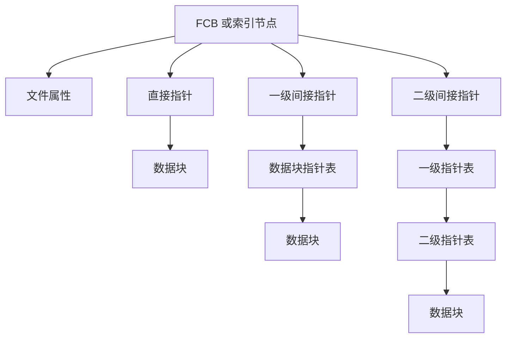
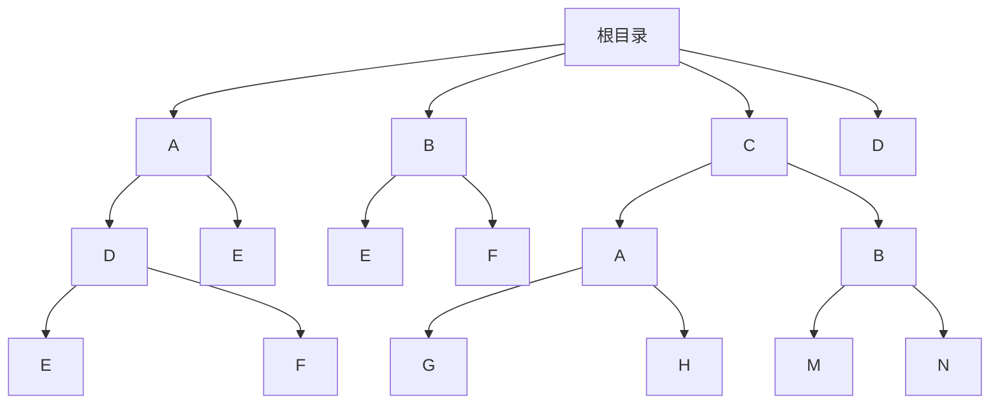

# 2020 年操作系统期末模拟试题

> 本文由《操作系统》期末模拟原题转换而成，依据原 PDF 与 PaddleOCR 转写整理。原题题干、原有答案、公式、表格和计算过程均尽量保留；对无法可靠识别的内容不作无依据改写。

> [!tip] 真题导航
> 上一份：[[2019—2020 学年第一学期操作系统期中试卷（版本三）]]　|　下一份：[[2020—2021 学年第一学期操作系统期中试卷（版本一）]]

## 主要内容

- 操作系统基础、进程与线程
- 处理机调度、同步互斥与死锁
- 存储管理、虚拟存储与地址转换
- 文件系统、输入输出与磁盘调度
- 原题答案、计算过程与图示转写

---

## 一、转写说明

| 项目 | 内容 |
|---|---|
| 课程 | 操作系统 |
| 资料类型 | 期末模拟原题 |
| 整理日期 | 2026-08-12 |
| 转写原则 | 保留原题及原有答案；不擅自补写或修正知识性内容 |

> [!warning] OCR 与答案说明
> 文中可能保留原卷手写答案、原答案或 OCR 的拼写、符号问题；无答案处不自行补写。所有图片均已转换为 Mermaid、原生表格或完整文字描述，最终笔记不包含图片。

---

## 二、原题与参考答案

| 题号 | 一 | 二 | 三 | 四 | 五 | 六 | 七 | 八 | 九 | 总分 |
|---|---|---|---|---|---|---|---|---|---|---|
| 满分 | 10 | 12 | 13 | 15 | 12 | 13 | 12 | 13 |  | 100 |

### 一. (10 points) Select the best answer for each blank

1. In the following comments, _____ are correct.

(1) Android is a widely used embedded operating system devoted to smart phones and tablet computers.

(2) Microsoft Windows Phone lists Top 1 in terms of the market share among the operating systems dedicated to smart phones.

(3) Unix has some distribution versions supporting server or mainframe computers.

(4) Linux is a type of open source operating systems.

(5) Windows XP is the operating system with the layered structure.

A. (1) and (2)    B. (2) and (3)    C. (3) and (4)    D. (4) and (5)

2. In the booting procedure, when a PC computer is powered up, the chunk of codes that the CPU will at first execute is _____.

A. OS kernel B. bootstrap in BIOS C. boot block on disk D. system programs

3. Among the following comments, only ___ are correct.

(1) The cache is a type of non-volatile storage device; it will not lose its contents in the case of system failure.

(2) In a system with the operating system supporting kernel-level threads, the thread is the basic unit for CPU scheduling, and the process is the basic unit for resources allocation.

(3) PCB contains the process state, the program counter, CPU registers, and user data.

(4) For several threads created by one process, they can share the files opened in the process.

(5) The round robin algorithm could result in starvation.

A. (1) and (2) B. (3) and (4) C. (4) and (5) D. (2) and (4) E. (2) and (5)

4. In the following, ___ is not one of the conditions which should be satisfied for a good solution to critical section problem.

A. mutual exclusion    B. fairness    C. bounded waiting    D. progress

5 A major problem for the ___ scheduling algorithm is starvation.

A. Multilevel feedback queue B. FCFS C. RR D. Priority

6. Which one of the following memory management schemes suffers from external fragmentation?

A. Fixed-sized partition B. Paging C. Segmentation D. Segmentation with paging

7. Which one of the following memory allocation schemes can be used for allocating memory for kernel data structures? _____

A. paging B. segmentation C. fixed-size partition D. buddy allocation

8. Which one of the following operations is to be performed not only on directory?

A. Search a file B. Rename a file C. Open a file D. Read a record from a file

9. In the following algorithms, which is a disk-scheduling algorithm? ___

A. CLOCK B. LRU C. SSTF D. SRTF

10. The disk free-space list is implemented as a bitmap. If the size of the disk space is 128 blocks, and each block is of 512 bytes, then ___ bytes are needed to store the bitmap.

A.128 B.512 C.16 D.8192

### 二. (12 points)

As shown below, OS takes a two-level feedback-queue scheme to allocate CPU for concurrent processes. A process entering the system is at first put in queue 0.

In queue 0, the preemptive priority scheduling algorithm is used, and assuming a small priority number has higher priority. If a process is dispatched onto the CPU, it will be given a CPU time slice of 10 milliseconds. If it does not finish within this time, it is moved to the tail of queue 1, while running, if it is preempted, it will reenter the tail of queue 0 again.

In queue 1, FCFS scheduling algorithm is used. Processes in queue 1 are permitted to run only when there is no process in queue 0. When a process  $P_{i}$ in queue 1 is running on CPU and a new process  $P_{j}$ enters the system,  $P_{j}$ will preempt the CPU occupied by  $P_{i}$.

> [!note] 图像转写：多级反馈队列
> 图中第 0 级队列采用 10 个时间单位的时间片；未完成的进程下降到第 1 级队列，第 1 级按 FCFS 继续调度。

Consider the processes $P_0, P_1, P_2, P_3$. For $0 \leq i \leq 3$, the arrival time, the length of the CPU burst time, and the priority of each $P_i$ are given as below.

| Process | Arrival time | Burst Time | Priority |
|---|---|---|---|
| $P_{0}$ | 0 | 7 | 10 |
| $P_{1}$ | 4 | 20 | 8 |
| $P_{2}$ | 8 | 3 | 6 |
| $P_{3}$ | 15 | 15 | 4 |

For the snapshot shown above, suppose that two-level feedback-queue scheduling is employed.

(1) Draw the Gantt chart that illustrates the execution of these processes.

(2) What are the turnaround times for the four processes?

### 三. (13 points)

Consider a system with four processes  $P_1$ through  $P_4$ and four resource types A, B, C and D. the system snapshot at time  $T_0$ is shown as following table.

|  | Allocation |  |  |  | Request |  |  |  | Available |  |  |  |
|---|---|---|---|---|---|---|---|---|---|---|---|---|
|  | A | B | C | D | A | B | C | D | A | B | C | D |
| $P_{1}$ | 0 | 0 | 1 | 0 | 2 | 0 | 0 | 1 | 2 | 1 | 0 | 0 |
| $P_{2}$ | 2 | 0 | 0 | 1 | 1 | 0 | 1 | 0 |  |  |  |  |
| $P_{3}$ | 0 | 1 | 2 | 0 | 2 | 1 | 0 | 0 |  |  |  |  |
| $P_{4}$ | 0 | 0 | 0 | 0 | 0 | 0 | 3 | 0 |  |  |  |  |

Answer the following questions on the basis of the deadlock-detecting algorithm.

(1) What are the total numbers of the instances for the type A, B, C and D, respectively?

(2) Is the system in a deadlock state, and why?

(3) If  $P_{2}$'s request vector is changed into  $(2, 1, 0, 1)$, is there a deadlock in the system? And if the system is deadlocked, indicate the process/processes involved in deadlock.

### 四. (15 points)

A telecom company took out 100 mobile phones for sales promotion. There is only one salesman in the sales hall, so only one customer can be served at a time, and each customer is limited to buy one. The hall can accommodate 20 customers at the same time. Customer who comes to buy mobile phones will leave if he find the hall is full of customers, otherwise he will enter the hall to wait. When it's a customer's turn to buy, if the mobile phone has been sold out, then the customer leave the hall directly, otherwise, he can buy one and then leave the hall.

Please using semaphore mechanism, write out the processes to simulate the behavior of salesmen and customers.

(1) give out the definitions and initial values of semaphores, and

(2) write out the code structure of the salesman process and the customer process respectively.

### 五. (12 points)

We traced the execution of a process  $P_{1}$ in a demand-paging system, and recorded the following logical address sequence (in decimal values) during a particular period:

0100, 0124, 0212, 0224, 0320, 0404, 0424, 0464, 0212, 0140, 0144, 0212, 0216, 0324, 0356, 0360, 0524, 0528, 0612, 0616, 0620, 0724, 0728, 0620, 0624, 0224, 0228, 0140, 0144, 0150, 0240, 0244, 0248, 0660, 0668.

Answer the following questions:

(1) Assuming the page size is 100 bytes (in decimal values), what is the reference string?

(2) Assuming four frames are allocated to this process and all frames are initially empty. How many page faults would occur for the LRU replacement algorithms?

### 六. (13 points)

A system using segmentation with paging has a  $2^{16}$ bytes logical address space with 2 segments per process and a page size of 4096 bytes.

The content of the segment and page tables is specified below (all values in decimal).

Segment Table. 

| segment | limit | pointer to page table |
|---|---|---|
| 0 | 19580 | pointer to page table for segment 0 |
| 1 | 32168 | pointer to page table for segment 0 |

| Page Table for segment 0 |  | Page Table for segment 1. |  |
|---|---|---|---|
| Frame | Valid/invalid | Frame | Valid/invalid |
| 12 | 1 | 20 | 1 |
| 29 | 1 | 25 | 0 |
| 58 | 0 | 52 | 1 |
| 10 | 1 | 25 | 1 |
| 58 | 1 | 9 | 1 |
|  | 0 | 52 | 0 |
|  | 0 | 25 | 0 |
|  | 0 | 20 | 0 |

For the following logical addresses, indicate corresponding physical address, or if they would occur a page fault.

0, 20123

0,12300

1,5000

### 七. (12 points)

On a disk drive with 5000 cylinders, numbered from 0 to 4999, the last request served was at cylinder 125, and the head is at cylinder 143. The queue of pending request, in FIFO order, is

86 1470 913 1774 948 1509 1022 1750 130.

Starting from the current head position, what is the total distance (in cylinders) that the disk arm moves to satisfy all the pending requests in the queue, for the following disk scheduling algorithms?

It is required that the procedure of the arm moving to serve the requests should be illustrated by a figure.

(1) SSTF

(2) C-SCAN

(3) SCAN

### 八. (13 points)

Consider a file system on a disk. The size of disk blocks is 512B. The directory is organized into a tree structure, and the root directory resides in memory. Directory files are organized into linked files, and common data files are organized into indexed files.

Each directory entry has one bit to define the entry as a subdirectory or as a file, and two 2-type fields, one holds file name and the other holds a pointer to a disk block. For a directory file, the directory name and its first disk block address are recorded. For a data file, the file name and the disk address where its FCB resides are recorded. The structure of the directory file is shown in Figure 1, and the structure of FCB is shown in Figure 2.

There are 13 pointers in the file's FCB. Each pointer (disk address) requires 2 bytes. The first 10 of these pointers point to direct blocks, i.e. data blocks, the next three pointers point to indirect blocks. The first points to a single indirect block, which is an index block containing the addresses of data blocks. The second points to a double indirect block, which contains the address of index blocks, and the index blocks contain the addresses of data blocks. The last pointer contains the address of a triple indirect block.

| name | address | type |
|---|---|---|
| A | Pointer to $1^{{st}}$ block | directory |
| B | Pointer to $1^{{st}}$ block | directory |
| C | Pointer to $1^{{st}}$ block | directory |
| D | Pointer to FCB block | file |

Figure 1 directory file 

> [!note] 图像转写：FCB／索引节点指针结构
> 原图上部记录文件属性（模式、所有者、时间戳、文件大小或块数等），下部包含直接、一级间接与二级间接索引指针。直接指针指向数据块；一级间接指针先指向一个“数据块指针表”；二级间接指针再多经过一级指针表。原图未给出每个数据块的实际内容。

Figure 2 FCB structure 

> [!note] 图像转写：目录树
> 原图根目录含 A、B、C、D 四个分支；A 下有 D、E，A/D 下有 E、F；B 下有 E、F；C 下有 A、B，C/A 下有 G、H，C/B 下有 M、N。相同字母表示不同路径下的目录项。

Figure 3 directory tree 

(1) Calculate the file size that can be accessed directly through FCB.

(2) Calculate the maximum address space accessible through the FCB.

(3) Suppose the directory tree of the file system is shown in Figure 3.

Now, we want to read the contents at 10KB of file M into memory, how many and which disk blocks must be read into memory?

### 二. (12 points)

(1) (8 points) the Gantt chart that illustrates the execution of these processes

> [!note] 图像转写：四进程执行轨迹
> 图中可辨识的执行区间为：P0 在 0～4 与 35～38；P1 在 4～8、11～15、25～35 与 43～45；P2 在 8～11；P3 在 15～25 与 38～43。

> [!note] 图像转写：四进程执行甘特图

| 时间区间 | 执行对象 |
|---|---|
| 0～4 | P0 |
| 4～8 | P1 |
| 8～11 | P2 |
| 11～15 | P1 |
| 15～25 | P3 |
| 25～35 | P1 |
| 35～38 | P0 |
| 38～43 | P3 |
| 43～45 | P1 |

(2) (4 points) the turnaround times for the four processes
P0: 38ms P1: 41ms P2: 3ms P3: 28ms

### 三. (13 points)

(1) (2 points) (A, B, C, D)=(4, 2, 3, 1)

(2) （1+4 points）无死锁，可以按照  $P_{3}$、 $P_{2}$、 $P_{1}$、 $P_{4}$ 的顺序依次执行完

只回答有无死锁，没有给出正确原因（即进程执行顺序）扣分。如果出现安全序列，概念错误，扣1分

(3)(2+4 points) 当的  $P_{2}$ 的请求向量变为(2,1,0,1)时，只能首先执行  $P_{3}$，之后空闲可用资源向量变为(2,2,2,

0)，无法满足 $P_{1}$、 $P_{2}$、 $P_{4}$的资源需求，因此这

没有正确指出哪些进程处于死锁，扣分。

### 四. (15 points)

(1) （3 points） the definitions and initial values of semaphores:
Int count_phone=100; //可销售的手机总数, 初值100
Int count_customer=0; //大厅内的顾客数量, 初值0

Semaphore
  Saler=1; //销售员状态, 初值1, 空闲
  Customer=0; //大厅内的顾客数, 初值0
  Mutex_c=1;//用于对顾客计数的互斥操作
  Mutex_p=1;//用于对手机计数的互斥操作

(2) （12 points） the code structure of the salesman process and the customer process:
Saler(): (4 points)
While(1){
    Wait(customer);
    提供服务;
    Wait(saler);
}

Customer(){ (8 points)
    Wait(mutex_c);
    If (count_c==20) {signal(mutex_c); exit();}
    mutex_c++;
    signal(mutex_c);
    signal(customer);
    wait(saler);
    wait(mutex_p);
    if (count_phone==0){
        signal(mutex_p);
        wait(mutex_c);
        count_c--;
        signal(mutex_c);
        exit();
    }
    购买;
    Count_phone--;
    Signal(mutex_p);
    wait(mutex_c);
    count_c--;
    signal(mutex_c);
}

### 5. (12 points)

(1) (4 points) the reference string?
1, 1, 2, 2, 3, 4, 4, 4, 2, 1, 1, 2, 2, 3, 3, 3, 5, 5, 6, 6, 6, 7, 7, 6, 6, 2, 2, 1, 1, 1, 2, 2, 2, 6, 6 or
1, 2, 3, 4, 2, 1, 2, 3, 5, 6, 7, 6, 2, 1, 2, 6.

### (2) （12 points）

(10 points)

|  | 1 | 2 | 3 | 4 | 2 | 1 | 2 | 3 | 5 | 6 | 7 | 5 | 2 | 1 | 2 | 6 |
|---|---|---|---|---|---|---|---|---|---|---|---|---|---|---|---|---|
| - | 1 | 1 | 1 | 1 |  |  |  |  | 1 | 6 | 6 |  | 6 | 1 |  | 1 |
| - | - | 2 | 2 | 2 |  |  |  |  | 2 | 2 | 7 |  | 7 | 7 |  | 6 |
| - | - | - | 3 | 3 |  |  |  |  | 3 | 3 | 3 |  | 2 | 2 |  | 2 |
| - | - | - | - | 4 |  |  |  |  | 5 | 5 | 5 |  | 5 | 5 |  | 5 |
|  | F | F | F | F |  |  |  |  | F | F | F |  | F | F |  | F |

(2 points) 10 page faults

6. (13 points)
(4 points) 0, 20123 invalid
(5 points) 0, 12300 40976
(4 points) 1,5000 page fault

### 七. (12 points)

| (1) | (4 points) | 143 | 130 | 86 | 913 | 948 | 1022 | 1470 | 1509 | 1750 | 1774 | (3 points) |
|---|---|---|---|---|---|---|---|---|---|---|---|---|
| 1745 | (1 point) |  |  |  |  |  |  |  |  |  |  |  |
| (2) | (4 points) | 143 | 913 | 948 | 1022 | 1470 | 1509 | 1750 | 1774 | 4999 | 0 | 86 130 |
| (3 point) |  |  |  |  |  |  |  |  |  |  |  |  |
| 9985 | (1 point) |  |  |  |  |  |  |  |  |  |  |  |
| 3 | (4 points) | 143 | 913 | 948 | 1022 | 1470 | 1509 | 1750 | 1774 | 4999 | 130 | 86 |
| (3 point) |  |  |  |  |  |  |  |  |  |  |  |  |
| 9769 | (1 point) |  |  |  |  |  |  |  |  |  |  |  |

### 8. (13 points)

(1) (4 points) the file size that can be accessed directly through FCB is: .512B*10

(2) (4 points) the maximum address space accessible through the FCB is:

(10+256+256*256+256*256*256)*512B

(3) （5 points）5 times I/O for 5 disk blocks must be read into memory. They are:

1 (C) +1 (B) +1 (M的FCB) +1 (index block) +1 (data block)

---

## 本章小结

| 复习维度 | 本卷覆盖内容 |
|---|---|
| 基础概念 | 操作系统服务、系统调用、进程与线程 |
| 核心算法 | 处理机调度、同步与死锁、存储与页面替换 |
| 系统资源 | 文件、I/O 设备、磁盘与资源分配 |
| 使用建议 | 先独立作答，再核对原卷已有答案与计算过程 |

> [!tip] 关联复习
> 可配合 [[操作系统/笔记/操作系统课程笔记|操作系统课程笔记]] 按章节回顾相关概念与算法。
