# 1.1 操作系统引论

> 本笔记整理自《操作系统》第 1 章课件，系统说明操作系统的目标、发展、基本特征、运行环境、主要功能、结构设计和系统调用。课件中的教材封面、体系图、流程图、时间图和结构图均已转写为文字，便于检索与复习。

## 主要内容

- 课程信息、教学目标、考核与教材
- 操作系统的组成、目标和作用
- 操作系统的发展动力、发展阶段与主要类型
- 并发、共享、虚拟和异步四个基本特征
- 内核、双重工作模式、中断与异常
- 处理机、存储器、设备、文件与接口管理
- 简单、模块化、分层、微内核与外核结构
- 系统调用的概念、特点和类型

---

## 一、课程说明

### 1. 基本信息

| 项目 | 内容 |
|---|---|
| 课程名称 | 操作系统（Operating System） |
| 课程编号 | `3182100040` |
| 学分 / 学时 | 3 学分 / 48 学时 |
| 课程性质 | 必修、专业基础课程 |
| 开课学期 | 第 4 学期 |
| 适用专业 | 网络空间安全 |
| 先修课程 | 计算机导论与程序设计、算法与数据结构、计算机组成原理 |
| 主讲教师 | 尤玮珂 |
| 学院 | 网络空间安全学院 |
| 邮箱 | `ywk@bupt.edu.cn` |

> **图片转写（课程封面与课程群）**：封面以《计算机操作系统》教材为主体，标明课程为“操作系统引论”。课件还给出“2026 春季操作系统”企业微信群二维码，提示使用微信或企业微信扫码加入，二维码在 3 月 11 日前有效，重新进入时会更新。

### 2. 课程内容与教学目标

课程全面、系统地阐述以下内容：

1. 计算机操作系统的基本原理、主要功能及实现技术。
2. 多用户、多任务操作系统的运行机制，以及系统资源管理的策略与方法。
3. 现代操作系统采用的并行处理技术与虚拟化技术。

教学目标包括：

1. 掌握操作系统的基本原理与实现技术，包括系统资源管理策略、进程管理机制和用户界面等。
2. 了解操作系统的结构与设计。
3. 具备系统软件开发所需的软件基础和基本技能，为设计、分析或改进系统软件与应用软件奠定基础。
4. 为进一步学习数据库系统、计算机网络、分布式操作系统等课程打下基础。

### 3. 学时安排

理论教学共 48 学时，其中 43 学时用于理论教学，另设 1 学时期中考试和 1 学期期末复习。课件列出的进度如下：

| 章节 | 内容 | 学时 | 周次 |
|---|---|---:|---|
| 第 1 章 | 操作系统引论 | 3 | 第 1 周 |
| 第 2 章 | 进程的描述与控制 | 6 | 第 2～3 周 |
| 第 3 章 | 处理机调度与死锁 | 9 | 第 4～6 周 |
| 第 4 章 | 进程同步 | 3 | 第 7 周 |
| 第 5 章 | 存储器管理 | 6 | 第 8～9 周 |
| 期中 | 第 1～4 章，不安排复习 | 1 | 第 10.1 周 |
| 第 6 章 | 虚拟存储器 | 6 | 第 10.2～12.2 周 |
| 第 7 章 | 输入/输出系统 | 3 | 第 12.3～13.2 周 |
| 第 8 章 | 文件管理 | 3 | 第 13.2～14.2 周 |
| 第 9 章 | 磁盘存储器管理 | 1 | 第 14.3～15.3 周 |
| 第 10 章 | 多处理机操作系统 | 1 | 第 14.3～15.3 周（与第 9、11 章共用合并单元格） |
| 第 11 章 | 虚拟化和云计算 | 1 | 第 14.3～15.3 周（与第 9、10 章共用合并单元格） |
| 第 12 章 | 保护和安全 | 2 | 第 16.1～16.2 周 |
| 第 13 章 | 复习 | 1 | 第 16.3 周 |

考试周为第 17～18 周。

> **课件数据说明**：课件写明总学时为 48，但表中各章节及期中、复习的学时合计与该数字不完全一致；本笔记按课件原表保留，具体安排以任课教师最终通知为准。

### 4. 考核方式

本课程为 3 学分考试课程，采用闭卷考试，总评构成为：

| 项目 | 比例 | 说明 |
|---|---:|---|
| 平时作业 | 20% | 共 10 次 |
| 实验 | 15% | 共 2 次 |
| 期中考试 | 5% | 第 10 周，45 分钟，闭卷，范围为前四章 |
| 期末考试 | 60% | 全年级统一闭卷书面考试 |

### 5. 教材与参考书

主教材为汤小丹、王红玲、姜华、汤子瀛编写、人民邮电出版社出版的《计算机操作系统（慕课版）》。配套资料包括自选的《习题与考研真题解析》和《实验与课程设计指导》，教材特点是全面覆盖考研大纲、跟踪前沿技术并支持线上线下混合式教学。

> **图片转写（教材封面）**：主教材封面为彩色油画风格，另列蓝色“习题解析手册”和紫色“实验指导手册”，三者构成教材及配套资料。

参考书为 Abraham Silberschatz、Peter B. Galvin、Greg Gagne 的 *Operating System Concepts*（7th Edition），John Wiley & Sons 出版，英文精装 921 页，ISBN-10 为 `0471694665`，ISBN-13 为 `978-0471694663`，重量 3.62 磅，尺寸为 7.32 × 1.49 × 10.12 英寸。课件同时列出其图书排名：Books 第 490,721，Computer Operating Systems Theory 第 44，Operating Systems 第 546，Computer Software 第 1,775。

> **图片转写（参考书封面）**：封面以恐龙为主要视觉元素，因此该书也常被称为“恐龙书”；封面标有作者 Silberschatz、Galvin、Gagne 和 Seventh Edition。

---

## 二、操作系统的组成、目标和作用

### 1. 计算机系统的层次组成

课件用自底向上的层次图表示计算机系统：

1. 计算机硬件：处理器、内部存储器和输入/输出设备构成“硬”的基础。
2. 操作系统：配置在硬件之上的第一层软件，是对硬件系统的首次扩充。
3. 其他系统软件：汇编程序、编译程序、数据库管理系统等依赖操作系统提供服务。
4. 应用程序：为完成一项或多项特定工作而编写，运行在用户态，可以与用户交互并提供可视界面。
5. 其他用户：通过应用和系统接口使用计算机。

> **定义：操作系统**
> 操作系统（Operating System，OS）是控制和管理计算机硬件与软件资源、合理调度各类作业并方便用户使用的程序集合。

课件中的计算机系统层次可原生重构为：

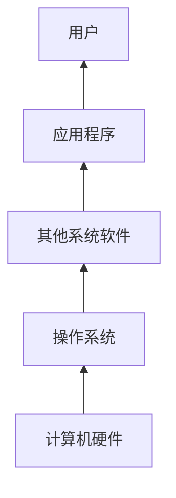

操作系统直接建立在硬件之上，向上屏蔽硬件差异；系统软件和应用程序依次使用下层提供的能力。

> **图片转写（硬件与软件）**：硬件图片分别展示了处理器安装到主板、内存条和主板，说明处理器是运算与控制核心，主存由内存芯片、电路板和金手指等组成，I/O 设备负责人与计算机的交互。软件图片展示 Windows、Linux、手机应用图标和 Microsoft Office 图标，说明系统软件支撑应用软件，应用程序面向具体任务与用户交互。

### 2. 操作系统的目标

1. 方便性：用户可通过 OS 命令操纵计算机。
2. 有效性：提高系统资源利用率和系统吞吐量。
3. 可扩充性：OS 应具有良好的扩展能力，这与其结构设计紧密相关。
4. 开放性：遵循世界标准规范，特别是开放系统互连 OSI 等规范。

> **图片转写（开放性）**：图中以“网络”为中心连接不同终端和资料，表示开放标准使异构设备和系统能够互连、交换信息。

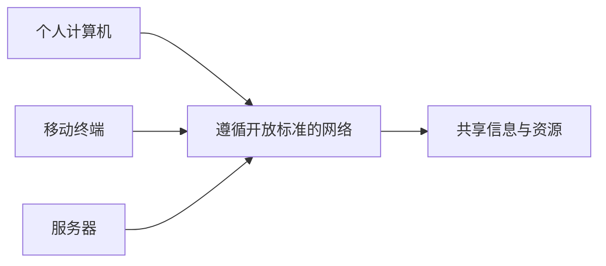

### 3. 操作系统的三重作用

1. 计算机系统资源的管理者：
   - 处理机管理：分配和控制处理机。
   - 存储器管理：分配和回收内存。
   - I/O 设备管理：分配和操纵 I/O 设备。
   - 文件管理：负责文件的存取、共享与保护。
2. 用户与计算机硬件系统之间的接口：通过命令方式（UNIX、DOS 命令）、系统调用方式（API）和图形用户界面方式（Windows、Linux）防止资源滥用，并向用户隐藏底层细节。
3. 对计算机资源进行抽象：把裸机转换为便于使用的虚拟机器，向用户提供硬件操作的抽象模型。

> **图示解读（接口链路）**：用户输入先到应用软件，应用通过系统调用请求操作系统；操作系统负责底层硬件控制，再将处理结果经应用返回用户。用户不直接操纵台式机、笔记本、手持设备或大型机等硬件。


> **图示解读（资源抽象）**：底层物理资源是处理器、主存储器和 I/O 设备；“进程”抽象覆盖三者，“虚拟存储器”抽象覆盖主存和 I/O，“文件”抽象主要建立在 I/O 设备之上。由此可见，OS 通过层层抽象提供统一、易用的逻辑资源。

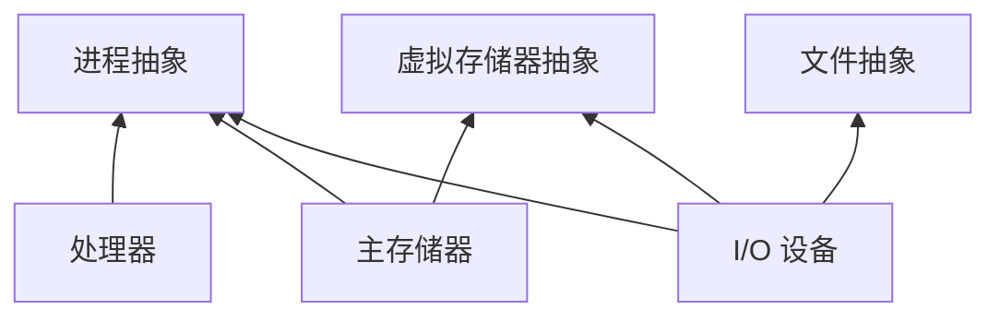

---

## 三、操作系统的发展过程

### 1. 主要推动力

推动操作系统发展的主要动力依次包括：

1. 不断提高计算机资源利用率。
2. 方便用户。
3. 器件不断更新换代。
4. 计算机体系结构不断发展。
5. 不断出现新的应用需求。

### 2. 无操作系统与单道批处理系统

早期无操作系统的计算机采用人工操作和脱机 I/O。单道批处理系统则把作业按顺序一个接一个连续处理，使用汇编语言或 FORTRAN，主要以磁带输入输出，并首次在程序员、操作员和维护员之间形成明确分工。

> **图片转写（脱机批处理设备链）**：程序和数据先由卡片阅读机读入 IBM 1401，并写入磁带；输入磁带送到 IBM 7094 执行，结果写到系统/输出磁带；输出磁带再送到另一台 IBM 1401，由打印机输出。各阶段由操作员搬运磁带，因此计算与输入输出相互分离。


单道批处理的处理流程为：

1. 监督程序检查是否还有下一个作业；若没有则停止。
2. 若有作业，则把源程序转换为目标程序。
3. 检查源程序是否有错；有错则跳过并处理下一作业。
4. 无错则装配目标程序并运行。
5. 运行结束后返回监督程序，继续检查下一作业。

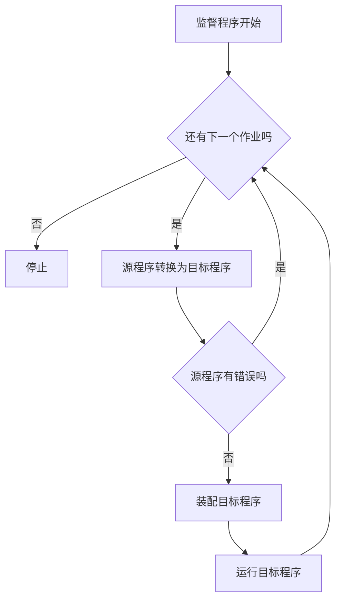

监督程序常驻内存，是现代操作系统的前身。单道批处理旨在提高资源利用率与吞吐量，但仍无法充分利用系统资源。

> **图示解读（单道程序时间线）**：用户程序提出 I/O 请求后，监督程序启动 I/O；I/O 执行期间用户程序停止，CPU 缺少可运行工作。I/O 完成后通过中断交还控制，再恢复用户程序。图中两轮 I/O 均占据很长时间，因此 I/O 所占比例大、CPU 空闲明显。


### 3. 多道批处理系统

> **定义：多道程序设计**
> 把一个以上的作业存放在主存中，并使其同时处于运行状态，让这些作业共享处理机时间、外部设备及其他系统资源。

在单处理机系统中，“同时运行”是宏观概念，表示各作业均已开始但尚未结束；微观上任一时刻仍只有一个作业占用处理机。

> **图示解读（单道与四道程序对比）**：单道系统中，程序等待 I/O 时 CPU 只能空闲；四道系统中，程序 A、B、C、D 在各自发出 I/O 请求后依次让出 CPU，调度程序切换到其他可运行程序。各程序的计算段与 I/O 段相互交叠，只有极少时间出现 CPU 空闲，因此显著提高资源利用率。

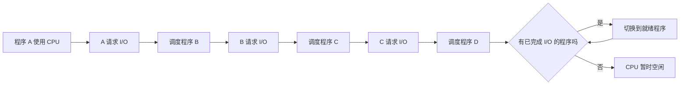

多道批处理系统的特点与评价如下：

| 方面 | 内容 |
|---|---|
| 特征 | 多道性、无序性、调度性 |
| 优点 | 资源利用率高、系统吞吐量大 |
| 缺点 | 平均周转时间长、无交互能力 |
| 需要解决的问题 | 处理机管理、内存管理、I/O 设备管理、文件管理、作业管理、用户与系统的接口 |

### 4. 分时系统

> **定义：分时系统**
> 在一台主机上连接多个带显示器和键盘的终端，允许多个用户共享主机资源，每个用户都能通过自己的终端以交互方式使用计算机。

引入分时系统的需求是实现人机交互，并让多个用户在共享主机时获得近似独占的体验。实现时需解决：

1. 及时接收：用多路卡周期轮询所有终端，并设置命令缓冲区。
2. 及时处理：作业直接进入内存，并采用轮转运行方式。

> **图片转写（主机—终端关系）**：一台中心主机通过多条线路连接终端 1、终端 2、终端 3 至终端 $n$。时间被切成连续时间片，主机轮流服务各终端；从单个用户角度看，请求能在一个较短响应时间内得到处理。

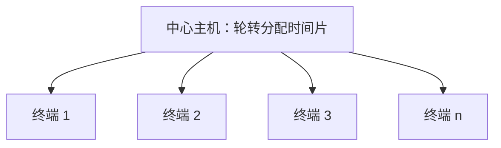

分时系统具有：

1. 多路性：多台终端同时连接一台主机并分时使用。
2. 独立性：各用户彼此独立，感觉自己独占主机。
3. 及时性：用户请求通常在 1～3 秒内得到响应。
4. 交互性：用户可通过终端与系统进行广泛的人机对话。

### 5. 实时系统

> **定义：实时系统**
> 系统能够及时响应外部事件请求，在规定时间内完成处理，并控制所有实时任务协调一致地运行；其最主要的特征是实时性。

实时系统包括工业（武器）控制系统、信息查询系统、多媒体系统和嵌入式系统。实时任务可按两种方式分类：

1. 按执行是否呈现周期性：周期性实时任务、非周期性实时任务。
2. 按截止时间要求：硬实时任务、软实时任务。

课件从多路性、独立性、及时性、交互性和可靠性五方面比较实时系统与分时系统，并进一步把实时操作系统区分为硬实时与软实时、抢先式与非抢先式。

### 6. 微机、嵌入式、网络与分布式操作系统

微机操作系统经历了以下类型：

1. 单用户单任务：CP/M、MS-DOS。
2. 单用户多任务：Windows 95/98。
3. 多用户多任务：Solaris、Linux、Windows NT/Server 等。

> **定义：嵌入式系统**
> 为完成特定功能而设计，或带有附加机制，或作为其他系统一部分的计算机硬件与软件结合体；通常具有响应速度、测量精度、持续时间等实时限制。

嵌入式 OS 用于嵌入式系统，如嵌入式 Linux、Windows Embedded、Android、iOS，特点是内核小、系统精简、可配置、实时性高。

> **图片转写（嵌入式硬件）**：图片展示一块集成触摸屏、处理器、存储芯片、网络接口、串口、扩展排针和数码管的开发板，说明嵌入式系统把专用硬件与精简软件紧密结合。

> **定义：网络操作系统**
> 在计算机网络环境中管理和控制网络资源、实现数据通信和资源共享，并为用户提供网络资源接口的一组软件和规程。

网络 OS 的特征是硬件独立性、接口一致性、资源透明性、系统可靠性和执行并行性；功能包括数据通信、应用互操作与网络管理。课件列举 UNIX、Linux、Windows NT/2000/Server。

> **定义：分布式系统**
> 基于软件实现的一种多处理机系统，由多个处理机通过通信线路互连形成松耦合系统，具有分布性、透明性、同一性和全局性。

分布式 OS 是配置在分布式系统上的公用 OS，除单处理机 OS 和网络 OS 的功能外，还具有通信管理、资源管理和进程管理功能。课件列举万维网和鸿蒙 OS。

---

## 四、操作系统的基本特征

### 1. 并发

> **并行性**：两个或多个事件在同一时刻发生。
> **并发性**：两个或多个事件在同一时间间隔内发生。

并发促使操作系统引入进程和线程。单核 CPU 同一时刻只能运行一个程序，不同程序通过交替使用 CPU 实现并发；多核 CPU 可在同一时刻执行多个程序，实现并行。

> **图示解读（并发与并行）**：时间轴上，单个 CPU 的多个任务块彼此交错，表示交替执行；双核 CPU 的 CPU 1 与 CPU 2 时间轴上可同时出现不同任务块，表示多个任务真正同步运行。

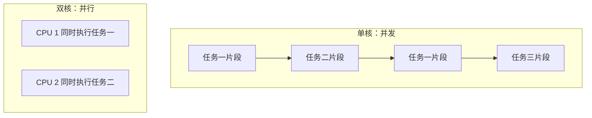

### 2. 共享

系统资源可由内存中多个并发执行的进程共同使用，主要有：

1. 互斥共享：临界资源或独占资源在同一时刻只允许一个进程使用。
2. 同时访问：多个进程可在同一时段共同访问资源。

### 3. 虚拟

> **定义：虚拟**
> 通过某种技术把一个物理实体转换为若干个逻辑上的对应物。

课件用图表列出四类虚拟化：

1. 虚拟处理机：利用多道程序设计，把一台物理 CPU 虚拟成多台逻辑 CPU，用户感知到的是虚拟处理机。
2. I/O 虚拟：利用虚拟设备技术，把一台物理 I/O 设备虚拟为多台逻辑 I/O 设备，使每个用户仿佛独占一台设备。
3. 虚拟存储器：利用虚拟存储技术从逻辑上扩充物理存储器容量，用户感知到的是更大的虚拟存储器。
4. 虚拟硬盘：把一台硬盘虚拟成多台逻辑硬盘，以提升使用便利性和安全性。

虚拟化采用两种复用方式：

1. 时分复用：虚拟处理机、虚拟 I/O 设备。单核 CPU 在微小时间段内交替服务多个进程，使用户感觉存在多个处理器。
2. 空分复用：虚拟存储。即使 QQ、微信等程序所需内存总量超过物理内存，也能借助虚拟存储器运行。

> **课件勘误提示**：课件在解释单核 CPU 同时运行多个应用时再次写了“虚拟存储器技术”，但同页后文明确归入“时分复用技术”，应结合上下文理解为虚拟处理机的时分复用。

### 4. 异步

进程以不可预知的速度向前推进，执行次序和完成时间受资源竞争、调度和外部事件影响，这种性质称为异步性。

---

## 五、操作系统的运行环境

### 1. 从固件到程序执行

硬件支持下的启动与运行链路为：

1. 引导程序位于固件，用于定位 OS 内核并将其加载到内存。
2. 程序最初位于外存，执行前被加载到内存。
3. CPU 从内存中的程序取指并执行。
4. 硬件中断或软件中断引发事件，操作系统据此取得控制并处理。

> **图示解读（执行链）**：课件用连续箭头表示“固件中的引导程序 → 内存中的执行程序 → CPU 执行指令”，并在程序运行过程中插入由硬件中断或软件中断触发的事件。

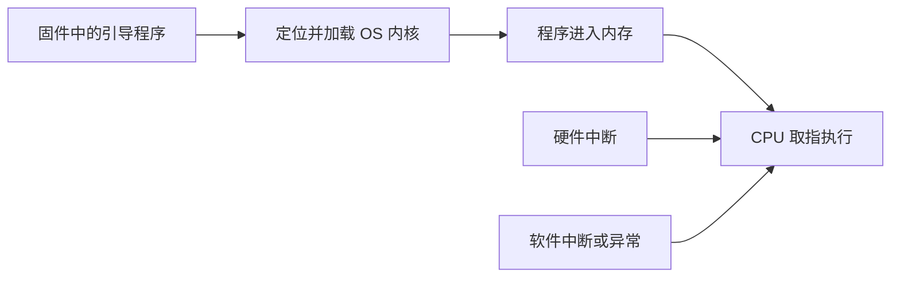

### 2. 操作系统内核

内核常驻内存并与硬件紧密相关，包括：

1. 支撑功能：中断处理、时钟管理、原语操作。
2. 资源管理功能：进程管理、存储器管理、设备管理。

> **定义：原语与原子操作**
> 原语由若干条指令组成，用于完成特定功能；原子操作要么全部执行，要么完全不执行，执行过程不可分割。

### 3. 处理机的双重工作模式

处理机由硬件模式位区分两种状态：

| 状态 | 别名 | 权限 |
|---|---|---|
| 内核态 | 管态、系统态 | 可执行包括特权指令在内的一切指令 |
| 用户态 | 目态 | 不能执行特权指令，只执行非特权指令 |

模式位使硬件能够区分当前运行的是用户代码还是内核代码。系统调用把运行状态切换到内核态，服务完成后再把结果返回用户态。

> **定义：特权指令**
> 在内核态运行，既能访问用户空间，也能访问系统空间，例如启动外部设备、设置系统时钟、中断控制、切换执行状态和 I/O 指令。

> **定义：非特权指令**
> 在用户态运行，只能访问用户空间。应用程序使用非特权指令，可避免程序异常破坏整个系统。

> **图片转写（模式转换）**：状态位规定内核态为 0、用户态为 1。执行用户程序时处于用户态；调用系统调用后以“陷入”进入内核态并执行内核服务；服务完成后以模式位 1 返回用户态。中断或错误出现时，硬件也会自动切换到内核态；内核可通过“设置用户模式”回到用户态。

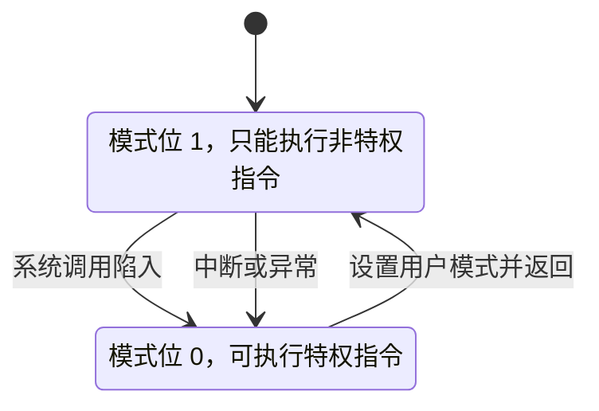

### 4. 中断与异常

操作系统是中断驱动的，总是在等待事件发生，而事件由中断或异常引起：

1. 中断（interrupt）：由硬件引起。
2. 异常或陷阱（trap）：由软件引起，包括除数为零、无效存储访问等错误，也包括用户程序为请求 OS 服务而故意触发的陷阱。

> **图片转写（中断与异常）**：三幅照片分别以计算机硬件、外部场景和用户操作电脑为象征，依次对应“OS 等待事件”“硬件产生中断”“软件或用户请求产生异常/陷阱”；照片本身不增加新的技术步骤。

---

## 六、操作系统的主要功能

### 1. 功能总览

操作系统主要提供处理机管理、存储器管理、设备管理、文件管理、用户接口与程序接口，并扩展出系统安全、网络和多媒体等现代功能。

| 管理对象 | 子功能 |
|---|---|
| 处理机管理 | 进程控制、进程同步、进程通信、调度 |
| 存储器管理 | 内存分配、内存保护、地址映射、内存扩充 |
| 设备管理 | 缓冲管理、设备分配、设备处理 |
| 文件管理 | 文件存储空间管理、目录管理、文件读写管理、文件保护 |
| OS 与用户接口 | 用户接口、程序接口 |

> **图片转写（功能总览）**：图以正在操作笔记本的用户为中心，向外连接处理机管理、内存管理、设备管理、文件管理、用户接口和现代 OS 新功能，表示各项能力都围绕用户使用和资源管理协同工作。

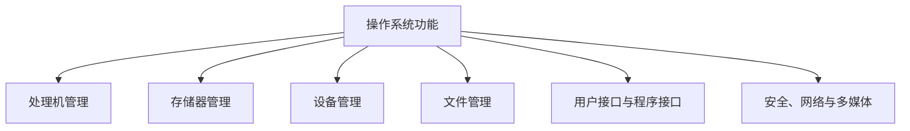

### 2. 处理机管理

1. 进程控制：创建进程、撤销或终止进程、完成状态转换。
2. 进程同步：采用信号量机制等协调进程。
3. 进程通信：支持直接通信和间接通信。
4. 调度：包括作业调度和进程调度。

### 3. 存储器管理

1. 内存分配和回收：按需分配并在使用结束后回收内存。
2. 内存保护：确保用户程序只在自己的内存空间运行，禁止其访问 OS 的程序和数据。
3. 地址映射：把逻辑地址转换为物理地址。
4. 内存扩充：使用虚拟存储技术提供请求调入和置换功能。

### 4. 设备管理

设备管理的主要任务是完成 I/O 请求，并提高 CPU 与 I/O 设备的利用率，具体包括：

1. 缓冲管理：建立与维护缓冲区机制。
2. 设备分配：按请求分配和释放设备。
3. 设备处理：通过设备驱动程序控制具体设备。

> **图片转写（设备管理）**：图以编号 01、02、03 的三个阶段表示“缓冲管理 → 设备分配 → 设备处理”，强调 I/O 请求从暂存、资源分派到驱动执行的连续过程；背景建筑照片仅用于装饰。


### 5. 文件管理

1. 管理文件存储空间。
2. 管理目录，实现按名存取。
3. 管理文件读写。
4. 实施文件保护。

> **图片转写（文件管理）**：三幅照片依次象征存储介质、目录组织和用户读写文件，对应“文件存储空间管理”“目录管理/按名存取”“文件读写管理与保护”。

### 6. 用户接口和程序接口

用户接口包括：

1. 联机用户接口：命令行界面 CLI。
2. 脱机用户接口：批处理系统中的作业说明书或作业控制语言 JCL。
3. 图形用户接口：GUI。

程序接口由系统调用构成，每个系统调用是能够完成特定功能的子程序。

### 7. 现代操作系统的新功能

1. 系统安全：认证技术、密码技术、访问控制技术、反病毒技术。
2. 网络功能与服务：网络通信、资源管理、应用互操作。
3. 多媒体支持：接纳控制、实时调度和多媒体文件存储。

---

## 七、操作系统的结构设计

### 1. 简单结构

简单结构也称整体系统结构。OS 缺乏清晰结构，是大量过程的集合，内部复杂、混乱，典型例子是 MS-DOS 和早期 UNIX。

> **图片转写（MS-DOS 简单结构）**：图中自上而下为应用程序、常驻系统程序、MS-DOS 设备驱动程序和 ROM BIOS 设备驱动程序。箭头不仅逐层向下，还允许上层直接跨层访问底层 ROM BIOS，说明层次边界松散、耦合较强。

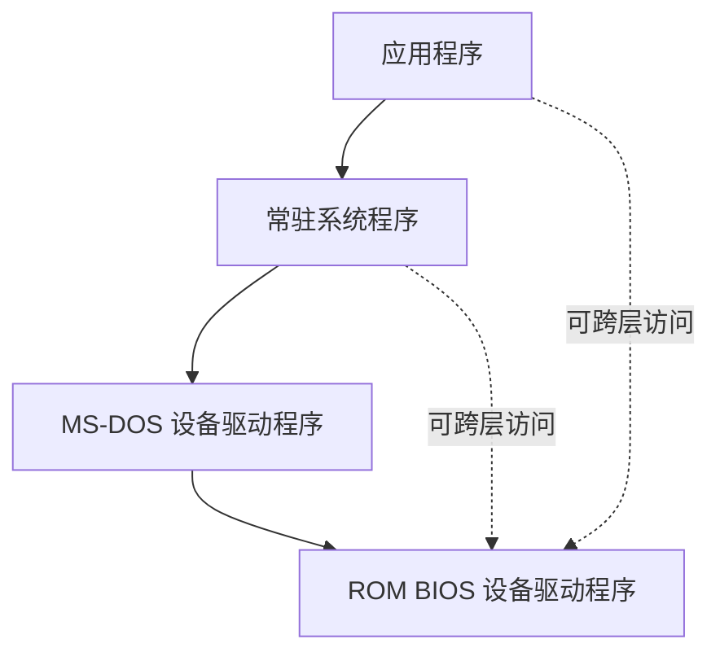

### 2. 模块化结构

模块化结构使用“模块—接口法”，按功能把 OS 划分成多个模块并规定模块间接口。优点包括提高设计正确性、可理解性和可维护性，增强适应性，加快开发过程。

现代 OS 多采用可加载内核模块：内核保留一组提供核心服务的组件，其他服务可在内核运行时动态链接，并在需要时加载。例子包括 Linux、macOS、Solaris 和 Windows。

> **图片转写（Solaris 模块）**：核心 Solaris 内核位于中心，外围连接调度类、文件系统、可加载系统调用、可执行文件格式、STREAMS 模块、杂项模块以及设备和总线驱动。图示说明不同功能作为独立模块围绕核心内核按需组合。

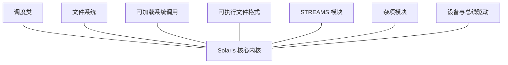

### 3. 分层结构

分层结构把 OS 划分为若干层，在低层上构建高层；第 0 层是硬件，第 $N$ 层是用户界面，高层只依赖相邻低层。其优点是易保证系统准确性、易维护且可扩充，缺点是系统效率较低。例子包括 THE 和 Multics。

> **图片转写（同心层次）**：同心圆中心是“layer 0 hardware”，其外依次为 layer 1、更多中间层，最外层是“layer N user interface”。每层包围并依赖更低层，用户只能从最外层逐级使用底层能力。

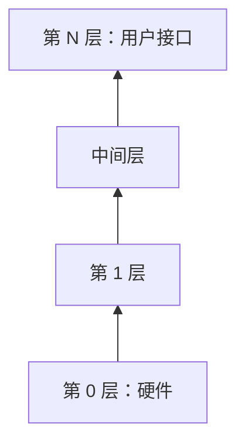

### 4. 微内核结构

微内核只保留必不可少的部分，通常包括进程管理、低级存储器管理、中断和陷入处理，并采用客户/服务器模式。其设计强调机制与策略分离及面向对象技术，例子包括 Mach OS、Windows 2000/XP。

> **图片转写（客户/服务器微内核）**：用户态包含多个客户进程以及进程服务器、I/O 设备管理服务器、文件服务器、虚拟存储器服务器等；核心态只有微内核。客户向内核发送请求，内核把消息转给相应服务器，服务器处理后经内核返回应答。

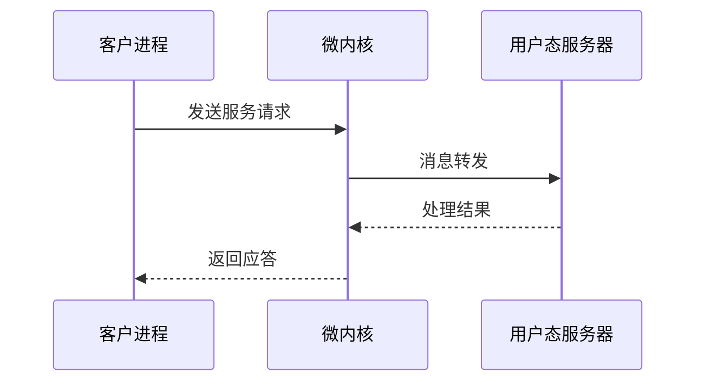

微内核的优点包括：

1. 提高可扩展性。
2. 增强可靠性。
3. 可移植性强。
4. 支持分布式系统。
5. 便于融入面向对象技术。

其主要问题是运行效率下降：一次服务请求可能需要多次消息交互，以及多次用户态/内核态切换和上下文切换。

### 5. 外核结构

外核不提供传统 OS 中的进程、虚拟存储器等抽象，而专注于物理资源的隔离、保护与复用。外核本身很小，只保护系统资源；应用程序负责管理硬件资源。课件实例为 Aegis 系统。

> **图片转写（外核分层）**：底层硬件包括帧缓冲区、页表缓冲区、网络设备和存储器；外核位于硬件之上，向上提供受保护的资源访问；库 OS 在外核之上提供 POSIX、TCP 和万维网服务，最上层运行浏览器等应用程序。抽象主要由库 OS 和应用构造，而非由内核统一提供。

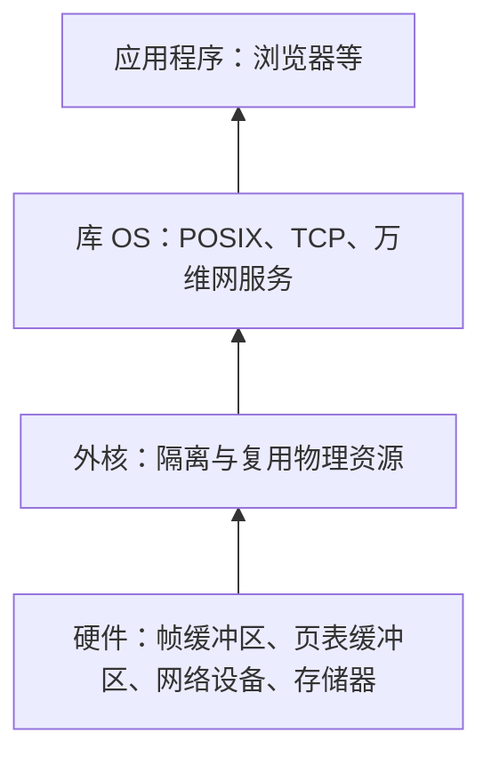

---

## 八、系统调用

### 1. 基本概念

> **定义：系统调用**
> 应用程序请求 OS 内核完成某项功能时采用的一种过程调用，是用户程序与内核之间的接口。应用程序通过系统调用间接执行内核中的相关过程并取得服务。

系统调用与一般过程调用的区别体现在：

1. 运行在不同的系统状态。
2. 涉及用户态与内核态的转换。
3. 涉及服务完成后的返回。
4. 可能出现嵌套调用。

### 2. 系统调用的类型

1. 进程控制类：创建和终止进程、获得和设置进程属性、等待事件出现。
2. 进程通信类：供进程之间交换信息。
3. 文件操纵类：打开、关闭、创建、删除、读写文件。
4. 设备管理类：申请和释放设备、设备 I/O 重定向、获得和设置设备属性。
5. 信息维护类：获得系统及文件时间、OS 版本、当前用户、空闲内存、磁盘等信息。

系统调用的受控执行路径如下：

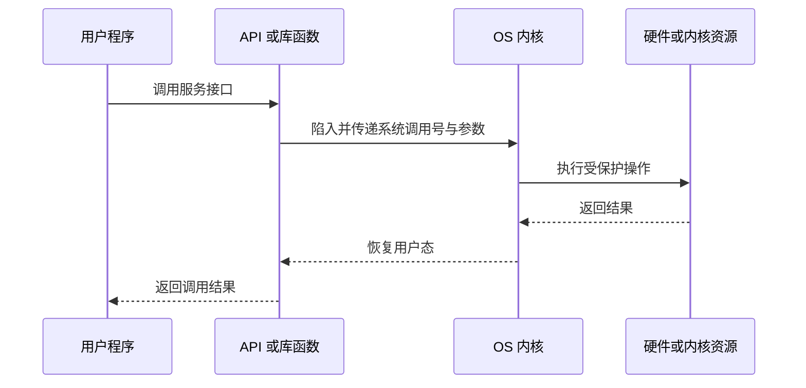

---

## 九、作业、实验与课程思政

### 1. 第一次作业

课件用黄色标出本次作业题目：

| 题型 | 题号 |
|---|---|
| 简答题 | 1、2、3、4 |
| 计算题 | 25、26 |
| 综合应用题 | 27、28 |

每次作业提交截止时间为下周四之前，包含周四当天。

### 2. 第一次实验

1. 一人一组，从 Windows、Linux、macOS、Android 等系统中任选一种。
2. 调研其历史、结构和特点，完成不超过 2000 字的报告并提交 PDF。
3. 文件名为 `第一次实验_姓名.pdf`。
4. 3 月 20 日前（含当天）提交到教学云平台，超过截止时间不可补交。
5. 可以互相讨论，但不可抄袭；报告结尾必须列出参考文献。

### 3. 操作系统发展与自主可控

课件以“Windows 应用初期、Linux 问世之际，国产操作系统发展何如”为问题回顾历史：

1. 20 世纪 40 年代中期，世界上第一台真正的电子数字计算机 ENIAC（Electronic Numerical Integrator and Computer）出现，操作系统需求随之产生。
2. 早期较成功的 UNIX 为用户提供多任务、多层次软件环境，逐渐发展成主机时代的重要操作系统。由于代码开放且被广泛用于高校实验教学，UNIX 教学代码又衍生出 BSD（Berkeley Software Distribution）等发行版本。
3. 1991 年 10 月 5 日，Linus Torvalds 发布独立开发的类 UNIX 内核；该内核与 GNU 自由软件协作计划结合，形成开源 Linux 系统。
4. Windows 的发展路径与 Linux 不同。它由微软研发，1985 年问世时只是 Microsoft-DOS 模拟环境，后来不断完善体验和图形界面，逐步成为广泛使用的计算机操作系统。
5. 在 Windows 应用初期、Linux 问世之际，即 20 世纪 90 年代初，我国出于操作系统本质安全和国家信息产业安全的考虑，开始倡导自主研发拥有自主知识产权的国产操作系统。

课件据此强调：自主可控操作系统研发关系国家信息产业安全，知识分子和科技人才应关注核心技术自主创新。

---

## 本章小结

| 主题 | 核心结论 |
|---|---|
| 目标 | 方便性、有效性、可扩充性、开放性 |
| 作用 | 管理资源、提供用户—硬件接口、抽象物理资源 |
| 发展 | 从人工操作、批处理发展到分时、实时、微机、嵌入式、网络和分布式系统 |
| 基本特征 | 并发、共享、虚拟、异步 |
| 运行环境 | 引导加载、内核常驻、用户态/内核态、中断与异常 |
| 主要功能 | 处理机、存储器、设备、文件、接口、安全、网络与多媒体管理 |
| 结构 | 简单、模块化、分层、微内核、外核 |
| 系统调用 | 用户程序进入内核并请求 OS 服务的受控接口 |

> **知识导图转写**：第 1 章以“操作系统引论”为中心，向外连接目标与作用、发展过程、基本特征、运行环境、主要功能、结构设计和系统调用；其中发展过程展开为单道批处理、多道批处理、分时、实时、微机、嵌入式、网络和分布式系统，主要功能展开为处理机、存储器、设备、文件和接口管理，结构设计展开为简单、模块化、分层、微内核和外核五类结构。

```mermaid
flowchart TD
  O[操作系统引论]
  O --> A[目标与作用]
  O --> D[发展过程]
  D --> D1[批处理]
  D --> D2[分时与实时]
  D --> D3[微机、嵌入式、网络与分布式]
  O --> C[并发、共享、虚拟、异步]
  O --> E[运行环境]
  O --> F[主要功能]
  F --> F1[处理机与存储器]
  F --> F2[设备与文件]
  F --> F3[接口]
  O --> S[结构设计]
  S --> S1[简单、模块化、分层]
  S --> S2[微内核与外核]
  O --> X[系统调用]
```

### 逐图覆盖审计

下表序号对应源课件中 119 个图片引用的出现顺序；“文字化”表示已把不能或无需图形化的信息完整转为正文，“Mermaid”表示已原生重构其关系。

| 图片序号 | 主题 | 处理结果 |
|---|---|---|
| 1 | OS 标志 | 装饰图，已说明不增加知识信息 |
| 2 | 课程群二维码 | 文字化其用途与有效期，不保留不可检索的二维码 |
| 3～5 | 主教材与配套教材封面 | 文字化书名、用途与封面特征 |
| 6 | *Operating System Concepts* 封面 | 文字化作者、版次与“恐龙书”特征 |
| 7 | 课程内容导航 | Mermaid 重构为章末知识结构图 |
| 8～12 | CPU 安装、主板、Windows/Linux、手机与应用图标 | 文字化硬件、系统软件和应用软件的含义 |
| 13～17 | OS 标志、网络互连及章节装饰图标 | 网络关系已 Mermaid 重构；其余标记为装饰信息 |
| 18 | 资源管理主题图 | 文字化操作系统的资源管理者作用 |
| 19 | 用户—应用—OS—硬件接口链 | Mermaid 重构并补充双向结果返回 |
| 20 | 进程、虚拟存储器、文件与硬件覆盖关系 | Mermaid 重构抽象与物理资源的对应关系 |
| 21～26 | 发展阶段编号与趋势图标 | 正文按阶段完整列举，图标本身无额外语义 |
| 27～30 | 脱机批处理设备链的四个分图 | 合并为一幅 Mermaid 设备与磁带流转图 |
| 31～32 | 章节趋势图标 | 装饰图，知识点由相邻正文承接 |
| 33 | 单道批处理流程图 | Mermaid 重构全部判断与“是/否”分支 |
| 34 | 单道程序运行时间线 | Mermaid 重构 CPU 运行、I/O 和中断恢复顺序 |
| 35 | 用户确认图标 | 装饰图，不增加技术信息 |
| 36～37 | 多道程序时间线与单/多道对比 | Mermaid 重构调度和 I/O 重叠过程，正文解释差异 |
| 38～39 | 主机—多终端与时间片 | Mermaid 重构一台主机连接多个终端的结构 |
| 40～43 | 实时系统类型的章节图标 | 正文列出工业控制、信息查询、多媒体与嵌入式类型 |
| 44～49 | 工具、层次、趋势与强调圆点图标 | 判定为排版装饰，相关分类已由正文承接 |
| 50 | 嵌入式开发板 | 文字化触摸屏、处理器、接口和精简专用特征 |
| 51～56 | 网络/分布式系统的房屋、层次和锁图标 | 图标为章节导航，正文完整转写概念、特征与功能 |
| 57～60 | 并发、共享、虚拟、异步箭头图标 | 文字化四项基本特征及复用方式 |
| 61 | 双核 CPU 并行时间线 | Mermaid 对比单核并发和双核并行 |
| 62～69 | 运行环境、内核功能的人员、目标、工具与章节图标 | 文字化启动链、支撑功能和资源管理功能 |
| 70～73 | 内核态/用户态章节箭头 | 正文与表格转写模式位、权限和特权指令 |
| 74 | 计算机工作场景照片 | 装饰图，不增加技术步骤 |
| 75 | 趋势图标 | 装饰图，模式转换知识由正文承接 |
| 76 | 内核态—用户态转换图 | Mermaid 状态图重构中断、异常、陷入和返回 |
| 77 | 用户程序—系统调用—内核执行图 | Mermaid 系统调用时序图重构完整受控路径 |
| 78～80 | 中断与异常的三幅场景照片 | 文字化为硬件中断、软件异常/陷阱及 OS 等待事件 |
| 81～88 | 处理机、存储器与设备管理的编号箭头 | 功能表与设备管理 Mermaid 覆盖全部阶段 |
| 89～91 | 文件管理的三幅场景照片 | 文字化存储空间、目录、读写与保护 |
| 92 | 工具图标 | 章节装饰，接口知识由正文承接 |
| 93～98 | 安全、网络、多媒体等功能图标 | 文字化现代 OS 新功能，图标无额外关系 |
| 99 | MS-DOS 简单结构图 | Mermaid 重构四层及跨层访问 |
| 100～103 | 分层结构章节图标 | 装饰性导航，优缺点与实例已文字化 |
| 104 | 同心分层图 | Mermaid 重构硬件到用户接口的逐层依赖 |
| 105～109 | 微内核/外核的章节图标 | 文字化基本概念、机制、优缺点与实例 |
| 110 | Aegis 外核结构 | Mermaid 重构硬件、外核、库 OS 和应用四层 |
| 111～118 | 系统调用类型的房屋、层次、锁与编号图标 | 分类表与系统调用 Mermaid 时序图完整承接 |
| 119 | 本章知识导图 | Mermaid 重构章节主干与二级分支 |
