# 1.1 数据库系统绪论

> 本笔记依据两份“绪论”课件整理，覆盖数据库技术发展、数据库系统基本概念、数据管理技术、数据库系统特征以及概念、层次、网状和关系数据模型。课件中的 54 处图片均已逐一核查，结构图已用 Mermaid 重建，表格、代码、示例与图中信息已改写为可检索的文字。

## 主要内容

- 课程定位、学习目标与考核方式
- 数据库技术的发展历史、代表人物与产品
- 数据、数据库、DBMS、DBS、DBAS 与 DBA
- 人工管理、文件系统与数据库系统三个阶段
- 数据库系统的主要特点及 DBMS 功能
- 数据模型的分类、抽象过程与组成要素
- 概念模型、实体联系与 E-R 图
- 层次模型、网状模型和关系模型
- 典型例题、练习、面试题与课后作业

---

## 一、课程导论

### 1. 为什么学习数据库

“大数据”时代的淘宝、京东、微博、微信、知乎、豆瓣、选课系统、订票系统、企业信息管理系统、银行和电子政务等，都离不开数据管理。数据库系统是现代信息系统的核心和基础，数据库技术也是计算机科学中发展最快、应用最广的技术之一。

数据库与信息安全关系紧密。课件用 OWASP Top 10 的 2017—2021 版变化说明 Web 应用风险在持续演化：2017 年的“注入”在 2021 年仍保留但降至 A03；“失效的身份认证”演化为“身份识别和身份验证失败”；“敏感数据泄露”演化为“加密机制失效”；“失效的访问控制”升至 A01；“使用含已知漏洞的组件”改为“易受攻击和过时的组件”；“日志记录和监控不足”改为“安全日志记录和监控失败”；2021 年还出现“软件和数据完整性失效”和“服务器端请求伪造（SSRF）”。完整条目对照如下：

| 2017 | 风险 | 2021 | 风险 |
|---|---|---|---|
| A01 | 注入 | A01 | 失效的访问控制 |
| A02 | 失效的身份认证 | A02 | 加密机制失效 |
| A03 | 敏感数据泄露 | A03 | 注入 |
| A04 | XML 外部实体（XXE） | A04 | 不安全设计 |
| A05 | 失效的访问控制 | A05 | 安全配置错误 |
| A06 | 安全配置错误 | A06 | 易受攻击和过时的组件 |
| A07 | 跨站脚本（XSS） | A07 | 身份识别和身份验证失败 |
| A08 | 不安全反序列化 | A08 | 软件和数据完整性失效 |
| A09 | 使用含已知漏洞的组件 | A09 | 安全日志记录和监控失败 |
| A10 | 日志记录和监控不足 | A10 | 服务器端请求伪造（SSRF） |

这说明数据库应用不仅要会存取数据，还要关注访问控制、认证、加密、完整性与审计。

### 2. 学习目标与先修知识

1. 基础与应用：  
   掌握数据库技术的基本概念和原理、SQL、Microsoft SQL Server 或 MySQL 的基本使用与维护，以及基本数据库编程方法。
2. 理论与设计：  
   了解数据库设计的基本理论和方法，能够完成简单数据库设计。
3. 先修课程：  
   离散数学、数据结构，以及 Java、C++、Python 或 PHP 等程序设计基础。

课程内容分为基础应用与理论设计两部分：绪论、关系数据库、SQL、数据库保护、SQL Server、数据库编程属于基础应用；关系数据理论和数据库设计属于理论设计。

### 3. 教材、软件与考核

| 类别    | 内容                                                                                                    |
| ----- | ----------------------------------------------------------------------------------------------------- |
| 教材    | 王珊、杜小勇等，《数据库系统概论（第六版）》，高等教育出版社，2023 年 3 月                                                             |
| 参考书 1 | Jeffrey D. Ullman、Jennifer Widom，*A First Course in Database Systems*（3rd Ed），机械工业出版社，2008 年 8 月      |
| 参考书 2 | Abraham Silberschatz 等，*Database System Concepts*（7th Ed）；杨冬青、唐世渭译《数据库系统概念（第 7 版）》，机械工业出版社，2021 年 6 月 |
| 上机软件  | Microsoft SQL Server / MySQL                                                                          |
| 平时成绩  | 50%，包括作业与实验；实验可在课上、课下个人或分组完成                                                                          |
| 期末考试  | 50%                                                                                                   |

---

## 二、数据库技术的发展

### 1. 三代数据库技术

数据库技术产生于 20 世纪 60 年代中期，经历了三代演变：

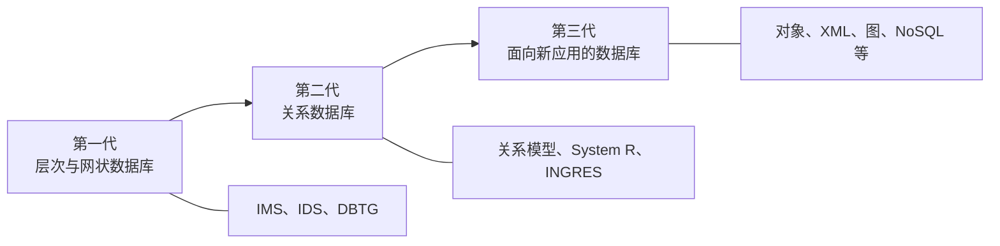

图中的演化不是简单替换：层次和网状模型建立了 DBMS、DBA、三级模式等重要概念；关系模型凭借二维表和数学基础成为主流；新一代技术则面向复杂类型、复杂对象、巨型数据以及数据—对象—知识的统一管理。

### 2. 第一代：层次与网状数据库

1969 年，Rockwell 与 IBM 合作研制了基于层次模型的 IMS（Information Management System），运行于 IBM 360 系列机，用于管理阿波罗登月计划约 200 万个、分散在世界各地制造的零部件资料。课件中的月面宇航员和火箭照片仅用于说明阿波罗任务背景，不增加额外技术信息；IMS 此后仍长期用于相关业务。

几乎同时，Charles Bachman 主持设计了网状数据库 IDS（Integrated Data System）。IDS 于 1964 年推出后成为受欢迎的数据库产品，其设计和实现被许多后续产品仿效。1971 年，CODASYL 下属 DBTG 给出网状数据模型、DDL 与 DML 规范，形成具有里程碑意义的 DBTG 报告，并提出三级模式、DBMS、DBA 等基本概念。Bachman 因网状数据库工作获得 1973 年图灵奖。

### 3. 第二代：关系数据库

1970 年，IBM San Jose 实验室的 Edgar F. Codd 发表 *A Relational Model of Data for Large Shared Data Banks*，提出关系数据模型。原论文页面展示了两个关系实例：

| `supply`：supplier | part | project | quantity |
|---:|---:|---:|---:|
| 1 | 2 | 5 | 17 |
| 1 | 3 | 5 | 23 |
| 2 | 3 | 7 | 9 |
| 2 | 7 | 5 | 4 |
| 4 | 1 | 1 | 12 |

| `component`：part | part | quantity |
|---:|---:|---:|
| 1 | 5 | 9 |
| 2 | 5 | 7 |
| 3 | 5 | 2 |
| 2 | 6 | 12 |
| 3 | 6 | 3 |
| 4 | 7 | 1 |
| 6 | 7 | 1 |

这些表强调用关系表示共享数据；关系模型用二维表取代层次、网状模型中依赖上级指针的组织方式，概念清楚且有严格数学基础，使数据库从实验室走向商业应用。Codd 于 1981 年获得图灵奖。

Codd 1923 年生于英国波特兰岛，在牛津学习数学和化学；二战中任英国皇家空军机长；1948 年加入 IBM；20 世纪 50 年代末为 IBM STRETCH 发明多道程序设计技术；1963 年获硕士学位、1965 年获计算机科学博士学位，后在 IBM San Jose 研究中心从事关系数据管理研究。课件中的黑白照片是 Codd 肖像。

20 世纪 70 年代关系数据库研究的成果包括：

1. 建立关系模型理论基础。
2. 提出关系代数、关系演算、SQL、QBE 等关系数据语言。
3. 研制 System R、INGRES 等原型系统，解决查询优化、并发控制、故障恢复等关键技术。
4. 70 年代后期开始商业化；80 年代新开发的数据库系统几乎都采用关系模型，并进入企业管理、情报检索和辅助决策等领域。

### 4. 新一代数据库技术

传统数据库面对图像、音频、视频、网页、抽象数据类型和无结构超长数据等复杂类型，以及复杂对象、巨型数据库和知识管理的挑战。相应技术包括：

- 面向对象数据库：支持用户自定义类型和运算以表示复杂对象。
- XML 数据库：面向半结构化和非结构化数据。
- 图数据库、嵌入式移动数据库、多媒体数据库、知识数据库。
- NoSQL 数据库。

数据库领域形成了以数据模型和 DBMS 核心技术为主的基础学科，也形成了 DBMS、工具产品和应用解决方案组成的软件产业。课件列出的图灵奖得主还包括 1998 年获奖、以事务处理研究著称的 James Gray；数据库方向的重要会议包括 SIGMOD、ICDE，数据挖掘方向包括 SIGKDD。

### 5. 数据库产品与产业

| 类别 | 产品与课件要点 |
|---|---|
| 商业关系数据库 | Oracle；IBM DB2；Microsoft SQL Server；Sybase |
| 开源关系数据库 | MySQL；PostgreSQL |
| 图数据库 | Neo4j、Dgraph、Nebula Graph |
| NoSQL | MongoDB、CouchDB、Redis |
| 国产数据库 | TiDB（分布式）、OceanBase（分布式）、PolarDB（云原生）、openGauss（关系型） |

Oracle 于 1977 年由 Larry Ellison、Bob Miner、Ed Oates 创建。Oates 读到 Codd 的论文后，团队开始开发商用 RDBMS；1979 年在 PDP-11 上发布整合较完整 SQL 的 Oracle v2（实际是首版），并获得首位客户；1983 年 Oracle v3 用 C 重写，获得关键的可移植性，公司也由 SDL、RSI 最终更名为 Oracle。同年 IBM 发布仅运行于 MVS 的 DB2，Oracle 已取得跨平台先机。课件用 IBM 标志、Codd 论文题名和 Codd 肖像表示“基础创新”，用 Oracle 版本演进类比 GPT-1/2/3、ChatGPT、GPT-4、o1 的产品化迭代；其中 *Attention Is All You Need* 首页和 Ilya Sutskever 肖像只是类比素材。

课件还给出一张 **2020 年 11 月历史快照**，不是当前排名：

| 2020-11 排名 | 2020-10 排名 | 2019-11 排名 | DBMS | 模型 | 2020-11 得分 | 较上月 | 较上年 |
|---:|---:|---:|---|---|---:|---:|---:|
| 1 | 1 | 1 | Oracle | 关系、多模型 | 1345.00 | -23.77 | +8.93 |
| 2 | 2 | 2 | MySQL | 关系、多模型 | 1241.64 | -14.74 | -24.64 |
| 3 | 3 | 3 | Microsoft SQL Server | 关系、多模型 | 1037.64 | -5.48 | -44.27 |
| 4 | 4 | 4 | PostgreSQL | 关系、多模型 | 555.06 | +12.66 | +63.99 |
| 5 | 5 | 5 | MongoDB | 文档、多模型 | 453.83 | +5.81 | +40.64 |
| 6 | 6 | 6 | IBM Db2 | 关系、多模型 | 161.62 | -0.28 | -10.98 |
| 7 | 8 | 8 | Redis | 键值、多模型 | 155.42 | +2.14 | +10.18 |
| 8 | 7 | 7 | Elasticsearch | 搜索引擎、多模型 | 151.55 | -2.29 | +3.15 |
| 9 | 9 | 11 | SQLite | 关系 | 123.31 | -2.11 | +2.29 |
| 10 | 10 | 10 | Cassandra | 宽列 | 118.75 | -0.35 | -4.47 |

另一张 2013—2021 趋势图显示：开源数据库流行度由约 35% 上升至 2021 年 5 月的 50.97%，商业数据库由约 65% 下降至 49.03%，两条曲线在 2021 年前后交叉。该图反映当时趋势，不应当作当前市场统计。

---

## 三、数据库系统的基本概念

### 1. 数据（Data）

> **数据是描述事物的符号记录，是数据库中存储的基本对象。数据与其语义不可分，语义是对数据含义的说明。**

狭义数据主要指数字，早期计算机主要用于科学计算；广义数据还包括文字、图像、声音和视频，现代计算机则大量用于数据处理。

**例**：数字 `93` 本身不足以表达含义，它可以表示课程成绩、某人体重或某届学生人数。记录 `(李明, 男, 1972, 江苏, 计算机系, 1990)` 只有结合“姓名、性别、出生年份、籍贯、院系、入学年份”等语义才能解释。**记录**是计算机表示和存储数据的一种有结构格式。

### 2. 数据库（DB）

> **数据库（Database，DB）是长期存储在计算机内、有组织、可共享的大量数据的集合。**

数据库的基本特征是：按一定数据模型组织、描述和存储；可由不同用户共享；冗余度较小；数据独立性较高；易于扩充。

### 3. 数据库管理系统（DBMS）

> **数据库管理系统（Database Management System，DBMS）是位于用户与操作系统之间的数据管理软件，是大型、复杂的基础软件系统。**

DBMS 的目标是科学地组织、存储数据，并高效地获取、维护数据。它处于“硬件平台 → 操作系统 → 数据库系统/中间件/应用服务器 → 应用软件平台 → 办公、协同等软件产品”的软件栈中，既建立在操作系统之上，又为应用系统提供数据服务。

### 4. 数据库系统（DBS）、应用系统（DBAS）与管理员（DBA）

> **数据库系统（Database System，DBS）是引入数据库后的完整计算机系统，由数据库、DBMS 及其开发工具、应用系统和数据库管理员组成。**

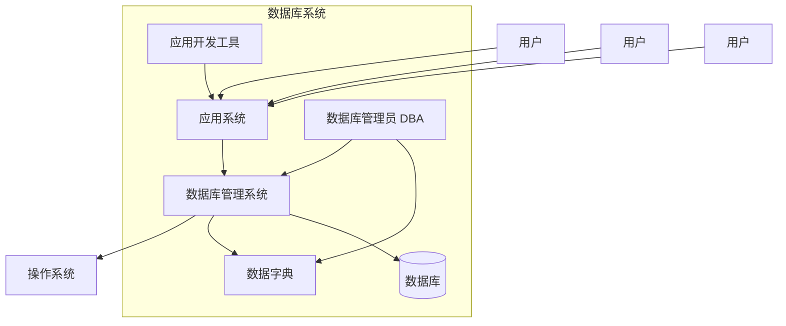

该图表示用户通常通过应用系统访问 DBMS；开发工具用于构建应用；DBA 借助数据字典管理 DBMS 和数据库；DBMS 依赖操作系统管理底层资源。

> **数据库应用系统（DBAS）是在 DBMS 支持下形成的计算机应用系统，是数据库系统与各类用户应用程序的结合。**

Oracle 可在 DBMS 平台上提供财务、制造、人力资源、自动控制、商业交易等不同应用。

DBA 的职责包括：

1. 决定数据库的信息内容和结构。
2. 决定存储结构和存取策略。
3. 定义安全要求和完整性约束。
4. 监控数据库使用与运行。
5. 改进和重组数据库。

DBA 通常在后台维护系统平稳运行并预防灾难，需要深入理解数据库结构和运行方式以及丰富实践经验。

---

## 四、数据管理技术的演进

### 1. 数据管理的含义与动力

> **数据管理是对数据进行分类、组织、编码、存储、检索和维护，涵盖数据处理或计算之外的管理问题。**

其发展由应用需求、计算机硬件和计算机软件共同推动：

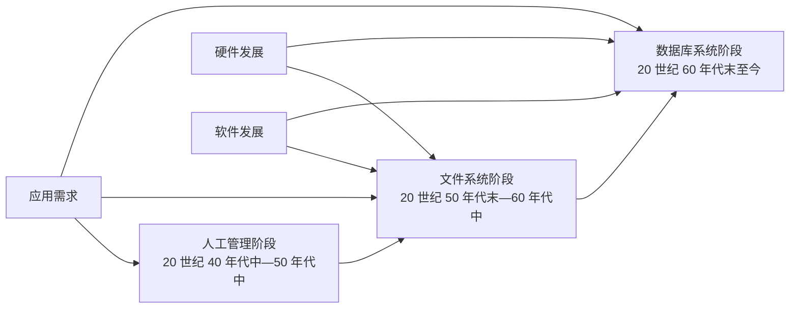

### 2. 三个阶段比较

| 方面 | 人工管理阶段 | 文件系统阶段 | 数据库系统阶段 |
|---|---|---|---|
| 时期 | 40 年代中—50 年代中 | 50 年代末—60 年代中 | 60 年代末以来 |
| 主要需求 | 科学计算 | 科学计算、管理 | 大规模管理 |
| 硬件 | 无直接存取存储设备 | 磁盘、磁鼓 | 大容量磁盘、磁盘阵列 |
| 软件 | 无操作系统 | 有文件系统 | 有 DBMS |
| 处理方式 | 批处理 | 联机实时、批处理 | 联机实时、分布处理、批处理 |
| 数据保存 | 不长期保存 | 可长期保存 | 长期统一管理 |
| 管理者 | 应用程序 | 文件系统 | DBMS |
| 共享与冗余 | 不共享、冗余极大 | 共享性差、冗余大 | 共享性高、冗余低 |
| 独立性 | 无 | 较差 | 较高 |

人工管理中，每个应用程序管理自己的数据集，程序与数据一一绑定。文件系统引入统一存取方法，使数据可以长期保存，但不同文件和应用仍彼此割裂；复杂查询、并发访问、完整性与安全检查都压在应用程序上。数据库系统则让多个应用通过 DBMS 访问共享数据库。

### 3. 文件系统“学生—获奖”案例

课件要求分别用 C/C++ 文件系统和数据库系统实现“学生—获奖”应用：学号唯一，每人最多记录 5 项奖励，要支持插入、按学号查学生、按学号查奖励。示例数据包括：

| 学号 | 姓名 | 性别 | 出生日期 | 主修专业 | 奖励举例 |
|---|---|---|---|---|---|
| 20180001 | 李勇 | 男 | 2000-03-08 | 信息安全 | 2019 全国大学生信息安全竞赛一等奖；2020 萨师煊精英基金特等奖；2020 中国大学生计算机设计大赛一等奖 |
| 20180002 | 刘晨 | 女 | 1999-09-01 | 计算机科学与技术 | 2019 萨师煊精英基金一等奖；2020“互联网+”大学生创新创业大赛一等奖；2021 CCSP 大学生计算机系统与程序设计竞赛一等奖 |
| 20180205 | 陈新奇 | 男 | 2001-11-01 | 信息管理与信息系统 | 2019 北京市三好学生；2021 中国大学生计算机设计大赛一等奖 |
| 20180306 | 赵明 | 男 | 2000-06-12 | 数据科学与大数据技术 | 2019 中国大学生计算机设计大赛一等奖；2021 萨师煊精英基金二等奖；2021 CCSP 一等奖 |

文件系统版本需要自行定义两种记录：

```cpp
#define MAX_AWARD_COUNT 5

typedef struct _student {
    char Sno[10];       // 学号，小于 10 个字符
    char Sname[20];     // 姓名，小于 20 个字符
    char Ssex[2];       // 男或女，1 个字符
    char Sbirthday[11]; // YYYY-MM-DD
    char Smajor[20];    // 专业，小于 20 个字符
} Student;

typedef struct _award {
    char Sno[10];
    int numOfAwards;
    char AName[MAX_AWARD_COUNT][20];
} Award;
```

插入记录时要手工移动文件指针、写入并刷新缓冲区：

```cpp
bool appendToStudent(FILE *student_table, Student *student) {
    if (student == NULL || student_table == NULL) return false;
    fseek(student_table, 0L, SEEK_END);
    fwrite(student, sizeof(Student), 1, student_table);
    fflush(student_table);
    return true;
}

bool appendToAward(FILE *award_table, Award *award) {
    if (award == NULL || award_table == NULL) return false;
    fseek(award_table, 0L, SEEK_END);
    fwrite(award, sizeof(Award), 1, award_table);
    fflush(award_table);
    return true;
}
```

查询时要从头顺序扫描并自行管理内存：

```cpp
Student *searchStudentWithSno(FILE *student_table, char *sno) {
    if (sno == NULL || strlen(sno) == 0 || student_table == NULL) return NULL;
    Student *student = (Student *)calloc(1, sizeof(Student));
    fseek(student_table, 0L, SEEK_SET);
    while (fread(student, sizeof(Student), 1, student_table) == 1) {
        if (strcmp(student->Sno, sno) == 0) return student;
    }
    free(student);
    return NULL;
}

Award *searchAwardsWithSno(FILE *award_table, char *sno) {
    if (sno == NULL || strlen(sno) == 0 || award_table == NULL) return NULL;
    Award *award = (Award *)calloc(1, sizeof(Award));
    fseek(award_table, 0L, SEEK_SET);
    while (fread(award, sizeof(Award), 1, award_table) == 1) {
        if (strcmp(award->Sno, sno) == 0) return award;
    }
    free(award);
    return NULL;
}
```

数据库版本把学生与获奖项目分表，避免固定 `奖励1` 至 `奖励5` 产生大量空值和重复学生信息：

```sql
CREATE TABLE Student (
    Sno       CHAR(10) PRIMARY KEY,
    Sname     CHAR(20),
    Ssex      CHAR(1),
    Sbirthday DATE,
    Smajor    CHAR(20)
);

CREATE TABLE Award (
    Sno       CHAR(10),
    Awardname CHAR(40),
    PRIMARY KEY (Sno, Awardname),
    FOREIGN KEY (Sno) REFERENCES Student(Sno)
);

INSERT INTO Student
VALUES ('20180001', '李勇', '男', '2000-03-08', '信息安全');

INSERT INTO Award
VALUES ('20180001', '2019年全国大学生信息安全竞赛一等奖');

SELECT *
FROM Student
WHERE Sname = '李勇';

SELECT Student.Sno, Sname, Awardname
FROM Student, Award
WHERE Student.Sno = Award.Sno AND Sname = '李勇';
```

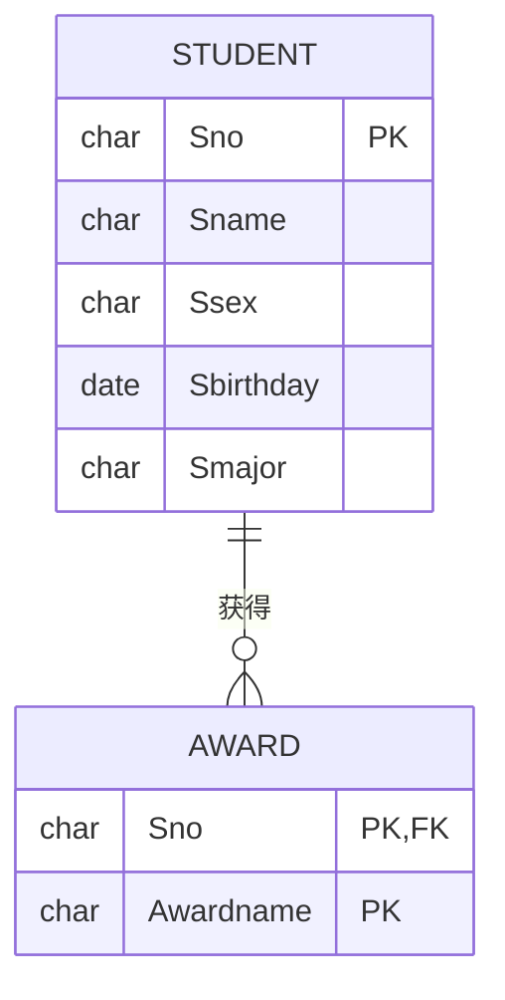

图中学生表保存每名学生一次，奖励表每行保存一项奖励，二者以学号连接。文件系统需要程序员理解记录布局、文件间联系以及 `fopen/fread/fwrite/fseek/fclose` 等低级接口；数据库只需用 DDL 建表、`INSERT` 插入、SQL 声明查询目标，文件组织和关联执行由 DBMS 负责。

---

## 五、数据库系统的特点

### 1. 数据整体结构化

> **整体数据结构化是数据库的主要特征之一。**

文件系统中单个文件内部记录有结构，但文件间缺少显式联系；关系数据库不仅每个表内部有结构，而且能通过共同属性建立整体联系。例如：

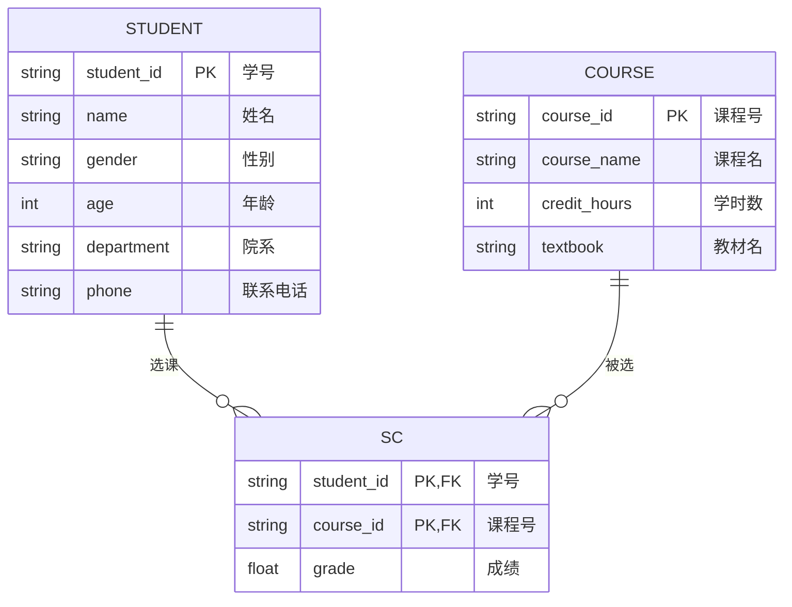

### 2. 结构化、半结构化与非结构化数据

| 类型 | 特征 | 示例 |
|---|---|---|
| 结构化 | 严格符合预定义结构 | 关系数据库表 |
| 半结构化 | 在数据中嵌入自描述结构 | Email、XML、JSON、标签化网页 |
| 非结构化 | 没有统一预定义结构 | 纯文本、图片、视频、音频、日志、博客、推文 |

课件中的连续谱图以左侧 DBMS/表格代表结构化数据，中间网页代表半结构化数据，右侧文档代表非结构化数据，并指出信息检索技术更偏向非结构化一端。另一张 2000—2011 增长图显示结构化数据缓慢增长，而文本、日志、点击流、博客、推文、音视频等半结构化和非结构化数据快速增长并成为主体。

XML 使用标签嵌套表达结构，常与 SOAP Web 服务配合；JSON 以对象和数组表达结构，常用于 REST 服务，MongoDB、Couchbase 等系统可直接管理 JSON 风格文档。课件并列的 XML/JSON 示例表达相同员工信息：Scott Philip（£44k，27 岁）、Tim Henn（£40k，27 岁）、Long Yong（£40k，28 岁）；困惑表情图只是用来引出“半结构化数据如何理解”，没有新增知识。

### 3. 知识图谱：结构化语义联系

知识图谱通过实体、属性和联系对事物建模，为机器提供先验知识；基本表示是 SPO（Subject–Predicate–Object）三元组：

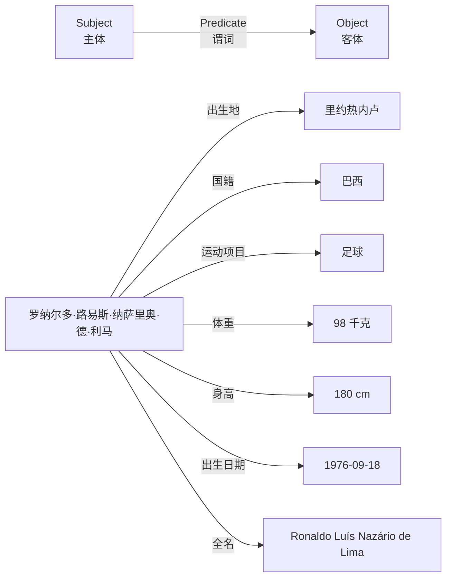

RDF 风格示例为：资源 `www.kg.com/person/1` 通过谓词 `rkg:chineseName` 指向中文姓名“罗纳尔多·路易斯·纳萨里奥·德·利马”。课件中的罗纳尔多照片仅用于确认实体对象；Google 搜索“罗纳尔多”和“C 罗纳度”的知识面板截图说明知识图谱可为搜索结果补充实体消歧、属性和关联人物。

代表性知识图谱如下：

| 名称 | 机构 | 特点/构建方式 | 应用 |
|---|---|---|---|
| Freebase | MetaWeb，2010 年被 Google 收购 | 实体、语义类、属性、关系；自动抽取与人工协同编辑 | Google Search、Google Now |
| Knowledge Vault | Google | 超大规模；源自维基百科、Freebase、网页等 | Google Search、Google Now |
| DBpedia | 莱比锡大学、柏林自由大学、OpenLink Software | 从维基百科抽取实体、语义类、属性、关系 | DBpedia |
| Wikidata | Wikimedia Foundation | 实体、语义类、属性、关系，与维基百科紧密结合；人工协同编辑 | Wikipedia |
| Wolfram Alpha | Wolfram Research | 实体、语义类、属性、关系与知识计算；部分来自 Mathematica 等 | Apple Siri |
| Bing Satori | Microsoft | 实体、语义类、属性、关系、知识计算；自动与人工结合 | Bing、Cortana |
| YAGO | 马克斯·普朗克研究所 | 自动从维基百科、WordNet、GeoNames 抽取 | YAGO |
| Facebook Social Graph | Facebook | Facebook 社交网络数据 | Social Graph Search |
| 百度知识图谱 | 百度 | 搜索结构化数据 | 百度搜索 |
| 搜狗知立方 | 搜狗 | 搜索结构化数据 | 搜狗搜索 |
| ImageNet | 斯坦福大学 | 搜索引擎与 Amazon Mechanical Turk 协作构建 | 计算机视觉应用 |

### 4. 高共享、低冗余、易扩充

数据库从整体角度组织数据，允许多个用户和应用共享。其好处是减少重复存储、避免同一事实在多处出现不相容和不一致，并便于增加新应用。课件以劳资人事数据库同时服务人力资源、工资发放、业务管理、薪酬管理系统为例：多个应用共享一个由数据库管理软件维护的数据源，而不是各自复制数据。

### 5. 数据独立性高

> **物理独立性**：应用程序与磁盘上的物理数据存储相互独立，物理存储方式改变时应用程序不必改变。
>
> **逻辑独立性**：应用程序与数据库逻辑结构相互独立，逻辑结构发生一定变化时用户程序仍可保持不变。

这两种独立性由 DBMS 的二级映像功能保证。

### 6. DBMS 统一管理与控制

1. 数据定义：  
   提供 DDL 及其翻译程序，定义数据库中的数据对象。
2. 数据操纵：  
   提供 DML 及其编译程序，支持查询、插入、删除和修改。
3. 数据组织、存储和管理：  
   分类组织各种数据，表达数据联系，确定文件结构和存取方式，并提供多种存取方法提高效率。
4. 运行控制：  
   保障安全性、完整性、多用户并发访问与故障恢复。
5. 建立和维护：  
   提供批量装载、转储、介质故障恢复、重组织和性能监视等实用程序。

数据库技术的两个总趋势是：从“以计算为中心”转向“以数据为中心”；从应用程序直接使用低级原始接口处理细节，转向由数据管理系统提供高级语义接口并承担处理工作。

---

## 六、数据模型及其组成

### 1. 数据模型的作用与分类

> **数据模型是对现实世界中事物的抽象和模拟，用来在数据库中抽象、表示和处理数据。**

一个好的数据模型应较真实地模拟现实世界、容易被人理解，并便于计算机实现。课件用 Sora 和 Google Veo 的“世界模拟器”宣传图类比“模型是对世界的抽象”，两张图本身不增加数据库定义。

数据模型分为两个层次：

1. 概念模型（信息模型）：  
   按用户观点对数据和信息建模，主要用于数据库设计。
2. 逻辑模型与物理模型：  
   按计算机系统观点建模。逻辑模型包括层次、网状、关系、面向对象等，用于 DBMS 实现；物理模型是最底层抽象，描述数据在磁盘、磁带等介质中的表示与存取方法。

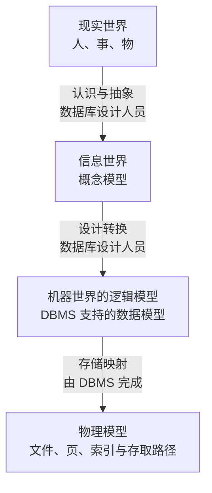

抽象过程的例子是：现实中的人，先抽象为“身高、体重、性别、年龄”等概念属性，再转换为 DBMS 支持的字段及类型，如 `Height real (0,200)`、`Weight real (0,150)`、`Sex bit (0,1)`、`Age int (0,200)`。

### 2. 数据模型的三个组成要素

| 要素 | 含义 | 描述对象 |
|---|---|---|
| 数据结构 | 数据库由什么对象构成、对象间有何联系 | 系统静态特性 |
| 数据操作 | 对对象实例允许执行的操作及规则 | 系统动态特性 |
| 完整性约束 | 限定合法数据库状态和状态变化的规则 | 正确、有效、相容性 |

数据操作包括查询和更新（插入、删除、修改），模型还要规定操作的含义、操作符号、优先级等规则以及实现语言。

> **完整性规则是数据及其联系必须遵守的制约和存储规则，用于限定合法状态及变化。**

通用约束如关系模型中的实体完整性和参照完整性；应用特定约束如“博士生年龄小于 45 岁”“银行账户余额不能低于 1 元”。

最常见的数据模型包括：格式化模型中的层次模型和网状模型，以及关系模型、面向对象模型和对象关系模型。

---

## 七、概念模型与 E-R 方法

### 1. 概念模型的用途

概念模型处于现实世界和机器世界之间，用于信息世界建模，是数据库设计的工具，也是设计人员与用户交流的语言。它应有较强语义表达能力，能直接表达应用语义，同时保持简单、清晰、易懂。

### 2. 信息世界的基本概念

> **实体（Entity）**：客观存在且可相互区别的人、事、物或抽象概念。
>
> **属性（Attribute）**：实体具有的某一特性，一个实体可由多个属性刻画。
>
> **码（Key）**：唯一标识实体的属性集。
>
> **域（Domain）**：属性的取值范围。
>
> **实体型（Entity Type）**：用实体名及属性名集合对同类实体进行抽象和刻画，如 `学生(学号, 姓名, 性别, 出生年月)`。
>
> **实体集（Entity Set）**：同一实体型的实体集合；实体型与实体集类似程序设计中的“类型与实例集合”。
>
> **联系（Relationship）**：现实世界中事物内部或事物之间的关联，在信息世界表现为实体内部和实体之间的联系。

课件的学生实体集实例为：

| 学号 | 姓名 | 性别 | 出生日期 |
|---|---|---|---|
| 20021001 | 张三 | 男 | 1978-05-06 |
| 20021003 | 李四 | 女 | 1980-01-24 |
| 20021004 | 王五 | 男 | 1979-11-12 |

表旁的蓝色问号图片只是课堂提问提示，不含额外知识。

### 3. 两个实体型之间的联系

> **一对一（1:1）**：A 中每个实体至多与 B 中一个实体相联系，反之亦然。例如一个班级至多有一个正班长，一个班长只在一个班级任职。
>
> **一对多（1:n）**：A 中每个实体可与 B 中 $n\ge 0$ 个实体相联系，而 B 中每个实体至多与 A 中一个实体相联系。例如一个班级有多名学生，每个学生只属于一个班级。
>
> **多对多（m:n）**：A 中每个实体可与 B 中多个实体联系，B 中每个实体也可与 A 中多个实体联系。例如学生与课程的选修关系。

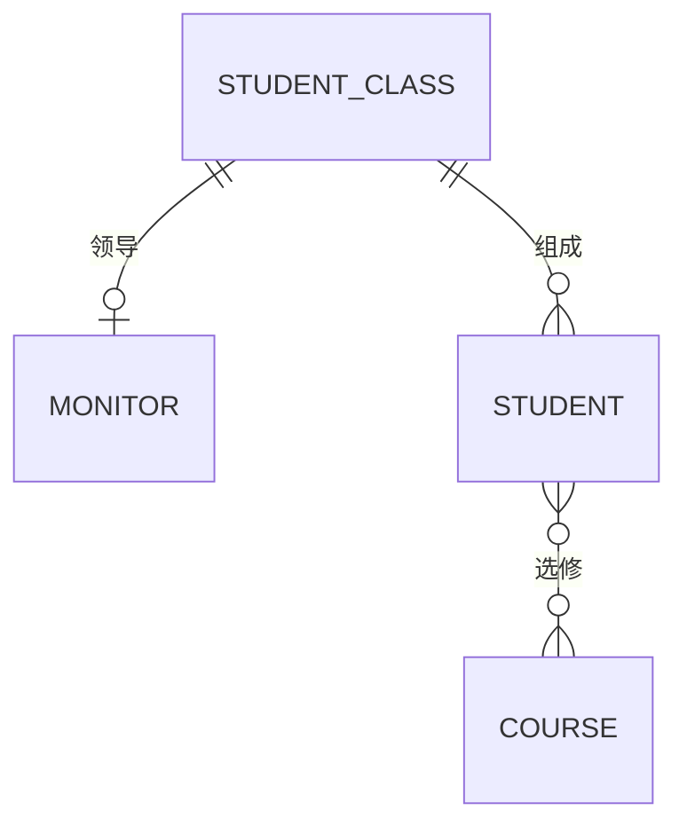

图中 `CLASS—MONITOR` 表示 1:1，`CLASS—STUDENT` 表示 1:n，`STUDENT—COURSE` 表示 m:n；“至多一个”允许某一方暂时没有匹配实体。

### 4. 多元联系与实体内部的联系

两个以上实体型也能形成联系。课件给出两类例子：

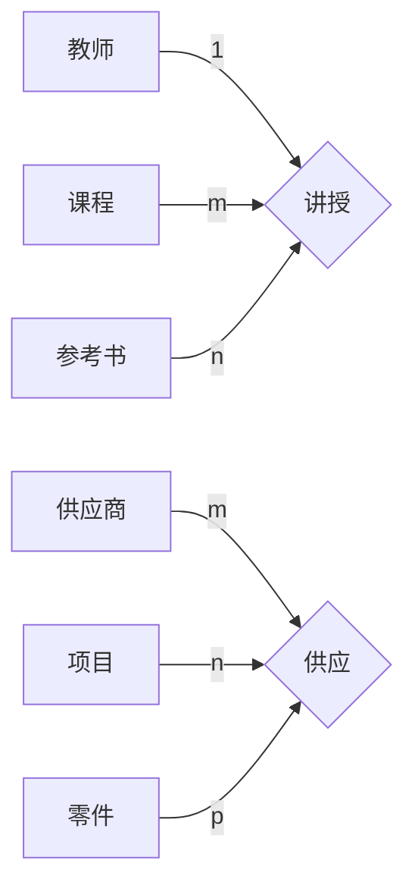

“讲授”联系表示一名教师可讲授多门课程，每门课程可使用多本参考书；“供应”是供应商、项目、零件之间的三元多对多联系：供应商可向多个项目提供多种零件，项目可使用多个供应商提供的零件，每种零件也可由多个供应商供应。

单个实体型内部也可有递归联系。例如职工之间“领导—被领导”为 1:n：一名干部可直接领导多名职工，而一名职工至多被另一名职工直接领导。类似地，还可以设计单实体型内部的 1:1 或 m:n 联系。

### 5. E-R 图表示法

E-R 方法由 Peter Chen 于 1976 年提出，用 E-R 图描述现实世界的概念模型：矩形表示实体型；椭圆表示属性并以无向边连接实体；菱形表示联系，边旁标注 `1`、`n`、`m` 等基数。Mermaid 的 `erDiagram` 将属性列在实体内部，并用端点符号表示基数，语义与传统图一致。

联系也可以有属性。例如学生与课程的“选修”联系具有“成绩”属性，转为关联实体可写为：

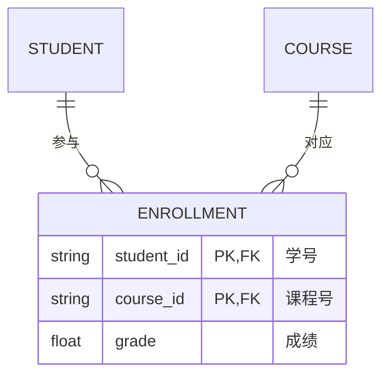

### 6. 工厂物资管理实例

实体及属性如下：

| 实体 | 属性 |
|---|---|
| 仓库 | 仓库号、面积、电话号码 |
| 零件 | 零件号、名称、规格、单价、描述 |
| 供应商 | 供应商号、姓名、地址、电话号码、账号 |
| 项目 | 项目号、预算、开工日期 |
| 职工 | 职工号、姓名、年龄、职称 |

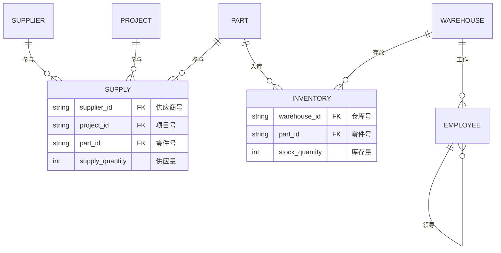

原图中的“供应”是供应商、项目、零件之间基数为 $m:n:p$ 的三元联系并带“供应量”属性；Mermaid 缺少直接的三元菱形，因此用关联实体 `SUPPLY` 重建。“库存”是仓库与零件的 m:n 联系并带库存量；“工作”是仓库 1:n 职工；“领导”是职工内部 1:n 递归联系。

---

## 八、层次模型

### 1. 定义与数据结构

层次模型是最早出现的数据库模型，典型系统是 IBM IMS，用树形结构表示实体及联系。

> **层次模型是满足以下条件的基本层次联系集合：有且只有一个结点没有双亲，称为根结点；根以外的每个结点有且只有一个双亲。**

结点表示记录类型，字段表示属性，结点间连线表示一对多父子联系。常用术语包括根结点、双亲结点、兄弟结点和叶结点。

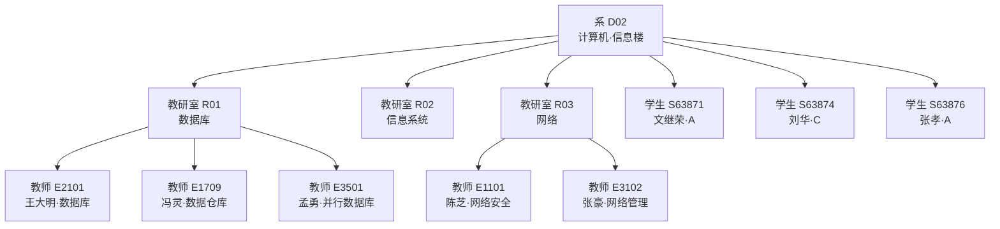

该实例的根是“系”；教研室和学生是其子女、彼此为兄弟；教师是教研室的子女和叶结点。课件中同一实例图出现两次，信息一致。

对应的 JSON 是“系对象包含教研室数组和学生数组，教研室又包含教师数组”。查询教工号 `E1709` 必须沿固定路径逐层遍历：

```python
for dept in d:
    for group in dept['教研室']:
        for teacher in group['教师']:
            if teacher['教工号'] == 'E1709':
                print(teacher)
```

### 2. 层次模型表示多对多联系

树只原生支持一对多。学生与课程 m:n 联系需要拆成一对多，可采用：

1. 冗余结点法：  
   在“学生为根”的树下重复课程记录，或在“课程为根”的树下重复学生记录，产生冗余。
2. 虚拟结点法：  
   在一棵树中保留真实记录，在另一条路径中放置指向真实记录的虚拟子女结点（图中记作 `V.C`、`V.S`），降低重复但增加导航复杂度。

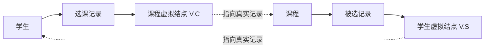

### 3. 操纵、完整性与存储结构

层次模型支持查询、插入、删除、更新。其典型完整性约束是：没有相应双亲不能插入子女；删除双亲时相应子女也一并删除。

层次数据的存储方法包括：

1. 邻接法：  
   按层次树前序遍历顺序邻接存放记录。例如树 `A1 → {B1, B4, B6}`，其中 `B1 → {C3,C5,C7,C14}`、`B4 → {C2,C9}`、`B6 → {C4,C6,C8}`，物理顺序为 `A1,B1,C3,C5,C7,C14,B4,C2,C9,B6,C4,C6,C8,A2,…`。
2. 子女—兄弟链接法：  
   每条记录设置“最左子女”和“最近兄弟”两类指针。由 `A1` 指向 `B1`，再由兄弟链 `B1→B4→B6`；每个 B 结点再指向自身最左 C 子女，C 结点通过兄弟指针串联。
3. 层次序列链接法：  
   按树的前序遍历顺序将所有记录链接起来。

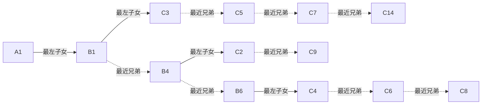

实线表示“最左子女”指针，虚线表示“最近兄弟”指针；层次序列链接法则把同一批结点按 `A1→B1→C3→C5→C7→C14→B4→C2→C9→B6→C4→C6→C8` 串成一条前序链。

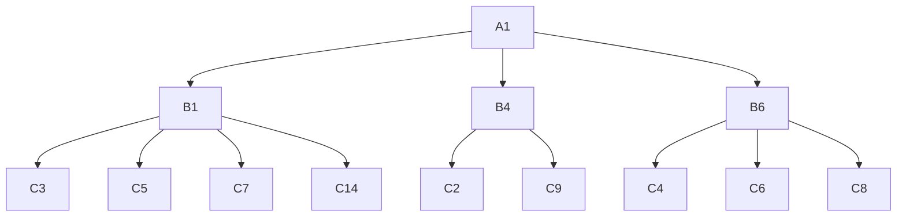

### 4. 优缺点

| 优点 | 缺点 |
|---|---|
| 结构简单清晰 | 多对多联系表示不自然 |
| 查询效率高，性能优于关系模型且不低于网状模型 | 插入、删除限制多，程序复杂 |
| 完整性支持较好 | 查询子女必须经过双亲，依赖路径 |

课件末尾的黑底命令行截图用于展示 JSON/层次数据查询运行效果，没有给出超出上述代码与结果的新知识。

---

## 九、网状模型

### 1. 定义与数据结构

网状数据库系统采用网状模型组织数据，典型方案是 20 世纪 70 年代 DBTG/CODASYL 系统，实际产品包括 IDS、IDMS、DMS1100、IDS/2、IMAGE。

> **网状模型允许一个以上结点没有双亲，一个结点也可以有多个双亲；两个结点之间还可以存在多种复合联系。层次模型是网状模型的特例。**

网状模型仍需将 m:n 联系分解为两个 1:n 联系。学生和课程之间引入“选课”联结记录，包含学号、课程号、成绩：

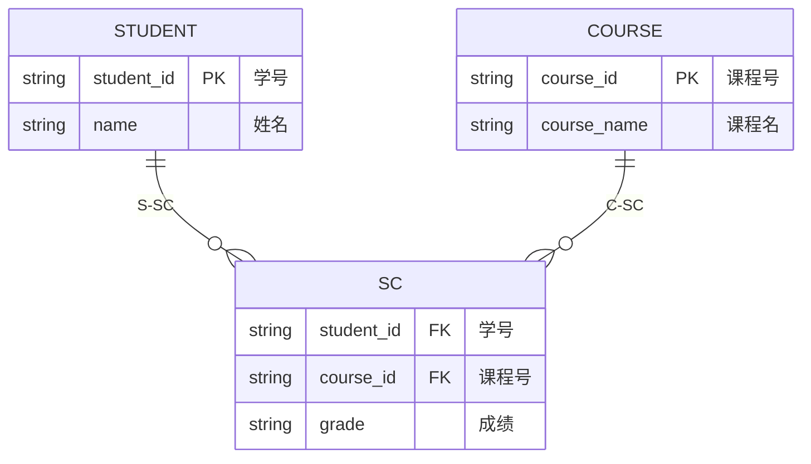

课件具体实例包含：`S1-C1-A`、`S1-C2-A`、`S2-C1-A`、`S2-C3-B`、`S3-C1-B`、`S3-C2-B`、`S4-C1-A`、`S4-C2-A`、`S4-C3-B`。每个学生记录通过实线链接到自己的选课记录，每门课程 `C1/C2/C3` 再通过另一组链接连到对应选课记录；同一实例和链接结构在课件中以多幅图重复出现。

### 2. 操纵、约束与存储

网状系统对数据操纵施加完整性限制：码是唯一标识记录的数据项集合；有些子女记录必须在双亲存在时才能插入，删除双亲时还会级联删除子女，例如学生选课记录。

网状存储的关键是实现记录间联系，常见指针组织包括单向链接、双向链接、环状链接和向首链接。其数据实例图用多组实线、虚线指针连接学生、选课与课程，说明同一选课记录既属于某个学生链，也属于某门课程链。

### 3. 优缺点与格式化模型共同问题

| 优点 | 缺点 |
|---|---|
| 可直接描述一个结点有多个双亲等复杂现实联系 | 结构随应用扩大而迅速复杂，最终用户难掌握 |
| 直接指针导航，性能和存取效率高 | DDL、DML 复杂 |
| 比层次模型表达能力强 | 联系变化需调整指针，扩充和维护复杂 |

层次和网状模型都属于格式化模型，共同问题是联系依赖**存取路径**。应用程序必须知道结构细节并选择路径，增加编程负担；它们也不支持集合处理，通常不能一次处理多个记录。课件再次使用嵌套 Python 循环和黑底运行截图强调这种逐路径导航。

---

## 十、关系模型

### 1. 数据结构与基本术语

关系模型由 Codd 于 1970 年提出。用户视角下，数据逻辑结构是由行和列构成的二维表。

| 学号 | 姓名 | 年龄 | 性别 | 系名 | 年级 |
|---|---|---:|---|---|---:|
| 2005004 | 王小明 | 19 | 女 | 社会学 | 2005 |
| 2005006 | 黄大鹏 | 20 | 男 | 商品学 | 2005 |
| 2005008 | 张文斌 | 18 | 女 | 法律 | 2005 |
| … | … | … | … | … | … |

> **关系（Relation）**对应一张表；**元组（Tuple）**是表的一行；**属性（Attribute）**是表的一列；**主码（Key）**是唯一确定元组的属性组；**域（Domain）**是属性取值范围；**分量**是元组的一个属性值；**关系模式**是对关系的描述，形式为 `关系名(属性1, 属性2, …, 属性n)`。

例如 `学生(学号, 姓名, 年龄, 性别, 系, 年级)`。课件的标注图明确指出：整行是元组，列是属性，单元格是分量，学号列是主码。

### 2. 用关系表示联系

1:n 联系可把“1”端的主码放入“n”端作为外码：

```text
班级(班号, 班主任, 系)
学生(学号, 姓名, 性别, 班号)
```

m:n 联系需要单独建立关联关系：

```text
学生(学号, 姓名, 性别, 班号)
课程(课程号, 课程名, 学分)
选课(学号, 课程号, 成绩)
```

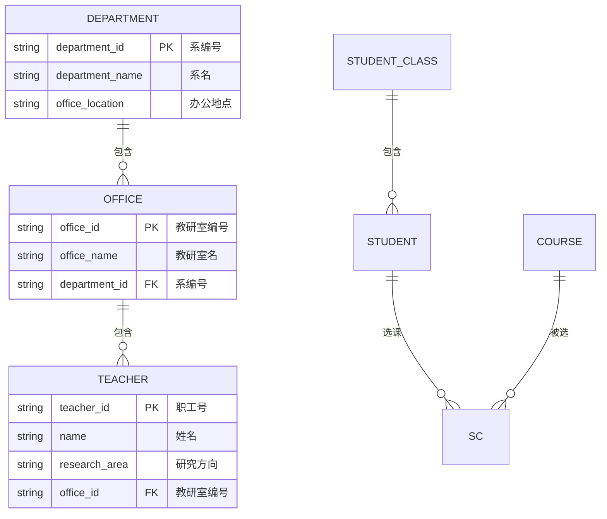

原图把层次式的“系—教研室—教员”和“学生—课程—选课”都转换为若干二维表，说明关系模型以同一种结构表示实体和联系。课件中的教员学生数据库图片进一步给出系、教研室、教师、学生等记录值，其核心模式已在上图与层次模型实例中完整表达。

### 3. 操纵、完整性与存储

关系操作是集合操作，操作对象和结果都是关系，包括查询、插入、删除和更新。关系完整性包括实体完整性、参照完整性和用户定义完整性。

实体及实体间联系都用表表示，表以文件形式存储：有些 DBMS 一个表对应一个操作系统文件，有些 DBMS 使用自己设计的文件结构。用户只看到逻辑关系，不需要直接操作物理指针。

### 4. 优缺点

| 优点 | 缺点 |
|---|---|
| 建立在严格数学概念上 | 存取路径透明，直接执行效率有时不如指针式模型 |
| 能描述 1:1、1:n、m:n 联系 | DBMS 必须进行查询优化，系统实现难度增加 |
| 概念单一：实体、联系和查询结果都用关系表示 |  |
| 用户只说明“做什么”，不必说明“怎么做” |  |
| 数据独立性、安全保密性较好，简化应用开发 |  |

---

## 十一、模型对比与复习

### 1. 三类逻辑模型比较

| 方面 | 层次模型 | 网状模型 | 关系模型 |
|---|---|---|---|
| 基本结构 | 树 | 图/记录间链接 | 二维表/关系 |
| 双亲数量 | 根外恰好一个 | 可为多个 | 不以双亲定义 |
| m:n 表示 | 冗余结点或虚拟结点间接表示 | 联结记录分解为两个 1:n | 关联关系自然表示 |
| 访问方式 | 沿父子路径 | 沿指针网络 | 声明式、集合操作 |
| 数据独立性 | 较低 | 较低 | 较高 |
| 主要优势 | 简单、高效、完整性好 | 表达复杂联系、效率高 | 概念单一、易用、路径透明 |
| 主要问题 | 查询依赖双亲，更新限制多 | 结构和语言复杂、维护难 | 需要 DBMS 做查询优化 |

### 2. 核心结论

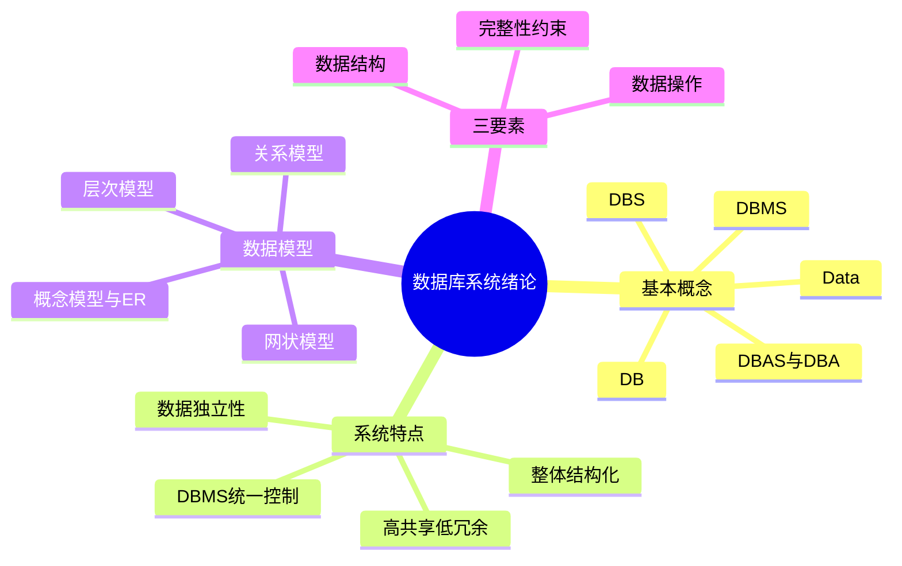

若当前 Obsidian Mermaid 版本不支持 `mindmap`，可按层级文字理解：绪论先界定 Data、DB、DBMS、DBS，再说明数据库系统的结构化、共享、独立与统一控制特征；数据模型由数据结构、操作、约束构成，并分为概念、层次、网状和关系等模型。

---

## 本章小结

| 主题 | 核心结论 |
|---|---|
| 技术演进 | 层次/网状 → 关系 → 面向复杂与新型数据的数据库 |
| 基本对象 | 数据带有语义；数据库是长期、有组织、可共享的数据集合 |
| 系统构成 | 数据库、DBMS/工具、应用系统、DBA |
| 管理演进 | 人工管理 → 文件系统 → 数据库系统 |
| 系统特点 | 整体结构化、高共享低冗余、易扩充、数据独立、统一控制 |
| 数据模型 | 现实抽象工具，由数据结构、数据操作、完整性约束组成 |
| 概念模型 | 用实体、属性、码、域、实体型、实体集和联系描述信息世界 |
| E-R 图 | 明确实体、属性、联系及 1:1、1:n、m:n 基数 |
| 层次/网状 | 指针和路径导向，效率高但表达或维护复杂 |
| 关系模型 | 以表和集合操作统一表示实体与联系，数据独立性高 |

---

## 练习与课后作业

### 1. 课堂思考题

1. 设关系 $R$ 的函数依赖集 $F=\{S\to D,D\to M\}$，关系 $R$ 至多满足 1NF、2NF、3NF 还是 BCNF？
2. 一个数据库只有一张含 1000 条记录的表，不使用游标或索引，如何取出第 5—7 行？
3. 表中只有主键 `ID` 和字段 `NAME`，如何查询拥有两个或更多 `ID` 的 `NAME`？
4. 若自行编写学生与选课管理程序，如何查询学生/教师基本信息、学生全部课程与成绩、某课程不及格名单、教师所授课程与成绩，并在添加记录时检查合法性？
5. 哪些场景不适宜只用文件管理数据？  
   数据量大、关系复杂、多用户共享访问的场景更适合数据库系统。

### 2. 联系类型练习

判断下列实体型之间的联系类型，并说明业务规则：电影—演员、电影—导演、淘宝卖家—物品、淘宝卖家—买家—物品、微信用户内部的好友关系。

### 3. E-R 图练习

1. 工厂产品系统：  
   工厂生产多种产品，产品由不同零件组成，零件可用于不同产品；零件由原料制成，不同零件可使用相同原料；零件按所属产品放入不同仓库，原料按类别放入相应仓库。画 E-R 图并标明基数。
2. 航班系统：  
   旅客属性为身份证号、姓名、住址、电话；航班属性为航班号、起飞日期、起飞时间、飞机型号；旅客可预订某天某航班生成订单，订单含座位号。画 E-R 图。
3. 学校系统：  
   学校有多个系；每系有多个班级，每班有本科生或研究生；每系有多个教研室，每教研室有教授、副教授和讲师；教授、副教授可指导研究生；学生可选修课程。画 E-R 图。
4. 自拟数据库：  
   至少包含三个实体型和两个联系，其中至少一个 m:n 联系；画 E-R 图、层次模型表示及对应实例。

---

## 图片覆盖审计

> 两份 MinerU 文档共引用图片 54 次：绪论（1）35 次、绪论（2）19 次。下表按原文出现顺序记录每张图的承接位置；“文字化”包括对装饰性图片明确说明其用途，最终笔记不需要打开任何 MinerU 图片才能理解知识内容。

### 1. 绪论（1）：35 张

| 序号 | 原图内容 | 转写方式与笔记位置 |
|---:|---|---|
| 1 | OWASP Top 10 2017→2021 变化图 | 文字化主要风险名称及演变，见“一、课程导论” |
| 2 | 阿波罗月面宇航员 | 说明为 IMS 应用背景照片，见“二、第一代数据库” |
| 3 | 阿波罗火箭 | 说明为 IMS 应用背景照片，见“二、第一代数据库” |
| 4 | Codd 关系模型论文首页 | 转写论文题名、作者、年份和意义，见“二、第二代数据库” |
| 5 | Codd 论文中的 `supply`、`component` 关系 | 文字化关系名、属性与关系表示思想，见“二、第二代数据库” |
| 6 | Edgar F. Codd 肖像 | 说明人物身份并整理生平，见“二、第二代数据库” |
| 7 | IBM 标志 | 说明 IBM 与 Codd/System R 的基础创新背景，见“二、数据库产品” |
| 8 | Codd 论文题名局部 | 与第 4 图合并转写，不重复保留截图 |
| 9 | *Attention Is All You Need* 首页 | 说明为“创新—产品化”类比素材，见“二、数据库产品” |
| 10 | 2020 年 11 月 DB-Engines 排名 | 重建为含前 10 名、模型、得分的 Markdown 表格 |
| 11 | 2013—2021 开源/商业数据库趋势 | 转写曲线走向、2021 数值及交叉结论，见“二、数据库产品” |
| 12 | “学生—获奖”需求与样例表 | 重建为需求描述和 4 行 Markdown 数据表，见“四、文件系统案例” |
| 13 | C/C++ 学生、奖励结构体 | 重建为 `cpp` 代码块，字段、长度与注释齐全 |
| 14 | 文件追加学生记录函数 | 重建 `appendToStudent` 代码 |
| 15 | 文件追加获奖记录函数 | 重建 `appendToAward` 代码 |
| 16 | 按学号查学生函数 | 重建 `searchStudentWithSno` 代码 |
| 17 | 按学号查获奖函数 | 重建 `searchAwardsWithSno` 代码 |
| 18 | 学生、学籍、选课等文件树 | 用整体结构化 E-R 图及文件系统局限文字承接，见“五、整体结构化” |
| 19 | 减少冗余的学生表/获奖表 | 重建为关系模式、SQL 表定义和 E-R 图，见“四、文件系统案例” |
| 20 | `CREATE TABLE Student/Award` | 重建完整 SQL DDL |
| 21 | 向两张表插入样例 | 重建两条 `INSERT` 与插入后记录含义 |
| 22 | 查询李勇及其奖励 | 重建单表查询和连接查询 SQL |
| 23 | 文件系统与数据库方式讨论 | 转写低级文件 API 与声明式 SQL 的三点对比 |
| 24 | 结构化—半结构化—非结构化连续谱 | 重建分类表并描述 DBMS/信息检索两端 |
| 25 | 2000—2011 各类数据增长图 | 文字化曲线趋势与列出的数据类型 |
| 26 | 同一员工信息的 XML/JSON | 转写三名员工、工资、年龄及两种格式的结构特点 |
| 27 | 困惑表情 | 明确为课堂引导装饰图，不增加知识 |
| 28 | 罗纳尔多知识图谱 | 用 Mermaid 重绘 7 个属性/关系并配文字说明 |
| 29 | 罗纳尔多照片 | 说明为知识图谱实体对象照片，不增加属性外信息 |
| 30 | SPO 三元组示意 | 用 Mermaid 重绘 `Subject—Predicate→Object` |
| 31 | RDF 中文姓名三元组 | 转写资源、谓词 `rkg:chineseName` 和客体 |
| 32 | 代表性知识图谱表（上） | 重建 Freebase、Knowledge Vault、DBpedia、Wikidata、Wolfram Alpha 表项 |
| 33 | 代表性知识图谱表（下） | 重建 Bing Satori、YAGO、Facebook、百度、搜狗、ImageNet 表项 |
| 34 | Google“罗纳尔多”知识面板 | 文字化搜索中的实体属性与消歧应用 |
| 35 | Google“C 罗纳度”知识面板 | 与第 34 图对照说明实体消歧与关联信息 |

### 2. 绪论（2）：19 张

| 序号 | 原图内容 | 转写方式与笔记位置 |
|---:|---|---|
| 1 | OpenAI Sora 宣传图 | 说明为“模型模拟世界”的类比素材，见“六、数据模型” |
| 2 | Google Veo / World Models 宣传图 | 同上，不将宣传图当作数据库知识 |
| 3 | 现实—信息—机器世界抽象过程 | 用 Mermaid 重绘三级抽象、责任主体和属性类型示例 |
| 4 | 蓝色问号 | 明确为课堂提问装饰图，不增加知识 |
| 5 | 工厂物资管理完整 E-R 图 | 用 Mermaid `erDiagram` 重绘实体、属性承接表、联系、基数和联系属性；补充三元联系说明 |
| 6 | 系—教研室—教师/学生层次实例 | 用 Mermaid 完整重绘所有结点和值 |
| 7 | 层次模型表示学生—课程 m:n | 用 Mermaid 和文字重建冗余结点法、虚拟结点法 |
| 8 | 层次数据库树与邻接序列 | 重绘树并完整列出前序物理顺序 |
| 9 | 子女—兄弟链接法 | 文字化两类指针及 B/C 兄弟链结构 |
| 10 | 层次序列链接法 | 文字化按前序遍历链接全部记录 |
| 11 | 系—教研室—教师/学生实例重复图 | 与第 6 图核对后合并承接，信息一致 |
| 12 | 学生/选课/课程网状模型 | 用 Mermaid 重绘 S-SC、C-SC 两组 1:n 联系 |
| 13 | 网状数据库具体实例 | 转写 9 条学生—课程—成绩记录及两组链接含义 |
| 14 | 子女—兄弟链接图重复 | 与第 9 图核对后合并承接 |
| 15 | 层次链接图重复 | 与第 9、10 图核对后合并承接 |
| 16 | 学生登记表术语标注 | 重建 Markdown 表并定义元组、属性、分量、主码 |
| 17 | 系—教研室—教员关系图 | 用 Mermaid 重绘关系及关系模式、外码 |
| 18 | 子女—兄弟链接图再次重复 | 与第 9 图核对后合并承接 |
| 19 | 网状数据库实例再次重复 | 与第 13 图核对后合并承接 |

审计结果：**54/54 张均已有文字、表格、代码或 Mermaid 承接；18 个 Mermaid 图覆盖了技术演进、DBS 架构、数据管理阶段、E-R、层次、网状、关系和知识图谱等可重建结构；MinerU 图片引用残留数为 0。**
