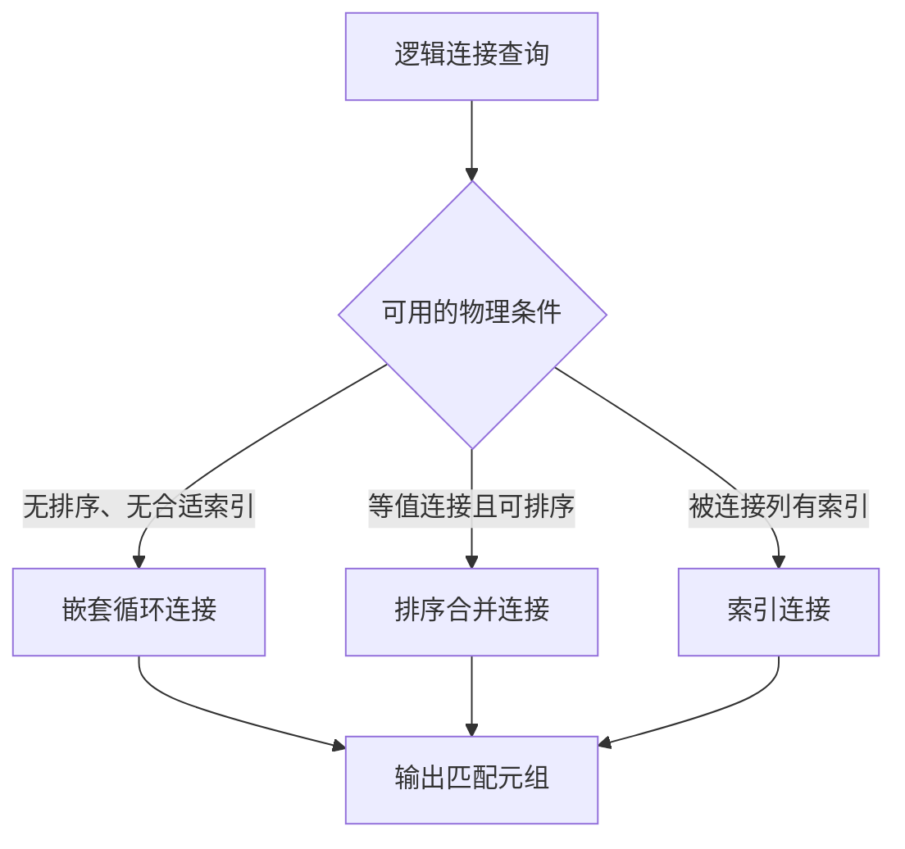
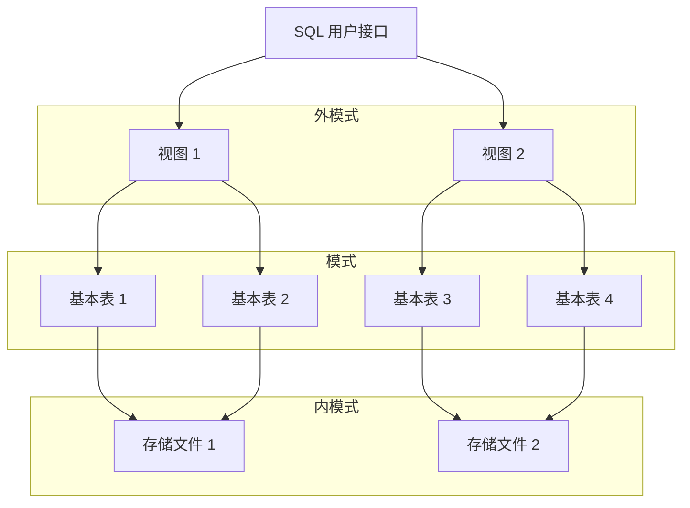
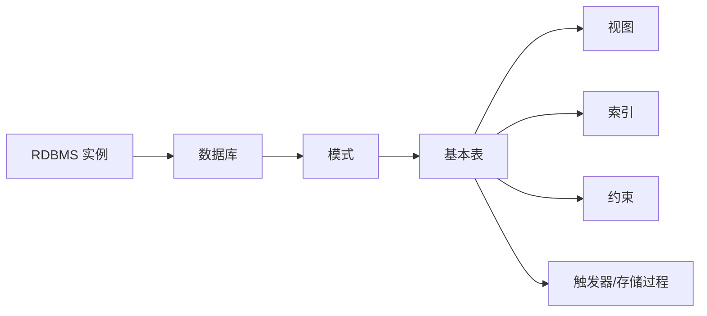
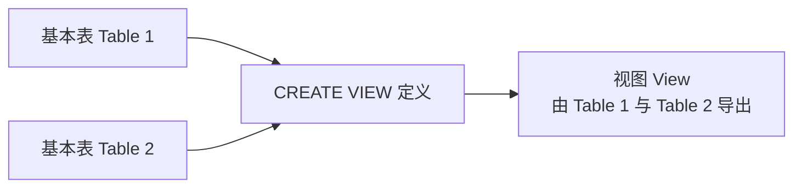

# 3.1 SQL

> 本章整理 SQL 的集合、连接、嵌套与派生表查询，并覆盖模式、基本表、索引、数据更新及视图。重点是把同一查询要求在集合运算、连接、`IN`、`ANY/ALL`、`EXISTS` 等写法之间建立对应关系。

## 主要内容

- 集合查询与连接查询
- 嵌套查询、相关子查询和全称量词
- 派生表与公共表表达式
- 模式、基本表和索引的数据定义
- 插入、修改与删除数据
- 视图的定义、查询、更新限制和作用

---

## 一、集合查询

### 1. 集合操作

SQL 提供三种主要集合操作：

| 操作 | SQL 关键字 | 含义 |
|---|---|---|
| 并 | `UNION` | 合并结果并去重 |
| 并且保留重复 | `UNION ALL` | 合并结果，不去重 |
| 交 | `INTERSECT` | 保留两个结果共有的行 |
| 差 | `EXCEPT` | 保留第一个结果有、第二个结果没有的行 |

> 参加集合运算的查询结果必须具有相同列数，且对应列的数据类型必须相容。

### 2. 并查询

**例**：查询计算机科学系学生以及年龄小于 19 岁的学生。

```sql
SELECT *
FROM Student
WHERE Sdept = 'CS'
UNION
SELECT *
FROM Student
WHERE Sage < 19;
```

等价的单查询写法：

```sql
SELECT DISTINCT *
FROM Student
WHERE Sdept = 'CS' OR Sage < 19;
```

**例**：查询选修 1 号或 2 号课程的学生。

```sql
SELECT Sno FROM SC WHERE Cno = '1'
UNION
SELECT Sno FROM SC WHERE Cno = '2';
```

在同一属性上的“或”也可直接写成：

```sql
SELECT DISTINCT Sno
FROM SC
WHERE Cno = '1' OR Cno = '2';
```

### 3. 交查询

**例**：查询计算机科学系中年龄小于 19 岁的学生。

```sql
SELECT * FROM Student WHERE Sdept = 'CS'
INTERSECT
SELECT * FROM Student WHERE Sage < 19;
```

等价于：

```sql
SELECT *
FROM Student
WHERE Sdept = 'CS' AND Sage < 19;
```

**例**：查询既选修 1 号又选修 2 号课程的学生。

```sql
SELECT Sno FROM SC WHERE Cno = '1'
INTERSECT
SELECT Sno FROM SC WHERE Cno = '2';
```

也可写为：

```sql
SELECT Sno
FROM SC
WHERE Cno = '1'
  AND Sno IN (SELECT Sno FROM SC WHERE Cno = '2');
```

不能写成 `Cno='1' AND Cno='2'`，因为同一条 `SC` 元组中的 `Cno` 不可能同时等于两个不同值。集合运算比对同一元组使用逻辑运算更通用。

### 4. 差查询

**例**：查询计算机科学系中年龄不小于 19 岁的学生。

```sql
SELECT * FROM Student WHERE Sdept = 'CS'
EXCEPT
SELECT * FROM Student WHERE Sage < 19;
```

等价于：

```sql
SELECT *
FROM Student
WHERE Sdept = 'CS' AND Sage >= 19;
```

---

## 二、连接查询

### 1. 基本概念

> **连接查询**是同时涉及多个表的查询。连接条件或连接谓词规定两个表的元组如何匹配。

连接条件常见形式：

```text
[表1.]列1 比较运算符 [表2.]列2
[表1.]列1 BETWEEN [表2.]列2 AND [表2.]列3
```

连接谓词中的列称为连接字段。字段名不必相同，但数据类型必须可比。

**例 33**：查询每个学生及其选修课程情况。

```sql
SELECT Student.*, SC.*
FROM Student, SC
WHERE Student.Sno = SC.Sno;
```

这对应关系代数中的等值连接，结果同时包含 `Student.Sno` 和 `SC.Sno`。

### 2. 连接的物理执行方法

| 方法 | 主要步骤 | 课件给出的复杂度 |
|---|---|---:|
| 嵌套循环 `NESTED-LOOP` | 对表 1 每个元组完整扫描表 2 | $O(MN)$ |
| 排序合并 `SORT-MERGE` | 两表按连接属性排序后同步扫描；常用于等值连接 | $O(M+N)$（不计排序） |
| 索引连接 `INDEX-JOIN` | 在表 2 连接字段建索引，逐个用表 1 的连接值查索引 | $O(M)$（课件简化表示） |

具体执行过程属于内模式，由 RDBMS 对用户屏蔽。用户只面对关系模式和声明式查询，这体现了数据独立性。



文字解读：三条分支是同一逻辑连接的不同物理实现，优化器根据数据规模、排序状态和索引选择其中之一，不改变逻辑结果。

### 3. 等值连接与自然连接

- **等值连接**：连接运算符是 `=`。
- **自然连接**：在等值连接基础上只保留一份公共属性。

**例 34**：用只保留一份学号的形式完成例 33。

```sql
SELECT Student.Sno, Sname, Ssex, Sage, Sdept, Cno, Grade
FROM Student, SC
WHERE Student.Sno = SC.Sno;
```

### 4. 自身连接

> 一个表与自身连接时，必须为同一基本表的不同引用指定别名，并使用别名前缀消除同名属性歧义。

**例 35**：查询每门课程的间接先修课（先修课的先修课）。

```sql
SELECT FIRST.Cno, SECOND.Cpno
FROM Course AS FIRST, Course AS SECOND
WHERE FIRST.Cpno = SECOND.Cno;
```

课件数据的结果：

| Cno | 间接先修课 Cpno |
|---|---|
| 1 | 7 |
| 3 | 5 |
| 5 | 6 |

### 5. 外连接

普通连接只输出满足条件的元组；外连接以指定关系为主体，把未匹配元组也输出，并在另一侧属性上填 `NULL`。

**例 36**：查询每个学生及其选修课程，未选课学生也保留。

```sql
SELECT Student.Sno, Sname, Ssex, Sage, Sdept, Cno, Grade
FROM Student
LEFT OUTER JOIN SC ON Student.Sno = SC.Sno;
```

未选课的王敏、张立仍出现在结果中，`Cno`、`Grade` 为 `NULL`。

课件图片对四种连接的集合范围进行了比较，已转写如下：

| 连接 | 结果范围（设两表元组集合为 $T_1,T_2$） | SQL |
|---|---|---|
| 内连接 | 只保留连接条件匹配的交叠部分 | `INNER JOIN` |
| 左外连接 | 交叠部分 + 左表全部未匹配元组 | `LEFT [OUTER] JOIN` |
| 右外连接 | 交叠部分 + 右表全部未匹配元组 | `RIGHT [OUTER] JOIN` |
| 全外连接 | 匹配部分 + 两表各自未匹配元组 | `FULL [OUTER] JOIN` |

对应语法：

```sql
FROM Student LEFT  OUTER JOIN SC ON Student.Sno = SC.Sno
FROM Student RIGHT OUTER JOIN SC ON Student.Sno = SC.Sno
FROM Student FULL  OUTER JOIN SC ON Student.Sno = SC.Sno
FROM Student INNER JOIN SC ON Student.Sno = SC.Sno
```

最后一种等价于：

```sql
FROM Student, SC
WHERE Student.Sno = SC.Sno
```

### 6. 复合条件与多表连接

**例 37**：查询选修 2 号课程且成绩在 90 分以上的学生学号和姓名。

```sql
SELECT Student.Sno, Sname
FROM Student, SC
WHERE Student.Sno = SC.Sno
  AND SC.Cno = '2'
  AND SC.Grade > 90;
```

**例 38**：查询每个学生的学号、姓名、课程名及成绩。

```sql
SELECT Student.Sno, Sname, Cname, Grade
FROM Student, SC, Course
WHERE Student.Sno = SC.Sno
  AND SC.Cno = Course.Cno;
```

### 7. 银行数据库连接练习

模式：

```text
branch(branch_name, branch_city, assets)
customer(customer_name, street, city)
account(account_no, branch_name, balance)
loan(loan_no, branch_name, amount)
depositor(customer_name, account_no)
borrower(customer_name, loan_no)
```

**同时有存款和贷款的客户**：

```sql
SELECT DISTINCT customer_name FROM depositor
INTERSECT
SELECT DISTINCT customer_name FROM borrower;
```

连接写法：

```sql
SELECT DISTINCT D.customer_name
FROM depositor AS D, borrower AS B
WHERE D.customer_name = B.customer_name;
```

**在 Brooklyn 的支行有存款账户的客户**：

```sql
SELECT DISTINCT D.customer_name
FROM depositor AS D, account AS A, branch AS B
WHERE D.account_no = A.account_no
  AND A.branch_name = B.branch_name
  AND B.branch_city = 'Brooklyn';
```

**在 Brooklyn 的支行同时有存款和贷款的客户**：分别查询有存款者和有贷款者，再用 `INTERSECT` 求交。

---

## 三、嵌套查询基础

### 1. 查询块与嵌套查询

> 一个 `SELECT-FROM-WHERE` 语句称为一个**查询块**。把查询块嵌套在另一个查询块的 `WHERE` 或 `HAVING` 条件中，就形成嵌套查询。

```sql
SELECT Sname
FROM Student
WHERE Sno IN (
  SELECT Sno
  FROM SC
  WHERE Cno = '2'
);
```

### 2. 不相关与相关子查询

| 类型 | 子查询是否依赖外层元组 | 典型求解方式 |
|---|---|---|
| 不相关子查询 | 否 | 由内向外，子查询通常只执行一次 |
| 相关子查询 | 是 | 对外层每个元组，用其相关属性求解一次内层查询 |

### 3. `IN` 谓词

**例 39**：查询与“刘晨”同系的学生。

```sql
SELECT Sno, Sname, Sdept
FROM Student
WHERE Sdept IN (
  SELECT Sdept
  FROM Student
  WHERE Sname = '刘晨'
);
```

子查询先返回刘晨所在系 `IS`，外层再查询该系学生。它是不相关子查询。自身连接等价写法：

```sql
SELECT S1.Sno, S1.Sname, S1.Sdept
FROM Student AS S1, Student AS S2
WHERE S1.Sdept = S2.Sdept
  AND S2.Sname = '刘晨';
```

若已知“刘晨”唯一且每个学生恰属一个系，子查询只返回单值，可用 `=` 代替 `IN`。子查询必须位于比较符右侧；把 `(SELECT ...) = Sdept` 写在左侧不符合课件要求的写法。

课件图片同时给出了例 39 的 `Student` 数据，已转写如下：

| Sno | Sname | Ssex | Sage | Sdept |
|---|---|---|---:|---|
| 95001 | 李勇 | 男 | 20 | CS |
| 95002 | 刘晨 | 女 | 19 | IS |
| 95003 | 王敏 | 女 | 18 | MA |
| 95004 | 张立 | 男 | 19 | IS |

**例 40**：查询选修“信息系统”课程的学生学号和姓名。

```sql
SELECT Sno, Sname
FROM Student
WHERE Sno IN (
  SELECT Sno
  FROM SC
  WHERE Cno IN (
    SELECT Cno
    FROM Course
    WHERE Cname = '信息系统'
  )
);
```

求解顺序：先从 `Course` 得到 3 号课程，再从 `SC` 得到选修者学号，最后从 `Student` 取学号、姓名。连接等价写法：

```sql
SELECT Student.Sno, Student.Sname
FROM Student, SC, Course
WHERE Student.Sno = SC.Sno
  AND SC.Cno = Course.Cno
  AND Course.Cname = '信息系统';
```

---

## 四、`ANY`、`ALL` 与比较子查询

### 1. 语义

- `ANY` 或 `SOME`：与子查询结果中的**至少一个**值比较成立。
- `ALL`：与子查询结果中的**所有**值比较成立。

| 表达式 | 含义 | 常用等价形式 |
|---|---|---|
| `= ANY` | 等于某一个值 | `IN` |
| `<> ALL` | 不等于任何值 | `NOT IN` |
| `< ANY` | 小于某个值 | `< MAX(...)` |
| `<= ANY` | 小于等于某个值 | `<= MAX(...)` |
| `> ANY` | 大于某个值 | `> MIN(...)` |
| `>= ANY` | 大于等于某个值 | `>= MIN(...)` |
| `< ALL` | 小于所有值 | `< MIN(...)` |
| `<= ALL` | 小于等于所有值 | `<= MIN(...)` |
| `> ALL` | 大于所有值 | `> MAX(...)` |
| `>= ALL` | 大于等于所有值 | `>= MAX(...)` |

`= ALL` 通常没有实际意义；`<> ANY` 只需不等于其中某一个值，一般也不是用户真正想表达的“均不等于”。

### 2. `ANY` 例题

**例 42**：查询其他系中比计算机科学系某一学生年龄小的学生姓名和年龄。

```sql
SELECT Sname, Sage
FROM Student
WHERE Sage < ANY (
  SELECT Sage FROM Student WHERE Sdept = 'CS'
)
AND Sdept <> 'CS';
```

若 CS 系年龄集合为 `{20,19}`，则外层条件等价于年龄小于其中最大值。聚集函数写法：

```sql
SELECT Sname, Sage
FROM Student
WHERE Sage < (SELECT MAX(Sage) FROM Student WHERE Sdept = 'CS')
  AND Sdept <> 'CS';
```

### 3. `ALL` 例题

**例 43**：查询其他系中比计算机科学系所有学生都年轻的学生。

```sql
SELECT Sname, Sage
FROM Student
WHERE Sage < ALL (
  SELECT Sage FROM Student WHERE Sdept = 'CS'
)
AND Sdept <> 'CS';
```

聚集函数写法：

```sql
SELECT Sname, Sage
FROM Student
WHERE Sage < (SELECT MIN(Sage) FROM Student WHERE Sdept = 'CS')
  AND Sdept <> 'CS';
```

### 4. 银行数据库练习

用子查询求解并判断相关性：

1. 找出资产至少比 Brooklyn 某一家支行多的支行名；要求使用 `>= ANY`。
2. 找出拥有最高存款余额账户的分行名。
3. 找出平均存款余额最高的分行名；提示用 `ANY/ALL` 表示“最高”。
4. 找出贷款额高于所在支行平均贷款额的客户；提示使用多重相关子查询。

---

## 五、相关子查询

### 1. 每个学生高于自身平均成绩的课程

**例 41**：找出每个学生成绩不低于其本人选课平均成绩的课程号。

```sql
SELECT x.Sno, x.Cno
FROM SC AS x
WHERE x.Grade >= (
  SELECT AVG(y.Grade)
  FROM SC AS y
  WHERE y.Sno = x.Sno
);
```

`x`、`y` 是同一关系的两个元组变量。内层查询依赖外层 `x.Sno`，因此是相关子查询。

对每个外层元组，RDBMS 可按如下逻辑求解：

1. 取 `x` 的一个元组，把其 `Sno` 传入内层查询。
2. 计算该学生的平均成绩。
3. 判断 `x.Grade >= 平均成绩`，为真则输出 `(Sno,Cno)`。
4. 对外层下一元组重复。

课件示例结果为：

```text
(200215121, 1)
(200215121, 3)
(200215122, 2)
```

对应的过程式伪代码：

```python
results = []
for x in SC:
    avg_grade = AVG([y.grade for y in SC if y.Sno == x.Sno])
    if x.grade >= avg_grade:
        results.append((x.Sno, x.Cno))
```

### 2. 与程序语言嵌套循环的区别

相关子查询在概念上类似内层计算依赖外层循环变量的嵌套循环；不相关子查询类似内层结果与外层变量无关，可以预先计算一次。实际 RDBMS 可以由优化器改写执行计划，不必机械逐元组执行。

---

## 六、`EXISTS`、`NOT EXISTS` 与全称量词

### 1. 基本语义

> `EXISTS` 子查询不返回供外层使用的具体数据，只产生真假值。子查询结果非空则为真，空则为假；`NOT EXISTS` 相反。

因此 `EXISTS` 子查询的目标列表通常写 `SELECT *`，列名不影响真假判断。

### 2. 存在与不存在

**例 44**：查询选修 1 号课程的学生姓名。

```sql
SELECT S.Sname
FROM Student AS S
WHERE EXISTS (
  SELECT *
  FROM SC
  WHERE SC.Sno = S.Sno AND SC.Cno = '1'
);
```

连接等价写法：

```sql
SELECT DISTINCT S.Sname
FROM Student AS S, SC
WHERE S.Sno = SC.Sno AND SC.Cno = '1';
```

**例 45**：查询没有选修 1 号课程的学生姓名。

```sql
SELECT S.Sname
FROM Student AS S
WHERE NOT EXISTS (
  SELECT *
  FROM SC
  WHERE SC.Sno = S.Sno AND SC.Cno = '1'
);
```

### 3. 用 `EXISTS` 替换 `IN`

所有带 `IN`、比较运算符、`ANY`、`ALL` 的子查询都可以改写为 `EXISTS`；但某些 `EXISTS/NOT EXISTS` 查询不能等价替换为其他形式。

例 39 的 `EXISTS` 写法：

```sql
SELECT S1.Sname
FROM Student AS S1
WHERE EXISTS (
  SELECT *
  FROM Student AS S2
  WHERE S2.Sdept = S1.Sdept
    AND S2.Sname = '刘晨'
);
```

课件图片在该例旁再次列出了 Student 表，含义是：外层逐个取学生，内层判断是否存在一个叫刘晨且系别与其相同的学生。该表数据已在“三、3”完整转写。

### 4. 只有存款、没有贷款的客户

三种等价思路：

```sql
SELECT DISTINCT customer_name
FROM depositor
WHERE customer_name NOT IN (
  SELECT customer_name FROM borrower
);
```

```sql
SELECT DISTINCT D.customer_name
FROM depositor AS D
WHERE NOT EXISTS (
  SELECT * FROM borrower AS B
  WHERE B.customer_name = D.customer_name
);
```

```sql
SELECT DISTINCT customer_name FROM depositor
EXCEPT
SELECT DISTINCT customer_name FROM borrower;
```

### 5. 用双重 `NOT EXISTS` 表达“全部”

SQL 没有直接的全称量词 $\forall$，利用逻辑等价式：

$$
(\forall x)P(x)\equiv\neg(\exists x\neg P(x)).
$$

**例 46**：查询选修了全部课程的学生姓名。等价描述是“找不到一门课程是该学生没有选修的”。

```sql
SELECT S.Sname
FROM Student AS S
WHERE NOT EXISTS (
  SELECT *
  FROM Course AS C
  WHERE NOT EXISTS (
    SELECT *
    FROM SC
    WHERE SC.Sno = S.Sno
      AND SC.Cno = C.Cno
  )
);
```

外层 `NOT EXISTS` 否定“存在未选课程”，内层 `NOT EXISTS` 判断某一课程是否缺少对应选课元组。

### 6. Brooklyn 所有分行都有存款的客户

双重 `NOT EXISTS` 写法：

```sql
SELECT DISTINCT C.customer_name
FROM customer AS C
WHERE NOT EXISTS (
  SELECT *
  FROM branch AS B
  WHERE B.branch_city = 'Brooklyn'
    AND NOT EXISTS (
      SELECT *
      FROM depositor AS D, account AS A
      WHERE D.account_number = A.account_number
        AND D.customer_name = C.customer_name
        AND A.branch_name = B.branch_name
    )
);
```

差集写法把条件理解为集合包含：`Brooklyn 的全部分行 ⊆ 该客户有存款的分行`。

```sql
SELECT DISTINCT C.customer_name
FROM customer AS C
WHERE NOT EXISTS (
  (SELECT branch_name
   FROM branch
   WHERE branch_city = 'Brooklyn')
  EXCEPT
  (SELECT A.branch_name
   FROM depositor AS D, account AS A
   WHERE D.account_number = A.account_number
     AND D.customer_name = C.customer_name)
);
```

---

## 七、派生表与公共表表达式

### 1. `FROM` 子句中的派生表

子查询还可出现在 `FROM` 中，生成供主查询使用的临时派生表。

**例**：找出每个学生不低于其本人平均成绩的课程号。

```sql
SELECT SC.Sno, SC.Cno
FROM SC,
     (SELECT Sno, AVG(Grade) AS avg_grade
      FROM SC
      GROUP BY Sno) AS Avg_sc
WHERE SC.Sno = Avg_sc.Sno
  AND SC.Grade >= Avg_sc.avg_grade;
```

### 2. `WITH` 公共表表达式

```sql
WITH Avg_sc AS (
  SELECT Sno, AVG(Grade) AS avg_grade
  FROM SC
  GROUP BY Sno
)
SELECT SC.Sno, SC.Cno
FROM SC, Avg_sc
WHERE SC.Sno = Avg_sc.Sno
  AND SC.Grade >= Avg_sc.avg_grade;
```

---

## 八、SQL 数据库体系结构

### 1. 三级模式对应

SQL 支持关系数据库的三级模式：外模式对应视图，模式对应基本表，内模式对应存储文件和物理组织。



文字解读：用户通过 SQL 面向一个或多个视图；视图由基本表导出；基本表的数据最终按内模式映射到存储文件。映射方向由外向内，不同层次可相对独立地变化。

### 2. 数据库对象层次



一个 RDBMS 实例可含多个数据库；一个数据库可含多个模式；一个模式可含多个基本表；基本表可关联视图、索引、约束、触发器和存储过程等对象。

---

## 九、模式与基本表定义

### 1. 创建与删除模式

模式是数据库对象的命名空间。

```sql
CREATE SCHEMA schema_name AUTHORIZATION user_name;
```

**例 1**：

```sql
CREATE SCHEMA "S-T" AUTHORIZATION WANG;
```

若省略模式名，则模式名隐含为用户名：

```sql
CREATE SCHEMA AUTHORIZATION WANG;
```

`CREATE SCHEMA` 还可以包含 `CREATE TABLE`、`CREATE VIEW` 和 `GRANT` 子句。例如：

```sql
CREATE SCHEMA TEST AUTHORIZATION ZHANG
CREATE TABLE TAB1 (
  COL1 SMALLINT,
  COL2 INT,
  COL3 CHAR(20),
  COL4 NUMERIC(10, 3),
  COL5 DECIMAL(5, 2)
);
```

删除模式：

```sql
DROP SCHEMA schema_name CASCADE;
DROP SCHEMA schema_name RESTRICT;
```

- `CASCADE`：同时删除模式中的全部对象。
- `RESTRICT`：模式仍含对象时拒绝删除。

### 2. 创建基本表

```sql
CREATE TABLE table_name (
  column_name data_type [column_constraint],
  ...,
  [table_constraint]
);
```

涉及多个属性的完整性约束必须写成表级约束；单属性约束可写为列级或表级。

**例 5：Student**

```sql
CREATE TABLE Student (
  Sno   CHAR(9)  PRIMARY KEY,
  Sname CHAR(20) UNIQUE,
  Ssex  CHAR(2),
  Sage  SMALLINT,
  Sdept CHAR(20)
);
```

**例 6：Course**

```sql
CREATE TABLE Course (
  Cno     CHAR(4) PRIMARY KEY,
  Cname   CHAR(40),
  Cpno    CHAR(4),
  Ccredit SMALLINT,
  FOREIGN KEY (Cpno) REFERENCES Course(Cno)
);
```

`Cpno` 是引用本表 `Cno` 的外码。

**例 7：SC**

```sql
CREATE TABLE SC (
  Sno   CHAR(9),
  Cno   CHAR(4),
  Grade SMALLINT,
  PRIMARY KEY (Sno, Cno),
  FOREIGN KEY (Sno) REFERENCES Student(Sno),
  FOREIGN KEY (Cno) REFERENCES Course(Cno)
);
```

复合主码必须写成表级约束。课件还指出 SQL Server 可在单个外码列上使用列级 `REFERENCES Student(Sno)` 写法。

### 3. 常用数据类型

| 数据类型 | 含义 |
|---|---|
| `CHAR(n)` | 长度为 $n$ 的定长字符串 |
| `VARCHAR(n)` | 最大长度为 $n$ 的变长字符串 |
| `INT` / `INTEGER` | 长整数 |
| `SMALLINT` | 短整数 |
| `NUMERIC(p,d)` | 共 $p$ 位数字、小数后 $d$ 位的定点数 |
| `REAL` | 取决于机器精度的浮点数 |
| `DOUBLE PRECISION` | 双精度浮点数 |
| `FLOAT(n)` | 精度至少为 $n$ 位数字的浮点数 |
| `DATE` | 日期，格式 `YYYY-MM-DD` |
| `TIME` | 时间，格式 `HH:MM:SS` |

### 4. 模式与表的归属

每个基本表属于一个模式。可以：

1. 在表名前显式指定模式，如 `CREATE TABLE "S-T".Student (...)`；
2. 在 `CREATE SCHEMA` 中同时创建表；
3. 预先设置当前模式，建表时省略模式名。

### 5. 修改基本表

```sql
ALTER TABLE table_name ADD new_column data_type [constraint];
ALTER TABLE table_name DROP constraint_name;
ALTER TABLE table_name ALTER COLUMN column_name data_type;
```

**例 8**：增加入学日期列。新列对已有元组取空值。

```sql
ALTER TABLE Student ADD S_entrance DATE;
```

**例 9**：修改年龄的数据类型。

```sql
ALTER TABLE Student ALTER COLUMN Sage INT;
```

**例 10**：课程名必须唯一。

```sql
ALTER TABLE Course ADD UNIQUE (Cname);
```

### 6. 删除基本表

```sql
DROP TABLE table_name RESTRICT;
DROP TABLE table_name CASCADE;
```

- `RESTRICT`：有外码、视图等依赖对象时拒绝删除。
- `CASCADE`：删除表及相关依赖对象；表定义、数据及其索引、视图、触发器等通常一并删除。

若存在视图 `IS_Student` 依赖 `Student`，执行 `DROP TABLE Student RESTRICT` 会报依赖错误。

---

## 十、索引

### 1. 目的与实现

- 建立索引用于加快查询。
- DBA 或表属主可建立索引；DBMS 通常会自动为 `PRIMARY KEY`、`UNIQUE` 建索引。
- 索引由 DBMS 自动维护，并由优化器自动决定是否使用。
- 常见实现是 B+ 树和散列索引：B+ 树动态平衡并适合范围查询，散列索引等值查找快。
- 索引属于内模式实现技术。

### 2. 建立索引

```sql
CREATE [UNIQUE] [CLUSTER] INDEX index_name
ON table_name (column_name [ASC|DESC], ...);
```

**例 13**：

```sql
CREATE CLUSTER INDEX Stusname ON Student(Sname);
```

聚簇索引适合经常查询的列；一个基本表最多一个，频繁更新的列不宜建立聚簇索引。

**例 14**：

```sql
CREATE UNIQUE INDEX Stusno ON Student(Sno);
CREATE UNIQUE INDEX Coucno ON Course(Cno);
CREATE UNIQUE INDEX SCno ON SC(Sno ASC, Cno DESC);
```

---

## 十一、数据更新

### 1. 插入元组

```sql
INSERT INTO table_name [(column1, column2, ...)]
VALUES (value1, value2, ...);
```

**例 1**：

```sql
INSERT INTO Student (Sno, Sname, Ssex, Sdept, Sage)
VALUES ('200215128', '陈冬', '男', 'IS', 18);
```

**例 2**：按表定义顺序插入完整元组。

```sql
INSERT INTO Student
VALUES ('200215126', '张成民', '男', 18, 'CS');
```

**例 3**：省略 `Grade`，该列自动取 `NULL`。

```sql
INSERT INTO SC (Sno, Cno)
VALUES ('200215128', '1');
```

也可显式插入 `NULL`。

### 2. 插入子查询结果

```sql
INSERT INTO table_name [(column1, column2, ...)]
SELECT ...;
```

**例 4**：保存各系学生平均年龄。

```sql
CREATE TABLE Dept_age (
  Sdept   CHAR(15),
  Avg_age SMALLINT
);

INSERT INTO Dept_age (Sdept, Avg_age)
SELECT Sdept, AVG(Sage)
FROM Student
GROUP BY Sdept;
```

### 3. 修改数据

```sql
UPDATE table_name
SET column_name = expression, ...
[WHERE condition];
```

```sql
UPDATE Student SET Sage = 22 WHERE Sno = '200215121';
UPDATE Student SET Sage = Sage + 1;
```

**例 7**：把计算机科学系学生的全部成绩置 0。课件中的 `SELETE` 是 OCR 错误，已按原义修正为 `SELECT`。

```sql
UPDATE SC
SET Grade = 0
WHERE 'CS' = (
  SELECT Sdept
  FROM Student
  WHERE Student.Sno = SC.Sno
);
```

### 4. 删除数据

```sql
DELETE FROM table_name [WHERE condition];
```

省略 `WHERE` 会删除全部元组，但表定义仍保留。

```sql
DELETE FROM Student WHERE Sno = '200215128';
DELETE FROM SC;
```

**例 10**：删除计算机科学系学生的选课记录。

```sql
DELETE FROM SC
WHERE 'CS' = (
  SELECT Sdept
  FROM Student
  WHERE Student.Sno = SC.Sno
);
```

RDBMS 在执行插入、修改、删除时会检查实体完整性、主码约束、`NOT NULL`、`UNIQUE` 与值域等规则。

---

## 十二、视图

### 1. 特点与操作

> **视图**是从一个或多个基本表或视图导出的虚表。数据库只保存视图定义，不独立保存其查询结果；基表数据变化后，再次查询视图会得到随之变化的数据。

基于视图可以执行查询、删除、受限更新，并可继续定义新视图。

课件图片展示了两张基本表经 `CREATE VIEW` 导出一个视图，重绘如下：



文字解读：两张基表沿箭头输入视图定义；视图节点只保存定义和映射关系，查询时才从基表取得数据，不是基表数据的静态副本。

### 2. 建立视图

```sql
CREATE VIEW view_name [(column_name, ...)]
AS subquery;
```

视图属性名必须全部省略或全部指定。课件规定子查询不含 `ORDER BY` 和 `DISTINCT`；执行 `CREATE VIEW` 时只把定义存入数据字典，不执行其中的查询。

**例 1**：信息系学生视图。

```sql
CREATE VIEW IS_Student
AS
SELECT Sno, Sname, Sage
FROM Student
WHERE Sdept = 'IS';
```

**例 3**：信息系选修 1 号课程的学生视图。

```sql
CREATE VIEW IS_S1 (Sno, Sname, Grade)
AS
SELECT Student.Sno, Sname, Grade
FROM Student, SC
WHERE Sdept = 'IS'
  AND Student.Sno = SC.Sno
  AND SC.Cno = '1';
```

**例 7**：女生视图。

```sql
CREATE VIEW F_Student (F_Sno, name, sex, age, dept)
AS
SELECT *
FROM Student
WHERE Ssex = '女';
```

使用 `SELECT *` 会使视图结构依赖基表列顺序；基表结构变化后，映射可能被破坏，因此应显式列名。

### 3. 查询视图与视图消解

用户查询视图与查询基本表相同。RDBMS 使用**视图消解（View Resolution）**：检查合法性，把查询改写为对基本表的等价查询，再执行。

**例 9**：在信息系视图中查询年龄小于 20 岁的学生。

```sql
SELECT Sno, Sage
FROM IS_Student
WHERE Sage < 20;
```

消解后等价于：

```sql
SELECT Sno, Sage
FROM Student
WHERE Sdept = 'IS' AND Sage < 20;
```

### 4. 更新视图

**例 12**：修改信息系视图中的学生姓名。

```sql
UPDATE IS_Student
SET Sname = '刘辰'
WHERE Sno = '200215122';
```

可转换为：

```sql
UPDATE Student
SET Sname = '刘辰'
WHERE Sno = '200215122' AND Sdept = 'IS';
```

**例 13**：向信息系学生视图插入学生。

```sql
INSERT INTO IS_Student
VALUES ('200215129', '赵新', 20);
```

可转换为对 `Student(Sno,Sname,Sage,Sdept)` 的插入，并自动补上 `Sdept='IS'`。

### 5. 视图更新限制

有些更新不能唯一、有意义地转换为基表更新，因而视图不可更新。例如平均成绩视图：

```sql
CREATE VIEW S_G (Sno, Gavg)
AS
SELECT Sno, AVG(Grade)
FROM SC
GROUP BY Sno;
```

把某学生 `Gavg` 更新为 90，无法唯一决定应该修改哪些成绩。

课件列出的常见限制：

1. 两个以上基本表导出的视图通常不允许更新。
2. 字段来自表达式或常数时，不能 `INSERT`、`UPDATE`，有的系统允许 `DELETE`。
3. 字段来自聚集函数时不可更新。
4. 定义含 `GROUP BY` 时不可更新。
5. 定义含 `DISTINCT` 时不可更新。
6. 定义含特定自相关嵌套查询时不可更新。
7. 基于不可更新视图定义的新视图也不可更新。

不同 RDBMS 的具体限制可能不同。

### 6. 视图的作用

1. **简化操作**：把复杂、多表逻辑封装为用户关心的结构。
2. **多角度观察数据**：不同用户可以看到同一数据的不同表示。
3. **提供一定的逻辑独立性**：数据库重构时可重定义视图，保持外模式相对不变。
4. **安全保护**：只向用户暴露被授权的列和行，隐藏机密数据。
5. **复用复杂查询**：把常用中间结果定义为视图。

例如先定义每个学生最高成绩：

```sql
CREATE VIEW VMGRADE AS
SELECT Sno, MAX(Grade) AS Mgrade
FROM SC
GROUP BY Sno;
```

再查询取得最高成绩的课程号：

```sql
SELECT SC.Sno, SC.Cno
FROM SC, VMGRADE
WHERE SC.Sno = VMGRADE.Sno
  AND SC.Grade = VMGRADE.Mgrade;
```

---

## 十三、作业与实验

### 1. SQL 查询作业

基于计算机产品数据库：

```text
Product(maker, model, type)
PC(model, speed, ram, hd, price)
Laptop(model, speed, ram, hd, screen, price)
```

完成：

1. 查询每个制造商及其生产的最低价格笔记本型号。
2. 查询笔记本硬盘容量不小于 100GB 的制造商。
3. 查询生产最快计算机的制造商。
4. 用差集法查询选修了全部课程的学生姓名。

课件标注以下两项“不用做”：

- 把所有内存为 1024 的笔记本价格下调 200 元。
- 创建制造商 B 的所有产品型号和价格视图。

要求在 SQL Server 或 MySQL 中创建数据库、执行并验证查询结果。

### 2. 交互式 SQL 实验

实验目的：熟悉通过 SQL 操作数据库。可选择学生选课、计算机产品、银行数据库，或自行设计至少三个实体且包含 $1:n$ 或 $m:n$ 联系的数据库。

实验内容：

| 类别 | 要求 |
|---|---|
| 基本表 | 创建 3 次、修改 1 次、删除 1 次 |
| 索引 | 创建 1 次、删除 1 次 |
| 更新 | 插入若干、修改 1 次、删除 1 次 |
| 查询 | 单表 1 次、连接 2 次、嵌套 2 次、集合 1 次 |

实验报告包括：实验环境、实验内容与完成情况、出现的问题及解决方法；关键步骤应截图留证。

---

## 十四、图片转写与重绘审计

本章对两个来源中的 **3 个 MinerU 图片引用**逐一核对，并对照原 PPTX 第 25、69、57 页确认图义；最终未保留图片链接。

| 来源 | 引用数 | 原图内容 | 笔记中的承接方式 |
|---|---:|---|---|
| SQL（2） | 1 | `INNER/LEFT/RIGHT/FULL OUTER JOIN` 的集合范围对照图 | 转为四类连接的范围与 SQL 语法表，并补充未匹配行的 `NULL` 语义 |
| SQL（2） | 1 | 例 39 使用的 Student 数据表 | 转为 4 行 Markdown 表，并结合 `IN`、`EXISTS` 两种写法解释逐行判断 |
| SQL（3） | 1 | 两张基本表通过 `CREATE VIEW` 导出视图 | 用 Mermaid 重绘双输入到视图定义再到虚表的流程，并配文字说明 |

此外，原 PPTX 中以可编辑对象构成而未被 MinerU 计为图片的 SQL 三级模式层次图，也已用 Mermaid 重建；数据库对象组织结构另以 Mermaid 表达。

---

## 本章小结

| 主题 | 核心结论 |
|---|---|
| 集合查询 | `UNION/INTERSECT/EXCEPT` 面向查询结果集合，列数和类型必须相容 |
| 连接 | 逻辑写法独立于嵌套循环、排序合并、索引连接等物理实现 |
| 子查询 | 不相关子查询通常由内向外；相关子查询依赖外层元组 |
| 量词 | `ANY` 表示至少一个，`ALL` 表示全部，双重 `NOT EXISTS` 表达全称条件 |
| 数据定义 | 模式是命名空间，表定义同时承载数据类型和完整性约束 |
| 更新 | `INSERT/UPDATE/DELETE` 执行时由 RDBMS 检查完整性 |
| 视图 | 只保存定义；可简化查询、提供逻辑独立性与安全隔离，但更新受限 |
