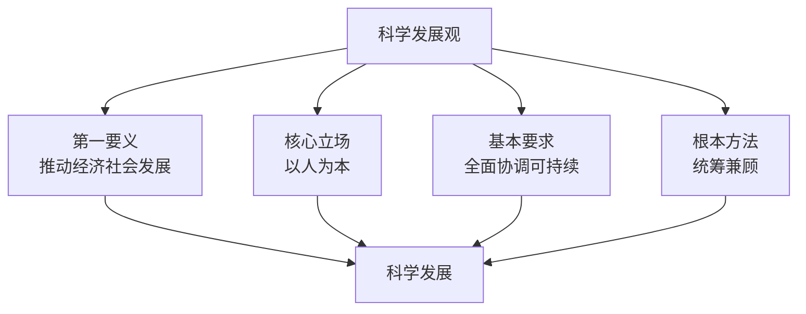
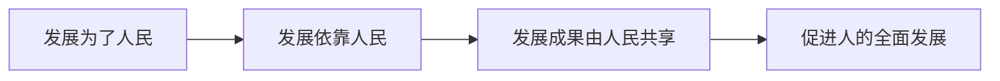

# 8.1 科学发展观的科学内涵

> 本节依据第八章第一节课件，从第一要义、核心立场、基本要求和根本方法四个层次理解科学发展观。重点把握发展、人民立场、全面协调可持续和统筹兼顾之间相互联系的整体逻辑。

## 主要内容

- 推动经济社会发展是第一要义
- 以人为本是核心立场
- 全面协调可持续是基本要求
- 统筹兼顾是根本方法

---

## 一、总体结构

| 层次 | 内容 |
| --- | --- |
| 第一要义 | 推动经济社会发展 |
| 核心立场 | 以人为本 |
| 基本要求 | 全面协调可持续 |
| 根本方法 | 统筹兼顾 |

---

## 二、推动经济社会发展是第一要义

### 1. 发展必须是科学发展

发展是解决中国一切问题的基础和关键，但不能只追求规模与速度，必须同时重视：

- 质量与效益；
- 社会财富创造与利益分配；
- 经济、政治、文化、社会和生态协调；
- 资源开发利用与人与自然和谐；
- 群众基本需要与生活质量、人的全面发展。

### 2. 转变经济发展方式

| 转变方向 | 具体要求 |
| --- | --- |
| 需求结构 | 由主要依靠投资、出口拉动，转向消费、投资、出口协调拉动 |
| 产业结构 | 由主要依靠第二产业带动，转向第一、第二、第三产业协同带动 |
| 要素投入 | 由主要依靠物质资源消耗，转向主要依靠科技进步、劳动者素质提高和管理创新 |

转变方式要以经济结构战略性调整为主攻方向，以科技进步和创新为支撑，以保障改善民生为出发点和落脚点，以资源节约型、环境友好型社会建设为着力点，以改革开放为动力，处理好“好”与“快”的辩证关系。

### 3. 科技、人才和机遇

- 提高自主创新能力、建设创新型国家，是国家发展战略的核心和提高综合国力的关键。
- 实施科教兴国和人才强国战略，坚持自主创新、重点跨越、支撑发展、引领未来。
- 坚持尊重劳动、尊重知识、尊重人才、尊重创造，培养高素质劳动者、专门人才和拔尖创新人才。
- 抓住并用好重要战略机遇期，沉着应对挑战。
- 全面建设并全面建成小康社会，要求经济、民主、文化、民生和资源环境建设同步推进。

---

## 三、以人为本是核心立场

### 1. “人”的含义

“以人为本”的人，是以工人、农民、知识分子等劳动者为主体，包括社会各阶层人民在内的最广大人民，而不是抽象、脱离社会关系的个人。

### 2. 基本要求

- 把最广大人民根本利益作为党和国家工作的出发点和落脚点。
- 尊重人民历史主体地位，发挥人民积极性、主动性和创造性。
- 坚持立党为公、执政为民，做到权为民所用、情为民所系、利为民所谋。
- 提高人民物质文化生活水平，保障经济、政治、文化、社会和生态权益。
- 更加重视社会公平，解决民生问题，使发展成果更多更公平惠及全体人民，逐步走向共同富裕。
- 在经济社会发展基础上促进人的全面发展。

### 3. 与其他“民本”“人本”思想的区别

| 思想 | 基本立场 | 根本目的 |
| --- | --- | --- |
| 中国古代民本思想 | 具有朴素重民价值，但建立在封建统治关系中 | 维护封建统治 |
| 西方近代人本主义 | 曾反对封建主义，但往往抽象理解人性、脱离具体社会历史条件 | 服务资产阶级取得和维护统治 |
| 科学发展观的以人为本 | 历史唯物主义，承认人民是历史创造者 | 实现、维护和发展最广大人民根本利益，促进人的全面发展 |

---

## 四、全面协调可持续是基本要求

| 要求 | 含义 |
| --- | --- |
| 全面 | 发展具有全面性、整体性，不仅经济发展，各方面都要发展 |
| 协调 | 各领域、各方面、各环节相互适应、相互促进，保持均衡 |
| 可持续 | 兼顾当前和长远，使发展具有持久性、连续性 |

### 1. 全面发展

统筹推进经济建设、政治建设、文化建设、社会建设和生态文明建设。经济建设是中心和基础，政治建设是方向和保障，文化建设是灵魂和血脉，社会建设是支撑和归宿，生态文明建设是根基和条件，五者构成有机统一整体。

### 2. 协调发展

协调消费与投资、供给与需求、速度与结构质量效益、科技进步与人才优势、市场机制与宏观调控，并正确处理经济与社会、城乡、区域、人与自然、国内发展与对外开放、改革发展稳定等重大关系。

### 3. 可持续发展

- 走生产发展、生活富裕、生态良好的文明发展道路；生产发展是基础，生活富裕是目的，生态良好是条件。
- 使经济发展同人口、资源、环境相协调，实现社会经济系统和自然生态系统良性循环。
- 建设生态文明，把经济发展、生活改善和可持续发展统一起来，使人民既享有现代物质文明成果，也享有良好生态环境。

---

## 五、统筹兼顾是根本方法

统筹兼顾体现唯物辩证法，要求从全局和战略高度处理中心与全面、重点与非重点、平衡与不平衡的关系。

### 1. 五个统筹

| 统筹关系 | 主要任务 |
| --- | --- |
| 城乡发展 | 增强农村活力，缩小城乡差距，推动城乡一体化和共同繁荣 |
| 区域发展 | 发挥各地区比较优势，形成东中西相互促进、优势互补格局 |
| 经济社会发展 | 加快科技、教育、就业、文化、卫生、体育、社保和社会管理发展 |
| 人与自然和谐发展 | 处理经济建设、人口增长、资源利用和生态保护关系 |
| 国内发展和对外开放 | 用好国内国际两个市场、两种资源，实现同各国共同发展的良性互动 |

### 2. 利益与时序统筹

- 处理中央与地方、个人与集体、局部与整体、当前与长远的关系。
- 兼顾最广大人民根本利益、现阶段共同利益和不同群体特殊利益。
- 正确处理人民内部矛盾，凝聚改革、发展、稳定合力。
- 统筹国内国际两个大局，在变化中把握机遇、防范风险。
- 立足当前又着眼长远，把阶段性目标同可持续发展统一起来；因地、因人、因时制宜，在鼓励加快发展同时增强协调性和稳定性。

---

## 相关笔记

- [[毛概/笔记/7.1 三个代表重要思想的核心观点]]
- [[毛概/笔记/7.2 三个代表重要思想的主要内容]]
- [[毛概/笔记/0.1 导论——马克思主义中国化时代化的历史进程与理论成果]]

---

## 本章小结

- **第一要义**：推动经济社会发展。
- **核心立场**：以人为本。
- **基本要求**：全面协调可持续。
- **根本方法**：统筹兼顾。
- **发展逻辑**：发展为了人民、依靠人民、成果由人民共享，最终促进人的全面发展。
- **文明道路**：生产发展、生活富裕、生态良好。
