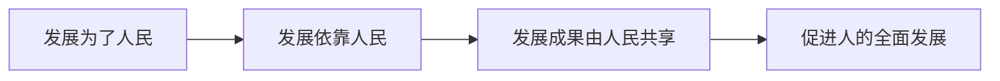

# 毛概总复习

> 本笔记按课程大章节归并原总复习中已经列出的知识点，并在每章后集中收录题库中属于该章的正式试题与复习资料题。知识点部分仅重组原有复习范围；来源已有答案时置于默认折叠的 Answer Callout 中。

## 主要内容

- 马克思主义中国化时代化
- 毛泽东思想的历史地位
- 新民主主义革命理论
- 邓小平理论
- “三个代表”重要思想
- 科学发展观
- 分章节真题与复习资料题

## 一、马克思主义中国化时代化（导论）

### 1. 马克思主义中国化时代化的必然性

1. 解决中国实际问题：  
   马克思主义只有同中国具体实际相结合，才能指导中国革命、建设和改革。
2. 理论发展的内在要求：  
   马克思主义不是教条，而是“的开放理论”。
3. 总结经验并上升为理论：  
   总结中国实践经验并上升为理论，进而揭示规律、指导新的实践。
4. 使理论为人民所掌握：  
   必须以中国人民熟悉的民族形式和语言表达马克思主义。

> [!warning] 原笔记表述不完整
> “不是教条，而是的开放理论”在整理前原稿中缺少必要成分。为避免擅自补写知识内容，此处仅调整标点并保留原意疑点。

### 2. 马克思主义中国化时代化的内涵

1. 解决中国问题：  
   运用马克思主义立场、观点和方法，观察时代、把握时代、引领时代，研究和解决中国革命、建设、改革中的实际问题。
2. 总结中国经验：  
   总结中国实践经验并上升为理论，丰富和发展马克思主义理论宝库。
3. 根植中国文化：  
   将马克思主义理论根植于中华优秀传统文化，以具有中国特色、中国气派、中国风格的语言表达。

### 本章考题

#### 一、判断题

1. 【判断题｜原题 340】马克思主义中国化的第一个重大理论成果是毛泽东思想。  
   **来源**：[[毛概/题库/毛概题库+答案.pdf_by_PaddleOCR-VL-1.6 (1)|《毛概题库》练习题（复习资料）]]  
   **资料性质**：复习资料题

> [!answer]- 复习资料参考答案
> ✓

2. 【判断题｜原题 344】中国特色社会主义理论体系和毛泽东思想是一脉相承的。  
   **来源**：[[毛概/题库/毛概题库+答案.pdf_by_PaddleOCR-VL-1.6 (1)|《毛概题库》练习题（复习资料）]]  
   **资料性质**：复习资料题

> [!answer]- 复习资料参考答案
> ✓

#### 二、单项选择题

1. 【单项选择题｜原题 1】毛泽东首次明确提出“马克思主义中国化”的重大理论命题是在哪篇论述中？  
   **来源**：[[毛概/题库/2017-2018 第一学期 毛泽东思想和中国特色社会主义理论体系概论 期末试卷|2017—2018 学年第一学期期末 A 卷]]  
   **资料性质**：正式真题

   - A. 《中国共产党与中国民族解放道路》
   - B. 《解放思想，实事求是，团结一致向前看》
   - C. 《我的马克思主义观》
   - D. 《论新阶段》

> [!answer]- 原卷作答（待核验）
> D

2. 【单项选择题｜原题 3】毛泽东在党的（　）全会上提出“马克思主义中国化”任务的同时，指出：“共产党员应是实事求是的模范”，“因为只有实事求是，才能完成确定的任务”。  
   **来源**：[[毛概/题库/2017-2018 第一学期 毛泽东思想和中国特色社会主义理论体系概论 期末试卷|2017—2018 学年第一学期期末 A 卷]]  
   **资料性质**：正式真题

   - A. 六届六中全会
   - B. 六届三中全会
   - C. 六届五中全会
   - D. 六届二中全会

> [!answer]- 原卷作答（待核验）
> A

3. 【单项选择题｜原题 1】1938 年，毛泽东在党的六届六中全会作了（　）的报告，标志着“马克思主义的中国化”这一命题的正式提出。  
   **来源**：[[毛概/题库/2023-2024 第二学期 毛泽东思想和中国特色社会主义理论体系概论 期末试卷|2023—2024 学年第二学期期末 B 卷]]  
   **资料性质**：正式真题

   - A. 《论新阶段》
   - B. 《中国革命和中国共产党》
   - C. 《在晋绥干部会议上的讲话》
   - D. 《〈共产党人〉发刊词》

4. 【单项选择题｜原题 1】中国特色社会主义理论体系不包括( )  
   **来源**：[[毛概/题库/25-26-2-毛泽东思想和中国特色社会主义理论体系概论-期末|2025—2026 学年第二学期期末]]  
   **资料性质**：正式真题

   - A. 毛泽东思想
   - B. 邓小平理论
   - C. “三个代表”重要思想
   - D. 科学发展观

> [!answer]- 原网页参考答案
> A

5. 【单项选择题｜原题 1】马克思主义中国化的两大理论成果包括毛泽东思想和___  
   **来源**：[[毛概/题库/毛概题库+答案.pdf_by_PaddleOCR-VL-1.6 (1)|《毛概题库》练习题（复习资料）]]  
   **资料性质**：复习资料题

   - A. 邓小平理论
   - B. 科学发展观
   - C. 习近平新时代中国特色社会主义思想
   - D. 中国特色社会主义理论

> [!answer]- 复习资料参考答案
> D

6. 【单项选择题｜原题 5】马克思主义中国化第一次历史性飞跃的理论成果是  
   **来源**：[[毛概/题库/毛概题库+答案.pdf_by_PaddleOCR-VL-1.6 (1)|《毛概题库》练习题（复习资料）]]  
   **资料性质**：复习资料题

   - A. 新三民主义
   - B. 毛泽东思想
   - C. 邓小平理论
   - D. 科学发展观

> [!answer]- 复习资料参考答案
> B

7. 【单项选择题｜原题 6】马克思主义中国化第二次历史性飞跃的理论成果是  
   **来源**：[[毛概/题库/毛概题库+答案.pdf_by_PaddleOCR-VL-1.6 (1)|《毛概题库》练习题（复习资料）]]  
   **资料性质**：复习资料题

   - A. 毛泽东思想
   - B. 中国特色社会主义理论体系
   - C. 邓小平理论
   - D. 习近平新时代中国特色社会主义思想

> [!answer]- 复习资料参考答案
> B

8. 【单项选择题｜原题 7】在中国共产党的历史上，___第一个明确提出了“马克思主义中国化”的科学命题和重大任务，深刻论证了马克思主义中国化的必要性和极端重要性。  
   **来源**：[[毛概/题库/毛概题库+答案.pdf_by_PaddleOCR-VL-1.6 (1)|《毛概题库》练习题（复习资料）]]  
   **资料性质**：复习资料题

   - A. 陈独秀
   - B. 李大钊
   - C. 毛泽东
   - D. 刘少奇

> [!answer]- 复习资料参考答案
> C

9. 【单项选择题｜原题 15】马克思主义中国化的两大理论成果——毛泽东思想和中国特色社会主义理论体系虽然形成于不同的历史时期，面对不同的历史任务，具有不同的具体内容，但其基本精神是一致的，它们的基本点是  
   **来源**：[[毛概/题库/毛概题库+答案.pdf_by_PaddleOCR-VL-1.6 (1)|《毛概题库》练习题（复习资料）]]  
   **资料性质**：复习资料题

   - A. 统一战线、武装斗争、党的建设
   - B. 实事求是、群众路线、独立自主
   - C. 解放思想、求真务实、改革创新
   - D. 高举中国特色社会主义伟大旗帜

> [!answer]- 复习资料参考答案
> B

10. 【单项选择题｜原题 17】毛泽东明确向全党提出“使马克思主义中国化”的伟大历史任务是在  
   **来源**：[[毛概/题库/毛概题库+答案.pdf_by_PaddleOCR-VL-1.6 (1)|《毛概题库》练习题（复习资料）]]  
   **资料性质**：复习资料题

   - A.《反对本本主义》
   - B.《共产党人发刊词》
   - C. 中共六届六中全会
   - D. 中共七大

> [!answer]- 复习资料参考答案
> C

11. 【单项选择题｜原题 20】中共七大上对“马克思主义中国化”从理论上作出进一步阐述的领导人是  
   **来源**：[[毛概/题库/毛概题库+答案.pdf_by_PaddleOCR-VL-1.6 (1)|《毛概题库》练习题（复习资料）]]  
   **资料性质**：复习资料题

   - A. 毛泽东
   - B. 刘少奇
   - C. 周恩来
   - D. 朱德

> [!answer]- 复习资料参考答案
> B

12. 【单项选择题｜原题 179】下列叙述哪个不是马克思主义中国化的科学内涵:___  
   **来源**：[[毛概/题库/毛概题库+答案.pdf_by_PaddleOCR-VL-1.6 (1)|《毛概题库》练习题（复习资料）]]  
   **资料性质**：复习资料题

   - A. 马克思主义中国化就是紧密联系中国实际，运用马克思主义解决中国革命、建设和改革中的问题。
   - B. 马克思主义中国化就是利用马克思主义原理解决中国社会中的阶级矛盾。
   - C. 马克思主义中国化就是总结中国革命、建设和改革的实践经验和历史经验，坚持和发展马克思主义。
   - D. 马克思主义中国化就是将马克思主义根植于中国的优秀文化之中。

> [!answer]- 复习资料参考答案
> B

#### 三、多项选择题

1. 【多项选择题｜原题 188】下列关于马克思主义中国化的表述正确的有  
   **来源**：[[毛概/题库/毛概题库+答案.pdf_by_PaddleOCR-VL-1.6 (1)|《毛概题库》练习题（复习资料）]]  
   **资料性质**：复习资料题

   - A. 马克思主义基本原理与中国具体实际相结合
   - B. 用教条主义的观点看待马克思主义
   - C. 马克思主义中国化是马克思主义发展的内在要求
   - D. 马克思主义中国化实现了两次历史性飞跃

> [!answer]- 复习资料参考答案
> ACD

2. 【多项选择题｜原题 189】中国特色社会主义理论体系包括  
   **来源**：[[毛概/题库/毛概题库+答案.pdf_by_PaddleOCR-VL-1.6 (1)|《毛概题库》练习题（复习资料）]]  
   **资料性质**：复习资料题

   - A. 毛泽东思想
   - B. 邓小平理论
   - C. “三个代表” 重要思想
   - D. 科学发展观
   - E. 习近平新时代中国特色社会主义思想

> [!answer]- 复习资料参考答案
> BCDE

#### 四、填空题

1. 【填空题｜原题 291】马克思主义中国化的两大理论成果包括 ___ 和中国特色社会主义理论体系。  
   **来源**：[[毛概/题库/毛概题库+答案.pdf_by_PaddleOCR-VL-1.6 (1)|《毛概题库》练习题（复习资料）]]  
   **资料性质**：复习资料题

> [!answer]- 复习资料参考答案
> 毛泽东思想

#### 五、简答题

1. 【简答题】马克思主义中国化时代化的内涵是什么？  
   **来源**：[[毛概/题库/2022-2023学年第二学期毛概课程学生复习题.pdf_by_PaddleOCR-VL-1.6|2022—2023 学年第二学期课程学生复习题（复习资料）]]  
   **资料性质**：复习资料题

> [!answer]- 复习资料参考答案（OCR 转写，待核验）
> 它具体包含三层意思：
> （1）运用马克思主义的立场、观点和方法，观察时代、把握时代、引领时代，解决中国革命、建设、改革中的实际问题。
> （2）总结和提炼中国革命、建设、改革的实践经验，并将其上升为理论，不断丰富和发展马克思主义的理论宝库，赋予马克思主义新的时代内涵。
> （3）运用中国人民喜闻乐见的民族语言来阐述马克思主义，使其根植于中华优秀传统文化的土壤之中，具有中国特色、中国风格、中国气派。
> 拓展：
> （1）推进马克思主义中国化时代化是一个追求真理、揭示真理、笃行真理的过程。
> （2）准确把握马克思主义中国化时代化的科学内涵，做到坚持马克思主义与发展马克思主义相统一。
> （3）坚持和发展马克思主义必须同中国具体实际相结合，同中华优秀传统文化相结合。

2. 【简答题】如何认识马克思主义中国化时代化的历史进程？  
   **来源**：[[毛概/题库/2022-2023学年第二学期毛概课程学生复习题.pdf_by_PaddleOCR-VL-1.6|2022—2023 学年第二学期课程学生复习题（复习资料）]]  
   **资料性质**：复习资料题

> [!answer]- 复习资料参考答案（OCR 转写，待核验）
> （1）在新民主主义革命时期，以毛泽东同志为代表的中国共产党人创立了毛泽东思想，在毛泽东思想指导下，中国共产党带领中国人民浴血奋战，实现了民族独立，人民解放。
> （2）1978年召开的党的十一届三中全会创立了邓小平理论，解放思想，实事求是
> （3）党的十三届四中全会以后，以江泽民同志为主要代表的中国共产党人，团结带领全党全国各族人民形成了“三个代表”重要思想。
> （4）进入新世纪新阶段，党的十六大以后形成了科学发展观，成功在新形势下坚持和发展了中国特色社会主义。
> （5）党的十八大以来，中国特色社会主义进入新时代，党中央创立了习近平新时代中国特色社会主义思想，实现了马克思主义中国化，时代化新的飞跃。

3. 【简答题】如何理解马克思主义中国化时代化的理论成果及其关系？  
   **来源**：[[毛概/题库/2022-2023学年第二学期毛概课程学生复习题.pdf_by_PaddleOCR-VL-1.6|2022—2023 学年第二学期课程学生复习题（复习资料）]]  
   **资料性质**：复习资料题

> [!answer]- 复习资料参考答案（OCR 转写，待核验）
> 理论成果：在马克思主义中国化时代化的历史进程中，产生了毛泽东思想、邓小平理论、“三个代表”重要思想、科学发展观、习近平新时代中国特色社会主义思想。
> 关系：马克思主义中国化时代化的理论成果是一脉相承又与时俱进的关系。
> 一方面，毛泽东思想所蕴含的马克思主义的立场、观点和方法，为中国特色社会主义理论体系提供了基本遵循。另一方面，中国特色社会主义理论体系在新的历史条件下进一步丰富和发展了毛泽东思想。

> [!warning] OCR 转写提示
> 本资料的答案中可能保留原文件已有的 OCR 误识别或病句；为避免擅自改动来源，使用时应结合教材与课程笔记核验。

4. 【简答题】为什么要推荐马克思主义中国化？  
   **来源**：[[毛概/题库/毛概（笔记）.pdf_by_PaddleOCR-VL-1.6|《毛概（笔记）》OCR 转写（复习资料）]]  
   **资料性质**：复习资料题

> [!answer]- 复习资料原文参考答案（OCR 转写，待核验）
> （1）是马克思主义本身发展的内在要求。（马克思主义只有正确运用于实践并在实践中不断发展才能体现其科学性，彰显强大力量。只有实现中国化时代化，才能不断发展自身）
> （2）是解决中国实际问题的客观需要。（不能简单套用马克思主义一般原理照搬经验，要中国化时代化，结合中国国情，解决中国问题）

5. 【简答题】马克思主义中国化时代化内涵？（什么是马克思主义中国化时代化？）  
   **来源**：[[毛概/题库/毛概（笔记）.pdf_by_PaddleOCR-VL-1.6|《毛概（笔记）》OCR 转写（复习资料）]]  
   **资料性质**：复习资料题

> [!answer]- 复习资料原文参考答案（OCR 转写，待核验）
> （1）立足中国国情和时代特点，坚持把马克思主义基本原理同中国具体实际相结合、同中华优秀传统文化相结合
> （2）深入研究和解决中国革命、建设、改革不同历史时期的实际问题，真正搞懂面临的时代课题。
> （3）不断吸收新的时代内容，科学回答时代提出的重大理论和实践课题，创造新的理论成果。

6. 【简答题】马克思主义中国化时代化理论成果（毛泽东思想，中国特色社会主义理论体系）及其关系？  
   **来源**：[[毛概/题库/毛概（笔记）.pdf_by_PaddleOCR-VL-1.6|《毛概（笔记）》OCR 转写（复习资料）]]  
   **资料性质**：复习资料题

> [!answer]- 复习资料原文参考答案（OCR 转写，待核验）
> 关系：马克思主义中国化时代化的理论成果是一脉相承又与时俱进的关系。
> （1）毛泽东思想所蕴含的马克思主义立场、观点和方法，为中国特色社会主义理论体系提供了基本遵循。
> （2）中国特色社会主义理论体系在新的历史条件下进一步丰富和发展了毛泽东思想。
> （3）毛泽东思想和中国特色社会主义理论体系，都是马克思列宁主义在中国的运用和发展，都以独创性的理论成果丰富和发展了马克思主义的理论宝库。

> [!warning] OCR 转写提示
> 题干与答案按来源保留，可能存在错字、病句或公式识别问题，不能直接视为标准答案。

7. 【简答题】为什么要推荐马克思主义中国化？  
   **来源**：[[毛概/题库/毛概大题范围.pdf_by_PaddleOCR-VL-1.6|《毛概大题范围》OCR 转写（复习资料）]]  
   **资料性质**：复习资料题

> [!answer]- 复习资料原文参考答案（OCR 转写，待核验）
> （1）是马克思主义本身发展的内在要求。（马克思主义只有正确运用于实践并在实践中不断发展才能体现其科学性，彰显强大力量。只有实现中国化时代化，才能不断发展自身）
> （2）是解决中国实际问题的客观需要。（不能简单套用马克思主义一般原理照搬经验，要中国化时代化，结合中国国情，解决中国问题）

8. 【简答题】马克思主义中国化时代化内涵？（什么是马克思主义中国化时代化？）  
   **来源**：[[毛概/题库/毛概大题范围.pdf_by_PaddleOCR-VL-1.6|《毛概大题范围》OCR 转写（复习资料）]]  
   **资料性质**：复习资料题

> [!answer]- 复习资料原文参考答案（OCR 转写，待核验）
> （1）立足中国国情和时代特点，坚持把马克思主义基本原理同中国具体实际相结合、同中华优秀传统文化相结合
> （2）深入研究和解决中国革命、建设、改革不同历史时期的实际问题，真正搞懂面临的时代课题。
> （3）不断吸收新的时代内容，科学回答时代提出的重大理论和实践课题，创造新的理论成果。

9. 【简答题】马克思主义中国化时代化理论成果（毛泽东思想，中国特色社会主义理论体系）及其关系？  
   **来源**：[[毛概/题库/毛概大题范围.pdf_by_PaddleOCR-VL-1.6|《毛概大题范围》OCR 转写（复习资料）]]  
   **资料性质**：复习资料题

> [!answer]- 复习资料原文参考答案（OCR 转写，待核验）
> 关系：马克思主义中国化时代化的理论成果是一脉相承又与时俱进的关系。
> （1）毛泽东思想所蕴含的马克思主义立场、观点和方法，为中国特色社会主义理论体系提供了基本遵循。
> （2）中国特色社会主义理论体系在新的历史条件下进一步丰富和发展了毛泽东思想。
> （3）毛泽东思想和中国特色社会主义理论体系，都是马克思列宁主义在中国的运用和发展，都以独创性的理论成果丰富和发展了马克思主义的理论宝库。

> [!warning] OCR 转写提示
> 题干与答案按来源保留，可能存在错字、病句或公式识别问题，不能直接视为标准答案。

---

## 二、毛泽东思想的历史地位（第 1 章）

### 1. 马克思主义中国化时代化的第一个重大理论成果

> **复习问题**：为什么说毛泽东思想是马克思主义中国化时代化的第一个重大理论成果？

### 2. 毛泽东思想活的灵魂

| 方面 | 定位 | 原笔记要点 |
|---|---|---|
| 实事求是 | 根本思想路线 | 从实际出发，理论联系实际，在实践中检验和发展真理 |
| 群众路线 | 根本工作路线 | 一切为了群众，一切依靠群众，从群众中来，到群众中去 |
| 独立自主 | 根本立足点 | 坚持以国家和民族发展为力量基点，学习一切有益的经验 |

### 3. 中国革命和建设的科学指南

原笔记列出的实践成就有四点：

1. 指引党和人民找到新民主主义革命的正确道路，推翻帝国主义、封建主义和官僚资本主义的统治，建立中华人民共和国，实现从封建专制政治向人民民主的伟大飞跃。
2. 指引党和人民找到从新民主主义向社会主义过渡的道路，确立社会主义基本制度，实现中华民族历史上最广泛、最深刻的社会变革。
3. 指导社会主义建设探索，建立独立的、比较完整的工业体系和国民经济体系，为社会主义现代化建设奠定重要物质技术基础。
4. 为改革开放新时期创立中国特色社会主义提供宝贵经验、理论准备和物质基础。

### 4. 中国共产党和中国人民宝贵的精神财富

> **复习问题**：怎样理解毛泽东思想是中国共产党和中国人民宝贵的精神财富？

### 本章考题

#### 一、判断题

1. 【判断题｜原题 341】毛泽东思想是毛泽东的全部思想的总和。  
   **来源**：[[毛概/题库/毛概题库+答案.pdf_by_PaddleOCR-VL-1.6 (1)|《毛概题库》练习题（复习资料）]]  
   **资料性质**：复习资料题

> [!answer]- 复习资料参考答案
> X

2. 【判断题｜原题 342】坚持实事求是，就要深入实际了解事物的本来面貌，把握事物内在必然联系，按照客观规律办事。  
   **来源**：[[毛概/题库/毛概题库+答案.pdf_by_PaddleOCR-VL-1.6 (1)|《毛概题库》练习题（复习资料）]]  
   **资料性质**：复习资料题

> [!answer]- 复习资料参考答案
> ✓

3. 【判断题｜原题 345】群众路线本质上体现的是马克思主义关于人民群众是历史的创造者这一基本原理。  
   **来源**：[[毛概/题库/毛概题库+答案.pdf_by_PaddleOCR-VL-1.6 (1)|《毛概题库》练习题（复习资料）]]  
   **资料性质**：复习资料题

> [!answer]- 复习资料参考答案
> ✓

4. 【判断题｜原题 347】独立自主，就是要把国家和民族发展放在自己力量的基点上，增强民族自尊心和自信心，坚定不移地走自己的路。  
   **来源**：[[毛概/题库/毛概题库+答案.pdf_by_PaddleOCR-VL-1.6 (1)|《毛概题库》练习题（复习资料）]]  
   **资料性质**：复习资料题

5. 【判断题｜原题 348】毛泽东的错误是第一位的，功绩是第二位的。  
   **来源**：[[毛概/题库/毛概题库+答案.pdf_by_PaddleOCR-VL-1.6 (1)|《毛概题库》练习题（复习资料）]]  
   **资料性质**：复习资料题

6. 【判断题｜原题 349】毛泽东思想在社会主义制度确立之后就没有发展了。  
   **来源**：[[毛概/题库/毛概题库+答案.pdf_by_PaddleOCR-VL-1.6 (1)|《毛概题库》练习题（复习资料）]]  
   **资料性质**：复习资料题

#### 二、单项选择题

1. 【单项选择题｜原题 4】毛泽东思想活的灵魂的三个方面是（　）。  
   **来源**：[[毛概/题库/2023-2024 第二学期 毛泽东思想和中国特色社会主义理论体系概论 期末试卷|2023—2024 学年第二学期期末 B 卷]]  
   **资料性质**：正式真题

   - A. 实事求是、武装斗争、独立自主
   - B. 实事求是、党的建设、独立自主
   - C. 实事求是、统一战线、独立自主
   - D. 实事求是、群众路线、独立自主

2. 【单项选择题｜原题 1】毛泽东思想初步形成于 ( )。  
   **来源**：[[毛概/题库/24-25-2-毛泽东思想和中国特色社会主义理论体系概论-期末|2024—2025 学年第二学期期末]]  
   **资料性质**：正式真题

   - A. 大革命时期
   - B. 土地革命战争时期
   - C. 遵义会议以后
   - D. 国共第一次合作时期

> [!answer]- 原网页参考答案
> B

3. 【单项选择题｜原题 2】把毛泽东思想确立为党必须长期坚持的指导思想。  
   **来源**：[[毛概/题库/24-25-2-毛泽东思想和中国特色社会主义理论体系概论-期末|2024—2025 学年第二学期期末]]  
   **资料性质**：正式真题

   - A. 党的六届六中全会
   - B. 延安整风
   - C. 党的六届七中全会
   - D. 党的七大

> [!answer]- 原网页参考答案
> D

4. 【单项选择题｜原题 3】1927年，毛泽东领导部队在江西省永新县完成 ( )，创造性地将支部建在连上。  
   **来源**：[[毛概/题库/24-25-2-毛泽东思想和中国特色社会主义理论体系概论-期末|2024—2025 学年第二学期期末]]  
   **资料性质**：正式真题

   - A. 秋收起义
   - B. 三湾改编
   - C. 古田会议
   - D. 工农武装割据

> [!answer]- 原网页参考答案
> B

5. 【单项选择题｜原题 4】毛泽东思想活的灵魂的三个方面是 ( )。  
   **来源**：[[毛概/题库/24-25-2-毛泽东思想和中国特色社会主义理论体系概论-期末|2024—2025 学年第二学期期末]]  
   **资料性质**：正式真题

   - A. 实事求是、党的建设、独立自主
   - B. 实事求是、武装斗争、独立自主
   - C. 实事求是、群众路线、独立自主
   - D. 实事求是、统一战线、独立自主

> [!answer]- 原网页参考答案
> C

6. 【单项选择题｜原题 2】毛泽东思想达到成熟的标志是( )  
   **来源**：[[毛概/题库/25-26-2-毛泽东思想和中国特色社会主义理论体系概论-期末|2025—2026 学年第二学期期末]]  
   **资料性质**：正式真题

   - A. 工农武装割据思想的提出
   - B. 社会主义改造理论的提出
   - C. 人民军队建设理论的形成
   - D. 新民主主义革命理论的完整论述

> [!answer]- 原网页参考答案
> D

7. 【单项选择题｜原题 3】毛泽东在《反对本本主义》一文中指出：“中国革命斗争的胜利要靠中国同志了解中国情况”。这句话的意思是( )  
   **来源**：[[毛概/题库/25-26-2-毛泽东思想和中国特色社会主义理论体系概论-期末|2025—2026 学年第二学期期末]]  
   **资料性质**：正式真题

   - A. 加强学习马克思主义理论
   - B. 保持与共产国际的联系
   - C. 坚持独立自主原则
   - D. 坚持党对军队的领导

> [!answer]- 原网页参考答案
> C

8. 【单项选择题｜原题 6】毛泽东思想关于党的建设理论中，始终放在党的建设的首位的是( )  
   **来源**：[[毛概/题库/25-26-2-毛泽东思想和中国特色社会主义理论体系概论-期末|2025—2026 学年第二学期期末]]  
   **资料性质**：正式真题

   - A. 思想建设
   - B. 政治建设
   - C. 组织建设
   - D. 作风建设

> [!answer]- 原网页参考答案
> A

9. 【单项选择题｜原题 3】毛泽东思想形成的时代条件是  
   **来源**：[[毛概/题库/毛概题库+答案.pdf_by_PaddleOCR-VL-1.6 (1)|《毛概题库》练习题（复习资料）]]  
   **资料性质**：复习资料题

   - A. 1919 年以后中国革命进入新民主主义革命时期
   - B. 1840 年以后中国成为一个半殖民地半封建社会
   - C. 俄国十月革命开辟了世界无产阶级社会主义革命的新时代
   - D. 1927 年以后中国共产党独立担负起领导中国革命的重任

> [!answer]- 复习资料参考答案
> C

10. 【单项选择题｜原题 4】毛泽东思想活的灵魂是  
   **来源**：[[毛概/题库/毛概题库+答案.pdf_by_PaddleOCR-VL-1.6 (1)|《毛概题库》练习题（复习资料）]]  
   **资料性质**：复习资料题

   - A. 实事求是、群众路线、独立自主
   - B. 理论与实践相结合、密切联系群众、批评与自我批评
   - C. 武装斗争、土地革命、根据地建设
   - D. 武装斗争、统一战线、党的建设

> [!answer]- 复习资料参考答案
> A

11. 【单项选择题｜原题 8】毛泽东思想形成和发展的实践基础是  
   **来源**：[[毛概/题库/毛概题库+答案.pdf_by_PaddleOCR-VL-1.6 (1)|《毛概题库》练习题（复习资料）]]  
   **资料性质**：复习资料题

   - A. 中国工人运动的发展
   - B. 马克思列宁主义在中国的传播
   - C. 中国共产党领导人民进行革命和建设的成功实践
   - D. 20世纪前中期中国政局的变动

> [!answer]- 复习资料参考答案
> C

12. 【单项选择题｜原题 9】毛泽东思想形成的标志是  
   **来源**：[[毛概/题库/毛概题库+答案.pdf_by_PaddleOCR-VL-1.6 (1)|《毛概题库》练习题（复习资料）]]  
   **资料性质**：复习资料题

   - A. 提出了新民主主义革命的基本思想
   - B. 提出了农村包围城市、武装夺取政权的革命新道路理论
   - C. 提出了系统的新民主主义革命理论
   - D. 提出了人民民主专政、社会主义改造和建设理论

> [!answer]- 复习资料参考答案
> B

13. 【单项选择题｜原题 10】毛泽东思想完备成熟的标志是  
   **来源**：[[毛概/题库/毛概题库+答案.pdf_by_PaddleOCR-VL-1.6 (1)|《毛概题库》练习题（复习资料）]]  
   **资料性质**：复习资料题

   - A. 农村包围城市的革命道路理论的形成
   - B. 哲学体系的建构
   - C. 新民主主义革命理论的完整形成
   - D. 政策和策略的理论

> [!answer]- 复习资料参考答案
> C

14. 【单项选择题｜原题 11】把毛泽东思想确立为党的指导思想是在  
   **来源**：[[毛概/题库/毛概题库+答案.pdf_by_PaddleOCR-VL-1.6 (1)|《毛概题库》练习题（复习资料）]]  
   **资料性质**：复习资料题

   - A. 瓦窑堡会议
   - B. 六届七中全会
   - C. 遵义会议
   - D. 中共七大

> [!answer]- 复习资料参考答案
> D

15. 【单项选择题｜原题 12】不论过去、现在和将来，___都是我们党的生命线和根本工作路线。  
   **来源**：[[毛概/题库/毛概题库+答案.pdf_by_PaddleOCR-VL-1.6 (1)|《毛概题库》练习题（复习资料）]]  
   **资料性质**：复习资料题

   - A. 群众路线
   - B. 独立自主
   - C. 实事求是
   - D. 统一战线

> [!answer]- 复习资料参考答案
> A

16. 【单项选择题｜原题 14】中国共产党区别于其他一切政党的根本标志  
   **来源**：[[毛概/题库/毛概题库+答案.pdf_by_PaddleOCR-VL-1.6 (1)|《毛概题库》练习题（复习资料）]]  
   **资料性质**：复习资料题

   - A. 坚持民主集中制的原则
   - B. 把公有制作为社会目标
   - C. 把共产主义作为最终目标
   - D. 全心全意为人民服务的唯一宗旨

> [!answer]- 复习资料参考答案
> D

17. 【单项选择题｜原题 16】___就是一切为了群众，一切依靠群众，从群众中来，到群众中去，把党的正确主张变为群众的自觉行动。  
   **来源**：[[毛概/题库/毛概题库+答案.pdf_by_PaddleOCR-VL-1.6 (1)|《毛概题库》练习题（复习资料）]]  
   **资料性质**：复习资料题

   - A. 以人为本
   - B. 独立自主
   - C. 实事求是
   - D. 群众路线

> [!answer]- 复习资料参考答案
> D

18. 【单项选择题｜原题 18】毛泽东最伟大的功绩是  
   **来源**：[[毛概/题库/毛概题库+答案.pdf_by_PaddleOCR-VL-1.6 (1)|《毛概题库》练习题（复习资料）]]  
   **资料性质**：复习资料题

   - A. 缔造了中华人民共和国
   - B. 把马克思列宁主义原理同中国实际结合起来，指出了中国革命胜利的道路
   - C. 建立了一支新型的人民军队
   - D. 建立了一个无产阶级的革命政党

> [!answer]- 复习资料参考答案
> B

19. 【单项选择题｜原题 19】中共十一届三中全会以后，对毛泽东和毛泽东思想的历史地位作出科学评价的历史文献是  
   **来源**：[[毛概/题库/毛概题库+答案.pdf_by_PaddleOCR-VL-1.6 (1)|《毛概题库》练习题（复习资料）]]  
   **资料性质**：复习资料题

   - A.《解放思想，实事求是，团结一致向前看》
   - B.《关于建国以来党的若干历史问题的决议》
   - C.《全面开创社会主义现代化建设的新局面》
   - D.《关于社会主义精神文明建设指导方针的决议》

> [!answer]- 复习资料参考答案
> B

20. 【单项选择题｜原题 21】“战略上要藐视敌人，战术上要重视敌人”属于毛泽东思想的哪一个理论？  
   **来源**：[[毛概/题库/毛概题库+答案.pdf_by_PaddleOCR-VL-1.6 (1)|《毛概题库》练习题（复习资料）]]  
   **资料性质**：复习资料题

   - A. 新民主主义革命理论
   - B. 政策和策略理论
   - C. 革命军队建设和军事战略的理论

> [!answer]- 复习资料参考答案
> B

21. 【单项选择题｜原题 22】将下列毛泽东的主要历史活动进行排序，正确的顺序是  
   **来源**：[[毛概/题库/毛概题库+答案.pdf_by_PaddleOCR-VL-1.6 (1)|《毛概题库》练习题（复习资料）]]  
   **资料性质**：复习资料题

   - A. 出席中共一大——组建长沙共产主义小组——创建井冈山革命根据地——出席遵义会议——发表《论持久战》——领导抗日战争胜利——重庆谈判运筹帷幄——领导社会主义改造——成立新中国
   - B. 组建长沙共产主义小组——出席中共一大——出席遵义会议——创建井冈山革命根据地——发表《论持久战》——重庆谈判运筹帷幄——领导抗日战争胜利——成立新中国——领导社会主义改造
   - C. 组建长沙共产主义小组——出席中共一大——创建井冈山革命根据地——出席遵义会议——发表《论持久战》——领导抗日战争胜利——重庆谈判运筹帷幄——成立新中国——领导社会主义改造
   - D. 出席中共一大——组建长沙共产主义小组——出席遵义会议——创建井冈山革命根据地——发表《论持久战》——领导抗日战争胜利——成立新中国——重庆谈判运筹帷幄——领导社会主义改造

> [!answer]- 复习资料参考答案
> C

22. 【单项选择题｜原题 23】《论持久战》的发表，对___胜利起到推动作用  
   **来源**：[[毛概/题库/毛概题库+答案.pdf_by_PaddleOCR-VL-1.6 (1)|《毛概题库》练习题（复习资料）]]  
   **资料性质**：复习资料题

   - A. 红军长征胜利
   - B. 抗日战争胜利
   - C. 人民解放战争胜利
   - D. 抗美援朝战争胜利

> [!answer]- 复习资料参考答案
> B

23. 【单项选择题｜原题 24】毛泽东指出，___，人民群众紧密地联系在一起的作风，以及自我批评的作风，是中国共产党区别于其他任何政党的显著标志。  
   **来源**：[[毛概/题库/毛概题库+答案.pdf_by_PaddleOCR-VL-1.6 (1)|《毛概题库》练习题（复习资料）]]  
   **资料性质**：复习资料题

   - A. 艰苦奋斗的作风
   - B. 谦虚、谨慎、不骄、不躁的作风
   - C. 理论联系实际的作风

> [!answer]- 复习资料参考答案
> C

24. 【单项选择题｜原题 25】1945年党的___将毛泽东思想写入党章，确立为党必须长期坚持的指导思想。  
   **来源**：[[毛概/题库/毛概题库+答案.pdf_by_PaddleOCR-VL-1.6 (1)|《毛概题库》练习题（复习资料）]]  
   **资料性质**：复习资料题

   - A. 一大
   - B. 三大
   - C. 五大
   - D. 七大

> [!answer]- 复习资料参考答案
> D

25. 【单项选择题｜原题 180】下列哪项不属于毛泽东的革命策略：___  
   **来源**：[[毛概/题库/毛概题库+答案.pdf_by_PaddleOCR-VL-1.6 (1)|《毛概题库》练习题（复习资料）]]  
   **资料性质**：复习资料题

   - A. 兵之形，避实而击虚
   - B. 战略上藐视敌人、战术上重视敌人
   - C. 对敌斗争要区别对待、分化瓦解
   - D. 有理、有利、有节

> [!answer]- 复习资料参考答案
> A

26. 【单项选择题｜原题 181】“没有毛主席，至少我们中国人民还要在黑暗中摸索更长的时间。”提出这个评价的是___  
   **来源**：[[毛概/题库/毛概题库+答案.pdf_by_PaddleOCR-VL-1.6 (1)|《毛概题库》练习题（复习资料）]]  
   **资料性质**：复习资料题

   - A. 邓小平
   - B. 刘少奇
   - C. 周恩来
   - D. 朱德

> [!answer]- 复习资料参考答案
> A

27. 【单项选择题｜原题 182】下面不属于毛泽东著作的是 ___。  
   **来源**：[[毛概/题库/毛概题库+答案.pdf_by_PaddleOCR-VL-1.6 (1)|《毛概题库》练习题（复习资料）]]  
   **资料性质**：复习资料题

   - A.《矛盾论》
   - B.《关于建国以来党的若干历史问题的决议》
   - C.《关于正确处理人民内部矛盾的问题》
   - D.《人的正确思想是从哪里来的？》

> [!answer]- 复习资料参考答案
> B

28. 【单项选择题｜原题 184】关于独立自主的论述，错误的是：___  
   **来源**：[[毛概/题库/毛概题库+答案.pdf_by_PaddleOCR-VL-1.6 (1)|《毛概题库》练习题（复习资料）]]  
   **资料性质**：复习资料题

   - A. 坚持民族自尊心和自信心、坚定不移走自己的路
   - B. 是中华民族的优良传统
   - C. 就是把国家和民族发展的方针放在自己力量的基点上
   - D. 坚定不移地维护民族独立、捍卫国家主权，不需要争取外援

> [!answer]- 复习资料参考答案
> D

29. 【单项选择题｜原题 185】下面哪一项不是毛泽东思想活的灵魂：___  
   **来源**：[[毛概/题库/毛概题库+答案.pdf_by_PaddleOCR-VL-1.6 (1)|《毛概题库》练习题（复习资料）]]  
   **资料性质**：复习资料题

   - A. 实事求是
   - B. 群众路线
   - C. 与时俱进
   - D. 独立自主

> [!answer]- 复习资料参考答案
> C

#### 三、多项选择题

1. 【多项选择题｜原题 190】土地革命战争时期，盛行___错误  
   **来源**：[[毛概/题库/毛概题库+答案.pdf_by_PaddleOCR-VL-1.6 (1)|《毛概题库》练习题（复习资料）]]  
   **资料性质**：复习资料题

   - A. 马克思主义教条化
   - B. 共产国际决议神圣化
   - C. 苏联经验神圣化
   - D. 个人崇拜主义

> [!answer]- 复习资料参考答案
> ABC

2. 【多项选择题｜原题 191】土地革命战争时期，毛泽东在___等著作中，提出并阐述了农村包围城市、武装夺取政权的思想，标志着毛泽东思想的初步形成  
   **来源**：[[毛概/题库/毛概题库+答案.pdf_by_PaddleOCR-VL-1.6 (1)|《毛概题库》练习题（复习资料）]]  
   **资料性质**：复习资料题

   - A.《中国的红色政权为什么能够存在》
   - B.《井冈山的斗争》
   - C.《星星之火、可以燎原》
   - D.《反对本本主义》

> [!answer]- 复习资料参考答案
> ABCD

3. 【多项选择题｜原题 192】毛泽东思想的历史地位包括  
   **来源**：[[毛概/题库/毛概题库+答案.pdf_by_PaddleOCR-VL-1.6 (1)|《毛概题库》练习题（复习资料）]]  
   **资料性质**：复习资料题

   - A. 马克思主义中国化的第一个重大理论成果
   - B. 中国特色社会主义理论体系的开篇之作
   - C. 中国共产党和中国人民宝贵的精神财富
   - D. 中国革命和建设的科学指南

> [!answer]- 复习资料参考答案
> ACD

4. 【多项选择题｜原题 193】贯穿于毛泽东思想的活的灵魂是  
   **来源**：[[毛概/题库/毛概题库+答案.pdf_by_PaddleOCR-VL-1.6 (1)|《毛概题库》练习题（复习资料）]]  
   **资料性质**：复习资料题

   - A. 实事求是
   - B. 党的建设
   - C. 独立自主
   - D. 群众路线

> [!answer]- 复习资料参考答案
> ACD

5. 【多项选择题｜原题 194】毛泽东的历史功绩有  
   **来源**：[[毛概/题库/毛概题库+答案.pdf_by_PaddleOCR-VL-1.6 (1)|《毛概题库》练习题（复习资料）]]  
   **资料性质**：复习资料题

   - A. 中华人民共和国的主要缔造者
   - B. 创立和发展了中国人民解放军
   - C. 发动了“文化大革命”
   - D. 创立和发展了中国共产党

> [!answer]- 复习资料参考答案
> ABD

6. 【多项选择题｜原题 195】关于毛泽东思想的理解，正确的有：  
   **来源**：[[毛概/题库/毛概题库+答案.pdf_by_PaddleOCR-VL-1.6 (1)|《毛概题库》练习题（复习资料）]]  
   **资料性质**：复习资料题

   - A. 毛泽东思想就是毛泽东的思想
   - B. 中国共产党集体智慧的结晶
   - C. 被实践证明了的关于中国革命和建设的正确的科学理论
   - D. 包含正确部分，也有错误的部分

> [!answer]- 复习资料参考答案
> BC

7. 【多项选择题｜原题 196】毛泽东思想的成熟阶段的代表著作有:  
   **来源**：[[毛概/题库/毛概题库+答案.pdf_by_PaddleOCR-VL-1.6 (1)|《毛概题库》练习题（复习资料）]]  
   **资料性质**：复习资料题

   - A. 《实践论》
   - B. 《星星之火，可以燎原》
   - C. 《矛盾论》
   - D. 《新民主主义论》

> [!answer]- 复习资料参考答案
> ACD

8. 【多项选择题｜原题 197】科学评价历史人物要做到:  
   **来源**：[[毛概/题库/毛概题库+答案.pdf_by_PaddleOCR-VL-1.6 (1)|《毛概题库》练习题（复习资料）]]  
   **资料性质**：复习资料题

   - A. 全面的观点评价历史人物
   - B. 要放在具体的历史条件下评价历史人物
   - C. 实事求是
   - D. 着眼于大者、主流，以是否推动社会进步

> [!answer]- 复习资料参考答案
> ABCD

9. 【多项选择题｜原题 198】毛泽东思想形成发展的历史条件包括:  
   **来源**：[[毛概/题库/毛概题库+答案.pdf_by_PaddleOCR-VL-1.6 (1)|《毛概题库》练习题（复习资料）]]  
   **资料性质**：复习资料题

   - A. 19 世纪末 20 世纪初，世界进入帝国主义和无产阶级革命时代
   - B. 二战结束后，和平与发展成为时代主题
   - C. 中国共产党领导人民进行革命和建设的成功实践是毛泽东思想形成和发展的实践基础
   - D. 中国共产党领导人民进行改革开放的成功实践是毛泽东思想形成和发展的实践基础

> [!answer]- 复习资料参考答案
> AC

10. 【多项选择题｜原题 199】毛泽东思想的主要内容包括：  
   **来源**：[[毛概/题库/毛概题库+答案.pdf_by_PaddleOCR-VL-1.6 (1)|《毛概题库》练习题（复习资料）]]  
   **资料性质**：复习资料题

   - A. 新民主主义革命理论
   - B. 社会主义革命和社会主义建设理论
   - C. 政策和策略的理论
   - D. 社会主义改革开放理论

> [!answer]- 复习资料参考答案
> ABC

11. 【多项选择题｜原题 200】关于实事求是的理解正确的有：  
   **来源**：[[毛概/题库/毛概题库+答案.pdf_by_PaddleOCR-VL-1.6 (1)|《毛概题库》练习题（复习资料）]]  
   **资料性质**：复习资料题

   - A. 坚持实事求是，就是要不断推进实践基础上的理论创新
   - B. 在实践中检验真理和发展真理
   - C. 清醒认识和正确把握我国基本国情
   - D. 反对教条主义和经验主义

> [!answer]- 复习资料参考答案
> ABCD

12. 【多项选择题｜原题 201】关于独立自主的理解正确的有  
   **来源**：[[毛概/题库/毛概题库+答案.pdf_by_PaddleOCR-VL-1.6 (1)|《毛概题库》练习题（复习资料）]]  
   **资料性质**：复习资料题

   - A. 维护民族独立、捍卫国家主权
   - B. 坚持中国的事情必须由中国人民自己处理
   - C. 坚持独立自主的和平外交政策，争夺世界霸权
   - D. 增强民族自尊心和自信心，坚定不移走自己的路

> [!answer]- 复习资料参考答案
> ABD

13. 【多项选择题｜原题 202】北伐战争时期，毛泽东以马克思列宁主义为指导，深入实际调查研究，在___等著作中，分析了中国社会各阶级在革命中的地位和作用，提出了新民主主义革命的基本思想  
   **来源**：[[毛概/题库/毛概题库+答案.pdf_by_PaddleOCR-VL-1.6 (1)|《毛概题库》练习题（复习资料）]]  
   **资料性质**：复习资料题

   - A.《新民主主义论》
   - B.《中国社会各阶级的分析》
   - C.《湖南农民运动考察报告》
   - D.《论人民民主专政》

> [!answer]- 复习资料参考答案
> BC

14. 【多项选择题｜原题 203】关于群众路线，下列说法正确的是  
   **来源**：[[毛概/题库/毛概题库+答案.pdf_by_PaddleOCR-VL-1.6 (1)|《毛概题库》练习题（复习资料）]]  
   **资料性质**：复习资料题

   - A. 本质上体现的是马克思主义关于人民群众是历史的创造者这一基本原理
   - B. 是一切为了群众，一切依靠群众，从群众中来，到群众中去，把党的正确主张变成群众的自觉行动
   - C. 是我们党的生命线和根本工作路线，是我们党永葆青春活力和战斗力的重要传家宝
   - D. 坚持群众路线，就要坚持全心全意为人民服务的根本宗旨

> [!answer]- 复习资料参考答案
> ABCD

15. 【多项选择题｜原题 286】以下关于毛泽东思想的论述哪些是正确的：___  
   **来源**：[[毛概/题库/毛概题库+答案.pdf_by_PaddleOCR-VL-1.6 (1)|《毛概题库》练习题（复习资料）]]  
   **资料性质**：复习资料题

   - A. 毛泽东第一次提出 “马克思主义中国化的命题”
   - B. 毛泽东带领中国进入社会主义社会
   - C. 毛泽东的革命功绩大于他的晚年的过失
   - D. 毛泽东追求和倡导的实事求是的思想路线将长期指导我们前

> [!answer]- 复习资料参考答案
> ABCD

#### 四、填空题

1. 【填空题｜原题 290】马克思主义中国化的第一个重大理论成果是 ___。  
   **来源**：[[毛概/题库/毛概题库+答案.pdf_by_PaddleOCR-VL-1.6 (1)|《毛概题库》练习题（复习资料）]]  
   **资料性质**：复习资料题

> [!answer]- 复习资料参考答案
> 毛泽东思想

2. 【填空题｜原题 292】毛泽东思想的活的灵魂，它们有三个基本方面，即 ___，群众路线，独立自主。  
   **来源**：[[毛概/题库/毛概题库+答案.pdf_by_PaddleOCR-VL-1.6 (1)|《毛概题库》练习题（复习资料）]]  
   **资料性质**：复习资料题

> [!answer]- 复习资料参考答案
> 实事求是

#### 五、简答题

1. 【简答题】如何把握毛泽东思想的主要内容和活的灵魂？  
   **来源**：[[毛概/题库/2022-2023学年第二学期毛概课程学生复习题.pdf_by_PaddleOCR-VL-1.6|2022—2023 学年第二学期课程学生复习题（复习资料）]]  
   **资料性质**：复习资料题

> [!answer]- 复习资料参考答案（OCR 转写，待核验）
> 概念：毛泽东思想是马克思主义中国化时代化的第一个重大理论成果，是马克思列宁主义在中国的运用和发展，是被实践证明了的关于中国革命和建设的正确的理论原则和经验总结，是中国共产党集体智慧的结晶，是党必须长期坚持的指导思想。
> 主要内容：
> （1）新民主主义革命理论
> （2）社会主义革命和社会主义建设理论
> （3）革命军队建设和军事战略的理论。
> （4）政策和策略的理论。
> （5）思想政治工作和文化工作的理论。
> （6）党的建设理论
> 活的灵魂：
> （1）实事求是：实事求是是毛泽东思想的基本点，是毛泽东思想的精髓。
> （2）群众路线：是我们党的生命线和根本工作路线，是我们党永葆青春活力和战斗力的重要传家宝。
> （3）独立自主：独立自主是中华民族的优良传统，是中国共产党、中华人民共和国立党立国的重要原则。

2. 【简答题】如何科学评价毛泽东和毛泽东思想。  
   **来源**：[[毛概/题库/2022-2023学年第二学期毛概课程学生复习题.pdf_by_PaddleOCR-VL-1.6|2022—2023 学年第二学期课程学生复习题（复习资料）]]  
   **资料性质**：复习资料题

> [!answer]- 复习资料参考答案（OCR 转写，待核验）
> 毛泽东思想的历史地位：
> （1）是马克思主义中国化时代化的第一个重大理论成果。
> （2）是中国革命和建设的科学指南。
> （3）是中国共产党和中国人民宝贵的精神财富。
> 评价毛泽东：
> 文化大革命结束后，对毛泽东和毛泽东思想的认识问题上存在过两种错误倾向：一种是认为凡是毛泽东作出的一切决策、指示，都必须坚决维护、始终遵循；另一种是借口毛泽东晚年犯了严重错误，全面否定毛泽东的历史地位与毛泽东思想的科学价值和指导作用。
> 毛泽东一生为党和人民的事业做出了杰出贡献，《中国共产党中央委员会关于建国以来党的若干历史问题的决议》对毛泽东和毛泽东思想的历史地位作出了科学的实事求是的评价，毛泽东是伟大的马克思主义者，伟大的无产阶级革命家、战略家和理论家，他为中国共产党和中国人民解放军的创立和发展，为中国各族人民解放事业的胜利，为中华人民共和国的缔造和社会主义事业的发展，建立了不可磨灭的功勋，为世界被压迫民族的解放和人类进步事业做出了重大贡献。（了解）
> 总的来说，毛泽东的功绩是第一位的，错误是第二位的，他的错误是一个伟大的革命家，一个伟大的马克思主义者所犯的错误。

> [!warning] OCR 转写提示
> 本资料的答案中可能保留原文件已有的 OCR 误识别或病句；为避免擅自改动来源，使用时应结合教材与课程笔记核验。

---

## 三、新民主主义革命理论（第 2 章）

### 1. 新民主主义革命总路线

> 新民主主义革命的总路线是：**无产阶级领导的、人民大众的、反对帝国主义、封建主义和官僚资本主义的革命。**

### 2. 革命对象

| 对象 | 地位与危害 | 革命任务 |
|---|---|---|
| 帝国主义 | 中国人民第一个和最凶恶的敌人；控制中国政治、经济和军事，阻碍中国独立发展 | 推翻帝国主义压迫，实现民族独立 |
| 封建主义 | 帝国主义统治中国和封建军阀专制统治的社会基础；束缚生产力 | 推翻封建地主阶级统治，完成土地革命 |
| 官僚资本主义 | 同外国帝国主义、本国地主阶级和旧式富农密切结合的买办性、封建性、垄断性资本 | 没收官僚资本，使之归新民主主义国家所有 |

不同历史阶段的主要对象会随主要矛盾变化而变化，但帝国主义、封建主义和官僚资本主义构成新民主主义革命的总体对象。

### 3. 革命动力

| 阶级或阶层 | 革命地位 | 主要特点 |
|---|---|---|
| 无产阶级 | 最基本的动力和领导力量 | 受压迫深、革命性强、组织纪律性强，与先进生产方式相联系 |
| 农民阶级 | 革命主力军 | 人数最多，受封建主义和帝国主义压迫最深；农民问题首先是土地问题 |
| 城市小资产阶级 | 可靠同盟者 | 包括知识分子、小商人、手工业者和自由职业者，受帝国主义、封建主义和大资产阶级压迫 |
| 民族资产阶级 | 动力之一，具有两面性 | 受压迫时有革命性；同帝国主义、封建主义又有联系，经济政治上软弱，容易妥协动摇 |

### 4. 新民主主义基本纲领

**政治纲领**

推翻帝国主义和封建主义的统治，建立一个无产阶级领导的、以工农联盟为基础的、各革命阶级联合专政的新民主主义共和国。

这一国家既不同于欧美式资产阶级专政共和国，也不同于苏联式无产阶级专政共和国；其国体是各革命阶级联合专政，政体实行民主集中制的人民代表大会制度。

**经济纲领**

| 内容 | 对象 | 目的 |
|---|---|---|
| 没收封建地主阶级的土地归农民所有 | 封建土地所有制 | 解决农民土地问题，解放农村生产力 |
| 没收官僚资产阶级的垄断资本归新民主主义国家所有 | 官僚资本 | 建立国营经济并使之成为领导力量 |
| 保护民族工商业 | 有利于国计民生的民族资本主义经济 | 利用其积极作用，发展社会生产力 |

保护民族工商业不是无条件保护所有私人资本，而是在新民主主义国家政策和法令范围内，保护有利于国计民生、不能操纵国计民生的资本主义经济。

**文化纲领**

新民主主义文化是**无产阶级领导的、人民大众的、反帝反封建的文化**，具有以下特征：

- **民族的**：反对帝国主义压迫，主张中华民族的尊严和独立，吸收外国进步文化但不盲目照搬。
- **科学的**：反对封建思想和迷信，坚持实事求是、客观真理和理论联系实际。
- **大众的**：服务工农大众并逐渐成为人民群众的文化，依靠人民群众建设。

### 5. 农村包围城市、武装夺取政权的道路

原笔记保留的待复习问题：

1. 道路形成的必要性是什么？
2. 道路形成的可能性是什么？
3. 土地革命、武装斗争、农村革命根据地建设三者是什么关系？
4. 这一革命道路理论具有什么意义？

### 6. 新民主主义革命的三大法宝

原笔记保留的待复习问题：

1. 怎样理解统一战线？
2. 怎样理解武装斗争？
3. 怎样理解党的建设？
4. 统一战线、武装斗争和党的建设三者是什么关系？

### 本章考题

#### 一、判断题

1. 【判断题｜原题 350】新民主主义革命与旧民主主义革命区别不大。  
   **来源**：[[毛概/题库/毛概题库+答案.pdf_by_PaddleOCR-VL-1.6 (1)|《毛概题库》练习题（复习资料）]]  
   **资料性质**：复习资料题

2. 【判断题｜原题 351】中国新民主主义革命的任务是反对帝国主义、封建主义和资本主义。  
   **来源**：[[毛概/题库/毛概题库+答案.pdf_by_PaddleOCR-VL-1.6 (1)|《毛概题库》练习题（复习资料）]]  
   **资料性质**：复习资料题

> [!answer]- 复习资料参考答案
> X

3. 【判断题｜原题 352】1928年有人主张，既然中国革命的动力是无产阶级，那么革命本身就是无产阶级领导的社会主义革命。  
   **来源**：[[毛概/题库/毛概题库+答案.pdf_by_PaddleOCR-VL-1.6 (1)|《毛概题库》练习题（复习资料）]]  
   **资料性质**：复习资料题

> [!answer]- 复习资料参考答案
> ✓

4. 【判断题｜原题 353】在中国新民主革命时期，反对官僚资本主义是因为它是资本主义。  
   **来源**：[[毛概/题库/毛概题库+答案.pdf_by_PaddleOCR-VL-1.6 (1)|《毛概题库》练习题（复习资料）]]  
   **资料性质**：复习资料题

> [!answer]- 复习资料参考答案
> ✓

5. 【判断题｜原题 354】为了早日实现革命目标，中国革命应“毕其功于一役”。  
   **来源**：[[毛概/题库/毛概题库+答案.pdf_by_PaddleOCR-VL-1.6 (1)|《毛概题库》练习题（复习资料）]]  
   **资料性质**：复习资料题

> [!answer]- 复习资料参考答案
> ✓

6. 【判断题｜原题 355】只有经过民主主义，才能达到社会主义，这是马克思主义的天经地义。而在中国，为民主主义奋斗的时间还是长期的。  
   **来源**：[[毛概/题库/毛概题库+答案.pdf_by_PaddleOCR-VL-1.6 (1)|《毛概题库》练习题（复习资料）]]  
   **资料性质**：复习资料题

> [!answer]- 复习资料参考答案
> ✓

7. 【判断题｜原题 356】新民主主义革命时期，没收官僚资本包含着新民主主义革命和社会主义革命的双重性质。  
   **来源**：[[毛概/题库/毛概题库+答案.pdf_by_PaddleOCR-VL-1.6 (1)|《毛概题库》练习题（复习资料）]]  
   **资料性质**：复习资料题

8. 【判断题｜原题 357】新民主主义革命是新式的资产阶级民主革命。  
   **来源**：[[毛概/题库/毛概题库+答案.pdf_by_PaddleOCR-VL-1.6 (1)|《毛概题库》练习题（复习资料）]]  
   **资料性质**：复习资料题

9. 【判断题｜原题 358】新民主主义革命动力包括工人阶级、农民阶级、小资产阶级和民族资产阶级。  
   **来源**：[[毛概/题库/毛概题库+答案.pdf_by_PaddleOCR-VL-1.6 (1)|《毛概题库》练习题（复习资料）]]  
   **资料性质**：复习资料题

10. 【判断题｜原题 359】中国革命战争只能采用武装斗争形式。  
   **来源**：[[毛概/题库/毛概题库+答案.pdf_by_PaddleOCR-VL-1.6 (1)|《毛概题库》练习题（复习资料）]]  
   **资料性质**：复习资料题

11. 【判断题｜原题 360】“没收封建地主阶级的土地归农民所有”，是新民主主义革命的主要内容。  
   **来源**：[[毛概/题库/毛概题库+答案.pdf_by_PaddleOCR-VL-1.6 (1)|《毛概题库》练习题（复习资料）]]  
   **资料性质**：复习资料题

12. 【判断题｜原题 361】近代中国的社会性质是封建社会。  
   **来源**：[[毛概/题库/毛概题库+答案.pdf_by_PaddleOCR-VL-1.6 (1)|《毛概题库》练习题（复习资料）]]  
   **资料性质**：复习资料题

> [!answer]- 复习资料参考答案
> X

13. 【判断题｜原题 362】新民主主义革命不是一般地反对资本主义。  
   **来源**：[[毛概/题库/毛概题库+答案.pdf_by_PaddleOCR-VL-1.6 (1)|《毛概题库》练习题（复习资料）]]  
   **资料性质**：复习资料题

> [!answer]- 复习资料参考答案
> ✓

14. 【判断题｜原题 363】中国的资产阶级民主主义革命属于世界资产阶级革命的一部分。  
   **来源**：[[毛概/题库/毛概题库+答案.pdf_by_PaddleOCR-VL-1.6 (1)|《毛概题库》练习题（复习资料）]]  
   **资料性质**：复习资料题

> [!answer]- 复习资料参考答案
> ✓

15. 【判断题｜原题 364】保护民族工商业”是新民主主义经济纲领中极具特色的一项内容。  
   **来源**：[[毛概/题库/毛概题库+答案.pdf_by_PaddleOCR-VL-1.6 (1)|《毛概题库》练习题（复习资料）]]  
   **资料性质**：复习资料题

> [!answer]- 复习资料参考答案
> ✓

16. 【判断题｜原题 365】没收官僚资本归新民主主义国家所有”，是新民主主义革命的题中应有之意.  
   **来源**：[[毛概/题库/毛概题库+答案.pdf_by_PaddleOCR-VL-1.6 (1)|《毛概题库》练习题（复习资料）]]  
   **资料性质**：复习资料题

> [!answer]- 复习资料参考答案
> ✓

17. 【判断题｜原题 366】中国共产党在一大上提出了党在民主革命时期的纲领。  
   **来源**：[[毛概/题库/毛概题库+答案.pdf_by_PaddleOCR-VL-1.6 (1)|《毛概题库》练习题（复习资料）]]  
   **资料性质**：复习资料题

18. 【判断题｜原题 367】孙中山领导的资产阶级革命是一场彻底的反帝反封建的民主革命。  
   **来源**：[[毛概/题库/毛概题库+答案.pdf_by_PaddleOCR-VL-1.6 (1)|《毛概题库》练习题（复习资料）]]  
   **资料性质**：复习资料题

19. 【判断题｜原题 368】区别新旧两种民主主义革命的根本标志是革命领导权掌握在无产阶级手中还是资产阶级手中。  
   **来源**：[[毛概/题库/毛概题库+答案.pdf_by_PaddleOCR-VL-1.6 (1)|《毛概题库》练习题（复习资料）]]  
   **资料性质**：复习资料题

20. 【判断题｜原题 370】关于新民主主义政治纲领的表述是否正确？推翻帝国主义和封建主义的统治，建立一个无产阶级领导的、以工农联盟为基础的、无产阶级专政的社会主义共和国。  
   **来源**：[[毛概/题库/毛概题库+答案.pdf_by_PaddleOCR-VL-1.6 (1)|《毛概题库》练习题（复习资料）]]  
   **资料性质**：复习资料题

21. 【判断题｜原题 385】新民主主义革命的无产阶级领导实质上是共产党的领导。  
   **来源**：[[毛概/题库/毛概题库+答案.pdf_by_PaddleOCR-VL-1.6 (1)|《毛概题库》练习题（复习资料）]]  
   **资料性质**：复习资料题

> [!answer]- 复习资料参考答案
> ✓

22. 【判断题｜原题 386】“五四” 运动后的中国革命是新式的资产阶级民主革命，属于世界资产阶级革命的一部分。  
   **来源**：[[毛概/题库/毛概题库+答案.pdf_by_PaddleOCR-VL-1.6 (1)|《毛概题库》练习题（复习资料）]]  
   **资料性质**：复习资料题

#### 二、单项选择题

1. 【单项选择题｜原题 2】中国革命的中心问题是（　）。  
   **来源**：[[毛概/题库/2017-2018 第一学期 毛泽东思想和中国特色社会主义理论体系概论 期末试卷|2017—2018 学年第一学期期末 A 卷]]  
   **资料性质**：正式真题

   - A. 明确中国革命不是无产阶级社会主义革命，而是资产阶级民主主义革命
   - B. 打破帝国主义和封建主义的相互勾结
   - C. 建立无产阶级、农民阶级、民族资产阶级、城市小资产阶级的统一战线
   - D. 无产阶级的领导权

> [!answer]- 原卷作答（待核验）
> A

2. 【单项选择题｜原题 2】以下（　）不是毛泽东指出的党在中国革命中战胜敌人的“三大法宝”。  
   **来源**：[[毛概/题库/2023-2024 第二学期 毛泽东思想和中国特色社会主义理论体系概论 期末试卷|2023—2024 学年第二学期期末 B 卷]]  
   **资料性质**：正式真题

   - A. 党的建设
   - B. 群众路线
   - C. 武装斗争
   - D. 统一战线

3. 【单项选择题｜原题 3】近代中国社会最主要的矛盾是（　）。  
   **来源**：[[毛概/题库/2023-2024 第二学期 毛泽东思想和中国特色社会主义理论体系概论 期末试卷|2023—2024 学年第二学期期末 B 卷]]  
   **资料性质**：正式真题

   - A. 封建主义和人民大众的矛盾
   - B. 帝国主义和中华民族的矛盾
   - C. 封建主义和中华民族的矛盾
   - D. 帝国主义和人民大众的矛盾

4. 【单项选择题｜原题 5】是中国革命最基本的动力。  
   **来源**：[[毛概/题库/2023-2024 第二学期 毛泽东思想和中国特色社会主义理论体系概论 期末试卷|2023—2024 学年第二学期期末 B 卷]]  
   **资料性质**：正式真题

   - A. 城市小资产阶级
   - B. 农民阶级
   - C. 无产阶级
   - D. 民族资产阶级

5. 【单项选择题｜原题 6】新民主主义革命的前途是（　）。  
   **来源**：[[毛概/题库/2023-2024 第二学期 毛泽东思想和中国特色社会主义理论体系概论 期末试卷|2023—2024 学年第二学期期末 B 卷]]  
   **资料性质**：正式真题

   - A. 新民主主义
   - B. 社会主义
   - C. 封建主义
   - D. 资本主义

6. 【单项选择题｜原题 7】中国革命走农村包围城市、武装夺取政权的道路，根本在于处理好（　）三者之间的关系。  
   **来源**：[[毛概/题库/2023-2024 第二学期 毛泽东思想和中国特色社会主义理论体系概论 期末试卷|2023—2024 学年第二学期期末 B 卷]]  
   **资料性质**：正式真题

   - A. 土地革命、武装斗争、农村革命根据地的建设
   - B. 土地革命、武装斗争、党的建设
   - C. 土地革命、武装斗争、统一战线
   - D. 土地革命、武装斗争、群众路线

7. 【单项选择题｜原题 5】1939年，毛泽东在《中国革命和中国共产党》一文中第一次提出了 ( ) 的科学概念。  
   **来源**：[[毛概/题库/24-25-2-毛泽东思想和中国特色社会主义理论体系概论-期末|2024—2025 学年第二学期期末]]  
   **资料性质**：正式真题

   - A. “马克思主义中国化”
   - B. “实事求是”
   - C. “新民主主义革命总路线”
   - D. “新民主主义的革命”

> [!answer]- 原网页参考答案
> D

8. 【单项选择题｜原题 6】中国革命走农村包围城市、武装夺取政权的道路，根本在于处理好 ( ) 三者之间的关系。  
   **来源**：[[毛概/题库/24-25-2-毛泽东思想和中国特色社会主义理论体系概论-期末|2024—2025 学年第二学期期末]]  
   **资料性质**：正式真题

   - A. 土地革命、武装斗争、农村革命根据地的建设
   - B. 土地革命、武装斗争、党的建设
   - C. 土地革命、武装斗争、统一战线
   - D. 土地革命、武装斗争、群众路线

> [!answer]- 原网页参考答案
> A

9. 【单项选择题｜原题 4】近代中国革命的首要对象是( )  
   **来源**：[[毛概/题库/25-26-2-毛泽东思想和中国特色社会主义理论体系概论-期末|2025—2026 学年第二学期期末]]  
   **资料性质**：正式真题

   - A. 封建地主阶级
   - B. 官僚资本主义
   - C. 帝国主义
   - D. 民族资产阶级

> [!answer]- 原网页参考答案
> C

10. 【单项选择题｜原题 5】毛泽东完整地总结和概括新民主主义革命总路线的重要文章是( )  
   **来源**：[[毛概/题库/25-26-2-毛泽东思想和中国特色社会主义理论体系概论-期末|2025—2026 学年第二学期期末]]  
   **资料性质**：正式真题

   - A. 《在晋绥干部会议上的讲话》
   - B. 《中国革命和中国共产党》
   - C. 《新民主主义论》
   - D. 《《共产党人》发刊词》

> [!answer]- 原网页参考答案
> A

11. 【单项选择题｜原题 7】以下不属于新民主主义经济纲领内容的是( )  
   **来源**：[[毛概/题库/25-26-2-毛泽东思想和中国特色社会主义理论体系概论-期末|2025—2026 学年第二学期期末]]  
   **资料性质**：正式真题

   - A. 没收封建地主阶级的土地
   - B. 保护民族工商业
   - C. 没收官僚资产阶级的垄断资本
   - D. 没收民族资本

> [!answer]- 原网页参考答案
> D

12. 【单项选择题｜原题 8】新民主主义革命时期，从总体上讲，党领导的革命统一战线包含着两个联盟，其中基本的、主要的联盟是( )  
   **来源**：[[毛概/题库/25-26-2-毛泽东思想和中国特色社会主义理论体系概论-期末|2025—2026 学年第二学期期末]]  
   **资料性质**：正式真题

   - A. 工人阶级同民族资产阶级的联盟
   - B. 工人阶级同农民阶级、广大知识分子及其他劳动者的联盟
   - C. 工人阶级同农民阶级和非劳动人民的联盟
   - D. 工人阶级同非劳动人民的联盟

> [!answer]- 原网页参考答案
> B

13. 【单项选择题｜原题 13】不属于中国共产党在中国革命中战胜敌人的主要法宝的是  
   **来源**：[[毛概/题库/毛概题库+答案.pdf_by_PaddleOCR-VL-1.6 (1)|《毛概题库》练习题（复习资料）]]  
   **资料性质**：复习资料题

   - A. 统一战线
   - B. 武装斗争
   - C. 党的建设
   - D. 实事求是

> [!answer]- 复习资料参考答案
> D

14. 【单项选择题｜原题 26】近代中国的社会性质是  
   **来源**：[[毛概/题库/毛概题库+答案.pdf_by_PaddleOCR-VL-1.6 (1)|《毛概题库》练习题（复习资料）]]  
   **资料性质**：复习资料题

   - A. 封建社会
   - B. 半殖民地半封建社会
   - C. 资本主义社会
   - D. 社会主义社会

> [!answer]- 复习资料参考答案
> B

15. 【单项选择题｜原题 27】中国新民主主义革命的指导思想是  
   **来源**：[[毛概/题库/毛概题库+答案.pdf_by_PaddleOCR-VL-1.6 (1)|《毛概题库》练习题（复习资料）]]  
   **资料性质**：复习资料题

   - A. 马克思主义
   - B. 三大政策
   - C. 新三民主义
   - D. 西方资产阶级民主主义

> [!answer]- 复习资料参考答案
> A

16. 【单项选择题｜原题 28】中国共产党领导的人民军队的唯一宗旨是  
   **来源**：[[毛概/题库/毛概题库+答案.pdf_by_PaddleOCR-VL-1.6 (1)|《毛概题库》练习题（复习资料）]]  
   **资料性质**：复习资料题

   - A. 全心全意为人民服务
   - B. 打仗、筹款、做群众工作
   - C. 坚持党对军队的绝对领导
   - D. 军民一致、军政一致、官兵一致

> [!answer]- 复习资料参考答案
> A

17. 【单项选择题｜原题 29】中国革命最基本的动力是  
   **来源**：[[毛概/题库/毛概题库+答案.pdf_by_PaddleOCR-VL-1.6 (1)|《毛概题库》练习题（复习资料）]]  
   **资料性质**：复习资料题

   - A. 无产阶级
   - B. 农民阶级
   - C. 城市小资产阶级
   - D. 民族资产阶级

> [!answer]- 复习资料参考答案
> A

18. 【单项选择题｜原题 30】中国革命的基本问题是  
   **来源**：[[毛概/题库/毛概题库+答案.pdf_by_PaddleOCR-VL-1.6 (1)|《毛概题库》练习题（复习资料）]]  
   **资料性质**：复习资料题

   - A. 工人问题
   - B. 农民问题
   - C. 土地问题
   - D. 政权问题

> [!answer]- 复习资料参考答案
> B

19. 【单项选择题｜原题 31】区别新旧两种不同范畴的民主主义革命，其根本的标志是  
   **来源**：[[毛概/题库/毛概题库+答案.pdf_by_PaddleOCR-VL-1.6 (1)|《毛概题库》练习题（复习资料）]]  
   **资料性质**：复习资料题

   - A. 革命的领导权掌握在哪个阶级手里
   - B. 革命的指导思想不同
   - C. 革命的对象不同
   - D. 革命的前途不同

> [!answer]- 复习资料参考答案
> A

20. 【单项选择题｜原题 32】新民主主义经济纲领中极具特色的一项内容是  
   **来源**：[[毛概/题库/毛概题库+答案.pdf_by_PaddleOCR-VL-1.6 (1)|《毛概题库》练习题（复习资料）]]  
   **资料性质**：复习资料题

   - A. 没收封建阶级的土地归农民所有
   - B. 保护民族工商业
   - C. 没收官僚资本主义的垄断资本归新民主主义的国家所有
   - D. 发展资本主义

> [!answer]- 复习资料参考答案
> B

21. 【单项选择题｜原题 33】毛泽东首次在下列哪一部文献中提出了“新民主主义革命”科学概念  
   **来源**：[[毛概/题库/毛概题库+答案.pdf_by_PaddleOCR-VL-1.6 (1)|《毛概题库》练习题（复习资料）]]  
   **资料性质**：复习资料题

   - A.《新民主主义论》
   - B.《中国革命与中国共产党》
   - C.《中国红色政权为什么能够存在》
   - D.《中国社会各阶级分析》

> [!answer]- 复习资料参考答案
> B

22. 【单项选择题｜原题 34】近代中国社会最主要的矛盾是  
   **来源**：[[毛概/题库/毛概题库+答案.pdf_by_PaddleOCR-VL-1.6 (1)|《毛概题库》练习题（复习资料）]]  
   **资料性质**：复习资料题

   - A. 农民阶级和地主阶级的矛盾
   - B. 帝国主义和中华民族的矛盾
   - C. 封建主义和人民大众的矛盾
   - D. 工人阶级和资产阶级的矛盾

> [!answer]- 复习资料参考答案
> B

23. 【单项选择题｜原题 35】新民主主义国家的国体是  
   **来源**：[[毛概/题库/毛概题库+答案.pdf_by_PaddleOCR-VL-1.6 (1)|《毛概题库》练习题（复习资料）]]  
   **资料性质**：复习资料题

   - A. 无产阶级专政
   - B. 各革命阶级联合专政
   - C. 资产阶级专政
   - D. 地方自治

> [!answer]- 复习资料参考答案
> B

24. 【单项选择题｜原题 36】中国革命的首要对象，中国人民第一个和最凶恶的敌人是  
   **来源**：[[毛概/题库/毛概题库+答案.pdf_by_PaddleOCR-VL-1.6 (1)|《毛概题库》练习题（复习资料）]]  
   **资料性质**：复习资料题

   - A. 帝国主义
   - B. 封建主义
   - C. 资本主义
   - D. 官僚资本主义

> [!answer]- 复习资料参考答案
> A

25. 【单项选择题｜原题 37】中国革命的主力军和最可靠的同盟者是  
   **来源**：[[毛概/题库/毛概题库+答案.pdf_by_PaddleOCR-VL-1.6 (1)|《毛概题库》练习题（复习资料）]]  
   **资料性质**：复习资料题

   - A. 工人
   - B. 城市小资产阶级
   - C. 民族资产阶级
   - D. 农民

> [!answer]- 复习资料参考答案
> D

26. 【单项选择题｜原题 38】毛泽东指出，解决中国一切革命问题的最基本的依据是  
   **来源**：[[毛概/题库/毛概题库+答案.pdf_by_PaddleOCR-VL-1.6 (1)|《毛概题库》练习题（复习资料）]]  
   **资料性质**：复习资料题

   - A. 正确分析中国社会的阶级状况
   - B. 正确分析中国社会的经济结构
   - C. 认清中国社会的特殊国情
   - D. 认清中国社会的主要矛盾

> [!answer]- 复习资料参考答案
> C

27. 【单项选择题｜原题 39】下列哪一历史事件，标志着中国进入新民主主义革命阶段?  
   **来源**：[[毛概/题库/毛概题库+答案.pdf_by_PaddleOCR-VL-1.6 (1)|《毛概题库》练习题（复习资料）]]  
   **资料性质**：复习资料题

   - A. 十月革命
   - B. 遵义会议召开
   - C. 中国共产党诞生
   - D. 五四运动

> [!answer]- 复习资料参考答案
> D

28. 【单项选择题｜原题 40】新民主主义革命的前途是  
   **来源**：[[毛概/题库/毛概题库+答案.pdf_by_PaddleOCR-VL-1.6 (1)|《毛概题库》练习题（复习资料）]]  
   **资料性质**：复习资料题

   - A. 资本主义
   - B. 新民主主义
   - C. 社会主义
   - D. 三民主义

> [!answer]- 复习资料参考答案
> C

29. 【单项选择题｜原题 41】毛泽东提出“须知政权是由枪杆子中取得的”著名论断是在  
   **来源**：[[毛概/题库/毛概题库+答案.pdf_by_PaddleOCR-VL-1.6 (1)|《毛概题库》练习题（复习资料）]]  
   **资料性质**：复习资料题

   - A. 古田会议
   - B. 八七会议
   - C. 瓦窑堡会议
   - D. 遵义会议

> [!answer]- 复习资料参考答案
> B

30. 【单项选择题｜原题 42】红军长征中我们党第一次独立自主地解决党内重大问题的会议是  
   **来源**：[[毛概/题库/毛概题库+答案.pdf_by_PaddleOCR-VL-1.6 (1)|《毛概题库》练习题（复习资料）]]  
   **资料性质**：复习资料题

   - A. 八七会议
   - B. 遵义会议
   - C. 古田会议
   - D. 七届二中全会

> [!answer]- 复习资料参考答案
> B

31. 【单项选择题｜原题 43】毛泽东明确提出 “新民主主义革命” 的科学概念是在  
   **来源**：[[毛概/题库/毛概题库+答案.pdf_by_PaddleOCR-VL-1.6 (1)|《毛概题库》练习题（复习资料）]]  
   **资料性质**：复习资料题

   - A. 大革命时期
   - B. 土地革命战争时期
   - C. 抗日战争时期
   - D. 解放战争时期

> [!answer]- 复习资料参考答案
> C

32. 【单项选择题｜原题 44】毛泽东完整地表述了新民主主义革命总路线内容的著作是  
   **来源**：[[毛概/题库/毛概题库+答案.pdf_by_PaddleOCR-VL-1.6 (1)|《毛概题库》练习题（复习资料）]]  
   **资料性质**：复习资料题

   - A.《新民主主义论》
   - B.《中国革命和中国共产党》
   - C.《在晋绥干部会议上的讲话》
   - D.《中国社会各阶级分析》

> [!answer]- 复习资料参考答案
> C

33. 【单项选择题｜原题 45】中国共产党第一次明确提出反帝反封建民主革命纲领的会议是  
   **来源**：[[毛概/题库/毛概题库+答案.pdf_by_PaddleOCR-VL-1.6 (1)|《毛概题库》练习题（复习资料）]]  
   **资料性质**：复习资料题

   - A. 中共一大
   - B. 中共二大
   - C. 中共三大
   - D. 中共四大

> [!answer]- 复习资料参考答案
> B

34. 【单项选择题｜原题 46】中国共产党内曾经出现过的“二次革命论”是  
   **来源**：[[毛概/题库/毛概题库+答案.pdf_by_PaddleOCR-VL-1.6 (1)|《毛概题库》练习题（复习资料）]]  
   **资料性质**：复习资料题

   - A. 陈独秀的右倾机会主义观点
   - B. 王明的“左”倾冒险主义观点
   - C. 教条主义观点
   - D. 经验主义观点

> [!answer]- 复习资料参考答案
> A

35. 【单项选择题｜原题 47】加强党的建设，必须放在首位的是  
   **来源**：[[毛概/题库/毛概题库+答案.pdf_by_PaddleOCR-VL-1.6 (1)|《毛概题库》练习题（复习资料）]]  
   **资料性质**：复习资料题

   - A. 思想建设
   - B. 组织建设
   - C. 作风建设
   - D. 理论建设

> [!answer]- 复习资料参考答案
> A

36. 【单项选择题｜原题 48】中国共产党在统一战线中处理同资产阶级关系的正确方针是  
   **来源**：[[毛概/题库/毛概题库+答案.pdf_by_PaddleOCR-VL-1.6 (1)|《毛概题库》练习题（复习资料）]]  
   **资料性质**：复习资料题

   - A. 又联合又斗争
   - B. 一切经过统一战线
   - C. 一切服从统一战线
   - D. 发展进步势力

> [!answer]- 复习资料参考答案
> A

37. 【单项选择题｜原题 49】抗日民族统一战线中的顽固势力是指  
   **来源**：[[毛概/题库/毛概题库+答案.pdf_by_PaddleOCR-VL-1.6 (1)|《毛概题库》练习题（复习资料）]]  
   **资料性质**：复习资料题

   - A. 亲英美派的大地主大资产阶级
   - B. 地方实力派
   - C. 亲日派的大地主大资产阶级
   - D. 民族资产阶级

> [!answer]- 复习资料参考答案
> A

38. 【单项选择题｜原题 50】在抗日民族统一战线中对顽固势力采取的策略是  
   **来源**：[[毛概/题库/毛概题库+答案.pdf_by_PaddleOCR-VL-1.6 (1)|《毛概题库》练习题（复习资料）]]  
   **资料性质**：复习资料题

   - A. 有理、有利、有节
   - B. 坚决打击
   - C. 彻底消灭
   - D. 团结-批评-团结

> [!answer]- 复习资料参考答案
> A

39. 【单项选择题｜原题 51】“因为中国资产阶级根本上与剥削农民的豪绅地主相联结相混合，中国革命要推翻豪绅地主阶级，便不能不同时推翻资产阶级。” 这一观点的主要错误是  
   **来源**：[[毛概/题库/毛概题库+答案.pdf_by_PaddleOCR-VL-1.6 (1)|《毛概题库》练习题（复习资料）]]  
   **资料性质**：复习资料题

   - A. 忽视了反对帝国主义的必要性
   - B. 未能区分中国资产阶级的两部分
   - C. 混淆了民主革命和社会主义革命的任务
   - D. 不承认中国资产阶级与地主阶级的区别

> [!answer]- 复习资料参考答案
> C

40. 【单项选择题｜原题 52】新民主主义革命统一战线的主体是  
   **来源**：[[毛概/题库/毛概题库+答案.pdf_by_PaddleOCR-VL-1.6 (1)|《毛概题库》练习题（复习资料）]]  
   **资料性质**：复习资料题

   - A. 无产阶级和小资产阶级联盟
   - B. 工农联盟
   - C. 非劳动者联盟
   - D. 劳动者与非劳动者联盟

> [!answer]- 复习资料参考答案
> B

41. 【单项选择题｜原题 53】正式提出建立国共合作统一战线的思想是在  
   **来源**：[[毛概/题库/毛概题库+答案.pdf_by_PaddleOCR-VL-1.6 (1)|《毛概题库》练习题（复习资料）]]  
   **资料性质**：复习资料题

   - A. 党的一大上
   - B. 党的二大上
   - C. 党的三大上
   - D. 党的四大上

> [!answer]- 复习资料参考答案
> C

42. 【单项选择题｜原题 54】第一次明确提出坚持无产阶级领导权和农民同盟军思想是在  
   **来源**：[[毛概/题库/毛概题库+答案.pdf_by_PaddleOCR-VL-1.6 (1)|《毛概题库》练习题（复习资料）]]  
   **资料性质**：复习资料题

   - A. 党的一大上
   - B. 党的二大上
   - C. 党的三大上
   - D. 党的四大上

> [!answer]- 复习资料参考答案
> D

43. 【单项选择题｜原题 55】“枪杆子里出政权”论断的提出是在  
   **来源**：[[毛概/题库/毛概题库+答案.pdf_by_PaddleOCR-VL-1.6 (1)|《毛概题库》练习题（复习资料）]]  
   **资料性质**：复习资料题

   - A. 党的四大上
   - B. 党的八七会议上
   - C. 党的七大上
   - D. 党的七届二中全会上

> [!answer]- 复习资料参考答案
> B

44. 【单项选择题｜原题 56】旧民主主义革命时期，不触动封建根基的自强运动指的是：  
   **来源**：[[毛概/题库/毛概题库+答案.pdf_by_PaddleOCR-VL-1.6 (1)|《毛概题库》练习题（复习资料）]]  
   **资料性质**：复习资料题

   - A. 洋务运动
   - B. 戊戌变法
   - C. 太平天国运动
   - D. 辛亥革命

> [!answer]- 复习资料参考答案
> A

45. 【单项选择题｜原题 57】近代中国革命的首要对象是  
   **来源**：[[毛概/题库/毛概题库+答案.pdf_by_PaddleOCR-VL-1.6 (1)|《毛概题库》练习题（复习资料）]]  
   **资料性质**：复习资料题

   - A. 帝国主义
   - B. 封建主义
   - C. 官僚资本主义

> [!answer]- 复习资料参考答案
> A

46. 【单项选择题｜原题 58】民国“蒋、宋、孔、陈”四大家族代表的是哪个阶级？  
   **来源**：[[毛概/题库/毛概题库+答案.pdf_by_PaddleOCR-VL-1.6 (1)|《毛概题库》练习题（复习资料）]]  
   **资料性质**：复习资料题

   - A. 帝国主义
   - B. 封建主义
   - C. 官僚资本主义

> [!answer]- 复习资料参考答案
> C

47. 【单项选择题｜原题 59】半殖民地半封建社会中哪个阶级是一个带有两面性的阶级？  
   **来源**：[[毛概/题库/毛概题库+答案.pdf_by_PaddleOCR-VL-1.6 (1)|《毛概题库》练习题（复习资料）]]  
   **资料性质**：复习资料题

   - A. 无产阶级
   - B. 农民阶级
   - C. 城市小资产阶级
   - D. 民族资产阶级

> [!answer]- 复习资料参考答案
> D

48. 【单项选择题｜原题 183】中国的红色政权能够存在和发展的最重要的客观条件是 ___  
   **来源**：[[毛概/题库/毛概题库+答案.pdf_by_PaddleOCR-VL-1.6 (1)|《毛概题库》练习题（复习资料）]]  
   **资料性质**：复习资料题

   - A. 中国是个半殖民地半封建的大国，政治经济发展极不平衡
   - B. 广泛、坚实的群众基础
   - C. 革命形势继续向前发展
   - D. 有相当力量的正式红军的存在

> [!answer]- 复习资料参考答案
> A

#### 三、多项选择题

1. 【多项选择题｜原题 204】关于近代中国半殖民地半封建社会的主要矛盾，下列说法正确的是  
   **来源**：[[毛概/题库/毛概题库+答案.pdf_by_PaddleOCR-VL-1.6 (1)|《毛概题库》练习题（复习资料）]]  
   **资料性质**：复习资料题

   - A. 帝国主义和中华民族的矛盾
   - B. 封建主义和人民大众的矛盾
   - C. 资产阶级与农民阶级的矛盾
   - D. 帝国主义和中华民族的矛盾又是各种矛盾中最主要的矛盾

> [!answer]- 复习资料参考答案
> ABD

2. 【多项选择题｜原题 205】1948年，毛泽东在《在晋绥干部会议上的讲话中》完整地表述了新民主主义革命总路线的内容，即  
   **来源**：[[毛概/题库/毛概题库+答案.pdf_by_PaddleOCR-VL-1.6 (1)|《毛概题库》练习题（复习资料）]]  
   **资料性质**：复习资料题

   - A. 无产阶级领导的
   - B. 人民大众的
   - C. 反对帝国主义、封建主义和官僚资本主义的革命
   - D. 反对民族资产阶级的革命

> [!answer]- 复习资料参考答案
> ABC

3. 【多项选择题｜原题 206】新民主主义革命的对象是  
   **来源**：[[毛概/题库/毛概题库+答案.pdf_by_PaddleOCR-VL-1.6 (1)|《毛概题库》练习题（复习资料）]]  
   **资料性质**：复习资料题

   - A. 民族资产阶级
   - B. 帝国主义
   - C. 官僚资本主义
   - D. 封建主义

> [!answer]- 复习资料参考答案
> BCD

4. 【多项选择题｜原题 207】新民主主义革命的动力包括  
   **来源**：[[毛概/题库/毛概题库+答案.pdf_by_PaddleOCR-VL-1.6 (1)|《毛概题库》练习题（复习资料）]]  
   **资料性质**：复习资料题

   - A. 农民阶级
   - B. 无产阶级
   - C. 城市小资产阶级
   - D. 民族资产阶级

> [!answer]- 复习资料参考答案
> ABCD

5. 【多项选择题｜原题 208】近代中国社会的阶级结构是 “两头小中间大”， 那么 “两头” 是指  
   **来源**：[[毛概/题库/毛概题库+答案.pdf_by_PaddleOCR-VL-1.6 (1)|《毛概题库》练习题（复习资料）]]  
   **资料性质**：复习资料题

   - A. 地主大资产阶级
   - B. 城市小资产阶级
   - C. 农民阶级
   - D. 无产阶级

> [!answer]- 复习资料参考答案
> AD

6. 【多项选择题｜原题 209】新民主主义革命属于  
   **来源**：[[毛概/题库/毛概题库+答案.pdf_by_PaddleOCR-VL-1.6 (1)|《毛概题库》练习题（复习资料）]]  
   **资料性质**：复习资料题

   - A. 资产阶级民主革命
   - B. 无产阶级社会主义革命性质
   - C. 世界资产阶级革命范畴
   - D. 世界无产阶级社会主义革命的一部分

> [!answer]- 复习资料参考答案
> AD

7. 【多项选择题｜原题 210】毛泽东指出，无产阶级要实现对同盟者的领导必须具备的条件有  
   **来源**：[[毛概/题库/毛概题库+答案.pdf_by_PaddleOCR-VL-1.6 (1)|《毛概题库》练习题（复习资料）]]  
   **资料性质**：复习资料题

   - A. 率领被领导者(同盟者)向着共同敌人作坚决的斗争，并取得胜利
   - B. 坚持独立自主的原则，对同盟者实行又联合又斗争的政策
   - C. 对被领导者给以物质福利，至少不损害其利益，同时对被领导者给予政治教育
   - D. 坚持发展进步势力、争取中间势力、孤立顽固势力的方针

> [!answer]- 复习资料参考答案
> AC

8. 【多项选择题｜原题 211】中国无产阶级特殊的优点有  
   **来源**：[[毛概/题库/毛概题库+答案.pdf_by_PaddleOCR-VL-1.6 (1)|《毛概题库》练习题（复习资料）]]  
   **资料性质**：复习资料题

   - A. 大部分出身于破产的农民，和农民有着天然的联系
   - B. 富于组织性和纪律性
   - C. 深受帝国主义、封建主义和官僚资本主义三重压迫
   - D. 分布集中，有利于无产阶级队伍的组织和团结

9. 【多项选择题｜原题 212】.新民主主义革命时期，党领导的统一战线，先后经过了  
   **来源**：[[毛概/题库/毛概题库+答案.pdf_by_PaddleOCR-VL-1.6 (1)|《毛概题库》练习题（复习资料）]]  
   **资料性质**：复习资料题

   - A. 第一次国共合作统一战线
   - B. 工农民主统一战线
   - C. 抗日民主统一战线
   - D. 人民民主统一战线

10. 【多项选择题｜原题 213】新民主主义革命和社会主义革命的关系是  
   **来源**：[[毛概/题库/毛概题库+答案.pdf_by_PaddleOCR-VL-1.6 (1)|《毛概题库》练习题（复习资料）]]  
   **资料性质**：复习资料题

   - A. 新民主主义革命与社会主义革命的任务相同
   - B. 两个革命之间需要有一个资本主义的过渡阶段
   - C. 新民主主义革命是社会主义革命的必要准备
   - D. 社会主义革命是新民主主义革命的必然趋势

11. 【多项选择题｜原题 214】土地革命战争时期，中国的红色政权能够存在与发展的主观条件有  
   **来源**：[[毛概/题库/毛概题库+答案.pdf_by_PaddleOCR-VL-1.6 (1)|《毛概题库》练习题（复习资料）]]  
   **资料性质**：复习资料题

   - A. 中国是帝国主义国家间接统治的政治经济发展不平衡的半殖民地半封建的大国
   - B. 全国革命形势的继续向前发展
   - C. 相当力量的正式红军的存大
   - D. 党的领导及其正确的政策

12. 【多项选择题｜原题 215】党在长期斗争中形成的三大优良作风是  
   **来源**：[[毛概/题库/毛概题库+答案.pdf_by_PaddleOCR-VL-1.6 (1)|《毛概题库》练习题（复习资料）]]  
   **资料性质**：复习资料题

   - A. 理论联系实际
   - B. 密切联系群众
   - C. 为人民服务
   - D. 批评与自我批评

13. 【多项选择题｜原题 216】中国革命统一战线中的两个联盟是  
   **来源**：[[毛概/题库/毛概题库+答案.pdf_by_PaddleOCR-VL-1.6 (1)|《毛概题库》练习题（复习资料）]]  
   **资料性质**：复习资料题

   - A. 工人阶级和农民及其他劳动者的联盟
   - B. 工人阶级和民族资产阶级及其他可以合作的非劳动人民的联盟
   - C. 农民阶级、小资产阶级的联盟
   - D. 民族资产阶级和大资产阶级的联盟

14. 【多项选择题｜原题 217】中国官僚资本主义具有  
   **来源**：[[毛概/题库/毛概题库+答案.pdf_by_PaddleOCR-VL-1.6 (1)|《毛概题库》练习题（复习资料）]]  
   **资料性质**：复习资料题

   - A. 买办性
   - B. 封建性
   - C. 垄断性
   - D. 软弱性

15. 【多项选择题｜原题 218】中国的民族资产阶级  
   **来源**：[[毛概/题库/毛概题库+答案.pdf_by_PaddleOCR-VL-1.6 (1)|《毛概题库》练习题（复习资料）]]  
   **资料性质**：复习资料题

   - A. 是中国革命的动力之一
   - B. 具有一定的反帝反封建的革命性
   - C. 反帝反封建的勇气不彻底，具有妥协性和动摇性
   - D. 无产阶级必须对民族资产阶级实行既团结又斗争的政策

16. 【多项选择题｜原题 219】中国共产党抗日民族统一战线中的策略总方针是  
   **来源**：[[毛概/题库/毛概题库+答案.pdf_by_PaddleOCR-VL-1.6 (1)|《毛概题库》练习题（复习资料）]]  
   **资料性质**：复习资料题

   - A. 发展进步势力
   - B. 打击反动势力
   - C. 争取中间势力
   - D. 孤立顽固势力

17. 【多项选择题｜原题 220】中国共产党领导的武装斗争，实质上是在无产阶级领导下的农民战争，这是因为  
   **来源**：[[毛概/题库/毛概题库+答案.pdf_by_PaddleOCR-VL-1.6 (1)|《毛概题库》练习题（复习资料）]]  
   **资料性质**：复习资料题

   - A. 农民阶级是中国最为集中的、最为革命的先进阶级
   - B. 中国革命不同时期人民武装力量的主要成分是农民
   - C. 中国革命最广大的动力和革命队伍的主力军是农民
   - D. 革命领导者的中国共产党是农民阶级的先锋队组织

18. 【多项选择题｜原题 221】土地革命战争时期，毛泽东以马克思主义为指导，发表了《中国的红色政权为什么能够存在？》、《井冈山的斗争》、《星星之火，可以燎原》、《反对本本主义》等重要著作，这些著作  
   **来源**：[[毛概/题库/毛概题库+答案.pdf_by_PaddleOCR-VL-1.6 (1)|《毛概题库》练习题（复习资料）]]  
   **资料性质**：复习资料题

   - A. 是毛泽东思想形成阶段的主要成果
   - B. 分清了革命斗争中的敌友问题
   - C. 概括了新民主主义革命的总路线和基本纲领
   - D. 提出了农村包围城市、最后夺取城市的革命道路理论

> [!answer]- 复习资料参考答案
> AD

19. 【多项选择题｜原题 222】民主革命时期，城市小资产阶级包括广大的  
   **来源**：[[毛概/题库/毛概题库+答案.pdf_by_PaddleOCR-VL-1.6 (1)|《毛概题库》练习题（复习资料）]]  
   **资料性质**：复习资料题

   - A. 知识分子
   - B. 自由职业者
   - C. 手工业者
   - D. 小商人

> [!answer]- 复习资料参考答案
> ABCD

20. 【多项选择题｜原题 223】关于半殖民地半封建社会，理解正确的是  
   **来源**：[[毛概/题库/毛概题库+答案.pdf_by_PaddleOCR-VL-1.6 (1)|《毛概题库》练习题（复习资料）]]  
   **资料性质**：复习资料题

   - A. 中国一半是殖民地、一半是封建社会
   - B. 是中国近代最基本的国情
   - C. 帝国主义的侵略虽然在一定程度上加速了封建社会自给自足的自然经济的解体，客观上为中国资本主义的发展创造了一定条件，但并不能使中国发展成为资本主义国家。
   - D. 帝国主义列强通过政治的、经济的和文化的侵略，使中国半殖民地化。

> [!answer]- 复习资料参考答案
> BCD

21. 【多项选择题｜原题 224】近代中国的主要矛盾有  
   **来源**：[[毛概/题库/毛概题库+答案.pdf_by_PaddleOCR-VL-1.6 (1)|《毛概题库》练习题（复习资料）]]  
   **资料性质**：复习资料题

   - A. 帝国主义和中华民族的矛盾
   - B. 工人阶级和资产阶级的矛盾
   - C. 封建主义和人民大众的矛盾
   - D. 人民群众日益增长的物质文化和落后的社会生产之间的矛盾

> [!answer]- 复习资料参考答案
> AC

22. 【多项选择题｜原题 225】中国无产阶级之所以能够成为近代中国革命的领导阶级，是因为  
   **来源**：[[毛概/题库/毛概题库+答案.pdf_by_PaddleOCR-VL-1.6 (1)|《毛概题库》练习题（复习资料）]]  
   **资料性质**：复习资料题

   - A. 受外国资本主义、本国封建势力和资产阶级的三重压迫，斗争最坚决
   - B. 分布集中，有利于无产阶级队伍的组织和团结，有利于革命思想的传播和强大革命力量的形成
   - C. 大部分出身于破产农民，和农民有着天然的联系，这使得无产阶级便于和农民结成亲密的联盟，共同团结战斗
   - D. 具有与先进的生产方式相联系、没有私人占有的生产资料、富于组织纪律性等一般无产阶级的基本优点

> [!answer]- 复习资料参考答案
> ABCD

23. 【多项选择题｜原题 226】新民主主义革命”新“在哪里?  
   **来源**：[[毛概/题库/毛概题库+答案.pdf_by_PaddleOCR-VL-1.6 (1)|《毛概题库》练习题（复习资料）]]  
   **资料性质**：复习资料题

   - A. 新的指导思想——马克思列宁主义
   - B. 新的领导阶级——无产阶级
   - C. 革命的前途是社会主义而不是资本主义

> [!answer]- 复习资料参考答案
> ABC

24. 【多项选择题｜原题 227】关于新民主主义的经济纲领，正确的有：  
   **来源**：[[毛概/题库/毛概题库+答案.pdf_by_PaddleOCR-VL-1.6 (1)|《毛概题库》练习题（复习资料）]]  
   **资料性质**：复习资料题

   - A. 没收封建地主阶级的土地归农民所有
   - B. 没收民族资产阶级的垄断资本归新民主主义的国家所有
   - C. 没收官僚资产阶级的垄断资本归新民主主义的国家所有
   - D. 保护民族工商业

> [!answer]- 复习资料参考答案
> ACD

25. 【多项选择题｜原题 228】新民主主义革命道路形成的必然性有  
   **来源**：[[毛概/题库/毛概题库+答案.pdf_by_PaddleOCR-VL-1.6 (1)|《毛概题库》练习题（复习资料）]]  
   **资料性质**：复习资料题

   - A. 在半殖民地半封建的中国社会，内无民主制度而受封建主义的压迫，外无民族独立而受帝国主义的压迫。中国的无产阶级根本不可能像在资本主义国家那样，先在城市经过长期的、公开的合法斗争，然后再组织武装起义，夺取政权。中国革命的主要斗争形式只能是武装斗争。
   - B. 近代中国是一个农业大国，农民占全国人口的绝大多数，是无产阶级可靠的同盟军和革命的主力军。在中国开展革命斗争，必须充分地发动农民，凝聚农民阶级的革命力量，
   - C. 近代中国是多个帝国主义间接统治的经济落后的半殖民地国家，社会政治经济发展极端不平衡，四分五裂，军阀割据，存在不少的统治薄弱环节，为党在农村开展革命斗争、建设革命根据地提供了缝隙和可能；
   - D. 近代中国的广大农村深受反动统治阶级的多重压迫和剥削，人民革命愿望强烈，加之经历过大革命的洗礼，革命的群众基础好。
   - E. 全国革命形势的继续向前发展，为在农村建设革命根据地提供了客观条件
   - F. 相当力量正式红军的存在，为农村革命根据地的创立、巩固和发展提供了坚强后盾；
   - G. 党的领导的有力量及其政策的不错误，为农村革命根据地建设和发展提供了重要的主观条件。

> [!answer]- 复习资料参考答案
> ABCDEFG

26. 【多项选择题｜原题 229】近代以来中华民族面临的两大历史任务是  
   **来源**：[[毛概/题库/毛概题库+答案.pdf_by_PaddleOCR-VL-1.6 (1)|《毛概题库》练习题（复习资料）]]  
   **资料性质**：复习资料题

   - A. 推翻军阀官僚的反动统治
   - B. 争取民族独立和人民解放
   - C. 建立无产阶级专政的政权
   - D. 实现国家富强和人民富裕

> [!answer]- 复习资料参考答案
> BD

#### 四、填空题

1. 【填空题｜原题 293】中国近代压在中国人民头上的“三座大山”指的是___、封建主义、官僚资本主义。  
   **来源**：[[毛概/题库/毛概题库+答案.pdf_by_PaddleOCR-VL-1.6 (1)|《毛概题库》练习题（复习资料）]]  
   **资料性质**：复习资料题

> [!answer]- 复习资料参考答案
> 帝国主义

2. 【填空题｜原题 294】中国近代社会的性质，也是最基本的国情是 ___ 社会。  
   **来源**：[[毛概/题库/毛概题库+答案.pdf_by_PaddleOCR-VL-1.6 (1)|《毛概题库》练习题（复习资料）]]  
   **资料性质**：复习资料题

> [!answer]- 复习资料参考答案
> 半殖民地半封建

3. 【填空题｜原题 295】在半殖民地半封建的近代中国，社会矛盾呈现出错综复杂的状况。在诸多社会矛盾中，占支配地位的主要矛盾是 ___ 和中华民族的矛盾、封建主义和人民大众的矛盾。  
   **来源**：[[毛概/题库/毛概题库+答案.pdf_by_PaddleOCR-VL-1.6 (1)|《毛概题库》练习题（复习资料）]]  
   **资料性质**：复习资料题

> [!answer]- 复习资料参考答案
> 帝国主义

4. 【填空题｜原题 296】以 ___ 运动的爆发为标志，中国资产阶级民主革命进入新民主主义革命的崭新阶段。  
   **来源**：[[毛概/题库/毛概题库+答案.pdf_by_PaddleOCR-VL-1.6 (1)|《毛概题库》练习题（复习资料）]]  
   **资料性质**：复习资料题

> [!answer]- 复习资料参考答案
> 五四

5. 【填空题｜原题 297】___ 是中国革命的首要对象。  
   **来源**：[[毛概/题库/毛概题库+答案.pdf_by_PaddleOCR-VL-1.6 (1)|《毛概题库》练习题（复习资料）]]  
   **资料性质**：复习资料题

> [!answer]- 复习资料参考答案
> 帝国主义

6. 【填空题｜原题 298】___ 是中国革命最基本的动力。  
   **来源**：[[毛概/题库/毛概题库+答案.pdf_by_PaddleOCR-VL-1.6 (1)|《毛概题库》练习题（复习资料）]]  
   **资料性质**：复习资料题

> [!answer]- 复习资料参考答案
> 无产阶级

7. 【填空题｜原题 299】___ 是一个带有两面性的阶级。  
   **来源**：[[毛概/题库/毛概题库+答案.pdf_by_PaddleOCR-VL-1.6 (1)|《毛概题库》练习题（复习资料）]]  
   **资料性质**：复习资料题

> [!answer]- 复习资料参考答案
> 民族资产阶级

8. 【填空题｜原题 300】新民主主义革命的前途是 ___。  
   **来源**：[[毛概/题库/毛概题库+答案.pdf_by_PaddleOCR-VL-1.6 (1)|《毛概题库》练习题（复习资料）]]  
   **资料性质**：复习资料题

> [!answer]- 复习资料参考答案
> 社会主义

9. 【填空题｜原题 301】新民主主义文化，就是无产阶级领导的人民大众的反帝反封建的文化，即民族的、科学的、___文化。  
   **来源**：[[毛概/题库/毛概题库+答案.pdf_by_PaddleOCR-VL-1.6 (1)|《毛概题库》练习题（复习资料）]]  
   **资料性质**：复习资料题

> [!answer]- 复习资料参考答案
> 大众的

10. 【填空题｜原题 302】中国共产党在马克思主义指导下，立足中国国情，走出了一条不同于俄国十月革命的道路，即 ___，武装夺取政权的革命道路。  
   **来源**：[[毛概/题库/毛概题库+答案.pdf_by_PaddleOCR-VL-1.6 (1)|《毛概题库》练习题（复习资料）]]  
   **资料性质**：复习资料题

> [!answer]- 复习资料参考答案
> 农村包围城市

11. 【填空题｜原题 303】中国革命走农村包围城市、武装夺取政权的道路，根本在于处理好 ___、武装斗争、农村革命根据地建设三者之间的关系。  
   **来源**：[[毛概/题库/毛概题库+答案.pdf_by_PaddleOCR-VL-1.6 (1)|《毛概题库》练习题（复习资料）]]  
   **资料性质**：复习资料题

> [!answer]- 复习资料参考答案
> 土地革命

12. 【填空题｜原题 304】毛泽东在《〈共产党人〉发刊词》一文中，把___、武装斗争、党的建设比作党在中国革命中战胜敌人的三个主要的法宝。  
   **来源**：[[毛概/题库/毛概题库+答案.pdf_by_PaddleOCR-VL-1.6 (1)|《毛概题库》练习题（复习资料）]]  
   **资料性质**：复习资料题

> [!answer]- 复习资料参考答案
> 统一战线

#### 五、简答题

1. 【简答题｜原题 1】简述新民主主义的文化纲领。  
   **来源**：[[毛概/题库/2023-2024 第二学期 毛泽东思想和中国特色社会主义理论体系概论 期末试卷|2023—2024 学年第二学期期末 B 卷]]  
   **资料性质**：正式真题

2. 【简答题｜原题 1】简述新民主主义革命的总路线。  
   **来源**：[[毛概/题库/24-25-2-毛泽东思想和中国特色社会主义理论体系概论-期末|2024—2025 学年第二学期期末]]  
   **资料性质**：正式真题

> [!answer]- 原网页参考答案
> 新民主主义革命是无产阶级领导的、人民大众的、反对帝国主义、封建主义、官僚资本主义的革命

3. 【简答题｜原题 1】简述新民主主义政治纲领  
   **来源**：[[毛概/题库/25-26-2-毛泽东思想和中国特色社会主义理论体系概论-期末|2025—2026 学年第二学期期末]]  
   **资料性质**：正式真题

> [!answer]- 原网页参考答案
> 推翻帝国主义和封建主义的统治，建立一个无产阶级领导的、以工农联盟为基础的、各革命阶级联合专政的新民主主义的共和国。

4. 【简答题】什么是新民主主义革命的总路线？如何理解新民主主义革命的领导权问题？  
   **来源**：[[毛概/题库/2022-2023学年第二学期毛概课程学生复习题.pdf_by_PaddleOCR-VL-1.6|2022—2023 学年第二学期课程学生复习题（复习资料）]]  
   **资料性质**：复习资料题

> [!answer]- 复习资料参考答案（OCR 转写，待核验）
> 总路线的内容：即无产阶级领导的，人民大众的，反对帝国主义、封建主义和官僚资本主义的革命。
> 领导权问题：无产阶级的领导权是中国革命的中心问题，也是新民主主义革命理论的核心问题。无产阶级及其政党对中国革命领导权不是自然而然得来的，而是在与资产阶级争夺领导权的斗争中实现的。无产阶级及其政党实现对各革命阶级的领导，必须建立以工农联盟为基础的广泛的统一战线，这是实现领导权的关键。

5. 【简答题】新民主主义革命的动力包括哪些？各个动力分别具有怎样的特点？  
   **来源**：[[毛概/题库/2022-2023学年第二学期毛概课程学生复习题.pdf_by_PaddleOCR-VL-1.6|2022—2023 学年第二学期课程学生复习题（复习资料）]]  
   **资料性质**：复习资料题

> [!answer]- 复习资料参考答案（OCR 转写，待核验）
> 新民主主义革命的动力包括无产阶级、农民阶级、城市小资产阶级和民族资产阶级。
> 特点：
> （1）无产阶级是中国革命最基本的动力。
> （2）农民是中国革命的主力军。
> （3）城市小资产阶级是无产阶级的可靠同盟者。
> （4）民族资产阶级也是中国革命的动力之一，它是一个带有两面性的阶级，既有革命性，又有妥协性。

6. 【简答题】新民主主义基本纲领的主要内容是什么？  
   **来源**：[[毛概/题库/2022-2023学年第二学期毛概课程学生复习题.pdf_by_PaddleOCR-VL-1.6|2022—2023 学年第二学期课程学生复习题（复习资料）]]  
   **资料性质**：复习资料题

> [!answer]- 复习资料参考答案（OCR 转写，待核验）
> （1）政治纲领：
> ①新民主主义国家的国体是无产阶级领导的，以工农联盟为基础，包括小资产阶级、民族资产阶级和其他反帝反封建的人们在内的各革命阶级的联合专政。
> ②新民主主义国家的政体是实行民主集中制的人民代表大会制度。
> （2）经济纲领：没收封建地主阶级的土地归农民所有（主要内容），没收官僚资产阶级的垄断资本归新民主主义的国家所有（应有之义），保护民族工商业（极具特色的一项内容）。
> （3）文化纲领：新民主主义文化，就是无产阶级领导的人民大众的反帝反封建的文化，民族的科学的大众的文化。

7. 【简答题】如何认识中国革命走农村包围城市、武装夺取政权道路的必要性、可能性及重大意义？  
   **来源**：[[毛概/题库/2022-2023学年第二学期毛概课程学生复习题.pdf_by_PaddleOCR-VL-1.6|2022—2023 学年第二学期课程学生复习题（复习资料）]]  
   **资料性质**：复习资料题

> [!answer]- 复习资料参考答案（OCR 转写，待核验）
> 必要性：近代中国是多个帝国主义间接统治的经济落后的半殖民地国家，社会政治经济发展极端不平衡，四分五裂，军阀歌剧存在不少的统治薄弱环节，为党在农村开展革命斗争，建设革命根据地提供了缝隙和可能。
> 可能性：
> （1）客观条件：
> ①近代中国的广大农村深受反动统治阶级的多重压迫和剥削，人民革命愿望强烈，加之经历过大革命的洗礼，革命的群众基础好。
> ②全国革命形势的继续向前发展，为在农村建设革命根据地提供了客观条件。
> （2）主观条件：
> ①相当力量正式红军的存在，为农村革命根据地的创立，巩固和发展提供了坚强后盾。
> ②党的领导的有力量及其政策的不错误，为农村革命根据地建设和发展提供了重要的主观条件。
> 意义：中国共产党在探索中国革命道路的过程中，不是照搬照抄俄国十月革命的经验，而且从中国的实际出发，开辟了引导中国革命走向胜利的正确道路，中国革命道路理论是中国共产党运用马克思主义的立场，观点和方法分析，研究和解决中国革命具体问题的光辉典范。反映了中国半殖民地半封建社会，民主革命发展的客观规律，独创性的发展了马克思列宁主义。中国革命道路理论对于推进马克思主义中国化时代化具有重要的方法论意义。（了解）
> 内容：土地革命是中国革命的基本内容；武装斗争是中国革命的主要形式，是农村根据地建设和土地革命的强有力保证；农村革命根据地是中国革命的战略阵地，是进行武装斗争和开展土地革命的依托。

8. 【简答题】如何理解新民主主义革命的三大法宝及其相互关系？  
   **来源**：[[毛概/题库/2022-2023学年第二学期毛概课程学生复习题.pdf_by_PaddleOCR-VL-1.6|2022—2023 学年第二学期课程学生复习题（复习资料）]]  
   **资料性质**：复习资料题

> [!answer]- 复习资料参考答案（OCR 转写，待核验）
> 三大法宝：
> 统一战线，武装斗争，党的建设，是中国共产党在中国革命中战胜敌人的三大法宝。
> （1）统一战线：统一战线是无产阶级政党策略思想的重要内容。从总体上讲，党领导的革命统一战线，包含着两个联盟：一个是工农联盟，另一个是工人阶级和非劳动人民的联盟。第一个联盟是统一战线的基础，是基本的、主要的。
> （2）武装斗争：武装斗争是中国革命的特点和优点之一。一是坚持党对军队的绝对领导，这是建设新型人民军队的根本原因，也是毛泽东建军思想的核心；二是人民军队必须对以全心全意为人民服务为唯一宗旨。
> （3）党的建设：形成了理论联系实际、密切联系群众、批评与自我批评相结合的三大优良作风，这是中国共产党区别于其他任何政党的显著标志。
> 三大法宝的联系：
> 统一战线和武装斗争的中国革命的两个基本特点，是战胜敌人的两个基本武器。统一战线是实行武装斗争的统一战线，武装斗争是统一战线的中心支柱，党的组织则是掌握统一战线和武装斗争这两个武器以实行对敌冲锋陷阵的英勇战士。

> [!warning] OCR 转写提示
> 本资料的答案中可能保留原文件已有的 OCR 误识别或病句；为避免擅自改动来源，使用时应结合教材与课程笔记核验。

#### 六、论述题

1. 【论述题｜原题 1】
   1939年10月，毛泽东在《〈共产党人〉发刊词》中指出：“正确地理解了这三个问题及其相互关系，就等于正确地领导了全部中国革命。而在十八年党的历史中，凭借我们丰富的经验，失败和成功、后退和前进、缩小和发展的深刻的和丰富的经验，我们已经能够对这三个问题做出正确的结论来了。”“根据马克思列宁主义的理论和中国革命的实践之统一的理解，集中十八年的经验和当前的新鲜经验传达到全党，使党铁一样地巩固起来，而避免历史上曾经犯过的错误一一这就是我们的任务。”
   结合材料和所学知识，请系统地论述新民主主义革命胜利的基本经验。  
   **来源**：[[毛概/题库/24-25-2-毛泽东思想和中国特色社会主义理论体系概论-期末|2024—2025 学年第二学期期末]]  
   **资料性质**：正式真题

> [!answer]- 原网页参考答案
> 新民主主义革命的基本经验(三大法宝)
> （1）统一战线：统一战线是无产阶级政党策略思想的重要内容。从总体上讲，党领导的革命统一战线，包含着两个联盟：一个是工农联盟，另一个是工人阶级和非劳动人民的联盟。第一个联盟是统一战线的基础，是基本的、主要的。
> （2）武装斗争：武装斗争是中国革命的特点和优点之一。一是坚持党对军队的绝对领导，这是建设新型人民军队的根本要求，也是毛泽东建军思想的核心；二是人民军队必须对以全心全意为人民服务为唯一宗旨。
> （3）党的建设：形成了理论联系实际、密切联系群众、批评与自我批评相结合的三大优良作风，这是中国共产党区别于其他任何政党的显著标志。(关系：统一战线和武装斗争是中国革命的两个基本特点，是战胜敌人的两个基本武器。统一战线是武装斗争的统一战线，武装斗争是统一战线的中心支柱，党的组织则是掌握统一战线和武装斗争这两个武器以实行对敌冲锋陷阵的英勇战士。)

2. 【论述题｜原题 1】
   1938年10月，毛泽东在党的六届六中全会上作的《论新阶段》的报告中指出：“然而今天中国的城市乡村问题，与资本主义外国的城市乡村问题有性质上的区别。在资本主义国家，城市在实质上形式上都统制了乡村，城市之头一断，乡村之四肢就不能生存。总之，在今天的半殖民地大国如中国，存在着许多优良条件利于我们组织坚持的长期广大的战争，去反对占领城市的敌人，用犬牙交错的战争，将城市包围起来，孤立城市，从长期战争中逐渐生长自己力量，变化敌我形势，再配合世界的变动，就能把敌人驱逐出去而恢复城市。”
   论述新民主主义革命道路内容，及其形成的必然性和可能性。  
   **来源**：[[毛概/题库/25-26-2-毛泽东思想和中国特色社会主义理论体系概论-期末|2025—2026 学年第二学期期末]]  
   **资料性质**：正式真题

> [!warning] 网页未提供参考答案

---

## 四、邓小平理论（第 6 章）

### 1. 首要的基本理论问题

邓小平理论围绕“**什么是社会主义、怎样建设社会主义**”这一首要的基本理论问题展开。问题的关键，是在坚持社会主义基本制度的基础上进一步认清社会主义本质，摆脱对社会主义的僵化理解。

> **复习问题**：社会主义的本质是什么？

### 2. 邓小平理论的精髓

> 邓小平理论的精髓是**解放思想、实事求是**。

如何理解两个精髓：
（1）解放思想，实事求是是邓小平理论的精髓。  
（2）党的思想路线的重新确立，解决了一系列重大理论和理论问题。  
（3）解放思想、实事求是贯穿邓小平理论形成发展的全过程。  
（4）在拨乱反正和改革开放中，以邓小平同志为主要代表的中国共产党人始终坚持解放思想和实事求是相统一。
原笔记保留的待复习问题：

1. 解放思想、实事求是的形成与作用是什么？
2. 解放思想与实事求是具有怎样的辩证统一关系？

### 3. 社会主义初级阶段理论与党的基本路线

社会主义初级阶段包括两层含义：

1. 我国已经进入社会主义社会，必须坚持而不能离开社会主义。
2. 我国社会主义还处于并将长期处于初级阶段，必须从这一实际出发，不能超越阶段。

社会主义初级阶段是当代中国的基本国情和最大实际，是制定路线方针政策的总依据。

> 党的基本路线：领导和团结全国各族人民，以经济建设为中心，坚持四项基本原则，坚持改革开放，自力更生、艰苦创业，为把我国建设成为富强民主文明的社会主义现代化国家而奋斗。

其简明概括是：**一个中心、两个基本点**。

### 4. 社会主义根本任务与发展战略

原笔记保留的待复习问题：

1. 社会主义的根本任务是什么？
2. “三步走”发展战略的内容是什么？

### 5. “一国两制”与祖国统一

> **复习问题**：“一国两制”的基本内容及其与祖国统一的关系是什么？

### 本章考题

#### 一、判断题

1. 【判断题｜原题 343】解放思想意味着放飞思想，也就是意志自由。  
   **来源**：[[毛概/题库/毛概题库+答案.pdf_by_PaddleOCR-VL-1.6 (1)|《毛概题库》练习题（复习资料）]]  
   **资料性质**：复习资料题

> [!answer]- 复习资料参考答案
> ✓

2. 【判断题｜原题 392】社会主义建设的经验教训是邓小平理论形成的历史根据。  
   **来源**：[[毛概/题库/毛概题库+答案.pdf_by_PaddleOCR-VL-1.6 (1)|《毛概题库》练习题（复习资料）]]  
   **资料性质**：复习资料题

> [!answer]- 复习资料参考答案
> ✓

3. 【判断题｜原题 393】邓小平理论是以邓小平为主要代表的中国共产党人立足中国又面向世界，总结历史又正视现实、放眼未来，把马克思主义基本原理同中国的国情和时代特征结合起来，在研究新情况、解决新问题的过程中形成发展起来的。  
   **来源**：[[毛概/题库/毛概题库+答案.pdf_by_PaddleOCR-VL-1.6 (1)|《毛概题库》练习题（复习资料）]]  
   **资料性质**：复习资料题

> [!answer]- 复习资料参考答案
> ✓

4. 【判断题｜原题 394】既然“主权在民”，台湾就可以用公民投票方式行使民族自决权。  
   **来源**：[[毛概/题库/毛概题库+答案.pdf_by_PaddleOCR-VL-1.6 (1)|《毛概题库》练习题（复习资料）]]  
   **资料性质**：复习资料题

> [!answer]- 复习资料参考答案
> ✓

5. 【判断题｜原题 395】改革不是对原有经济体制细枝末节的修补，而是一场全面的社会变革。  
   **来源**：[[毛概/题库/毛概题库+答案.pdf_by_PaddleOCR-VL-1.6 (1)|《毛概题库》练习题（复习资料）]]  
   **资料性质**：复习资料题

> [!answer]- 复习资料参考答案
> ✓

6. 【判断题｜原题 396】改革是对我国经济体制、政治体制的根本性变革。  
   **来源**：[[毛概/题库/毛概题库+答案.pdf_by_PaddleOCR-VL-1.6 (1)|《毛概题库》练习题（复习资料）]]  
   **资料性质**：复习资料题

7. 【判断题｜原题 397】社会主义市场经济体制是社会主义基本制度与市场经济的结合。  
   **来源**：[[毛概/题库/毛概题库+答案.pdf_by_PaddleOCR-VL-1.6 (1)|《毛概题库》练习题（复习资料）]]  
   **资料性质**：复习资料题

8. 【判断题｜原题 398】社会主义精神文明是社会主义社会的重要特征。  
   **来源**：[[毛概/题库/毛概题库+答案.pdf_by_PaddleOCR-VL-1.6 (1)|《毛概题库》练习题（复习资料）]]  
   **资料性质**：复习资料题

9. 【判断题｜原题 399】邓小平理论指导了中国革命的伟大实践。  
   **来源**：[[毛概/题库/毛概题库+答案.pdf_by_PaddleOCR-VL-1.6 (1)|《毛概题库》练习题（复习资料）]]  
   **资料性质**：复习资料题

10. 【判断题｜原题 400】自力更生、艰苦创业是我们党的优良传统，是实现社会主义初级阶段奋斗目标的根本立足点。  
   **来源**：[[毛概/题库/毛概题库+答案.pdf_by_PaddleOCR-VL-1.6 (1)|《毛概题库》练习题（复习资料）]]  
   **资料性质**：复习资料题

11. 【判断题｜原题 401】邓小平提出实现现代化的关键是科学技术。  
   **来源**：[[毛概/题库/毛概题库+答案.pdf_by_PaddleOCR-VL-1.6 (1)|《毛概题库》练习题（复习资料）]]  
   **资料性质**：复习资料题

> [!answer]- 复习资料参考答案
> ✓

#### 二、单项选择题

1. 【单项选择题｜原题 11】邓小平理论的精髓是（　）。  
   **来源**：[[毛概/题库/2023-2024 第二学期 毛泽东思想和中国特色社会主义理论体系概论 期末试卷|2023—2024 学年第二学期期末 B 卷]]  
   **资料性质**：正式真题

   - A. 独立自主、实事求是
   - B. 群众路线、实事求是
   - C. 解放思想、实事求是
   - D. 党的建设、实事求是

2. 【单项选择题｜原题 12】党的（　）会议系统地论述了社会主义初级阶段理论。  
   **来源**：[[毛概/题库/2023-2024 第二学期 毛泽东思想和中国特色社会主义理论体系概论 期末试卷|2023—2024 学年第二学期期末 B 卷]]  
   **资料性质**：正式真题

   - A. 十一大
   - B. 十三大
   - C. 十二大
   - D. 十四大

3. 【单项选择题｜原题 13】社会主义的根本任务是（　）。  
   **来源**：[[毛概/题库/2023-2024 第二学期 毛泽东思想和中国特色社会主义理论体系概论 期末试卷|2023—2024 学年第二学期期末 B 卷]]  
   **资料性质**：正式真题

   - A. 发展经济
   - B. 发展科技
   - C. 发展生产力
   - D. 发展物质文化

4. 【单项选择题｜原题 14】是社会主义社会发展的直接动力。  
   **来源**：[[毛概/题库/2023-2024 第二学期 毛泽东思想和中国特色社会主义理论体系概论 期末试卷|2023—2024 学年第二学期期末 B 卷]]  
   **资料性质**：正式真题

   - A. 改革
   - B. 开放
   - C. 矛盾
   - D. 科学技术

5. 【单项选择题｜原题 11】邓小平在党的 ( ) 开幕词中明确提出：走自己的路，建设有中国特色的社会主义。  
   **来源**：[[毛概/题库/24-25-2-毛泽东思想和中国特色社会主义理论体系概论-期末|2024—2025 学年第二学期期末]]  
   **资料性质**：正式真题

   - A. 十一届三中全会
   - B. 十二大
   - C. 十三大
   - D. 十四大

> [!answer]- 原网页参考答案
> B

6. 【单项选择题｜原题 12】邓小平强调：“在改革中，我们始终坚持两条根本原则，( )。”  
   **来源**：[[毛概/题库/24-25-2-毛泽东思想和中国特色社会主义理论体系概论-期末|2024—2025 学年第二学期期末]]  
   **资料性质**：正式真题

   - A. 一是以社会主义公有制经济为主体，一是共同富裕
   - B. 一是坚持四项基本原则，一是坚持改革开放
   - C. 一是发展物质文化，一是抓精神文明建设
   - D. 一是解放和发展生产力，一是共同富裕

> [!answer]- 原网页参考答案
> A

7. 【单项选择题｜原题 13】中国解决所有问题的关键是要 ( )。  
   **来源**：[[毛概/题库/24-25-2-毛泽东思想和中国特色社会主义理论体系概论-期末|2024—2025 学年第二学期期末]]  
   **资料性质**：正式真题

   - A. 改革开放
   - B. 解放和发展生产力
   - C. 全面从严治党
   - D. 靠自己的发展

> [!answer]- 原网页参考答案
> D

8. 【单项选择题｜原题 14】社会主义的根本任务是( )  
   **来源**：[[毛概/题库/25-26-2-毛泽东思想和中国特色社会主义理论体系概论-期末|2025—2026 学年第二学期期末]]  
   **资料性质**：正式真题

   - A. 解放思想、实事求是
   - B. 改革开放
   - C. 发展生产力
   - D. 一手抓物质文明，一手抓精神文明

> [!answer]- 原网页参考答案
> C

9. 【单项选择题｜原题 15】“和平统一、一国两制”伟大构想的核心是( )  
   **来源**：[[毛概/题库/25-26-2-毛泽东思想和中国特色社会主义理论体系概论-期末|2025—2026 学年第二学期期末]]  
   **资料性质**：正式真题

   - A. 坚持一个中国
   - B. 两制并存
   - C. 高度自治
   - D. 不承诺放弃使用武力

> [!answer]- 原网页参考答案
> A

10. 【单项选择题｜原题 16】把邓小平理论确立为党的指导思想是在( )  
   **来源**：[[毛概/题库/25-26-2-毛泽东思想和中国特色社会主义理论体系概论-期末|2025—2026 学年第二学期期末]]  
   **资料性质**：正式真题

   - A. 党的十三大
   - B. 党的十四大
   - C. 党的十五大
   - D. 党的十六大

> [!answer]- 原网页参考答案
> C

11. 【单项选择题｜原题 17】下列哪一条( )不属于判断改革是非得失的标准  
   **来源**：[[毛概/题库/25-26-2-毛泽东思想和中国特色社会主义理论体系概论-期末|2025—2026 学年第二学期期末]]  
   **资料性质**：正式真题

   - A. 是否有利于解放思想
   - B. 是否有利于发展社会主义社会的生产力
   - C. 是否有利于增强社会主义国家的综合国力
   - D. 是否有利于提高人民的生活水平

> [!answer]- 原网页参考答案
> A

12. 【单项选择题｜原题 2】鲜明地回答了什么是社会主义、怎样建设社会主义的是  
   **来源**：[[毛概/题库/毛概题库+答案.pdf_by_PaddleOCR-VL-1.6 (1)|《毛概题库》练习题（复习资料）]]  
   **资料性质**：复习资料题

   - A. “三个代表” 重要思想
   - B. 科学发展观
   - C. 习近平新时代中国特色社会主义思想
   - D. 邓小平理论

> [!answer]- 复习资料参考答案
> D

13. 【单项选择题｜原题 116】1997年召开的党的第几大正式提出“邓小平理论”这一概念，并深刻阐述了其的历史地位和指导意义  
   **来源**：[[毛概/题库/毛概题库+答案.pdf_by_PaddleOCR-VL-1.6 (1)|《毛概题库》练习题（复习资料）]]  
   **资料性质**：复习资料题

   - A. 十二大
   - B. 十三大
   - C. 十四大
   - D. 十五大

> [!answer]- 复习资料参考答案
> D

14. 【单项选择题｜原题 117】___ 时代主题是邓小平理论形成的时代背景  
   **来源**：[[毛概/题库/毛概题库+答案.pdf_by_PaddleOCR-VL-1.6 (1)|《毛概题库》练习题（复习资料）]]  
   **资料性质**：复习资料题

   - A. 和平发展
   - B. 革命与战争
   - C. 改革与开放
   - D. 结束文革

> [!answer]- 复习资料参考答案
> A

15. 【单项选择题｜原题 118】1978年12月召开的党的四次会议，重新确立了解放思想、实事求是的思想路线，停止使用“以阶级斗争为纲”的错误提法，确定把全党工作的着重点转移到社会主义现代化建设上来？  
   **来源**：[[毛概/题库/毛概题库+答案.pdf_by_PaddleOCR-VL-1.6 (1)|《毛概题库》练习题（复习资料）]]  
   **资料性质**：复习资料题

   - A. 十一届二中全会
   - B. 十二大
   - C. 十一届三中全会
   - D. 十一届四中全会

> [!answer]- 复习资料参考答案
> C

16. 【单项选择题｜原题 119】邓小平首次明确提出:“把马克思主义的普遍真理同我国的具体实际结合起来，走自己的道路，建设有中国特色的社会主义，这就是我们总结长期历史经验得出的基本结论”，是在党的第几次会议上  
   **来源**：[[毛概/题库/毛概题库+答案.pdf_by_PaddleOCR-VL-1.6 (1)|《毛概题库》练习题（复习资料）]]  
   **资料性质**：复习资料题

   - A. 十二大开幕词
   - B. 十三大开幕词中
   - C. 十一届三中全会
   - D. 十四大开幕词中

> [!answer]- 复习资料参考答案
> A

17. 【单项选择题｜原题 120】党的十二届三中全会作出了___决定，提出了社会主义经济是公有制基础上的有计划的商品经济  
   **来源**：[[毛概/题库/毛概题库+答案.pdf_by_PaddleOCR-VL-1.6 (1)|《毛概题库》练习题（复习资料）]]  
   **资料性质**：复习资料题

   - A.《关于经济体制改革的决定》
   - B.《关于政治体制改革的决定》
   - C.《关于文化体制改革的决定》
   - D.《关于精神文明建设的决定》

> [!answer]- 复习资料参考答案
> A

18. 【单项选择题｜原题 121】邓小平在领导改革开放和现代化建设这一新的革命过程中，不断提出和反复思考的首要的基本的理论问题是什么  
   **来源**：[[毛概/题库/毛概题库+答案.pdf_by_PaddleOCR-VL-1.6 (1)|《毛概题库》练习题（复习资料）]]  
   **资料性质**：复习资料题

   - A. 如何进行改革开放
   - B. 如何两手抓，两手都要硬
   - C. 如何坚持中国特色社会主义道路
   - D. 什么是社会主义，怎样建设社会主义

> [!answer]- 复习资料参考答案
> D

19. 【单项选择题｜原题 122】___ 是中国共产党的思想路线  
   **来源**：[[毛概/题库/毛概题库+答案.pdf_by_PaddleOCR-VL-1.6 (1)|《毛概题库》练习题（复习资料）]]  
   **资料性质**：复习资料题

   - A. 以经济建设为中心
   - B. 解放思想，实事求是
   - C. 坚持四项基本原则
   - D. 坚持马克思列宁主义毛泽东思想

> [!answer]- 复习资料参考答案
> B

20. 【单项选择题｜原题 123】___ 是基于对中国国情的准确把握，揭示了当代中国的历史方位，是建设中国特色社会主义的总依据  
   **来源**：[[毛概/题库/毛概题库+答案.pdf_by_PaddleOCR-VL-1.6 (1)|《毛概题库》练习题（复习资料）]]  
   **资料性质**：复习资料题

   - A. 社会主义初级阶段论
   - B. 以经济建设为中心
   - C. 四项基本原则
   - D. 党在初经济阶段的基本路线

> [!answer]- 复习资料参考答案
> A

21. 【单项选择题｜原题 124】社会主义的根本任务是  
   **来源**：[[毛概/题库/毛概题库+答案.pdf_by_PaddleOCR-VL-1.6 (1)|《毛概题库》练习题（复习资料）]]  
   **资料性质**：复习资料题

   - A. 发展生产力
   - B. 以经济建设为中心
   - C. 走向共同富裕
   - D. 全面建成小康社会

> [!answer]- 复习资料参考答案
> A

22. 【单项选择题｜原题 125】中国特色社会主义理论体系的开篇之作是  
   **来源**：[[毛概/题库/毛概题库+答案.pdf_by_PaddleOCR-VL-1.6 (1)|《毛概题库》练习题（复习资料）]]  
   **资料性质**：复习资料题

   - A. 毛泽东思想
   - B. 邓小平理论
   - C. 三个代表重要思想
   - D.《论人民民主专政》

> [!answer]- 复习资料参考答案
> B

23. 【单项选择题｜原题 126】邓小平理论是以邓小平为主要代表的中国共产党人立足中国又面向世界，总结历史又正视现实、放眼未来，把马克思主义基本原理同中国的国情和时代特征结合起来，在研究新情况、解决新问题的过程中形成发展起来的。邓小平理论形成的现实依据是  
   **来源**：[[毛概/题库/毛概题库+答案.pdf_by_PaddleOCR-VL-1.6 (1)|《毛概题库》练习题（复习资料）]]  
   **资料性质**：复习资料题

   - A. 社会主义改造的实践
   - B. 社会主义建设的初步探索
   - C. 改革开放和社会主义现代化建设的实践
   - D. 中共十五大

> [!answer]- 复习资料参考答案
> C

24. 【单项选择题｜原题 127】在改革开放中，我们必须坚持的社会主义的根本原则是  
   **来源**：[[毛概/题库/毛概题库+答案.pdf_by_PaddleOCR-VL-1.6 (1)|《毛概题库》练习题（复习资料）]]  
   **资料性质**：复习资料题

   - A. 社会主义市场经济
   - B. 以社会主义公有制经济为主体和共同富裕
   - C. 实现人的全面发展
   - D. 处理好计划与市场的关系

> [!answer]- 复习资料参考答案
> B

25. 【单项选择题｜原题 128】生产力是社会发展的最根本的决定性因素，社会主义的根本任务是发展生产力。社会主义社会发展生产力的根本目的是  
   **来源**：[[毛概/题库/毛概题库+答案.pdf_by_PaddleOCR-VL-1.6 (1)|《毛概题库》练习题（复习资料）]]  
   **资料性质**：复习资料题

   - A. 扩大公有制的范围
   - B. 实现共产主义
   - C. 消灭阶级
   - D. 实现共同富裕

> [!answer]- 复习资料参考答案
> D

26. 【单项选择题｜原题 129】邓小平强调，发展是硬道理，中国解决所有问题的关键是要靠自己的发展。社会主义社会发展的直接动力是  
   **来源**：[[毛概/题库/毛概题库+答案.pdf_by_PaddleOCR-VL-1.6 (1)|《毛概题库》练习题（复习资料）]]  
   **资料性质**：复习资料题

   - A. 改革
   - B. 革命
   - C. 和谐
   - D. 科学技术

> [!answer]- 复习资料参考答案
> A

27. 【单项选择题｜原题 130】社会主义社会的基本矛盾仍然是生产关系和生产力、上层建设和经济基础之间的矛盾，正是这些矛盾推动了社会主义社会的发展。在社会主义条件下，改革的目的是  
   **来源**：[[毛概/题库/毛概题库+答案.pdf_by_PaddleOCR-VL-1.6 (1)|《毛概题库》练习题（复习资料）]]  
   **资料性质**：复习资料题

   - A. 赶超世界发达资本主义国家
   - B. 在与资本主义竞争中赢得比较优势
   - C. 实现经济社会快速发展，提高人民生活水平
   - D. 扫除生产力发展的障碍，使中国摆脱贫困落后的状态

> [!answer]- 复习资料参考答案
> C

28. 【单项选择题｜原题 131】现阶段，中国特色社会主义现代化事业既处于发展的重要战略机遇期，也处于社会矛盾凸显期。我国社会主义现代化建设的三个重要支点是  
   **来源**：[[毛概/题库/毛概题库+答案.pdf_by_PaddleOCR-VL-1.6 (1)|《毛概题库》练习题（复习资料）]]  
   **资料性质**：复习资料题

   - A. 改革、开放、发展
   - B. 改革、发展、稳定
   - C. 富强、民主、文明
   - D. 经济、政治、文化

> [!answer]- 复习资料参考答案
> B

29. 【单项选择题｜原题 132】建设“富强民主文明的社会主义现代化国家”这是基本路线规定的党在社会主义初级阶级的  
   **来源**：[[毛概/题库/毛概题库+答案.pdf_by_PaddleOCR-VL-1.6 (1)|《毛概题库》练习题（复习资料）]]  
   **资料性质**：复习资料题

   - A. 领导力量、依靠力量
   - B. 根本立足点
   - C. 奋斗目标
   - D. 基本途径

> [!answer]- 复习资料参考答案
> C

30. 【单项选择题｜原题 133】提出“科学技术是第一生产力”这个新论断的是  
   **来源**：[[毛概/题库/毛概题库+答案.pdf_by_PaddleOCR-VL-1.6 (1)|《毛概题库》练习题（复习资料）]]  
   **资料性质**：复习资料题

   - A. 毛泽东
   - B. 邓小平
   - C. 江泽民
   - D. 胡锦涛

> [!answer]- 复习资料参考答案
> B

31. 【单项选择题｜原题 134】“一国两制”构想的核心是  
   **来源**：[[毛概/题库/毛概题库+答案.pdf_by_PaddleOCR-VL-1.6 (1)|《毛概题库》练习题（复习资料）]]  
   **资料性质**：复习资料题

   - A. 坚持一个中国的原则
   - B. 实行两种制度
   - C. 实现两岸三通
   - D. 放弃使用武力

> [!answer]- 复习资料参考答案
> A

32. 【单项选择题｜原题 135】“一国两制”构想创造性地将和平共处五项原则用来处理  
   **来源**：[[毛概/题库/毛概题库+答案.pdf_by_PaddleOCR-VL-1.6 (1)|《毛概题库》练习题（复习资料）]]  
   **资料性质**：复习资料题

   - A. 一个国家的内部问题
   - B. 国与国之间关系问题
   - C. 国与国之间争端问题
   - D. 历史遗留问题

> [!answer]- 复习资料参考答案
> A

33. 【单项选择题｜原题 186】下列选项不属于邓小平“南方谈话”的是 ___。  
   **来源**：[[毛概/题库/毛概题库+答案.pdf_by_PaddleOCR-VL-1.6 (1)|《毛概题库》练习题（复习资料）]]  
   **资料性质**：复习资料题

   - A. 解放生产力、发展生产力属于社会主义本质
   - B. 第一次系统概括中国特色社会主义理论
   - C. 社会主义要消灭剥削，消除两极分化
   - D. 提出“三个有利于”的标准

> [!answer]- 复习资料参考答案
> B

34. 【单项选择题｜原题 187】“不解放思想不行，甚至包括什么叫社会主义这个问题，也要解放思想。” 这句话出自：  
   **来源**：[[毛概/题库/毛概题库+答案.pdf_by_PaddleOCR-VL-1.6 (1)|《毛概题库》练习题（复习资料）]]  
   **资料性质**：复习资料题

   - A. 列宁
   - B. 毛泽东
   - C. 邓小平
   - D. 胡锦涛

> [!answer]- 复习资料参考答案
> C

#### 三、多项选择题

1. 【多项选择题｜原题 255】1978 年 12 月召开的党的十一届三中全会，做出了以下重大决策  
   **来源**：[[毛概/题库/毛概题库+答案.pdf_by_PaddleOCR-VL-1.6 (1)|《毛概题库》练习题（复习资料）]]  
   **资料性质**：复习资料题

   - A. 重新确立了解放思想、实事求是的思想路线
   - B. 停止使用“以阶级斗争为纲”的错误提法
   - C. 确定把全党工作的着重点转移到社会主义现代化建设上来
   - D. 实行改革开放

> [!answer]- 复习资料参考答案
> ABCD

2. 【多项选择题｜原题 256】邓小平反复强调并作为我国立国之本的四项基本原则是  
   **来源**：[[毛概/题库/毛概题库+答案.pdf_by_PaddleOCR-VL-1.6 (1)|《毛概题库》练习题（复习资料）]]  
   **资料性质**：复习资料题

   - A. 坚持社会主义基本制度
   - B. 坚持中国共产党的领导
   - C. 坚持人民民主专政
   - D. 坚持以马克思列宁主义、毛泽东思想为指导

> [!answer]- 复习资料参考答案
> ABCD

3. 【多项选择题｜原题 257】邓小平指出，社会主义的本质是  
   **来源**：[[毛概/题库/毛概题库+答案.pdf_by_PaddleOCR-VL-1.6 (1)|《毛概题库》练习题（复习资料）]]  
   **资料性质**：复习资料题

   - A. 以经济建设为中心
   - B. 解放生产力，发展生产力
   - C. 消灭剥削，消除两极分化
   - D. 最终达到共同富裕

> [!answer]- 复习资料参考答案
> BCD

4. 【多项选择题｜原题 258】社会主义初级阶段的论断包括两层含义  
   **来源**：[[毛概/题库/毛概题库+答案.pdf_by_PaddleOCR-VL-1.6 (1)|《毛概题库》练习题（复习资料）]]  
   **资料性质**：复习资料题

   - A. 初级阶段是中国特有的国情所必须经历的一个阶段
   - B. 初级阶段是任何国家走向社会主义、共产主义都必须经历的阶段
   - C. 我国的社会主义社会还处在不发达的阶段，必须正视而不能超越初级阶段
   - D. 我国已经进入社会主义社会，必须坚持而不能离开社会主义
   259\. (多选) 社会主义市场经济理论的要点有
   - A. 计划经济和市场经济不是划分社会制度的标志，计划经济不等于社会主义，市场经济也不等于资本主义
   - B. 计划和市场都是经济手段，对经济活动的调节各有优势和长处，社会主义实行市场经济要把两者结合起来
   - C. 市场经济作为资源配置的一种方式本身不具有制度属性，可以和不同的社会制度结合，从而表现出不同的性质
   - D. 社会主义社会经济更强调宏观调控的作用

> [!answer]- 复习资料参考答案
> CD

5. 【多项选择题｜原题 260】邓小平理论之所以成为马克思主义在中国发展的新阶段，是因为邓小平理论  
   **来源**：[[毛概/题库/毛概题库+答案.pdf_by_PaddleOCR-VL-1.6 (1)|《毛概题库》练习题（复习资料）]]  
   **资料性质**：复习资料题

   - A. 开拓了马克思主义的新境界
   - B. 提出了新的世界观和方法论
   - C. 把对社会主义的认识提高到新的科学水平
   - D. 对当今时代特征和总体国际形势作出了新的科学判断

> [!answer]- 复习资料参考答案
> ACD

6. 【多项选择题｜原题 261】1987年4月，邓小平第一次提出了分“三步走”基本实现现代化的战略同年10月，中共十三大把邓小平“三步走”的发展战略构想确定下来，这就是  
   **来源**：[[毛概/题库/毛概题库+答案.pdf_by_PaddleOCR-VL-1.6 (1)|《毛概题库》练习题（复习资料）]]  
   **资料性质**：复习资料题

   - A. 从 1981 年到 1990 年实现国民生产总值比 1980 年翻一番，解决人民的温饱问题
   - B. 从 1991 年到 20 世纪末，使国民生产总值再翻一番，达到小康水平
   - C. 到 2020 年左右，建党 100 周年时，全面建成小康社会
   - D. 到 21 世纪中叶，国民生产总值两翻两番，达到中等发达国家水平，基本实现现代化

> [!answer]- 复习资料参考答案
> ABD

7. 【多项选择题｜原题 262】“三步走” 的发展战略具有重要的历史意义，这表现为  
   **来源**：[[毛概/题库/毛概题库+答案.pdf_by_PaddleOCR-VL-1.6 (1)|《毛概题库》练习题（复习资料）]]  
   **资料性质**：复习资料题

   - A. 把我国社会主义现代化建设的目标具体化为切实可行的步骤
   - B. 展现了美好的前景
   - C. 统一了全党和全国人民的意志
   - D. 成为全国人民为共同理想而努力奋斗的行动纲领

> [!answer]- 复习资料参考答案
> ABCD

8. 【多项选择题｜原题 263】邓小平理论是马克思列宁主义基本原理与当代中国实际和时代特征相结合的产物，以下关于邓小平理论的历史地位说法正确的是  
   **来源**：[[毛概/题库/毛概题库+答案.pdf_by_PaddleOCR-VL-1.6 (1)|《毛概题库》练习题（复习资料）]]  
   **资料性质**：复习资料题

   - A. 马克思列宁主义、毛泽东思想的继承和发展
   - B. 中国革命和建设的行动指南
   - C. 改革开放和社会主义现代化建设的科学指南
   - D. 中国特色社会主义理论体系的开篇之作

> [!answer]- 复习资料参考答案
> ACD

9. 【多项选择题｜原题 264】两个解放思想、实事求是的“宣言书”是指  
   **来源**：[[毛概/题库/毛概题库+答案.pdf_by_PaddleOCR-VL-1.6 (1)|《毛概题库》练习题（复习资料）]]  
   **资料性质**：复习资料题

   - A. 1978 年 12 月邓小平作的《解放思想，实事求是，团结一致向前看》的重要讲话
   - B. 1982 年党的十二大报告
   - C. 1987 年党的十三大报告
   - D. 1992 年邓小平发表的南方谈话

> [!answer]- 复习资料参考答案
> AD

10. 【多项选择题｜原题 287】下列关于“一国两制”的说法正确是___。  
   **来源**：[[毛概/题库/毛概题库+答案.pdf_by_PaddleOCR-VL-1.6 (1)|《毛概题库》练习题（复习资料）]]  
   **资料性质**：复习资料题

   - A. “一国两制”符合中华民族的利益，必定会一帆风顺
   - B. 必须把坚持一国原则和尊重两制差异有机结合起来
   - C. 必须把坚持维护中央权力和保障特别行政区高度自治权有机结合起来
   - D. 必须把坚持发挥祖国内地坚强后盾作用和提高港澳自身竞争力有机结合起来

> [!answer]- 复习资料参考答案
> BCD

11. 【多项选择题｜原题 288】关于台湾问题，以下哪些提法是正确的___  
   **来源**：[[毛概/题库/毛概题库+答案.pdf_by_PaddleOCR-VL-1.6 (1)|《毛概题库》练习题（复习资料）]]  
   **资料性质**：复习资料题

   - A. 台湾问题和香港、澳门问题一样，都是殖民主义侵略中国遗留下来的问题
   - B. 我们要对台湾恢复行使主权
   - C. 我们对台湾的主权神圣不可侵犯
   - D. 主张用和平方式实现两岸统一，但不承诺放弃使用武力

> [!answer]- 复习资料参考答案
> BCD

12. 【多项选择题｜原题 289】党的基本路线是___  
   **来源**：[[毛概/题库/毛概题库+答案.pdf_by_PaddleOCR-VL-1.6 (1)|《毛概题库》练习题（复习资料）]]  
   **资料性质**：复习资料题

   - A. 党在一定时期制定的行动纲领
   - B. 总揽全局的根本指导方针
   - C. 党制定各项具体方针、政策的依据
   - D. 基本纲领的展开

> [!answer]- 复习资料参考答案
> ABC

#### 四、填空题

1. 【填空题｜原题 310】邓小平理论鲜明地回答了什么是社会主义，怎样建设 ___。  
   **来源**：[[毛概/题库/毛概题库+答案.pdf_by_PaddleOCR-VL-1.6 (1)|《毛概题库》练习题（复习资料）]]  
   **资料性质**：复习资料题

> [!answer]- 复习资料参考答案
> 社会主义

2. 【填空题｜原题 311】和平与 ___ 成为时代主题是邓小平理论形成的时代背景。  
   **来源**：[[毛概/题库/毛概题库+答案.pdf_by_PaddleOCR-VL-1.6 (1)|《毛概题库》练习题（复习资料）]]  
   **资料性质**：复习资料题

> [!answer]- 复习资料参考答案
> 发展

3. 【填空题｜原题 312】1978 年 12 月召开的党的十一届三中全会，重新确立了解放思想、___的思想路线。  
   **来源**：[[毛概/题库/毛概题库+答案.pdf_by_PaddleOCR-VL-1.6 (1)|《毛概题库》练习题（复习资料）]]  
   **资料性质**：复习资料题

> [!answer]- 复习资料参考答案
> 实事求是

4. 【填空题｜原题 313】1997 年召开的十五大还郑重地把 ___ 同马克思列宁主义、毛泽东思想一起，确立为党的指导思想并写入党章。  
   **来源**：[[毛概/题库/毛概题库+答案.pdf_by_PaddleOCR-VL-1.6 (1)|《毛概题库》练习题（复习资料）]]  
   **资料性质**：复习资料题

> [!answer]- 复习资料参考答案
> 邓小平理论

5. 【填空题｜原题 314】什么是社会主义、怎样建设 ___ ，是邓小平在领导改革开放和现代化建设这一新的革命过程中，不断提出和反复思考的首要的基本的理论问题。  
   **来源**：[[毛概/题库/毛概题库+答案.pdf_by_PaddleOCR-VL-1.6 (1)|《毛概题库》练习题（复习资料）]]  
   **资料性质**：复习资料题

> [!answer]- 复习资料参考答案
> 社会主义

6. 【填空题｜原题 315】社会主义的本质，是解放生产力，发展生产力，消灭剥削，消除两极分化，最终达到 ___。  
   **来源**：[[毛概/题库/毛概题库+答案.pdf_by_PaddleOCR-VL-1.6 (1)|《毛概题库》练习题（复习资料）]]  
   **资料性质**：复习资料题

> [!answer]- 复习资料参考答案
> 共同富裕

7. 【填空题｜原题 316】我国处在社会主义 ___ ，是邓小平和我们党对当代中国基本国情的科学判断。  
   **来源**：[[毛概/题库/毛概题库+答案.pdf_by_PaddleOCR-VL-1.6 (1)|《毛概题库》练习题（复习资料）]]  
   **资料性质**：复习资料题

> [!answer]- 复习资料参考答案
> 初级阶段

8. 【填空题｜原题 317】党的十三大报告提出了党在社会主义初级阶段的基本路线: 领导和团结全国各族人民, 以 ___ 为中心, 坚持四项基本原则, 坚持改革开放, 自力更生, 艰苦创业, 为把我国建设成为富强、民主、文明的社会主义现代化国家而奋斗。  
   **来源**：[[毛概/题库/毛概题库+答案.pdf_by_PaddleOCR-VL-1.6 (1)|《毛概题库》练习题（复习资料）]]  
   **资料性质**：复习资料题

> [!answer]- 复习资料参考答案
> 经济建设

9. 【填空题｜原题 318】社会主义的根本任务是 ___。  
   **来源**：[[毛概/题库/毛概题库+答案.pdf_by_PaddleOCR-VL-1.6 (1)|《毛概题库》练习题（复习资料）]]  
   **资料性质**：复习资料题

> [!answer]- 复习资料参考答案
> 发展生产力

10. 【填空题｜原题 319】邓小平深刻地概括出 “___是第一生产力” 这个新论断，反映了科学技术在当代发展的新形势和对我国现代化建设的新要求。  
   **来源**：[[毛概/题库/毛概题库+答案.pdf_by_PaddleOCR-VL-1.6 (1)|《毛概题库》练习题（复习资料）]]  
   **资料性质**：复习资料题

> [!answer]- 复习资料参考答案
> 科学技术

11. 【填空题｜原题 320】改革开放的总设计师是 ___。  
   **来源**：[[毛概/题库/毛概题库+答案.pdf_by_PaddleOCR-VL-1.6 (1)|《毛概题库》练习题（复习资料）]]  
   **资料性质**：复习资料题

> [!answer]- 复习资料参考答案
> 邓小平

12. 【填空题｜原题 321】改革开放只有 ___ ，没有完成时。  
   **来源**：[[毛概/题库/毛概题库+答案.pdf_by_PaddleOCR-VL-1.6 (1)|《毛概题库》练习题（复习资料）]]  
   **资料性质**：复习资料题

> [!answer]- 复习资料参考答案
> 进行时

13. 【填空题｜原题 322】新时期最鲜明的特点是改革开放。邓小平明确指出：“___是中国的第二次革命。”  
   **来源**：[[毛概/题库/毛概题库+答案.pdf_by_PaddleOCR-VL-1.6 (1)|《毛概题库》练习题（复习资料）]]  
   **资料性质**：复习资料题

> [!answer]- 复习资料参考答案
> 改革

14. 【填空题｜原题 323】在南方谈话中，邓小平明确提出：“计划经济不等于社会主义，资本主义也有计划；___不等于资本主义，社会主义也有市场。”  
   **来源**：[[毛概/题库/毛概题库+答案.pdf_by_PaddleOCR-VL-1.6 (1)|《毛概题库》练习题（复习资料）]]  
   **资料性质**：复习资料题

> [!answer]- 复习资料参考答案
> 市场经济

15. 【填空题｜原题 324】坚持 ___ ，这是和平统一、一国两制”的核心。  
   **来源**：[[毛概/题库/毛概题库+答案.pdf_by_PaddleOCR-VL-1.6 (1)|《毛概题库》练习题（复习资料）]]  
   **资料性质**：复习资料题

> [!answer]- 复习资料参考答案
> 一个中国

16. 【填空题｜原题 325】“一国两制” 伟大构想在实践中首先运用于解决香港问题、 ___ 问题。  
   **来源**：[[毛概/题库/毛概题库+答案.pdf_by_PaddleOCR-VL-1.6 (1)|《毛概题库》练习题（复习资料）]]  
   **资料性质**：复习资料题

> [!answer]- 复习资料参考答案
> 澳门

17. 【填空题｜原题 326】台湾问题的实质是中国的 ___ 问题。  
   **来源**：[[毛概/题库/毛概题库+答案.pdf_by_PaddleOCR-VL-1.6 (1)|《毛概题库》练习题（复习资料）]]  
   **资料性质**：复习资料题

> [!answer]- 复习资料参考答案
> 内政

18. 【填空题｜原题 327】___ 年 7 月 1 日，香港回归。  
   **来源**：[[毛概/题库/毛概题库+答案.pdf_by_PaddleOCR-VL-1.6 (1)|《毛概题库》练习题（复习资料）]]  
   **资料性质**：复习资料题

> [!answer]- 复习资料参考答案
> 1997

19. 【填空题｜原题 328】___ 年 12 月 20 日，澳门回归。  
   **来源**：[[毛概/题库/毛概题库+答案.pdf_by_PaddleOCR-VL-1.6 (1)|《毛概题库》练习题（复习资料）]]  
   **资料性质**：复习资料题

> [!answer]- 复习资料参考答案
> 1999

20. 【填空题｜原题 329】___ 是中国特色社会主义理论体系的开篇之作。  
   **来源**：[[毛概/题库/毛概题库+答案.pdf_by_PaddleOCR-VL-1.6 (1)|《毛概题库》练习题（复习资料）]]  
   **资料性质**：复习资料题

> [!answer]- 复习资料参考答案
> 邓小平理论

#### 五、简答题

1. 【简答题｜原题 3】简述改革成败得失的衡量标准。  
   **来源**：[[毛概/题库/2023-2024 第二学期 毛泽东思想和中国特色社会主义理论体系概论 期末试卷|2023—2024 学年第二学期期末 B 卷]]  
   **资料性质**：正式真题

2. 【简答题｜原题 2】简述社会主义市场经济理论的内涵。  
   **来源**：[[毛概/题库/24-25-2-毛泽东思想和中国特色社会主义理论体系概论-期末|2024—2025 学年第二学期期末]]  
   **资料性质**：正式真题

> [!answer]- 原网页参考答案
> 社会主义市场经济理论的内涵：一是计划经济和市场经济不是社会制度的标志，计划经济不等于社会主义，市场经济也不等于资本主义；二是计划和市场都是经济手段，对经济活动的调节各有优势和长处，社会主义实行市场经济要把两者结合起来；三是市场经济作为资源配置的一种方式本身不具有制度属性，可以和不同的社会制度结合，从而表现出不同的性质。坚持社会主义制度与市场经济的结合，是社会主义市场经济的特色所在、优势所在。

3. 【简答题｜原题 2】简述社会主义本质  
   **来源**：[[毛概/题库/25-26-2-毛泽东思想和中国特色社会主义理论体系概论-期末|2025—2026 学年第二学期期末]]  
   **资料性质**：正式真题

> [!answer]- 原网页参考答案
> 解放生产力，发展生产力，消灭剥削，消除两极分化，最终达到共同富裕。

4. 【简答题｜原题 3】简述改革、发展、稳定的关系  
   **来源**：[[毛概/题库/25-26-2-毛泽东思想和中国特色社会主义理论体系概论-期末|2025—2026 学年第二学期期末]]  
   **资料性质**：正式真题

> [!answer]- 原网页参考答案
> 改革是动力，发展是目标，稳定是前提。

5. 【简答题】如何理解邓小平理论首要的基本的理论问题？  
   **来源**：[[毛概/题库/2022-2023学年第二学期毛概课程学生复习题.pdf_by_PaddleOCR-VL-1.6|2022—2023 学年第二学期课程学生复习题（复习资料）]]  
   **资料性质**：复习资料题

> [!answer]- 复习资料参考答案（OCR 转写，待核验）
> （1）社会主义的本质是解放生产力，发展生产力，消灭剥削，消除两极分化，最终达到共同富裕。
> （2）首先，它突出地强调解放和发展生产力在社会主义社会发展中的重要地位，纠正了过去关于发展生产力的一些错误观念，反映了中国社会主义整个历史阶段尤其是初级阶段也别需要注重生产力发展的迫切要求，并明确了社会主义基本制度建立后还要通过改革进一步解放生产力
> （3）其次，它突出地强调“消灭剥削，消除两极分化，最终达到共同富裕”，从生产关系和发展目标角度认识和把握社会主义本质

6. 【简答题】如何理解邓小平理论的精髓？  
   **来源**：[[毛概/题库/2022-2023学年第二学期毛概课程学生复习题.pdf_by_PaddleOCR-VL-1.6|2022—2023 学年第二学期课程学生复习题（复习资料）]]  
   **资料性质**：复习资料题

> [!answer]- 复习资料参考答案（OCR 转写，待核验）
> （1）解放思想，实事求是是邓小平理论的精髓。
> （2）党的思想路线的重新确立，解决了一系列重大理论和理论问题。
> （3）解放思想、实事求是贯穿邓小平理论形成发展的全过程。
> （4）在拨乱反正和改革开放中，以邓小平同志为主要代表的中国共产党人始终坚持解放思想和实事求是相统一。

7. 【简答题】如何把握邓小平理论的主要内容？  
   **来源**：[[毛概/题库/2022-2023学年第二学期毛概课程学生复习题.pdf_by_PaddleOCR-VL-1.6|2022—2023 学年第二学期课程学生复习题（复习资料）]]  
   **资料性质**：复习资料题

> [!answer]- 复习资料参考答案（OCR 转写，待核验）
> （1）社会主义初级理论和党的基本路线
> ①社会主义初级阶段理论是对马克思主义关于社会主义发展阶段理论的重大发展和重大突破，为建设中国特色社会主义提供了总依据
> ②党在社会主义初级阶段的基本路线：领导和团结全国各族人民，以经济建设为中心，坚持四项基本原则，坚持改革开放，自力更生，艰苦创业，为把我国建设成富强民主文明的社会主义现代化国家而奋斗（简明概括：一个中心，两个基本点）
> （2）社会主义根本任务和发展战略理论
> ①社会主义根本任务的理论：社会主义的根本任务是发展生产力，党和国家的工作重点是经济建设，发展生产力离不开科学技术
> ②分三步走基本实现现代化的发展战略：一是农业，二是能源和交通，三是教育和科学
> （3）社会主义改革开放和社会主义市场经济理论
> （改革是社会主义社会发展的直接动力）
> （4）两手抓，两手都要硬
> 一手抓物质文明，一手抓精神文明
> （5）“一国两制”与祖国统一
> （6）中国特色社会主义外交和国际战略
> （7）党的建设理论

8. 【简答题】如何判断改革和各方面是非得失（重点，大题）  
   **来源**：[[毛概/题库/毛概（笔记）.pdf_by_PaddleOCR-VL-1.6|《毛概（笔记）》OCR 转写（复习资料）]]  
   **资料性质**：复习资料题

> [!answer]- 复习资料原文参考答案（OCR 转写，待核验）
> （1）主要看是否有利于发展社会主义社会的生产力
> （2）是否有利于增强社会主义国家的综合国力
> （3）是否有利于提高人民生活水平，即“三个有利于”标准

9. 【简答题】市场经济理论内涵  
   **来源**：[[毛概/题库/毛概（笔记）.pdf_by_PaddleOCR-VL-1.6|《毛概（笔记）》OCR 转写（复习资料）]]  
   **资料性质**：复习资料题

> [!answer]- 复习资料原文参考答案（OCR 转写，待核验）
> （1）是计划经济和市场经济不是划分社会制度的标志。计划经济不等于社会主义，市场经济也不等于资本主义
> （2）二是计划和市场都是经济手段。对经济活动的调节各有优劣，社会主义实行市场经济是要把两者优势结合起来
> （3）三是市场经济作为资源配置手段本身不具有制度属性，可以和不同的社会制度结合。坚持社会主义制度与市场经济的结合，是社会主义市场经济的特色所在、优势所在。

> [!warning] OCR 转写提示
> 题干与答案按来源保留，可能存在错字、病句或公式识别问题，不能直接视为标准答案。

10. 【简答题】如何判断改革和各方面是非得失（重点，大题）  
   **来源**：[[毛概/题库/毛概大题范围.pdf_by_PaddleOCR-VL-1.6|《毛概大题范围》OCR 转写（复习资料）]]  
   **资料性质**：复习资料题

> [!answer]- 复习资料原文参考答案（OCR 转写，待核验）
> （1）主要看是否有利于发展社会主义社会的生产力
> （2）是否有利于增强社会主义国家的综合国力
> （3）是否有利于提高人民生活水平，即“三个有利于”标准

11. 【简答题】市场经济理论内涵  
   **来源**：[[毛概/题库/毛概大题范围.pdf_by_PaddleOCR-VL-1.6|《毛概大题范围》OCR 转写（复习资料）]]  
   **资料性质**：复习资料题

> [!answer]- 复习资料原文参考答案（OCR 转写，待核验）
> （1）是计划经济和市场经济不是划分社会制度的标志。计划经济不等于社会主义，市场经济也不等于资本主义
> （2）二是计划和市场都是经济手段。对经济活动的调节各有优劣，社会主义实行市场经济是要把两者优势结合起来
> （3）三是市场经济作为资源配置手段本身不具有制度属性，可以和不同的社会制度结合。坚持社会主义制度与市场经济的结合，是社会主义市场经济的特色所在、优势所在。

> [!warning] OCR 转写提示
> 题干与答案按来源保留，可能存在错字、病句或公式识别问题，不能直接视为标准答案。

> [!warning] OCR 转写提示
> 本资料的答案中可能保留原文件已有的 OCR 误识别或病句；为避免擅自改动来源，使用时应结合教材与课程笔记核验。

#### 六、论述题

1. 【论述题｜原题 1】社会主义初级阶段的基本路线
   旗帜决定方向，方向决定道路，道路决定命运。中国特色社会主义是改革开放以来党和国家理论和实践的全部主题。1982 年，在党的十二大上，邓小平同志提出，走自己的道路，建设有中国特色的社会主义。从 1987 年召开的党的十三大起，历次党代会的主题都高举中国特色社会主义伟大旗帜。中国共产党始终牢牢立足社会主义初级阶段这个最大实际，牢牢坚持党的基本路线这个党和国家的生命线、人民的幸福线，高举中国特色社会主义伟大旗帜，坚持走中国特色社会主义道路。
   请结合所学知识，系统性地论述党在社会主义初级阶段的基本路线及其在改革开放实践中的发展和完善。  
   **来源**：[[毛概/题库/2023-2024 第二学期 毛泽东思想和中国特色社会主义理论体系概论 期末试卷|2023—2024 学年第二学期期末 B 卷]]  
   **资料性质**：正式真题

2. 【论述题｜原题 2】
   2016年7月1日，习近平在庆祝中国共产党成立95周年大会上指出：“党的基本路线是国家的生命线、人民的幸福线。”这条路线是党在思考和探索什么是社会主义以及在中国这样一个经济文化比较落后的国家如何建设社会主义的过程中形成的，是马克思主义与中国具体实践相结合的结晶，在实践中取得了巨大成就，是被事实证明了的一条正确的路线。这条基本路线来之不易，必须倍加珍惜、始终坚持。
   结合实际，论述党在社会主义初级阶段的基本路线。  
   **来源**：[[毛概/题库/25-26-2-毛泽东思想和中国特色社会主义理论体系概论-期末|2025—2026 学年第二学期期末]]  
   **资料性质**：正式真题

> [!warning] 网页未提供参考答案

#### 七、材料分析题

1. 【材料分析题，30 分】请结合材料，从社会主义本质的角度谈谈对提高和改善民生水平的认识。
   **材料一：**1985 年 9 月，邓小平在中国共产党全国代表会议上指出：“在改革中，我们始终坚持两条根本原则，一是以社会主义公有制经济为主体，一是共同富裕。”他说，鼓励一部分地区、一部分人先富裕起来，也正是为了带动越来越多的人富裕起来，达到共同富裕的目的。
   **材料二：**2020 年 5 月 28 日下午，十三届全国人大三次会议闭幕后，国务院总理李克强在人民大会堂三楼金色大厅出席记者会并回答中外记者提问时讲到：中国是一个人口众多的发展中国家，我们人均年收入是 3 万元人民币，但是有 6 亿人每个月的收入也就 1000 元，1000 元在一个中等城市可能租房都困难。现在又碰到疫情，疫情过后民生为要。怎么样保障那些困难群众和受疫情影响的新的困难群众的基本民生，我们应该放在极为重要的位置，我们采取的纾困政策有相当一部分就是用于保障基本民生的。  
   **来源**：[[毛概/题库/2019-2020 第二学期 毛泽东思想和中国特色社会主义理论体系概论 期末试卷|2019—2020 学年第二学期期末 A 卷]]  
   **资料性质**：正式真题

---

## 五、“三个代表”重要思想（第 7 章）

### 1. 核心观点

> [!important]
> 中国共产党必须始终：
> 1. 代表中国先进生产力的发展要求；
> 2. 代表中国先进文化的前进方向；
> 3. 代表中国最广大人民的根本利益。

三者相互联系、相互促进。发展先进生产力是基础，发展先进文化是灵魂，实现最广大人民根本利益是目的；关键在坚持与时俱进，核心在坚持党的先进性，本质在坚持执政为民。

> **复习提示**：有时间时进一步记忆“如何做到‘三个代表’”。

### 2. 主要内容

1. 发展是党执政兴国的第一要务。
2. 建设社会主义市场经济体制。
3. 全面建设小康社会。
4. 建设社会主义政治文明。
5. 实施“引进来”和“走出去”相结合的对外开放战略。
6. 推进党的建设新的伟大工程。

> [!warning] 原笔记标记含义未明
> 整理前原稿在上述六项内容后另记“5”，未说明其表示分值、题号还是记忆提示，因此保留疑点而不作推断。

原笔记保留的待复习问题：

1. 为什么必须抓发展？
2. 怎样理解发展？
3. 社会主义市场经济体制的内涵是什么？

### 本章考题

#### 一、判断题

1. 【判断题｜原题 402】“三个代表” 重要思想是在建设中国特色社会主义伟大实践的基础上形成的。  
   **来源**：[[毛概/题库/毛概题库+答案.pdf_by_PaddleOCR-VL-1.6 (1)|《毛概题库》练习题（复习资料）]]  
   **资料性质**：复习资料题

> [!answer]- 复习资料参考答案
> ✓

2. 【判断题｜原题 403】贯彻 “三个代表” 要求，关键在保持党的先进性，核心在坚持与时俱进，本质在坚持执政为民。  
   **来源**：[[毛概/题库/毛概题库+答案.pdf_by_PaddleOCR-VL-1.6 (1)|《毛概题库》练习题（复习资料）]]  
   **资料性质**：复习资料题

> [!answer]- 复习资料参考答案
> ✓

3. 【判断题｜原题 404】广大工人、农民、知识分子始终是推动我国先进生产力发展和社会全面进步的根本力量。  
   **来源**：[[毛概/题库/毛概题库+答案.pdf_by_PaddleOCR-VL-1.6 (1)|《毛概题库》练习题（复习资料）]]  
   **资料性质**：复习资料题

> [!answer]- 复习资料参考答案
> ✓

4. 【判断题｜原题 405】科学技术是第一生产力，是先进生产力的集中体现和主要标志。  
   **来源**：[[毛概/题库/毛概题库+答案.pdf_by_PaddleOCR-VL-1.6 (1)|《毛概题库》练习题（复习资料）]]  
   **资料性质**：复习资料题

> [!answer]- 复习资料参考答案
> ✓

5. 【判断题｜原题 406】发展社会主义先进文化，就是发展面向工业化、面向世界、面向未来的，民族的科学的大众的社会主义文化。  
   **来源**：[[毛概/题库/毛概题库+答案.pdf_by_PaddleOCR-VL-1.6 (1)|《毛概题库》练习题（复习资料）]]  
   **资料性质**：复习资料题

6. 【判断题｜原题 407】思想政治工作是经济工作和其他一切工作的生命线，是我们党和社会主义国家的重要政治优势。  
   **来源**：[[毛概/题库/毛概题库+答案.pdf_by_PaddleOCR-VL-1.6 (1)|《毛概题库》练习题（复习资料）]]  
   **资料性质**：复习资料题

7. 【判断题｜原题 408】党的全部任务和责任，就是为实现中国梦。  
   **来源**：[[毛概/题库/毛概题库+答案.pdf_by_PaddleOCR-VL-1.6 (1)|《毛概题库》练习题（复习资料）]]  
   **资料性质**：复习资料题

8. 【判断题｜原题 409】全面建成小康社会是实现现代化建设第二步战略目标必经的承上启下的发展阶段。  
   **来源**：[[毛概/题库/毛概题库+答案.pdf_by_PaddleOCR-VL-1.6 (1)|《毛概题库》练习题（复习资料）]]  
   **资料性质**：复习资料题

9. 【判断题｜原题 410】党的十六大报告中，江泽民把社会主义物质文明、政治文明、精神文明、生态文明一起确立为社会主义现代化全面发展的四大基本目标。  
   **来源**：[[毛概/题库/毛概题库+答案.pdf_by_PaddleOCR-VL-1.6 (1)|《毛概题库》练习题（复习资料）]]  
   **资料性质**：复习资料题

10. 【判断题｜原题 411】坚决反对和防止腐败是全党一项重大的政治任务，是关系党和国家生死存亡的严重政治斗争。  
   **来源**：[[毛概/题库/毛概题库+答案.pdf_by_PaddleOCR-VL-1.6 (1)|《毛概题库》练习题（复习资料）]]  
   **资料性质**：复习资料题

> [!answer]- 复习资料参考答案
> ✓

#### 二、单项选择题

1. 【单项选择题｜原题 19】当今世界，科技的进步和知识的创新已经成为经济发展的第一推动力，而科技进步和知识创新的主体是知识分子。离开了知识分子，科技进步和知识创新只能是一句空话，生产力的发展、人民生活水平的提高和综合国力的增强也只能是一句空话。这段材料说明（　）。  
   **来源**：[[毛概/题库/2017-2018 第一学期 毛泽东思想和中国特色社会主义理论体系概论 期末试卷|2017—2018 学年第一学期期末 A 卷]]  
   **资料性质**：正式真题

   - A. 知识分子是工人阶级的一部分
   - B. 知识分子是推动科技进步和经济发展的生力军，是先进生产力的开拓者
   - C. 必须尊重知识、尊重人才，充分发挥知识分子的重要作用
   - D. 知识分子是精神文明建设的先锋

> [!answer]- 原卷作答（待核验）
> C

2. 【单项选择题｜原题 20】中国共产党是（　）。  
   **来源**：[[毛概/题库/2017-2018 第一学期 毛泽东思想和中国特色社会主义理论体系概论 期末试卷|2017—2018 学年第一学期期末 A 卷]]  
   **资料性质**：正式真题

   - A. 以中国农民阶级为其阶级基础，始终代表农民阶级的根本利益
   - B. 以中国先进知识分子为其阶级基础，始终代表先进文化的发展方向
   - C. 以中国工人阶级为其阶级基础，始终代表工人阶级根本利益
   - D. 以全世界无产阶级为其阶级基础，始终代表全世界无产阶级根本利益

3. 【单项选择题｜原题 15】“三个代表”重要思想回答的基本问题是（　）。  
   **来源**：[[毛概/题库/2023-2024 第二学期 毛泽东思想和中国特色社会主义理论体系概论 期末试卷|2023—2024 学年第二学期期末 B 卷]]  
   **资料性质**：正式真题

   - A. 建设什么样的党、怎样建设党
   - B. 什么是社会主义、怎样建设社会主义
   - C. 实现什么样的发展、怎样发展
   - D. 建设什么样的中国特色社会主义、怎样建设中国特色社会主义

4. 【单项选择题｜原题 16】是党执政兴国的第一要务。  
   **来源**：[[毛概/题库/2023-2024 第二学期 毛泽东思想和中国特色社会主义理论体系概论 期末试卷|2023—2024 学年第二学期期末 B 卷]]  
   **资料性质**：正式真题

   - A. 富强
   - B. 发展
   - C. 进步
   - D. 改革

5. 【单项选择题｜原题 17】党的（　）正式把建立社会主义市场经济体制确立为我国经济体制改革的目标。  
   **来源**：[[毛概/题库/2023-2024 第二学期 毛泽东思想和中国特色社会主义理论体系概论 期末试卷|2023—2024 学年第二学期期末 B 卷]]  
   **资料性质**：正式真题

   - A. 十一届三中全会
   - B. 十二大
   - C. 十三大
   - D. 十四大

6. 【单项选择题｜原题 18】是发展先进文化的重要内容和中心环节。  
   **来源**：[[毛概/题库/2023-2024 第二学期 毛泽东思想和中国特色社会主义理论体系概论 期末试卷|2023—2024 学年第二学期期末 B 卷]]  
   **资料性质**：正式真题

   - A. 加强社会主义思想道德建设
   - B. 做好思想政治工作
   - C. 繁荣发展哲学社会科学
   - D. 弘扬民族精神

7. 【单项选择题｜原题 14】贯彻“三个代表”重要思想，核心在坚持 ( )。  
   **来源**：[[毛概/题库/24-25-2-毛泽东思想和中国特色社会主义理论体系概论-期末|2024—2025 学年第二学期期末]]  
   **资料性质**：正式真题

   - A. 与时俱进
   - B. 党的先进性
   - C. 解放思想
   - D. 执政为民

> [!answer]- 原网页参考答案
> B

8. 【单项选择题｜原题 15】是实现现代化建设第三步战略目标必经的承上启下的发展阶段，也是完善社会主义市场经济体制和扩大对外开放的关键阶段。  
   **来源**：[[毛概/题库/24-25-2-毛泽东思想和中国特色社会主义理论体系概论-期末|2024—2025 学年第二学期期末]]  
   **资料性质**：正式真题

   - A. “两个百年”发展目标
   - B. 社会主义初级阶段
   - C. 全面建设小康社会
   - D. 先富带动后富

> [!answer]- 原网页参考答案
> C

9. 【单项选择题｜原题 16】建设社会主义政治文明，最根本的就是要坚持 ( )。  
   **来源**：[[毛概/题库/24-25-2-毛泽东思想和中国特色社会主义理论体系概论-期末|2024—2025 学年第二学期期末]]  
   **资料性质**：正式真题

   - A. 发展社会主义政治文明
   - B. 推进政治体制改革
   - C. 建设社会主义法治国家
   - D. 党的领导、人民当家作主和依法治国的有机统一

> [!answer]- 原网页参考答案
> D

10. 【单项选择题｜原题 18】党的十六大报告中指出，贯彻”三个代表”重要思想的根本要求，本质在于( )  
   **来源**：[[毛概/题库/25-26-2-毛泽东思想和中国特色社会主义理论体系概论-期末|2025—2026 学年第二学期期末]]  
   **资料性质**：正式真题

   - A. 坚持与时俱进
   - B. 坚持理论联系实际
   - C. 坚持执政为民
   - D. 坚持党的先进性

> [!answer]- 原网页参考答案
> C

11. 【单项选择题｜原题 19】推进党的建设新的伟大工程，一定要解决提高党的领导水平和执政水平、提高( )这两大历史性课题  
   **来源**：[[毛概/题库/25-26-2-毛泽东思想和中国特色社会主义理论体系概论-期末|2025—2026 学年第二学期期末]]  
   **资料性质**：正式真题

   - A. 拒腐防变和抵御风险能力
   - B. 依法执政和总揽全局的能力
   - C. 科学判断形势和驾驭市场经济的能力
   - D. 用马克思主义武装全党的能力

> [!answer]- 原网页参考答案
> A

12. 【单项选择题｜原题 20】以( )为核心的民族精神和以改革创新为核心的时代精神构成了社会主义核心价值体系的基本内容  
   **来源**：[[毛概/题库/25-26-2-毛泽东思想和中国特色社会主义理论体系概论-期末|2025—2026 学年第二学期期末]]  
   **资料性质**：正式真题

   - A. 富强民主
   - B. 公平正义
   - C. 爱国主义
   - D. 诚信友善

> [!answer]- 原网页参考答案
> C

13. 【单项选择题｜原题 136】十三届四中全会以来，中国共产党人以马克思主义的巨大理论勇气进行理论创新，逐步形成了“三个代表”重要思想这一科学理论。“三个代表”重要思想创造性地回答了  
   **来源**：[[毛概/题库/毛概题库+答案.pdf_by_PaddleOCR-VL-1.6 (1)|《毛概题库》练习题（复习资料）]]  
   **资料性质**：复习资料题

   - A. 建设一个什么样的党，怎样建设党
   - B. 什么是社会主义，怎样建设社会主义
   - C. 什么是改革，怎样进行改革
   - D. 什么是共产主义，怎样建设共产主义

> [!answer]- 复习资料参考答案
> A

14. 【单项选择题｜原题 137】“三个代表” 重要思想在 ___ 被写入党章，作为党的指导思想。  
   **来源**：[[毛概/题库/毛概题库+答案.pdf_by_PaddleOCR-VL-1.6 (1)|《毛概题库》练习题（复习资料）]]  
   **资料性质**：复习资料题

   - A. 党的十七大
   - B. 党的十八大
   - C. 党的十五大
   - D. 党的十六大

> [!answer]- 复习资料参考答案
> D

15. 【单项选择题｜原题 138】江泽民同志认为，党的全部任务和责任，就是  
   **来源**：[[毛概/题库/毛概题库+答案.pdf_by_PaddleOCR-VL-1.6 (1)|《毛概题库》练习题（复习资料）]]  
   **资料性质**：复习资料题

   - A. 实现民族复兴
   - B. 贯彻党的基本路线
   - C. 发展生产力
   - D. 为实现人民群众的根本利益而奋斗

> [!answer]- 复习资料参考答案
> D

16. 【单项选择题｜原题 139】我党决定建立社会主义市场经济体制是在  
   **来源**：[[毛概/题库/毛概题库+答案.pdf_by_PaddleOCR-VL-1.6 (1)|《毛概题库》练习题（复习资料）]]  
   **资料性质**：复习资料题

   - A. 党的十五大
   - B. 党的十四大
   - C. 党的十三大
   - D. 党的十六大

> [!answer]- 复习资料参考答案
> B

17. 【单项选择题｜原题 140】江泽民同志认为，坚持党的领导，核心是  
   **来源**：[[毛概/题库/毛概题库+答案.pdf_by_PaddleOCR-VL-1.6 (1)|《毛概题库》练习题（复习资料）]]  
   **资料性质**：复习资料题

   - A. 坚持党的先进性
   - B. 坚持党的政治纪律
   - C. 坚持党的纯洁性
   - D. 坚持党的最终奋斗目标

> [!answer]- 复习资料参考答案
> A

18. 【单项选择题｜原题 141】建设社会主义政治文明，最根本的就是要  
   **来源**：[[毛概/题库/毛概题库+答案.pdf_by_PaddleOCR-VL-1.6 (1)|《毛概题库》练习题（复习资料）]]  
   **资料性质**：复习资料题

   - A. 坚持党的领导
   - B. 发展社会主义民主
   - C. 全面深化改革
   - D. 坚持党的领导、人民当家作主和依法治国的有机统一

> [!answer]- 复习资料参考答案
> D

19. 【单项选择题｜原题 142】社会主义基本经济制度是  
   **来源**：[[毛概/题库/毛概题库+答案.pdf_by_PaddleOCR-VL-1.6 (1)|《毛概题库》练习题（复习资料）]]  
   **资料性质**：复习资料题

   - A. 以公有制经济为主体、多种所有制经济共同发展
   - B. 以公有制为主导地位
   - C. 非公有制经济是社会主义市场经济的重要组成部分
   - D. 非公有制经济是有益补充

> [!answer]- 复习资料参考答案
> A

20. 【单项选择题｜原题 143】党的一切工作，必须以___为最高标准。  
   **来源**：[[毛概/题库/毛概题库+答案.pdf_by_PaddleOCR-VL-1.6 (1)|《毛概题库》练习题（复习资料）]]  
   **资料性质**：复习资料题

   - A. 生产力的发展
   - B. 经济效益和社会效益的统一
   - C. 最广大人民的根本利益
   - D. 共同富裕

> [!answer]- 复习资料参考答案
> C

21. 【单项选择题｜原题 144】发展先进文化的重要内容和中心环节是  
   **来源**：[[毛概/题库/毛概题库+答案.pdf_by_PaddleOCR-VL-1.6 (1)|《毛概题库》练习题（复习资料）]]  
   **资料性质**：复习资料题

   - A. 坚持党的领导
   - B. 以马克思主义为指导
   - C. 两手抓，两手都硬
   - D. 加强社会主义思想道德建设

> [!answer]- 复习资料参考答案
> D

22. 【单项选择题｜原题 145】2000年2月，江泽民在___党建工作座谈会上完整地提出了“三个代表”重要思想。  
   **来源**：[[毛概/题库/毛概题库+答案.pdf_by_PaddleOCR-VL-1.6 (1)|《毛概题库》练习题（复习资料）]]  
   **资料性质**：复习资料题

   - A. 上海
   - B. 广州
   - C. 高州
   - D. 深圳

> [!answer]- 复习资料参考答案
> B

#### 三、多项选择题

1. 【多项选择题｜原题 265】江泽民同志认为，中国共产党必须解决好的两大历史性课题是  
   **来源**：[[毛概/题库/毛概题库+答案.pdf_by_PaddleOCR-VL-1.6 (1)|《毛概题库》练习题（复习资料）]]  
   **资料性质**：复习资料题

   - A. 纠正党的不良作风
   - B. 进一步提高党的领导水平和执政水平
   - C. 防范“四大危险”
   - D. 提高拒腐防变和抵御风险的能力

> [!answer]- 复习资料参考答案
> BD

2. 【多项选择题｜原题 266】2000年5月，江泽民在上海主持党建工作座谈会，强调：“三个代表”重要思想是  
   **来源**：[[毛概/题库/毛概题库+答案.pdf_by_PaddleOCR-VL-1.6 (1)|《毛概题库》练习题（复习资料）]]  
   **资料性质**：复习资料题

   - A. 立党之本
   - B. 执政之基
   - C. 强国之路
   - D. 力量之源

> [!answer]- 复习资料参考答案
> ABD

3. 【多项选择题｜原题 267】江泽民强调，我们想事情，做工作，想得对不对，做得好不好，根本的衡量尺度，就是  
   **来源**：[[毛概/题库/毛概题库+答案.pdf_by_PaddleOCR-VL-1.6 (1)|《毛概题库》练习题（复习资料）]]  
   **资料性质**：复习资料题

   - A. 人民拥护不拥护
   - B. 人民赞成不赞成
   - C. 人民高兴不高兴
   - D. 人民答应不答应

> [!answer]- 复习资料参考答案
> ABCD

4. 【多项选择题｜原题 268】“三个代表”的相互关系是  
   **来源**：[[毛概/题库/毛概题库+答案.pdf_by_PaddleOCR-VL-1.6 (1)|《毛概题库》练习题（复习资料）]]  
   **资料性质**：复习资料题

   - A. 发展先进生产力，是发展先进文化的、实现最广大人民根本利益的基础和前提
   - B. 发展先进文化，是发展先进生产力和实现最广大人民根本利益的重要思想保证
   - C. 发展先进生产力和先进文化，归根到底都是为了实现最广大人民的根本利益
   - D. 三者是统一的整体，相互联系，相互促进

> [!answer]- 复习资料参考答案
> ABCD

5. 【多项选择题｜原题 269】在十六大报告中，江泽民把社会主义 ___ 起确立为社会主义现代化建设的目标  
   **来源**：[[毛概/题库/毛概题库+答案.pdf_by_PaddleOCR-VL-1.6 (1)|《毛概题库》练习题（复习资料）]]  
   **资料性质**：复习资料题

   - A. 物质文明
   - B. 政治文明
   - C. 生态文明
   - D. 精神文明

> [!answer]- 复习资料参考答案
> ABD

6. 【多项选择题｜原题 270】江泽民要求领导干部一定要  
   **来源**：[[毛概/题库/毛概题库+答案.pdf_by_PaddleOCR-VL-1.6 (1)|《毛概题库》练习题（复习资料）]]  
   **资料性质**：复习资料题

   - A. 讲公正
   - B. 讲学习
   - C. 讲政治
   - D. 讲正气

> [!answer]- 复习资料参考答案
> BCD

7. 【多项选择题｜原题 271】“三个代表”重要思想是  
   **来源**：[[毛概/题库/毛概题库+答案.pdf_by_PaddleOCR-VL-1.6 (1)|《毛概题库》练习题（复习资料）]]  
   **资料性质**：复习资料题

   - A. 马克思列宁主义、毛泽东思想和邓小平理论的继承和发展
   - B. 中国特色社会主义理论体系的重要组成部分
   - C. 中国特色社会主义理论体系的接续发展
   - D. 推进中国特色社会主义事业的强大理论武器

> [!answer]- 复习资料参考答案
> ABCD

8. 【多项选择题｜原题 272】坚持中国共产党的领导，就是要  
   **来源**：[[毛概/题库/毛概题库+答案.pdf_by_PaddleOCR-VL-1.6 (1)|《毛概题库》练习题（复习资料）]]  
   **资料性质**：复习资料题

   - A. 坚持党在建设中国特色社会主义事业中的领导核心地位，发挥党总揽全局、协调各方的作用
   - B. 坚持党对国家大政方针和全局工作的政治领导
   - C. 坚持党管干部的原则
   - D. 坚持党对意识形态领域的领导

> [!answer]- 复习资料参考答案
> ABCD

9. 【多项选择题｜原题 273】“三个代表”重要思想从___方面，揭示了社会主义制度自我完善和发展的途径。  
   **来源**：[[毛概/题库/毛概题库+答案.pdf_by_PaddleOCR-VL-1.6 (1)|《毛概题库》练习题（复习资料）]]  
   **资料性质**：复习资料题

   - A. 物质基础
   - B. 文化支撑
   - C. 政治保证
   - D. 社会基础

> [!answer]- 复习资料参考答案
> ABD

10. 【多项选择题｜原题 274】之所以要全面建设小康社会，是因为  
   **来源**：[[毛概/题库/毛概题库+答案.pdf_by_PaddleOCR-VL-1.6 (1)|《毛概题库》练习题（复习资料）]]  
   **资料性质**：复习资料题

   - A. 总体小康社会是低水平的、不全面的、不平衡的
   - B. 我国人均生产的物质产品和物质财富较少，劳动生产率较低
   - C. 总体小康社会偏重于满足物质消费，而文化消费还得不到有效满足
   - D. 存在地区之间、城乡之间的发展不协调、不平衡问题

> [!answer]- 复习资料参考答案
> ABCD

#### 四、填空题

1. 【填空题｜原题 330】___ 重要思想是在对冷战结束后国际局势科学判断的基础上形成的。  
   **来源**：[[毛概/题库/毛概题库+答案.pdf_by_PaddleOCR-VL-1.6 (1)|《毛概题库》练习题（复习资料）]]  
   **资料性质**：复习资料题

> [!answer]- 复习资料参考答案
> “三个代表”

2. 【填空题｜原题 331】十六大将 ___ 与马克思列宁主义、毛泽东思想和邓小平理论一道确立为党必须长期坚持的指导思想，并写入党章。  
   **来源**：[[毛概/题库/毛概题库+答案.pdf_by_PaddleOCR-VL-1.6 (1)|《毛概题库》练习题（复习资料）]]  
   **资料性质**：复习资料题

> [!answer]- 复习资料参考答案
> “三个代表” 重要思想

3. 【填空题｜原题 332】“中国共产党必须始终代表中国___的发展要求，代表中国先进文化的前进方向，代表中国最广大人民的根本利益。”这是对“三个代表”重要思想的集中概括。  
   **来源**：[[毛概/题库/毛概题库+答案.pdf_by_PaddleOCR-VL-1.6 (1)|《毛概题库》练习题（复习资料）]]  
   **资料性质**：复习资料题

> [!answer]- 复习资料参考答案
> 先进生产力

4. 【填空题｜原题 333】和谐社会包含人与人的和谐、人与 ___ 的和谐、人与自然的和谐。  
   **来源**：[[毛概/题库/毛概题库+答案.pdf_by_PaddleOCR-VL-1.6 (1)|《毛概题库》练习题（复习资料）]]  
   **资料性质**：复习资料题

> [!answer]- 复习资料参考答案
> 社会

5. 【填空题｜原题 334】___是党执政兴国的第一要务。  
   **来源**：[[毛概/题库/毛概题库+答案.pdf_by_PaddleOCR-VL-1.6 (1)|《毛概题库》练习题（复习资料）]]  
   **资料性质**：复习资料题

> [!answer]- 复习资料参考答案
> 发展

#### 五、简答题

1. 【简答题】怎样准确把握“三个代表”重要思想的核心观点？  
   **来源**：[[毛概/题库/2022-2023学年第二学期毛概课程学生复习题.pdf_by_PaddleOCR-VL-1.6|2022—2023 学年第二学期课程学生复习题（复习资料）]]  
   **资料性质**：复习资料题

> [!answer]- 复习资料参考答案（OCR 转写，待核验）
> （1）始终代表中国先进生产力的发展要求
> （2）始终代表中国先进文化的前进方向
> （3）始终代表中国最广大人民的根本利益

2. 【简答题】怎样全面把握“三个代表”重要思想的主要内容？  
   **来源**：[[毛概/题库/2022-2023学年第二学期毛概课程学生复习题.pdf_by_PaddleOCR-VL-1.6|2022—2023 学年第二学期课程学生复习题（复习资料）]]  
   **资料性质**：复习资料题

> [!answer]- 复习资料参考答案（OCR 转写，待核验）
> （1）发展是党执政兴国的第一要务
> （2）建设社会主义市场经济体制
> （3）全面建设小康社会
> （4）建设社会主义政治文明
> （5）实施“引进来”和“走出去”相结合的对外开放战略
> （6）推进党的建设新的伟大工程

> [!warning] OCR 转写提示
> 本资料的答案中可能保留原文件已有的 OCR 误识别或病句；为避免擅自改动来源，使用时应结合教材与课程笔记核验。

#### 六、论述题

1. 【论述题｜原题 2】
   新华社北京12月2日电：《江泽民伟大光辉的一生》指出：“中共十三届四中全会以后，江泽民在领导建设中国特色社会主义的实践中，团结带领全党全国各族人民，坚持党的基本理论、基本路线、基本纲领，加深了对什么是社会主义、怎样建设社会主义和建设什么样的党、怎样建设党的认识，形成了‘三个代表’重要思想，丰富和发展了中国特色社会主义理论。‘三个代表’重要思想，既坚持了马克思主义基本原理，又反映了世界和中国发展变化对党和国家工作的新要求，以新的思想、观点、论断，继承、丰富、发展了马克思列宁主义、毛泽东思想、邓小平理论。” ——来源：“学习强国”学习平台，2022-12-02。
   结合材料和所学知识，请系统地论述“三个代表”重要思想的核心观点。  
   **来源**：[[毛概/题库/24-25-2-毛泽东思想和中国特色社会主义理论体系概论-期末|2024—2025 学年第二学期期末]]  
   **资料性质**：正式真题

> [!answer]- 原网页参考答案
> 1、始终代表中国先进生产力的发展要求始终代表中国先进生产力的发展要求，就是党的理论、路线、纲领、方针、政策和各项工作，必须努力符合生产力发展的规律，体现不断推动社会生产力的解放和发展的要求，尤其要体现推动先进生产力发展的要求，通过发展生产力不断提高人民群众的生活水平，
> 1)始终代表先进生产力的发展要求，是党站在时代前列、保持先进性的根本体现和根本要求
> 2)党领导人民进行革命、建设和改革，都是为了促进生产力的解放和发展，实现人民的富裕、幸福
> 3)社会主义现代化必须建立在发达生产力的基础之上
> 2、始终代表中国先进文化的前进方向始终代表中国先进文化的前进方向，就是党的理论、路线、纲领、方针政策和各项工作，必须努力体现发展面向现代化、面向世界、面向未来的，民族的科学的大众的社会主义文化的要求，促进全民族思想道德素质和科学文化
> 1)发展先进文化，是实现社会主义现代化的战略任务
> 2)发展先进文化，就是发展中国特色社会主义的文化，就是建设社会主义精神文明
> 3)发展先进文化，就是发展面向现代化、面向世界、面向未来的，民族的科学的大众的社会主义文化
> 4)发展先进文化，要把弘扬主旋律和提倡多样化统一起来
> 3、始终代表中国最广大人民的根本利益
> 1)始终坚持人民的利益高于一切
> 2)努力使工人、农民、知识分子和其他群众共同享受到经济社会发展的成果
> 3)在我国社会深刻变革、党和国家事业快速发展的进程中，妥善处理各方面的利益关系把一切积极因素充分调动和凝聚起来
> 4)关心群众、代表群众利益，必须十分具体地落实到解决群众生产和生活的实际问题中

---

## 六、科学发展观（第 8 章）

### 1. 科学内涵

| 层次 | 内容 |
|---|---|
| 第一要义 | 推动经济社会发展 |
| 核心立场 | 以人为本 |
| 基本要求 | 全面协调可持续 |
| 根本方法 | 统筹兼顾 |

> **复习问题**：为什么推动经济社会发展是科学发展观的第一要义？

### 2. 以人为本的核心立场

### 3. 全面协调可持续的基本要求

| 要求 | 含义 |
|---|---|
| 全面 | 发展具有全面性、整体性，不仅经济发展，各方面都要发展 |
| 协调 | 各领域、各方面、各环节相互适应、相互促进，保持均衡 |
| 可持续 | 兼顾当前和长远，使发展具有持久性、连续性 |

原笔记还分别列出了“全面发展”“协调发展”“可持续发展”三个待复习项目。

### 4. 统筹兼顾的根本方法

| 统筹关系 | 主要任务 |
|---|---|
| 城乡发展 | 增强农村活力，缩小城乡差距，推动城乡一体化和共同繁荣 |
| 区域发展 | 发挥各地区比较优势，形成东中西相互促进、优势互补格局 |
| 经济社会发展 | 加快科技、教育、就业、文化、卫生、体育、社保和社会管理发展 |
| 人与自然和谐发展 | 处理经济建设、人口增长、资源利用和生态保护关系 |
| 国内发展和对外开放 | 用好国内国际两个市场、两种资源，实现同各国共同发展的良性互动 |

### 本章考题

#### 一、判断题

1. 【判断题｜原题 412】科学发展观是在深刻把握我国基本国情和新的阶段性特征的基础上形成和发展起来的。  
   **来源**：[[毛概/题库/毛概题库+答案.pdf_by_PaddleOCR-VL-1.6 (1)|《毛概题库》练习题（复习资料）]]  
   **资料性质**：复习资料题

> [!answer]- 复习资料参考答案
> ✓

2. 【判断题｜原题 413】当今世界发展大势、国外发展的经验教训，是科学发展观形成的时代背景。  
   **来源**：[[毛概/题库/毛概题库+答案.pdf_by_PaddleOCR-VL-1.6 (1)|《毛概题库》练习题（复习资料）]]  
   **资料性质**：复习资料题

> [!answer]- 复习资料参考答案
> ✓

3. 【判断题｜原题 414】以人为本是科学发展观的核心立场，集中体现了马克思主义历史唯物论的基本原理，体现了我们党全心全意为人民服务的根本宗旨和推动经济社会发展的根本目的。  
   **来源**：[[毛概/题库/毛概题库+答案.pdf_by_PaddleOCR-VL-1.6 (1)|《毛概题库》练习题（复习资料）]]  
   **资料性质**：复习资料题

> [!answer]- 复习资料参考答案
> ✓

4. 【判断题｜原题 415】建设资源节约型社会的核心是加强节能减排和生态保护工作。  
   **来源**：[[毛概/题库/毛概题库+答案.pdf_by_PaddleOCR-VL-1.6 (1)|《毛概题库》练习题（复习资料）]]  
   **资料性质**：复习资料题

> [!answer]- 复习资料参考答案
> ✓

5. 【判断题｜原题 416】新形势下，党面临着执政考验、改革开放考验、市场经济考验、军事实力的考验。  
   **来源**：[[毛概/题库/毛概题库+答案.pdf_by_PaddleOCR-VL-1.6 (1)|《毛概题库》练习题（复习资料）]]  
   **资料性质**：复习资料题

6. 【判断题｜原题 417】安定友序，就是全社会互帮互助、诚实守信，全体人民平等友爱、融洽相处。  
   **来源**：[[毛概/题库/毛概题库+答案.pdf_by_PaddleOCR-VL-1.6 (1)|《毛概题库》练习题（复习资料）]]  
   **资料性质**：复习资料题

7. 【判断题｜原题 418】社会主义核心价值体系是根源于民族优秀文化和马克思主义文化发展起来的。  
   **来源**：[[毛概/题库/毛概题库+答案.pdf_by_PaddleOCR-VL-1.6 (1)|《毛概题库》练习题（复习资料）]]  
   **资料性质**：复习资料题

8. 【判断题｜原题 419】发展社会主义民主政治，最重要的就是要坚持好、发展好适合我国国情的社会主义道路。  
   **来源**：[[毛概/题库/毛概题库+答案.pdf_by_PaddleOCR-VL-1.6 (1)|《毛概题库》练习题（复习资料）]]  
   **资料性质**：复习资料题

9. 【判断题｜原题 420】科学发展观强调，全面深化经济体制改革是加快转变经济发展方式的关键。  
   **来源**：[[毛概/题库/毛概题库+答案.pdf_by_PaddleOCR-VL-1.6 (1)|《毛概题库》练习题（复习资料）]]  
   **资料性质**：复习资料题

#### 二、单项选择题

1. 【单项选择题｜原题 19】科学发展观的第一要义是（　）。  
   **来源**：[[毛概/题库/2023-2024 第二学期 毛泽东思想和中国特色社会主义理论体系概论 期末试卷|2023—2024 学年第二学期期末 B 卷]]  
   **资料性质**：正式真题

   - A. 科学发展
   - B. 以人为本
   - C. 全面协调可持续
   - D. 统筹兼顾

2. 【单项选择题｜原题 20】发展社会主义民主政治，最根本要（　）。  
   **来源**：[[毛概/题库/2023-2024 第二学期 毛泽东思想和中国特色社会主义理论体系概论 期末试卷|2023—2024 学年第二学期期末 B 卷]]  
   **资料性质**：正式真题

   - A. 坚持人民当家作主
   - B. 坚持好、发展好适合我国国情的社会主义政治制度
   - C. 坚持党的领导、人民当家作主和依法治国的有机统一
   - D. 巩固和发展最广泛的爱国统一战线
   ---

3. 【单项选择题｜原题 17】2003年，第一次提出科学发展观的党的文件是 ( )。  
   **来源**：[[毛概/题库/24-25-2-毛泽东思想和中国特色社会主义理论体系概论-期末|2024—2025 学年第二学期期末]]  
   **资料性质**：正式真题

   - A. 《中共中央关于加强党的建设几个重大问题的决定》
   - B. 《中共中央关于建立社会主义市场经济体制若干问题的决定》
   - C. 《中共中央关于完善社会主义市场经济体制若干问题的决定》
   - D. 《中共中央关于加强党的执政能力建设的决定》

> [!answer]- 原网页参考答案
> C

4. 【单项选择题｜原题 18】坚持科学发展，必须加快转变经济发展方式，要坚持把 ( ) 作为主攻方向。  
   **来源**：[[毛概/题库/24-25-2-毛泽东思想和中国特色社会主义理论体系概论-期末|2024—2025 学年第二学期期末]]  
   **资料性质**：正式真题

   - A. 经济结构战略性调整
   - B. 科技进步和创新
   - C. 保障和改善民生
   - D. 建设资源节约型、环境友好型社会

> [!answer]- 原网页参考答案
> A

5. 【单项选择题｜原题 19】科学发展观的核心立场是 ( )。  
   **来源**：[[毛概/题库/24-25-2-毛泽东思想和中国特色社会主义理论体系概论-期末|2024—2025 学年第二学期期末]]  
   **资料性质**：正式真题

   - A. 科学发展
   - B. 以人为本
   - C. 全面协调可持续
   - D. 统筹兼顾

> [!answer]- 原网页参考答案
> B

6. 【单项选择题｜原题 20】是中国特色社会主义的本质属性。  
   **来源**：[[毛概/题库/24-25-2-毛泽东思想和中国特色社会主义理论体系概论-期末|2024—2025 学年第二学期期末]]  
   **资料性质**：正式真题

   - A. 人民当家作主
   - B. 党的领导
   - C. 科学发展
   - D. 社会和谐

> [!answer]- 原网页参考答案
> D

7. 【单项选择题｜原题 146】党的文件中第一次提出科学发展观是在  
   **来源**：[[毛概/题库/毛概题库+答案.pdf_by_PaddleOCR-VL-1.6 (1)|《毛概题库》练习题（复习资料）]]  
   **资料性质**：复习资料题

   - A. 党的十六届三中全会通过《中共中央关于完善社会主义市场经济体制若干问题的决定》
   - B. 2004 年 3 月，胡锦涛在中央人口资源环境座谈会上发表重要讲话
   - C. 党的十六届四中全会通过的《中共中央关于加强党的执政能力建设的决定》
   - D. 党的十六届五中全会通过的《中共中央关于制定国民经济和社会发展第十一个五年规划

> [!answer]- 复习资料参考答案
> A

8. 【单项选择题｜原题 147】以党的 ___ 为标志，科学发展观进一步走向成熟。  
   **来源**：[[毛概/题库/毛概题库+答案.pdf_by_PaddleOCR-VL-1.6 (1)|《毛概题库》练习题（复习资料）]]  
   **资料性质**：复习资料题

   - A. 十七大
   - B. 十六届三中全会
   - C. 十六届四中全会
   - D. 十六届五中全会

> [!answer]- 复习资料参考答案
> A

9. 【单项选择题｜原题 148】科学发展观，核心立场是  
   **来源**：[[毛概/题库/毛概题库+答案.pdf_by_PaddleOCR-VL-1.6 (1)|《毛概题库》练习题（复习资料）]]  
   **资料性质**：复习资料题

   - A. 发展
   - B. 以人为本
   - C. 全面协调可持续
   - D. 统筹兼顾

> [!answer]- 复习资料参考答案
> B

10. 【单项选择题｜原题 149】___ 是科学发展观的第一要义。  
   **来源**：[[毛概/题库/毛概题库+答案.pdf_by_PaddleOCR-VL-1.6 (1)|《毛概题库》练习题（复习资料）]]  
   **资料性质**：复习资料题

   - A. 推动经济社会发展
   - B. 以人为本
   - C. 全面协调可持续
   - D. 统筹兼顾

> [!answer]- 复习资料参考答案
> A

11. 【单项选择题｜原题 150】科学发展观，基本要求是  
   **来源**：[[毛概/题库/毛概题库+答案.pdf_by_PaddleOCR-VL-1.6 (1)|《毛概题库》练习题（复习资料）]]  
   **资料性质**：复习资料题

   - A. 发展
   - B. 以人为本
   - C. 全面协调可持续
   - D. 统筹兼顾

> [!answer]- 复习资料参考答案
> C

12. 【单项选择题｜原题 151】科学发展观，根本方法是  
   **来源**：[[毛概/题库/毛概题库+答案.pdf_by_PaddleOCR-VL-1.6 (1)|《毛概题库》练习题（复习资料）]]  
   **资料性质**：复习资料题

   - A. 发展
   - B. 以人为本
   - C. 全面协调可持续
   - D. 统筹兼顾

> [!answer]- 复习资料参考答案
> D

13. 【单项选择题｜原题 152】科学发展观强调，社会主义民主政治的本质和核心是  
   **来源**：[[毛概/题库/毛概题库+答案.pdf_by_PaddleOCR-VL-1.6 (1)|《毛概题库》练习题（复习资料）]]  
   **资料性质**：复习资料题

   - A. 无产阶级专政
   - B. 党的领导
   - C. 依法治国
   - D. 人民当家作主

> [!answer]- 复习资料参考答案
> D

14. 【单项选择题｜原题 153】___ 是我国社会主义文化的引领和主导。  
   **来源**：[[毛概/题库/毛概题库+答案.pdf_by_PaddleOCR-VL-1.6 (1)|《毛概题库》练习题（复习资料）]]  
   **资料性质**：复习资料题

   - A. 党的领导
   - B. 社会主义核心价值体系
   - C. “三个代表” 重要思想
   - D. 科学发展观

> [!answer]- 复习资料参考答案
> B

15. 【单项选择题｜原题 154】科学发展观强调，___实质上就是要建设以资源环境承载力为基础、以自然规律为准则、以可持续发展为目标的资源节约型、环境友好型社会。  
   **来源**：[[毛概/题库/毛概题库+答案.pdf_by_PaddleOCR-VL-1.6 (1)|《毛概题库》练习题（复习资料）]]  
   **资料性质**：复习资料题

   - A. 建设生态文明
   - B. 建设和谐社会
   - C. 建设文化强国
   - D. 建设民主政治

> [!answer]- 复习资料参考答案
> A

16. 【单项选择题｜原题 155】科学发展观强调，___是党执政后的一项根本建设。  
   **来源**：[[毛概/题库/毛概题库+答案.pdf_by_PaddleOCR-VL-1.6 (1)|《毛概题库》练习题（复习资料）]]  
   **资料性质**：复习资料题

   - A. 执政能力建设
   - B. 党要管党
   - C. 传统文化建设
   - D. 依法行政建设

> [!answer]- 复习资料参考答案
> A

17. 【单项选择题｜原题 156】科学发展观形成的现实依据是  
   **来源**：[[毛概/题库/毛概题库+答案.pdf_by_PaddleOCR-VL-1.6 (1)|《毛概题库》练习题（复习资料）]]  
   **资料性质**：复习资料题

   - A. 社会主义初级阶段的基本国情和新的阶段性特征
   - B. 党带领人民战胜各种风险挑战、坚持和发展中国特色社会主义的成功探索
   - C. 当今世界发展大势
   - D. 国外发展的经验教训

> [!answer]- 复习资料参考答案
> B

18. 【单项选择题｜原题 157】进入21世纪，党中央根据经济发展的实际情况，进一步提出了继续推进西部大开发、振兴东北老工业基地、促进中部崛起、鼓励东部地区率先发展的战略布局。这是为了  
   **来源**：[[毛概/题库/毛概题库+答案.pdf_by_PaddleOCR-VL-1.6 (1)|《毛概题库》练习题（复习资料）]]  
   **资料性质**：复习资料题

   - A. 转变经济发展方式
   - B. 加快城镇化进程
   - C. 增强自主创新能力
   - D. 促进区域协调发展

> [!answer]- 复习资料参考答案
> D

19. 【单项选择题｜原题 158】中共十七大通过的党章把“和谐”与“富强、民主、文明”一起作为社会主义现代化建设的目标写入社会主义初级阶段的基本路线。其原因在于社会和谐是  
   **来源**：[[毛概/题库/毛概题库+答案.pdf_by_PaddleOCR-VL-1.6 (1)|《毛概题库》练习题（复习资料）]]  
   **资料性质**：复习资料题

   - A. 中国特色社会主义的本质属性
   - B. 中国传统文化的价值取向
   - C. 社会建设的内在要求
   - D. 解决收入分配差距的重要途径

> [!answer]- 复习资料参考答案
> A

20. 【单项选择题｜原题 159】中国特色社会主义的共同理想是  
   **来源**：[[毛概/题库/毛概题库+答案.pdf_by_PaddleOCR-VL-1.6 (1)|《毛概题库》练习题（复习资料）]]  
   **资料性质**：复习资料题

   - A. 全面建设小康社会，建设富强、民主、文明、和谐的社会主义国家
   - B. 走中国特色社会主义道路，实现中华民族的伟大复兴
   - C. 构建社会主义和谐社会
   - D. 实现共产主义

> [!answer]- 复习资料参考答案
> B

21. 【单项选择题｜原题 160】中国特色社会主义的本质属性是  
   **来源**：[[毛概/题库/毛概题库+答案.pdf_by_PaddleOCR-VL-1.6 (1)|《毛概题库》练习题（复习资料）]]  
   **资料性质**：复习资料题

   - A. 民主法治
   - B. 公平正义
   - C. 社会和谐
   - D. 安定有序

> [!answer]- 复习资料参考答案
> C

22. 【单项选择题｜原题 161】___是人和社会持续发展的根本基础。  
   **来源**：[[毛概/题库/毛概题库+答案.pdf_by_PaddleOCR-VL-1.6 (1)|《毛概题库》练习题（复习资料）]]  
   **资料性质**：复习资料题

   - A. 科技创新
   - B. 良好的生态环境
   - C. 强有力的军事实力
   - D. 稳定的政治环境

> [!answer]- 复习资料参考答案
> B

23. 【单项选择题｜原题 162】科学发展观最鲜明的精神实质是  
   **来源**：[[毛概/题库/毛概题库+答案.pdf_by_PaddleOCR-VL-1.6 (1)|《毛概题库》练习题（复习资料）]]  
   **资料性质**：复习资料题

   - A. 实事求是、群众路线、独立自主
   - B. 解放思想、实事求是、与时俱进、求真务实
   - C. 统一战线、武装斗争、党的建设
   - D. 党的建设、独立自主、求真务实

> [!answer]- 复习资料参考答案
> B

24. 【单项选择题｜原题 163】科学发展观指出，马克思主义政党自身的根本任务和永恒的课题是  
   **来源**：[[毛概/题库/毛概题库+答案.pdf_by_PaddleOCR-VL-1.6 (1)|《毛概题库》练习题（复习资料）]]  
   **资料性质**：复习资料题

   - A. 加强党的执政能力建设
   - B. 保持和发展党的先进性
   - C. 保持和发展党的纯洁性
   - D. 扩大党的群众基础

> [!answer]- 复习资料参考答案
> B

25. 【单项选择题｜原题 164】我们要构建的社会主义和谐社会的总要求是  
   **来源**：[[毛概/题库/毛概题库+答案.pdf_by_PaddleOCR-VL-1.6 (1)|《毛概题库》练习题（复习资料）]]  
   **资料性质**：复习资料题

   - A. 坚持以马列主义、毛泽东思想、邓小平理论和“三个代表”重要思想为指导
   - B. 民主法治、公平正义、诚信友爱、充满活力、安定有序、人与自然和谐相处
   - C. 解决人民群众最关心、最直接、最现实的利益问题
   - D. 到 2020 年完全实现社会主义和谐社会

> [!answer]- 复习资料参考答案
> B

26. 【单项选择题｜原题 165】社会主义协商民主是中国共产党和中国人民在社会主义民主形式方面的伟大创造，是对马克思主义民主理论的丰富和发展，充分体现了社会主义民主的  
   **来源**：[[毛概/题库/毛概题库+答案.pdf_by_PaddleOCR-VL-1.6 (1)|《毛概题库》练习题（复习资料）]]  
   **资料性质**：复习资料题

   - A. 科学性、广泛性、包容性
   - B. 真实性、广泛性、包容性
   - C. 全面性、真实性、广泛性
   - D. 可行性、包容性、全面性

> [!answer]- 复习资料参考答案
> B

#### 三、多项选择题

1. 【多项选择题｜原题 275】坚持以人为本的根本含义主要有  
   **来源**：[[毛概/题库/毛概题库+答案.pdf_by_PaddleOCR-VL-1.6 (1)|《毛概题库》练习题（复习资料）]]  
   **资料性质**：复习资料题

   - A. 坚持全心全意为人民服务，始终把最广大人民的根本利益作为党和国家工作的根本出发点和落脚点
   - B. 坚持尊重社会发展规律与尊重人民历史主体地位的一致性
   - C. 坚持发展为了人民、发展依靠人民、发展成果由人民共享
   - D. 坚持为崇高理想奋斗与为最广大人民谋利益的一致性

> [!answer]- 复习资料参考答案
> ABCD

2. 【多项选择题｜原题 276】党的十六届三中全会提出要做好这几个方面的统筹  
   **来源**：[[毛概/题库/毛概题库+答案.pdf_by_PaddleOCR-VL-1.6 (1)|《毛概题库》练习题（复习资料）]]  
   **资料性质**：复习资料题

   - A. 统筹城乡发展
   - B. 统筹区域发展
   - C. 统筹经济社会发展
   - D. 统筹人与自然和谐发展

> [!answer]- 复习资料参考答案
> ABCD

3. 【多项选择题｜原题 277】社会主义核心价值体系的基本内容是  
   **来源**：[[毛概/题库/毛概题库+答案.pdf_by_PaddleOCR-VL-1.6 (1)|《毛概题库》练习题（复习资料）]]  
   **资料性质**：复习资料题

   - A. 中国共产党的领导
   - B. 社会主义荣辱观
   - C. 中国特色社会主义共同理想
   - D. 以爱国主义为核心的民族精神和以改革创

> [!answer]- 复习资料参考答案
> BCD

4. 【多项选择题｜原题 278】下列属于构建社会主义和谐社会的总要求内容的是  
   **来源**：[[毛概/题库/毛概题库+答案.pdf_by_PaddleOCR-VL-1.6 (1)|《毛概题库》练习题（复习资料）]]  
   **资料性质**：复习资料题

   - A. 充满活力
   - B. 诚信友爱
   - C. 公平正义
   - D. 民主法治

> [!answer]- 复习资料参考答案
> ABCD

5. 【多项选择题｜原题 279】科学发展观强调，建设生态文明，要坚持节约资源和保护环境的基本国策，坚持___的方针  
   **来源**：[[毛概/题库/毛概题库+答案.pdf_by_PaddleOCR-VL-1.6 (1)|《毛概题库》练习题（复习资料）]]  
   **资料性质**：复习资料题

   - A. 保护优先
   - B. 节约优先
   - C. 发展优先
   - D. 自然恢复为主

> [!answer]- 复习资料参考答案
> ABD

6. 【多项选择题｜原题 280】社会主义核心价值体系的基本内容包括  
   **来源**：[[毛概/题库/毛概题库+答案.pdf_by_PaddleOCR-VL-1.6 (1)|《毛概题库》练习题（复习资料）]]  
   **资料性质**：复习资料题

   - A. 马克思主义指导思想
   - B. 中国特色社会主义共同理想
   - C. 民族精神和时代精神
   - D. 社会主义荣辱观

> [!answer]- 复习资料参考答案
> ABCD

7. 【多项选择题｜原题 281】在当代中国，坚持发展是硬道理的本质要求，就是坚持科学发展，___  
   **来源**：[[毛概/题库/毛概题库+答案.pdf_by_PaddleOCR-VL-1.6 (1)|《毛概题库》练习题（复习资料）]]  
   **资料性质**：复习资料题

   - A. 更加注重以人为本
   - B. 更加注重全面协调可持续发展
   - C. 更加注重统筹兼顾
   - D. 更加注重保障和改善民生，促进社会公平正义

> [!answer]- 复习资料参考答案
> ABCD

8. 【多项选择题｜原题 282】坚持可持续发展，必须走___的文明发展道路  
   **来源**：[[毛概/题库/毛概题库+答案.pdf_by_PaddleOCR-VL-1.6 (1)|《毛概题库》练习题（复习资料）]]  
   **资料性质**：复习资料题

   - A. 生产发展
   - B. 生活富裕
   - C. 生态良好
   - D. 平衡充分

> [!answer]- 复习资料参考答案
> ABC

9. 【多项选择题｜原题 283】社会主义协商民主是中国共产党和中国人民在社会主义民主形式方面的伟大创造，是对马克思主义民主理论的丰富和发展，充分体现了社会主义民主的  
   **来源**：[[毛概/题库/毛概题库+答案.pdf_by_PaddleOCR-VL-1.6 (1)|《毛概题库》练习题（复习资料）]]  
   **资料性质**：复习资料题

   - A. 民主性
   - B. 真实性
   - C. 广泛性
   - D. 包容性

> [!answer]- 复习资料参考答案
> BCD

10. 【多项选择题｜原题 284】关于依法治国说法正确的是  
   **来源**：[[毛概/题库/毛概题库+答案.pdf_by_PaddleOCR-VL-1.6 (1)|《毛概题库》练习题（复习资料）]]  
   **资料性质**：复习资料题

   - A. 前提是有法可依
   - B. 基础是提高全社会的法律意识和法制观念
   - C. 关键是依法执政、依法行政、依法办事、公正司法
   - D. 是从制度上、法律上保证人民当家作主，保证党的执政

> [!answer]- 复习资料参考答案
> ABCD

#### 四、填空题

1. 【填空题｜原题 335】科学发展观在抗击 ___ 疫情和探索完善社会主义市场经济体制的过程中逐步形成。  
   **来源**：[[毛概/题库/毛概题库+答案.pdf_by_PaddleOCR-VL-1.6 (1)|《毛概题库》练习题（复习资料）]]  
   **资料性质**：复习资料题

> [!answer]- 复习资料参考答案
> 非典

2. 【填空题｜原题 336】科学发展观的第一要义是 ___。  
   **来源**：[[毛概/题库/毛概题库+答案.pdf_by_PaddleOCR-VL-1.6 (1)|《毛概题库》练习题（复习资料）]]  
   **资料性质**：复习资料题

> [!answer]- 复习资料参考答案
> 发展

3. 【填空题｜原题 337】科学发展观的核心是 ___。  
   **来源**：[[毛概/题库/毛概题库+答案.pdf_by_PaddleOCR-VL-1.6 (1)|《毛概题库》练习题（复习资料）]]  
   **资料性质**：复习资料题

> [!answer]- 复习资料参考答案
> 以人为本

4. 【填空题｜原题 338】科学发展观的基本要求是全面协调 ___。  
   **来源**：[[毛概/题库/毛概题库+答案.pdf_by_PaddleOCR-VL-1.6 (1)|《毛概题库》练习题（复习资料）]]  
   **资料性质**：复习资料题

> [!answer]- 复习资料参考答案
> 可持续

5. 【填空题｜原题 339】科学发展观的根本方法是 ___。  
   **来源**：[[毛概/题库/毛概题库+答案.pdf_by_PaddleOCR-VL-1.6 (1)|《毛概题库》练习题（复习资料）]]  
   **资料性质**：复习资料题

> [!answer]- 复习资料参考答案
> 统筹兼顾

#### 五、简答题

1. 【简答题｜原题 4】简述科学发展观的科学内涵。  
   **来源**：[[毛概/题库/2023-2024 第二学期 毛泽东思想和中国特色社会主义理论体系概论 期末试卷|2023—2024 学年第二学期期末 B 卷]]  
   **资料性质**：正式真题

2. 【简答题｜原题 4】简述科学发展观的科学内涵  
   **来源**：[[毛概/题库/25-26-2-毛泽东思想和中国特色社会主义理论体系概论-期末|2025—2026 学年第二学期期末]]  
   **资料性质**：正式真题

> [!answer]- 原网页参考答案
> 第一要义是发展，核心是以人为本，基本要求是全面协调可持续，根本方法是统筹兼顾。

3. 【简答题】如何理解科学发展观的科学内涵？  
   **来源**：[[毛概/题库/2022-2023学年第二学期毛概课程学生复习题.pdf_by_PaddleOCR-VL-1.6|2022—2023 学年第二学期课程学生复习题（复习资料）]]  
   **资料性质**：复习资料题

> [!answer]- 复习资料参考答案（OCR 转写，待核验）
> （1）推动经济社会发展是科学发展观的第一要义
> （2）以人为本是科学发展观的核心立场
> （3）全面协调可持续是科学发展观的基本要求
> （4）统筹兼顾是科学发展观的根本方法

> [!warning] OCR 转写提示
> 本资料的答案中可能保留原文件已有的 OCR 误识别或病句；为避免擅自改动来源，使用时应结合教材与课程笔记核验。

---

## 本章小结

| 章节 | 原总复习知识点重点 |
|---|---|
| 导论 | 马克思主义中国化时代化的必然性与内涵 |
| 第 1 章 | 毛泽东思想的历史地位、活的灵魂与实践成就 |
| 第 2 章 | 新民主主义革命总路线、对象、动力、基本纲领、道路与三大法宝 |
| 第 6 章 | 邓小平理论的首要问题、精髓、初级阶段、基本路线、发展战略与“一国两制” |
| 第 7 章 | “三个代表”重要思想的核心观点与主要内容 |
| 第 8 章 | 科学发展观的科学内涵与“五个统筹” |
