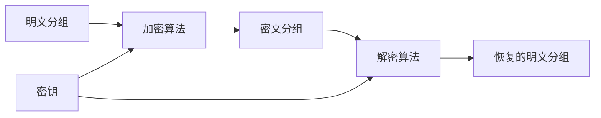
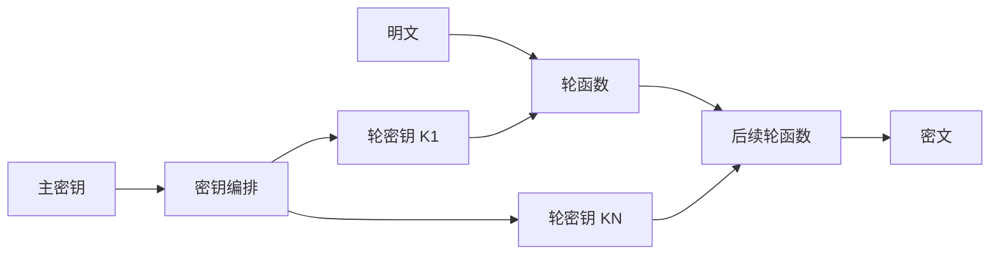
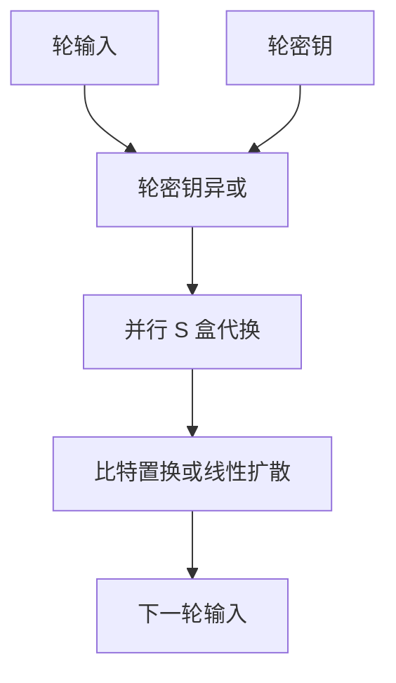

# 4.2 分组密码（一）

> 本笔记依据“第4章 分组密码（一）”课件整理，从分组密码定义、发展历史和安全性出发，介绍穷举、线性与差分分析，以及混淆、扩散、Feistel 和 SPN 设计结构。课件中的结构图、流程与 SPN 算例均已转写为 Mermaid、公式和文本步骤。

## 主要内容

- 分组密码的密码体制、优缺点与发展历史
- 分组密码的攻击模型与安全性
- 穷举、线性、差分和相关密钥分析
- 混淆、扩散与迭代结构
- Feistel 结构与 SPN 结构
- SPN 的形式化算法和完整算例
- DES 与 AES 的基本参数概览

---

## 一、分组密码的定义

### 1. 密码体制

> **定义**：一个分组密码体制为 $(P,K,C,E,D)$，其中
> $$
> P=C=\{0,1\}^l,\qquad K=\{0,1\}^t.
> $$
> 加密变换 $E:P\times K\to C$；对每个 $k\in K$，$E_k$ 是 $P\to C$ 的一一映射。解密变换 $D:C\times K\to P$，且
> $$
> D_k\circ E_k=I.
> $$

长消息先编码成二进制数据流，再划分成固定长度分组逐组处理。



### 2. 优点与缺点

| 方面 | 说明 |
|---|---|
| 优点 | 易于标准化；易同步；单个分组传输错误通常不会直接影响其他独立分组 |
| 缺点 | 同一密钥下，相同明文分组可能产生相同密文；不能天然抵抗重放、嵌入与删除攻击，需配合认证机制 |

---

## 二、发展历史

### 1. DES 与 AES

1. 1973 年美国联邦政府提出保护传输和存储数据的密码算法建议；1975 年 NBS 公布 IBM 提交的 Lucifer 方案。
2. 1977 年，采用 IBM 方案的数据加密标准 DES 成为 FIPS 46，并于同年生效；NSA 对其进行评估。
3. 1997 年，约 10 万美元的机器可在约 6 小时内穷举 DES；互联网分布式挑战也在约 96 天后完成攻击。
4. 1997 年 NIST 再次评估 DES，认为安全强度不足，开始征集 AES；新标准采用 128 比特分组，支持 128、192、256 比特密钥。
5. 1999 年 NIST 从 15 个候选算法中选出 MARS、RC6、Rijndael、Serpent、Twofish；最终确定 Rijndael，2001 年以 FIPS 197 发布。

课件给出的 AES 计划入口为 [NIST AES](https://www.nist.gov/aes)。

### 2. 欧洲、日本与中国

- 欧洲 NESSIE 工程收集 17 个分组密码，最后推荐 MISTY1-64、Camellia-128、AES-128、SHACAL-2 等。
- 日本 CRYPTREC 委员会推荐 64 比特分组算法 CIPHERUNICORN-E、MISTY1、3-key-TDES，以及 128 比特分组算法 Camellia、CIPHERUNICORN-A、Hierocrypt-3、SC2000、Rijndael-128。
- 中国 WAPI 是无线局域网安全国家标准；2006 年公布 SMS4，2012 年成为 GM/T 0002-2012，并更名为 SM4。

---

## 三、安全性与攻击方法

### 1. 攻击模型

现代分组密码算法公开，安全性依赖密钥。成功的密码分析是攻击者能够恢复明文或密钥。常见攻击模型为：

1. 唯密文攻击：  
   只获得密文样本。
2. 已知明文攻击：  
   获得若干明文—密文对。
3. 选择明文攻击：  
   可选择明文并获得相应密文。
4. 选择密文攻击：  
   可选择密文并获得相应明文。

### 2. 典型方法

| 方法 | 核心思想 |
|---|---|
| 穷举密钥搜索 | 遍历候选密钥，以已知样本判断是否正确 |
| 线性分析 | 寻找明文、密文和密钥比特之间带偏差的线性近似 |
| 差分分析 | 研究输入差分经过各轮后产生输出差分的概率 |
| 相关密钥分析 | 利用若干具有已知关系的密钥下的加密结果 |
| 中间相遇攻击 | 从加密端和解密端计算中间值，以时间—空间折中攻击多重加密 |

### 3. 线性分析

线性分析试图构造明文 $P$、密文 $C$ 和密钥 $K$ 比特的关系

$$
a\cdot P\oplus b\cdot C=c\cdot K.
$$

若成立概率为 $p$，偏差为 $\varepsilon=p-\frac12$。$|\varepsilon|$ 越大，需要的数据量越小。攻击者收集已知明文—密文对，统计表达式偏离随机分布的程度，再筛选密钥比特。

### 4. 差分分析

> **差分**：选择两个明文 $P,P'$，令
> $$
> \Delta P=P\oplus P',\qquad \Delta C=C\oplus C'.
> $$
> 差分路径描述输入差分在各轮中产生中间差分和输出差分的概率。

攻击者选择高概率路径，收集选择明文对，再依据最后若干轮的候选子密钥是否符合预期差分来筛选密钥。

### 5. 安全性层次与复杂度

- 无条件安全：任何计算能力也不能从密文获得额外明文信息。
- 计算安全：破译所需资源超过现实可用资源。
- 相对安全：在给定攻击与资源模型下，没有明显优于穷举的攻击。

若密钥空间大小为 $2^t$，最坏穷举次数为 $2^t$，平均约 $2^{t-1}$。评估攻击还须同时考察数据复杂度、处理复杂度、存储复杂度和成功概率。

---

## 四、设计原则与结构

### 1. 设计目标

分组密码应在密钥控制下，从足够大的置换集合中快速选出一个置换。设计须兼顾足够大的分组与密钥、抵抗已知攻击、雪崩效应，以及软硬件实现效率。

> **混淆**：使密钥、明文与密文之间的依赖关系复杂，通常由非线性代换实现。

> **扩散**：使一个输入比特的变化扩散到许多输出比特，通常由置换或线性混合实现。

课件采用“乘积密码”思路：交替使用代换与置换，多轮迭代，并由主密钥生成轮密钥。



### 2. Feistel 结构

> 将输入分成 $(L_0,R_0)$。第 $i$ 轮为
> $$
> L_i=R_{i-1},\qquad R_i=L_{i-1}\oplus F(R_{i-1},K_i).
> $$

解密使用同一结构，只需反转子密钥顺序。代表算法有 DES、CAST、Skipjack。

### 3. SPN 结构

SPN 每轮包含并行 S 盒代换与 P 置换，比 Feistel 更易并行实现。AES、Serpent 是典型代表。



---

## 五、SPN 的形式化描述

### 1. 参数与算法

设明文长度为 $lm$ 比特。S 盒 $\pi_S:\{0,1\}^l\to\{0,1\}^l$ 是置换，P 置换 $\pi_P$ 作用于 $lm$ 个比特位置，总轮数为 $N_r$，轮密钥为 $(K^1,\ldots,K^{N_r+1})$。

```text
w^0 := x
for r = 1,...,Nr-1:
    u^r := w^(r-1) XOR K^r
    将 u^r 分成 m 个 l 比特字，分别经 πS 得到 v^r
    w^r := πP(v^r)
u^Nr := w^(Nr-1) XOR K^Nr
将 u^Nr 的 m 个字分别经 πS 得到 v^Nr
y := v^Nr XOR K^(Nr+1)
```

首尾的轮密钥异或称为白化。使用逆 S 盒并反向使用轮密钥即可解密。

### 2. 课件算例

取 $l=m=N_r=4$。S 盒为：

| 输入 | 0 | 1 | 2 | 3 | 4 | 5 | 6 | 7 | 8 | 9 | A | B | C | D | E | F |
|---|---|---|---|---|---|---|---|---|---|---|---|---|---|---|---|---|
| 输出 | E | 4 | D | 1 | 2 | F | B | 8 | 3 | A | 6 | C | 5 | 9 | 0 | 7 |

P 置换为：

| $i$ | 1 | 2 | 3 | 4 | 5 | 6 | 7 | 8 | 9 | 10 | 11 | 12 | 13 | 14 | 15 | 16 |
|---|---|---|---|---|---|---|---|---|---|---|---|---|---|---|---|---|
| $\pi_P(i)$ | 1 | 5 | 9 | 13 | 2 | 6 | 10 | 14 | 3 | 7 | 11 | 15 | 4 | 8 | 12 | 16 |

主密钥与轮密钥：

```text
K  = 0011 1010 1001 0100 1101 0110 0011 1111
K1 = 0011 1010 1001 0100
K2 = 1010 1001 0100 1101
K3 = 1001 0100 1101 0110
K4 = 0100 1101 0110 0011
K5 = 1101 0110 0011 1111
```

对明文 `x = 0010 0110 1011 0111`，逐轮代换、置换和密钥异或后，课件结果为：

| 步骤 | 16 比特状态 |
|---|---|
| $w^0=x$ | `0010 0110 1011 0111` |
| $K^1$ | `0011 1010 1001 0100` |
| $u^1=w^0\oplus K^1$ | `0001 1100 0010 0011` |
| $v^1=\pi_S(u^1)$ | `0100 0101 1101 0001` |
| $w^1=\pi_P(v^1)$ | `0010 1110 0000 0111` |
| $K^2$ | `1010 1001 0100 1101` |
| $u^2$ | `1000 0111 0100 1010` |
| $v^2$ | `0011 1000 0010 0110` |
| $w^2$ | `0100 0001 1011 1000` |
| $K^3$ | `1001 0100 1101 0110` |
| $u^3$ | `1101 0101 0110 1110` |
| $v^3$ | `1001 1111 1011 0000` |
| $w^3$ | `1110 0100 0110 1110` |
| $K^4$ | `0100 1101 0110 0011` |
| $u^4$ | `1010 1001 0000 1101` |
| $v^4$ | `0110 1010 1110 1001` |
| $K^5$ | `1101 0110 0011 1111` |
| $y=v^4\oplus K^5$ | `1011 1100 1101 0110` |

该简单密钥编排只用于说明 SPN，并非安全设计。实际 SPN 需要更长密钥、更大或多个 S 盒以及更多轮。

一个 $l$ 比特到 $l$ 比特的 S 盒查表需存储 $l2^l$ 比特。算例的 4 比特 S 盒需 $2^6$ 比特；16 比特 S 盒需 $2^{20}$ 比特，代价过高；AES 采用 8 比特到 8 比特 S 盒，DES 则采用 6 比特到 4 比特 S 盒。SPN 还可每轮使用不同 S 盒，或用可逆线性变换替代、补充纯比特置换。

---

## 六、DES 与 AES 概览

| 算法 | 分组长度 | 密钥长度 | 结构与轮数 |
|---|---:|---:|---|
| DES | 64 比特 | 输入 64 比特，8 比特为校验，有效 56 比特 | 16 轮 Feistel |
| AES | 128 比特 | 128、192、256 比特 | SPN；10、12、14 轮 |

---

## 本章小结

| 主题 | 核心结论 |
|---|---|
| 分组密码 | 固定长度分组上的密钥控制置换 |
| 线性分析 | 利用概率偏离 $1/2$ 的线性近似 |
| 差分分析 | 利用输入差分到输出差分的高概率传播 |
| 混淆与扩散 | 非线性代换隐藏关系，线性层扩散变化 |
| Feistel | 加解密结构一致，只反转子密钥顺序 |
| SPN | 轮密钥加、并行 S 盒和扩散层迭代 |
