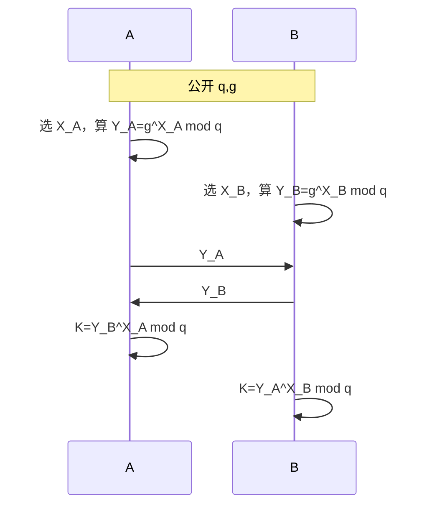

# 7.3 公钥密码学（三）

> 本笔记依据“公钥密码学 3”课件整理，覆盖群与循环群、离散对数、CDH/DDH、Diffie-Hellman、ElGamal、素数模与合数模二次剩余、Jacobi 符号、Rabin 和 Goldwasser-Micali。课件 38 页已逐页核查；人物照片为历史背景，协议图、剩余类表与 CRT 求根结构均已改写为可检索的公式、表格和 Mermaid。

## 主要内容

- 群、交换群、循环群与生成元
- 原根、离散对数、CDH 与 DDH
- Diffie-Hellman 密钥协商
- $\mathbb Z_p^*$ 上的 ElGamal 密码体制
- 素数模二次剩余与 Legendre/Jacobi 符号
- 合数模二次剩余、四个平方根与二次剩余假设
- 模平方根、中国剩余定理与 Rabin 密码
- Goldwasser-Micali 概率加密

---

## 一、群与循环群

### 1. 群的定义

> 设 $G$ 为非空集合，在 $G$ 上定义二元运算 $\circ$。若满足以下四条，则 $(G,\circ)$ 为群：
> 1. 封闭性：$a,b\in G\Rightarrow a\circ b\in G$；
> 2. 结合律：$(a\circ b)\circ c=a\circ(b\circ c)$；
> 3. 单位元：存在唯一 $e\in G$，对任意 $g\in G$，$e\circ g=g\circ e=g$；
> 4. 逆元：每个 $g\in G$ 存在唯一 $g^{-1}$，使 $g\circ g^{-1}=g^{-1}\circ g=e$。

若只满足封闭性和结合律，称为半群。

例：

- $(\mathbb Z,+)$ 是群。
- 全体非零有理数关于乘法构成群。
- 模 $N$ 剩余类 $\mathbb Z_N$ 关于模 $N$ 加法构成群。

### 2. 交换群

> 若群中任意 $a,b$ 都满足 $a\circ b=b\circ a$，则称为交换群或 Abel 群。

模 $N$ 既约剩余类系

$$
\mathbb Z_N^*=\{b\in\{1,\ldots,N-1\}:\gcd(b,N)=1\}
$$

关于模 $N$ 乘法构成交换群，群阶为 $\varphi(N)$。

### 3. 循环群

> 若存在 $a\in G$ 使
> $$
> G=\langle a\rangle=\{a^n:n\in\mathbb Z\},
> $$
> 则 $G$ 为循环群，$a$ 为生成元。

$(\mathbb Z,+)=\langle1\rangle$。若 $p$ 是素数，则 $(\mathbb Z_p^*,\times)$ 为循环群，其生成元又称模 $p$ 的原根。

---

## 二、离散对数与 DH 问题

### 1. 原根与离散对数

> 若 $a,a^2,\ldots,a^{p-1}$ 模素数 $p$ 的结果恰为 $1,2,\ldots,p-1$ 的一个排列，则 $a$ 是模 $p$ 的原根。

以 $p=19$ 为例：

| $i$ | 1 | 2 | 3 | 4 | 5 | 6 | 7 | 8 | 9 | 10 | 11 | 12 | 13 | 14 | 15 | 16 | 17 | 18 |
|---|---|---|---|---|---|---|---|---|---|---|---|---|---|---|---|---|---|---|
| $2^i\bmod19$ | 2 | 4 | 8 | 16 | 13 | 7 | 14 | 9 | 18 | 17 | 15 | 11 | 3 | 6 | 12 | 5 | 10 | 1 |
| $3^i\bmod19$ | 3 | 9 | 8 | 5 | 15 | 7 | 2 | 6 | 18 | 16 | 10 | 11 | 14 | 4 | 12 | 17 | 13 | 1 |
| $4^i\bmod19$ | 4 | 16 | 7 | 9 | 17 | 11 | 6 | 5 | 1 | 4 | 16 | 7 | 9 | 17 | 11 | 6 | 5 | 1 |

2 和 3 生成所有非零剩余类，而 4 在第 9 次即回到 1，不是原根。

> 对 $b<p$ 和模 $p$ 原根 $a$，存在唯一 $0\leq i<p-1$ 使
> $$
> b\equiv a^i\pmod p.
> $$
> $i$ 称为 $b$ 以 $a$ 为底模 $p$ 的离散对数，记为 $\operatorname{ind}_{a,p}(b)$。

已知 $a,x,p$ 计算 $b=a^x\bmod p$ 容易；已知 $a,b,p$ 求 $x$ 困难。

### 2. CDH 与 DDH

在循环群 $G=\langle g\rangle$ 中，若 $h_1=g^x,h_2=g^y$，定义

$$
DH_g(h_1,h_2)=g^{xy}=h_1^y=h_2^x.
$$

> **CDH 问题**：给定随机 $h_1,h_2$，计算 $DH_g(h_1,h_2)$。

> **DDH 问题**：给定 $g^x,g^y$ 和一个群元素，判定该元素是 $g^{xy}$ 还是随机群元素。

---

## 三、Diffie-Hellman 密钥协商

### 1. 协议

公开素数 $q$ 及其原根 $g$。

1. A 选私钥 $X_A$，发布 $Y_A=g^{X_A}\bmod q$。
2. B 选私钥 $X_B$，发布 $Y_B=g^{X_B}\bmod q$。
3. A 计算

$$
K_A=Y_B^{X_A}\bmod q.
$$

4. B 计算

$$
K_B=Y_A^{X_B}\bmod q.
$$

由于

$$
K_A=K_B=g^{X_AX_B}\bmod q,
$$

双方得到同一会话密钥。

课件展示了 Whitfield Diffie 与 Martin Hellman 的人物照片，并注明二人获得 2015 年图灵奖及 100 万美元奖金；照片本身不承载协议参数。

### 2. 实例

公开 $q=97,g=5$，5 是 97 的原根。A 选 $X_A=36$，B 选 $X_B=58$：

$$
Y_A=5^{36}\bmod97=50,
$$

$$
Y_B=5^{58}\bmod97=44.
$$

交换后：

$$
K_A=44^{36}\bmod97=75,
$$

$$
K_B=50^{58}\bmod97=75.
$$

---

## 四、ElGamal 密码体制

### 1. 密码体制

> 设 $p$ 为素数，$\alpha$ 是 $\mathbb Z_p^*$ 的本原元，离散对数问题在该群上难解。令
> $$
> \mathcal P=\mathbb Z_p^*,\qquad
> \mathcal C=\mathbb Z_p^*\times\mathbb Z_p^*.
> $$
> 选私钥 $a$，计算
> $$
> \beta\equiv\alpha^a\pmod p.
> $$
> 公钥为 $(p,\alpha,\beta)$，私钥为 $a$。

加密时随机选 $k\in\mathbb Z_{p-1}$：

$$
y_1=\alpha^k\bmod p,
$$

$$
y_2=x\beta^k\bmod p,
$$

输出 $(y_1,y_2)$。解密：

$$
x=y_2(y_1^a)^{-1}\bmod p.
$$

正确性为

$$
y_1^a=(\alpha^k)^a=(\alpha^a)^k=\beta^k.
$$

ElGamal 加密是随机的；对同一明文，随 $k$ 不同可有多个密文。$y_2$ 是以 $\beta^k$ 乘法掩蔽的明文，$y_1$ 使私钥持有者能够重建该掩蔽量。

### 2. 实例

取 $p=2579,\alpha=2,a=765$：

$$
\beta=2^{765}\bmod2579=949.
$$

Alice 要发送 $x=1299$，随机选 $k=853$：

$$
y_1=2^{853}\bmod2579=435,
$$

$$
y_2=1299\times949^{853}\bmod2579=2396.
$$

Bob 收到 $(435,2396)$：

$$
x=2396\times(435^{765})^{-1}\bmod2579=1299.
$$

---

## 五、素数模二次剩余

### 1. 定义与平方根个数

> 给定群 $G$，若存在 $x\in G$ 使 $x^2=y$，则 $y$ 是二次剩余。在 $\mathbb Z_p^*$ 中，若 $x^2\equiv y\pmod p$ 有解，则 $y$ 是模 $p$ 二次剩余。

> 若 $p>2$ 为素数，则每个模 $p$ 二次剩余恰有两个平方根 $x$ 与 $-x$。

证明：显然 $(-x)^2=x^2$。若 $x'{}^2\equiv x^2\pmod p$，则

$$
(x'-x)(x'+x)\equiv0\pmod p.
$$

由 $p$ 为素数，得 $x'\equiv x$ 或 $x'\equiv-x\pmod p$。又因 $p>2$，两根不同。

### 2. 模 7 的例子

| 方程 | 解 | 结论 |
|---|---|---|
| $x^2\equiv1\pmod7$ | $1,6$ | 1 是二次剩余 |
| $x^2\equiv2\pmod7$ | $3,4$ | 2 是二次剩余 |
| $x^2\equiv3\pmod7$ | 无 | 3 是二次非剩余 |
| $x^2\equiv4\pmod7$ | $2,5$ | 4 是二次剩余 |
| $x^2\equiv5\pmod7$ | 无 | 5 是二次非剩余 |
| $x^2\equiv6\pmod7$ | 无 | 6 是二次非剩余 |

因此

$$
|QR_p|=|QNR_p|=\frac{p-1}{2}.
$$

### 3. Legendre/Jacobi 符号与 Euler 判别

课件记

$$
J_p(x)=
\begin{cases}
0,&x\equiv0\pmod p,\\
+1,&x\in QR_p,\\
-1,&x\in QNR_p.
\end{cases}
$$

> **Euler 判别准则**：
> $$
> J_p(x)\equiv x^{(p-1)/2}\pmod p.
> $$

因此可通过一次模幂判定素数模二次剩余：计算 $b=x^{(p-1)/2}\bmod p$；若 $b=1$ 则为二次剩余，否则为二次非剩余。

乘法性：

$$
J_p(xy)=J_p(x)J_p(y).
$$

所以：

1. $QR_p\cdot QR_p\subseteq QR_p$。
2. $QNR_p\cdot QNR_p\subseteq QR_p$。
3. $QR_p\cdot QNR_p\subseteq QNR_p$。

---

## 六、合数模二次剩余

### 1. CRT 表征

设 $N=pq$，其中 $p,q$ 是不同奇素数。由 CRT，

$$
y\longleftrightarrow(y_p,y_q).
$$

> $y$ 是模 $N$ 二次剩余，当且仅当 $y_p$ 是模 $p$ 二次剩余且 $y_q$ 是模 $q$ 二次剩余。

### 2. 四个平方根

若 $y\leftrightarrow(y_p,y_q)$，且 $x_p^2=y_p,x_q^2=y_q$，则模 $N$ 的四个平方根分别对应

$$
(x_p,x_q),\quad(-x_p,x_q),\quad(x_p,-x_q),\quad(-x_p,-x_q).
$$

CRT 保证它们对应模 $N$ 的四个不同元素。因此平方映射在 $\mathbb Z_N^*$ 上是 4 对 1 的，

$$
\frac{|QR_N|}{|\mathbb Z_N^*|}=\frac14.
$$

**例**：模 15 中，4 的一个平方根是 2，对应 $(2,2)$（模 5 与模 3）。其他符号组合对应 7、8、13，且

$$
2^2\equiv7^2\equiv8^2\equiv13^2\equiv4\pmod{15}.
$$

### 3. 合数模 Jacobi 符号

定义

$$
J_N(x)=J_p(x)J_q(x).
$$

所有模 $N$ 二次剩余都有 $J_N(x)=+1$，但逆命题不成立：当 $J_p(x)=J_q(x)=-1$ 时，也有 $J_N(x)=+1$。记

$$
QNR_N^{+1}
=\{x\in\mathbb Z_N^*:x\notin QR_N,\ J_N(x)=+1\}.
$$

> $\mathbb Z_N^*$ 中恰有一半元素属于 $J_N^{+1}$；$QR_N\subset J_N^{+1}$；$J_N^{+1}$ 中一半是 $QR_N$，另一半是 $QNR_N^{+1}$。

$J_N$ 同样满足乘法性：

$$
J_N(xy)=J_N(x)J_N(y).
$$

课件给出 Jacobi 符号性质：

$$
J_N(1)=1,
$$

$$
J_N(-1)=(-1)^{(N-1)/2},
$$

$$
J_N(2)=(-1)^{(N^2-1)/8}.
$$

二次互反律用于递归计算 Jacobi 符号。课件例：

$$
J_{317}(105)=J_{105}(317)=J_{105}(2)=1.
$$

### 4. 二次剩余假设

若已知 $N=pq$ 的分解，可分别计算 $J_p(x),J_q(x)$：二者都为 $+1$ 时 $x\in QR_N$，否则为二次非剩余。

若不知道分解，$J_N(x)$ 仍可多项式时间计算，但课件指出没有已知多项式时间算法在 $J_N(x)=+1$ 时区分 $QR_N$ 与 $QNR_N^{+1}$。当 $J_N(x)=-1$ 时则可直接排除二次剩余。

---

## 七、模平方根、CRT 与 Rabin

### 1. $p\equiv3\pmod4$ 时求平方根

若 $p$ 为奇素数、$p\equiv3\pmod4$，且 $a$ 为模 $p$ 二次剩余，则一个平方根为

$$
x=a^{(p+1)/4}\bmod p.
$$

因为 $J_p(a)=a^{(p-1)/2}\equiv1$，故

$$
x^2=a^{(p+1)/2}=a\cdot a^{(p-1)/2}\equiv a\pmod p.
$$

### 2. 中国剩余定理

> 若 $m_1,\ldots,m_n$ 两两互素，则同余组
> $$
> x\equiv a_i\pmod{m_i},\qquad i=1,\ldots,n
> $$
> 在模 $N=\prod_i m_i$ 下有唯一解：
> $$
> x\equiv\sum_{i=1}^n a_i\frac{N}{m_i}
> \left(\frac{N}{m_i}\right)^{-1}_{m_i}\pmod N.
> $$

### 3. Rabin 密码体制

> Rabin 的安全性基于合数模平方根问题，该问题等价于因子分解难度。

1. `Gen`：选 $p\equiv q\equiv3\pmod4$，私钥为 $(p,q)$，公钥为 $N=pq$。
2. `Enc`：对 $M<N$，

$$
C=M^2\bmod N.
$$

3. `Dec`：分别计算模 $p,q$ 的两个平方根：

$$
m_1=C^{(p+1)/4}\bmod p,\qquad m_2=-m_1\bmod p,
$$

$$
m_3=C^{(q+1)/4}\bmod q,\qquad m_4=-m_3\bmod q.
$$

令

$$
a=q(q^{-1}\bmod p),\qquad b=p(p^{-1}\bmod q),
$$

用 CRT 组合四个根：

$$
M_1=(am_1+bm_3)\bmod N,
$$

$$
M_2=(am_1+bm_4)\bmod N,
$$

$$
M_3=(am_2+bm_3)\bmod N,
$$

$$
M_4=(am_2+bm_4)\bmod N.
$$

解密产生四个候选明文，需要额外编码冗余来识别真正消息。

---

## 八、Goldwasser-Micali 加密

### 1. 密码体制

> Goldwasser-Micali 方案基于判定性二次剩余问题，课件将其安全基础表述为等价于因子分解问题。

1. `Gen`：输入 $1^n$，选素数 $p,q$，令 $N=pq$；随机选

$$
z\leftarrow QNR_N^{+1}.
$$

公钥 $pk=(N,z)$，私钥 $sk=(p,q)$。
2. `Enc`：对比特 $m\in\{0,1\}$，随机选 $x\leftarrow\mathbb Z_N^*$，输出

$$
c=z^m x^2\bmod N.
$$

3. `Dec`：利用 $p,q$ 判断 $c$ 是否为模 $N$ 二次剩余；若是输出 0，否则输出 1。

### 2. 正确性

若 $m=0$，则 $c=x^2\in QR_N$。若 $m=1$，则 $c=zx^2$；由于 $z\in QNR_N^{+1}$ 且二次剩余与其相乘仍在 $QNR_N^{+1}$，解密输出 1。随机 $x$ 使同一比特可产生多个密文。

---

## 本章小结

| 主题          | 核心结论                         |
| ----------- | ---------------------------- |
| 循环群         | 一个生成元的幂可遍历整个群                |
| DLP/CDH/DDH | 分别刻画指数恢复、共享幂计算和共享幂判定困难性      |
| DH          | 双方交换公开幂并得到 $g^{ab}$          |
| ElGamal     | 随机 $k$ 产生概率加密，安全基础为离散对数类问题   |
| 素数模 QR      | 二次剩余占一半，每个有两个根               |
| 合数模 QR      | 对 $N=pq$，二次剩余占四分之一，每个有四个根    |
| Rabin       | 加密是平方，解密用因子分解与 CRT 求四根       |
| GM          | 以 $QR_N$ 与 $QNR_N^{+1}$ 编码比特 |
