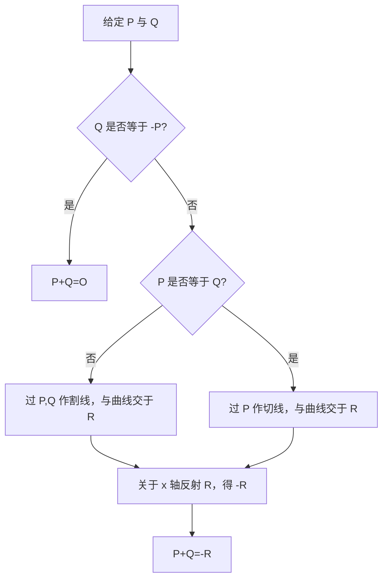
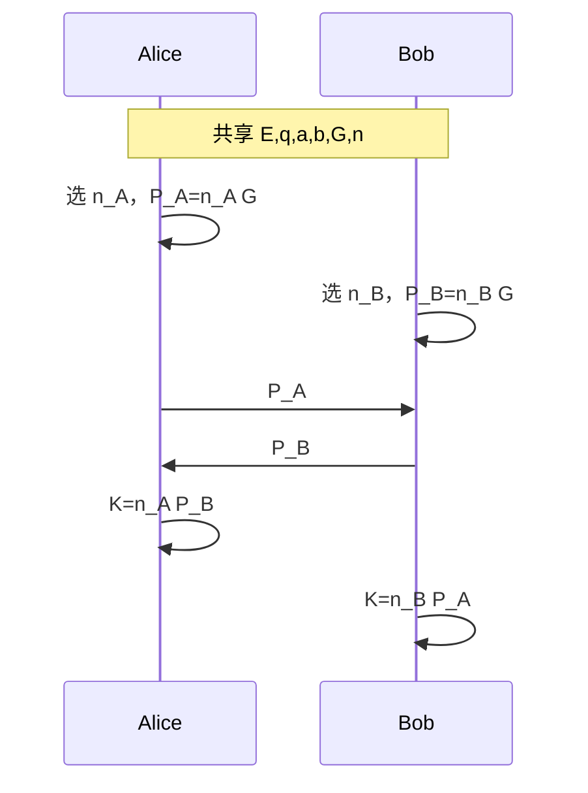
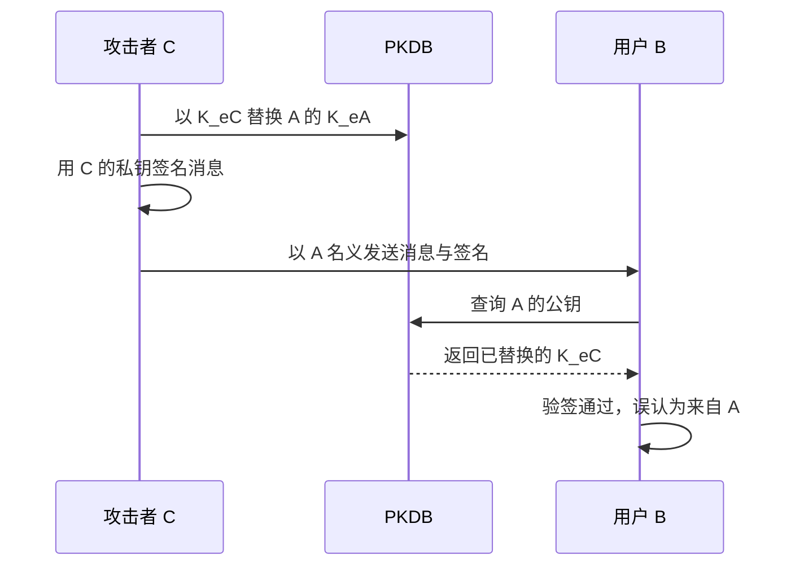
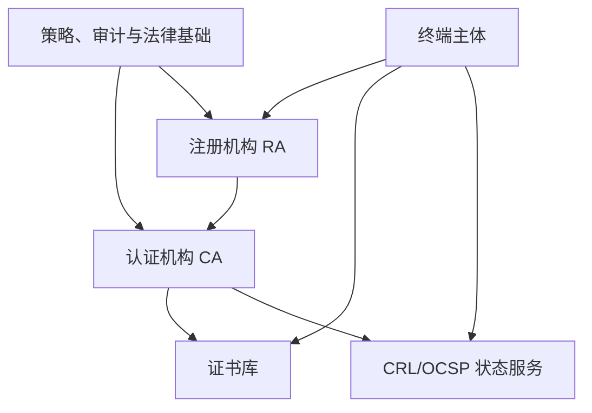
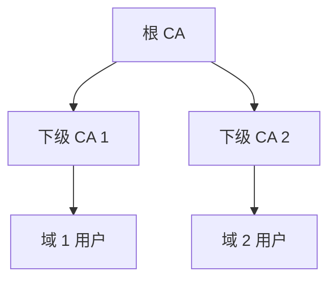
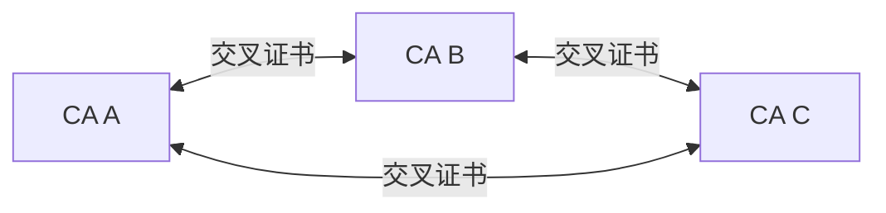
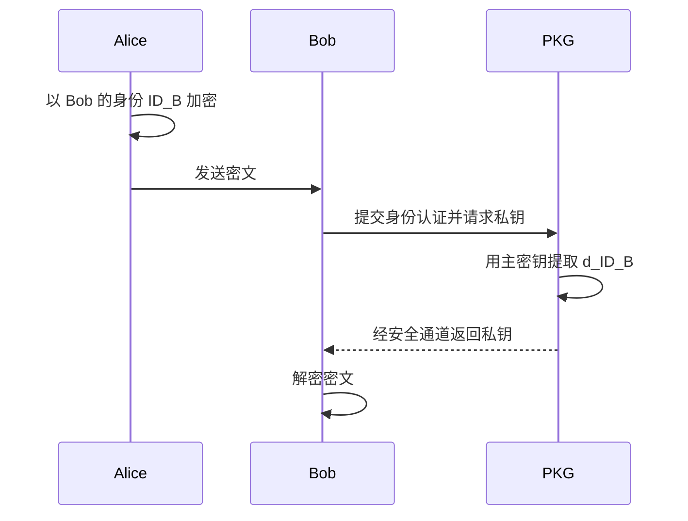
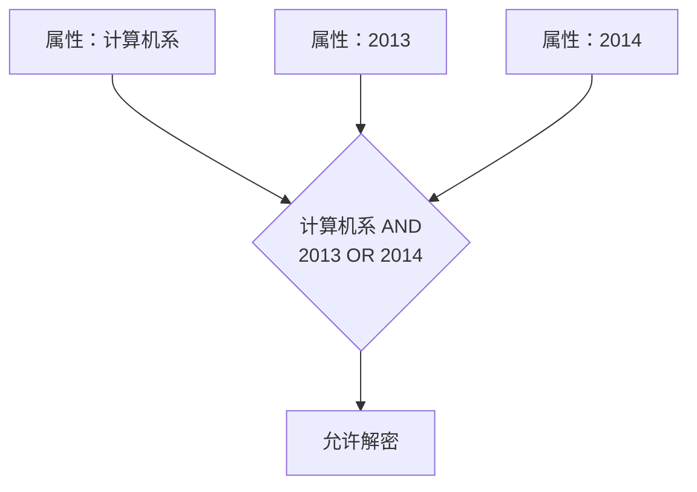
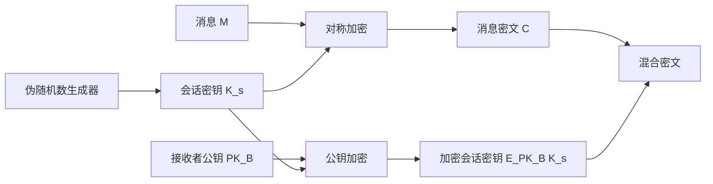
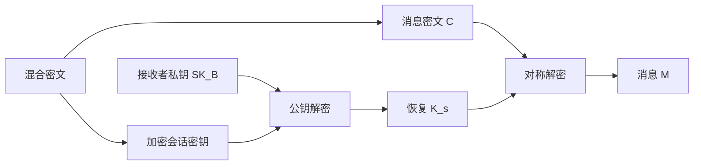

# 7.4 公钥密码学（四）

> 本笔记依据“公钥密码学 4”课件整理，内容从椭圆曲线群与 ECC 扩展到 SM2、公钥证书与 PKI、IBE/ABE、无证书密码和混合密码系统。课件 95 页已逐页核查，曲线几何图、PKI 层次图、IBE/ABE 访问结构和混合加密流程均已转写为公式、管道表格、Mermaid 或完整文字。

## 主要内容

- 实数域与有限域上的椭圆曲线及点加法
- 椭圆曲线点构造与椭圆曲线离散对数
- ECDH、EC-ElGamal 与 SM2 加密
- ECC 与 RSA 的安全强度和性能比较
- 公钥替换攻击、X.509 证书与 PKI
- IBE、Boneh-Franklin、HIBE、模糊身份与 ABE
- 无证书公钥密码及信任等级
- 混合密码系统与密码技术组合

---

## 一、椭圆曲线基础

### 1. 历史与一般方程

椭圆曲线研究已有 150 多年历史。1985 年，Washington 大学的 Neal Koblitz 和 IBM 的 Victor Miller 分别把椭圆曲线用于密码学。目前课件将椭圆曲线与 RSA 列为应用最广泛的公钥算法。

椭圆曲线并非椭圆；其名称来自曲线方程与椭圆周长计算方程的历史联系。一般三次方程写作

$$
y^2+axy+by=x^3+cx^2+dx+e,
$$

其中 $a,b,c,d,e$ 满足使曲线非奇异的条件。

### 2. 实数域上的群运算

> 若椭圆曲线上三点位于同一直线，则定义三点之和为无穷远点 $O$。$O$ 是加法单位元。

几何规则：

1. $P$ 与 $-P$ 的连线为竖直线，故 $P+(-P)=O$。
2. 对不同点 $P,Q$，连线与曲线第三次相交于 $R$，则 $P+Q=-R$。
3. 计算 $2P$ 时，过 $P$ 作切线，切线与曲线另一交点为 $R$，则 $2P=-R$。
4. 若 $P$ 处切线斜率为 0，则课件给出 $2P=O$，后续倍点在 $P,O$ 之间循环。

---

## 二、有限域椭圆曲线群

### 1. 定义

> 对素数 $p$，曲线
> $$
> y^2\equiv x^3+ax+b\pmod p
> $$
> 在
> $$
> 4a^3+27b^2\not\equiv0\pmod p
> $$
> 时构成有限域 $\mathbb F_p$ 上的非奇异椭圆曲线，记为 $E_p(a,b)$。曲线上所有有限点连同 $O$ 关于点加法构成 Abel 群。

单位元与逆元为

$$
P+O=O+P=P,
$$

$$
-(x,y)=(x,-y\bmod p).
$$

### 2. 不同点相加

设 $P=(x_P,y_P)$、$Q=(x_Q,y_Q)$，且 $x_P\neq x_Q$。令 $P+Q=R=(x_R,y_R)$：

$$
\lambda=(y_Q-y_P)(x_Q-x_P)^{-1}\bmod p,
$$

$$
x_R=\lambda^2-x_P-x_Q\bmod p,
$$

$$
y_R=\lambda(x_P-x_R)-y_P\bmod p.
$$

**例**：在 $E_{23}(1,1)$ 上，$P=(3,10),Q=(9,7)$。

$$
\lambda=\frac{7-10}{9-3}\equiv11\pmod{23},
$$

$$
x_R=11^2-3-9\equiv17\pmod{23},
$$

$$
y_R=11(3-17)-10\equiv20\pmod{23}.
$$

所以

$$
P+Q=(17,20).
$$

### 3. 倍点

若 $P=(x_P,y_P)$ 且 $y_P\neq0$，则

$$
\lambda=(3x_P^2+a)(2y_P)^{-1}\bmod p,
$$

$$
x_R=\lambda^2-2x_P\bmod p,
$$

$$
y_R=\lambda(x_P-x_R)-y_P\bmod p.
$$

**例**：在 $E_{23}(1,1)$ 上，$P=(3,10)$：

$$
\lambda=\frac{3\times3^2+1}{2\times10}=\frac14\equiv6\pmod{23},
$$

$$
x_R=6^2-2\times3\equiv7\pmod{23},
$$

$$
y_R=6(3-7)-10\equiv12\pmod{23}.
$$

所以 $2P=(7,12)$。

若 $x_P=x_Q$ 且 $y_P=-y_Q$，定义

$$
(x,y)+(x,-y)=O.
$$

### 4. 群性质

- 对点加法封闭。
- 点加法可交换。
- $O$ 为单位元。
- 每点都有逆元。
- 点加法满足结合律，因此 $(E,+)$ 为 Abel 群。

---

## 三、椭圆曲线点的构造

### 1. 枚举方法

对每个 $0\leq x<p$：

1. 计算

$$
z=x^3+ax+b\bmod p.
$$

2. 若 $z$ 不是模 $p$ 二次剩余，则不存在该横坐标的曲线点。
3. 若 $z$ 是非零二次剩余，则通常得到 $y$ 与 $-y$ 两个点；若 $z=0$，只得到 $y=0$。

### 2. $E_{11}(1,6)$

曲线为 $y^2=x^3+x+6$。因 $11\equiv3\pmod4$，二次剩余 $z$ 的平方根可由

$$
y=\pm z^{(11+1)/4}=\pm z^3\pmod{11}
$$

计算。

| $x$ | $x^3+x+6\bmod11$ | 是否二次剩余 | $y$ |
|---|---|---|---|
| 0 | 6 | 否 |  |
| 1 | 8 | 否 |  |
| 2 | 5 | 是 | 4, 7 |
| 3 | 3 | 是 | 5, 6 |
| 4 | 8 | 否 |  |
| 5 | 4 | 是 | 2, 9 |
| 6 | 8 | 否 |  |
| 7 | 4 | 是 | 2, 9 |
| 8 | 9 | 是 | 3, 8 |
| 9 | 7 | 否 |  |
| 10 | 4 | 是 | 2, 9 |

另加无穷远点 $O$。

### 3. $E_{23}(1,0)$

曲线为 $y^2=x^3+x$。课件列出的 23 个有限点为：

|  |  |  |  |  |
|---|---|---|---|---|
| $(0,0)$ | $(1,5)$ | $(1,18)$ | $(9,5)$ | $(9,18)$ |
| $(11,10)$ | $(11,13)$ | $(13,5)$ | $(13,18)$ | $(15,3)$ |
| $(15,20)$ | $(16,8)$ | $(16,15)$ | $(17,10)$ | $(17,13)$ |
| $(18,10)$ | $(18,13)$ | $(19,1)$ | $(19,22)$ | $(20,4)$ |
| $(20,19)$ | $(21,6)$ | $(21,17)$ |  |  |

再加 $O$，群中共有 24 个元素。

---

## 四、ECDLP 与椭圆曲线协议

### 1. 椭圆曲线离散对数

> 给定曲线上的点 $P,Q$，寻找整数 $k$ 使 $Q=kP$，称为椭圆曲线离散对数问题（ECDLP），$k$ 为 $Q$ 基于 $P$ 的离散对数。

**例**：在

$$
y^2=x^3+9x+17\quad\text{over }\mathbb F_{23}
$$

上，$P=(16,5),Q=(4,5)$。遍历倍点：

| 倍数 | 点 | 倍数 | 点 |
|---|---|---|---|
| $P$ | $(16,5)$ | $2P$ | $(20,20)$ |
| $3P$ | $(14,14)$ | $4P$ | $(19,20)$ |
| $5P$ | $(13,10)$ | $6P$ | $(7,3)$ |
| $7P$ | $(8,7)$ | $8P$ | $(12,17)$ |
| $9P$ | $(4,5)$ |  |  |

故 $k=9$。

### 2. $\mathbb Z_p^*$ 与 $E(\mathbb F_p)$ 对比

| 项目 | $\mathbb Z_p^*$ | $E(\mathbb F_p)$ |
|---|---|---|
| 群元素 | $1,2,\ldots,p-1$ | 坐标在 $\mathbb F_p$ 上的曲线点及 $O$ |
| 群运算 | 模 $p$ 乘法 | 点加法 |
| 逆 | $g^{-1}$ | $-P$ |
| 标量运算 | 幂 $g^a$ | 倍点 $aP$ |
| 离散对数 | 已知 $h=g^a$ 求 $a$ | 已知 $Q=aP$ 求 $a$ |

### 3. ECDH

1. 共享曲线 $E_q(a,b)$、阶 $n$ 与基点 $G$。
2. Alice 选 $n_A<n$，计算 $P_A=n_AG$；Bob 选 $n_B<n$，计算 $P_B=n_BG$。
3. 交换 $P_A,P_B$。
4. Alice 计算 $K_A=n_AP_B$，Bob 计算 $K_B=n_BP_A$。

$$
K_A=n_An_BG=K_B.
$$

### 4. EC-ElGamal

> 选曲线 $E_p$ 和基点 $P$。接收者选私钥 $a$，公钥 $Q=aP$。

加密消息点 $M$：

1. 随机选正整数 $k$。
2. 计算 $kP$ 与 $kQ=(x,y)$；若 $x=0$ 或 $y=0$，重选 $k$。
3. 输出

$$
C=(kP,M+kQ).
$$

解密：

$$
M=(M+kQ)-a(kP).
$$

因为 $a(kP)=k(aP)=kQ$，故恢复 $M$。

**例**：取 $p=751$，曲线

$$
E_p(-1,188):y^2=x^3-x+188,
$$

生成元 $G=(0,376)$，A 的公钥 $P_A=(201,5)$。消息点 $P_m=(562,201)$，B 取 $k=386$：

$$
kG=(676,558),
$$

$$
P_m+kP_A=(385,328).
$$

密文为

$$
\{(676,558),(385,328)\}.
$$

**练习**：曲线参数 $(q,a,b,G)=(11,1,6,(2,7))$，B 的私钥 $n_B=7$。求 B 的公钥；A 加密 $P_m=(10,9)$ 且取 $k=3$ 时，求密文。

---

## 五、SM2 加密与 ECC/RSA 对比

### 1. SM2 概况

SM2 椭圆曲线公钥密码算法于 2010 年由国家密码管理局发布，2012 年成为密码行业标准，2016 年转为国家标准。标准包括总则、数字签名算法、密钥交换协议、公钥加密算法和参数定义五部分；SM2 数字签名算法于 2017 年被 ISO 采纳为国际标准。

### 2. SM2 加密算法

系统参数 $(p,a,b,G,n)$ 定义曲线

$$
E(\mathbb F_p)=\{(x,y)\in\mathbb F_p^2:y^2=x^3+ax+b\}
$$

及 $n$ 阶元 $G$。$p,n$ 均为大素数，KDF 和 $H$ 可由 SM3 配合填充与编码规则实例化。

私钥与公钥：

$$
d\xleftarrow{\$}[1,n-2],\qquad P=dG.
$$

加密消息 $m$：

$$
k\xleftarrow{\$}[1,n-1],
$$

$$
C_1=kG=(x_1,y_1),\qquad T=kP=(x_2,y_2),
$$

$$
e=\operatorname{KDF}(x_2\|y_2,|m|),
$$

$$
C_2=m\oplus e,
$$

$$
C_3=H(x_2\|m\|y_2).
$$

输出 $C=(C_1,C_2,C_3)$。课件把解密留作思考：接收者计算 $dC_1=kP=(x_2,y_2)$，由同一 KDF 恢复 $m=C_2\oplus e$，再重算 $H(x_2\|m\|y_2)$ 与 $C_3$ 比较。

### 3. 安全强度与计算量

RSA 数学原理较简单、工程实现较容易，但单位安全强度较低；一般数域筛攻击为亚指数复杂度。ECC 数学与实现更复杂，但单位安全强度较高；Pollard rho 攻击基本为指数级。

课件列出的估计：

| ECC 密钥位数 | Pollard rho 攻击 MIPS 年 |
|---|---|
| 150 | $3.8\times10^{10}$ |
| 205 | $7.1\times10^{18}$ |
| 234 | $1.6\times10^{28}$ |

| RSA 模数位数 | NFS 分解 MIPS 年 |
|---|---|
| 512 | $3\times10^4$ |
| 768 | $2\times10^8$ |
| 1024 | $3\times10^{11}$ |
| 1280 | $1\times10^{14}$ |
| 1536 | $3\times10^{16}$ |
| 2048 | $3\times10^{20}$ |

| 攻破时间（MIPS 年） | RSA/DSA 位数 | ECC 位数 | RSA/ECC 比 |
| ------------ | ---------- | ------ | --------- |
| $10^4$       | 512        | 106    | 5:1       |
| $10^8$       | 768        | 132    | 6:1       |
| $10^{11}$    | 1024       | 160    | 7:1       |
| $10^{20}$    | 2048       | 211    | 10:1      |
| $10^{78}$    | 21000      | 600    | 35:1      |

课件还指出 1024 位 RSA 已被认为不安全，安全强度约相当于 160 位 ECC。

| 功能 | 163 位 ECC（ms） | 1024 位 RSA（ms） |
|---|---|---|
| 密钥对生成 | 3.8 | 4708.3 |
| 签名（ECNRA） | 2.1 | 228.4 |
| 签名（ECDSA） | 3.0 | 228.4 |
| 认证（ECNRA） | 9.9 | 12.7 |
| 认证（ECDSA） | 10.7 | 12.7 |
| Diffie-Hellman 密钥交换 | 7.3 | 1654.0 |

---

## 六、公钥管理与证书

### 1. 公钥替换攻击

公钥不要求秘密性，但必须保证真实性和完整性；私钥则同时要求秘密性、真实性和完整性。若公钥被替换，建立在其上的加密和签名应用都会失效。

攻击者 C 冒充 A 欺骗 B：

1. C 在公钥数据库 PKDB 中用自己的公钥 $K_{eC}$ 替换 A 的 $K_{eA}$。
2. C 用自己的私钥对消息签名，冒充 A 发给 B。
3. B 从 PKDB 取“ A 的公钥”，实际得到 $K_{eC}$，故验证通过。

根因是存入 PKDB 的公钥未受保护，且公钥与主体标识之间没有可验证的绑定。

### 2. 公钥证书

> 经过可信实体数字签名的一组信息称为证书；可信签发实体称为认证机构 CA（Certification Authority）。公钥证书 PKC 包含主体标识、主体公钥等信息，由 CA 签署，用于证明主体与公钥的绑定。

证书主体可以是人、设备、组织或其他实体。证书可明文存储和分发；只要验证者可信地持有 CA 公钥，就能验证证书签名并相信其中主体和公钥的绑定。课件用驾照、身份证、学生证类比：签发机关的签章保证凭证真实性，照片或身份字段完成持有人绑定。

### 3. X.509 v3 结构

X.509 由 ITU 提出，1988 年颁布，1993、1995 年修订；IETF 为互联网应用制定其子集 RFC 2459。

| 字段 | 说明 |
|---|---|
| 版本号 | 标识 X.509 版本 |
| 证书序列号 | CA 范围内唯一标识 |
| 签名算法标识符 | CA 使用的签名算法 |
| 颁发者名称 | CA 身份 |
| 有效期 | 不早于时间与不晚于时间 |
| 主体名称 | 持证主体身份 |
| 主体公钥信息 | 公钥算法与公钥值 |
| 颁发者唯一标识符 | 可选 |
| 主体唯一标识符 | 可选 |
| 扩展项 | 可选；包含扩展类型、关键性和字段值 |
| 颁发者签名 | CA 对证书主体数据的签名 |

### 4. 证书生命周期

1. 颁发：  
   申请者向 CA 的注册机构 RA 注册并申请；CA 审核后生成证书。申请可在线或亲自进行，证书可下载或通过磁盘、IC 卡等介质交付。
2. 更新：  
   证书过期、被窃或丢失时更换或延期。更换相当于重新颁发；延期仅延长有效期，签名和加密公私钥不改变。
3. 撤销：  
   持有者或上级向 CA 申请撤销，经核实后写入证书撤销列表 CRL，并通知有关主体。
4. 查询：  
   CRL 通常每日发布一次；OCSP 可提交证书序列号与验证时间戳，服务器返回签名的实时证书状态，时效性高于 CRL。

CA 运行还须保护签发私钥、设定 CRL 更新频率、提供通知服务、保护 CA 服务器，并对重要操作进行审计和日志检查。

---

## 七、公钥基础设施 PKI

### 1. 定义与组成

> 公钥证书、CA、证书管理系统、围绕证书服务的软硬件以及相应法律基础共同构成 PKI（Public Key Infrastructure）。PKI 为加解密、签名和验签提供基础服务，本质上是标准化的公钥密钥管理平台。

### 2. 三种 PKI 结构

| 结构 | 信任关系 | 特点 |
|---|---|---|
| 单 CA | 所有用户共同信任唯一 CA | 简单易实现，但用户规模和群体差异大时扩展性差 |
| 分层 PKI | 根 CA 签发下级 CA 证书，形成主从层次 | 用户信任根 CA；跨域认证通过从根到主体的可信证书路径完成 |
| 网状 PKI | 对等 CA 之间交叉认证 | 每对域建立信任关系并签发交叉证书；客户端经常执行跨 CA 证书路径验证 |

---

## 八、基于身份的密码 IBE

### 1. 概念与运行

Shamir 于 1984 年提出基于身份密码（IBC）。IBE 直接以电子邮件地址、社会保险号等标识符作为公钥；用户私钥由可信私钥生成中心 PKG 生成。

IBE 服务器永久保存主密钥，并由主密钥生成公共系统参数，发送给安装 IBE 软件的用户。课件给出的邮件流程：

1. Alice 以 `bob@b.com` 作为 Bob 公钥加密邮件。
2. Bob 收到密文后向 PKG 认证身份。
3. PKG 通过目录或外部认证源验证 Bob，并返回 Bob 的私钥。
4. Bob 用私钥解密。

课件引用调查称：商业 IBE 系统总费用约为传统加密系统的三分之一，运行费用约为传统公钥系统的五分之一，且用户生产率可提高五倍；理由是基础设施更简单、服务器更少、安装更容易。

### 2. Boneh-Franklin 的背景

2001 年 Boneh 和 Franklin 提出第一个实用 IBE，使用双线性对，基于双线性 Diffie-Hellman 假设，并在随机预言机模型下达到抗适应性选择密文攻击的安全性。

### 3. 双线性对与困难问题

令 $G_1=\langle P\rangle$ 为阶 $q$ 的加法群，$G_2$ 为同阶乘法群。映射

$$
e:G_1\times G_1\to G_2
$$

满足：

1. 双线性：

$$
e(aP,bQ)=e(P,Q)^{ab}.
$$

2. 非退化：$e(P,P)\neq1$。
3. 可计算：存在有效算法计算 $e(P,Q)$。

| 问题 | 给定 | 目标 |
|---|---|---|
| CDH | $(P,aP,bP)$ | 计算 $abP$ |
| DDH | $(P,aP,bP,cP)$ | 判断 $c\equiv ab\pmod q$ |
| BDH | $(P,aP,bP,cP)$ | 计算 $e(P,P)^{abc}$ |
| DBDH | 上述四元组及 $h\in G_2$ | 判断 $h=e(P,P)^{abc}$ |

### 4. IBE 四算法

> IBE 由 `Setup`、`Extract`、`Encrypt`、`Decrypt` 四个算法组成。

1. `Setup`：输入安全参数 $k$，输出系统参数 `params` 和主密钥 $s$。
2. `Extract`：输入 `params`、$s$ 和身份 $ID$，输出私钥 $d_{ID}$。
3. `Encrypt`：输入 `params`、$ID$、消息 $M$，输出密文 $C$。
4. `Decrypt`：输入 `params`、$C$、$d_{ID}$，输出 $M$。

课件给出的 Boneh-Franklin 形式为：

$$
s\xleftarrow{\$}\mathbb Z_q^*,\qquad g_{pub}=g^s,
$$

$$
h_{ID}=H(ID),\qquad d_{ID}=h_{ID}^s.
$$

加密随机选 $r\in\mathbb Z_q^*$：

$$
w=e(g_{pub},h_{ID})^r,
$$

$$
C=(u,V)=(g^r,G(w)\oplus M).
$$

解密计算

$$
w'=e(u,d_{ID}),\qquad M=V\oplus G(w').
$$

正确性：

$$
w'=e(g^r,h_{ID}^s)=e(g,h_{ID})^{rs}=e(g^s,h_{ID})^r=w.
$$

### 5. 优点、缺点与 PKI 对比

优点：

- 不需要证书，公钥直接由身份产生。
- 可把时间写入身份，使密钥自然具有期限，减少撤销需求。
- 可延迟解密，或设置消息在特定日期后失效。

缺点：

- 所有用户私钥由 PKG 生成，存在密钥托管。
- PKG 能冒充用户并解密任意密文。
- PKG 向用户分发私钥需要安全通道。

| 功能 | 基于 PKI | IBE |
|---|---|---|
| 私钥生成 | 用户或 CA | PKG |
| 证书 | 有 | 无 |
| 密钥分发 | 用户需把新公钥完整地提交 CA | PKG 需把新私钥机密地交给用户 |
| 公钥获取 | 目录或持有者 | 从身份动态得到 |
| 密钥托管 | 通常不需要 | 需要 |

### 6. IBE 发展

| 时间 | 进展 |
|---|---|
| 1984 | Shamir 提出 IBE 概念 |
| 2001 | Boneh-Franklin 构造随机预言机模型下适应性安全 IBE |
| 2002 | Horwitz 等提出 HIBE |
| 2004 | Boneh-Boyen 构造标准模型下适应性安全 IBE |
| 2005 | Waters 给出更高效的标准模型适应性安全方案 |
| 2005 | Boneh-Katz 用选择性安全 IBE 构造 CCA 安全公钥加密 |

---

## 九、IBE 扩展与属性加密

### 1. 多身份、HIBE 与模糊身份

多身份系统解决一个用户多个身份对应多个私钥的管理负担，目标包括身份选择，以及身份变化时私钥的动态变化。

HIBE 把身份写成层次元组，例如

$$
ID=(I_1,I_2,I_3)=(\text{北邮},\text{网院},\text{安全中心}),
$$

允许上层实体向下层身份委派私钥。

模糊身份加密用于指纹、视网膜等带噪生物特征。同一人的多次采集值可能略有差异，方案把模糊身份表示为属性集合，使差异在阈值内的身份仍能解密。

### 2. 属性加密 ABE

身份可拆成多个属性。例如“北京邮电大学网络空间安全学院某中心某人”可分解为学校、学院、中心和姓名属性。ABE 支持一对多加密，由访问结构决定哪些属性集合可解密。

> **KP-ABE**：密钥与访问策略关联，密文与属性集合关联；密钥策略接受密文属性时才能解密。

> **CP-ABE**：密文与访问策略关联，密钥与属性集合关联；用户属性满足密文策略时才能解密。

课件以不可信文件服务器为场景：数据拥有者直接用属性和访问结构加密文件，用户用自己的属性私钥解密，避免先由中间人解密再转发，也不必把单一私钥交给整个研发部。

ABE 优势：数据拥有者制定策略，访问控制由加密机制执行，而不是由服务器显式判断。课件列出研究问题：

- 密文长度随属性数线性增长
- 计算效率
- 合谋攻击
- 访问策略隐私
- 属性撤销与用户撤销
- 可验证性
- 叛徒追踪
- 大属性域

---

## 十、无证书公钥密码

### 1. 动机与定义

Al-Riyami 和 Paterson 于 2003 年提出无证书公钥密码（CL-PKC），目标是同时缓解 PKI 的证书管理和 IBE 的密钥托管。

> 用户私钥不是由 KGC 独立生成，而由两部分共同形成：用户自己选择的秘密值，以及 KGC 为身份生成的部分私钥。完整私钥只有用户知道。

无证书系统不需要证书绑定身份与公钥，同时 KGC 不掌握完整私钥。早期高效方案多使用椭圆曲线双线性配对；配对运算计算开销仍高于标准模指数运算。Baek、Safavi-Naini 和 Susilo 后来提出不含双线性映射的方案，其安全性基于 CDH 和 DL 假设。

### 2. 算法构成

1. `Setup`：$1^k\to(msk,params)$。
2. `Extract-Partial-Private-Key`：

$$
(msk,params,ID)\to d_{ID}.
$$

3. `Set-Secret-Value`：

$$
(params,ID)\to x_{ID}.
$$

4. `Set-Private-Key`：

$$
(params,d_{ID},x_{ID})\to sk_{ID}.
$$

5. `Set-Public-Key`：

$$
(params,x_{ID})\to pk_{ID}.
$$

6. `Encrypt`：

$$
(params,ID,M,pk_{ID})\to C.
$$

7. `Decrypt`：

$$
(params,ID,C,sk_{ID})\to M.
$$

### 3. 信任等级与敌手类型

| 等级 | 可信第三方能力 | 课件举例 |
|---|---|---|
| Level 1 | 知道或易算用户私钥，可无痕冒充用户 | IBE |
| Level 2 | 不知道完整私钥，但可给出错误保证以冒充用户 | 无证书密码；课件也以虚假证书说明此类风险 |
| Level 3 | 不能计算私钥，且错误保证可被发现 | PKI |

无证书系统必须允许外部敌手替换公钥，但限制 KGC 替换公钥。课件指出，即使如此，KGC 若为同一身份生成两个部分私钥，仍可能形成两个可行密钥对并替换，因此实际达到 Level 2。

- Type-I 外部敌手：可获得并替换用户公钥，但不知道系统主密钥。
- Type-II 内部敌手：视为恶意但被动的 KGC，知道主密钥并可生成部分私钥，但不能替换公钥。

---

## 十一、混合密码系统

### 1. 动机

课件先以混合动力汽车类比：低速时电动机安静高效，高速时发动机输出更强，两种动力结合以发挥各自优势。对应到密码：

| 方法 | 优点 | 局限 |
|---|---|---|
| 对称密码 | 处理速度快 | 密钥配送困难 |
| 公钥密码 | 避免预共享密钥配送 | 处理速度慢 |

### 2. 密码体制

> 混合密码系统用随机生成的会话密钥通过对称密码加密消息，再用接收者公钥加密会话密钥。本质上是“消息用对称密码加密，消息密钥用公钥密码加密”。

依赖三类技术：伪随机数生成器、对称密码和公钥密码。

### 3. 加密与解密

应用例包括 PGP 与 SSL/TLS。PGP 还组合数字签名、认证和密钥管理。

### 4. 密钥长度平衡

任一组成部分密钥过短，都可能成为集中攻击目标。对称密码和公钥密码的安全强度应相当；考虑长期使用，公钥部分的强度应高于对称密码部分。

### 5. 密码技术组合

| 技术 | 组成 |
|---|---|
| 数字签名 | 单向 Hash 函数 + 公钥密码 |
| 证书 | 公钥 + 数字签名 |
| 消息认证码 | 单向 Hash 函数 + 密钥，或对称密码 |
| 伪随机数生成器 | 对称密码、单向 Hash 或公钥密码 |
| 高级协议 | 电子投票、盲签名、零知识证明等多种密码技术组合 |

---

## 本章小结

| 模块              | 核心结论                                   |
| --------------- | -------------------------------------- |
| 椭圆曲线群           | 曲线点与 $O$ 关于点加法构成 Abel 群                |
| ECDLP           | 已知 $P,Q=kP$ 求 $k$ 困难，是 ECC 的安全基础       |
| ECDH/EC-ElGamal | 把传统有限域乘法群协议平移到点加法群                     |
| SM2             | 由 $C_1=kG$、KDF 掩码 $C_2$ 和完整性值 $C_3$ 组成 |
| 证书与 PKI         | CA 签名绑定主体与公钥，PKI 管理证书生命周期和信任路径         |
| IBE             | 身份即公钥，免证书但存在 PKG 密钥托管                  |
| ABE             | 以属性和访问策略实现一对多细粒度加密访问控制                 |
| 无证书密码           | 用户秘密值与 KGC 部分私钥共同构成完整私钥                |
| 混合密码            | 公钥保护会话密钥，对称密码高效保护消息                    |
