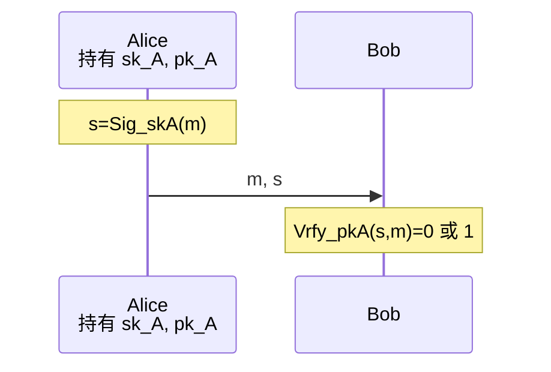

# 8.1 数字签名

> 本笔记依据“现代密码学第八讲：数字签名”整理，介绍数字签名模型与安全性，完整记录 RSA、ElGamal、Schnorr、DSA、一般离散对数型签名、椭圆曲线签名和 SM2，并讨论盲签名、群签名、环签名、门限签名等特殊形式以及加密与签名的组合。课件中的模型图、算法图、签名分类图和电子现金流程均已改写为公式、Mermaid、表格或文字。

## 主要内容

- 数字签名的概念、作用、性质、分类与安全模型
- RSA 签名、原始 RSA 攻击与 PSS/PKCS#1 v1.5
- ElGamal、Schnorr、DSA 与一般离散对数型签名
- 椭圆曲线数字签名与 SM2 数字签名
- 盲签名、电子现金、群签名与环签名
- 门限签名、Shamir 门限方案及其例题
- 多重、聚合、代理、Fail-Stop 和不可否认签名
- 加密与数字签名的组合方式

---

## 一、数字签名基础

### 1. 概念与作用

> **数字签名（Digital Signature）**又称电子签名，是附加在电子文档中的一组特定符号或代码。它通过数学方法提取文档关键信息并与用户私有信息混合运算，用来标识签发者身份、表示签发者对文档的认可，并使接收者能够检验文档在传输中是否被篡改或伪造。

数字签名的主要作用是确认消息发送者身份和消息内容完整性，并在收发双方存在利益冲突时提供不可否认性。课件展示证书详情、代码签名和电子交易页面，说明数字签名可用于证书、软件发布和电子商务；其中网页、印章、钱币和书本等图片为应用或结束页装饰，不承载额外算法信息。

### 2. 与手写签名的区别

| 方面 | 数字签名 | 手写签名 |
|---|---|---|
| 表达形式 | 数字化，随消息变化 | 模拟笔迹，随签名人变化 |
| 验证方式 | 使用公开验证算法 | 与标准签名或笔迹比较 |
| 复制 | 数字串容易复制，但复制到另一消息会验证失败 | 物理笔迹可被模仿或复制 |
| 与文档关系 | 通过密码运算绑定消息 | 是纸质文件的物理组成部分 |

### 3. 与消息认证码、公钥加密的区别

消息认证码适合收发双方无利益冲突的场景：共享密钥使接收方能验证来源和完整性，但接收方也能生成相同 MAC，因而难以向第三方证明责任。数字签名使用签名者私钥生成、任何持有验证公钥者均可验证，可用于处理争议并提供不可否认性。

公钥加密与签名的密钥使用方向和目标不同：

| 机制 | 发送方操作 | 接收方操作 | 主要目标 |
|---|---|---|---|
| 公钥加密 | 用接收者公钥加密 | 用接收者私钥解密 | 保密性 |
| 数字签名 | 用发送者私钥签名 | 用发送者公钥验证 | 真实性、完整性、不可否认性 |

签名可能多年后才验证且可能被多次验证，对防伪造要求高；课件还指出工程上通常希望签名速度快于验证速度。

### 4. 分类与性质

按消息是否压缩，签名可分为对完整消息签名和对消息杂凑值签名。按同一消息与签名的对应关系，可分为：

1. 确定性签名：  
   同一消息总得到同一签名，如课件列举的原始 RSA、Rabin。
2. 随机化/概率式签名：  
   签名依赖随机参数，同一消息可产生不同签名，如 ElGamal。

数字签名应具备：

- 不可伪造：除合法签名者外，其他人难以生成有效签名。
- 不可抵赖：签名者事后不能否认自己的有效签名。
- 可验证/可信：任何验证者都可使用公开信息检验有效性。
- 不可复制：一条消息的签名不能通过复制变成另一条消息的有效签名。
- 消息不可篡改：消息变化会导致签名验证失败。

### 5. 一般模型

> 一个数字签名方案由密钥生成、签名和验证三个算法组成。

$$
(sk,vk)\leftarrow\operatorname{KeyGen}(1^\lambda),
$$

$$
s\leftarrow\operatorname{Sig}_{sk}(m),
$$

$$
\operatorname{Vrfy}_{vk}(s,m)\in\{0,1\}.
$$

其中 $sk$ 为签名私钥，$vk$ 为验证公钥。正确性要求合法签名满足 $\operatorname{Vrfy}_{vk}(\operatorname{Sig}_{sk}(m),m)=1$。



### 6. 安全模型

攻击者资源由弱到强包括：

1. 唯密钥攻击：只有用户公开验证密钥。
2. 已知消息攻击：得到若干并非由自己选择的合法消息—签名对。
3. 选择消息攻击：可自由选择消息并取得相应合法签名。

攻击结果包括：

| 结果 | 含义 |
|---|---|
| 完全破译 | 恢复用户私钥 |
| 一致伪造 | 能对任意消息生成签名 |
| 选择性伪造 | 能对预先选定的消息生成签名 |
| 存在性伪造 | 能生成至少一个此前未知消息的有效签名 |

### 7. 发展与标准

| 时间 | 事件 |
|---:|---|
| 1976 | Diffie 与 Hellman 提出数字签名思想并猜测方案存在 |
| 1978 | Rivest、Shamir、Adleman 的 RSA 可用作数字签名 |
| 1984 | Goldwasser、Micali、Rivest 提出数字签名安全性要求 |
| 1991 | 美国 NIST 公布 FIPS PUB 186，采用 SHA 与 DSA |
| 2004 | 中国颁布电子签名相关法律 |
| 2012 | 中国发布 GM/T 0003-2012，其中包含 SM2 数字签名 |

---

## 二、RSA 数字签名

### 1. 密码体制

> 选取不同大素数 $p,q$，令 $n=pq$、$\varphi(n)=(p-1)(q-1)$。选择 $e$ 满足 $\gcd(e,\varphi(n))=1$，计算 $d\equiv e^{-1}\pmod{\varphi(n)}$。验证公钥为 $(n,e)$，签名私钥为 $(n,d)$。

对消息代表元 $m$，签名：

$$
s=m^d\bmod n.
$$

验证者计算：

$$
m'=s^e\bmod n.
$$

若 $m'=m$，则接受签名。

### 2. 原始 RSA 的攻击

原始 RSA 签名不安全：

1. 唯密钥存在性伪造：  
   攻击者任取 $s$，令 $m=s^e\bmod n$，则 $(m,s)$ 能通过验证。
2. 已知消息存在性伪造：  
   利用 RSA 乘法性。若 $y_1=\operatorname{Sig}(m_1)$、$y_2=\operatorname{Sig}(m_2)$，则

$$
\operatorname{Ver}(m_1m_2\bmod n,\ y_1y_2\bmod n)=\mathrm{true}.
$$

补救办法是在签名前对消息执行带结构的安全编码与杂凑，而不是直接对裸消息代表元做幂运算。

### 3. 对杂凑值签名

对 $H(m)$ 签名可压缩长消息并提高效率。课件把杂凑性质与攻击对应为：

| 杂凑性质 | 抵抗的签名攻击 |
|---|---|
| 原像抗性 | 唯密钥攻击 |
| 第二原像抗性 | 已知消息攻击 |
| 碰撞抗性 | 选择消息攻击 |

### 4. RSA 实现方式

PSS（Probabilistic Signature Scheme）是概率式填充。课件列出主流 RSA 签名包括 RSA-PSS 与 RSA-PKCS#1 v1.5，并指出 OpenSSL 1.1.x 以后优先采用更安全的 PSS 模式。课件中的 PSS 编码框图表达“消息杂凑、随机盐、掩码生成、编码消息、RSA 私钥运算”的组合流程。

---

## 三、基于离散对数的数字签名

### 1. ElGamal 签名

> ElGamal 签名由 T. ElGamal 于 1985 年提出，其安全基础是有限域离散对数问题的困难性。

选择素数 $p$、$\mathbb{Z}_p^*$ 的生成元 $g$ 和私钥 $x$，计算公钥 $y=g^x\bmod p$。对消息 $m$：

1. 选择满足 $\gcd(k,p-1)=1$ 的随机数 $k$。
2. 计算 $r=g^k\bmod p$。
3. 计算

$$
s\equiv(H(m)-xr)k^{-1}\pmod{p-1}.
$$

签名为 $(r,s)$。验证：

$$
y^r r^s\equiv g^{H(m)}\pmod p.
$$

安全注意事项：随机数 $k$ 一旦泄露即可由签名方程求出私钥；不同签名若复用同一 $k$，也可能通过两个方程消去 $k$ 并恢复私钥。因此每次签名必须生成新的、保密且不可预测的 $k$。若不先杂凑消息，ElGamal 的代数结构还会产生存在性伪造，课件以 Type I、Type II 变换展示利用已有签名构造新签名的思路；引入安全杂凑可把可操纵的消息指数替换为难以控制的 $H(m)$。

### 2. Schnorr 签名

设素数 $q\mid p-1$，$g$ 是 $\mathbb{Z}_p^*$ 中的 $q$ 阶元素，离散对数困难；私钥为 $x$，公钥为 $y=g^x\bmod p$。选择随机 $k\in\mathbb{Z}_q$，计算：

$$
c=h(m\parallel g^k),\qquad s=k+xc\pmod q.
$$

签名为 $(c,s)$。验证者检查：

$$
h(m\parallel g^s y^{-c})=c.
$$

课件给出的典型参数长度为 $|p|=1024$ bit、$|q|=160$ bit，签名 $(c,s)$ 共 320 bit。Schnorr 方案于 1989 年提出，是 ElGamal 的短签名变形；杂凑把消息与随机承诺绑定。

### 3. DSA

DSA 由 NIST 于 1991 年提出、1994 年采纳，是 ElGamal 的变形并吸收 Schnorr 思想。参数设置与 Schnorr 类似。取私钥 $x$、公钥 $y=g^x\bmod p$，对消息摘要 $m=H(M)$ 选择随机 $k$：

$$
r=(g^k\bmod p)\bmod q,
$$

$$
s=k^{-1}(m+xr)\bmod q.
$$

验证时计算 $w=s^{-1}\bmod q$，并检查：

$$
r=\left(g^{mw}y^{rw}\bmod p\right)\bmod q.
$$

课件强调签名长度为 320 bit；若求逆失败或出现不允许的零值，应重新选择 $k$。实现还涉及模逆、$q$ 阶元素生成、$r$ 的预计算和公开的素数 $p,q$ 生成算法。

### 4. 一般离散对数型签名框架

选取大素数 $p$、$p-1$ 的大素因子 $q$、$q$ 阶元素 $g$、私钥 $x<q$ 和公钥 $y=g^x\bmod p$，以及 $h:\{0,1\}^*\to\{0,1\}^t$。对消息 $m$ 选择 $k<q$，令：

$$
r=(g^k\bmod p)\bmod q.
$$

从签名方程

$$
ak\equiv b+cx\pmod q
$$

求出 $s$，输出 $(r,s)$。验证形式为：

$$
\operatorname{Ver}(y,(r,s),m)=\mathrm{true}
\Longleftrightarrow
r^a\equiv(g^b y^c\bmod p)\bmod q.
$$

课件给出的五类系数模板共形成 120 种选择：

| 类别 | $a$ 候选 | $b$ 候选 | $c$ |
|---:|---|---|---|
| 1 | $\pm r$ | $\pm s$ | $h(m)$ |
| 2 | $\pm h(m)r$ | $\pm s$ | $1$ |
| 3 | $\pm h(m)r$ | $\pm h(m)s$ | $1$ |
| 4 | $\pm h(m)r$ | $\pm sr$ | $1$ |
| 5 | $\pm h(m)s$ | $\pm sr$ | $1$ |

第一行在只取正号时有 6 个排列；加入符号变化后，课件列出 24 种 $(a,b,c)$：

| 1—6 | 7—12 | 13—18 | 19—24 |
|---|---|---|---|
| $(r,s,h)$ | $(-r,s,h)$ | $(r,-s,h)$ | $(-r,-s,h)$ |
| $(r,h,s)$ | $(-r,h,s)$ | $(r,h,-s)$ | $(-r,h,-s)$ |
| $(s,r,h)$ | $(s,-r,h)$ | $(-s,r,h)$ | $(-s,-r,h)$ |
| $(s,h,r)$ | $(s,h,-r)$ | $(-s,h,r)$ | $(-s,h,-r)$ |
| $(h,r,s)$ | $(h,-r,s)$ | $(h,r,-s)$ | $(h,-r,-s)$ |
| $(h,s,r)$ | $(h,s,-r)$ | $(h,-s,r)$ | $(h,-s,-r)$ |

其中 $h=h(m)$。课件给出的六组正号签名—验证等式分别为：

| 签名等式 | 验证等式 |
|---|---|
| $rk\equiv s+h(m)x$ | $r^r\equiv g^s y^{h(m)}$ |
| $rk\equiv h(m)+sx$ | $r^r\equiv g^{h(m)}y^s$ |
| $sk\equiv r+h(m)x$ | $r^s\equiv g^r y^{h(m)}$ |
| $sk\equiv h(m)+rx$ | $r^s\equiv g^{h(m)}y^r$ |
| $h(m)k\equiv s+rx$ | $r^{h(m)}\equiv g^s y^r$ |
| $h(m)k\equiv r+sx$ | $r^{h(m)}\equiv g^r y^s$ |

所有同余均先在模 $p$ 群中计算右侧，再按方案要求模 $q$ 比较。

---

## 四、椭圆曲线数字签名

### 1. 一般方案

> 在有限域 $\mathrm{GF}(p)$ 上选椭圆曲线 $E_p(a,b)$、阶为大素数 $q$ 的生成元 $G$，并选杂凑 $h:\{0,1\}^*\to\mathbb{Z}_q$。用户选择私钥 $x<q$，计算公钥点 $Y=xG$。

签名消息 $m$：

1. 计算 $h_1=h(m)$。
2. 选择 $1<k<q$，计算 $kG=(k_x,k_y)$，令 $r=k_x$。
3. 计算 $s=(h_1+rx)k^{-1}\bmod q$。
4. 输出 $(r,s)$。

验证：

$$
u=s^{-1}h_1\bmod q,\qquad v=s^{-1}r\bmod q,
$$

$$
(x_s,y_s)=uG+vY.
$$

若 $r=x_s\bmod p$，则接受。正确性为：

$$
s=(h_1+rx)k^{-1}\Rightarrow k=(h_1+rx)s^{-1},
$$

$$
kG=(s^{-1}h_1+s^{-1}rx)G=uG+vY.
$$

### 2. SM2 曲线参数与密钥

SM2 推荐使用 256 位素域 $\mathbb{F}_p$ 上的曲线 $y^2=x^3+ax+b$，其中：

```text
p  = FFFFFFFEFFFFFFFFFFFFFFFFFFFFFFFFFFFFFFFF00000000FFFFFFFFFFFFFFFF
a  = FFFFFFFEFFFFFFFFFFFFFFFFFFFFFFFFFFFFFFFF00000000FFFFFFFFFFFFFFFC
b  = 28E9FA9E9D9F5E344D5A9E4BCF6509A7F39789F515AB8F92DDBCBD414D940E93
n  = FFFFFFFEFFFFFFFFFFFFFFFFFFFFFFFF7203DF6B21C6052B53BBF40939D54123
Gx = 32C4AE2C1F1981195F9904466A39C9948FE30BBFF2660BE1715A4589334C74C7
Gy = BC3736A2F4F6779C59BDCEE36B692153D0A9877CC62A474002DF32E52139F0A0
```

其素数也可写为：

$$
p_{SM2}=2^{256}-2^{224}-2^{96}+2^{64}-1.
$$

Alice 选择 $0<d_A<n$ 作为私钥，计算公钥 $P_A=d_A G$。

### 3. SM2 签名

设 Alice 标识为 $ID_A$，其长度为 $ENTL_A$，公钥 $P_A=(x_A,y_A)$，基点 $G=(x_G,y_G)$。先计算身份杂凑：

$$
Z_A=H(ENTL_A\parallel ID_A\parallel a\parallel b\parallel x_G\parallel y_G\parallel x_A\parallel y_A),
$$

其中 $H$ 为 SM3。对消息 $M$：

1. 置 $M^*=Z_A\parallel M$，计算 $e=H(M^*)$。
2. 随机选择 $k\in[1,n-1]$。
3. 计算 $kG=(x_1,y_1)$。
4. 计算 $r=(e+x_1)\bmod n$；若 $r=0$ 或 $r+k=n$，返回第 2 步。
5. 计算 $s=(1+d_A)^{-1}(k-rd_A)\bmod n$；若 $s=0$，返回第 2 步。
6. 输出 $(r,s)$。

### 4. SM2 验证

收到 $M'$、$(r',s')$ 与 $P_A$ 后：

1. 检查 $r',s'\in[1,n-1]$。
2. 置 $M^*=Z_A\parallel M'$，计算 $e'=H(M^*)$。
3. 计算 $t=(r'+s')\bmod n$；若 $t=0$ 则拒绝。
4. 计算 $(x_1',y_1')=s'G+tP_A$。
5. 计算 $v=(e'+x_1')\bmod n$，当且仅当 $v=r'$ 时接受。

---

## 五、特殊签名方式

### 1. 盲签名

> **盲签名允许 Alice 在不向签名者 Bob 泄露文档内容的情况下，请 Bob 对文档签名；解除盲化后得到普通可验证签名。**

盲签名要求：签名时内容对签名者不可见；签名泄露后，签名者不能追踪到具体签名会话。基本过程是 Alice 用随机盲化因子 $r$ 把消息 $M$ 变成 $M'$，Bob 对 $M'$ 签名，Alice 再解除盲化得到对 $M$ 的签名。

基于 RSA 的盲签名中，Alice 随机选 $r\in\mathbb{Z}_n^*$：

$$
m'=mr^e\bmod n.
$$

Bob 返回 $s'=(m')^d\bmod n$，Alice 计算：

$$
s=s'r^{-1}\bmod n=m^d\bmod n.
$$

课件还给出基于离散对数/ElGamal 变形的盲签名，其图中通过随机量 $a,r$ 把验证式转换，使签名者只看到盲化后的量，解除盲化后仍满足 ElGamal 型验证关系。

### 2. 电子现金

Chaum 于 1983 年提出的 E-Cash 用盲签名使银行签发电子钱币时不能把钱币与具体提取者关联，同时商户仍可验证银行签名。课件流程包括付款人、银行和收款人：付款人从银行取得盲签名钱币，再向收款人支付，收款人向银行验证或兑付。

Chaum E-Cash 的局限包括不可分割性和验证效率：支付额受提取面额限制，每种面额对应不同签名，任意金额需组合多种面额并验证多个签名。

| 指数 $e$ | 3 | 5 | 7 | 11 | 13 | 17 | 19 | 23 | 29 | 31 | 37 | 41 |
|---:|---:|---:|---:|---:|---:|---:|---:|---:|---:|---:|---:|---:|
| 面额 $D_e$ | 0.005 美元 | 0.01 美元 | 0.02 美元 | 0.04 美元 | 0.08 美元 | 0.16 美元 | 0.32 美元 | 0.64 美元 | 1.28 美元 | 2.56 美元 | 5.12 美元 | 10.24 美元 |

### 3. 群签名与环签名

群签名由 David Chaum 与 Eugene van Heyst 于 1991 年提出，允许群成员匿名代表群组签署文件。验证者只能确定签名来自该群组；在监管介入时，群管理员能够打开签名并确定成员身份。

环签名由 Rivest、Shamir、Tauman 提出，是无管理者的特殊群签名：任何成员可临时选择一组公钥形成环，不需建群或成员协作，验证者只能确认签名来自环中某人，不能追踪具体签名者。

课件给出的环签名抽象步骤为：令 $k=H(m)$，选择随机胶合值 $v$；为除真实签名者外的环成员选择随机 $x_i$ 并计算 $y_i=g_i(x_i)$；求解环等式中的 $y_s$，再用签名者私钥计算 $x_s=g_s^{-1}(y_s)$。签名为：

$$
(P_1,\ldots,P_n;v;x_1,\ldots,x_n),
$$

并满足：

$$
C_{k,v}(y_1,\ldots,y_n)=v.
$$

验证者对所有 $x_i$ 使用相应公钥陷门计算 $y_i$，重算 $k=H(m)$，再检查环等式。

### 4. 门限签名与 Shamir 方案

> **门限签名要求群组中达到门限 $k$ 的成员合作才能产生合法签名。**

其基础是 $(k,n)$ 秘密共享：把秘密 $s$ 分为 $n$ 份，任意不少于 $k$ 份可恢复秘密，少于 $k$ 份不能恢复。若少于 $k$ 份不泄露 $s$ 的任何信息，称为完善门限方案。门限越高，保密性越高但缺员时可靠性越低；门限越低则相反。

Shamir 方案在 $\mathrm{GF}(q)$ 上构造：

$$
f(x)=s+a_1x+\cdots+a_{k-1}x^{k-1},
$$

参与者 $P_i$ 得到 $(i,f(i))$。任意 $k$ 人利用拉格朗日插值恢复：

$$
f(x)=\sum_{j=1}^{k}f(i_j)\prod_{\substack{l=1\\l\ne j}}^{k}\frac{x-i_l}{i_j-i_l}\pmod q,
$$

$$
s=f(0)=(-1)^{k-1}\sum_{j=1}^{k}f(i_j)\prod_{\substack{l=1\\l\ne j}}^{k}\frac{i_l}{i_j-i_l}\pmod q.
$$

少于 $k$ 份只提供 $k-1$ 个方程而存在 $k$ 个未知量，对任意候选 $s_0$ 都有唯一相容多项式，因此不能得到关于 $s$ 的信息。

**例**：$k=3,n=5,q=19,s=11$，取 $a_1=2,a_2=7$：

$$
f(x)=7x^2+2x+11\pmod{19}.
$$

得到 $f(1)=1,f(2)=5,f(3)=4,f(4)=17,f(5)=6$。用 $f(2),f(3),f(5)$ 插值：

$$
\begin{aligned}
f(x)&=5\frac{(x-3)(x-5)}{(2-3)(2-5)}+4\frac{(x-2)(x-5)}{(3-2)(3-5)}\\
&\quad+6\frac{(x-2)(x-3)}{(5-2)(5-3)}\\
&=7x^2+2x+11\pmod{19}.
\end{aligned}
$$

优点是完善性、份额与秘密大小相近、易扩充成员且安全性不依赖未经证明假设；缺点是门限固定、不区分成员，分发者知道各份额，并且不能自动防止分发者或参与者欺诈。

### 5. 其他签名类型

| 类型 | 核心含义 |
|---|---|
| 多重签名 | 把多个人的签名汇总成一个签名数据，接收者验证一次即可确认多人签署 |
| 聚合签名 | 把不同签名者、甚至不同消息上的独立签名合并为一个签名并统一验证 |
| 代理签名 | 原签名者把签名权委托给代理人；代理签名应可验证、可区分且双方不可否认 |
| Fail-Stop 签名 | 若计算假设被攻破并出现伪造，合法签名者能给出伪造证明，系统随即停止使用该方案 |
| 不可否认签名 | 没有签名者配合就不能验证，包含签名算法、验证协议与否认协议 |

Fail-Stop 方案由签名、验证和伪造证明算法构成。安全要求包括：合法签名可通过验证；多项式时间伪造者难以生成有效签名；若强大伪造者成功，签名者能向第三方证明伪造；签名者又不能把自己的有效签名谎称为伪造。课件指出其可用于电子支付。

不可否认签名的否认协议可证明某签名非法，同时签名者不能否认合法签名；课件列举的软件保护是其应用。

---

## 六、加密与签名的组合

### 1. 两种次序

需要同时提供保密性与认证性时，可先加密后签名，也可先签名后加密；课件建议先签名后加密。

### 2. 外部与内部保密方式

课件图示的“外部保密”是对明文消息生成签名，再对消息和签名整体加密；“内部保密”是先加密消息，再对密文生成签名。可概括为：

```mermaid
flowchart LR
  M1[明文 M] --> S1[签名 Sig_A(M)]
  S1 --> P1[M || Sig_A(M)]
  P1 --> E1[用 B 的密钥加密]
  E1 --> C1[外部保密结果]
```

```mermaid
flowchart LR
  M2[明文 M] --> E2[用 B 的密钥加密]
  E2 --> C2[密文 C]
  C2 --> S2[签名 Sig_A(C)]
  S2 --> O2[C || Sig_A(C)<br/>内部保密结果]
```

外部保密便于争议处理：接收者可保存明文及其签名，第三方容易直接核对。内部保密中签名绑定密文，第三方必须先获得解密密钥，才能判断明文与密文及签名是否对应。

---

## 七、课前作业回顾

课件开头保留了上一讲的作业：

1. 已知 RSA 公钥 $(e,n)=(5,35)$、密文 $C=10$，求明文 $M$。
2. RSA 中取 $p=7,q=17,e=13$，计算公钥与私钥，并用重复平方乘计算明文 $m=19$ 的密文。
3. 对椭圆曲线 $E_{11}(1,6):y^2\equiv x^3+x+6\pmod{11}$，求全部点。
4. 已知 $G=(2,7)\in E_{11}(1,6)$，求 $2G$ 与 $3G$。
5. 在 $E_{11}(1,6)$ 上实现椭圆曲线 ElGamal：生成元 $G=(2,7)$，接收方私钥 $n_A=7$。  
   （1）求公开钥 $P_A$；（2）发送消息点 $P_m=(10,9)$，取随机数 $k=3$，求密文 $C_m$；（3）写出 A 从 $C_m$ 恢复 $P_m$ 的过程。

---

## 本章小结

| 主题 | 核心结论 |
|---|---|
| 一般模型 | 私钥签名、公钥验证，安全性要在给定攻击资源和伪造目标下定义 |
| RSA 签名 | 原始裸 RSA 具有代数伪造，应使用安全杂凑与 PSS 等编码 |
| 离散对数签名 | ElGamal、Schnorr、DSA 的安全依赖离散对数困难性和一次性随机数 |
| 椭圆曲线签名 | 以标量乘法替代有限域幂运算；SM2 还把用户身份杂凑 $Z_A$ 纳入消息摘要 |
| 盲签名 | 签名者看不到消息且事后无法把签名关联到签发会话，可用于电子现金 |
| 群/环签名 | 群签名可由管理员打开，环签名无管理员且不可追踪具体成员 |
| 门限签名 | 达到门限的成员协作签名，Shamir 插值提供秘密分割基础 |
| 组合方式 | 签名提供认证，公钥加密提供保密；次序影响争议处理和第三方验证 |

上一节：[[现代密码学/笔记/7.4 公钥密码学（四）|7.4 公钥密码学（四）]]；下一章：[[现代密码学/笔记/9.1 密钥管理（一）|9.1 密钥管理（一）]]。
