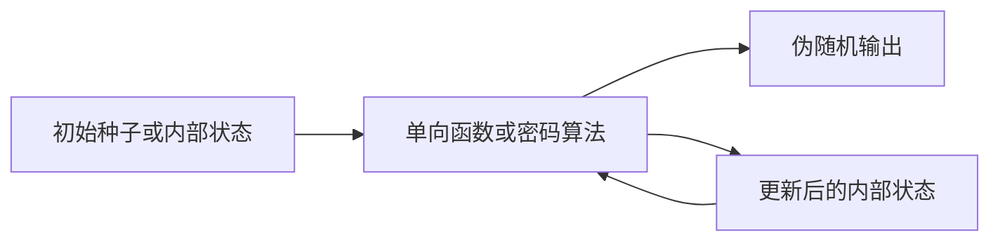
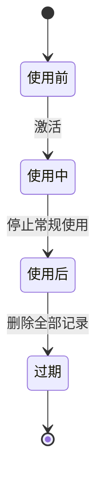
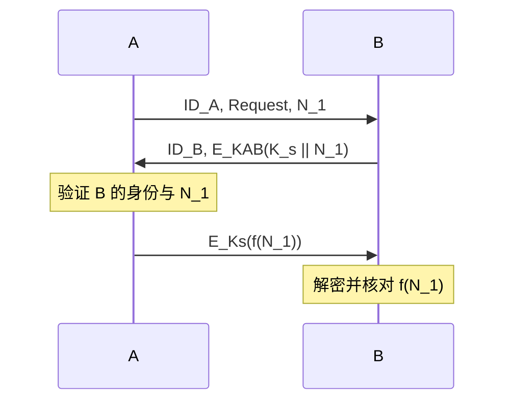
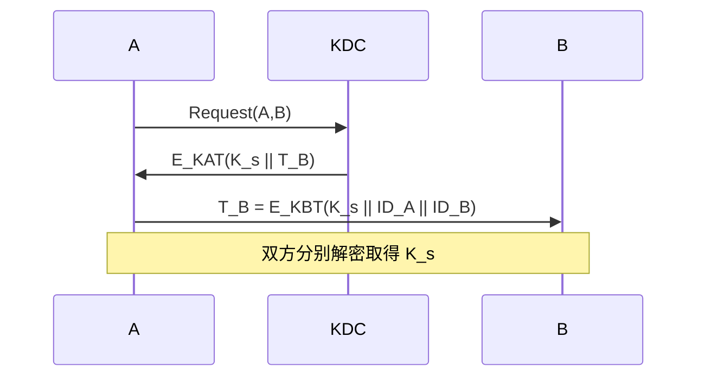
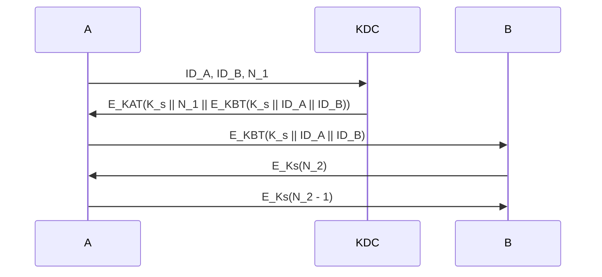
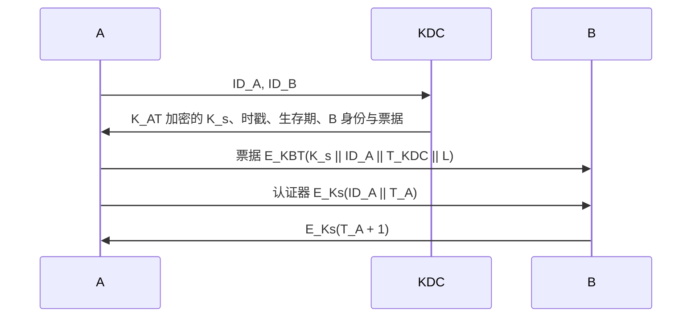
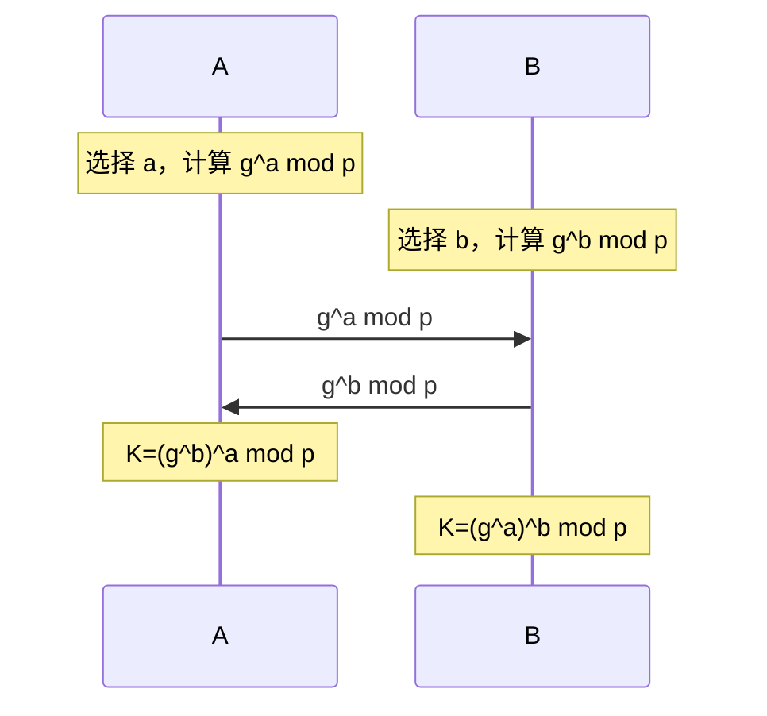

# 9.1 密钥管理（一）

> 本笔记依据“现代密码学第九讲：密钥管理（一）”整理，沿密钥生命周期说明生成、建立、存储、使用、更新与销毁，并重点讨论对称密钥分配、Needham-Schroeder、简化 Kerberos、Diffie-Hellman 密钥协商及其认证改进。课件中的协议时序图、密钥分层图和伪随机数生成器结构均已改写为 Mermaid、公式或可检索文字。

## 主要内容

- 密钥管理原则、目标与生命周期
- 密钥生成、存储、使用、备份、恢复、撤销、更新、存档和销毁
- 会话密钥、密钥加密密钥与主密钥
- 无中心和有中心的对称密钥分配
- Needham-Schroeder 密钥分发协议与简化 Kerberos 协议
- 基于公钥密码系统的密钥分配
- Diffie-Hellman 密钥协商、中间人问题与签名改进

---

## 一、密钥管理概述

### 1. 柯克霍夫原则与密钥管理

> **柯克霍夫原则（Kerckhoff's Principle）**：即使密码系统的任何细节均已公开，只要密钥未泄露，系统仍应保持安全。

“密钥安全，三分技术、七分管理”。密钥管理是在安全策略指导下，为授权各方建立并维护密钥关系的一整套技术和程序，覆盖密钥从产生到最终销毁的全过程。

> **密钥管理的全过程包括密钥生成、建立（分配与协商）、存储、使用、备份与恢复、撤销、更新、存档和销毁。**

密钥管理之所以可能成为密码技术的瓶颈，主要有以下原因：

1. 对称密码体制中，用户数增加会使需管理的共享密钥数量迅速增长。
2. 公钥密码体制虽能减轻部分分配负担，但仍需保证公钥真实性并保护私钥。
3. 密钥使用过久会增加攻击者收集密文、分析实现或窃取密钥的机会。
4. 密钥交换、使用范围、有效时间、更换和应急处置均带来较大管理工作量。

一个良好的密钥管理系统应使密钥难以被盗取；限制密钥的使用范围与时间，使单个密钥泄露的影响受到控制；并尽量让密钥分配与更换对用户透明。

### 2. 密钥生成

密钥生成是密钥生命周期的基础阶段。密钥生成器应产生具有良好随机性的序列，使不同密钥尽可能等概率出现，并避免单钥体制中的弱密钥；双钥体制则应依据相应数学困难问题构造密钥。生成结果还需经过必要的数字化处理和随机性检验。

密钥产生器主要分为两类：

1. 随机数发生器：  
   以物理噪声、放射性衰减等客观随机现象为信号源，理论上能够产生真随机数，但随机性精度、设备接入和网络化使用可能受到限制。
2. 伪随机数发生器：  
   使用确定性算法由内部状态或种子动态生成序列；良好算法的输出能够通过合理的随机性测试，但其本质仍是伪随机序列。

课件中的两个伪随机数发生器实例都体现了“内部状态—单向处理—输出序列”的结构：内部状态经单向函数或密码算法迭代后产生伪随机输出，同时更新内部状态；安全性取决于种子/状态的保密性、单向处理的不可逆性和状态更新机制。

### 3. 密钥建立与存储

> **密钥建立是使密钥在保持完整性与保密性的条件下到达各密钥使用实体的过程，通常分为密钥分配和密钥协商。**

静态密钥的安全存储通常采用两类保护：

1. 软件保护：  
   基于口令保护密钥文件，或以文件和确定算法的组合生成密钥。
2. 硬件保护：  
   将密钥存入存储型或智能型专用密码装置中。

### 4. 密钥使用与后续处理

密钥在有效期内用于加密、解密、签名等密码操作，使用时必须考虑运行环境对密钥安全的影响。其后续管理包括：

| 环节 | 含义 |
|---|---|
| 备份 | 密钥处于使用状态时的短期安全存储，为恢复提供密钥源 |
| 恢复 | 从备份或存档中安全取回未泄露但已丢失的密钥 |
| 撤销 | 密钥丢失、泄露或到期前需要停用时，将其移出正常使用集合 |
| 更新 | 有效期将结束且仍需继续使用密码体制时，以新密钥替代旧密钥 |
| 存档 | 对过期密钥进行长期离线保存，以便争议处理等特殊检索 |
| 销毁 | 对不再需要的密钥及其全部副本进行不可恢复的清除 |

密钥生命周期状态如下：

- 使用前状态：不能进行正常密码操作。
- 使用状态：密钥可用并处于正常使用中。
- 使用后状态：不再常规使用，但可为特定目的离线访问。
- 过期状态：密钥不再使用，所有密钥记录均被删除。

### 5. 密钥分层 

| 层次 | 英文 | 作用 |
|---|---|---|
| 会话密钥 | Session Key | 一次通信或数据交换中使用，由通信方协商或分配得到；动态产生并在用毕后清除，也称数据加密密钥 |
| 密钥加密密钥 | Key Encrypting Key | 加密传输会话密钥，保护实际用于通信或文件加密的密钥，又称二级密钥 |
| 主密钥 | Master Key | 层次化结构最高层，用于加密密钥加密密钥，必须受到最严格保护 |

课件的分层图表示明文由会话密钥加密、会话密钥由密钥加密密钥保护、密钥加密密钥再由主密钥保护；解密过程按相反方向逐层取得下层密钥。

---

## 二、密钥分配

### 1. 无密钥分配

课件给出一个无需预共享密钥的交换思路。设 A 希望把密钥 $K$ 传给 B，指数 $a,b$ 在相应模群中可逆：
这里结果均$\pmod{p}$
1. A 发送 $k^{a}\pmod{p}$。
2. B 返回 $(k^{a})^{b}=k^{ab}\pmod{p}$。
3. A 去除自己的指数，发送 $(k^{ab})^{a^{-1}}=k^{b}\pmod{p}$。
4. B 去除自己的指数，恢复 $(k^{b})^{b^{-1}}=k\pmod{p}$。

该过程的图示重点是双方依次添加并去除各自变换；实施时须保证所选群与指数逆元满足算法要求。

### 2. 对称体制的无中心分配

若 A、B 预先共享密钥加密密钥 $K_{AB}$，A 可选择会话密钥 $K_s$ 并发送：

$$
T_A=E_{K_{AB}}(K_s),\qquad D_{K_{AB}}(T_A)=K_s.
$$

简化方案只传递加密会话密钥，缺少新鲜性和双向确认。改进方案加入随机数 $N_1$ 与挑战应答：

随机数把应答绑定到当前会话，会话密钥加密的 $f(N_1)$ 又使 B 确认 A 已取得 $K_s$。

### 3. 有中心的密钥分配

密钥分配中心 KDC 与所有用户分别预共享长期密钥。设 A 与 KDC 共享 $K_{AT}$，B 与 KDC 共享 $K_{BT}$，KDC 选择会话密钥 $K_s$：

$$
T_B=E_{K_{BT}}(K_s\parallel ID_A\parallel ID_B),
$$

$$
T_A=E_{K_{AT}}(K_s\parallel T_B).
$$

### 4. Needham-Schroeder 密钥分发协议

> **Needham-Schroeder 对称密钥协议**由 R. Needham 与 M. Schroeder 于 1978 年提出，以 KDC 为中心，经五步为 A、B 建立会话密钥，是后续多种密钥分发协议的重要基础。

设 A 与 KDC 共享 $K_{AT}$，B 与 KDC 共享 $K_{BT}$：

各步作用如下：

1. $N_1$ 是本次业务的唯一识别符，可由时戳、计数器或随机数实现。
2. KDC 的应答让 A 得到 $K_s$ 和与请求匹配的 $N_1$，并附带仅 B 能解开的票据。
3. A 将票据转发给 B，B 从中取得 $K_s$ 与 A 的身份。
4. B 用 $K_s$ 加密新随机数 $N_2$，检验 A 是否确实持有会话密钥。
5. A 返回 $E_{K_s}(N_2-1)$，完成挑战应答。

协议的主要缺陷是：

1. B 不能判断 $K_s$ 是否新鲜。若旧会话密钥泄露，攻击者可重放第三步票据并完成后续挑战。
2. A 仅凭第 2、4、5 步不能可靠确认 B 已知 $K_s$，攻击者可能构造挑战消息干扰实体认证。

### 5. 简化 Kerberos 协议

Kerberos 是 MIT Athena 计划的一部分；课件把完整认证过程简化为四步，并用 KDC 时间戳 $T_{KDC}$ 与生存时间 $L$约束票据的新鲜性：

$$
E_{K_{AT}}\left(K_s\parallel T_{KDC}\parallel L\parallel ID_B\parallel E_{K_{BT}}(K_s\parallel ID_A\parallel T_{KDC}\parallel L)\right).
$$

B 先用 $K_{BT}$ 解开票据取得 $K_s$，再用 $K_s$ 解开认证器并检查时间戳及生存期，最后以 $T_A+1$ 回应 A。与原始 Needham-Schroeder 协议相比，时戳和有效期可限制旧票据重放。

当用户数量和地域范围很大时，可采用分层 KDC：同一区域由本地 KDC 服务，不同区域的本地 KDC 再经全局 KDC 协调。

### 6. 基于公钥密码系统的密钥分配

每个用户预先选定公钥/私钥对作为密钥加密密钥。简化方案为：

1. A 将身份 $ID_A$ 和公钥 $PK_A$ 发送给 B。
2. B 随机产生 $K_s$，向 A 发送 $E_{PK_A}(K_s\parallel ID_B)$。
3. 只有持有 $SK_A$ 的 A 能解密取得 $K_s$。

该简化过程依赖所接收 $PK_A$ 的真实性；若未认证公钥，攻击者可能替换公钥。

---

## 三、密钥协商

### 1. 定义与目标

> **密钥协商是通信双方或多方通过公开信道共同形成秘密密钥的过程。密钥值是由各参与方共同提供的输入计算出的函数值。**

正确的协商应使所有参与方得到相同密钥，而非参与方不能获知该密钥。

### 2. Diffie-Hellman 密钥协商

设 $p$ 为大素数，$g\in\mathbb{Z}_p^*$ 为模 $p$ 的本原元，$p,g$ 公开。A 随机选择 $a$，B 随机选择 $b$：

$$
K_a=g^a\pmod p,\qquad K_b=g^b\pmod p.
$$

交换 $K_a,K_b$ 后分别计算：

$$
K=(K_b)^a=(g^b)^a=g^{ab}=(g^a)^b=(K_a)^b\pmod p.
$$

### 3. 中间人问题

未经认证的 DH 只保证密钥计算，不能证明对方身份。课件的三方图表明攻击者 M 可分别与 A、B 建立不同密钥，并转发、读取或修改通信，使 A、B 误以为双方直接协商。因此需要把临时 DH 值与实体身份绑定。

### 4. 使用数字签名改进

设 A、B 分别具有签名与验证算法。交换 $g^a,g^b$ 后，B 计算共享密钥 $K$，发送：

$$
(PK_B,\ g^b\bmod p,\ E_K(\operatorname{Sig}_B(g^a\bmod p,\ g^b\bmod p))).
$$

A 计算同一 $K$，解密并验证 B 对双方临时值的签名；验证通过后返回：

$$
(PK_A,\ E_K(\operatorname{Sig}_A(g^a\bmod p,\ g^b\bmod p))).
$$

B 解密并验证 A 的签名。签名把双方身份与本次 DH 临时量绑定，从而抵抗课件所示的中间人替换。

---

## 本章小结

| 主题 | 核心结论 |
|---|---|
| 密钥管理 | 密钥安全贯穿生成、建立、存储、使用、更新直至销毁的完整生命周期 |
| 密钥分层 | 会话密钥保护数据，密钥加密密钥保护会话密钥，主密钥保护密钥加密密钥 |
| 无中心分配 | 依赖通信双方已有共享密钥，并应加入随机数和密钥确认 |
| KDC 分配 | 将长期共享关系集中到 KDC，可用票据向双方分发会话密钥 |
| Needham-Schroeder | 五步建立会话密钥，但旧票据和已泄露旧密钥可造成重放风险 |
| Kerberos | 以时间戳和生存期约束票据新鲜性，并使用认证器完成确认 |
| 公钥分配 | 用接收者公钥保护会话密钥，但必须先保证公钥真实性 |
| DH 协商 | 双方公开交换临时值即可得到共同秘密，但未经认证时易遭中间人攻击 |
| 认证 DH | 对双方临时值签名并验证，可把协商密钥与实体身份绑定 |

下一节：[[现代密码学/笔记/9.2 密钥管理（二）|9.2 密钥管理（二）]]。
