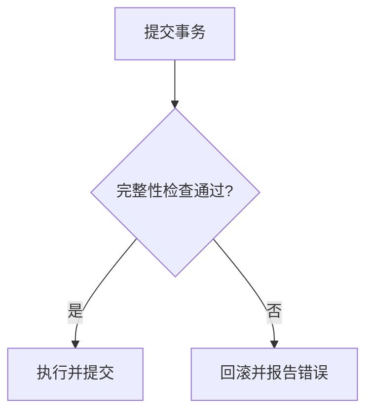

# 笔记编写要求 

> 本笔记规定本库（Obsidian Vault）中笔记的统一编写规范。所有新建或整理的笔记都应遵循以下要求，以保持全库风格一致、便于检索与维护。

> [!important] 最高优先级要求
> 整理、转换、改写或美化笔记时，**不得丢失来源正文中的任何有效信息**。格式优化、结构调整语言精炼不能以删减知识内容为代价。
> 当正文内容太少时 予以补充 同时备注由ai补充


## 本章主要内容

- Obsidian 原生语法总则
- 文件命名规则
- Frontmatter 元数据要求
- 笔记整体结构
- 正文信息完整性与算法解释要求
- 格式与排版规范
- 课件笔记整理与美化规范
- 原题与手写参考答案整理规范
- 链接与标签约定
- VSCode 环境支持
- 发布前检查清单

---

## 零、Obsidian 原生语法总则

> [!important] 语法标准
> 本仓库所有 Markdown、YAML、链接、表格、公式、代码块、引用、标注和图形语法，均以 **Obsidian 核心功能能够直接解析和渲染**为最终标准。其他编辑器或 Markdown 方言的显示效果只能作为参考；若存在差异，以 Obsidian 阅读模式的结果为准。

1. **只使用 Obsidian 核心支持的语法**：  
   使用 Obsidian 支持的 Markdown、YAML Properties、wikilink、Callout、MathJax/LaTeX、原生管道表格、代码围栏和 Mermaid。
2. **不依赖第三方插件语法**：  
   除非任务明确要求，不使用 Dataview、Templater、Admonition、JS Engine 等插件专用代码，也不使用 MDX、Pandoc、Typora 扩展或 GitHub 专用提示框语法代替 Obsidian 原生语法。
3. **内部链接使用 wikilink**：  
   库内笔记使用 `[[笔记名]]`、`[[路径/笔记名|显示文本]]`；外部网页使用标准 Markdown 链接 `[文本](URL)`。
4. **提示块使用 Obsidian Callout**：  
   使用 `> [!note]`、`> [!tip]`、`> [!warning]` 等 Obsidian 原生 Callout，不使用 GitHub 风格的 `[!NOTE]` 独立块或自定义 HTML 提示框。
5. **公式与图形以 Obsidian 渲染能力为限**：  
   数学公式使用 Obsidian MathJax 可识别的 LaTeX；图形使用 Obsidian 当前版本可渲染的 Mermaid 语法，不引入外部脚本、在线图床或浏览器专用组件。
6. **最终必须在 Obsidian 中验证**：  
   新建或修改笔记后，至少检查阅读模式中的 Properties、标题、列表、表格、公式、Callout、wikilink、代码块和 Mermaid 是否正常显示。

---

## 一、文件命名

> **统一规则**：课程笔记文件名采用 **`n.a 主题.md`**，其中 `n` 表示**第 n 章**，`a` 表示**第 a 节**。节号按课件在章内的文件顺序编号（1、2、3…），一个课件文件对应一节。

| 类型     | 命名规则        | 示例                                                     |
| ------ | ----------- | ------------------------------------------------------ |
| 课程笔记   | `n.a 主题.md` | `2.1 古典密码体制.md`、`2.2 密码分析.md`、`3.1 密码学基础-Shannon理论.md` |
| 课件原始文件 | 保留原始文件名     | `第2章 古典密码体制(1).pdf`                                    |
| 一般主题笔记 | 简洁的主题短语     | `笔记编写要求.md`                                            |
|        |             |                                                        |
|        |             |                                                        |
|        |             |                                                        |

- 命名应**简洁、唯一**，能望文知义。
- 避免 Windows/Obsidian 非法字符：`/ \ : * ? " < > |`。
- 同一章的笔记按课件文件顺序编号，如第 4 章三份课件 → `4.1`、`4.2`、`4.3`。

---

## 二、Frontmatter 元数据

所有笔记顶部必须包含 YAML frontmatter：

| 字段 | 必填 | 说明 |
|------|------|------|
| `title` | ✅ | 笔记标题，须与正文 H1 一致 |
| `course` | 课程笔记 | 所属课程 |
| `tags` | ✅ | 2~5 个分类标签 |
| `created` | ✅ | 创建日期，格式 `YYYY-MM-DD` |
| `source` | 课件笔记 | 来源课件路径（相对仓库根） |
| `related` | 可选 | 相关笔记的 wikilink 列表 |

示例（课程章节笔记）：

```yaml
---
title: 3.1 密码学基础——Shannon 理论
course: 现代密码学
tags:
  - 密码学
  - Shannon理论
  - 完善保密性
created: 2026-08-02
source:
  - "课件/第3章 密码学基础-Shannon理论.pdf"
related:
  - "[[2.1 古典密码体制]]"
---
```

---

## 三、笔记整体结构

按以下顺序组织内容：

1. **H1 标题**：`#` 一级标题，与 frontmatter `title` 完全一致。
2. **引言引用**：`>` 块引用，用 2~3 句话概述本笔记的主题、来源与价值。
3. **本章主要内容**：`## 主要内容`，使用 `-` 作为无序列表标记，每行列出一个核心知识点；列表项之间不插入空行。
- 对计算安全性、可证明安全性、无条件安全性等同类并列关键词，也使用 `-` 逐行标记，不直接堆叠为无标记文本。
4. **正文小节**：`## 一、` `## 二、` …，逐节展开；小节之间用 `---` 分隔。
5. **小节内部**：`### 1.` `### 2.` … 细分到要点。
6. **本章小结**：结尾 `## 本章小结`，用表格或要点汇总核心结论。
7. **课后作业**（可选）：`## 课后作业`，列思考题、证明题或练习题。

### 1. 正文信息完整性

> [!important] 正文信息零丢失
> 来源正文是整理结果的完整性基线。无论进行格式转换、标题重组、段落合并、语言润色还是内容美化，都不得删除、遗漏、弱化或用概括性表述替代来源中的有效信息。

必须完整保留并准确转写以下内容：

1. **概念与结论**：  
   定义、定理、性质、结论、适用范围、成立条件、限制条件、例外情况及注意事项。
2. **符号与推导**：  
   变量含义、参数约束、公式、等式变形、证明过程、计算步骤、中间结果和最终结果。
3. **算法与实现**：  
   算法名称、输入输出、初始化、伪代码、分支、循环、状态更新、终止条件、复杂度说明和实现细节。
4. **示例与资料**：  
   例题、数据、表格、代码、密钥或密文、图像承载的信息、引用、链接、注释和来源中的补充说明。
5. **不确定信息**：  
   OCR 错误、字迹模糊、原文矛盾或无法核验之处也不得静默删除；应忠实保留可辨识内容，并使用 Warning Callout 标明疑点。

允许合并重复表述、调整顺序或精炼语言，但必须保证信息等价：每个原始知识点都能在整理后的笔记中找到明确对应内容，限定词、条件、因果关系和推导链不得因压缩而消失。若“简洁”与“完整”发生冲突，始终优先保证完整。

整理完成后必须对照来源逐段检查；由 PDF、Word、网页或扫描件转换时，还应按页、按标题或按内容块核对，确认没有漏页、漏段、漏题、漏表、漏图或漏代码。

### 2. 算法类内容的详细解释

> [!important] 算法不得只转写不解释
> 原始算法、公式、流程图、代码或伪代码必须完整保留或等价重构；除此之外，还要补充足以让读者独立理解和执行算法的详细说明。解释是对原文的补充，不能替代或删减原始算法内容。

算法说明应根据材料实际内容尽量包括：

1. **目标与适用场景**：  
   说明算法解决什么问题、在什么条件下使用，以及期望得到什么结果。
2. **输入、输出与前置条件**：  
   逐项解释输入数据、输出结果、参数取值范围、初始假设和必要约束。
3. **符号、变量与数据结构**：  
   解释关键符号、数组、寄存器、状态、指针、计数器、密钥、随机数及其他中间量的含义。
4. **初始化过程**：  
   说明初始状态如何建立、每个初值从何而来，以及初始化对后续步骤的作用。
5. **逐步执行过程**：  
   按实际执行顺序解释每一步“做什么、为什么这样做、读取什么、修改什么、产生什么”，并明确循环、分支和状态转移。
6. **终止条件与结果解释**：  
   说明算法何时结束、如何得到最终输出，以及输出结果应如何理解或验证。
7. **正确性与核心原理**：  
   解释算法能够达到目标的关键原因；来源含证明或推导时必须完整保留，不得只写结论。
8. **复杂度、边界与风险**：  
   在来源提供或能够可靠判断时，说明时间复杂度、空间复杂度、特殊输入、失败条件、实现注意事项及安全限制。
9. **完整示例或状态跟踪**：  
   对抽象或步骤较多的算法，使用具体输入逐轮展示关键变量和状态变化，直至得到输出；适合表格的状态跟踪使用 Markdown 管道表格。

密码算法还应明确密钥、明文、密文、初始向量或随机数、轮函数、状态结构、加解密方向及各步骤间的数据依赖。若材料没有给出某项信息或无法可靠推导，应明确注明“来源未说明”或“无法确认”，不得为了显得完整而猜测。

---

## 四、格式与排版规范

### 1. 标题层级

| 级别 | 用途 | 编号方式 |
|------|------|----------|
| `#` | 仅用于笔记标题 | 无编号 |
| `##` | 主要小节 | 一、二、三… |
| `###` | 小节内部要点 | 1. 2. 3. … |

> 不使用四级及以上标题；避免跳级（如 `#` 之后直接用 `###`）。

- 标题应简洁、准确，避免把完整句子、过多修饰语或重复信息写进标题。
- 同一层级的标题应保持平行，尽量使用统一的名词短语。
- 一个文件只保留一个 H1；正文按主题使用 H2，主题内部再使用 H3。

### 2. 数学公式（LaTeX）

- **行内公式**用 `$...$`，**独立公式**用 `$$...$$`。
- 数学定界符内侧不要添加空格：使用 ` $x$ `，不要使用 ` $ x $ `；公式前后的普通文本空格不受此限制。
- 公式定界符必须成对出现；不要在代码块或行内代码中书写需要渲染的公式。
- 同余、模运算等记号使用 LaTeX 命令，例如 `$a \equiv b \pmod{m}$`，不要把 `mod` 写成普通文本。
- 定义、定理、核心结论用 `>` 块引用包裹，内部可含公式。
- 公式中的变量、常数用 LaTeX 斜体（`$x$`、`$K$`），不要用普通字母代替。

### 3. 表格

- **所有表格强制使用 Obsidian 原生支持的 Markdown 管道表格**，不得使用其他表格实现。
- 禁止使用 HTML `<table>`、`<tr>`、`<td>`，也不要使用 Dataview 动态表格、嵌入式网页、图片或代码块模拟表格，避免额外渲染造成卡顿。
- 对比、分类、统计信息优先用原生管道表格呈现；非表格数据不要为了排版强行套入表格。
- 表格第一行为表头，第二行为分隔行；每一行单独占一行，每个单元格使用 `|` 分隔。
- 表头明确，列宽保持一致；单元格内公式按 LaTeX 书写。
- 单元格内容包含竖线时使用 `\|` 转义；表格前后保留一个空行，表格内部不插入空行。
- HTML 表格中的合并单元格改为独立列，无法表达的合并关系用空单元格保持表格结构。
- 大型表格按知识主题拆分成多个较小的原生表格；单元格保持简洁，不在单元格内堆放长段落、复杂 HTML 或多层列表，以降低 Obsidian 编辑与渲染负担。

标准格式：

```markdown
| 字段一 | 字段二 | 字段三 |
|---|---|---|
| 内容一 | 内容二 | 内容三 |
```

### 4. 代码与密文

- 明文、密文、密钥串、算法片段用反引号代码块包裹：
  ```` ```text ````（或标注具体语言）。
- 简短的行内代码/密文用 `` `...` ``。

### 5. 强调与示例

- 关键结论：`>` 块引用 + **加粗**突出。
- 示例统一标注 `**例**：`，逐步给出推导过程。
- 需要读者思考的延伸问题用 `> **思考**：…`。

### 6. 分隔符

- 小节之间用 `---` 分隔线，增强可读性（注意与表格 `|---|` 区分）。

### 7. 正文段落与空行

- 同一自然段的连续正文中间不要插入空行，避免把一段内容错误拆成多个段落。
- 空行只用于分隔不同段落，或分隔标题、列表、引用、公式、表格和代码块等独立 Markdown 结构。
- 正文中连续的空白行最多保留一行，不得为了排版连续插入两行或更多空行。
- 一段内容较长时可以在源文件中正常换行，但不要通过插入空行来控制行宽。

### 8. 具有列举性质的正文

- 对“主要有以下几种”“分为几类”“包括以下几个”等列举性质的正文，使用 Markdown 有序列表，依次使用 `1.`、`2.`、`3.` 标记。
- `## 主要内容` 仍使用 `-` 无序列表；本条规则适用于正文中的分析方法、组成部分、步骤和分类等列举内容。
- 列表项的说明文字放到下一行，用两个空格后换行实现强制换行（相当于 Shift+Enter），不要在同一列表项中间插入空行。

示例：

1. 项目名称：  
   说明内容。
2. 项目名称：  
   说明内容。

---

## 五、链接与标签

- **内部链接**一律用 wikilink：`[[笔记名]]` 或 `[[笔记名|显示文本]]`；不要用相对路径或 URL 形式引用库内笔记。
- 拆分的系列笔记（如 2.1 / 2.2）在 `related` 字段和正文首尾互相链接，形成双向往返。
- **标签**用 `#标签` 形式，每篇 2~5 个；标签应从"课程 / 主题 / 类型"几个维度选取，避免过细、无意义的新标签。

---

## 六、图片信息转写（禁止嵌图）

> [!important] 知识库笔记不得包含图片
> 本仓库的 Markdown 笔记用于建立可检索、可链接、可长期维护的知识库，因此最终 `.md` 文件中不应嵌入任何图片。不得使用 Obsidian 图片嵌入、Markdown 图片语法、HTML 图片标签或 MinerU 图片路径。

禁止在最终笔记中出现以下形式：

- Obsidian 图片嵌入：`![[图片名.png]]`
- Markdown 图片：``
- HTML 图片标签：``
- MinerU 图片引用：`images/...`、`../images/...`

整理 MinerU 课件或其他含图来源时，必须逐一查看图片并提取其承载的知识，不能跳过图片，也不能只写“见图”“如下图所示”。处理顺序如下：

1. **能够重构的图片必须原生重构**：  
   流程图、E-R 图、思维导图、状态图、时序图、层次图、关系网络和体系结构图等，只要能够可靠还原，就转换为 Obsidian 原生 Mermaid 代码块。
2. **表格、公式和代码使用对应的原生格式**：  
   图片中的表格必须重建为 Obsidian 原生 Markdown 管道表格，公式重建为 LaTeX，代码和终端输出重建为注明语言的代码块。
3. **不能可靠重构的图片改为完整文字描述**：  
   截图、照片、复杂统计图或无法确认连线语义的结构图，应说明图中对象、布局、关系、方向、数值、趋势、标注和结论；不得为了生成 Mermaid 而猜测缺失信息。
4. **装饰性图片也要作出判断**：  
   若图片只是封面、图标、人物照片或背景装饰，使用一句文字注明“该图为装饰图，不增加新的知识信息”，不保留图片本身。
5. **Mermaid 重构后补充必要解读**：  
   在图前后说明关键节点、连线、方向、基数、判断分支和结论，使内容即使在 Mermaid 无法渲染时仍可理解和检索。
6. **最终文件必须完全去图片化**：  
   图片承载的信息必须由 Mermaid、Markdown 表格、LaTeX、代码块或文字描述完整接替；最终 `.md` 文件不得残留任何图片语法或图片路径。

### Mermaid 图形规范

- 流程图使用 `flowchart TD` 或 `flowchart LR`，菱形判断节点必须保留“是/否”等分支标签。
- E-R 图优先使用 `erDiagram`，明确实体、主要属性、主键/外键及 `1:1`、`1:N`、`M:N` 基数；若 Mermaid 无法表达课件中的弱实体、多值属性或聚合关系，须在图后补充文字。
- `erDiagram` 的关系说明统一使用双引号，例如 `STUDENT ||--o{ SC : "选课"`；不得直接书写未加引号的中文关系说明。
- 为兼容 Obsidian 内置 Mermaid 解析器，E-R 图的实体标识符和属性标识符使用 ASCII 字母、数字与下划线；中文名称放在属性注释中，例如 `string student_id PK "学号"`。避免把 `CLASS`、`STYLE` 等 Mermaid 关键字直接用作实体标识符，可改用 `STUDENT_CLASS` 等明确名称。
- 思维导图使用 `mindmap`；若当前 Obsidian Mermaid 版本不支持，则改用 `flowchart` 分层表达。
- 时序关系使用 `sequenceDiagram`，状态转换使用 `stateDiagram-v2`。
- Mermaid 节点文字应简洁；详细定义、公式和例题仍放在正文，避免把整段课件文字塞进节点。
- 重绘必须忠于原图，不得凭空增加实体、属性、边、方向或基数；无法确认的内容应保留为文字说明，不应猜测。

示例：

````markdown

````

---

## 七、VSCode 环境支持

> 本库笔记本质是「Markdown + YAML frontmatter」，直接用 VSCode 打开即可编辑。要像在 Obsidian 中一样遵循本规范，需安装对应扩展并做少量设置。

### 1. 推荐扩展

| 扩展 | 作用 | 对应的规范条目 |
|------|------|----------------|
| **Foam**（`foam.foam-vscode`） | wikilink `[[...]]` 跳转、反向链接、笔记图谱 | 五、链接与标签 |
| **Markdown All in One**（`yzhang.markdown-all-in-one`） | 表格/列表编辑、自动序号、目录 | 三、四 |
| **markdownlint**（`DavidAnson.vscode-markdownlint`） | 校验 Markdown 是否符合规范 | 四、格式与排版 |
| **Markdown Preview Enhanced**（`shd101wyy.markdown-preview-enhanced`） | 数学公式（KaTeX）、图表渲染 | 四、公式 |
| **YAML**（`redhat.vscode-yaml`） | frontmatter 语法高亮与校验 | 二、Frontmatter |
| **Code Spell Checker**（`streetsidesoftware.code-spell-checker`） | 英文拼写检查 | 八、检查清单 |

### 2. 预置设置

本库已在 `.vscode/settings.json` 预置以下配置（打开仓库自动生效）：

- `editor.wordWrap: on`：长行自动换行，避免 Markdown 表格、公式被水平截断。
- `markdownlint`：关闭会干扰数学公式 / OCR 表格的规则（MD013 行长、MD033 内联 HTML、MD036 强调代替标题、MD040 代码块语言、MD041 首行须 H1）。
- `files.encoding: utf8`、`editor.tabSize: 2`：与库内文件保持一致。

### 3. 使用注意

- VSCode 仅作为编辑工具，不是本仓库的语法标准；出现预览差异时以 Obsidian 阅读模式为准。
- wikilink `[[笔记名]]` 由 **Foam** 扩展提供跳转；未安装时它只是纯文本。
- 公式用 `$...$` / `$$...$$` 书写，可用 Markdown Preview Enhanced 或 Obsidian 预览验证渲染。
- frontmatter 用 `---` 包裹的 YAML 块，编辑时保持 `title` 与正文 H1 一致。
- 新文件请先在 VSCode 打开仓库根目录（`E:\note`），`.vscode` 配置与建议扩展才会生效。


---

## 八、发布前检查清单

- [ ] 全文只使用 Obsidian 核心能够直接解析的语法，不依赖未明确要求的第三方插件或其他 Markdown 方言
- [ ] 已在 Obsidian 阅读模式检查 Properties、标题、列表、表格、公式、Callout、wikilink、代码块和 Mermaid
- [ ] frontmatter 完整，`title` 与 H1 一致
- [ ] 结构完整：引言 → 主要内容 → 编号小节 → 小结
- [ ] 所有公式为 LaTeX 且渲染正常（无 `$` 配对错误）
- [ ] 内部链接均为 wikilink 且目标文件存在
- [ ] 标签数量适中、分类准确
- [ ] 无乱码、空段落、未替换的占位符
- [ ] 示例与密文用代码块正确包裹
- [ ] 正文内容完整，未因整理标题或排版而删除知识点、公式、例题、表格、图片承载的信息、链接或代码
- [ ] 已与来源逐段、逐页或逐内容块核对，每个原始知识点均能在整理结果中找到对应内容，不存在漏页、漏段、漏题、漏表、漏图或漏代码
- [ ] 限定条件、适用范围、例外、注意事项、变量含义、中间步骤和推导链均已保留，没有被概括性表述弱化或替代
- [ ] 如调整正文顺序，仍保持原意、推导关系和例题内容完整
- [ ] 算法类内容同时保留原始算法或等价重构，并详细解释目标、输入输出、变量、初始化、逐步过程、状态变化、终止条件与结果
- [ ] 复杂算法配有必要的原理说明、边界条件、实现注意事项及完整示例或状态跟踪；来源未说明的内容没有被擅自猜测
- [ ] 对密码类别已优先给出密码体制或定义，并将正式内容放在示例与分析之前
- [ ] 定义、密码体制等正式内容已使用 `>` 块引用，并且每一行引用标记格式正确
- [ ] 同一自然段中间没有多余空行，不同 Markdown 结构之间保留必要空行
- [ ] `## 主要内容` 下的知识点均使用 `-` 无序列表标记，列表项之间没有空行
- [ ] 正文中没有连续的多余空行，代码块内部的必要空行未被破坏
- [ ] 所有表格均使用 Obsidian 原生 Markdown 管道表格，不含 HTML、Dataview、图片或其他模拟表格
- [ ] 大型表格已按知识主题合理拆分，单元格中没有影响 Obsidian 性能的长段落、复杂 HTML 或多层列表
- [ ] 同类并列关键词（如三类安全性）均使用 `-` 无序列表标记
- [ ] 具有列举性质的正文使用 `1.`、`2.`、`3.` 有序列表，说明文字换到下一行且不插入空行
- [ ] 来源文件中的图片已逐一核查，不存在跳过图片或以“见图”代替内容的情况
- [ ] 流程图、E-R 图、思维导图、状态图等能够可靠重构的图片均已转换为 Mermaid，并配有必要的文字解读
- [ ] 不能可靠重构的图片已转为完整文字描述，没有凭空猜测节点、连线、方向或数值
- [ ] 最终 `.md` 文件中不存在 `![[...]]`、``、`` 或 MinerU `images/...` 等图片语法和路径
- [ ] `原题` 目录中的所有资料均已纳入整理范围，没有因其属于总结、模拟题、HTML 或其他资料类型而跳过
- [ ] 手写参考答案已明确标注为“手写参考答案”或“原卷作答”，没有直接当作标准答案
- [ ] 已对手写参考答案保持质疑；可疑、矛盾、模糊或无法核验的内容已使用 Warning Callout 说明，未擅自猜测或静默修正

---

## 九、课件笔记整理与美化规范

本节适用于整理 `课件` 文件夹下的课程讲义，以及其他需要“保留正文、美化笔记”的 Markdown 文件。

### 1. 正文保留原则

- 不删除原始正文，不因简化标题、调整层级、美化排版、压缩篇幅或追求简洁而删去任何知识点、定义、条件、限制、公式、推导、例题、表格、图片承载的信息、链接或代码；图片本身不进入最终笔记。
- 允许按照知识逻辑调整段落与小节顺序；调整后必须保持原意、推导关系和例题内容完整。
- 只修复明确的 OCR、Markdown 或 LaTeX 语法问题；不得擅自补写结论、改变公式含义或省略原文。
- 避免重复复制正文；新增说明应与原始内容有清晰区分。
- 对照来源逐段核验，保证每项正文信息都有对应转写；无法辨识或无法核验的信息应保留疑点说明，不得通过删除来规避不确定性。

### 2. 标题整理原则

- 每个文件只使用一个 H1 作为笔记标题，H1 与 `title` 属性保持一致。
- H2 用于主要知识模块，H3 用于模块内部的概念、步骤或例题；不使用 H4 及以上标题，不跳级。
- 标题应简化但不能丢失主题含义；删除冗余序号、重复措辞和无信息量的标题词。
- 同一层级的标题保持统一表达，避免在同一文件中混用过多命名风格。

### 3. 密码体制与定义的优先顺序

- 对于一类密码，优先给出其**密码体制或定义**，再介绍原理、参数、加解密过程、性质、安全性、示例和应用。
- 推荐顺序：`密码体制/定义 → 符号与参数 → 加密与解密 → 性质或分析 → 示例`。
- 若原文顺序不利于理解，可以调整段落位置，但不得删除或改写原始正文含义。
- “密码体制”“定义”“定理”等正式内容应使用 Markdown 块引用；多行内容逐行添加 `>`。

示例：

**示例：密码体制**

> 设明文空间为 $\mathrm{P}$，密文空间为 $\mathrm{C}$，密钥空间为 $\mathrm{K}$。
> 加密算法为 $E_K$，解密算法为 $D_K$，且满足 $D_K(E_K(x))=x$。

正式定义之后，再安排参数解释、推导过程和具体例题；普通讲解不必为了形式统一而全部加引用标记。

### 4. 公式渲染要求

- 行内公式使用 `$...$`，独立公式使用 `$$...$$`，并确保定界符数量成对。
- 定界符内不留首尾空格，例如正确写法为 `$a \equiv b \pmod{m}$`。
- 复杂公式单独成行；公式前后留空行，避免与标题、表格、代码块粘连。
- 公式中的命令、括号和上下标使用标准 LaTeX 写法；修复公式时只修复渲染语法，不改变数学含义。
- 修改完成后应至少在 Obsidian 阅读模式或 Markdown 预览中检查一遍公式渲染。

### 5. 笔记属性模板

课程课件笔记至少包含以下属性：

```yaml
---
title: "章节标题"
course: "课程名称"
tags:
  - 主题
  - 类型
created: "YYYY-MM-DD"
source:
  - "相对路径/来源文件.pdf"
related:
  - "[[相关笔记]]"
---
```

- `title` 必须与正文 H1 一致。
- `tags` 建议保留 2～5 个，优先使用已有标签。
- `created` 使用 `YYYY-MM-DD` 格式。
- `source` 使用相对库根目录的路径；`related` 没有相关笔记时可以省略。

### 6. 整理完成后的验证

- 检查 YAML 是否能正常解析，属性是否位于文件最前部。
- 检查标题是否只有 H1～H3、是否存在跳级或重复的无意义标题。
- 检查公式定界符是否成对，是否存在 `$ x $` 一类的定界符内空格。
- 对照整理前文件，确认正文内容未删除、未重复，且代码块、表格、Mermaid 和 wikilink 未损坏；同时确认图片信息已经转写且最终文件不含图片语法。
- 检查定义或密码体制是否位于对应密码类别的前部，并确认正式内容的 `>` 引用格式完整。

---

## 十、原题与手写参考答案整理规范

本节适用于各课程 `原题` 目录中的 PDF、OCR 转写、Markdown、HTML、模拟题、知识总结及其他复习资料。

### 1. 原题目录全量整理

> [!important] 目录即整理范围
> **只要资料被放入课程的 `原题` 目录，就必须纳入整理范围。**不得因为文件不是正式试卷，或属于模拟题、知识总结、答案页、HTML 页面、转写文件等类型而跳过。

1. 按来源文件分别建立或更新对应的 Markdown 笔记，避免不同版本互相覆盖。
2. PDF 与其 OCR 转写文件视为同一份资料的两个来源，应同时写入 `source`，不重复建立内容相同的笔记。
3. 若网页、扫描件或转写文件只包含部分题目，应完整保留现有内容，并明确说明缺失范围；不得自行补造题干、数据或答案。
4. 新增资料后应检查前后导航、`related` 链接与文件名，确保系列笔记可以连续访问。

### 2. 手写参考答案保持质疑

> [!warning] 手写答案不是标准答案
> 手写答案、原卷作答、批改痕迹和 OCR 识别出的答案仅作为**待核验的参考信息**。整理时必须保持质疑，不得仅因答案写在试卷上、被圈选或带有批改符号，就默认其正确。

1. **区分题目与答案来源**：  
   将内容明确标注为“手写参考答案”“原卷作答”“批改标注”或“整理者核验”，不得笼统写成“标准答案”。
2. **忠实转写但不替其背书**：  
   能够辨识的手写内容应保留原意；若发现疑似错误，不静默改成正确答案，也不删除原答案。
3. **对可疑内容作出提示**：  
   手写答案与题干、计算过程、教材定义或课程笔记矛盾时，使用 Warning Callout 说明疑点，并分别保留“原卷答案”与“核验结论”。
4. **无法确认时不猜测**：  
   字迹模糊、选项圈画不清、连线方向不明或计算步骤残缺时，注明“无法可靠辨识”或“尚未核验”，不得凭上下文强行补全。
5. **核验必须有依据**：  
   核验优先参考题干条件、完整计算过程、教材、课件和库内课程笔记；若仍不能确定，继续保留不确定性，不给出确定结论。
6. **图片信息仍须完整转写**：  
   手写答案位于图片中时仍应逐图检查。可可靠恢复的表格、流程与计算过程转为原生格式；只有勾画或批改痕迹且不增加独立知识信息时，应说明其性质。

推荐格式：

```markdown
> [!warning] 手写参考答案待核验
> 原卷手写答案为 B，但其推导过程与题干条件存在矛盾。当前仅保留原卷作答，不将其视为标准答案；建议结合课程笔记重新计算。
```

### 3. 原题整理完成后的验证

- 检查 `原题` 目录中的每个资料文件是否都有对应的整理结果或明确的合并关系。
- 检查手写答案是否与标准答案、整理者核验结果清晰区分。
- 检查所有疑似错误、字迹不清与 OCR 不确定内容是否保留了质疑说明。
- 检查图片数量与图像转写数量是否对应，确保没有因图片只含手写内容而跳过。
- 检查最终笔记仍满足 YAML、标题、表格、公式、代码块、wikilink 与完全去图片化要求。

---

## 十一、本章小结

| 方面 | 核心要求 |
|------|----------|
| 语法标准 | 以 Obsidian 核心原生解析和阅读模式渲染结果为准 |
| 命名 | 系列统一、简洁唯一 |
| Frontmatter | title/tags/created 必备，课程与来源按需 |
| 结构 | 标题 → 引言 → 主要内容 → 小节 → 小结 |
| 排版 | 分级标题、LaTeX 公式、表格、代码块 |
| 正文完整性 | 以来源为基线逐项核对，不丢失、弱化或概括替代任何有效信息 |
| 算法解释 | 保留原始算法并详细说明目标、输入输出、变量、步骤、状态、终止和结果 |
| 课件整理 | 正文不删除，可按逻辑调整顺序并美化排版，但不得损害信息完整性 |
| 原题整理 | `原题` 目录内的所有资料均须整理，不按资料类型排除 |
| 手写答案 | 保持质疑，明确标注来源；可疑内容保留并提示，不静默修正 |
| 密码类别 | 先给出密码体制或定义，再展开说明与示例 |
| 正式内容 | 定义、密码体制等使用 `>` 块引用 |
| 链接 | wikilink 内部互链，related 双向关联 |
| 质量 | 发布前过检查清单 |
