# 1.1 计算机网络概述

> 本章从网络边缘、网络核心和协议分层三个视角建立计算机网络的整体框架，并给出带宽、时延、吞吐量等性能指标。内容还涵盖接入技术、交换方式、网络安全隐患、因特网发展与标准化，是后续各层协议学习的总览。

## 主要内容

- 计算机网络、互连网、因特网与万维网
- 网络边缘、接入网络与网络核心
- 电路交换与分组交换
- 广域网、城域网、局域网、ISP 与骨干网
- 带宽、时延与吞吐量
- 协议、服务、接口与分层体系结构
- 网络安全隐患、因特网历史与标准化

---

## 一、计算机网络与因特网

### 1. 基本概念

电信网络主要提供电话、传真，有线电视网络主要传送电视节目，计算机网络主要传送数据文件。三类网络正在相互融合，其中计算机网络发展最快并发挥核心作用。

> **计算机网络**是通过同一种技术相互连接的一组自主计算机的集合，用于实现信息交换、资源共享、协同工作等功能。

| 概念 | 含义 |
|---|---|
| 计算机网络 | 自主计算机经通信技术连接形成的系统 |
| 互连网（internet） | 多个网络互连形成的“网络的网络” |
| 因特网（Internet） | 世界上规模最大的互连网，是一种具体的计算机网络 |
| 万维网（WWW） | 运行在因特网之上的分布式信息系统，不等同于因特网本身 |

典型应用包括电子邮件、搜索引擎、电子商务、网络游戏、即时消息、社交网络、网络视频、网络新闻、电子政务、移动商务、在线教育和“互联网+”。

### 2. 组建网络要考虑的问题

1. 终端设备：  
   明确计算机、智能手机、PDA、服务器和物联网设备等需要入网的设备。
2. 连接方式：  
   判断终端直接相连还是需要交换机、路由器、接入点等设备中转。
3. 传输介质：  
   选择双绞线、同轴电缆、光纤、无线或卫星链路。
4. 覆盖范围：  
   根据房间、楼宇、校园、城市、国家、洲际或全球范围选择网络技术。
5. 软件与协议：  
   配置网络接口、地址、路由及支持应用通信的协议软件。

家庭中一台台式机、一台笔记本和三部手机可通过有线以太网与 Wi-Fi 连接无线路由器，再由路由器通过运营商接入链路连接因特网。

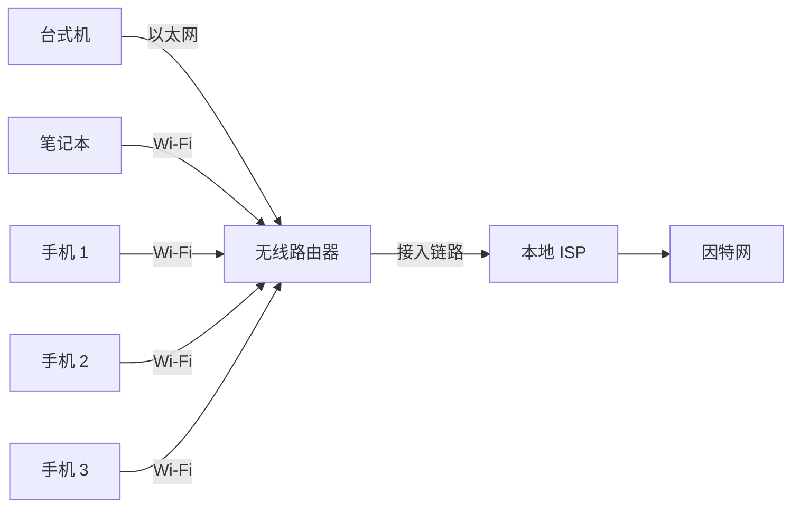

### 3. 网络的组成

从软硬件角度，计算机网络由三部分组成：

1. 计算机系统：  
   即主机或端系统，运行浏览器、服务器等网络应用程序。端系统还包括智能音箱、电子相框、智能冰箱、联网家电、手环和 IP 电话机等。
2. 数据通信系统：  
   包括光纤、同轴电缆、双绞线、无线和卫星等通信链路，以太网卡、无线网卡等网络接口，以及路由器、交换机和接入点等传输或交换设备。
3. 网络软件及协议：  
   负责数据封装、寻址、转发、差错处理和应用交互。


> 因特网由**网络边缘**和**网络核心**组成；接入链路把边缘端系统接入核心。路由器依据分组首部转发数据包，链路的传输速率通常称为带宽。

### 4. 网络拓扑

> 网络拓扑是各种设备通过传输介质互连所形成的物理布局。

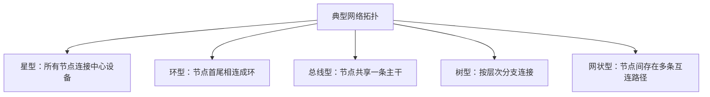

---

## 二、网络边缘与接入网络

### 1. 端系统通信方式

网络边缘由连接在因特网上的所有主机构成，这些主机也称为端系统（End System）。端系统中的程序通常采用两类通信方式。

| 方式 | 发起与服务关系 | 主要特点 |
|---|---|---|
| 客户/服务器（C/S） | 客户发起请求，服务器提供服务 | 地位不对等，服务集中 |
| 对等（P2P） | 对等体彼此直接通信 | Peer 既可作客户也可作服务器 |

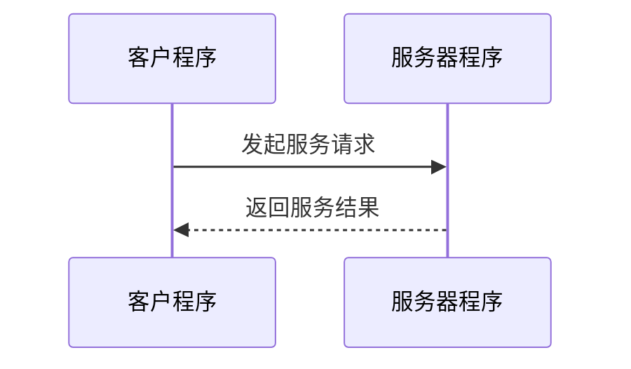

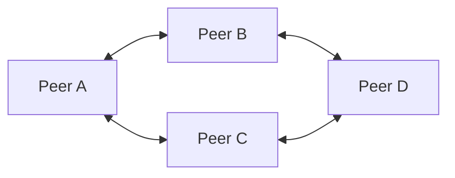

### 2. 接入网络的分类

接入网络把用户计算机连接到本地因特网服务提供商（ISP）。按业务能力可分为窄带与宽带接入，按入网介质可分为有线与无线接入。

1. 电话拨号：  
   调制解调器经普通模拟电话线接入公用交换电话网，速率不超过 $56\ \mathrm{kbps}$。ISDN 基本速率接口包含两条 $64\ \mathrm{kbps}$ 信息通路和一条 $16\ \mathrm{kbps}$ 信令通路，可同时上网、通话或传真。
2. DSL 与 ADSL：  
   DSL 在一对铜线上分别传送数据与语音，数据信号不经过电话交换机，无需拨号并保持在线。ADSL 具有非对称速率，课件给出的实用上行最高约 $1\ \mathrm{Mb/s}$、下行最高约 $8\ \mathrm{Mb/s}$，用户侧安装 ADSL MODEM，局端由 DSLAM 汇聚。
3. 线缆接入：  
   Cable Modem 利用有线电视电缆，课件示例下行约 $8\ \mathrm{Mb/s}$、上行约 $2\ \mathrm{Mb/s}$。ADSL 的本地环路通常由用户独占，而线缆接入的区域电缆通常由邻近用户共享。
4. 光纤到户：  
   光接入网以光纤全部或部分替代电话线；FTTH 将光网络单元（ONU，俗称光猫）安装在用户家中。
5. 局域网接入：  
   用户以双绞线连接交换机或路由器，再经 LAN 接入因特网。FTTx+LAN 可使光纤到小区或楼宇中心交换机，楼道内提供 $100/1000\ \mathrm{Mbps}$ 接入。
6. 无线接入：  
   WLAN 使用射频在空中收发数据，Wi-Fi 对应 IEEE 802.11；蓝牙适用于约 10 米以内的短距离通信；移动通信从早期约 $64\ \mathrm{kbps}$ 演进到 5G 的吉比特级能力。
7. 卫星接入：  
   用户经卫星 MODEM 与天线通信，速率可达数兆比特每秒，覆盖远但传播时延较长。


### 3. 无线局域网代际对比

| 指标 | Wi-Fi 4 | Wi-Fi 5 | Wi-Fi 6 |
|---|---|---|---|
| 协议原名 | 802.11n | 802.11ac | 802.11ax |
| 发布年份 | 2009 | 2013/2016 | 2018 以后 |
| 工作频段 | 2.4 GHz、5 GHz | 5 GHz | 2.4 GHz、5 GHz |
| 最大频宽 | 40 MHz | 80/160 MHz | 160 MHz |
| 单流典型最大速率 | 150 Mbps | 433/867 Mbps | 1201 Mbps |
| 最高调制 | 64QAM | 256QAM | 1024QAM |
| MU-MIMO | 不可用 | 下行 | 上下行 |
| 安全 | WPA2 | WPA2 | WPA3 |

课件列出的多流理论最大速率分别为 Wi-Fi 4 的 $600\ \mathrm{Mbps}$、Wi-Fi 5 的约 $6933.3\ \mathrm{Mbps}$、Wi-Fi 6 的约 $9607.8\ \mathrm{Mbps}$；这些值依赖频宽和空间流数量。

### 4. 卫星传播时延

| 卫星类型 | 用户设备到卫星的传播时延 | 单程最大传播时延 |
|---|---:|---:|
| LEO | 3～15 ms | 30 ms |
| MEO | 27～43 ms | 90 ms |
| GEO | 120～140 ms | 280 ms |

### 5. 接入方式对比

| 接入方式 | 课件所列速度 | 特点 | 成本 | 适用场合 |
|---|---:|---|---|---|
| 电话拨号 | 56 Kbps | 方便、低速 | 低 | 个人用户临时上网 |
| ADSL | 512 Kbps～8 Mbps | 高速、上下行不对称 | 低 | 家庭用户 |
| 线缆接入 | 8～48 Mbps | CATV 电缆、共享接入 | 较低 | 家庭、小企业 |
| LAN | 100/1000 Mbps | 高速 | 较低 | 家庭、办公室、小企业 |
| 光纤 | 100 Mbps 以上 | 高速、稳定 | 高 | 大中型企业、家庭 |
| 无线 LAN | 11～54 Mbps | 方便、快速 | 较低 | 家庭、手机、PDA、笔记本 |
| 蓝牙 | 1～3 Mbps | 近距离 | 低 | 手机、便携设备 |
| 3G | 10 Kbps～1 Mbps | 速度较慢 | 较低 | 个人用户 |
| 4G | 50～100 Mbps | 高速 | 较高 | 智能手机、家庭热点 |
| 5G | 500～1000 Mbps | 高速 | 高 | 智能手机、家庭热点 |
| 卫星 | 数 Mbps | 远距离、传播时延长 | 较高 | 广播、极端环境 |

> 表中的速率是课件用于比较技术代际的典型或标称值，不代表所有现实部署的固定性能。

---

## 三、网络核心与交换

### 1. 网络核心

网络核心是因特网中最复杂的部分，由互连路由器组成网状结构。它向大量边缘主机提供连通性，使任意边缘主机能够发送或接收数据。路由器是实现分组交换的关键构件，核心任务是转发收到的分组。

### 2. 电路交换

> **交换**就是把一条输入线路转接到另一条输出线路，使其连通；从资源分配角度看，是按某种方式动态分配传输线路资源。

若 $N$ 部电话机全部两两直接相连而不用交换机，需要的线路数为：

$$
\frac{N(N-1)}{2}
$$

使用交换机后，各电话机只需接入交换机，由交换机按呼叫需求建立通路。电话系统可看作“笨终端、聪明网络”：网络部件受控且强调可靠性，常用局部冗余降低部件失效影响。


| 优点 | 说明 |
|---|---|
| 时延小 | 通信线路专用，传输时延小 |
| 实时性强 | 物理通路建立后可随时通信 |
| 顺序可靠 | 数据按发送顺序传输，不存在失序 |

| 缺点 | 说明 |
|---|---|
| 建立连接时间长 | 传输前必须完成通路建立 |
| 灵活性差 | 通路任一点故障都需重新建立连接 |
| 线路利用率低 | 空闲时也不能供其他用户使用 |

### 3. 分组交换

分组交换建立在可能简单且不完全可靠的部件之上，通过聪明的端系统、重传与自适应路由形成可靠系统。路径故障时，分组可另选传输路径，出错时通常只重传受影响的分组，而非全部信息。


每个分组独立选路，因此同一报文的不同分组可能经过不同路径，且到达次序可能变化。

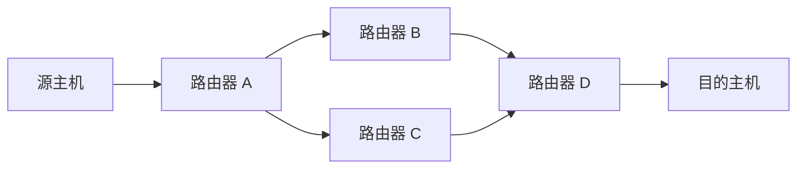

路由器的输入端口和输出端口之间不存在为某次通信预先建立的物理直连，其处理过程是：


主机为用户处理信息、产生或接收分组；路由器对分组进行存储转发，最终把分组交付目的主机。

| 分组交换优点 | 含义 |
|---|---|
| 高效 | 动态分配带宽，对链路逐段占用 |
| 灵活 | 以分组为单位独立查找路由 |
| 迅速 | 不必先建立端到端物理连接 |
| 可靠 | 可靠协议与分布式路由提高网络生存性 |

分组在节点缓存和排队、检查首部并查表会引入时延；分组首部也会带来额外开销。

### 4. 两种交换方式对比

| 维度 | 电路交换 | 分组交换 |
|---|---|---|
| 典型网络 | 电话网 | 因特网 |
| 连接 | 预先建立端到端专用通路 | 不预先建立专用物理通路 |
| 资源占用 | 通信期间独占 | 分组逐段动态共享 |
| 转发单位 | 连续比特流 | 带首部的分组 |
| 路径 | 一次通信通常固定 | 每个分组可独立选路 |
| 时延 | 有连接建立时间，建立后较稳定 | 有处理、排队和存储转发时延 |
| 适应故障 | 通路故障需重建 | 可由路由机制绕行 |

### 5. 网络类型

| 类型 | 覆盖范围与用途 | 技术侧重点 |
|---|---|---|
| 局域网（LAN） | 几米至约 10 km，通常位于建筑物或单位内，可连接 2 台至数百台设备；课件说明其内部一般不涉及路由选择 | 共享信道、冲突控制；范围窄、配置容易、速率高，课件给出最高可达 10 Gbps |
| 城域网（MAN） | 约 10～100 km，覆盖城市，规模介于 LAN 与 WAN 之间 | 典型示例为城市有线电视网 |
| 广域网（WAN） | 数十至数千公里，可覆盖国家、地区或洲际 | 以交换节点和传输线路构成通信子网，关注网状拓扑与路由算法 |

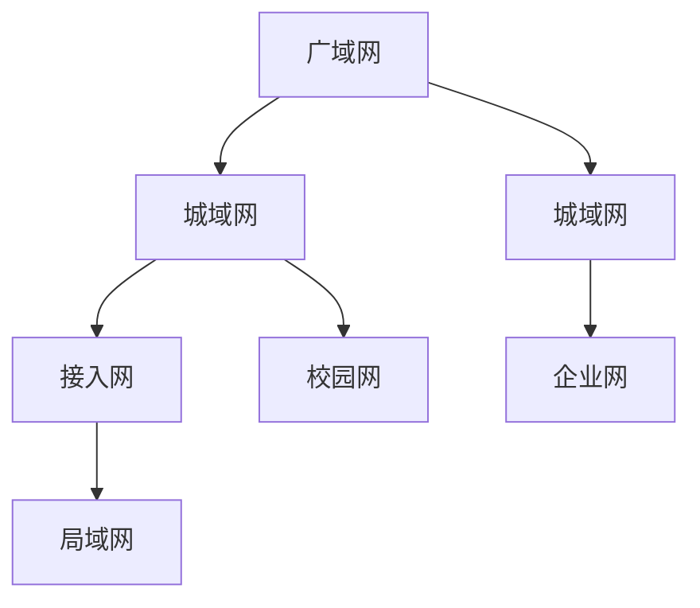

LAN 主要连接主机并解决共享信道上的冲突；WAN 主要由交换节点和线路构成通信子网，通过路由算法选择较优路径。

### 6. ISP 与骨干网

骨干网连接城市或大型网络，可能具有国际出口，其他具备接入能力的 ISP 经骨干网访问外部网络。“骨干网”描述大型网络结构，而不是某一种特定传输协议；其作用范围通常为几十到几千公里，因而一般属于 WAN。

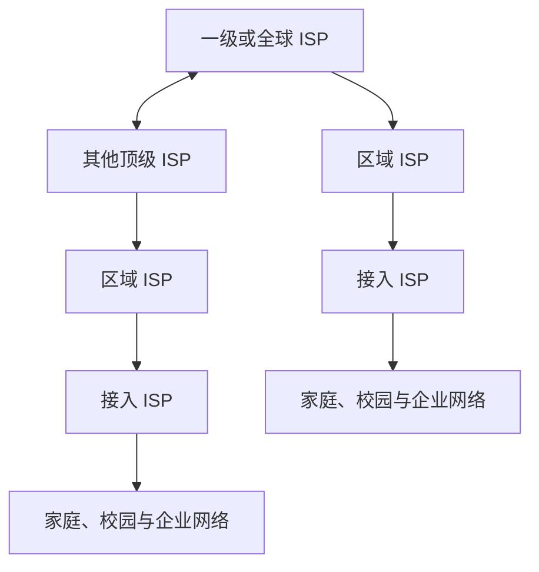

我国计算机网络发展的课件时间点包括：1980 年铁道部进行联网实验；1989 年 11 月公用分组交换网 CNPAC 建成；1994 年 4 月以 $64\ \mathrm{kbps}$ 专线接入互联网并获国际承认；1994 年 5 月设立首个万维网服务器；同年 CHINANET 启动。

课件列举的九大骨干网为 CHINANET、CHINAGBN、UNINET、CNCNET、CMNET、CERNET、CSTNET、CGWNET 和 CIETNET。CERNET 骨干网示意以清华、北大、中科院、北航、北邮和基金委等节点互连，并与 CSTNET、APAN/STAR 等网络衔接；2013 年示意链路包括 100G、$10G\times n$ 和 $2.5G\times n$。CNGI-CERNET2 是下一代互联网工程的重要组成，课件称其为大规模纯 IPv6 网络。

课件截至 2026 年 2 月引用的 IPv4 地址分配统计如下，数值作为课件记录保留：

| 单位 | 地址量 | 折合数 |
|---|---:|---|
| 中国电信集团有限公司 | 125,763,328 | 7A+126B+255C |
| 中国联合网络通信集团有限公司 | 69,866,752 | 4A+42B+21C |
| CNNIC IP 地址分配联盟 | 62,957,312 | 3A+192B+133C |
| 中国移动通信集团有限公司 | 35,294,208 | 2A+26B+140C |
| 中国教育和科研计算机网 | 16,649,984 | 254B+16C |
| 中移铁通有限公司 | 15,796,224 | 241B+8C |
| 其他 | 16,834,560 | 256B+224C |
| 合计 | 343,162,368 | 20A+116B+62C |

---

## 四、网络性能指标

### 1. 速率与带宽

比特（bit）是计算机中的数据量单位，也是信息论中的信息量单位；一个比特是一个二进制数字 0 或 1。

> **数据率或比特率**是主机在数字信道上传输数据的速率，单位为 bps、kbps、Mbps、Gbps 等；“速率”常指额定速率或标称速率。

带宽原指信号频带宽度，单位为 Hz；在数字通信中常指数字信道能够传送的最高数据率，单位为 bps。前者属于频域概念，后者属于时域概念。在其他条件一定时，链路带宽越大，最高数据率越高，单个比特占用的时间越短。

| 单位 | 换算 |
|---|---:|
| kbps | $10^3\ \mathrm{bps}$ |
| Mbps | $10^6\ \mathrm{bps}$ |
| Gbps | $10^9\ \mathrm{bps}$ |
| Tbps | $10^{12}\ \mathrm{bps}$ |

**例**：在 $1\ \mathrm{Mbps}$ 链路上，一个比特的持续时间为 $1\ \mu s$；在 $4\ \mathrm{Mbps}$ 链路上为 $0.25\ \mu s$。

### 2. 时延

1. 发送时延：  
   数据块从节点进入传输媒体所需时间，从第一个比特开始发送到最后一个比特发送完毕。

$$
d_{\mathrm{trans}}=\frac{L}{R}
$$

其中 $L$ 为数据块长度（bit），$R$ 为信道带宽（bit/s）。

2. 传播时延：  
   电磁波在信道中传播一定距离所需时间。

$$
d_{\mathrm{prop}}=\frac{D}{V}
$$

其中 $D$ 为信道长度（m），$V$ 为信号在介质中的传播速率（m/s）。

3. 处理时延：  
   交换节点检查首部、查表和差错检测等处理所需时间。
4. 排队时延：  
   分组在节点缓存队列中等待所经历的时间，主要取决于当时通信量。

$$
d_{\mathrm{total}}=d_{\mathrm{trans}}+d_{\mathrm{prop}}+d_{\mathrm{proc}}+d_{\mathrm{queue}}
$$


> **易错点**：“宽带链路上传播更快”不准确。带宽影响把比特发送到链路上的速率，而传播速率主要由介质决定；光纤相对同轴电缆显著提高的通常是可支持的发送速率，而不是把发送速率与传播速率混为一谈。

### 3. 吞吐量

> **吞吐量**是每秒成功传输的数据量，可按瞬时或平均值计算，单位也为 bps。

带宽表示链路的理论或标称传输能力，吞吐量表示系统实际达到的传输性能。实现中的协议开销、竞争、设备处理能力等会使实际吞吐量低于带宽；例如，带宽为 $10\ \mathrm{Mbps}$ 的链路可能只得到 $2\ \mathrm{Mbps}$ 的吞吐量。

若发送端接入速率为 $R_s$、接收端接入速率为 $R_c$，10 个连接共享容量为 $R$ 的瓶颈链路，则每个连接的端到端吞吐量近似为：

$$
\min\left(R_s,R_c,\frac{R}{10}\right)
$$


瓶颈可能是发送端接入链路、接收端接入链路，也可能是共享核心链路。

---

## 五、协议与分层体系结构

### 1. 协议

> **协议**是通信实体之间通信必须遵守的规则，定义两个或多个实体交换的报文格式与次序，以及报文发送、接收或其他事件发生时采取的动作。

| 要素 | 含义 |
|---|---|
| 语法 | 数据与控制信息的结构或格式 |
| 语义 | 发出何种控制信息、完成何种动作及作出何种响应 |
| 同步 | 事件发生顺序的详细说明 |

协议类似人际交往规则：问候、请求时间、答复都必须按可理解的顺序进行；网络中可表现为 TCP 连接请求、连接响应、HTTP 请求和文件返回。

### 2. 分层的原因与基本概念

网络包含主机、路由器、链路、应用、协议、硬件和软件等大量构件。分层把庞大问题分解为较小、易研究和实现的局部问题。

计算机网络分层需要回答三个问题：

1. 分层与功能：  
   体系结构应有哪些层次，每层完成什么功能。
2. 服务与接口：  
   相邻层之间怎样交互，下层如何向上层提供服务。
3. 协议：  
   不同系统的对等实体通信时遵守什么规则。

> **网络体系结构**是一个系统的分层以及各层协议的集合。

| 概念 | 定义 |
|---|---|
| 实体（Entity） | 可发送或接收信息的硬件或软件进程 |
| 对等实体 | 不同系统中处于同一层的实体 |
| 协议 | 控制两个对等实体通信的规则集合 |
| 服务 | 下层通过接口向上层提供的功能 |
| 服务访问点（SAP） | 同一系统相邻两层实体交互的位置 |

协议是“水平的”，控制对等实体间通信；服务是“垂直的”，由下层通过层间接口向上层提供。上层服务用户只能看见服务，不能看见下层协议实现，因而下层协议对上层透明。本层协议的实现依赖下层服务，本层通信又使本层能够向上一层提供服务。

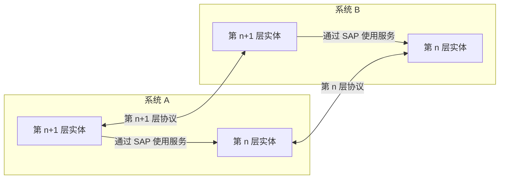

### 3. OSI、TCP/IP 与教学混合模型

| 层次 | OSI 七层模型 | TCP/IP 四层模型 | 教学五层模型 |
|---:|---|---|---|
| 7 | 应用层 | 应用层 | 应用层 |
| 6 | 表示层 | 应用层 | 应用层 |
| 5 | 会话层 | 应用层 | 应用层 |
| 4 | 传输层 | 传输层 | 传输层 |
| 3 | 网络层 | 网际层 | 网络层 |
| 2 | 数据链路层 | 主机—网络接口层 | 数据链路层 |
| 1 | 物理层 | 主机—网络接口层 | 物理层 |

OSI 是法律意义上的国际标准，但市场化失败，原因包括缺少商业驱动力、协议实现复杂且效率低、制定周期过长、层次划分不够合理并存在功能重复。TCP/IP 获得最广泛应用，成为事实上的国际标准。

TCP/IP 的应用层包含 HTTP、FTP、SMTP、TELNET、DNS、RTP 等协议；传输层主要有 TCP 和 UDP；网际层核心是 IP；主机—网络接口可使用以太网、Wi-Fi、光网络等多种技术。“IP over Everything”表明 IP 能运行在多样网络之上，也能为多样应用提供统一服务。

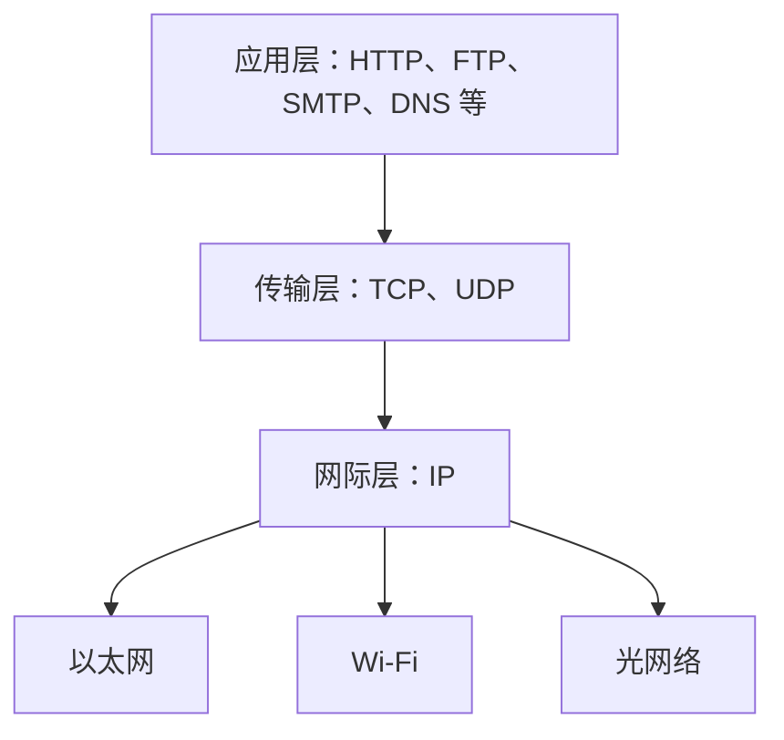

### 4. 协议数据单元与封装

| 教学五层 | 数据单元 |
|---|---|
| 应用层 | 消息或报文 |
| 传输层 | TCP 报文段或 UDP 用户数据报 |
| 网络层 | IP 数据报 |
| 数据链路层 | 帧 |
| 物理层 | 比特流 |

发送端数据自上而下，每层在上层数据前后增加由该层协议规定的首部或尾部；接收端自下而上逐层解封装。

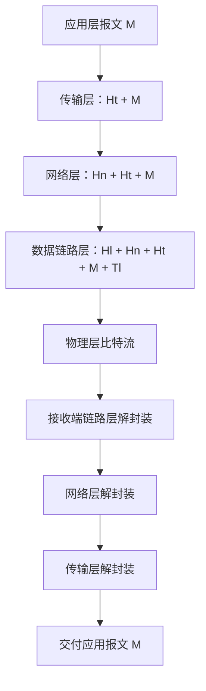

只有最底层执行实际的物理通信，其他对等层之间是逻辑上的虚拟通信；数据路径整体呈“向下发送、经介质传输、向上接收”的 U 型。

### 5. 访问网页的跨层过程

以访问北邮主页为例，应用运行在跨网络互连环境中，对带宽、时延和传输差错有要求。源主机应用产生网页请求，TCP/IP 软件将数据封装为分组，链路和路由器负责传输与转发；目的主机网络软件重组数据并交给 Web 服务器程序处理。

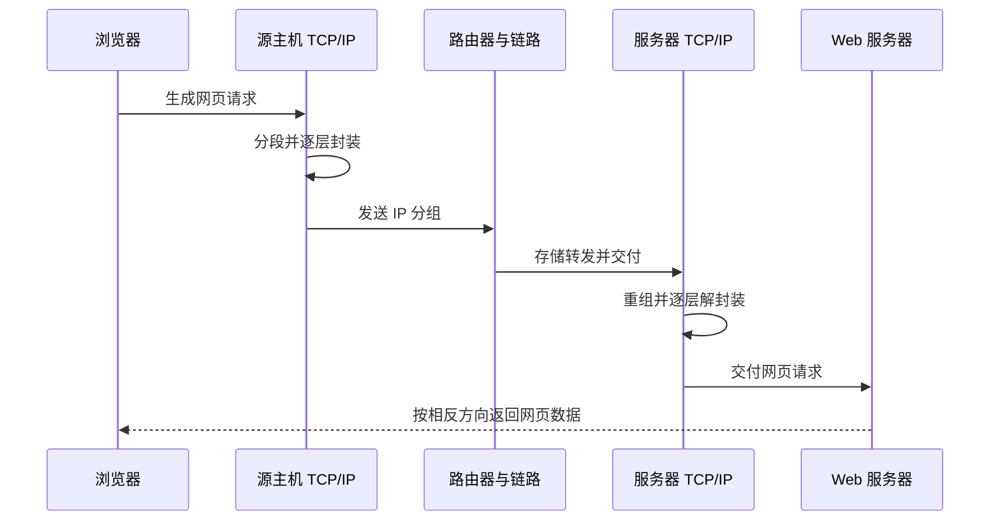

---

## 六、网络安全隐患

泛在网络连接智能交通、农林牧渔、数字生活、基础设施、国防工业和服务业，也扩大了攻击面。课件列出的网络攻击特点是手段多、形式灵活、未知威胁难溯源；攻击行为从普通黑客攻击、有组织网络攻击，到网络恐怖主义和国家支持的网络战，破坏程度与威胁程度逐级增加。

### 1. 常见攻击

| 攻击 | 机制 | 直接后果 |
|---|---|---|
| 拒绝服务（DoS） | 使用大量业务流占用服务器或带宽资源 | 合法用户无法使用资源 |
| 数据包嗅探 | 在共享以太网、无线等广播信道监听数据 | 密码等敏感信息泄露，可用 Wireshark 等工具观察流量 |
| IP 欺骗 | 使用虚假源地址发送数据包 | 接收方误判数据来源 |
| 记录与回放 | 嗅探认证数据后在以后重新发送 | 系统可能把攻击者当成合法用户 |

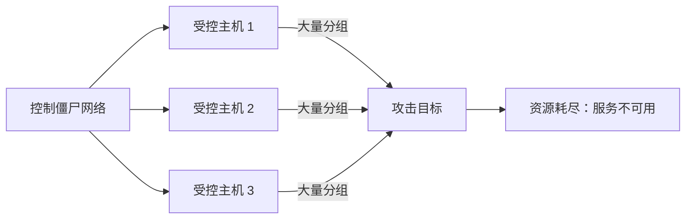

嗅探示意中，攻击者 C 监听 B 发往 A 的数据；IP 欺骗中，C 构造“源地址为 B、目的地址为 A”的数据；记录与回放中，C 获取 B 的用户名和密码后再次向 A 发送，使系统误认为请求来自 B。

### 2. APT

课件引用 2018 年研究报告指出，中国是 APT 的主要受害国之一；报告统计针对东亚和东南亚的 APT 组织有 35 个，约占当时已发现组织的 35%，其中 7 个专门针对中国。该统计反映的是课件引用报告的历史数据。

课件列举的事件包括：2007 年伊朗核电站遭蠕虫攻击、2012 年 Luckycat 攻击军事航天和能源机构、2015 年海莲花攻击政府与海事机构、2017 年 WannaCry 勒索蠕虫传播、2018 年新加坡健康数据泄露等。


课件引用报告中的受攻击目标统计如下；主要领域包括政府、基础设施、教育、科研、金融、军事和商业组织。

| 国家 | 地区 | 相关报告数量 | 攻击组织数量 |
|---|---|---:|---:|
| 中国 | 亚洲 | 26 | 9 |
| 美国 | 北美 | 15 | 9 |
| 印度 | 亚洲 | 15 | 7 |
| 俄罗斯 | 欧洲 | 15 | 6 |
| 乌克兰 | 欧洲 | 14 | 5 |
| 巴基斯坦 | 亚洲 | 13 | 3 |
| 伊朗 | 亚洲 | 12 | 3 |
| 韩国 | 亚洲 | 8 | 4 |
| 日本 | 亚洲 | 3 | 3 |
| 以色列 | 亚洲 | 3 | 3 |
| 土耳其 | 亚洲 | 3 | 2 |
| 沙特阿拉伯 | 亚洲 | 2 | 2 |
| 埃及 | 非洲 | 2 | 2 |

---

## 七、因特网历史与标准化

### 1. 三个发展阶段

```mermaid
flowchart LR
  A[第一阶段：20 世纪 60—80 年代：单个网络走向互连] --> B[第二阶段：20 世纪 80—90 年代：三级结构互联网]
  B --> C[第三阶段：20 世纪 90 年代以后：多层次 ISP 互联网]
```

1. 第一阶段：  
   20 世纪 60 年代出现面向终端的计算机系统；70 年代 ARPANET 采用存储转发与分组交换；80 年代推动网络国际标准化，形成 OSI 参考模型与 TCP/IP 协议栈。
2. 第二阶段：  
   NSFNET 建成“主干网—地区网—校园网或企业网”的三级结构。
3. 第三阶段：  
   互联网转变为多层次 ISP 结构，不同层级运营网络彼此互连。

### 2. 应用、技术和硬件演进

| 时期 | 网络应用与技术 | 主机与速率概况 |
|---|---|---|
| 1970s | 电子邮件、BBS、文件下载；ARPANET 与 TCP/IP 开发 | 大型主机，约 100 Kbps |
| 1980s | WWW、超媒体；NSFNET、TCP/IP 支持异构网络与 LAN | PC、掌上电脑，约 1～10 Mbps |
| 1990s | 电子商务、即时消息、博客；Wi-Fi、Internet 普及 | 智能手机和平板出现，约 10～100 Mbps |
| 2000s | VoIP、IPTV、P2P、社交网络、视频分享、云计算；传感网与物联网 | 约 1～10 Gbps |
| 2010s | 移动社交、共享经济、移动支付、大数据、短视频和直播 | 约 10～100 Gbps |
| 2020s | 远程工作、智能网联汽车、工业互联网、隐私计算、AR、VR、元宇宙、微短剧 | 课件标注网络速率向 100 Gbps～Tbps 级演进 |

课件把应用发展概括为：过去以拨号、电子邮件、静态页面、BBS 和 FTP 为主；当前以宽带、即时通信、网络电话、快速下载、流媒体和移动网络为主；未来进一步走向高清视频、光纤接入、网络融合、Web 2.0、云计算、物联网和大数据。相关历史曲线与 2015、2023 年世界互联网普及率地图用于说明连接国家和用户比例持续增加；由于地图不能在不丢失地理细节的情况下可靠重构，结论以文字保留。

### 3. IETF 与 RFC

因特网工程任务组（IETF）面向近期因特网标准工作，课件称其分为应用、寻径与寻址、安全等 9 个领域，负责开发可成为因特网标准的规范。

> **RFC（Request for Comments）**是因特网标准化过程使用的文档系列。

---

## 八、实验、思考与勘误

### 1. Windows 网卡配置实验

1. 自动获取 IP 地址如何实现？除 IP 地址外还可配置哪些参数？
2. `ping` 命令有哪些选项？输出结果中的各参数分别代表什么？
3. 选择一个新兴网络应用，调研其功能、性能指标及所需技术支持。

课件末页给出跨网访问拓扑：用户计算机通过双绞线连接路由器 R1，R1 经 ADSL Modem 和 DSLAM 接入 Internet，再经路由器 R2 到达课程服务器。该拓扑强调应用通信依赖逐段物理链路，而物理层只面向一条信道上的相邻节点提供比特传输服务。

```mermaid
flowchart LR
  PC[用户计算机] -->|双绞线| R1[路由器 R1]
  R1 --> MODEM[ADSL Modem]
  MODEM --> DSLAM[DSLAM]
  DSLAM --> I[Internet]
  I --> R2[路由器 R2]
  R2 --> S[课程服务器]
```

### 2. 课件勘误

| 页码 | 位置 | 原文 | 更正 |
|---:|---|---|---|
| 5 | 第 4 段第 3 行 | 桥接器 | 网桥 |
| 6 | 图 1-3 名 | 端系统之间的通信方式 | 端系统之间的 P2P 通信方式 |
| 8 | 倒数第 2 段第 1 行 | 数百英尺范围内 | 100 米内 |
| 20 | 倒数第 4 行 | 提示型原语 | 指示型原语 |
| 27 | 图 1-19 下第 4 行 | 默认网关：192.168.199.1 | 默认网关：192.168.199.127 |

### 3. 课件资料来源说明

课件说明部分图示取自以下教材配套讲义：Jim Kurose 与 Keith Ross 的 *Computer Networking: A Top-Down Approach* 第 7 版；Andrew S. Tanenbaum 的 *Computer Networks*；谢希仁《计算机网络》第 8 版；Behrouz A. Forouzan 的 *Data Communications and Networking* 第 4 版。本笔记只转写课件承载的知识，不保留原图。

---

## 本章小结

| 主题 | 核心结论 |
|---|---|
| 整体结构 | 因特网由边缘端系统、接入链路和互连路由器构成的网络核心组成 |
| 通信方式 | 边缘应用主要采用 C/S 或 P2P；核心主要使用分组交换 |
| 交换 | 电路交换预留专用通路；分组交换以存储转发方式动态共享链路 |
| 网络类型 | LAN 关注共享接入与冲突，WAN 关注通信子网与路由，MAN 介于二者之间 |
| 性能 | 带宽表示能力，吞吐量表示实效；总时延由发送、传播、处理和排队时延组成 |
| 分层 | 对等层靠协议通信，下层通过接口向上层提供服务，发送端封装、接收端解封装 |
| 安全 | DoS、嗅探、IP 欺骗、重放和 APT 说明开放互联同时扩大了攻击面 |

## 图片覆盖审计

> OCR Markdown 中共有 **142 个图片引用**。以下编号按图片在源 Markdown 中的出现顺序排列；连续编号均已逐一核查，最终笔记不保留图片或图片地址。

| 图片编号 | 原图信息 | 转写方式与位置 |
|---|---|---|
| 1～4 | 三网融合、网络与互联网概念、家庭组网任务 | 概念表、家庭组网 Mermaid 和文字说明 |
| 5～9 | PC、服务器、便携设备、链路、路由器及因特网组成 | “网络的组成”文字与边缘—核心 Mermaid |
| 10～14 | 智能音箱、联网家电、冰箱、手环、IP 电话等端系统照片 | 逐类列入端系统说明；照片本身不增加连接关系 |
| 15～21 | 光纤、同轴电缆、双绞线、网卡、路由器、交换机等设备照片 | 传输介质、网络接口和交换设备分类文字 |
| 22 | 星、环、总线、树、网状拓扑 | “网络拓扑” Mermaid 重构并解释各结构 |
| 23～24 | 网络边缘、接入链路、核心和网络的网络 | 因特网组成 Mermaid 与定义 |
| 25～26 | C/S 与 P2P 通信关系 | 时序图、对等图和对比表 |
| 27～35 | 拨号、ADSL、线缆、FTTH、WLAN、移动、卫星接入及设备示意 | 接入链路 Mermaid、代际表、时延表与完整文字；装置照片转为功能描述 |
| 36～37 | 边缘到核心、路由器网状核心 | 网络边缘与核心说明 |
| 38～42 | 电话两两直连、交换机和电路交换三阶段 | 线路数公式、电路阶段 Mermaid 及优缺点表 |
| 43～50 | 分组结构、分组独立选路、路由器缓存查表及存储转发 | 四幅 Mermaid、步骤与电路/分组对比表 |
| 51～57 | MAN、LAN/WAN 层次、多层 ISP、CERNET 与 CNGI-CERNET2 | 网络类型 Mermaid、ISP Mermaid、骨干网文字说明 |
| 58～60 | 频域带宽、数据率带宽、位时间 | 单位表、定义和 $1/4\ \mathrm{Mbps}$ 位时间例题 |
| 61 | 四类时延在节点与链路中的位置 | 时延 Mermaid 与四项公式说明 |
| 62～66 | 共享瓶颈、网页访问和主机通信 | 吞吐量公式、瓶颈图和跨层通信时序图 |
| 67 | 人际协议与网络协议对照 | 协议定义、三要素表和交互文字 |
| 68～75 | 邮政分层、协议与服务、OSI/TCP-IP、沙漏结构、封装 | 分层对比表及五幅 Mermaid；封装字段完整保留 |
| 76～82 | 泛在网络行业图标和场景图 | 归纳为六类应用领域；图标与背景属于装饰，不增加协议知识 |
| 83～88 | 攻击统计图、黑客及网络战场景 | 历史统计和威胁等级文字描述；无法可靠还原图形比例，不猜测缺失数值 |
| 89～92 | DoS、嗅探、IP 欺骗、记录与回放 | DoS Mermaid、攻击机制表及 A/B/C 角色关系文字 |
| 93～98 | APT 事件、受害国统计和六阶段攻击链 | 事件文字、原生表格和 APT Mermaid |
| 99～105 | 单机系统、ARPANET、OSI/TCP-IP、三级网与多层 ISP | 三阶段历史 Mermaid 与时间说明 |
| 106～120 | 1970s～2020s 的应用、网络技术、终端和带宽演进图标 | 按时代重建为原生管道表格；照片和图标转为相应类别文字 |
| 121～136 | 从拨号到宽带、流媒体、移动网络、云计算、物联网的应用拼图 | “应用、技术和硬件演进”完整文字概括，不保留装饰图标 |
| 137～139 | 连接国家数量曲线及 2015、2023 年互联网普及率世界地图 | 文字保留“数量与普及率增长”结论；复杂地图不能可靠重构，未猜测国家数值 |
| 140～141 | IETF 组织与 RFC 标准化流程 | IETF、RFC 定义和标准化文字 |
| 142 | 用户经 R1、ADSL、DSLAM、Internet、R2 访问服务器 | 实验拓扑 Mermaid 与逐段链路解读 |
