# 3.1 运输层

> 本笔记依据第三章 OCR 文稿与原 PDF 整理，围绕进程到进程通信、可靠传输、UDP、TCP、流量控制和拥塞控制建立知识链。课件中的 70 幅图片均已逐一核查，并以 Mermaid、原生表格、公式或完整文字说明接替。

## 主要内容

- 运输层服务、复用与分用、端口号
- 可靠数据传输与 ARQ 协议演进
- UDP 数据报、伪首部与校验和
- TCP 报文段、连接管理与可靠传输
- TCP 流量控制、传输效率与拥塞控制
- 运输层安全隐患与典型攻击

---

## 一、运输层的功能与服务

### 1. 进程到进程的逻辑通信

> **运输层为不同主机上的应用进程提供逻辑通信。** 网络层实现主机到主机通信，而运输层借助端口号把数据进一步交付给正确进程。

发送端将应用层消息封装为报文段或用户数据报后交给网络层；接收端从报文段或数据报中取出应用消息并交给相应进程。运输层协议只在端系统实现，路由器主要工作在网络层及以下。

网络层服务越不可靠，运输层实现可靠性所需的差错检测、确认、重传、排序和流量控制机制就越复杂。生活类比中，学生相当于进程、信件相当于应用消息、班级信箱相当于主机、通信员相当于运输层协议、邮政系统相当于网络层协议。

### 2. 复用、分用与端口

> **复用**：源端多个应用进程的消息共用一个网络接口发送；**分用**：目的运输层依据端口号把数据交给正确进程。

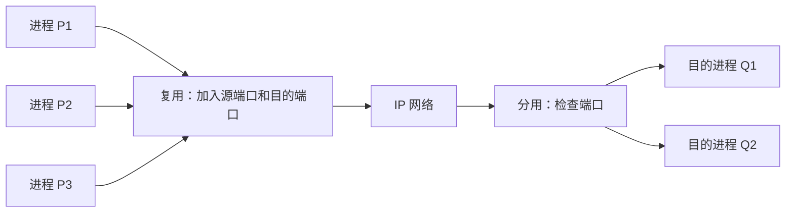

端口号为 16 位。TCP 连接通常用四元组“源 IP、源端口、目的 IP、目的端口”标识，因此同一服务器端口可同时服务多个客户端。

| 类别 | 常见范围 | 使用者 | 特点 |
|---|---:|---|---|
| 熟知端口 | 0～1023 | 服务器进程 | 固定开放，如 HTTP 80、TELNET 23 |
| 短暂端口 | 49152～65535 | 客户进程 | 由操作系统临时分配 |

### 3. TCP 与 UDP 服务

| 特性 | TCP | UDP |
|---|---|---|
| 连接 | 面向连接，传输前握手 | 无连接，无握手 |
| 交付 | 可靠、按序、无重复的字节流 | 尽力而为，可能丢失、失序 |
| 控制 | 流量控制、拥塞控制 | 不提供 |
| 状态与开销 | 有状态、首部较长 | 无状态、8 字节首部 |
| 消息边界 | 不保留 | 保留 |

运输层通常不提供固定时延和固定带宽保障。

---

## 二、可靠数据传输

### 1. 可靠性的含义

> 可靠传输要求接收数据值等于发送数据值；数据不丢失、不重复；接收顺序等于发送顺序。

可靠性还依赖接收方及时处理数据，否则缓存溢出也会造成丢失。传输层和数据链路层均可提供可靠数据传输，但作用范围不同。

### 2. RDT 演进

| 版本 | 信道假设 | 核心机制 |
|---|---|---|
| RDT 1.0 | 无差错、无丢失 | 连续发送，无需附加机制 |
| RDT 2.0 | 可能比特出错 | 校验和、ACK、NAK、停止等待 |
| RDT 2.1 | 数据或 ACK 可能丢失 | 定时器、超时重传 |
| RDT 2.2 | 重复包或延迟 ACK | 数据与 ACK 序号 |
| RDT 3.0 | 实际信道，有错且可丢包 | 完整停止等待 ARQ |
| RDT 4.0 | 实际信道，允许流水线 | Go-Back-N 与滑动窗口 |
| RDT 5.0 | 减少无谓重传 | 选择重传 SR |

RDT 是教学模型，并非实际因特网协议。

### 3. 差错检测、反馈与重传

发送方增加冗余校验字段，接收方据此检测差错。运输层常用校验和，数据链路层常用 CRC；汉明码等可直接纠错。ARQ 使用反馈：ACK 表示正确接收，NAK 表示出错；发送方收到 ACK 后发送下一包，收到 NAK 或超时则重传。

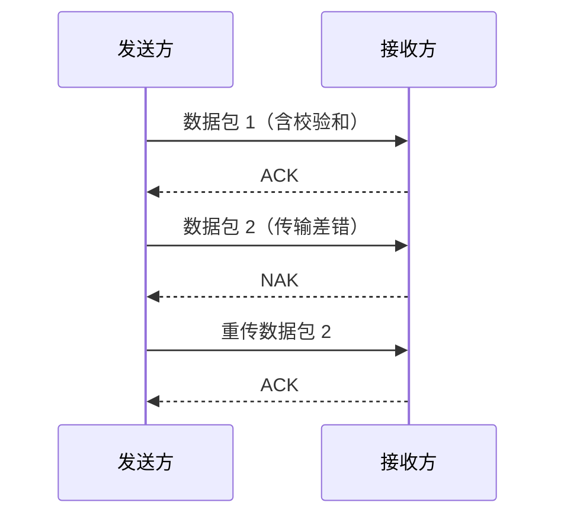

NAK 可省略：接收方发现错包时静默丢弃，发送方依靠超时重传。但 ACK 丢失会导致已正确收到的数据被重发，因此接收方须依据序号识别重复包、丢弃并重发 ACK。ACK 也必须带序号，否则延迟 ACK 可能被误判为后续数据的确认。

### 4. 停止等待 ARQ

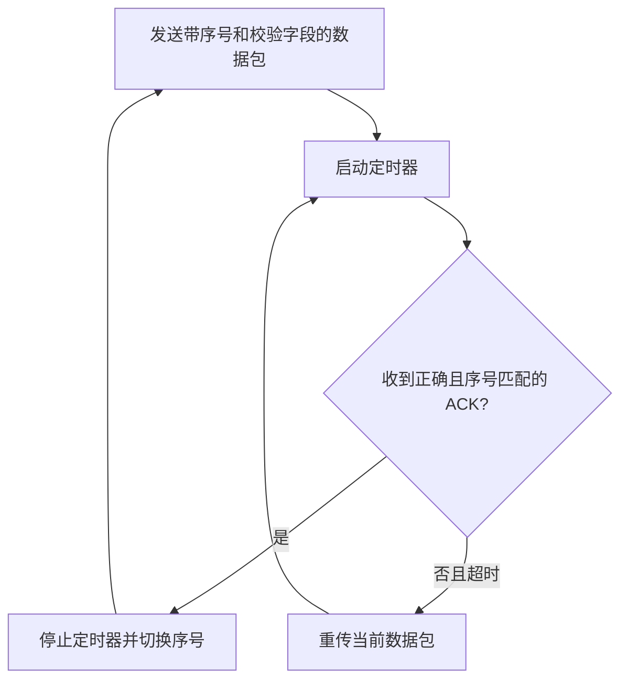

完整停等协议：一次只发一包；数据包和 ACK 均含 1 位序号；错包丢弃；重复包丢弃并重发上一 ACK；超时则重传。忽略处理、排队与 ACK 发送时延时：

$$
T=T_t+2T_p
$$

$$
U=\frac{T_t}{T_t+2T_p}=\frac{1}{1+2a},\qquad a=\frac{T_p}{T_t}
$$

$$
T_t=\frac{\text{包长（bit）}}{\text{带宽（bit/s）}},\qquad
T_p=\frac{\text{距离（m）}}{\text{传播速度（m/s）}}
$$

**例**：1 Mbit/s 卫星信道、传播时延 270 ms、包长 1000 B：

$$
a=\frac{270\times10^{-3}}{1000\times8/10^6}=33.75,\qquad U=\frac{1}{1+2a}\approx1.5\%
$$

实际速率约 15 kbit/s，即约 1.8 KB/s，停等严重限制物理资源利用率。

---

## 三、流水线与滑动窗口

### 1. 流水线

流水线允许发送方在收到 ACK 前连续发送多个包，需要扩大序号范围，并缓存数据包。

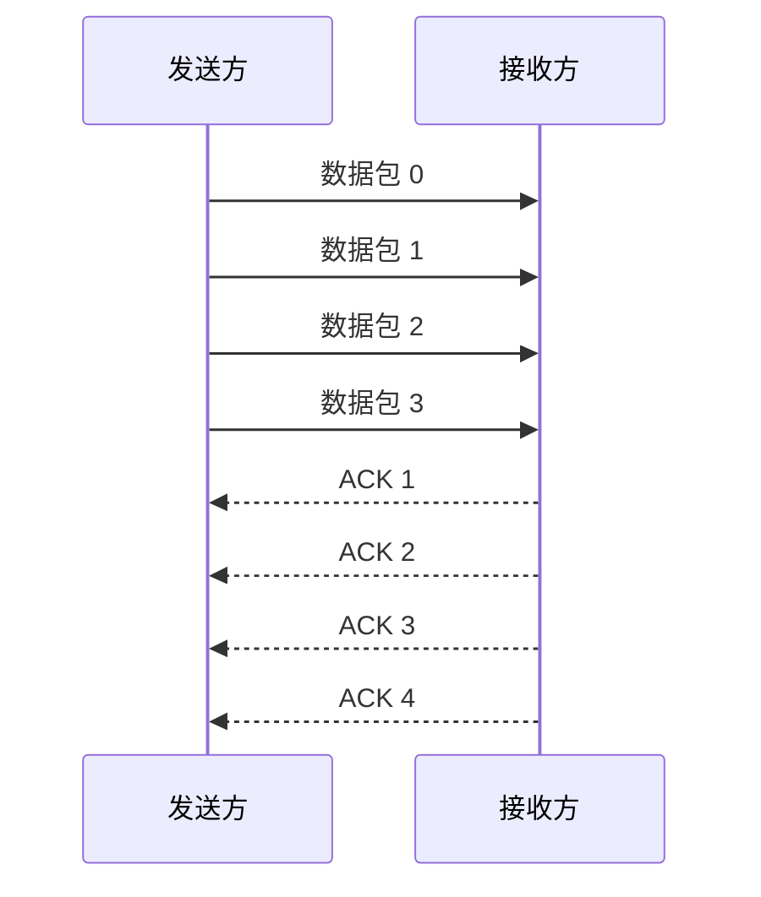

一次连续发送 $N$ 包的理想利用率：

$$
U=\min\left(1,\frac{NT_t}{T_t+2T_p}\right)=\min\left(1,\frac{N}{1+2a}\right)
$$

前述卫星链路一次发送 4 包时，$U\approx6\%$。

### 2. Go-Back-N

> Go-Back-N 的发送窗口为 $N$，接收窗口为 1。接收方只接收当前期望序号，丢弃失序包；丢包或出错后，发送方从出错包起重传后续所有已发未确认包。

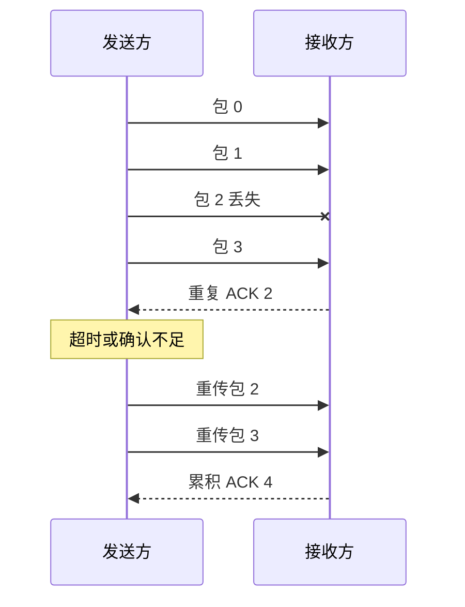

$n$ 位序号循环使用 $0$ 到 $2^n-1$，故

$$
N_{\max}=2^n-1,\qquad
U_{\max}=\min\left(1,\frac{2^n-1}{1+2a}\right)
$$

### 3. 选择重传

> SR 允许接收方缓存正确的失序包，发送方只重传丢失或出错包，缺失包补齐后再按序交付。

若发送窗口为 $W_S$、接收窗口为 $W_R$，必须满足

$$
W_S+W_R\le2^n
$$

常取 $W_S=W_R=2^{n-1}$，此时

$$
U_{\max}=\min\left(1,\frac{2^{n-1}}{1+2a}\right)
$$

| 机制 | 用途 |
|---|---|
| 校验和 | 检测比特错误 |
| 定时器 | 处理包或 ACK 丢失 |
| 序号 | 排序并识别重复 |
| ACK | 确认一个包或一组包 |
| NAK | 指示未正确接收，可选 |
| 滑动窗口 | 限制未确认包并提高利用率 |

---

## 四、UDP

### 1. 特点与应用

> UDP 是 RFC 768 定义的无连接、面向报文协议，提供尽力而为服务，只在 IP 上增加复用、分用和差错检测。

UDP 无需握手、无状态、首部短、时延低，也不实施拥塞控制。适合多媒体、少量且频繁的数据、DNS、SNMP 和路由更新；若需可靠性，由应用层补充。

| 端口 | 协议 | 用途 |
|---:|---|---|
| 7 | Echo | 回显 |
| 13 | Daytime | 日期时间 |
| 53 | DNS | 域名服务 |
| 67 | DHCP Server | DHCP 服务器 |
| 68 | DHCP Client | DHCP 客户端 |
| 69 | TFTP | 简单文件传输 |
| 111 | RPC | 远程过程调用 |
| 123 | NTP | 网络时间 |
| 161 | SNMP | 代理接收请求 |
| 162 | SNMP Trap | 管理者接收报告 |

### 2. 数据报格式

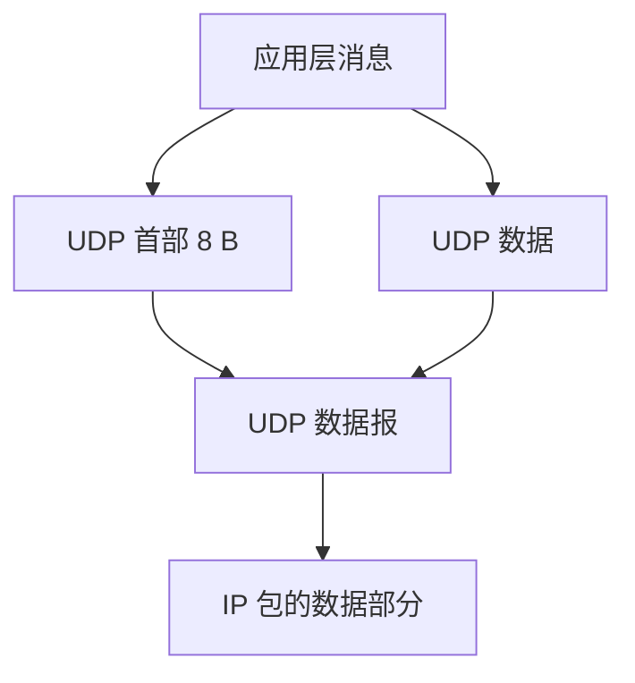

|    偏移 | 0～15 位 | 16～31 位 |
| ----: | ------ | ------- |
|     0 | 源端口    | 目的端口    |
| 32bit | 数据报长度  | 校验和     |
| 64bit | 应用数据   | 应用数据    |

长度以字节计，包含首部和数据，最大 65535 B。

### 3. 校验和与伪首部

发送方把伪首部、UDP 首部和数据按 16 位分组；校验和先置 0，末组不足补 0；各组做反码加法，进位回卷，结果取反填入。接收端重算，和为全 1（或再取反为 0）表示未检出错误。

> 伪首部只参与计算，不传送。它含源 IP、目的 IP、全 0、协议号 17 和 UDP 长度。课件勘误明确：校验覆盖伪首部及整个 UDP 数据报；校验和字段为 0 表示未校验。

| 伪首部字段 | 长度 |
|---|---:|
| 源 IPv4 地址 | 32 位 |
| 目的 IPv4 地址 | 32 位 |
| 全 0 | 8 位 |
| 协议号 17 | 8 位 |
| UDP 长度 | 16 位 |

---

## 五、TCP 报文段与字节流

### 1. 服务要点

> TCP 是面向连接、可靠、按序、全双工、端到端的一对一字节流协议。它以连续 ARQ 与滑动窗口工作。

TCP 不保留应用消息边界；多次写入可被合并或拆分。窗口以字节计，同时受接收窗口和拥塞窗口限制。

|    端口 | 协议     | 用途        |
| ----: | ------ | --------- |
| 20/21 | FTP    | 数据连接/控制连接 |
|    23 | TELNET | 终端仿真      |
|    25 | SMTP   | 邮件传输      |
|    53 | DNS    | 域名服务      |
|    80 | HTTP   | 超文本传输     |
|   110 | POP3   | 邮局协议      |

### 2. TCP 首部与序号

| 字段     |     长度 | 含义                      |
| ------ | -----: | ----------------------- |
| 源/目的端口 | 各 16 位 | 标识进程                    |
| Seq    |   32 位 | 数据第一个字节编号               |
| Ack    |   32 位 | 期望接收的下一字节编号             |
| 数据偏移   |    4 位 | 首部长度，单位 4 B             |
| 控制位    |    6 位 | URG、ACK、PSH、RST、SYN、FIN |
| 接收窗口   |   16 位 | 可接收字节数                  |
| 校验和    |   16 位 | 覆盖伪首部、首部与数据             |
| 紧急指针   |   16 位 | URG 有效时定位紧急数据           |
| 选项/填充  |     可变 | MSS、窗口扩大、时间戳等           |

发送序号按“上次序号 + 数据长度”推进；确认号为对端下一期待字节。SYN 和 FIN 即使无数据也各消耗 1 个序号。

| 控制位 | 功能 |
|---|---|
| URG | 紧急指针有效 |
| ACK | 确认号有效 |
| PSH | 立即交付应用层 |
| RST | 复位连接 |
| SYN | 建连请求或响应 |
| FIN | 释放一个方向 |

**例**：客户端发送字符 C，若 Seq=25、Ack=79、数据长 1 B，服务器响应可为 Seq=79、Ack=26；客户端再确认时为 Seq=26、Ack=80。

---

## 六、TCP 连接管理

### 1. 三次握手

两次握手无法排除失效的重复连接请求。TCP 采用：

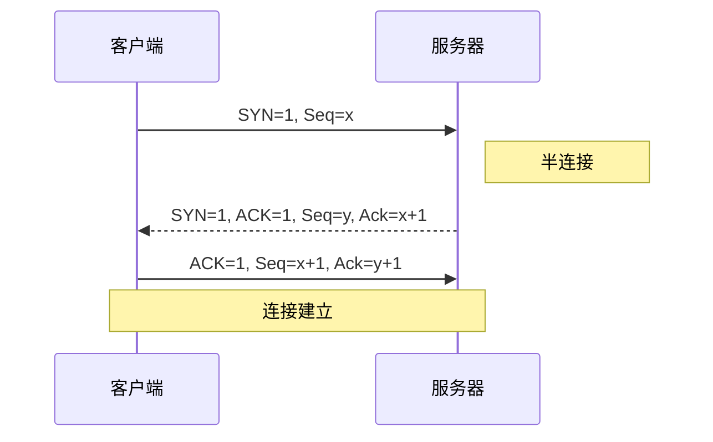

第三个 ACK 可携带数据。旧 SYN 延迟到达时，原请求方不会完成第三次握手，可发送 RST，使服务器释放半连接。

### 2. 四步释放

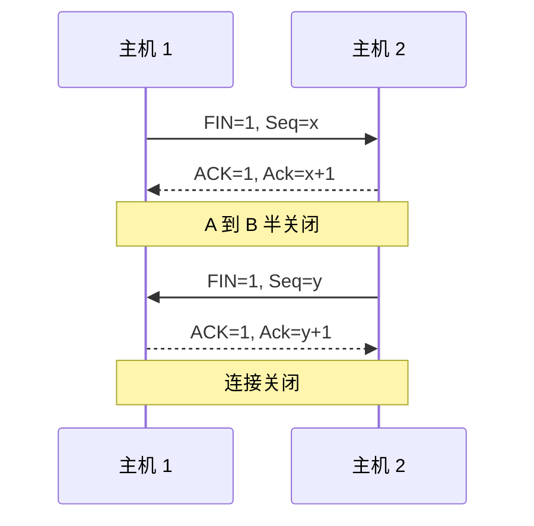

### 3. 状态转移

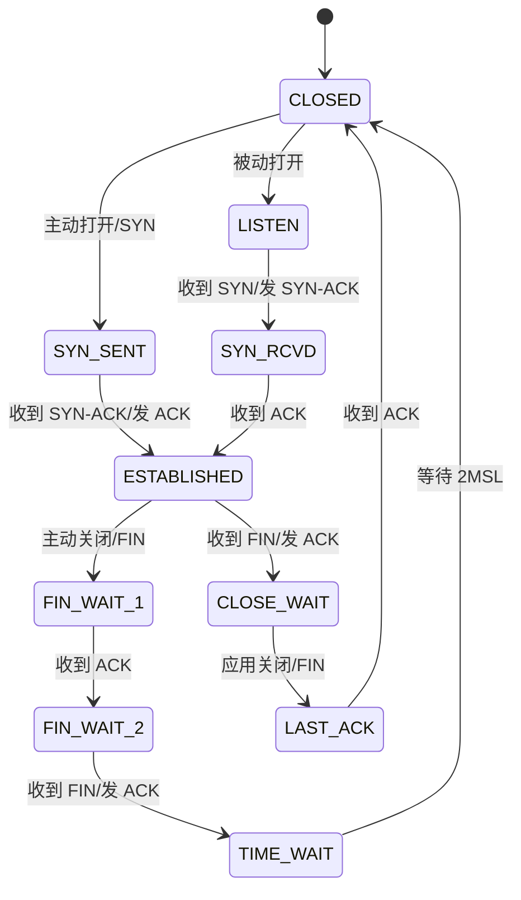

MSL 是最大报文段生存期；TIME-WAIT 用于让旧报文消失并支持最后 ACK 重发。

---

## 七、TCP 可靠传输与流量控制

### 1. 累积确认、RTT 与 RTO

TCP 采用字节序号和累积 ACK，一个 ACK 可确认此前连续收到的多段。优先捎带确认；无反向数据时，约 500 ms 的 ACK 定时器到期后发送纯 ACK。

$$
\operatorname{EstimatedRTT}
=\alpha\operatorname{EstimatedRTT}_{old}
+(1-\alpha)\operatorname{SampleRTT}
$$

$$
\begin{aligned}
\operatorname{Difference}&=|\operatorname{SampleRTT}-\operatorname{EstimatedRTT}|,\\
\operatorname{Deviation}&=\alpha\operatorname{Deviation}_{old}+(1-\alpha)\operatorname{Difference},\\
RTO&=\operatorname{EstimatedRTT}+4\operatorname{Deviation}.
\end{aligned}
$$

### 2. 流量控制

> 接收方用接收窗口 rwnd 通告剩余缓存，发送方未确认数据不得超过它。

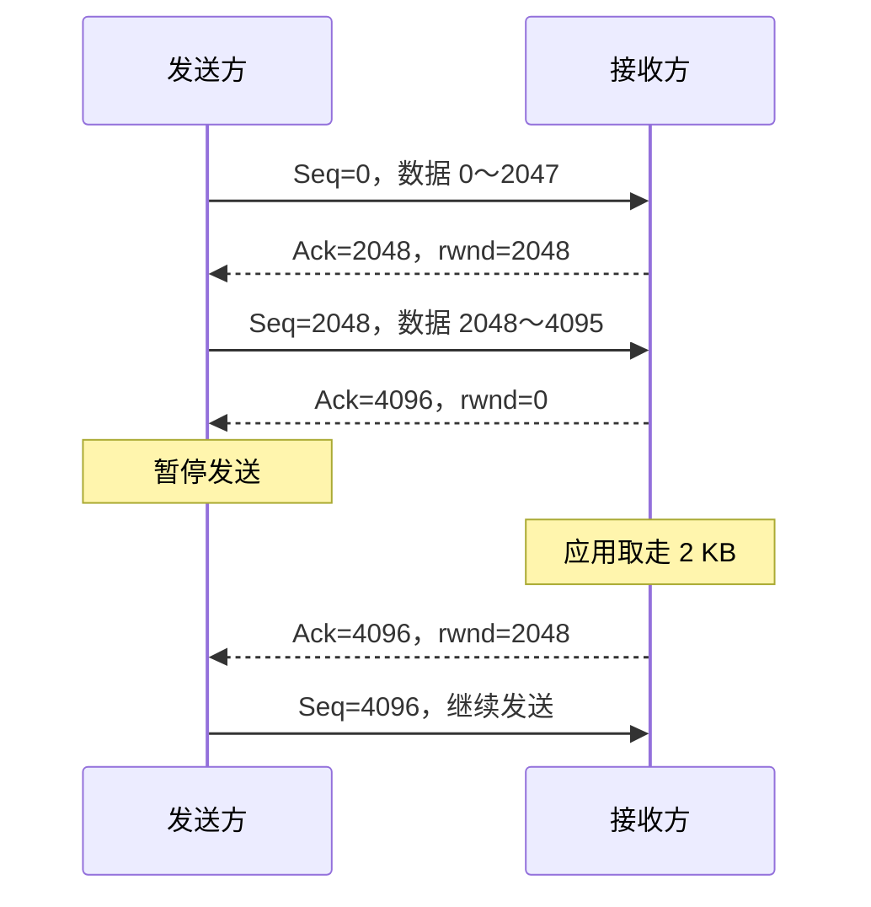

$$
\operatorname{LastByteSent}-\operatorname{LastByteAcked}\le rwnd
$$

### 3. 传输效率

MSS 是报文段最大数据长度，建立连接时协商；以太网常见 1460 B。小数据频繁发送效率低。Nagle：若数据至少为 MSS 且窗口允许则发一 MSS；有未确认数据时缓存小数据；否则立即发送。Clark：只有可用缓存达到较大值（课件取至少 $\frac12 MSS$）才通告窗口更新，避免傻瓜窗口。

---

## 八、拥塞与 TCP 拥塞控制

### 1. 概念与窗口

> 注入负载超过网络承载能力时发生拥塞，表现为排队时延上升、缓存溢出丢包和高负载下吞吐下降；盲目重传会恶化拥塞。

| 比较 | 流量控制 | 拥塞控制 |
|---|---|---|
| 范围 | 发送方与接收方 | 全网主机与路由器 |
| 目标 | 防止接收缓存溢出 | 避免网络过载 |
| 约束 | $rwnd$ | $cwnd$ |

开环方法包括合理 RTO、选择重传、捎带/累积 ACK、按应用适量丢弃和接纳控制。闭环方法由端系统根据丢包/时延推断，或由路由器显式通知。

$$
W=\min(rwnd,cwnd)
$$

$$
\operatorname{LastByteSent}-\operatorname{LastByteAcked}\le cwnd,\qquad
\text{速率}\approx\frac{cwnd}{RTT}
$$

### 2. 慢启动与 AIMD

连接初始 $cwnd=1\,MSS$。每收到 ACK，$cwnd$ 加 1 MSS，所以每轮 RTT 约翻倍，直到达到 $ssthresh$ 或丢包。达到阈值后按加法增长：

$$
cwnd\leftarrow cwnd+\frac{1}{cwnd}
$$

每轮约增加 1 MSS。检测丢包时：

1. 超时：  
   $ssthresh\leftarrow cwnd/2$，$cwnd\leftarrow1$，重新慢启动。
2. 3 个重复 ACK：  
   $ssthresh\leftarrow cwnd/2$，$cwnd\leftarrow ssthresh$，快速重传并恢复。

**例**：MSS=1000 B、RTT=200 ms，初始近似速率为 5000 B/s。

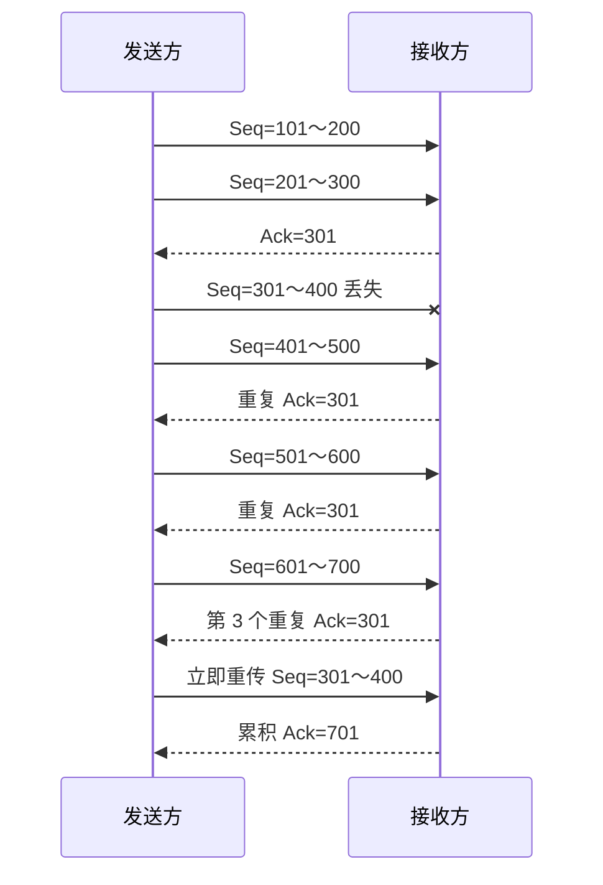

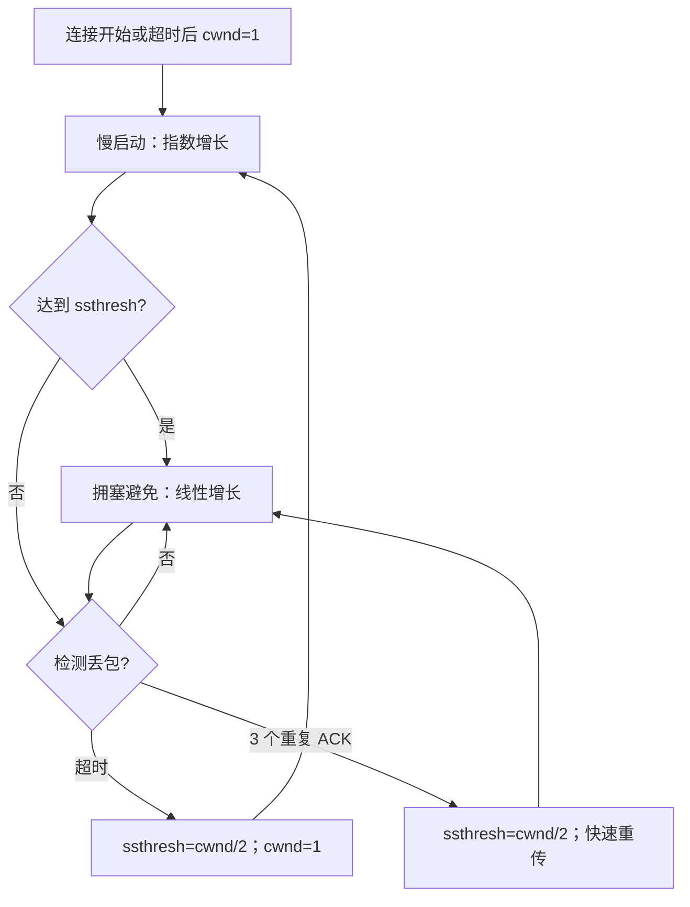

三个重复 ACK 表明网络仍在转发，故反应比超时温和。

---

## 九、运输层安全

### 1. 典型攻击

| 攻击 | 原理 | 后果 |
|---|---|---|
| 端口扫描 | 全连接、SYN 半开、FIN 或代理扫描活动端口 | 暴露服务面 |
| 序号预测 | 地址欺骗、RTT 测量和 ISN 预测 | 冒充受信任主机 |
| SYN 洪泛 | 大量 SYN 占用半连接 | 耗尽 CPU、内存、带宽 |
| 会话劫持 | 嗅探、欺骗、中间人修改数据 | 窃听、复制或篡改 |
| LAND | 源 IP/端口伪造成目标自身 | 空连接与拒绝服务 |
| UDP 洪泛 | 向大量 UDP 端口高速发包 | 耗尽处理资源 |

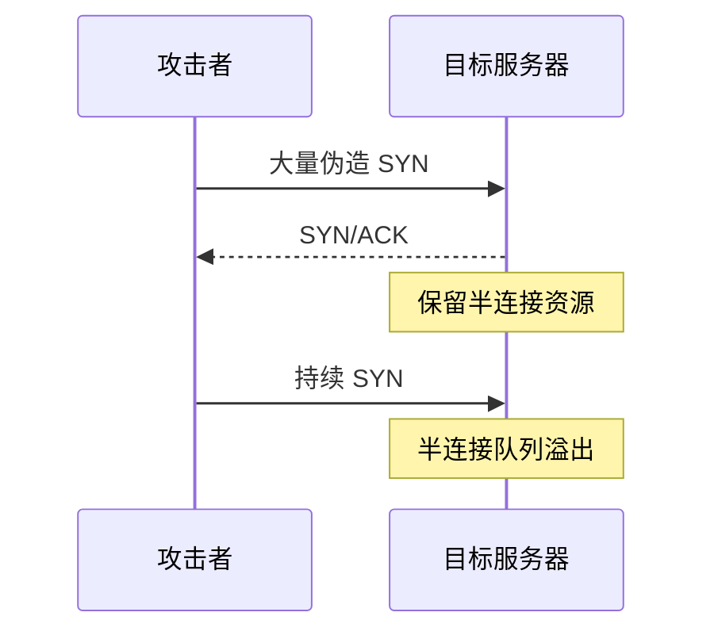

---

## 十、课件勘误

整理时已采用课件末尾更正：发送方应为“发送进程”；“校验和方法”应为“16 位校验和”；UDP 校验覆盖伪首部及整个 UDP 数据报；图中文字 SIN 应为 FIN；三次握手图的连接确认/响应标注修正；“依赖程序”改为“依赖程度”；“捎带应答”改为“捎带确认”；窗口示例 $2^3=4$ 改为 $2^2=4$。个别被 OCR 破坏的数值未用于推演新结论。

---

## 十一、图片审计

> [!important] 逐图核查结论
> OCR 文稿含 70 个图片引用，以下编号与出现顺序一一对应。结构与时序已用 Mermaid 重构，首部/字段用管道表格重建，曲线和复杂例图已文字化，装饰图也已判定。

| 编号 | 核查结果 |
|---:|---|
| 001 | 访问北邮主页路径，转写为应用需求与运输路径 |
| 002 | 绿色箭头，装饰图 |
| 003 | 绿色箭头，装饰图 |
| 004 | TCP/IP 栈及应用到 TCP/UDP/IP 映射，已文字化 |
| 005 | 应用进程跨网络通信，已重构进程到进程图 |
| 006 | 下层服务决定运输层复杂度，已文字化 |
| 007 | 端口定位进程、IP 定位主机，已纳入复用图 |
| 008 | 节点/主机/进程交付范围，已文字化 |
| 009 | TELNET/HTTP 端口示例，已入表 |
| 010 | TCP 四元组分用 HTTP，已文字化 |
| 011 | 红色菱形，装饰图 |
| 012 | 红色菱形，装饰图 |
| 013 | 信封，装饰图 |
| 014 | 连续发送时序，已入 RDT/流水线 |
| 015 | 无差错连续传输，已文字化 |
| 016 | 丢失与差错对比，已入可靠性定义 |
| 017 | ACK/NAK 操作，已重构时序 |
| 018 | 丢包后超时重发，已入停等 |
| 019 | ACK 丢失导致重复，已说明 |
| 020 | 延迟 ACK 误判，已说明 |
| 021 | 累积 ACK 丢失与重复判定，已说明 |
| 022 | ACK 序号不符触发重传，已说明 |
| 023 | 1 位序号停等综合示例，已重构流程 |
| 024 | 发送、传播、ACK 时延，已公式化 |
| 025 | 不同 $a$ 的停等占用，已公式化 |
| 026 | 长距离停等，已入卫星例题 |
| 027 | 长距离流水线，已重构时序 |
| 028 | 包与 ACK 交错，已重构时序 |
| 029 | GBN 双窗口，已重建约束 |
| 030 | GBN 回退重传，已重构时序 |
| 031 | 接收窗口为 1，已文字化 |
| 032 | SR 双窗口，已重建公式 |
| 033 | SR 补发缺失包，已文字化 |
| 034 | UDP 封装入 IP，已重构 |
| 035 | 反码加法进位，已说明 |
| 036 | UDP 伪首部与首部，已入表 |
| 037 | UDP 校验字段分组例，已说明 |
| 038 | 二进制反码求和例，已说明 |
| 039 | TCP 两端缓存，已文字化 |
| 040 | TCP 字节流管道，已文字化 |
| 041 | 不保留消息边界，已说明 |
| 042 | TCP 首部字段，已入表 |
| 043 | TELNET Seq/Ack 示例，已保留 |
| 044 | 六个控制位，已入表 |
| 045 | 两次握手旧请求风险，已说明 |
| 046 | 三次握手，已重构时序 |
| 047 | RST 拒绝旧 SYN，已说明 |
| 048 | 四步释放，已重构时序 |
| 049 | TCP 状态图，已重构状态图 |
| 050 | 累积 ACK，已文字化 |
| 051 | 双向捎带确认，已文字化 |
| 052 | 单峰 RTT，已说明 |
| 053 | 宽峰 RTT，已说明 |
| 054 | 实测与平滑 RTT，已公式化 |
| 055 | 收发窗口变量，已公式化 |
| 056 | rwnd 从 2 KB 到 0 再恢复，已重构 |
| 057 | Clark 算法流程，已文字化 |
| 058 | 负载—时延曲线，已说明 |
| 059 | 负载—吞吐曲线，已说明 |
| 060 | 水龙头/漏斗拥塞类比，已文字化 |
| 061 | cwnd 限制未确认字节，已公式化 |
| 062 | 慢启动 1/2/4/8 增长，已说明 |
| 063 | 拥塞避免逐轮加一，已公式化 |
| 064 | AIMD 锯齿与两类丢包，已重构流程 |
| 065 | 三重复 ACK 快速重传，已重构时序 |
| 066 | Tahoe/Reno 窗口差异，已文字化 |
| 067 | 慢启动/避免/恢复状态，已重构 |
| 068 | 序号预测攻击，已文字化 |
| 069 | SYN 洪泛半连接溢出，已重构 |
| 070 | 会话劫持中间人，已文字化 |

---

## 本章小结

| 主题 | 核心结论 |
|---|---|
| 定位 | 端系统实现进程到进程通信，端口完成复用分用 |
| 可靠传输 | 校验、序号、确认、定时器和窗口共同解决差错、丢失、重复与失序 |
| UDP | 无连接、面向报文、8 字节首部，低开销但无可靠保证 |
| TCP | 面向连接、可靠字节流，三次握手、四步释放 |
| 流量控制 | 接收窗口保护缓存，Nagle 与 Clark 改善低效 |
| 拥塞控制 | 发送窗口取 $\min(rwnd,cwnd)$，慢启动、AIMD 和快速重传动态调速 |
| 安全 | 扫描、序号预测、洪泛、LAND 与劫持利用状态或资源缺陷 |

## 课后思考

1. 为什么 Go-Back-N 的最大发送窗口是 $2^n-1$，选择重传常取 $W_S=W_R=2^{n-1}$？
2. 画出数据包丢失、ACK 丢失和 ACK 延迟时停等协议的时序。
3. 已知带宽、距离、传播速度、包长和窗口，计算停等与流水线利用率。
4. 比较 $rwnd$、$cwnd$、$ssthresh$、MSS、RTT 与 RTO。
5. 为什么三个重复 ACK 与超时触发不同强度的拥塞响应？

