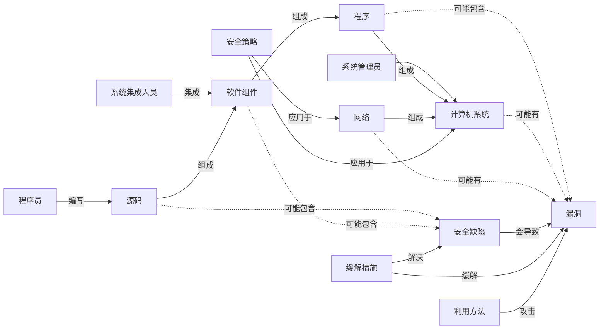
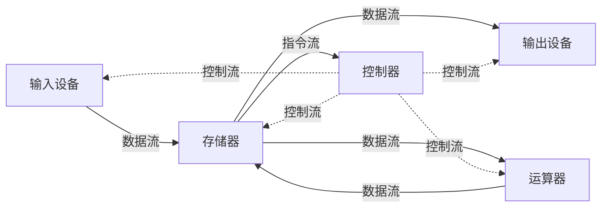
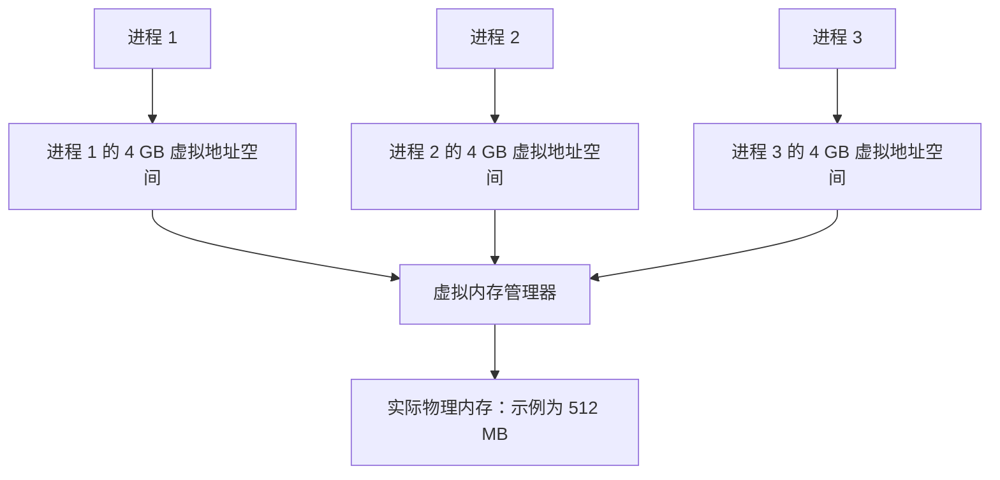

> 本笔记依据第 1 章课件及其 PaddleOCR 原始稿整理，覆盖课程说明、软件安全基本概念、漏洞与风险、Win32 内存基础、PE 文件、系统栈和缓冲区溢出。课件中的图表与结构图已转写为文字、表格或 Mermaid；与知识无关的个人联系方式和示例个人信息已脱敏。

> [!warning] 版本标识待核验
> 文件名与页脚日期指向“2026 秋”和 2026-09-14，但课件页眉仍写有“2025, Fall”。本笔记不据此判断实际开课学期，具体以课程平台通知为准。

# 主要内容

- 课程目标、教学内容、实验与考核要求
- 软件、软件安全及网络空间安全的基本概念
- 软件缺陷、威胁、风险、漏洞及软件安全知识体系
- 典型漏洞、漏洞危害、成因与 Gary McGraw 软件风险分类
- 计算机引导、Win32 存储体系与虚拟内存
- PE 文件结构及其与虚拟内存的映射
- 进程空间、系统栈、函数调用与相关寄存器
- 缓冲区溢出的原理、历史、影响与预防

---

# 一、课程说明

## 1. 教材与学习资源

- 《C 和 C++ 安全编码》（第 2 版，机械工业出版社；英文名 *Secure Coding in C and C++, Second Edition*）：面向 C/C++ 安全编程，讨论常见编码缺陷、漏洞成因、利用方式、检测方法和防护思路，并配有练习与案例。
- 《0day 安全：软件漏洞分析技术》（王清，电子工业出版社）。
- 其他网络资源。

> [!note] 隐私处理
> 原课件含授课教师姓名、邮箱、电话以及建立即时通讯群等信息。除教材署名外，这些个人信息与知识内容无关，未写入正式笔记。

## 2. 课程目标

1. 介绍软件安全概念，普及软件安全意识。
2. 认识软件开发与使用过程中存在的风险。
3. 理解 C/C++ 安全编码缺陷的根源与防范措施，形成初步的软件安全风险识别能力。
4. 初步了解鸿蒙移动应用相关内容。
5. 通过实验强化动手能力，掌握初步的软件攻防能力。

## 3. 理论课与实验课

**理论课主题**：

1. 软件安全概述（含课程介绍）。
2. 字符串安全。
3. 指针安全。
4. 动态内存管理安全。
5. 整数安全。
6. 格式化输出。
7. 多线程安全。
8. 文件 I/O 安全。

理论课安排学生同步演示，把教材代码串联起来进行讲解，作为选做加分项。课件预计安排 8 次学生演示，每次 1 人；演示加分上限为平时成绩 10 分，实际安排以课程通知为准。

**实验课目的**：掌握初步的软件攻防能力并提高动手能力。原计划共 8 次实验，预计选取其中 5～6 次作为必做内容：

1. 缓冲区溢出。
2. 栈溢出。
3. 代码注入。
4. 漏洞挖掘与模糊测试。
5. 虚函数攻击。
6. SEH 攻击。
7. 格式化输出。
8. SQL 注入。

## 4. 考核、作业与提交

| 部分 | 要求 |
|---|---|
| 平时 | 课堂作业、课堂表现、讨论记录与可能的点名；开源贡献为必做；课堂演示为选做加分项 |
| 实验 | 8 次实验中预计选择 5～6 次作为必做内容 |
| 期末 | 期末试卷主要对应理论课，但也可能联系实验内容 |

平时必做部分包括课堂表现和课堂作业。纸质课堂作业一般使用一张数学作业纸并当堂提交；其他作业采用电子版，必须在约定时间内提交，延迟可能按未提交处理。

开源贡献作为一次平时作业，包括两个必做部分，占比由后续安排确定：

1. 参与一项 OpenHarmony 开源贡献。
2. 参与一项 openKylin 开源贡献。

除单个文档外，电子作业需要打包为 ZIP 或 RAR。文件名依次包含作业类别、编号、班级、学号、姓名和提交时间。脱敏后的格式为：

```text
实验或开源-01-<三位班级号>-<学号>-<姓名>-<YYYYMMDD>.zip
```

> [!note] 来源未展开内容
> 课程目录还列出了“资讯范例”，但本次课件没有给出可独立整理的正文。

---

# 二、软件与软件安全

## 1. 软件的定义与分类

> **软件**：一系列按照特定顺序组织的计算机数据和指令的集合。

| 类别 | 作用 | 课件示例 |
|---|---|---|
| 系统软件 | 为计算机的使用提供最基本的功能 | 操作系统等 |
| 应用软件 | 为某种特定用途而开发 | Microsoft Office、数据库管理系统 |
| 支撑软件 | 协助用户开发软件的工具性软件 | Java 开发中的 JDK 套件 |

> **软件安全**：采用工程方法，使软件在敌对攻击的情况下仍能继续正常工作。

软件安全威胁主要来自两方面：

1. **软件自身**：漏洞和缺陷可能被不法分子利用。
2. **外部环境**：攻击者编写恶意代码，并诱导用户安装、运行。

## 2. 软件生命周期中的安全威胁

| 阶段 | 主要威胁 | 课件示例 |
|---|---|---|
| 代码编写 | 敏感信息暴露等 | 将应用敏感信息不加密地写入发布版本中容易被读取的文件 |
| 编译 | 编译产物或编译方式固有的风险 | Android 应用生成的 smali 文件存在被注入代码的风险 |
| 签名与发布 | 签名绕过等 | 旧版 Android 签名方式未校验所有软件文件，攻击者可能修改未被校验的文件并注入恶意 DEX |

## 3. 威胁数据与发展趋势

### （1）通用软硬件漏洞

2020 年，国家信息安全漏洞共享平台（CNVD）共收录通用软硬件漏洞 **20,721 个**，较 2019 年增长 **28.2%**。课件中的 2017—2020 年折线图还表明：收录漏洞数量在 2018 年下降，随后连续上升；高危漏洞数量的变化方向大体相同，并在 2020 年明显上升。

> [!warning] 图表精确值待核验
> 该图只在正文标出了 2020 年总量与同比增幅，其他年度及高危漏洞折线没有数据标签，因此不从坐标位置猜测精确值。

### （2）境内感染网络病毒的终端数

| 年份 | 终端数（万个） |
|---:|---:|
| 2017 | 2065 |
| 2018 | 944 |
| 2019 | 1255 |
| 2020 | 1554 |

这里的“网络病毒”包括木马或僵尸恶意程序。数据表现为 2018 年大幅下降，随后连续回升。

### （3）勒索软件目标变化

课件用天平示意勒索软件的目标重心发生变化：早期个人终端承受的勒索软件压力更大，之后风险逐渐延伸并偏向企业用户。图中左侧由“个人终端设备”承担三个勒索软件块、企业用户承担一个；变化后则相反。

### （4）移动互联网恶意程序

互联网恶意程序下载链接接近 **67 万条**，较 2015 年增长近 **1.2 倍**；涉及传播源域名 **22 万余个**、IP 地址 **3 万余个**，恶意程序传播次数达到 **1.24 亿次**。

| 年份 | 移动互联网恶意程序数量（个） |
|---:|---:|
| 2005 | 52 |
| 2006 | 67 |
| 2007 | 110 |
| 2008 | 208 |
| 2009 | 416 |
| 2010 | 1664 |
| 2011 | 6249 |
| 2012 | 162981 |
| 2013 | 702861 |
| 2014 | 951059 |
| 2015 | 1477450 |
| 2016 | 2053501 |

来源标注为 CNCERT/CC。趋势在 2012 年以后明显加速。

### （5）数据泄露与物联网威胁

- 美国大选候选人邮件泄露事件对选举进程产生了直接影响。
- 2016 年，我国免疫规划系统网络被恶意入侵，20 万儿童信息被窃取并在网上公开售卖。
- 对 Mirai 僵尸网络的抽样监测显示：截至 2016 年年底，共发现 **2526 台控制服务器**控制 **125.4 万余台物联网智能设备**。

## 4. 软件的核心地位

- 软件是 IT 的灵魂。
- 硬件发展逐渐定型，硬件技术呈软件化趋势。
- 业务的多样性由软件类别和功能的多样性支撑。
- 网络融合依赖系统软件支撑，例如智能电视等。
- 软件技术、开发者与用户的关系、开发与维护模式均发生了深刻变化。
- 应用软件的盈利模式也在变化，出现“应用软件媒体化”的趋势。

---

# 三、网络空间安全与软件安全体系

## 1. 网络空间安全

> **网络空间安全**：研究信息获取、存储、传输和处理领域中信息安全保障问题的一门新兴学科。它围绕网络空间中的电磁设备、电子信息系统、网络、运行数据和系统应用所面临的安全问题，开展理论、方法、技术、系统、应用、管理和法制等方面的研究。

### （1）安全属性

| 属性 | 含义 |
|---|---|
| 保密性 | 信息不泄漏给非授权用户、实体或过程 |
| 完整性 | 数据未经授权不能改变；信息在存储或传输中不被修改、破坏或丢失 |
| 可用性 | 被授权实体在需要时能够访问并按需使用信息 |
| 真实性 | 信息内容真实 |
| 可核查性 | 对信息传播及内容具有控制与核查能力；课件同时将访问控制联系到可控性 |
| 可靠性 | 系统能够可靠运行 |

### （2）研究范围

| 范围 | 关注点 |
|---|---|
| 网络安全 | 网络边界、网络协议等 |
| 系统安全 | 信息系统软硬件安全，包括操作系统、数据库、应用软件等软件安全问题 |
| 内容安全 | 也称信息安全、数据安全，关注数据自身保护、保密性与内容合法性等 |
| 信息对抗 | 削弱或破坏对方电子信息设备和信息的使用效能，同时保障己方设备与信息正常发挥效能的综合技术措施 |

### （3）安全问题产生的原因

1. **信息系统的复杂性**：系统软硬件和网络协议都可能存在缺陷。
2. **信息系统的开放性**：
   - 系统开放：计算机与通信系统按行业标准规定的接口建立。
   - 标准开放：网络各层协议公开，标准制定过程也开放。
   - 业务开放：用户可以按需开发新业务。
3. **人的因素**：开发、配置、使用和管理行为都会影响安全。

### （4）网络空间安全的特点

- **攻防性**：攻防技术交替改进。
- **配角性**：安全是一种属性，不能脱离系统、应用或业务而独立存在。
- **相对性**：安全程度相对于特定主体和需求而言。
- **安全业务的本质**：责任分解。
- **技术与管理并重**：课件概括为“三分技术，七分管理”。

## 2. 软件缺陷、威胁与风险

软件安全关注计算机程序以及程序所含信息的完整性、机密性和可用性。

> **软件安全缺陷**：软件自身存在的问题，可能由设计者的故意行为或过失导致。漏洞是其基本形态，恶意代码可视为延伸形态；缺陷客观存在于软件内部。

> **软件安全威胁**：过去曾经、当前正在或未来可能成为攻击来源的外部个人、团体、组织或势力，例如黑客、内部人员、罪犯、竞争情报从业者、恐怖分子和信息战人员。威胁是软件外部的主观存在。

> **软件安全风险**：内在缺陷暴露于外在威胁之下的状态。内在缺陷遭遇外在威胁后，可能形成安全事件。



图中的相关角色还包括网络管理员、安全分析员、安全研究员、漏洞分析员和攻击者。安全人员寻找缺陷与漏洞并提出缓解措施；攻击者则尝试利用漏洞。

## 3. 软件安全的范围

软件安全可从三个维度理解：

| 维度 | 内容 |
|---|---|
| 软件安全功能 | 防反汇编/反编译、防调试跟踪、防篡改、防盗版、防内存攻击、防 API 违规调用、防拒绝服务、可追踪 |
| 软件生命周期 | 安全活动贯穿软件生命周期，而非只发生在发布后 |
| 软件环境要素 | 软件运行环境、软件开发环境、软件开发者、软件自身 |

## 4. 软件安全知识体系

### （1）软件漏洞

- 漏洞原理与案例。
- 漏洞挖掘与利用。
- 漏洞检测与防范，其中安全编码是重要手段。

### （2）恶意代码

- **机理**：传统病毒、宏病毒、木马、蠕虫等。
- **检测与处置**：检测、消除、预防、免疫、数据备份与恢复、防范策略等。

### （3）软件分析与保护

| 方向 | 方法 |
|---|---|
| 静态分析 | 控制流分析、数据流分析、数据依赖分析、别名分析、切片、抽象解析 |
| 动态分析 | 调试、剖分、跟踪（Trace）、代码注入、Hook、沙箱技术、反反调试 |
| 防逆向分析 | 代码混淆、软件水印、原生代码保护、资源保护、加壳、资源及代码加密 |
| 防动态调试 | 函数检测、数据检测、符号检测、窗口检测、特征码检测、行为检测、断点检测、功能破坏、行为占用、运行环境检测、反沙箱 |
| 数据校验 | 文件校验、内存校验 |
| 代码混淆 | 静态混淆、动态混淆 |
| 软件水印 | 静态水印、动态水印 |

---

# 四、漏洞、危害与软件风险

## 1. 典型软件漏洞

### （1）缓冲区溢出

缓冲区溢出是典型漏洞之一，其原理与防护见[[#十、缓冲区溢出]]。

### （2）W32.Blaster.Worm

- 2003 年 8 月 11 日爆发。
- 可以在没有用户参与的情况下感染连接到互联网且未打补丁的计算机。
- 至少 800 万个 Windows 系统受到感染，课件引用标记为 `[Lemos 04]`。
- 经济损失超过 5 亿美元。
- 蠕虫会检查计算机是否已感染，把 `windows auto update = msblast.exe` 写入注册表启动项 `HKEY_LOCAL_MACHINE\SOFTWARE\Microsoft\Windows\CurrentVersion\Run`，使其随 Windows 启动；随后产生随机 IP 地址并尝试感染相应主机。
- 它利用 Windows 2000 或 Windows XP 的 DCOM RPC 漏洞，通过 TCP 135 端口发送数据。

课件展示了与漏洞相关的代码片段，核心问题位于对机器名的复制过程中：

```c
HRESULT GetMachineName(
    WCHAR *pwszPath,
    WCHAR wszMachineName[MAX_COMPUTERNAME_LENGTH_FQDN + 1])
{
    LPWSTR pwszServerName = wszMachineName;
    LPWSTR pwszTemp = pwszPath + 2;
    while (*pwszTemp != L'\\')
        *pwszServerName++ = *pwszTemp++;
    /* 原课件片段在此省略了其余代码 */
}
```

> [!warning] 代码完整性
> 原课件只给出函数片段，没有展示完整边界检查、终止符处理和调用上下文，因此这里只按可见内容转写，不补造缺失代码。

### （3）SQL 注入

课件用字符串拼接构造查询说明 SQL 注入。原始查询模板为：

```sql
SELECT * FROM user WHERE username="" AND password="";
```

如果输入中包含恒真条件 `' OR '1'='1`，拼接后的查询逻辑可能被改变，从而绕过原有的账号与密码判断。课件给出的简化结果可整理为：

```sql
SELECT * FROM user
WHERE username="" OR '1'='1'
  AND password="" OR '1'='1';
```

## 2. 软件漏洞的危害

| 危害 | 说明与示例 |
|---|---|
| 无法正常使用 | Windows 98 曾出现处理过多 Ping 数据包时蓝屏的拒绝服务问题 |
| 引发恶性事件 | 航天器导航控制软件若错误计算轨道，可能威胁人员生命；情报系统漏洞可能造成国家机密泄露 |
| 关键数据丢失 | 软件误删系统关键文件可能导致系统无法启动和数据丢失；漏洞也可能被利用来删除或清除用户数据 |
| 秘密信息泄露 | 个人、单位、政府部门的敏感信息可能被未授权获取，影响国家安全或企业核心利益 |
| 被安装木马或病毒 | 即使装有杀毒软件和防火墙，存在漏洞的软件仍可能被攻击者利用来安装恶意程序 |

## 3. 软件漏洞出现的原因

1. **小作坊式开发**：未按软件工程要求设计与开发，直接开发或边设计边开发，容易积累漏洞。
2. **赶进度**：即使大型团队采用软件工程方法，也可能因时间紧、任务重而投机取巧或省略步骤；疲劳和进度压力会把不安全因素带入软件。
3. **轻视安全测试**：代码和成品安全测试都会增加成本，一些开发者因此不做或只做最低程度的测试，只验证基本功能，漏洞仍隐藏在内部。
4. **安全意识淡薄**：开发者安全经验不同；缺少基本安全编程经验会把常见漏洞引入软件。
5. **维护不完善**：发现漏洞后应分析原因并提供补丁；若开发者知情不修复或隐瞒，用户会长期暴露于风险之中。

## 4. Gary McGraw 软件风险分类

课件将软件安全风险分为八类：输入验证与表示、API 误用、安全特征、时间与状态、错误处理、代码质量、封装和环境。

### （1）输入验证与表示

输入验证与表示问题通常由特殊字符、编码和数字表示引起，其根源是对输入过度信任。

| 问题 | 风险 |
|---|---|
| 缓冲区溢出（Buffer Overflow） | 对已分配内存之外的位置写入会覆盖数据，导致程序崩溃，甚至执行恶意代码 |
| 命令注入（Command Injection） | 未指定完整路径执行命令时，攻击者可能通过改变 `PATH` 等环境变量执行恶意代码 |
| 跨站脚本（Cross-Site Scripting） | 向浏览器发送非法数据可能导致浏览器执行恶意代码；通过 XML 编码进行身份认证也可能触发非法代码执行 |
| 格式化字符串（Format String） | 攻击者控制函数的格式化字符串时可能引起缓冲区溢出 |
| HTTP 应答截断（HTTP Response Splitting） | HTTP 响应头包含未经验证的数据，可能导致缓存中毒、跨站脚本、跨用户攻击或页面劫持 |
| 非法指针值（Illegal Pointer Value） | 函数返回指向缓冲区外的指针，后续操作可能造成缓冲区溢出 |
| 整数溢出（Integer Overflow） | 未考虑整数溢出会造成逻辑错误或缓冲区溢出 |
| 日志伪造（Log Forging） | 把未验证数据写入日志会让攻击者伪造日志或注入恶意内容 |
| 目录遍历（Path Traversal） | 允许输入控制文件系统路径，会让攻击者访问或修改受保护资源 |
| 进程控制（Process Control） | 从不可信来源或环境装载库，可能执行攻击者的恶意代码 |
| 资源注入（Resource Injection） | 允许用户输入控制资源 ID，可能让攻击者访问或修改受保护资源 |
| 配置操纵（Setting Manipulation） | 允许外部控制系统设置，可能导致服务崩溃或应用执行非法操作 |
| SQL 注入（SQL Injection） | 使用用户输入构造动态 SQL 请求，可能让攻击者改变 SQL 语义并执行任意 SQL 指令 |
| 字符串终止错误（String Termination Error） | 依赖字符串终止符可能造成缓冲区溢出 |
| 未检查返回值（Unchecked Return Value） | 不检查方法返回值，程序可能进入不可预料的状态 |

### （2）API 误用

API 是调用者与被调用者之间的约定。多数 API 误用源于调用者没有理解约定的目的。例如，程序调用 `chroot()` 后若 `chdir()` 失败，就可能违背安全模式下改变动态根目录的约定。

| 问题 | 风险 |
|---|---|
| 危险函数（Dangerous Function） | 不能被安全使用的函数不应使用 |
| 目录限制（Directory Restriction） | 不合理地使用 `chroot()` 可能让攻击者逃脱目录限制 |
| 堆检查（Heap Inspection） | 密码等敏感信息未及时从内存移除可能被利用；不应使用 `realloc()` 重新分配含敏感信息的缓冲区 |
| 认证误用（Often Misused: Authentication） | 攻击者可能伪造 DNS 发起攻击 |
| 异常处理误用（Often Misused: Exception Handling） | `_alloca()` 可能抛出栈溢出异常并导致程序异常终止 |
| 路径操纵误用（Often Misused: Path Manipulation） | 给路径操纵函数传入过小的输出缓冲区可能导致缓冲区溢出 |
| 权限管理误用（Often Misused: Privilege Management） | 未坚持最小权限原则会增大其他弱点被利用的风险 |
| 字符串操纵误用（Often Misused: String Manipulation） | 多字节与 Unicode 字符串转换时容易发生缓冲区溢出 |
| 未检查返回值（Unchecked Return Value） | 忽略方法返回值会导致程序出现意外状态 |

### （3）安全特征

安全特征主要涉及认证、访问控制、机密性、密码和权限管理。

| 问题 | 风险 |
|---|---|
| 不安全随机数（Insecure Randomness） | 标准伪随机数生成器不能抵抗密码分析攻击 |
| 最小权限违规（Least Privilege Violation） | 程序只应在需要时提升权限，不再需要时应立即降到最低 |
| 缺少访问控制（Missing Access Control） | 程序没有在所有可能的执行路径上进行访问控制检查 |
| 口令管理（Password Management） | 明文存储密码、允许空口令或在 HTTP 重定向报文中发送密码都会造成风险 |
| 隐私违规（Privacy Violation） | 不恰当地处理私有信息会给用户带来损害 |

### （4）时间与状态

分布式计算依赖时间与共享状态。程序员设想的顺序执行模式与多任务、多核、多 CPU 或分布式系统中的实际并发行为可能不一致，从而产生线程、进程、时间和信息之间的非法交互。共享状态包括信号量、变量、文件系统以及任何能存储信息的对象。

| 问题 | 风险 |
|---|---|
| 死锁（Deadlock） | 不一致的程序加锁顺序会导致死锁 |
| 固定会话（Session Fixation） | 认证后继续使用同一会话，可能让攻击者劫持已认证会话 |
| 文件访问竞争条件（TOCTOU） | 文件属性检查与文件实际使用之间的时间差可能被用于提升文件访问权限 |
| 不安全临时文件（Insecure Temporary File） | 创建和使用临时文件可能让应用程序与系统遭受攻击 |

### （5）错误处理

错误处理本身可视为一类 API。相关漏洞通常由两种方式造成：一是忘记处理错误或只做简单处理而未彻底解决；二是向潜在攻击者泄露过多信息，或处理范围太广而无人愿意负责。

| 问题 | 风险 |
|---|---|
| 捕获空指针异常（Catch NullPointerException） | 捕获异常不能替代对空指针产生原因的预防 |
| 空捕获块（Empty Catch Block） | 忽略异常与其他错误可能导致攻击者触发意外行为 |
| 过度捕获异常（Overly Broad Catch Block） | 捕获范围过大使错误处理代码复杂，更容易携带安全弱点 |

### （6）代码质量

低劣的代码质量会造成不可预测行为。对用户表现为低可用性，对攻击者则可能形成意外的攻击面。

| 问题 | 风险 |
|---|---|
| 双重释放（Double Free） | 对同一内存地址两次调用 `free()` 会导致缓冲区溢出（课件表述） |
| 内存泄漏（Memory Leak） | 分配内存后不释放会导致资源枯竭 |
| 空指针解引用（Null Dereference） | 使用空指针引用会抛出 `NullPointerException`（课件表述） |
| 已废弃功能（Obsolete） | 应尽量避免使用已经废弃的函数或接口 |
| 未定义行为（Undefined Behavior） | 函数行为未定义，直到控制参数被设置为特定值 |
| 未初始化变量（Uninitialized Variable） | 程序可能在变量初始化前使用它 |
| 未释放资源（Unreleased Resource） | 程序未能释放系统资源 |
| 释放后使用（Use After Free） | 内存释放后继续访问，可能导致崩溃或更严重的安全后果 |

### （7）封装

封装用于划定强边界。在 Web 浏览器中，代码模块不应被其他模块滥用；在服务端，需要区分已校验与未校验的数据、不同用户的数据，以及用户可见与不可见的数据。

| 问题 | 风险 |
|---|---|
| 通过名字比较类 | 可能把两个不同的类误判为相同 |
| 用户间数据泄露 | 不同会话访问同一对象变量时，数据可能泄露，例如 Servlet 或共享池中的对象 |
| 残留调试代码 | Debug 代码可能无意中在应用内留下入口点 |
| 系统信息泄露 | 系统数据与调试信息泄露会给攻击者提供机会 |
| 信任边界违规 | 把可信与不可信数据混在同一结构中，可能让开发者错误地信任未验证数据 |

### （8）环境

环境位于源代码之外，但仍直接影响产品安全。典型风险包括：

- 不安全的编译器优化（Insecure Compiler Optimization）。
- 不安全的传输（J2EE Misconfiguration: Insecure Transport）。
- 弱访问许可（J2EE Misconfiguration: Weak Access Permissions）。
- 配置文件中的密码（Password Management: Password in Configuration File）。

---

# 五、计算机引导

## 1. 冯·诺依曼体系

冯·诺依曼体系包含输入设备、输出设备、存储器、运算器和控制器。运算器与控制器组成 CPU；系统中同时存在数据流、指令流和控制流。



## 2. BIOS 启动程序

1. **处理器复位**：打开电源后，处理器进入 Reset 状态。内存被清零并执行内存同位测试；段寄存器 `CS` 设为 `FFFFH`，其他寄存器清零，`IP=0000H`。因此第一条指令位于 `CS:IP`，物理地址为 `0FFFF0H`，高地址区域分配给 ROM BIOS 作为入口。
2. **上电自检（POST）**：BIOS 检查各部分是否得到电源支持，并检测内存、主板芯片、键盘、鼠标、磁盘控制器和部分 I/O 端口是否正常。
3. **选择引导设备**：自检程序把控制权交还 BIOS。BIOS 读取设置中的引导顺序并依次检查设备。
4. **读取引导扇区**：BIOS 把目标磁盘第一个扇区（512 B）载入内存 `0x0000:0x7C00`。若扇区最后两个字节为 `55AAH`，则把它视为可引导扇区并执行。

## 3. 系统加载程序与 COM 程序

BIOS 把控制权交给操作系统后，系统可以运行程序。课件以 DOS 中的 `*.com` 与 `*.exe` 为例：COM 程序只有一个段，指令、数据和堆栈位于同一段；EXE 程序适合更复杂的汇编程序。

COM 程序加载时具有以下特点：

1. 占用一个 64 KB 段，PSP、指令、数据和堆栈均位于其中；`CS`、`DS`、`ES`、`SS` 都指向该段起始地址。
2. PSP 位于低地址，指令和数据居中，堆栈位于高地址。PSP 占 256 B，因此第一条指令从偏移 `0100H` 开始，`IP` 初值为 `0100H`。
3. PSP 与堆栈由系统配置。系统在栈顶放入两个值为零的字节，`SP` 指向该数据项，初值为 `FFFEH`。

PC-DOS 内存布局可文字化为：

| 地址方向 | DOS 启动后 | 用户程序装入后 |
|---|---|---|
| 高地址 `FFFFF` 一侧 | ROM BIOS、ROM BASIC、DOS 暂驻部分 | 同左 |
| 中部 | 用户空间 | PSP、代码段、数据段、堆栈段；`CS/DS/SS/SP` 分别指向对应位置 |
| 低地址 `00000` 一侧 | DOS 常驻部分、IBM DOS、IBM BIOS、中断向量表 | 同左 |

## 4. Windows 系统启动过程

1. **预启动**：按电源开机，CPU 初始化，BIOS 执行 POST；依次检查显卡、CPU、内存、标准设备和即插即用设备，显示系统配置表，并根据 BIOS 中的引导顺序检查软盘、光盘或硬盘。
2. **启动**：系统 BIOS 读取 MBR 并检查硬盘分区表，再把操作系统加载器 `NTLDR` 读入内存。CPU 从实模式切换到 32 位保护模式，读取 `BOOT.INI` 并选择操作系统。Windows 2000/XP 路径由 NTLDR 继续；非 Windows 路径读取 `BOOTSECT.DOS` 后转交相应系统。该阶段也支持多重启动。
3. **装载内核**：引导过程装载 Windows 2000/XP 内核 `NTOSKRNL.EXE` 和硬件抽象层 HAL。
4. **初始化内核**：内核及设备驱动初始化，随后启动 Win32 子系统和 Windows 服务。
5. **用户登录**：Win32 子系统启动 `WINLOGON.EXE`，本地安全机构 `LSASS.EXE` 显示登录界面；登录后继续配置网络设备、用户环境和个性化桌面。

---

# 六、Win32 内存体系

## 1. 存储体系

存储层次从快到慢、从容量小到容量大，依次包括：

1. 寄存器（Register）。
2. 高速缓存（Cache），包括 Data Cache 与 TLB（Translation Lookaside Buffer）。
3. 内存（Primary Storage），例如 DRAM、SDRAM。
4. 外存（Secondary Storage），例如软盘、硬盘、光盘和磁带。

## 2. x86 寄存器

Intel x86 寄存器可分为通用寄存器、段寄存器、程序流控制寄存器和其他寄存器。

- 32 位通用寄存器包括 `EAX`、`EBX`、`ECX`、`EDX`、`ESP`、`EBP`、`ESI`、`EDI`。某些指令赋予它们特殊用途。
- 段寄存器指向进程地址空间中的不同段：`CS` 指向代码段，`SS` 指向堆栈段，`DS`、`ES`、`FS`、`GS` 等指向数据段。
- 习惯用法：`EAX` 常用于保存返回值，`ECX` 常用于计数。
- `EIP` 是扩展指令指针，指向下一条待执行指令。函数调用时返回地址会保存到栈中，返回时据此决定后续执行位置。
- `ESP` 是扩展栈指针，指向栈的当前位置，随 `push`、`pop` 或直接指针操作改变。
- `EBP` 是扩展基址指针，常保存函数进入后某一时刻的 `ESP` 值，以便访问栈帧并在返回时恢复栈平衡。

## 3. 虚拟内存

在课件讨论的 32 位 Windows 用户模式中，每个进程都“认为”自己拥有独立的 4 GB 虚拟地址空间；实际物理内存可能只有 512 MB。虚拟内存管理器负责建立虚拟地址和物理地址之间的映射。



用户模式通常只能看到虚拟地址；物理内存需要进入内核态（课件写作 `ring0`）才能直接观察。进程未使用某个虚拟地址时，它只是一组地址；发生实际内存操作时，管理器才把虚拟地址与物理地址联系起来。

## 4. 内存管理与银行类比

| 内存管理 | 银行类比 |
|---|---|
| 进程 | 储户 |
| 内存管理器 | 银行 |
| 物理内存 | 钞票 |
| 虚拟内存 | 存款 |
| 进程可能拥有大片虚拟内存，但实际使用较少 | 储户可能有大笔存款，但日常支出较少 |
| 未使用的虚拟内存只是地址，是“数字财富” | 未支取的存款只是账户数字 |
| 使用内存时才映射到物理地址，二者没有固定对应关系 | 取款时银行才给付现金，钞票编号与账户余额没有固定对应关系 |
| 物理内存可以远小于各进程虚拟空间之和 | 银行现金准备可以小于全部储户存款总额 |
| 很少有所有程序同时申请全部物理内存 | 很少有所有储户同时取出全部存款 |

---

# 七、PE 文件结构与内存映射

## 1. PE 文件格式

> **PE（Portable Executable）**：Win32 平台可执行文件遵守的数据格式，常见的 `*.exe` 和 `*.dll` 都是 PE 文件。

可执行文件不仅包含二进制机器代码，还可携带字符串、菜单、图标、位图、字体等资源。PE 格式规定这些信息在文件中的组织方式；程序执行时，操作系统据此定位不同资源并装入内存的相应区域。

| 节或区域 | 主要内容 |
|---|---|
| 文件头、节表 | 描述 PE 文件和各节的组织信息 |
| `.text` | 编译器产生的二进制机器代码，是反汇编与调试的主要对象 |
| `.data` | 已初始化数据，例如全局变量、静态变量等 |
| `.idata` | 动态链接库和外来函数等导入信息 |
| `.rdata` | 只读数据等 |
| `.rsrc` | 图标、菜单等资源 |
| 其他节 | 还可能有 `.reloc`、`.edata`、`.tls` 等 |

## 2. 地址概念

| 概念 | 含义 |
|---|---|
| 文件偏移地址（File Offset） | 数据在磁盘 PE 文件中相对于文件开头的偏移 |
| 装载基址（Image Base） | PE 文件映射到内存时的基地址；课件给出的默认值为 EXE `0x00400000`、DLL `0x10000000`，可通过编译选项修改 |
| 虚拟内存地址（VA） | PE 中的指令或数据装入内存后的地址 |
| 相对虚拟地址（RVA） | 虚拟内存地址相对于装载基址的偏移 |

$$VA=Image\ Base+RVA$$

## 3. 文件对齐、内存对齐与节偏移

- PE 文件在磁盘上按 `0x200` B 对齐，不足部分用 `0x00` 补齐，因此节的文件占用大小是 `0x200` 的整数倍。
- 代码装入内存后按 `0x1000` B 对齐，不足部分同样补齐，因此内存中的节大小是 `0x1000` 的整数倍。
- 磁盘与内存的对齐单位不同，使同一节在文件和内存中的基址产生差值，这个差值称为**节偏移**。

课件示例：

| 节 | RVA | 文件偏移量 | 节偏移 |
|---|---:|---:|---:|
| `.text` | `0x00001000` | `0x0400` | `0x0C00` |
| `.rdata` | `0x00007000` | `0x6200` | `0x0E00` |
| `.data` | `0x00009000` | `0x7400` | `0x1C00` |
| `.rsrc` | `0x0002D000` | `0x7800` | `0x25800` |

$$\begin{aligned}
文件偏移地址
&=VA-Image\ Base-节偏移\\
&=RVA-节偏移
\end{aligned}$$

若调试时遇到虚拟内存地址 `0x00404141` 的指令，且它位于 `.text` 节，则：

$$文件偏移量=0x00404141-0x00400000-(0x1000-0x0400)=0x3541$$

---

# 八、进程空间与系统栈

## 1. 进程空间的功能分区

无论具体操作系统和计算机架构如何，进程使用的内存通常可按功能分为四部分：

| 区域 | 用途 |
|---|---|
| 代码区 | 存储装入执行的二进制机器代码，处理器从中取指并执行 |
| 数据区 | 存储全局变量等 |
| 堆区 | 供进程动态申请和释放内存 |
| 栈区 | 动态记录函数调用关系，使被调用函数返回后能回到调用者继续执行 |

课件把进程类比为工厂：CPU 是工人；数据区、堆区和栈区是原料、半成品和成品的存放场所；代码区指令告诉 CPU 做什么、如何做、从哪里取得原料以及把结果存放到哪里；栈区还承担“车间调度主任办公室”的作用。

## 2. 栈与系统栈

程序缓冲区可能位于堆、栈或静态数据区。缓冲区溢出的利用方式与缓冲区所在区域密切相关，本章重点讨论系统栈上的溢出。

> **栈**：一种后进先出（LIFO）的数据结构。

| 概念 | 含义 |
|---|---|
| PUSH | 向栈顶压入一个元素，类似在一摞扑克牌最上方再放一张牌 |
| POP | 从栈顶取出一个元素，类似从扑克牌最上方取走一张牌 |
| TOP | 动态标识栈顶位置；每次 PUSH 后改变，每次 POP 后反向改变 |
| BASE | 标识栈底位置，用于防止栈空后继续弹出；通常保持不变 |

内存中的栈区实际指系统栈。系统栈由操作系统自动维护，用于实现高级语言函数调用。对于 C 等高级语言，PUSH、POP 和栈平衡细节通常对开发者透明；直接操作它们主要出现在汇编语言中。

---

# 九、程序栈与函数调用

## 1. 栈帧与嵌套调用

栈通过以下内容追踪程序执行状态：

- 调用函数的返回地址。
- 函数的实际参数。
- 局部（自动、临时）变量。

函数调用产生并压入一个**栈帧**，函数返回时清理该栈帧，因此栈天然支持嵌套调用。当前帧地址保存在帧寄存器或基址寄存器中；在 Intel 架构示例中为 `EBP`。栈会在子例程调用、子例程初始化和子例程返回时被修改。


## 2. 子例程调用与初始化示例

调用 `function(4, 2)` 时，实参按从右到左顺序压栈：

```asm
push 2
push 4
call function
```

函数入口处的典型栈帧初始化为：

```asm
push ebp
mov ebp, esp
sub esp, 44h
```

含义依次是保存旧帧指针、把当前 `ESP` 设为新帧基址、为局部变量分配空间。调用者在示例中还使用 `add esp, 8` 回收两个参数占用的栈空间。子例程返回时使用：

```asm
mov esp, ebp
pop ebp
ret
```

课件记录的寄存器快照如下：

| 阶段 | EIP | ESP | EBP |
|---|---|---|---|
| 调用前 | `00411A80` | `0012FE0C` | `0012FEDC` |
| 子例程初始化后 | `00411A29` | `0012FD40` | `0012FE00` |
| 调用者清理参数后 | `00411A8A` | `0012FE10` | `0012FEDC` |
| 子例程返回过程中 | `00411A87` | `0012FE08` | `0012FEDC` |

> [!warning] 调用地址不一致
> 课件一处写 `call function (411A29h)`，另一处写 `call function (411230h)`。两个地址按原图保留为疑点，不据此推断哪一个正确。

## 3. `IsPasswordOK()` 栈帧案例

课件使用下列 C 代码说明函数调用与栈帧变化：

```c
bool IsPasswordOK(void) {
    char Password[12];
    gets(Password);
    if (!strcmp(Password, "goodpass"))
        return true;
    else
        return false;
}

void main(void) {
    bool PwStatus;
    puts("Enter Password:");
    PwStatus = IsPasswordOK();
    if (PwStatus == false) {
        puts("Access denied");
        exit(-1);
    } else {
        puts("Access granted");
    }
}
```

调用前，栈上已有 `main` 的局部变量 `PwStatus`、调用者 EBP 和 `main` 返回到操作系统的地址。执行 `IsPasswordOK()` 时，新的栈帧被压入栈顶：

| 从当前栈顶向旧栈帧方向 | 大小 |
|---|---:|
| `Password` | 12 B |
| 调用者 EBP（`main` 的帧指针） | 4 B |
| 返回到 `main` 的地址 | 4 B |
| `PwStatus` | 4 B |
| `main` 调用者的 EBP | 4 B |
| `main` 返回到操作系统的地址 | 4 B |

函数返回后，`IsPasswordOK()` 的局部变量、保存的 EBP 和返回地址所在栈帧被清理，`ESP` 回到 `main` 栈帧顶部。

> [!warning] 不安全函数示例
> `gets()` 不限制输入长度，而目标缓冲区只有 12 B。该代码是课件用于讲解风险的反例，不应作为安全实现使用。

## 4. 代码空间与系统栈的同步变化

以 `main → funca → funcb` 为例：

1. 程序装入后，处理器从 `main` 代码区取指；系统栈顶是 `main` 栈帧。
2. 执行 `main` 中调用 `funca` 的 `call` 指令时，代码流跳到 `funca`，系统栈压入 `funca` 的返回地址和局部变量。
3. 执行 `funca` 中调用 `funcb` 的 `call` 指令时，代码流跳到 `funcb`，系统栈再压入 `funcb` 栈帧。
4. `funcb` 执行完毕后弹出自己的栈帧，从中取得返回地址并跳回 `funca`；`funca` 栈帧重新成为栈顶。
5. `funca` 执行完毕后同样弹出栈帧并跳回 `main`；`main` 栈帧重新成为栈顶。

## 5. ESP、EBP 与 EIP

- 每个函数独占自己的栈帧，当前函数的栈帧始终位于栈顶。
- `ESP`（Extended Stack Pointer）指向当前栈帧的栈顶。
- `EBP`（Extended Base Pointer）指向当前栈帧的底部。栈帧释放后，二者移动到上一个栈帧对应的位置。
- 栈帧通常包含局部变量、用于恢复前一帧的状态值，以及函数返回地址。
- `EIP`（Extended Instruction Pointer）指向下一条待执行的指令。若其内容被改变，CPU 的后续控制流也会随之改变。

## 6. `__stdcall` 调用约定与相关指令

函数调用分为四步：

1. 参数从右到左依次入栈。
2. 当前调用指令的下一条指令地址入栈，作为返回地址。
3. 处理器从当前代码区跳转到被调用函数入口。
4. 保存旧栈帧并建立新栈帧。

典型指令序列：

| 指令 | 作用 |
|---|---|
| `push 参数3`、`push 参数2`、`push 参数1` | 假设有三个参数，从右到左依次入栈 |
| `call 函数地址` | 同时把返回地址压栈，并把入口地址装入 EIP 以跳转到被调用函数 |
| `push ebp` | 保存旧栈帧底部 |
| `mov ebp, esp` | 将当前 ESP 设为新栈帧底部，完成栈帧切换 |
| `sub esp, xxx` | 抬高栈顶，为新栈帧分配空间 |

函数返回分为三步：

1. 把返回值保存到 `EAX`。
2. 在栈平衡基础上回收当前栈帧，恢复上一帧的 `EBP`，并把返回地址弹入 `EIP`。
3. 按返回地址跳回调用函数继续执行。

| 指令 | 作用 |
|---|---|
| `add esp, xxx` | 回收当前栈帧空间 |
| `pop ebp` | 把上一栈帧底部恢复到 EBP |
| `retn` | 弹出返回地址并跳转到该地址，恢复调用前的代码区 |

---

# 十、缓冲区溢出

## 1. 原理

> **缓冲区溢出**：向缓冲区写入的数据量超过缓冲区自身容量，溢出的数据覆盖相邻合法数据的错误状态。

相邻内存被覆盖会导致软件出错或崩溃；若没有适当限制，攻击者还可能构造输入数据改变程序行为。课件把它比作向容量有限的杯子中倒入过量的水，多余部分会溢到其他位置。

课件图示把 16 B 源数据复制到只分配 12 B 的目标缓冲区：

| 目标内存范围 | 写入结果 |
|---|---|
| 已分配的 12 B | 前 12 B 数据写入合法缓冲区 |
| 相邻的其他内存 4 B | 剩余 4 B 越界写入并覆盖其他内存 |

缓冲区溢出是最常见的内存错误之一，也是经典的漏洞利用方式。

## 2. 历史

1. 20 世纪 70 年代初，人们已经认识到 C 语言不自动执行数组边界检查可能造成缓冲区溢出。缺少边界检查提高了执行效率，也留下了深远的安全影响。
2. 1988 年，Robert T. Morris 的 finger 蠕虫利用缓冲区溢出，使互联网运行受到严重影响，许多系统管理员不得不断开网络处理问题。
3. 1989 年，Spafford 提交了关于 VAX 上 BSD UNIX `fingerd` 缓冲区溢出的技术分析，引起安全研究者重视。
4. 1996 年，Aleph One 在 *Underground* 发表具有教育意义的文章，详细介绍 Linux 栈结构和基于栈的缓冲区溢出，并推广了打开 Shell 的利用代码与 `shellcode` 这一称呼。
5. 1997 年，Smith 综合此前资料，提供了在多种 Unix 变体中编写缓冲区溢出利用程序的更详细指导。
6. 1998 年，Cult of the Dead Cow 的 Dildog 在 Bugtraq 邮件列表中以 Microsoft NetMeeting 为例介绍 Windows 溢出利用，并提出利用栈指针完成跳转的方法，推动了 Windows 平台相关研究。

## 3. 影响

- 发布安全公告和补丁的时间、费用。
- 大量系统管理员安装补丁的时间成本。
- 系统被破坏造成的损失。
- 重要资料被盗取造成的损失。
- 开发者信誉受损。
- 一个疏忽可能需要数百万美元才能弥补。

## 4. 预防

随着缓冲区溢出攻击增多，出现了以自动检测和预防为目标的技术，例如 Immunix 的 StackGuard。课件把防护分为两类：

| 类型 | 方法 |
|---|---|
| 静态保护 | 不执行程序，通过静态分析发现潜在漏洞；包括编译期限制、返回地址保护、二进制改写、基于源代码的代码审计等 |
| 动态保护 | 执行代码并分析程序特性，通过测试发现漏洞，或在主机运行期阻止外部缓冲区溢出攻击 |

---

# 本章小结

| 模块 | 核心结论 |
|---|---|
| 软件安全 | 使用工程方法使软件在敌对攻击下仍能正常工作，必须同时关注内部缺陷与外部威胁 |
| 安全属性 | 软件与网络空间安全共同关注保密性、完整性、可用性等属性 |
| 风险关系 | 缺陷遭遇威胁形成风险，并可能进一步演化为安全事件 |
| 风险分类 | 输入、API、安全特征、并发状态、错误处理、代码质量、封装和环境都可能成为风险来源 |
| Win32 基础 | 理解引导过程、虚拟内存、寄存器、PE 映射和进程分区，是分析底层漏洞的前提 |
| 系统栈 | 栈帧保存参数、局部变量、旧帧状态和返回地址；ESP、EBP、EIP 共同决定函数调用和控制流 |
| 缓冲区溢出 | 超量写入会覆盖相邻内存，应结合静态检查、编译期保护、动态检测和运行期防护降低风险 |
